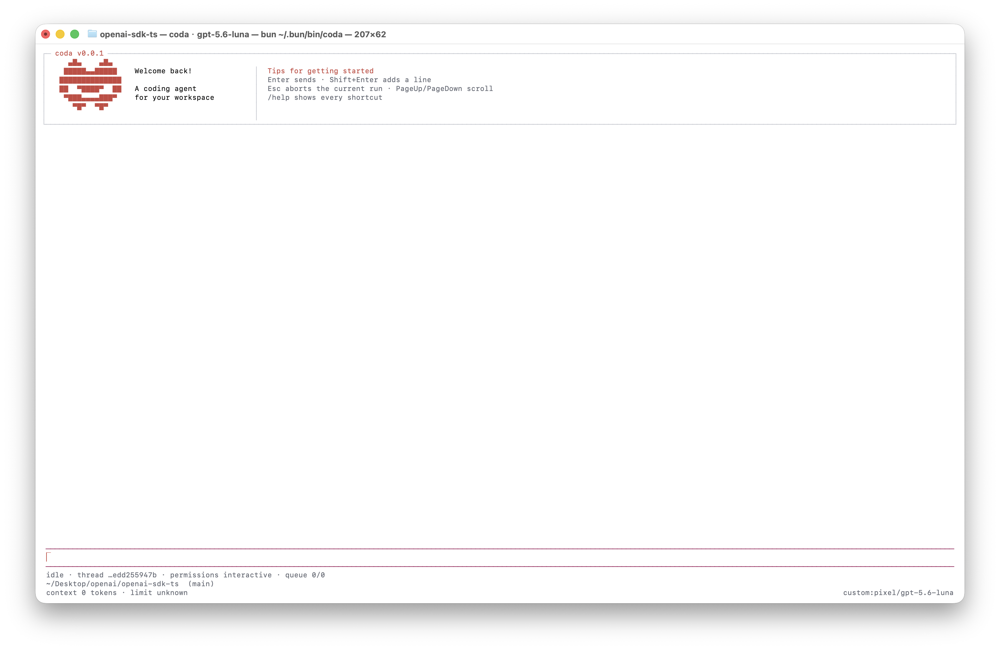
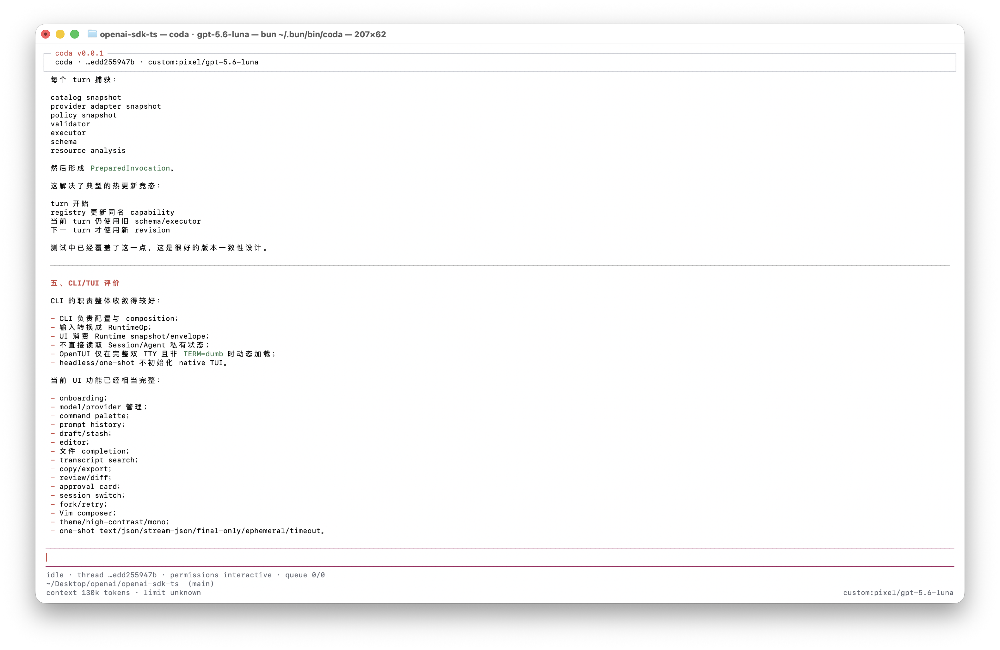
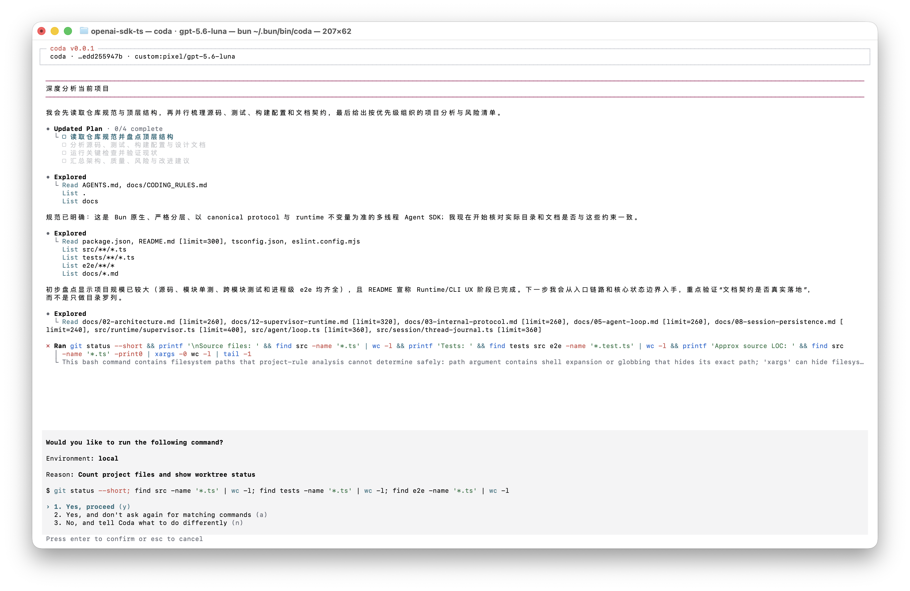

# coda

coda 是一个 TypeScript 终端 coding agent，支持流式输出、steering / follow-up、工具调用、
session 恢复和可脚本化的 headless 协议。运行时与包管理器固定为 **Bun 1.3.14**。

## 界面预览

### 首次启动



### 交互式分析



### 工具执行审批



## 安装

当前 npm package 标记为 `private`，从源码构建：

```bash
bun install --frozen-lockfile
bun run build
bun link
coda --version
```

不希望链接全局命令时，可将下文的 `coda` 替换为 `bun dist/main.js`。

`coda --help` 和 `coda --version` 是无副作用路径：它们不读配置、不创建目录、不加载 provider/OpenTUI、
不注册 signal，也不发起网络请求。

## 第一个任务

1. 保存 provider 认证：

   ```bash
   coda auth login
   ```

   一级 preset 包括 OpenCode Go、OpenAI、Anthropic 和 Custom。API key 使用不进入历史的秘密输入；
   OAuth 会明确显示 `coming soon / disabled`，当前不是可用流程。

2. 查看并选择模型：

   ```bash
   coda models
   coda models --select opencode-go/deepseek-v4-flash
   ```

   请使用 `coda models` 实际列出的 `<provider>/<model>`。保存认证不会暗中选择模型；
   选定模型之前也不会创建 thread 或 journal。

3. 发送任务：

   ```bash
   coda
   # 或一次性执行
   coda exec "检查并修复失败的测试"
   ```

交互界面中可用 `/login`、`/model`、`/auth`、`/doctor`、`/status`、`/insert-mode` 和
`/help`。
`/insert-mode` 决定运行中 Enter 的语义：`steering`（默认）调整当前 run，`following` 排队 follow-up；
idle 时 Enter 始终发送新任务。Esc 中止当前 run。
以 `/help` 为准，它只显示当前 TUI 中真实可用的键位。

## 终端界面

```bash
coda --ui=auto         # 默认：完整双 TTY 进入 OpenTUI；不满足条件时明确失败
coda --ui=tui          # 显式选择 OpenTUI；不满足条件时明确失败
coda --theme=high-contrast  # auto、light、dark、high-contrast、mono
coda --ascii           # one-shot 人类输出使用 ASCII 产品状态符号，payload Unicode 不变
```

TUI 是唯一长驻交互面。stdin/stdout 不是完整 TTY、`TERM=dumb` 或 OpenTUI 初始化失败时，CLI
恢复终端后明确报错退出，不会静默切换到另一套交互界面；脚本请使用一次性 prompt、`-p` 或 headless。
`NO_COLOR=1` 或 `--no-color` 禁用语义色，不改变业务状态和键位。

OpenTUI 首屏显示 onboarding；开始输入后收缩成紧凑任务栏，底部持续显示 phase、thread、权限、队列、
workspace/Git、context 和 model；其中权限模式来自 Runtime workspace snapshot。常用生产力入口：

- `Ctrl+K` 打开分类模糊 command palette，`Ctrl+R` 搜索当前 thread 的 prompt 历史。
- `Ctrl+O` 用 `$VISUAL`/`$EDITOR` 编辑长 prompt，`Meta+S` stash 当前 draft。
- 输入 `@路径` 后按 `Tab` 补全 workspace 文件或目录；可用 `/files [query]` 列出候选。
- `Ctrl+F` 或 `/search <query>` 搜索 transcript，`/next`、`/previous` 切换，`End` 或 `/latest` 回到最新输出。
- `/copy [latest|raw]` 复制内容；`/export [text|raw|latest] [path]` 以 0600 新文件安全导出且不覆盖已有文件。
- `/review` 展开完整 reasoning/工具参数与输出；`/diff [turn|workspace]` 打开不截断的分组 diff viewer。
- `/permissions` 查看 Runtime 权威 revision/ceiling；审批卡按 `v` 展开 capability、资源、风险和精确 scope。
- `/vim on|off` 可选启用最小 Vim composer；默认关闭，不改变现有键位。

draft、stash、搜索、Vim preference 和 OpenTUI stable scroll anchor 按 `(workspace, thread)` 保存。provider
表单拥有独立的临时输入缓冲：name/base URL 等普通字段不会覆盖任务 draft，API key 等秘密输入也不会进入
该存储、history、frame、transcript 或日志。显式 stash/restore 写盘失败时，界面保留当前 draft 并显示
错误；退出 flush 失败会报告错误并返回非零，不会伪报保存成功。一次性人类输出与 headless
分别保留用于脚本和机器调用，但都不是长驻交互界面。
尚未选模型时，draft 使用 workspace 内稳定的 pending presentation key 跨启动恢复，但不会创建 Runtime
thread 或 journal；模型选择并成功 attachment 后才迁移到真实 thread。外部编辑器运行期间原 draft 仍保留。

## 恢复会话

```bash
coda sessions
coda --continue
coda --resume=<thread-id>
coda --workspace=<workspace-id> --resume=<thread-id>
```

`sessions` 只通过 RuntimePort 列出当前 workspace 的 snapshot，不会创建 thread。
`--continue` 恢复最近会话；跨 workspace 或同名 thread 使用显式 locator。
恢复同一 thread 时还会恢复未发送 draft 与稳定滚动位置；`Ctrl+R` 历史从 canonical transcript 重建。

交互中还可以管理和切换任务：

```text
/sessions [query]          # 按状态、时间、workspace、cwd、标题和摘要搜索
/switch <thread-id>        # 切换可见任务；后台 run 不停止
/resume [thread-id]        # 恢复任务；无 id 时打开 picker
/new                       # 新建并切换
/rename <title>
/archive [on|off]
```

draft、滚动位置和未读位置按 thread 独立保存；切换页面不会停止后台任务。审批和 abort 始终只作用于当前
选中的 thread/run。`/compact` 做显式上下文压缩；`/fork [turn-id]` 复制已提交对话，`/retry [turn-id]`
在安全 fork 中重试。fork/retry 不会回滚已经发生的文件、shell、网络或外部工具副作用。

## 脚本与 CI

`--json` 是 protocol `2.0.0` 的 canonical NDJSON transport。stdin 每行必须是完整的
identity-bearing `RuntimeOp`，stdout 只写 protocol hello、`EventEnvelope`、`op_receipt` 或
`transport_error`：

```bash
coda exec --json -p "运行测试并报告结果" > events.ndjson
printf '%s\n' \
  '{"type":"thread_create","opId":"op_e_00000000000000000000000000000021","workspaceId":"workspace-script","threadId":"thread-script","model":{"provider":"faux","api":"faux","model":"faux"}}' \
  '{"type":"prompt","opId":"op_e_00000000000000000000000000000022","workspaceId":"workspace-script","threadId":"thread-script","text":"检查当前工作区"}' \
  | coda --json --workspace workspace-script
```

一次性人类可读模式也可用管道：

```bash
printf '%s\n' '解释这个仓库的测试分层' | coda
```

需要稳定终态的 automation 可选择 one-shot 输出格式；这些 flags 不改变 `--json` 的 canonical
Runtime transport：

```bash
coda exec --output=text --ephemeral "检查类型并给出结论"
coda exec --output=json --final-only --timeout=5m "运行测试"
coda exec --output=stream-json "审阅当前改动" | jq -c .
```

`--output=json` 只写一条 `result`；`stream-json` 以 `{type:"stream_start",version:2}` 开始、再按 canonical 顺序写入
`{"type":"event","envelope":EventEnvelope}` 和恰好一条 terminal `result`。其中 `envelope` 原样保留
`workspaceId/threadId/runId/turnId/opId/seq/timestamp/event`；不会把裸 event payload 或前端合成事件伪装成
Runtime 事件。终态 `status` 为 `completed|aborted|error|timeout`，timeout 退出码为 124，其他失败非零。
`--ephemeral` 不留下 Runtime/session journal；它不能与 continue/resume 组合。机器格式不混入 human
progress，text 模式的 progress 写 stderr、最终回答写 stdout。`--json` 与这些新 output flags 互斥。

失败的最终 run 返回非零退出码。人类可读诊断写 stderr，协议 stdout 不会被日志污染。

## 诊断与补全

```bash
coda doctor
coda doctor --json
coda auth status
coda completion zsh > ~/.zfunc/_coda
```

`doctor` 只读检查运行时、终端、JSON 配置、凭据权限和 Runtime 存储路径。
未知 flag 会返回稳定 usage error 与可复制的相近拼写修复命令。

## 旧式非交互配置

环境变量/flag/`~/.coda/config.json` 仍按 `flag > env > file` 兼容。例如：

```bash
export CODA_MODEL=gpt-5
export OPENAI_API_KEY='...'
coda exec -p "检查类型错误"
```

未给出 `--provider` 时，直接使用 OpenAI（未设置 base URL 或 base URL 为 HTTPS
`api.openai.com`）默认走 Responses API。自定义 OpenAI-compatible base URL 默认走 Chat Completions
兼容路径；需要固定协议时显式传入 `--provider openai-chat` 或 `--provider openai-responses`。

优先使用 `coda auth login` 的秘密输入，不要把真实 key 写进 shell history、prompt、日志或仓库。

## 开发

```bash
bun run check   # lint + typecheck + build + unit/e2e
git diff --check
```

`bun.lock` 是唯一依赖锁文件；CI matrix 配置为 Linux 与 macOS。当前 workflow 的已知边界检查缺口
见[测试文档](docs/10-testing.md)，修复前不把远端矩阵表述为稳定全绿，
也不把现有 rg 回归测试表述为已证明一定选中了 `@vscode/ripgrep` 的 bundled platform binary。
Runtime 与 CLI UX 已全部进入当前基线，项目目前处于完成后的维护、加固与 surface 收敛
阶段，没有进行中的编号里程碑。分层和产品契约见 [docs/README.md](docs/README.md)，完成记录、
当前兼容边界与尚未立项的后续范围见 [docs/11-roadmap.md](docs/11-roadmap.md)。

## 许可证

本项目以 [MIT License](LICENSE) 发布。
