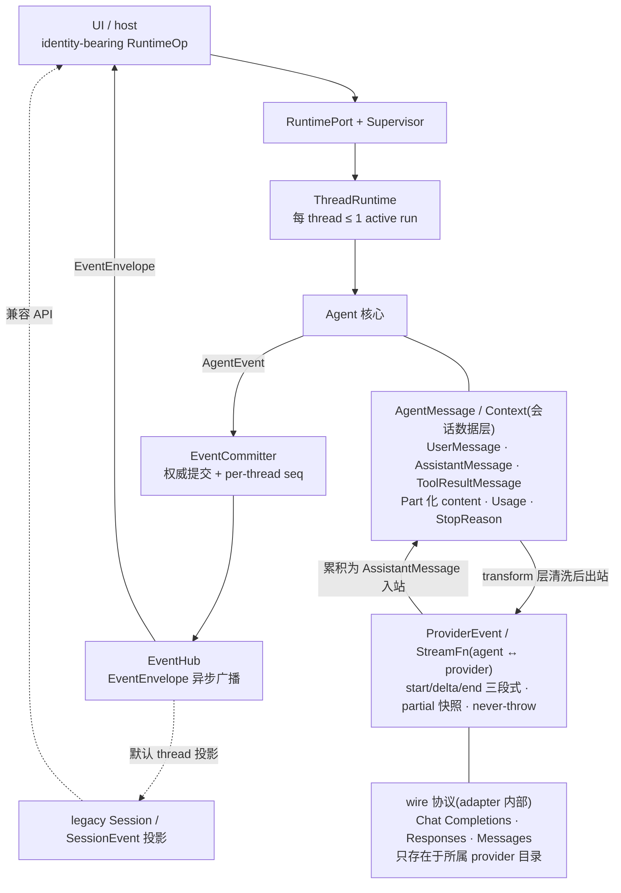

[← 返回地图](./README.md)

# 01 · 目标与总览

本篇回答四个问题:我们在做什么(需求的工程化表述)、为什么这样做(关键决策与参考项目的经验教训)、用什么做(技术选型)、明确不做什么(非目标)。后续所有文档的设计都能回溯到本篇的某条决策;反过来,如果某篇文档的设计无法回溯到这里,说明其中一边需要修订。

> **当前基线：**Runtime 阶段 0–3 与 CLI UX0–UX4 均已完成。进程级“单 Agent”约束已由
> [12 · Supervisor、多线程 Runtime](./12-supervisor-runtime.md)取代；canonical 运行时允许多个独立
> thread 并发，每个 thread 仍至多一个 active run。TUI 一次显示一个 attachment，但已经支持
> session picker、thread switch 和后台 run；classic/line REPL 已退役。

## 1. 项目是什么

**coda** 是一个 TypeScript 终端 coding agent（当前 private package 与 bin 均名为 `coda`）。形态上
是一个单进程 CLI：OpenTUI 是唯一长驻交互面，另保留 one-shot 人类输出与 headless `--json` 模式；
能力上覆盖一个可日常使用的 coding agent 的最小完整集——流式对话、八个内置工具、运行中消息
注入、会话持久化与恢复，以及 Runtime-backed 的审阅、切换、压缩、fork/retry 工作流。

一次典型会话的样子:

```
$ coda
> 把 src/utils 里所有默认导出改成具名导出
  [assistant 流式输出分析]
  [tool] grep pattern="export default" path=src/utils     → 6 matches
  [tool] read src/utils/format.ts                          → 80 lines
  [tool] edit src/utils/format.ts (1 edit)                 → ok
  ...
  (用户在工具执行期间输入并回车:"顺便把对应的 import 也改了" → 显示 QUEUED 徽标,
   当前 turn 的工具跑完后作为 steering 消息注入,agent 继续)
  [assistant] 全部完成:6 处导出与 14 处 import 已更新。
```

它不是又一个「调 OpenAI SDK 的壳」。项目的立身之本是三条核心需求,每一条都有机械化的验收方式。

## 2. 三条核心需求的工程化表述

### 需求 1:协议隔离

> 用户原话意图:不想被 OpenAI 的类型绑架;换 provider 不应该动核心代码。

工程化表述:

- 生产 `src/` 中，OpenAI Chat Completions、OpenAI Responses 与 Anthropic Messages 的一切 wire
  类型**只允许出现在各自的 `src/providers/openai-chat/`、`src/providers/openai-responses/`、
  `src/providers/anthropic-messages/` 目录内**；三个 adapter 互相隔离，`openai` 与
  `@anthropic-ai/sdk` 在各自白名单外被 import 都是 ESLint 错误。手动 fixture recorder 是
  `scripts/` 下明确注释、非运行时的受审计例外。
- agent 核心只认内部协议:`AgentMessage` / `Context` / `ProviderEvent` / `StreamFn`(见 [03 内部协议](./03-internal-protocol.md))。Agent 通过构造参数注入 `StreamFn`,自身不 import 任何 providers 目录。
- **新增 provider = 新增一个 adapter 目录,核心零改动。**

验收方式:`tests/boundaries.test.ts` 用 ESLint 探针同时验证 core 禁止 SDK、OpenAI/Anthropic adapter
白名单与 provider 互相隔离；接入新 adapter 时 `src/agent` 与工具执行逻辑零 diff。

为什么要机械强制而不是靠纪律:opencode V1 依赖 Vercel AI SDK,第三方类型渗入核心签名后,积累出 1832 行 per-provider 的 ProviderTransform 补丁;SDK 大版本改 usage 口径时全链路返工,最终被迫自建 `@opencode-ai/llm`。教训是:**第三方 SDK 类型一旦出现在 core 签名中,隔离就已经失败**,必须从第一天起用 lint 规则封死,而不是等重构时再补。

### 需求 2:steering / following 双队列

> 用户原话意图:agent 干活时我想插话修正方向,但不想打断它正在跑的工具;有些话则希望等它彻底干完这件事再说。

工程化表述(精确语义见 [06 Steering / Follow-up](./06-steering-following.md),此处为总纲):

- **steering 队列**:随时可入队;在每个 turn 结束后(当前 assistant 的全部 tool calls 执行完)注入为 `source: 'steering'` 的 UserMessage,并使内层循环继续——即使 assistant 没有再发起工具调用,只要 steering 队列非空,agent 就不结束。
- **follow-up 队列**:随时可入队;只在 agent 本来要结束(无 toolCall、无 steering)时被 poll,有则开新 turn 续跑,无则 `agent_end`。
- 两队列默认 one-at-a-time drain(每个注入点只取最老一条),可切 all。
- 硬打断是另一条独立通道 `abort()`,与队列语义正交;`prompt()` 在运行中直接 throw,强制入口二选一。
- CLI 键位固化这套语义:流式期间 **Enter = steer,Alt+Enter = followUp,Esc = abort**。

验收方式:转录中 steering 消息永远出现在其注入 turn 的 toolResults 之后;正在执行的工具从未因 steering 被跳过;run 内消费 follow-up 是外层循环续跑,不发新 `agent_start`,验收看转录中出现 `source: 'follow_up'` 的 user 消息且其间无 `agent_end`;仅 session 层 `continue()` 消费残留 follow-up 队列时,新 run 的 `agent_start.reason` 为 `follow_up`。

这套语义是 pi-mono 的注入点设计与 codex 的 pending_input 队列的合流:pi-mono 证明了「turn 边界是唯一安全注入点」(不打断工具就不产生悬空 toolCall);codex 证明了「follow-up 约束由 core 保证、客户端无感」的分层是对的;opencode V2 的 promoteSteers / promoteNextQueued(在 Safe Boundary 原子提升)是同一语义的第三方独立实现——三个项目殊途同归,说明这是稳定的设计收敛点,不是我们的发明冒险。

### 需求 3:完整工具集

> 用户原话意图:read、ls、grep、glob、bash、edit、write、plan 一个不少,每个都要达到可日常使用的质量。

工程化表述：八个工具的既有实现保留 `ToolDefinition`（zod 校验）；阶段 3 由 legacy adapter 在注册
时一次性生成 JSON Schema，并把 schema/validator/executor 原子放进 CapabilityRegistry。模型看到
与执行期使用的是同一 turn snapshot。行为规格逐一写死在 [07 工具集](./07-tools.md)：

- read:offset/limit(1-indexed)、行号前缀、二进制检测、图片走 ImagePart、登记 FileTracker;
- grep:调 ripgrep 二进制,达 limit 即 kill;glob:mtime 排序,24h 内修改的排最前;
- bash:每次 spawn 新进程、detached 进程组、尾部截断、onUpdate 节流流式输出;
- edit:精确匹配优先 + 零风险 fuzzy + 唯一性校验 + read-before-edit 硬约束 + unified diff;
- plan:todo 型整表替换,发 `plan_update` 事件。

截断策略(2000 行 / 50KB / 超限落盘 / 可执行续读提示)是框架级 post-hook,不允许各工具自行发明口径。

验收方式:每个工具在 07 中有独立验收清单;「可日常使用」的操作定义是——用 coda 完成一次真实的多文件重构任务,全程不需要用户替工具擦屁股。

## 3. 关键架构决策表

每条决策 = 一个可被挑战的选择。「佐证」列指向参考项目中的正面经验或反面教训(仓库清单见 [README](./README.md))。

| # | 决策 | 为什么 | 佐证 |
|---|---|---|---|
| D1 | 生产 provider SDK 只允许出现在所属 adapter；`openai` 白名单为 `openai-chat` / `openai-responses`，`@anthropic-ai/sdk` 白名单为 `anthropic-messages`，ESLint 机械强制且 provider 互相隔离 | 协议隔离靠工具链而非纪律;类型渗入核心签名后返工成本随代码量线性增长 | opencode V1 → 1832 行 ProviderTransform 的返工史 |
| D2 | Provider 接口 = 单个函数类型 `StreamFn`,注入给 Agent,核心不 import providers | 最小接口面;新增 provider 零核心改动;测试注入 faux provider 即可离线跑全部 loop 逻辑 | pi-mono 的 agent-core 只依赖 StreamFn;vercel/ai 的 `doStream` 同构 |
| D3 | **StreamFn never-throw 铁律**:一切失败编码为流内 `error` 事件 + `stopReason: 'error' \| 'aborted'` 的 AssistantMessage | agent loop 零 try/catch 处理 provider 差异;错误路径与正常路径共用同一数据形状 | pi-mono 的 StreamFunction 铁律 |
| D4 | 错误 / 中止是转录的一等公民:aborted / error 的 AssistantMessage 保留在会话中 | 转录永远完整可回放;重试、UI、统计共享同一事实源 | pi-mono;opencode 的中断收尾纪律(悬空 tool_use 必补 result) |
| D5 | ProviderEvent 采用三段式 start / delta / end + `contentIndex` + 每事件携带 partial 快照 | 增量渲染与快照消费两种模式统一;新消费端无需重放 delta 即可拿到当前状态 | pi-mono 13 事件协议;codex 的 Item* + delta 三层;vercel/ai 块级三段式 stream part |
| D6 | steering 在 turn 边界注入、绝不打断执行中的工具;follow-up 仅在任务将结束时消费 | 打断工具执行会产生悬空 toolCall 与不可控副作用;turn 边界是转录合法性可证明的唯一注入点 | pi-mono 注入点语义;codex pending_input;opencode V2 Safe Boundary |
| D7 | 硬打断只有 `abort()`,配 transform 层出站清洗(过滤 aborted 消息、补孤儿 toolResult) | Chat Completions 对 `tool_calls`/`tool` 配对是硬校验,缺一条即 400;修复集中在出站前一处做 | openai-node 配对硬规则;pi-mono transform-messages |
| D8 | adapter 手写 `for await` 消费 `create({stream:true})`,不用 SDK 的 `.stream()` helper | helper 事件粒度为终端用户设计,且 strict 模式下 `length` / `content_filter` 直接 throw,与 D3 冲突;但其 tool_calls 累积算法与 id 兜底值得移植 | openai-node `ChatCompletionStream.ts` 调研结论 |
| D9 | Chat Completions 方言差异全部声明化为 `CompatFlags`(按 baseURL 推断 + 显式覆盖) | if/else 散落各处不可枚举不可测;声明化后支持新方言 = 加一组开关 + 一组 fixture | pi-mono 的 OpenAICompletionsCompat 十余项开关 |
| D10 | 工具参数校验失败**不终止 loop**:合成「请修正参数」的 isError 结果回喂模型;未知工具名同理 | 模型有自我修正能力;终止 loop 把可恢复错误升级成任务失败 | opencode 的 InvalidArgumentsError 回喂模式;pi-mono prepare 阶段语义 |
| D11 | grep / glob 依赖 ripgrep 二进制(`@vscode/ripgrep`),不自实现搜索 | 性能与 .gitignore 语义免费获得;全行业无一自实现 | opencode / pi-mono / gemini-cli / codex 横向调研共识 |
| D12 | edit = 精确 indexOf 优先 + 仅零风险 fuzzy(NFKC、行尾空白、智能引号归一化,命中后按行 overlay 保留原始字节);拒绝编辑距离类模糊匹配 | 编辑距离匹配会静默改错代码,风险不可审计 | pi-mono 归一化 overlay;opencode disproportionate 防呆;aider 作者亲手将 fuzzy 匹配变成死代码的反例 |
| D13 | read-before-edit 做成**硬约束**:FileTracker 登记 `{path → mtime}`,edit/write 覆盖时未读过或磁盘变新即报错 | 消除「覆盖用户手改」这一整类事故;prompt 层声明被证明不可靠 | Claude Code 是唯一真正强制的项目;opencode / gemini-cli 的弱形态是反面参照 |
| D14 | 统一截断(2000 行 / 50KB 双上限 + 超限落盘 + 可执行续读提示)是框架级 post-hook | 各工具自行截断必然口径漂移;落盘 + `Use offset=N to continue` 让模型可自主续读 | opencode / pi-mono 同款常量与落盘策略 |
| D15 | bash 每次 spawn 新进程(detached 进程组 + killProcessTree),v1 无持久 shell | 持久 shell 的状态泄漏与清理复杂度远超收益;`workdir` 参数替代 cd | 四个参考项目全部如此;codex 式交互长任务留作 v2 |
| D16 | **每线程单 active run，Supervisor 管理独立线程；子 Agent 是 thread，不是工具** | 保留单转录/单循环的可调试性，同时把并发隔离在 thread 边界；父子线程不共享可变状态，结果走 durable `thread_result` event（宿主可显式汇入摘要），不是 mailbox/control | codex 的任务隔离与可序列化边界；pi-mono AgentSession 巨类说明编排必须外移 |
| D17 | thread 存储采用追加式 JSONL：转录、compaction、mailbox/control 与 event seq high-water 同属一个恢复边界；旧 v1 message-only 文件继续可读 | append-only 天然崩溃安全；恢复可同时守住事实转录和 per-thread 顺序，且不破坏已有会话 | opencode durable inbox；codex 可序列化边界 |
| D18 | CLI 运行于 Bun 1.3.14，作为 RuntimePort 的参数/configuration 与前端 adapter；默认 headless 继续吐裸 NDJSON SessionEvent，显式模式输出 envelope/receipt transport frames | public Runtime 可无 TTY 嵌入；OpenTUI 懒加载，legacy 外协议不被静默击穿 | codex 的 submit/next_event 边界；Claude Code 固定 composer；pi 的双队列键位语义 |
| D19 | Usage 口径 inclusive:`input` 含 cacheRead/cacheWrite,`output` 含 reasoning;换算由各 adapter 完成 | 消费方永不做减法;跨 provider 口径统一收敛在一处 | opencode 从第一天定双轨口径的经验(nonCached+cacheRead+cacheWrite=input 恒等式) |
| D20 | `stopReason === 'length'` 且有 toolCall 时,全批合成错误结果、一律不执行 | 截断的 arguments 可能是恰好通过 schema 校验的非法参数,执行等于按脏数据办事 | openai-node:length 时 arguments 禁止盲目 parse;pi-mono 同款分支 |

### 四条决策的展开

**D3(never-throw)是整个错误模型的支点。**StreamFn 的两个终结事件(引自 canonical 定义):

```ts
  | { type: 'done';  message: AssistantMessage }    // stopReason ∈ stop | length | tool_calls | content_filter
  | { type: 'error'; message: AssistantMessage };   // stopReason ∈ error | aborted
```

网络断连、429、in-band 流内错误、用户 abort——全部走 `error` 事件,附带一条 stopReason 为 `error` / `aborted` 的 AssistantMessage(含 errorMessage、已累积的 partial content、已收到的 usage)。于是 D4(错误入转录)、D7(transform 修复)、08 的 auto-retry 都在同一数据形状上工作;agent loop 里没有任何一处 `try { stream } catch`。这是从 pi-mono 原样继承的设计,他们用它消灭了整类「provider 异常绕过状态机」的 bug。

**D6(注入点)决定了转录的合法性可以被证明。**runLoop 的骨架(完整版见 [05 Agent 循环](./05-agent-loop.md)):

```
pendingMessages = drainSteering()          // 起跑前 poll 一次
外层 while(true):                           // follow-up 续命
  内层 while(hasMoreToolCalls || pendingMessages.length > 0):
    turn: 注入 pendingMessages → assistant 流式 → 执行全部工具
    pendingMessages = drainSteering()      // steering 注入点:turn 边界
  followUps = drainFollowUp()              // follow-up 注入点:任务将结束
  if followUps 非空: pendingMessages = followUps; continue
  break
```

steering 只在两次 provider 请求之间落地,而 Chat Completions 无服务端状态、messages 全量由客户端渲染,因此 turn 间插入用户消息零成本、永远合法(openai-node 调研确认)。任何「流式中途注入」的方案都做不到这一点。

**D9(CompatFlags)是「OpenAI 兼容」这个谎言的解药。**号称 OpenAI-compatible 的服务在 max_tokens 字段名、developer role、流式 usage、strict tools、reasoning 扩展字段、tool 结果格式等十余个维度各行其是。pi-mono 的经验是:把每个差异做成一个可声明的开关,按 baseURL 给默认值、允许 per-model 覆盖,则「支持某家服务」变成填一张配置表 + 录一组 fixture,而不是在转换代码里再挖一层 if。完整开关清单在 [04 Provider 与 adapter](./04-provider-adapter.md)。

**D13(read-before-edit 硬约束)是工具集里唯一「反模型」的设计,值得单独辩护。**其他决策都在帮模型把事办成,这条却在拦它:edit / write 覆盖已有文件前,FileTracker 必须查到「本会话读过该文件,且磁盘 mtime 未变新」,否则直接报错让模型先 read。代价是偶尔多一次 read 调用;换来的是消灭「模型凭旧记忆改文件、覆盖用户刚保存的手改」这一整类最伤信任的事故。横向调研里只有 Claude Code 真正强制(opencode 停留在 prompt 层声明,gemini-cli 只在自修复路径做 hash 检测),而恰恰是 Claude Code 的口碑证明了这笔交换是划算的。报错文案要给模型指路(「Read the file first / File changed on disk since last read」),使其一次工具往返即可自愈——这与 D10 的回喂哲学一致。

## 4. 四层类型体系(一页图)

整个系统的类型分层与转换链(canonical,02/03 文档展开):

兼容命令下行仍可观察为 **UI → Session 门面 → Agent**，但 canonical 下行是
**UI/host → RuntimePort → Supervisor → ThreadRuntime → Agent**；事件上行先由每线程
`EventCommitter` 包成 `EventEnvelope`，再经 `EventHub` 异步广播。旧
`AgentEvent → SessionEvent → UI` 是默认 thread 的兼容投影。会话与 provider 的数据转换链仍是
**AgentMessage/Context → ProviderEvent/StreamFn → wire 协议(adapter 内部)**，且每次调用只属于
一个 Workspace/Thread/Run/Turn。完整身份与依赖图见 [12](./12-supervisor-runtime.md)。



阅读方式:上三层是「agent 的世界」,最底层是「某家 API 的世界」,两个世界只在 adapter 内部相遇。三条核心不变式:

- **wire 类型不上行**:`ChatCompletion*` 只存在于最底层,向上只暴露 ProviderEvent 与 AssistantMessage(D1/D2)。
- **thread journal 是恢复事实边界**：AgentMessage 是转录事实；mailbox/control 与 seq high-water
  作为独立记录同属该 thread，EventHub/UI 只是可重建投影(D17)。
- **每层转换都可独立测试**：RuntimeOp ↔ EventEnvelope 用 faux/gate 测，legacy projector 与
  SessionEvent 做黄金对比，AgentMessage ↔ wire 用 SSE fixture 测(见 [10 测试策略](./10-testing.md))。

其中 provider 接口的 canonical 形态(逐字引用,完整定义见 [03](./03-internal-protocol.md)):

```ts
export type StreamFn = (model: ModelConfig, context: Context, options?: StreamOptions) => ProviderEventStream;
```

## 5. 技术选型及理由

| 选型 | 版本/形态 | 理由 |
|---|---|---|
| TypeScript | 6.x,strict 全开 | discriminated union 是整套协议(ProviderEvent / AgentEvent / StopReason)的载体;strict 下的 narrowing 即文档 |
| Bun | 1.3.14 | 项目唯一运行时与包管理器;原生 TypeScript、fetch、Web Streams、AbortSignal、测试与构建工具链统一 |
| 模块格式 | ESM | 生态方向;`Bun.build` 直接产出 Bun-targeted ESM,不反向补 CJS |
| `openai` | ^6（生产 `src/` 仅两个 OpenAI adapter；手动 recorder 例外） | Chat Completions 与 Responses 各自使用 SDK 的请求/SSE/错误层；两套 wire 类型不跨 adapter，`maxRetries` 交给 SDK 默认，整轮重发仍在 session 层 |
| `@anthropic-ai/sdk` | ^0.115（生产 `src/` 仅 Messages adapter；手动 recorder 例外） | Messages 请求、事件与 SDK 错误只在 adapter 内转换为内部协议；exclusive usage、thinking signature 与 `/v1` base URL 兼容也在该层收敛 |
| zod | v4 | legacy 工具 validator；注册时一次性 `z.toJSONSchema()`，随后 canonical 事实源是同一 registration/snapshot 中绑定的 JSON Schema、validator 与 executor |
| `bun:test` | 1.3.14 内置 | 与运行时同版本、fixture 回放与异步迭代器断言无需额外测试运行器 |
| `Bun.build` | 1.3.14 内置 | 显式 `target: 'bun'`、ESM 与 external package 策略产出 bin,不引入额外 bundler |
| ripgrep | `@vscode/ripgrep` + PATH fallback | `resolveRgPath()` 优先解析 bundled platform binary，解析失败时回退 PATH 中的 `rg`；不自实现搜索(D11) |
| ESLint | flat config + `import/no-restricted-paths` | D1 的 SDK/provider 隔离与关键层间边界已机械化；完整覆盖和已知 internal-path gap 见 [02 §3.3](./02-architecture.md) |
| CLI 渲染 | `@opentui/core` 0.4.x + one-shot human renderer | 见 D18；完整双 TTY 的唯一交互分支使用 alternate screen、ScrollBox、Textarea、Markdown；脚本与 headless 分支不加载 native 包 |

目录结构与依赖方向的完整规则（`protocol/shared` 为叶子，`agent` 消费 capability snapshot，
`runtime` 管理 Supervisor，CLI 只走 RuntimePort）是 [02 架构与分层](./02-architecture.md) 的主题。

### Bun-native compatibility 边界

项目命令、依赖安装、测试、构建与进程启动统一使用 Bun 1.3.14；普通文件内容 I/O、哈希、进程与流默认使用 `Bun.file` / `Bun.write`、`Bun.CryptoHasher`、`Bun.spawn` 与 Web Streams。Bun 官方暂未提供覆盖现有语义的等价接口时，允许以下受控 compatibility 边界：`node:fs` / `node:os` 用于目录、元数据、临时目录、符号链接，以及要求同步顺序或耐久性的配置/会话/审批 append、fsync、truncate 与落盘操作；路径处理使用 `node:path`；headless NDJSON 与 CLI 单次问答可保留 readline；工作目录、TTY 探测、进程退出、信号与 POSIX 进程组收尾保留 `process` compatibility API。长驻交互只由完整双 TTY、非 dumb 终端上的 OpenTUI 管理 raw TTY；初始化失败先清理终端再明确报错退出，不存在交互前端 fallback。除此之外不得新增 Node 专属依赖。这里的 “Bun-native” 指 Bun 是唯一要求安装的运行时，不表示代码必须做到零 Node API。

同样重要的是**明确不引入的依赖**,每条都对应一次别人踩过的坑:

- **Vercel AI SDK(运行时依赖)**:只当参考实现读,不 import——opencode V1 的 1832 行返工是直接反例;
- **zod-to-json-schema**:zod v4 原生 `z.toJSONSchema()` 已覆盖,少一个随 zod 大版本漂移的桥接件;
- **Ink / React 系 TUI**:不引 React reconciler；当前 OpenTUI imperative renderable 消费
  `RuntimeFrontendSession` 从 Runtime snapshot/EventEnvelope 归约出的 presentation，不另建业务事实源(D18);
- **execa / shelljs 类包装**:bash 工具由 `Bun.spawn` 建 detached 进程组并精确控制 killProcessTree；仅信号/PGID 收尾落在上述 compatibility 边界;
- **自研 SSE 解析**:`openai` 包的流解析与错误分类已经过实战,adapter 站在它上面做事件翻译即可(D8 只是不用它的高层 helper,不是不用它的传输层)。

## 6. 从参考项目「取」与「不取」

决策表按主题组织,这里按项目再切一刀,方便核对我们对每个参考项目的态度是自洽的:

| 项目 | 取 | 不取 |
|---|---|---|
| pi-mono | agent loop 双层循环、StreamFn 与 never-throw、注入点语义、compat 声明化、edit 归一化 overlay、截断常量 | AgentSession 单类 3300 行的揉合(我们把 session / loop / 队列分层);事件监听 await 串行阻塞 loop(我们让渲染订阅不背压 loop) |
| opencode | 权限系统形态、durable inbox、截断落盘、usage inclusive 口径、中断收尾纪律、todo 行为规范 | 把 server/client 作为 core 前提；依赖第三方 SDK 类型(其 V1 教训正是 D1 的来源) |
| codex | 可序列化命令/事件边界(headless 模式的精神来源)、pending_input 双语义、approval 决策语义、update_plan 工具形态 | 极小工具面 + apply_patch freeform grammar——该路线依赖 Responses API 的 custom tool grammar,走 Chat Completions 普通 function calling 时 patch 语法错误率上升 |
| vercel/ai | LanguageModelV3 接口范式(佐证 D2)、openai-compatible 的流式状态机与消息折叠实现(adapter 施工参考) | 作为运行时依赖引入(见 opencode V1 教训) |
| gemini-cli | 工具显式状态机（approval 建模参考）、tree-sitter-bash 命令解析、grep 少量命中自动附 context、glob 的 24h mtime 置顶 | 其框架与配置体系整体 |
| openai-node | tool_calls 按 index 累积算法、id 缺失兜底 `call_<uuid>`、finish_reason 语义表、错误分类与网络重试、strict schema 子集、回放白名单渲染 | `.stream()` helper 与 Runner 抽象(事件粒度与错误策略同 D3/D8 冲突) |

## 7. 非目标:v1 明确不做的事

「不做」与「做」同等重要——参考项目里最贵的教训(opencode 的 SDK 返工、pi-mono 的巨类)都来自范围失控。原 M0–M7、Runtime 0–3 与 CLI UX0–UX4 均已成为历史实现基线，完成记录见
[11](./11-roadmap.md)。下表列出当前基线仍明确不交付的产品能力：

| 非目标 | 说明 | 去向 |
|---|---|---|
| 并排多线程与父/子 Agent 调度 UX | TUI 已有 session picker、thread switch、per-thread draft/未读与后台 run；尚无并排视图、父子拓扑页或子 Agent 调度面 | 后续 UI |
| 独立 TUI client / server 化 | v1 的 OpenTUI 与 Session 同进程;headless NDJSON 已保留未来拆进程的稳定边界 | v2 |
| 持久 shell / 交互式长任务 | bash 每次 spawn 新进程(D15);codex 式 `exec_command` + `write_stdin`(session_id + yield_time_ms)另立工具 | v2 |
| server / client 分离(HTTP API 多客户端) | opencode 的方向;v1 的 headless `--json` NDJSON 已覆盖「协议可对外」的验证需求 | v2 |
| MCP capability 接入 | CapabilityRegistry 允许外部来源，但阶段 3 只迁移现有内置工具/provider adapter | 后续 |
| 结构化输出(强制 StructuredOutput 工具注入) | opencode 的跨协议做法,依赖工具框架成熟 | v2 |
| 文件副作用级 checkpoint / undo | `/fork`、`/retry` 与 manual compact 只处理已提交对话；不会回滚已经发生的文件、shell、网络或外部工具副作用 | 后续 |
| Windows 全面验证 | edit 的 CRLF / BOM 剥离-匹配-还原 v1 即有(硬需求),但 CI 矩阵与全工具链验证推后 | v2 |

划界原则：当前已完成基线提供可嵌入 Runtime、线程隔离、事件权威提交、版本一致的 registry/policy
和单 attachment 的多 thread 工作流；表中后续产品能力只要求现有边界不堵死，不提前增加实现复杂度。

## 8. 持续验收总纲

细化的完成状态见 [11 路线图](./11-roadmap.md) 与 [10 §9](./10-testing.md)。以下空复选框是相关改动
每次都要重新执行的回归模板，不表示当前阶段未完成：

- [ ] 协议隔离:生产 `src/` 的 OpenAI SDK 只出现在两个 OpenAI adapter，Anthropic SDK 只出现在 Messages adapter；手动 recorder 仅为带局部说明的非运行时例外；ESLint 边界规则与探针测试在 CI 强制，wire 类型不进入 protocol/agent。
- [ ] steering:流式期间 Enter 注入的消息在当前 turn 的工具全部执行完后进入 context(转录中可见 `source: 'steering'` 且位于 toolResults 之后);正在执行的工具从未被跳过;steering 使无 toolCall 的 assistant 之后循环继续。
- [ ] follow-up:仅在无 toolCall 且 steering 队列为空时被消费;run 内消费是外层循环续跑,不发新 `agent_start`(转录中出现 `source: 'follow_up'` 的 user 消息且其间无 `agent_end`);仅 session 层 `continue()` 消费残留 follow-up 队列时,新 run 的 `agent_start.reason` 为 `follow_up`。
- [ ] abort 后转录合法:任意时刻 Esc,下一次请求 Chat Completions 不出现 400(tool 配对由 transform 层修复);aborted 消息保留在 JSONL 中。
- [ ] 八个工具全部通过各自验收清单([07](./07-tools.md)),包括 edit 的 read-before-edit 硬约束与 fuzzy 零风险层。
- [ ] headless 模式:`--json` 下 stdin 注入 {prompt|steer|follow_up|abort} 四类命令,stdout 的 NDJSON SessionEvent 可被外部程序完整驱动一次多 turn 会话。
- [ ] 全部 loop / steering / 工具测试不依赖网络(faux provider + fixture 回放)。
- [ ] 错误模型闭环:kill 掉网络 / 塞入 in-band error fixture / 任意时刻 abort,agent 进程不崩溃,转录中出现对应 stopReason 的 AssistantMessage,且 `continue()` 可恢复。
- [ ] `stopReason === 'length'` 且含 toolCall 的响应,批内工具零执行、全部收到合成错误结果(D20 的可观测验证)。
- [ ] 当前 private package 从源码执行 `bun install --frozen-lockfile && bun run build && bun link` 后，
  `coda` 可直接启动全屏 TUI；构建产物含 Bun shebang，运行时基线固定为 Bun 1.3.14，并解析当前平台
  OpenTUI native optional package。发布到 registry 不是当前已交付承诺。
- [ ] Runtime 隔离:同一 thread 不得并发两个 run；不同 thread 可并发，任一 thread 的 mailbox、取消、审批、转录与事件 seq 不影响其他 thread；子 Agent 以独立 thread 存在而非工具结果。
- [ ] 兼容投影:旧 `Session` 与默认 headless raw `SessionEvent` 行为保持；canonical public Runtime 输出带 Workspace/Thread/Run/Turn/Op 身份和 per-thread seq 的 `EventEnvelope`。

## 相关文档

- [02 架构与分层](./02-architecture.md) —— 目录结构与依赖规则如何机械化落实 D1/D2
- [03 内部协议](./03-internal-protocol.md) —— 四层类型体系中间三层的 canonical 定义
- [06 Steering / Follow-up](./06-steering-following.md) —— 需求 2 的精确语义与边界情况
- [11 路线图](./11-roadmap.md) —— 阶段 0–3 的串行门禁、交付与验收
- [12 Supervisor、多线程 Runtime](./12-supervisor-runtime.md) —— D16 新基线、身份、mailbox、权限与兼容矩阵
