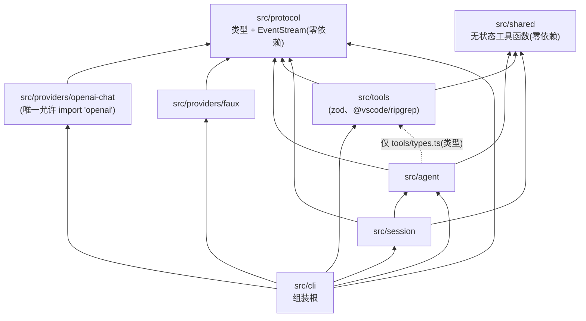
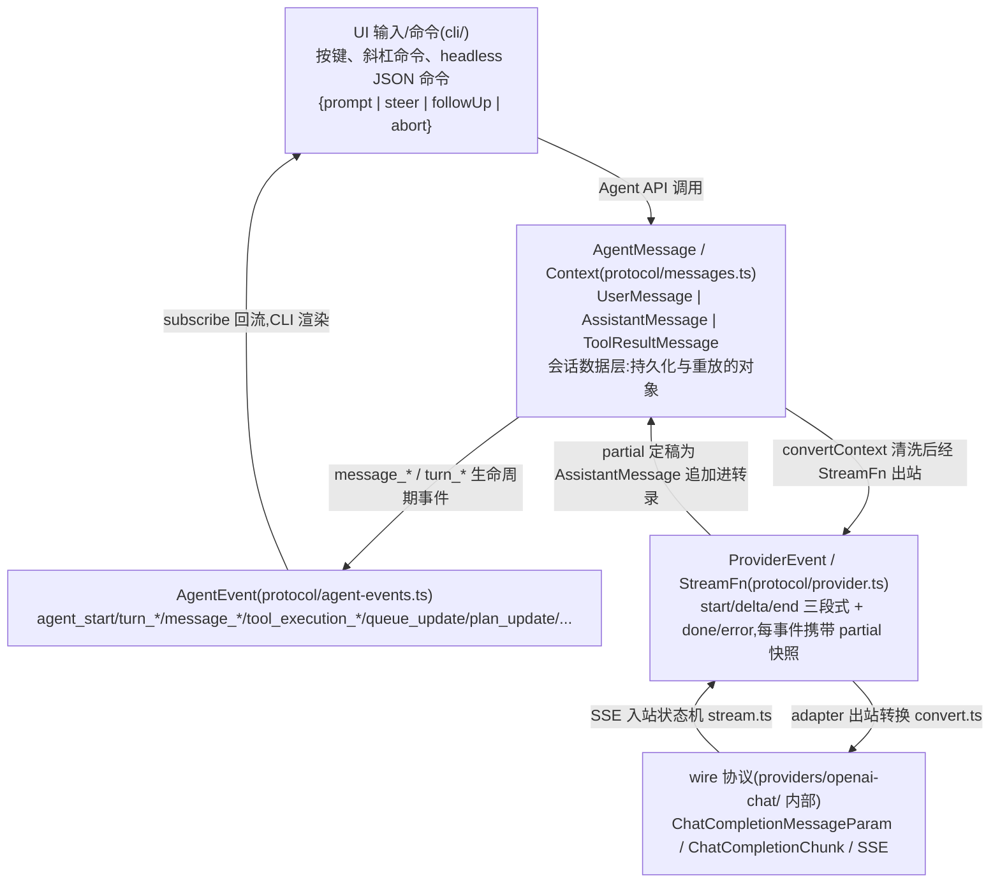
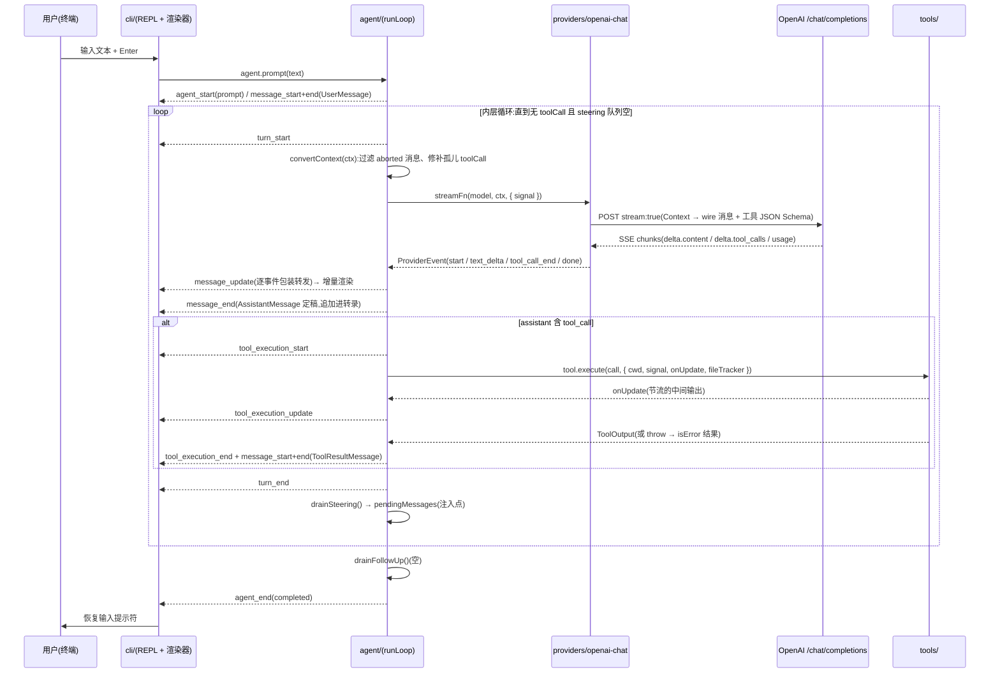

[← 返回地图](./README.md)

# 02 系统架构:目录结构、分层依赖、四层类型体系与数据流

本篇回答三个问题:代码放在哪(目录结构与职责)、谁允许依赖谁(分层规则以及如何用 ESLint 把规则变成编译期硬约束)、数据如何流动(四层类型体系 + 一次完整交互的时序)。最后给出与 codex / opencode / Claude Code / gemini-cli 的架构对比,解释 v1 为什么裁剪成"单进程、进程内协议",以及未来如何无痛演进到 server 化。

## 1. 架构总览:三条设计原则

整个架构由三条原则推导而来,后文所有结构都是这三条的机械展开:

1. **协议隔离(需求 1)**:`openai` 包及其一切类型只存在于 `src/providers/openai-chat/` 内。agent 核心只认识内部协议(`AgentMessage` / `ProviderEvent` / `StreamFn`)。这不是口头约定,而是 ESLint 规则——违规直接 lint 失败(见第 3 节)。
2. **事件驱动、单向数据流**:所有跨层通信都是 discriminated union 事件(`ProviderEvent`、`AgentEvent`),全部 JSON 可序列化。UI 从不直接读 agent 内部状态,只消费事件;agent 从不感知 UI 存在,只广播事件。
3. **单进程、单 Agent、单 active run**:v1 不做跨进程协议、不做 server/client 分离、不做多 agent 并发。这是刻意裁剪(理由见第 6 节),但所有类型设计都为未来 server 化留了门。

参考项目对这三条的佐证:opencode V1 因为让 Vercel AI SDK 的类型渗入 core 签名,最终背上 1832 行 per-provider 的 ProviderTransform 补丁,SDK 大版本升级时 usage 口径变化引发全链路返工,被迫自建 `@opencode-ai/llm`——教训是**第三方 SDK 类型必须从第一天起被机械手段挡在 core 之外**。Claude Code 则用"一个主线程 + 一份扁平消息列表"证明了单进程单循环的 debuggability 价值,官方明确以此为由拒绝 multi-agent swarm。

## 2. src/ 目录结构与职责

目录结构为 canonical:

```
src/
  protocol/        # 内部协议类型 + EventStream。零运行时依赖;禁止 import 任何 provider SDK
  providers/
    openai-chat/   # Chat Completions adapter(唯一允许 import "openai" 的目录)
    faux/          # 脚本化测试 provider
  agent/           # Agent 类、runLoop、队列、工具执行调度
  tools/           # read/ls/grep/glob/bash/edit/write/plan + 框架
  session/         # 持久化、恢复、compaction、usage 统计
  cli/             # REPL、渲染器、键位、headless 模式
  shared/          # truncate、fs 工具、进程树 kill 等无状态工具函数
```

逐目录职责与建议文件划分:

| 目录 | 职责 | 建议文件 | 明确不做的事 |
|---|---|---|---|
| `protocol/` | 定义全项目通用语言:消息模型、Provider 流事件、Agent 事件、`EventStream` 泛型实现。是唯一"所有人都可以依赖"的目录 | `messages.ts`(AgentMessage/Context/Usage)、`provider.ts`(ProviderEvent/StreamFn/ModelConfig)、`agent-events.ts`(AgentEvent)、`event-stream.ts` | 不 import 任何 npm 运行时依赖、任何其他 src 目录;不包含业务逻辑 |
| `providers/openai-chat/` | Chat Completions adapter:出站把 `Context` 翻译成 wire 消息,入站把 SSE chunk 状态机化为 `ProviderEvent`;`CompatFlags` 方言处理 | `index.ts`(导出 StreamFn)、`convert.ts`(出站转换)、`stream.ts`(入站状态机)、`compat.ts`(方言推断) | 不感知 agent 存在;不处理重试策略(整轮重发在 session 层);不 throw(铁律见 [03](./03-internal-protocol.md)) |
| `providers/faux/` | 脚本化回放 `ProviderEvent` 的测试 provider,让 loop/steering/CLI 全离线可测 | `index.ts` | 不依赖网络、不依赖 openai 包 |
| `agent/` | `Agent` 类(prompt/steer/followUp/abort/subscribe)、runLoop 双层循环、steering/follow-up 队列、工具执行三阶段调度、出站前 transform 层 | `agent.ts`、`run-loop.ts`、`queues.ts`、`tool-executor.ts`、`transform.ts` | 不 import 任何 provider(经 `StreamFn` 注入);不 import 具体工具实现(经 `AgentConfig.tools` 注入);不做持久化 |
| `tools/` | 工具框架(`ToolDefinition`、统一截断 post-hook、FileTracker)+ 八个内置工具 | `types.ts`(框架类型)、`framework.ts`、`file-tracker.ts`、`read.ts` 等每工具一文件、`index.ts`(`createCodingTools()`) | 不感知 agent loop;不直接发 AgentEvent(经 `ToolContext.onUpdate` 回调) |
| `session/` | JSONL 追加持久化、会话恢复、compaction、usage/成本聚合、auto-retry 策略 | `store.ts`、`compaction.ts`、`usage.ts` | 不渲染;不实现协议转换 |
| `cli/` | 组装根(composition root):读配置、实例化 adapter/tools/Agent/session,REPL 渲染循环、键位、headless `--json` 模式 | `main.ts`、`repl.ts`、`renderer.ts`、`headless.ts` | 不实现业务逻辑,只组装与渲染 |
| `shared/` | 无状态纯函数:截断、fs 辅助、`killProcessTree` 等 | `truncate.ts`、`proc.ts`、`fs.ts` | 不持有状态、不 import 其他 src 目录 |

两个容易放错位置的东西:

- **transform 层放 `agent/`**(不是 adapter):aborted/error 消息过滤、孤儿 toolCall 补合成结果、跨模型 reasoning 降级(见 [05 Agent 循环](./05-agent-loop.md) 第 3 节)操作的是内部 `AgentMessage`,与 wire 协议无关,且对所有 provider 通用。adapter 只做"忠实翻译",不做"转录修复"。
- **`ToolDefinition` 放 `tools/types.ts`**(不是 protocol):protocol 层的 `Context.tools` 只有渲染后的 `ToolSchema { name, description, parameters: JSONSchema }`——provider 不需要也不应该看到 zod 类型与 `execute` 函数。zod 依赖因此被挡在 protocol 之外。

## 3. 分层依赖规则与 ESLint 机械保障

### 3.1 依赖方向



文字版规则:`protocol` ← 所有人;`providers/*` 依赖 `protocol` + 各自 SDK;`agent` 只依赖 `protocol`(通过 `StreamFn` 注入 provider,不 import providers);`tools` 依赖 `protocol`;`session`、`cli` 组装一切。补充两条细化:

- `shared` 与 `protocol` 同为叶子层,只被依赖、不依赖任何 src 目录。`protocol` 不依赖 `shared`(保持可独立抽包发布)。
- **唯一例外**:`agent` 允许 import `tools/types.ts` 这一个文件(`AgentConfig.tools: ToolDefinition[]` 与工具执行三阶段需要框架类型)。具体工具实现仍然禁止——agent 对"有哪些工具"零知识,由 cli 组装注入。这个例外在 ESLint zone 里显式白名单化,不靠自觉。

### 3.2 为什么必须是机械保障

三个参考项目从正反两面证明了"约定靠不住":

- **opencode(反面)**:V1 的 core 签名里出现了 Vercel AI SDK 类型,后果如第 1 节所述。尤其要注意:类型渗漏主要通过 `import type` 发生——它不产生运行时依赖,code review 里最容易被放过,但足以让 core 的公共 API 与第三方 SDK 版本锁死。
- **gemini-cli(反面)**:core 直接把 `@google/genai` 的 `Content` 类型当内部消息表示,core 与 SDK 类型耦合,正是我们要避免的形态。
- **codex(正面)**:wire 层 `ResponseItem` 与会话层 `TurnItem`、UI 层 `UserInput` 三层分离,adapter 在层间转换,核心从不触碰 wire 类型。Rust 的 crate 边界天然强制了这一点;TypeScript 没有 crate,所以我们用 ESLint 造一个。

### 3.3 ESLint 落地配置

两条规则配合:`import/no-restricted-paths`(eslint-plugin-import)管**项目内目录间**的依赖方向;`no-restricted-imports`(ESLint 核心规则)管**npm 包**级别的封锁——`openai` 是包名不是路径,前者管不到它。

```js
// eslint.config.mjs(flat config,M0 里程碑落地)
import tseslint from 'typescript-eslint';
import importPlugin from 'eslint-plugin-import';

export default tseslint.config(
  // ---- 规则 A:目录间依赖方向(zone 的语义:target 内的文件不得 import from 内的模块)----
  {
    files: ['src/**/*.ts'],
    plugins: { import: importPlugin },
    rules: {
      'import/no-restricted-paths': ['error', {
        zones: [
          // protocol、shared 是叶子:不得 import src 下任何其他目录
          { target: './src/protocol', from: './src', except: ['./protocol'] },
          { target: './src/shared',   from: './src', except: ['./shared'] },
          // providers 只向下看 protocol/shared
          { target: './src/providers', from: './src/agent' },
          { target: './src/providers', from: './src/tools' },
          { target: './src/providers', from: './src/session' },
          { target: './src/providers', from: './src/cli' },
          // agent 不认识 providers/session/cli;对 tools 仅放行框架类型文件
          { target: './src/agent', from: './src/providers' },
          { target: './src/agent', from: './src/session' },
          { target: './src/agent', from: './src/cli' },
          { target: './src/agent', from: './src/tools', except: ['./types.ts'] },
          // tools 不认识上层与 providers
          { target: './src/tools', from: './src/providers' },
          { target: './src/tools', from: './src/agent' },
          { target: './src/tools', from: './src/session' },
          { target: './src/tools', from: './src/cli' },
          // session 只依赖 protocol/shared/agent,不得触碰 providers/tools/cli
          { target: './src/session', from: './src/cli' },
          { target: './src/session', from: './src/providers' },
          { target: './src/session', from: './src/tools' },
          // provider 之间互相隔离(跨 provider import 是设计异味)
          { target: './src/providers/openai-chat', from: './src/providers/faux' },
          { target: './src/providers/faux', from: './src/providers/openai-chat' },
          // 测试只允许用 faux provider(防止测试悄悄变在线测试)
          { target: './tests', from: './src/providers/openai-chat' },
        ],
      }],
    },
  },
  // ---- 规则 B:openai 包只允许出现在 providers/openai-chat 内(需求 1 的机械保障)----
  {
    files: ['src/**/*.ts'],
    ignores: ['src/providers/openai-chat/**'],
    rules: {
      'no-restricted-imports': ['error', {
        patterns: [{
          group: ['openai', 'openai/*'],
          message: 'openai SDK 只允许在 src/providers/openai-chat/ 内使用(协议隔离,见 docs/02-architecture.md)',
        }],
      }],
    },
  },
);
```

上述代码块为示意;**权威版本是仓库根的 `eslint.config.mjs`**(M1 起随实现演进),它在规则 A/B 之外还包含:

- **规则 C:protocol 零依赖**——`src/protocol/**` 禁止一切 bare import(含 `node:`、`bun:` 与 `bun` 运行时模块),用 `no-restricted-imports` 的 `regex: '^[^.]'` 形式(gitignore 语义的 `group: ['*']` 会连内部相对导入一起误伤);`*.test.ts` 豁免(需要 `bun:test`),但仍受规则 A/B 约束。
- **`no-restricted-syntax` 堵两条静默渗漏通道**——`no-restricted-imports` 只管静态 import 声明,动态 `import('openai')` 与内联类型引用 `import('openai/resources').X` 都能绕过;对 protocol(全部 bare specifier)与 openai 封锁(全 src/tests)各加 `ImportExpression`/`TSImportType` 语法选择器规则,tests/boundaries.test.ts 有对应探针。

实施要点与边界情况:

- **`import type` 同样被拦截**。`no-restricted-imports` 默认对 type-only import 一并报错;若切换到 `@typescript-eslint/no-restricted-imports`,其 `allowTypeImports` 选项必须保持 `false`——opencode 的教训里,类型渗漏才是主要祸害。
- **zone 的 `except` 路径相对于 `from`**(eslint-plugin-import 的语义),所以 agent→tools 的白名单写 `'./types.ts'` 而不是完整路径。
- **测试文件同样受约束**:`test/` 里 loop/steering 的测试只允许用 `providers/faux`,不得 import openai——否则测试会悄悄变成在线测试。adapter 自己的测试(SSE fixture 回放)放 `src/providers/openai-chat/*.test.ts`,天然在白名单目录内。
- CI 中 `eslint --max-warnings 0` 作为 M0 验收项;可选叠加 dependency-cruiser 生成依赖图并断言无环,作为第二道保险(不是必需,ESLint 两条规则已覆盖全部硬约束)。

## 4. 四层类型体系

系统有四个类型边界,每个边界一组类型;wire 类型被压在最底层的 adapter 内部,永不上浮。一句话总结:**UI 输入/命令(CLI 层)→ AgentEvent(agent↔UI)→ AgentMessage/Context(会话数据)→ ProviderEvent/StreamFn(agent↔provider)→ wire 协议(adapter 内部,如 ChatCompletionMessageParam)**。



### 逐层说明

**第 1 层:UI 输入/命令(cli/ 内部,不进 protocol)。**终端按键与斜杠命令被 REPL 翻译成对 `Agent` 公开方法的调用:流式期间 Enter = `steer()`,Alt+Enter = `followUp()`,Esc = `abort()`;空闲时 Enter = `prompt()`。headless 模式下这一层显形为 stdin 上的 JSON 命令 `{prompt|steer|follow_up|abort}`——它就是 codex `Op` 的进程内极简版(对比见第 6 节)。v1 刻意不给这层定义正式的 `ClientOp` 类型:方法调用即协议。

**第 2 层:AgentEvent(agent → UI/客户端)。**agent 的全部可观测行为:agent/turn 生命周期、消息生命周期(`message_start` / `message_update` / `message_end`)、工具执行三事件、队列快照(`queue_update`)、计划(`plan_update`)、审批请求。注意 `message_update` 的定义:

```ts
| { type: 'message_update'; messageId: string; event: ProviderEvent }    // 仅 assistant 流式期间
```

AgentEvent **包装而非复刻** ProviderEvent——流式细粒度语义只定义一次,UI 拿到的和 agent 消费的是同一个事件对象,两层不会出现语义漂移。这借鉴了 codex 的双轨设计("快照式 item + 定位到 item_id 的 delta"):`ProviderEvent.partial` 是快照轨,`delta` 字段是增量轨,简单 UI 只看快照即可正确渲染,富 UI 用 delta 做打字机效果。

**第 3 层:AgentMessage / Context(会话数据层)。**这是系统的"事实存储":`UserMessage | AssistantMessage | ToolResultMessage` 构成完整转录,JSONL 持久化按行存的就是它,恢复即重放。两个关键设计:错误/中止也是合法的 `AssistantMessage`(`stopReason: 'error' | 'aborted'` + `errorMessage`),转录永远完整、可审计;`AssistantMessage.model: ModelRef` 三元组让 transform 层能判断"这条历史消息与本次请求是否同一模型",跨 provider 迁移时据此降级 reasoning/剥离 signature。

**第 4 层:ProviderEvent / StreamFn(agent ↔ provider 边界)。**Agent 眼里 provider 就是一个函数:

```ts
export type StreamFn = (model: ModelConfig, context: Context, options?: StreamOptions) => ProviderEventStream;
```

铁律:StreamFn 一旦被调用绝不 throw、绝不 reject,一切错误编码为流内 `error` 事件。这条铁律是 Vercel AI SDK 的 `LanguageModelV3` 极小接口("do" 前缀、错误也是 stream part)与 opencode 16 元 LLMEvent 归一化的共同结论:错误进流,loop 层才能零 try/catch 地统一处理所有 provider。接口详情见 [03 内部协议](./03-internal-protocol.md) 与 [04 Provider 接口](./04-provider-adapter.md)。

**wire 层(adapter 内部,不算"我们的类型")。**`ChatCompletionMessageParam`、`ChatCompletionChunk`、SSE 帧格式,以及未来 Anthropic/Gemini 的等价物。它们是外部世界的方言,adapter 的职责就是让方言止步于此。

### 与 codex 三层表示的对照

| 我们 | codex | 说明 |
|---|---|---|
| UI 命令(方法调用 / headless JSON) | `Op`(Submission Queue) | codex 序列化跨进程,我们进程内方法调用 |
| AgentEvent | `EventMsg`(约 60 变体) | 均为 tagged union,item/turn 生命周期 + delta 双轨 |
| AgentMessage | `TurnItem` | 会话条目;我们把工具状态外置到事件而非内嵌 status |
| ProviderEvent | — | codex 直连 Responses API,无独立 provider 抽象层;我们采 Vercel 范式补上这层 |
| wire(adapter 内) | `ResponseItem` | 均严格隔离在协议转换层内 |

## 5. 一次完整交互的数据流

场景:用户输入一句话,模型先调一次工具再给出最终答复。贯穿四层类型的完整时序:



图注:`convertContext` 是每次出站前的固定清洗;`transformContext` 是另一个东西——用户可配置的钩子(压缩/裁剪),在 `convertContext` 之前执行(见 [05 Agent 循环](./05-agent-loop.md) 第 3 节),图中为简洁未单独画出。

沿途的关键决策点(详细语义在 [05 Agent 循环](./05-agent-loop.md)):

1. **入口分流**:`prompt()` 仅空闲可调,运行中 throw——强制调用方在 `steer` / `followUp` 之间二选一,消灭"运行中又开新任务"的未定义行为(codex 用 `abort_all_tasks(Replaced)` 解决同一问题,我们选择更保守的显式拒绝)。
2. **每次采样前先 transform**:清洗发生在"出站前"而非"写入转录时"——转录保留全部历史(含 aborted),wire 层看到的永远是修复过的合法序列。这是 opencode 中断收尾纪律的落地:悬空 tool_call 不补 error 结果,重放时 Anthropic 类协议直接 400。
3. **SSE → ProviderEvent 是纯状态机**:按 chunk 的 `index` 聚合 tool_calls 分片、容错 JSON 持续刷新 `arguments`、finish_reason 映射 StopReason——结构直接参照 Vercel AI SDK openai-compatible 包的 `doStream` TransformStream 实现。
4. **事件回流是同步扇出**:`subscribe` 的 listener 逐个 await(保序),CLI 渲染器和 session 持久化是两个平级订阅者——持久化不是 loop 的内置步骤,而是事件的消费者,这让 headless 模式、测试断言、未来的 SSE 推送共用同一订阅面。
5. **工具执行期间 abort 随时生效**:`AbortSignal` 从 `agent.abort()` 贯穿 provider 流(HTTP 断开)与工具执行(进程树 kill),被中断的现场由 transform 层在下一次请求前修复。
6. **再采样**:工具结果按 assistant 消息中的源顺序回填转录后,内层循环回到步骤 1 重新采样;模型不再发起 toolCall 且 steering 队列为空时内层退出,poll follow-up 队列决定续跑或 `agent_end`。

## 6. 与参考项目的架构对比:v1 为什么这样裁剪

### 6.1 对比表

| 维度 | codex | opencode | Claude Code | gemini-cli | **coda v1** |
|---|---|---|---|---|---|
| 解耦边界 | UI ↔ core 双队列(SQ/EQ),可跨进程序列化 | server/client 分离,HttpApi + SSE,多客户端 | 进程内单体 | CLI ↔ core 包,AsyncGenerator | 进程内:方法调用 + subscribe |
| 消息表示 | UserInput / TurnItem / ResponseItem 三层 | Message + 12 元 Part union,每 Part 独立存储 | 扁平消息列表 | 直接用 `@google/genai` Content(反面) | AgentMessage 三型 + part 数组 |
| steering | pending_input 队列,采样间隙 drain | V2:durable inbox,Safe Boundary 提升 | h2A 进程内异步队列 | 不支持 | 进程内双队列,turn 边界注入 |
| 审批应答 | `Op::ExecApproval` + oneshot 注册表 | Deferred 阻塞 + reply | 权限分级 | AwaitingApproval 状态 + 6 种 outcome | Promise resolver 注册表(M6) |
| 事件通道 | Event Queue(带 submission id 关联) | 进程内总线 → SSE 双通道(part.updated + delta) | — | AsyncGenerator 返回值 | listener 扇出;headless 下 NDJSON |

### 6.2 codex 双队列跨进程 vs 我们进程内

codex 的 SQ/EQ 是为"多前端、跨进程"设计的:TUI、MCP server、app-server 都是独立进程,必须有可序列化的 `Submission{id, op}` / `Event{id, msg}` 协议,core 内 `submission_loop` 串行消费保证顺序,approval 应答也是一条 `Op`(与 UserInput 同队列,天然有序、可重放)。这套机制的成本:每个交互都要定义 Op/Event 对、维护 id 关联、处理断线与重放。

v1 只有一个前端(自己的 REPL)且同进程,队列协议的收益为零、成本全在。所以裁剪为:`prompt/steer/followUp/abort` 直接方法调用,事件经 `subscribe` 回调扇出。但我们**保留了 codex 语义层的全部结论**,只删掉了传输层:

- steering 的"采样间隙 drain pending input"语义照抄(codex `run_turn` 的 `get_pending_input`,我们的 `drainSteering()` 注入点);
- approval 用"事件 + resolver 注册表"(codex 的 oneshot channel 注册表的 TS 等价物),`approvalId` 索引天然可跨进程化;
- abort 语义区分保留(codex `TurnAborted{reason}` 枚举 → 我们 `agent_end.reason: 'aborted'` 与 `StopReason: 'aborted'`)。

### 6.3 opencode server/client 分离 vs 我们单进程

opencode 把 core 做成 HTTP server,TUI/桌面/网页全是生成 SDK 的客户端,事件走 SSE 双通道(`message.part.updated` 整 part 重发 + `message.part.delta` 文本增量)。收益是多客户端共享 session、断线重连、远程使用;成本是 durable 存储、HttpApi 版本管理、客户端 SDK 生成——对 v1 的"单人单终端"场景全是纯开销。

我们的裁剪吸收了它的两个精华而不引入 server:双通道思想变成 `ProviderEvent` 的 partial 快照 + delta 双轨(单事件同时携带两者,连"两条通道"都省了);V2 的 `delivery: "steer" | "queue"` 语义直接对应我们的 steering / follow-up 双队列。

### 6.4 为什么不用 gemini-cli 的 AsyncGenerator 形态

gemini-cli 的 `Turn.run(): AsyncGenerator<Event>` 把事件流做成返回值,优雅但有个结构性限制:纯拉模型下"边消费事件边向 agent 注入命令"需要额外的旁路通道(gemini-cli 因此 mid-turn 只支持 cancel,不支持 steering)。我们的 steering 需求决定了 Agent 必须是"命令方法 + 事件订阅"的推模型对象;`EventStream` 的 AsyncIterable 形态只用在 provider 边界(那里确实是纯生产者-消费者关系)。

### 6.5 未来演进到 server 化的路径

本项目设计约定把 headless 模式定义为"内部协议对外暴露的验证",这句话就是演进路线图。所有 AgentEvent 已经 JSON 可序列化、所有命令已经收敛为四个动词,server 化是传输层替换而非架构重构:

1. **M5 已就位**:headless `--json` 模式 = stdin JSON 命令(≈ codex `Op`)+ stdout NDJSON AgentEvent(≈ codex `EventMsg`)。这已经是一个完整的、可被任何语言客户端消费的外协议,只是传输是管道。
2. **加事件信封**:AgentEvent 外包一层 `{ sessionId, seq, event }`(单调 `seq` 供断线重连与重放,protocols.md 的建议)。内部类型零改动。
3. **换传输**:stdin/stdout 换成 HTTP POST(命令)+ SSE(事件),`cli/headless.ts` 换成 `server/`。`Agent`、`protocol`、`tools`、`providers` 一行不改。
4. **审批跨进程化**:`approval_request` 事件已带 `approvalId`,应答从进程内方法调用改为一条 POST(即 codex 的 `Op::ExecApproval` 形态);resolver 注册表实现不变。
5. **队列 durable 化**(可选):steering/follow-up 队列从内存数组升级为 opencode V2 式的 durable inbox,获得崩溃恢复能力。

## 7. 模块间接口摘要表

| 模块 | 关键导出 | 允许依赖 | 主要消费者 |
|---|---|---|---|
| `protocol/` | `AgentMessage`、`Context`、`Usage`、`ModelRef`、`ProviderEvent`、`ProviderEventStream`、`EventStream`、`StreamFn`、`ModelConfig`、`StreamOptions`、`AgentEvent`、`QueuedMessage`、`PlanStep`、`ToolSchema`、`StopReason` | (无) | 所有模块 |
| `providers/openai-chat/` | `streamOpenAIChat: StreamFn`、`detectCompat`、`CompatFlags` | `protocol`、`shared`、`openai` | `cli`(组装)、自身测试 |
| `providers/faux/` | `createFauxStreamFn(script): StreamFn`、`createGate` | `protocol`、`shared` | 测试、`cli`(离线演示) |
| `agent/` | `Agent` 类、`AgentConfig`、transform 层函数 | `protocol`、`shared`、`tools/types.ts`(仅类型) | `cli`、`session`、测试 |
| `tools/` | `ToolDefinition`、`ToolContext`、`ToolOutput`、`FileTracker`、`createCodingTools(): ToolDefinition[]` | `protocol`、`shared`、zod、`@vscode/ripgrep` | `cli`(组装)、`agent`(仅 types.ts) |
| `session/` | `SessionStore`(append/load/list)、compaction、usage 聚合 | `protocol`、`shared`、`agent`(Session 内部组装并持有 Agent,见 [08](./08-session-persistence.md)) | `cli` |
| `cli/` | `main()`(bin 入口)、REPL、renderer、headless | 一切 | 终端用户 / 外部进程 |
| `shared/` | `truncate`、`killProcessTree`、fs 辅助 | (无) | `agent`、`tools`、`session`、`cli` |

接口契约的三条不变量(所有模块 PR 审查时对照):

1. 任何跨模块函数签名中出现的类型,要么来自 `protocol/`,要么来自本模块自己的导出;第三方 SDK 类型出现在导出签名中即违规(opencode 教训的签名级表述)。
2. `StreamFn` 是 provider 的唯一形态:新增 provider 不新增接口、不改 `agent/` 任何代码,只新增一个返回 `ProviderEventStream` 的函数(指南见 [04](./04-provider-adapter.md))。
3. 事件是唯一的状态外泄通道:任何模块不得导出可变内部状态;需要观测就发事件,需要干预就加命令方法。

## 8. 验收清单

架构约束的可机械验证项(纳入 M0/M1 验收):

- [ ] 在 `src/agent/` 下写 `import type { ChatCompletion } from 'openai/resources'`,`eslint` 报错(验证 type-only import 同样被拦)。
- [ ] 在 `src/protocol/` 下 import `src/agent` 或任何 npm 包,`eslint` 报错;`src/protocol` 编译产物不含任何外部 require/import。
- [ ] 在 `src/agent/` 下 import `src/tools/read.ts` 报错,import `src/tools/types.ts` 通过(白名单例外生效)。
- [ ] 在 `src/tools/` 下 import `src/agent` 报错(反向依赖被拦)。
- [ ] `tsc --noEmit`(strict)通过;依赖图无环(dependency-cruiser/madge,按 3.3 节为可选的第二道保险,非必需项)。
- [ ] 用 `providers/faux` 替换 `streamFn` 后,`agent/` 全部测试离线通过且零代码改动(证明 StreamFn 注入边界成立)。
- [ ] headless 模式 stdout 每行可被 `JSON.parse`,事件序列能完整重建会话渲染(证明 AgentEvent 全 JSON 可序列化,server 化前提成立)。
- [ ] `grep -r "from 'openai'" src --include='*.ts' | grep -v providers/openai-chat` 输出为空(CI 里作为 ESLint 之外的第二道防线)。

## 相关文档

- [03 内部协议](./03-internal-protocol.md) —— 第 3、4 层类型(AgentMessage/ProviderEvent/AgentEvent)的完整定义与语义
- [04 Provider 接口与 Chat Completions adapter](./04-provider-adapter.md) —— wire 层转换全细节、CompatFlags、新增 provider 指南
- [05 Agent 循环](./05-agent-loop.md) —— 第 5 节时序图中 runLoop 每一步的精确语义
- [09 CLI](./09-cli.md) —— 第 1 层 UI 命令的键位映射与 headless NDJSON 外协议
