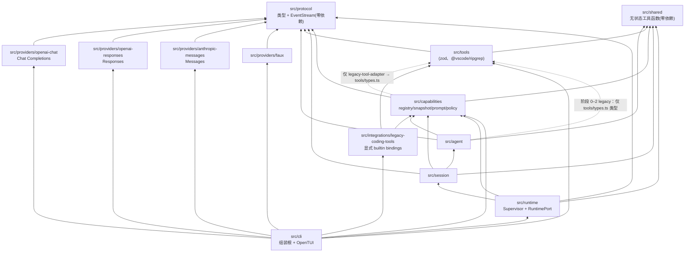
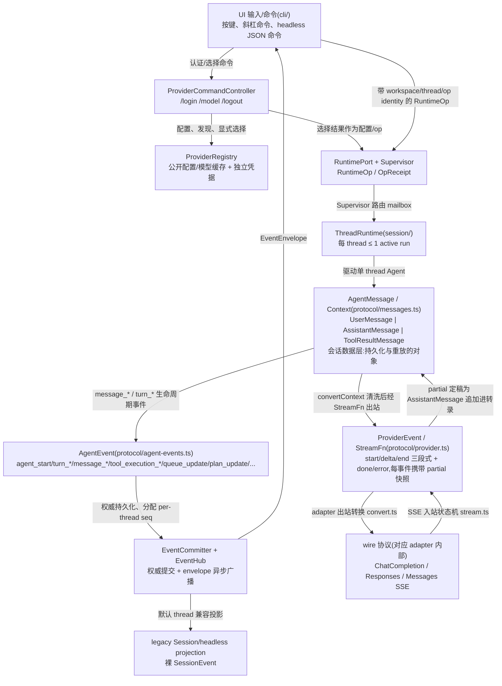
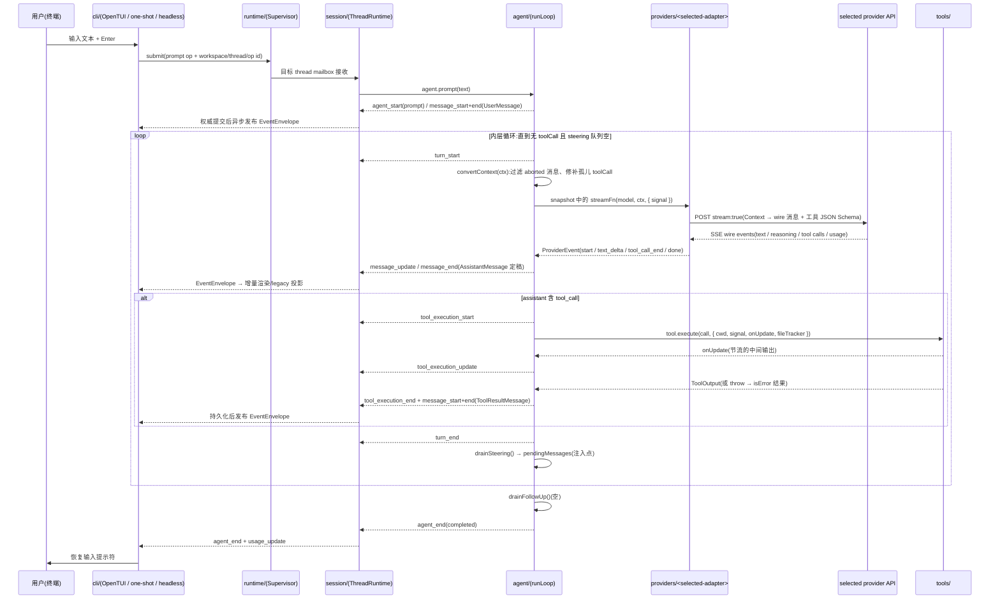

[← 返回地图](./README.md)

# 02 系统架构:目录结构、分层依赖、四层类型体系与数据流

本篇回答三个问题:代码放在哪(目录结构与职责)、谁允许依赖谁(分层规则以及如何用 ESLint 把规则变成编译期硬约束)、数据如何流动。阶段 0 起，运行时拓扑以
[12 · Supervisor、多线程 Runtime](./12-supervisor-runtime.md) 为准：单进程只是部署形态，不再等于全局单 Agent；隔离单位是 thread，每个 thread 至多一个 active run。

## 1. 架构总览:三条设计原则

整个架构由三条原则推导而来,后文所有结构都是这三条的机械展开:

1. **协议隔离(需求 1)**:`openai` 包及其一切类型只存在于 `src/providers/openai-chat/` 与 `src/providers/openai-responses/` 内；两个 adapter 也不得互相依赖。agent 核心只认识内部协议(`AgentMessage` / `ProviderEvent` / `StreamFn`)。这不是口头约定,而是 ESLint 规则——违规直接 lint 失败(见第 3 节)。
2. **事件驱动、单向可观察流**:provider/agent/runtime 的可观察输出使用 JSON-safe discriminated
   union（`ProviderEvent`、`AgentEvent`、`RuntimeEvent`）；请求/回执、查询、AbortSignal 与 executor
   回调走各自 typed port，不伪装成事件。UI 不直接读 Agent 内部状态，只消费 RuntimePort 快照与
   envelope；Agent 不感知 UI 存在。
3. **每线程单 active run、跨线程可并发**:Supervisor 管理独立 `ThreadRuntime`，每个 thread 独占 transcript、mailbox、权限状态与 per-thread event seq；不同 thread 可并发。子 Agent 是带父子拓扑的独立 thread，不是 ToolDefinition，也不把结果伪装成父线程 tool result。

参考项目对这三条的佐证:opencode V1 因为让 Vercel AI SDK 的类型渗入 core 签名,最终背上 1832 行 per-provider 的 ProviderTransform 补丁,SDK 大版本升级时 usage 口径变化引发全链路返工,被迫自建 `@opencode-ai/llm`——教训是**第三方 SDK 类型必须从第一天起被机械手段挡在 core 之外**。单转录/单循环的可调试性仍保留在每个 ThreadRuntime 内；并发由 Supervisor 在 thread 边界管理，避免把多个执行器揉进一份可变消息列表。

## 2. src/ 目录结构与职责

目录结构为 canonical:

```
src/
  protocol/        # 内部协议类型 + EventStream。零运行时依赖;禁止 import 任何 provider SDK
  capabilities/    # JSON-Schema-first registry、不可变 snapshot、prompt 与 policy 契约
  providers/
    openai-chat/       # Chat Completions adapter(允许 import "openai")
    openai-responses/  # Responses adapter(允许 import "openai"，与 chat 隔离)
    anthropic-messages/# Anthropic Messages adapter
    faux/          # 脚本化测试 provider
  integrations/
    legacy-coding-tools/ # 八个内置工具的显式 capability bindings/analyzer
  agent/           # legacy Agent facade + runtime snapshot engine、runLoop、队列、工具执行调度
  tools/           # read/ls/grep/glob/bash/edit/write/plan + 框架
  session/         # ThreadRuntime、转录 repository、retry/compaction、事件提交与广播、legacy Session
  runtime/         # Supervisor、RuntimePort 与无副作用 public entry
  cli/             # 参数/配置、TUI、one-shot 与 headless 前端适配
  shared/          # truncate、fs 工具、进程树 kill 等无状态工具函数
```

逐目录职责与建议文件划分:

| 目录 | 职责 | 建议文件 | 明确不做的事 |
|---|---|---|---|
| `protocol/` | 定义全项目通用语言:身份、Runtime op/receipt/event envelope、消息模型、Provider 流事件、Agent 事件、`EventStream` 泛型实现。是唯一"所有人都可以依赖"的目录 | `identity.ts`、`runtime-ops.ts`、`runtime-events.ts`、`messages.ts`、`provider.ts`、`agent-events.ts`、`event-stream.ts` | 不 import 任何 npm 运行时依赖、任何其他 src 目录;不包含业务逻辑 |
| `providers/openai-chat/` | Chat Completions adapter:出站把 `Context` 翻译成 wire 消息,入站把 SSE chunk 状态机化为 `ProviderEvent`;`CompatFlags` 方言处理 | `index.ts`(导出 StreamFn)、`convert.ts`(出站转换)、`stream.ts`(入站状态机)、`compat.ts`(方言推断) | 不感知 agent 存在;不处理重试策略(整轮重发在 session 层);不 throw(铁律见 [03](./03-internal-protocol.md)) |
| `providers/openai-responses/` | Responses adapter:把完整本地 transcript 翻译成 `instructions/input/tools`，把 Responses item/delta/terminal 事件翻译成 `ProviderEvent` | `index.ts`、`convert.ts`、`consume.ts`、`errors.ts`、`reasoning.ts` | 不执行工具;不依赖服务端 response id 维持正确性;不访问 agent/session/队列;不与 sibling adapter 共享 wire 类型 |
| `providers/anthropic-messages/` | Anthropic Messages adapter | `index.ts`、`convert.ts`、`consume.ts`、`errors.ts`、`compat.ts` | 与其它 provider 隔离；SDK 类型不外泄 |
| `providers/faux/` | 脚本化回放 `ProviderEvent` 的测试 provider,让 loop/steering/CLI 全离线可测 | `index.ts` | 不依赖网络、不依赖 openai 包 |
| `agent/` | exported legacy `Agent` facade 与 runtime snapshot engine、runLoop 双层循环、steering/follow-up 队列、工具执行三阶段调度、出站前 transform 层 | `legacy-agent.ts`、`runtime-agent.ts`、`run-loop.ts`、`queues.ts`、`tool-executor.ts`、`transform.ts` | 不 import 任何 provider；runtime engine 不 import tools，legacy facade 仅 type-import `tools/types.ts`；不做持久化 |
| `tools/` | 工具框架(`ToolDefinition`、统一截断 post-hook)+ 八个内置工具 | `types.ts`(框架类型)、`framework.ts`、`read.ts` 等每工具一文件、`index.ts`(`createCodingTools()`) | 不感知 agent loop;不直接发 AgentEvent(经 `ToolContext.onUpdate` 回调) |
| `capabilities/` | `CapabilityRegistry`、`ToolCatalogSnapshot`、`PreparedInvocation`、`ProviderAdapterRegistry`、`PromptAssembler`、`PolicyEngine` | `registry.ts`、`snapshot.ts`、`prepared-invocation.ts`、`provider-registry.ts`、`prompt-assembler.ts`、`policy-engine.ts` | 不 import 具体实现；仅 legacy-tool-adapter 可窄依赖 `tools/types.ts`，执行期不回查可变 registry |
| `integrations/legacy-coding-tools/` | 八个内置 `LegacyToolCapabilityBinding` 与版本化 bash analyzer | `index.ts`、`resource-resolver.ts` | 只依赖 capabilities public types 与具体 tools；不持有 thread/runtime 状态 |
| `session/` | 每线程执行与持久化：`ThreadRuntime`、`TranscriptRepository`、`RetryCoordinator`、`CompactionCoordinator`、`EventCommitter`；另提供由 Runtime 每 workspace 实例化一个的 `EventHub`；保留 legacy `Session` facade | `thread-runtime.ts`、`transcript-repository.ts`、`retry-coordinator.ts`、`compaction-coordinator.ts`、`event-committer.ts`、`event-hub.ts`、`session.ts` | ThreadRuntime 不持有全局 thread map；EventHub 只持 subscription/replay routing；普通 observer 不背压 Agent；不渲染 |
| `runtime/` | workspace 级 Supervisor、thread 生命周期/op 路由、`RuntimePort`、public runtime 工厂 | `supervisor.ts`、`runtime-port.ts`、`index.ts` | 不执行 turn/工具，不读 CLI 环境，不导入 TUI 或具体 provider SDK |
| `cli/` | 参数/配置与前端适配：把 TUI 按键或 NDJSON 映射到 RuntimePort，把 envelope 或 legacy 投影渲染到 OpenTUI、one-shot human renderer 或 headless | `main.ts`、`project-rules.ts`、`provider-commands.ts`、`interactive-runtime.ts`、`tui.ts`、`renderer.ts`、`headless.ts` | 不拥有 run/retry/compaction/权限状态机；秘密不进入 renderer/event/transcript |
| `shared/` | 底层纯函数、基础 port 与无上层依赖的局部状态容器：截断、路径规范化、`FileTrackerPort/FileTracker`、`killProcessTree` 等 | `truncate.ts`、`fs-path.ts`、`file-tracker.ts`、`kill-process-tree.ts` | 不 import 其他 src 目录；状态实例不得跨 thread 共享 |

两个容易放错位置的东西:

- **transform 层放 `agent/`**(不是 adapter):aborted/error 消息过滤、孤儿 toolCall 补合成结果、跨模型 reasoning 降级(见 [05 Agent 循环](./05-agent-loop.md) 第 3 节)操作的是内部 `AgentMessage`,与 wire 协议无关,且对所有 provider 通用。adapter 只做"忠实翻译",不做"转录修复"。
- **`ToolDefinition` 放 `tools/types.ts`**(不是 protocol):protocol 层的 `Context.tools` 只有渲染后的 `ToolSchema { name, description, parameters: JSONSchema }`——provider 不需要也不应该看到 zod 类型与 `execute` 函数。zod 依赖因此被挡在 protocol 之外。

## 3. 分层依赖规则与 ESLint 机械保障

### 3.1 依赖方向



文字版目标规则:`protocol/shared` 是叶子；`providers/*` 与 `tools/*` 保持隔离；
`capabilities` 定义注册表/snapshot/policy 而不认识具体实现；认识八个具体工具的显式 binding 只在
`integrations/legacy-coding-tools`；`agent` 消费 snapshot 与 provider port；
`session` 组装单 thread；`runtime` 组装 Supervisor；`cli` 的运行期命令与事件路径只经过
RuntimePort。图中 CLI 到 capability/provider/tool 的边只允许 composition-root 注册内置实现，不允许
CLI 持有执行状态或在运行中绕过 RuntimePort 直接调用 Session/Agent。阶段 1–3 迁移期间的临时旧
边界由兼容矩阵管理，最终 ESLint zone 必须机械化上述方向。补充两条细化:

- `shared` 与 `protocol` 同为叶子层,只被依赖、不依赖任何 src 目录。`protocol` 不依赖 `shared`(保持可独立抽包发布)。
- **legacy facade 的永久窄例外**：exported `Agent`/`AgentConfig.tools: ToolDefinition[]` 是兼容面，阶段 3
  仍由 `agent/legacy-agent.ts`（迁移时可先是现有 `agent.ts`）唯一 type-import `tools/types.ts`；具体工具
  实现始终禁止。ThreadRuntime 使用的 `agent/runtime-agent.ts` 只消费 capabilities snapshot/
  `PreparedInvocation`，不依赖 tools。阶段 3 删除的是整个 `agent/ → tools/types.ts` 的宽白名单，改成
  精确到 legacy facade 文件的例外，不能为去掉依赖而破坏 exported Agent API。

### 3.2 为什么必须是机械保障

三个参考项目从正反两面证明了"约定靠不住":

- **opencode(反面)**:V1 的 core 签名里出现了 Vercel AI SDK 类型,后果如第 1 节所述。尤其要注意:类型渗漏主要通过 `import type` 发生——它不产生运行时依赖,code review 里最容易被放过,但足以让 core 的公共 API 与第三方 SDK 版本锁死。
- **gemini-cli(反面)**:core 直接把 `@google/genai` 的 `Content` 类型当内部消息表示,core 与 SDK 类型耦合,正是我们要避免的形态。
- **codex(正面)**:wire 层 `ResponseItem` 与会话层 `TurnItem`、UI 层 `UserInput` 三层分离,adapter 在层间转换,核心从不触碰 wire 类型。Rust 的 crate 边界天然强制了这一点;TypeScript 没有 crate,所以我们用 ESLint 造一个。

### 3.3 ESLint 落地配置

两条规则配合:`import/no-restricted-paths`(eslint-plugin-import)管**项目内目录间**的依赖方向;`no-restricted-imports`(ESLint 核心规则)管**npm 包**级别的封锁——`openai` 是包名不是路径,前者管不到它。

```js
// eslint.config.mjs(flat config,M0 里程碑落地)
import tseslint from 'typescript-eslint';
import importPlugin from 'eslint-plugin-import';

export default tseslint.config(
  // ---- 规则 A:目录间依赖方向(zone 的语义:target 内的文件不得 import from 内的模块)----
  {
    files: ['src/**/*.ts'],
    plugins: { import: importPlugin },
    rules: {
      'import/no-restricted-paths': ['error', {
        zones: [
          // protocol、shared 是叶子:不得 import src 下任何其他目录
          { target: './src/protocol', from: './src', except: ['./protocol'] },
          { target: './src/shared',   from: './src', except: ['./shared'] },
          // providers 只向下看 protocol/shared
          { target: './src/providers', from: './src/agent' },
          { target: './src/providers', from: './src/tools' },
          { target: './src/providers', from: './src/session' },
          { target: './src/providers', from: './src/cli' },
          // agent 不认识 providers/session/cli;对 tools 仅放行框架类型文件
          { target: './src/agent', from: './src/providers' },
          { target: './src/agent', from: './src/session' },
          { target: './src/agent', from: './src/cli' },
          { target: './src/agent', from: './src/tools', except: ['./types.ts'] },
          // tools 不认识上层与 providers
          { target: './src/tools', from: './src/providers' },
          { target: './src/tools', from: './src/agent' },
          { target: './src/tools', from: './src/session' },
          { target: './src/tools', from: './src/cli' },
          // session 只依赖 protocol/shared/agent,不得触碰 runtime/providers/tools/cli
          { target: './src/session', from: './src/runtime' },
          { target: './src/session', from: './src/cli' },
          { target: './src/session', from: './src/providers' },
          { target: './src/session', from: './src/tools' },
          // Phase 2:runtime 组装 session 的每线程协作者；不得直接依赖 Agent/provider/tool/CLI
          {
            target: './src/runtime',
            from: './src',
            except: ['./runtime', './protocol', './shared', './session'],
          },
          // provider 之间互相隔离(跨 provider import 是设计异味)
          { target: './src/providers/openai-chat', from: './src/providers/faux' },
          { target: './src/providers/faux', from: './src/providers/openai-chat' },
          // 测试只允许用 faux provider(防止测试悄悄变在线测试)
          { target: './tests', from: './src/providers/openai-chat' },
        ],
      }],
    },
  },
  // ---- 规则 B:openai 包只允许出现在两个 OpenAI adapter 内(机械保障)----
  {
    files: ['src/**/*.ts'],
    ignores: ['src/providers/openai-chat/**', 'src/providers/openai-responses/**'],
    rules: {
      'no-restricted-imports': ['error', {
        patterns: [{
          group: ['openai', 'openai/*'],
          message: 'openai SDK 只允许在 OpenAI adapter 目录内使用(协议隔离)',
        }],
      }],
    },
  },
);
```

上述代码块为示意;**权威版本是仓库根的 `eslint.config.mjs`**(M1 起随实现演进),它在规则 A/B 之外还包含:

- **规则 C:protocol 零依赖**——`src/protocol/**` 禁止一切 bare import(含 `node:`、`bun:` 与 `bun` 运行时模块),用 `no-restricted-imports` 的 `regex: '^[^.]'` 形式(gitignore 语义的 `group: ['*']` 会连内部相对导入一起误伤);`*.test.ts` 豁免(需要 `bun:test`),但仍受规则 A/B 约束。
- **`no-restricted-syntax` 堵两条静默渗漏通道**——`no-restricted-imports` 只管静态 import 声明,动态 `import('openai')` 与内联类型引用 `import('openai/resources').X` 都能绕过;对 protocol(全部 bare specifier)与 openai 封锁(全 src/tests)各加 `ImportExpression`/`TSImportType` 语法选择器规则,tests/boundaries.test.ts 有对应探针。

实施要点与边界情况:

- **`import type` 同样被拦截**。`no-restricted-imports` 默认对 type-only import 一并报错;若切换到 `@typescript-eslint/no-restricted-imports`,其 `allowTypeImports` 选项必须保持 `false`——opencode 的教训里,类型渗漏才是主要祸害。
- **zone 的 `except` 路径相对于 `from`**(eslint-plugin-import 的语义),所以 agent→tools 的白名单写 `'./types.ts'` 而不是完整路径。
- **测试文件同样受约束**:`tests/` 里 loop/steering 的测试只允许用 `providers/faux`,不得 import 真实 adapter——否则测试会悄悄变成在线测试。adapter 自己的 fixture 回放测试放在各自 `src/providers/<adapter>/*.test.ts`,天然位于 SDK 白名单目录内。
- CI 中 `eslint --max-warnings 0` 作为 M0 验收项;可选叠加 dependency-cruiser 生成依赖图并断言无环,作为第二道保险(不是必需,ESLint 两条规则已覆盖全部硬约束)。

## 4. 四层核心类型 + Runtime 信封

核心仍有四个数据类型边界；身份与顺序只放在 operation/envelope 元数据中，不复制到 transcript 或
provider wire。canonical 主路径是：**UI/host → identity-bearing RuntimeOp → RuntimePort →
Supervisor → ThreadRuntime → AgentMessage/Context → ProviderEvent/StreamFn → wire**；返回路径是
**AgentEvent/control event → EventCommitter → EventEnvelope<RuntimeEvent> → EventHub → UI/host**。
`SessionEvent` 是默认 thread 的兼容投影，不是新 core 的输入。认证秘密始终留在可信宿主配置边界。



### 逐层说明

**第 1 层:UI/host 输入。**OpenTUI、one-shot 与 headless 只把输入翻译成带 `OpId` 与目标
`WorkspaceId/ThreadId` 的 `RuntimeOp`，提交给 RuntimePort。旧 `Session.prompt/steer/followUp/abort`
由 legacy adapter 隐式绑定默认 workspace/thread 并生成 OpId。`/login`、`/model`、`/logout` 的
秘密与选择仍留在可信宿主配置边界，但选择结果通过 runtime registry/operation 生效；renderable
tree 只是 `EventEnvelope` 或 legacy SessionEvent 的可丢弃投影，不得成为事实源。

**第 2 层:AgentEvent(agent → ThreadRuntime)。**agent 的全部可观测行为:agent/turn 生命周期、消息生命周期(`message_start` / `message_update` / `message_end`)、工具执行三事件、队列快照(`queue_update`)与计划(`plan_update`)。approval 等 control 在同一 EventCommitter 合流；EventCommitter 先完成权威提交、分配 per-thread seq，再由 EventHub 异步广播 envelope。普通观察者不背压 Agent；旧 `Session.subscribe` 在兼容边缘投影裸事件。注意 `message_update` 的定义:

```ts
| { type: 'message_update'; messageId: string; event: ProviderEvent }    // 仅 assistant 流式期间
```

AgentEvent **包装而非复刻** ProviderEvent——流式细粒度语义只定义一次,UI 拿到的和 agent 消费的是同一个事件对象,两层不会出现语义漂移。这借鉴了 codex 的双轨设计("快照式 item + 定位到 item_id 的 delta"):`ProviderEvent.partial` 是快照轨,`delta` 字段是增量轨,简单 UI 只看快照即可正确渲染,富 UI 用 delta 做打字机效果。

**第 3 层:AgentMessage / Context(会话数据层)。**这是系统的"事实存储":`UserMessage | AssistantMessage | ToolResultMessage` 构成完整转录,JSONL 持久化按行存的就是它,恢复即重放。两个关键设计:错误/中止也是合法的 `AssistantMessage`(`stopReason: 'error' | 'aborted'` + `errorMessage`),转录永远完整、可审计;`AssistantMessage.model: ModelRef` 三元组让 transform 层能判断"这条历史消息与本次请求是否同一模型",跨 provider 迁移时据此降级 reasoning/剥离 signature。

**第 4 层:ProviderEvent / StreamFn(agent ↔ provider 边界)。**Agent 眼里 provider 就是一个函数:

```ts
export type StreamFn = (model: ModelConfig, context: Context, options?: StreamOptions) => ProviderEventStream;
```

铁律:StreamFn 一旦被调用绝不 throw、绝不 reject,一切错误编码为流内 `error` 事件。这条铁律是 Vercel AI SDK 的 `LanguageModelV3` 极小接口("do" 前缀、错误也是 stream part)与 opencode 16 元 LLMEvent 归一化的共同结论:错误进流,loop 层才能零 try/catch 地统一处理所有 provider。接口详情见 [03 内部协议](./03-internal-protocol.md) 与 [04 Provider 接口](./04-provider-adapter.md)。

**wire 层(adapter 内部,不算"我们的类型")。**`ChatCompletionMessageParam`、Responses input/stream event、Anthropic Messages event 与 SSE 帧格式都是外部世界的方言；adapter 的职责就是让方言止步于各自目录。

### 与 codex 三层表示的对照

| 我们 | codex | 说明 |
|---|---|---|
| RuntimeOp（进程内 port / headless JSON transport） | `Op`(Submission Queue) | 两者都可序列化；coda core 不绑定进程边界 |
| AgentEvent | `EventMsg`(约 60 变体) | 均为 tagged union,item/turn 生命周期 + delta 双轨 |
| AgentMessage | `TurnItem` | 会话条目;我们把工具状态外置到事件而非内嵌 status |
| ProviderEvent | — | codex 直连 Responses API,无独立 provider 抽象层;我们采 Vercel 范式补上这层 |
| wire(adapter 内) | `ResponseItem` | 均严格隔离在协议转换层内 |

## 5. 一次完整交互的数据流

场景:用户输入一句话,模型先调一次工具再给出最终答复。贯穿四层类型的完整时序:



图注:`convertContext` 是每次出站前的固定清洗;`transformContext` 是另一个东西——用户可配置的钩子(压缩/裁剪),在 `convertContext` 之前执行(见 [05 Agent 循环](./05-agent-loop.md) 第 3 节),图中为简洁未单独画出。

沿途的关键决策点(详细语义在 [05 Agent 循环](./05-agent-loop.md)):

1. **入口分流**:`prompt()` 仅空闲可调,运行中 throw——强制调用方在 `steer` / `followUp` 之间二选一,消灭"运行中又开新任务"的未定义行为(codex 用 `abort_all_tasks(Replaced)` 解决同一问题,我们选择更保守的显式拒绝)。
2. **每次采样前先 transform**:清洗发生在"出站前"而非"写入转录时"——转录保留全部历史(含 aborted),wire 层看到的永远是修复过的合法序列。这是 opencode 中断收尾纪律的落地:悬空 tool_call 不补 error 结果,重放时 Anthropic 类协议直接 400。
3. **SSE → ProviderEvent 是纯状态机**:按 chunk 的 `index` 聚合 tool_calls 分片、容错 JSON 持续刷新 `arguments`、finish_reason 映射 StopReason——结构直接参照 Vercel AI SDK openai-compatible 包的 `doStream` TransformStream 实现。
4. **事件回流经权威提交点**:`EventCommitter` 是 Agent 唯一 awaited sink，先完成消息、usage、control 与 per-thread seq 的权威提交，再把 envelope 非阻塞入队给 EventHub。普通 observer 各自保序异步消费；legacy Session/headless 只在边缘剥离信封。阶段 0 的现有 Session listener await 行为由 characterization tests 冻结，到阶段 2 才按此目标切换。
5. **工具执行期间 abort 随时生效**:`AbortSignal` 从 `agent.abort()` 贯穿 provider 流(HTTP 断开)与工具执行(进程树 kill),被中断的现场由 transform 层在下一次请求前修复。
6. **再采样**:工具结果按 assistant 消息中的源顺序回填转录后,内层循环回到步骤 1 重新采样;模型不再发起 toolCall 且 steering 队列为空时内层退出,poll follow-up 队列决定续跑或 `agent_end`。

## 6. 与参考项目的架构对比:v1 为什么这样裁剪

### 6.1 对比表

| 维度 | codex | opencode | Claude Code | gemini-cli | **coda v1** |
|---|---|---|---|---|---|
| 解耦边界 | UI ↔ core 双队列(SQ/EQ),可跨进程序列化 | server/client 分离,HttpApi + SSE,多客户端 | 进程内单体 | CLI ↔ core 包,AsyncGenerator | RuntimePort + identity-bearing op/envelope；legacy 方法 + subscribe |
| 消息表示 | UserInput / TurnItem / ResponseItem 三层 | Message + 12 元 Part union,每 Part 独立存储 | 扁平消息列表 | 直接用 `@google/genai` Content(反面) | AgentMessage 三型 + part 数组 |
| steering | pending_input 队列,采样间隙 drain | V2:durable inbox,Safe Boundary 提升 | h2A 进程内异步队列 | 不支持 | 进程内双队列,turn 边界注入 |
| 审批应答 | `Op::ExecApproval` + oneshot 注册表 | Deferred 阻塞 + reply | 权限分级 | AwaitingApproval 状态 + 6 种 outcome | canonical control op/event；legacy Promise resolver 投影 |
| 事件通道 | Event Queue(带 submission id 关联) | 进程内总线 → SSE 双通道(part.updated + delta) | — | AsyncGenerator 返回值 | per-thread seq EventEnvelope；legacy headless 裸 NDJSON |

### 6.2 codex 双队列与 RuntimePort

codex 的 SQ/EQ 是为"多前端、跨进程"设计的:TUI、MCP server、app-server 都是独立进程,必须有可序列化的 `Submission{id, op}` / `Event{id, msg}` 协议,core 内 `submission_loop` 串行消费保证顺序,approval 应答也是一条 `Op`(与 UserInput 同队列,天然有序、可重放)。这套机制的成本:每个交互都要定义 Op/Event 对、维护 id 关联、处理断线与重放。

旧 v1 只有一个同进程 CLI，曾裁剪为 `prompt/steer/followUp/abort` 直接方法和 `subscribe`。阶段 1
恢复可嵌入、可序列化的 `RuntimeOp/EventEnvelope` 边界，但不绑定进程或网络：本地 CLI 仍是同进程
adapter，未来 transport 可以复用同一端口。legacy Session 方法只绑定默认 identity 并做投影：

- steering 的"采样间隙 drain pending input"语义照抄(codex `run_turn` 的 `get_pending_input`,我们的 `drainSteering()` 注入点);
- approval/control 通过同一 mailbox 与 EventCommitter；legacy `approval_request` 只是兼容投影；
- abort 语义区分保留(codex `TurnAborted{reason}` 枚举 → 我们 `agent_end.reason: 'aborted'` 与 `StopReason: 'aborted'`)。

### 6.3 opencode server/client 分离 vs 我们可嵌入

opencode 把 core 做成 HTTP server,TUI/桌面/网页全是生成 SDK 的客户端,事件走 SSE 双通道(`message.part.updated` 整 part 重发 + `message.part.delta` 文本增量)。收益是多客户端共享 session、断线重连、远程使用;成本是 durable 存储、HttpApi 版本管理、客户端 SDK 生成——对 v1 的"单人单终端"场景全是纯开销。

我们不把 server 作为 core 前提：RuntimePort 可同进程嵌入，transport 需要时再外接。双通道思想变成
`ProviderEvent` 的 partial 快照 + delta 双轨；durable inbox 的 `steer | queue` 语义对应每个
ThreadRuntime 的 steering/follow-up mailbox。

### 6.4 为什么不用 gemini-cli 的 AsyncGenerator 形态

gemini-cli 的 `Turn.run(): AsyncGenerator<Event>` 把单 turn 事件流做成返回值,优雅但有个结构性限制:纯拉模型下"边消费事件边向 agent 注入命令"需要额外旁路。我们的输入和输出明确分成两面：命令经
`RuntimePort.submit()` 进入 thread mailbox，事件经独立 `AsyncIterable<EventEnvelope>` 输出；provider
边界继续使用 `EventStream`，两者都不把命令塞进事件 iterator。

### 6.5 RuntimePort 与未来 server 化

本项目设计约定把 headless 模式定义为"内部协议对外暴露的验证"。legacy 命令仍是四个主要交互
动词；canonical RuntimeOp 还包含 thread 生命周期、continue、set_model、control 和 scoped cancel，
server 化是 transport 替换而非架构重构：

1. **阶段 1**：public RuntimePort 直接接受 identity-bearing RuntimeOp，并输出
   `EventEnvelope<RuntimeEvent>`；headless 只是该端口的 stdin/stdout adapter。
2. **阶段 1 兼容**：默认 headless 继续投影裸 SessionEvent；显式
   `--event-format=envelope` 输出 canonical 信封、每个 op 的 receipt 与 transport error frame，
   不静默破坏旧客户端。
3. **阶段 2**：把阶段 1 临时 runtime event journal 的 seq/high-water writer 提取为唯一
   `EventCommitter`，并与 transcript/mailbox/control 原子提交；`EventHub` 接管异步订阅与 cursor。
   这是内部拆分，不改变阶段 1 已发布的持久 seq 语义。
4. **换传输**：stdin/stdout 可替换为 HTTP/WebSocket/SSE，RuntimePort、ThreadRuntime、Agent 与
   adapter 不变；认证只在 transport/host 层增加。

## 7. 模块间接口摘要表

| 模块 | 关键导出 | 允许依赖 | 主要消费者 |
|---|---|---|---|
| `protocol/` | 五类 opaque identity、`RuntimeOp`、`OpReceipt`、`EventEnvelope`、`RuntimeEvent`、`AgentMessage`、`Context`、`ProviderEvent`、`EventStream`、`StreamFn`、`AgentEvent`、`ToolSchema` | (无) | 所有模块 |
| `providers/openai-chat/` | `streamOpenAIChat: StreamFn`、`detectCompat`、`CompatFlags` | `protocol`、`shared`、`openai` | `cli`(组装)、自身测试 |
| `providers/openai-responses/` | `streamOpenAIResponses: StreamFn` | `protocol`、`shared`、`openai` | `cli`(组装)、自身测试 |
| `providers/anthropic-messages/` | `streamAnthropicMessages: StreamFn` | `protocol`、`shared`、`@anthropic-ai/sdk` | `cli`(组装)、自身测试 |
| `providers/faux/` | `createFauxStreamFn(script): StreamFn`、`createGate` | `protocol`、`shared` | 测试、`cli`(离线演示) |
| `agent/` | legacy `Agent` facade、runtime snapshot engine、单 run/turn loop、transform 层函数 | `protocol`、`shared`、`capabilities`；仅 legacy facade 文件可 type-import `tools/types.ts` | `session`、legacy consumer、测试 |
| `tools/` | `ToolDefinition`、`ToolContext`、`ToolOutput`、`createCodingTools(): ToolDefinition[]` | `protocol`、`shared`、zod、`@vscode/ripgrep` | `cli`(组装)、`agent`(仅 types.ts) |
| `session/` | `ThreadRuntime`、`TranscriptRepository`、`RetryCoordinator`、`CompactionCoordinator`、`EventCommitter`、`EventHub`；legacy `Session` | `protocol`、`shared`、`agent`、`capabilities` | `runtime`、legacy consumer |
| `capabilities/` | `CapabilityRegistry`、`ToolCatalogSnapshot`、`PreparedInvocation`、`ProviderAdapterRegistry`、`PromptAssembler`、`PolicyEngine` | `protocol`、`shared`、legacy adapter 可依赖 `tools/types.ts` | `agent`、`session`、`runtime`、`cli` |
| `integrations/legacy-coding-tools/` | `createCodingToolCapabilityBindings()`、内置 resource resolvers/analyzer | `capabilities` public entry、`tools` public entry | `cli` composition root、集成测试 |
| `runtime/` | `Supervisor`、`RuntimePort`、无副作用 public entry | `protocol`、`shared`、`session`、`capabilities` | CLI、嵌入宿主、server transport |
| `cli/` | 参数/配置、内置 registration 组装、`startTui()`、one-shot/headless RuntimePort adapters | `runtime` 及 composition 所需 capability/provider/tool public entry；`@opentui/core` 仅交互分支动态加载 | 终端用户 / 外部进程 |
| `shared/` | `truncate`、`killProcessTree`、fs 辅助、`FileTrackerPort/FileTracker` | (无) | `agent`、`tools`、`capabilities`、`session`、`cli` |

接口契约的四条不变量(所有模块 PR 审查时对照):

1. 任何跨模块函数签名中出现的类型,要么来自 `protocol/`,要么来自本模块自己的导出;第三方 SDK 类型出现在导出签名中即违规(opencode 教训的签名级表述)。
2. `StreamFn` 是 provider adapter 的唯一执行形态:新增 provider 只注册一个版本化 adapter，不改
   `agent/`；一个 turn 使用捕获的同一 adapter snapshot。
3. 出站事件和入站 op 是唯一运行时边界：任何模块不得导出可变内部状态；观测只消费 envelope，
   干预只提交 identity-bearing RuntimeOp。
4. provider id 与 wire 协议正交：Runtime 的 ProviderAdapterRegistry 按当次 `ModelRef.api` snapshot
   选择 adapter；认证命令与 key 永远停留在可信 host 配置边界。

## 8. 验收清单

架构约束的可机械验证项（旧 M0/M1 已形成基线；新增项按阶段 1–3 落地）：

- [ ] 在 `src/agent/` 下写 `import type { ChatCompletion } from 'openai/resources'`,`eslint` 报错(验证 type-only import 同样被拦)。
- [ ] 在 `src/protocol/` 下 import `src/agent` 或任何 npm 包,`eslint` 报错;`src/protocol` 编译产物不含任何外部 require/import。
- [ ] 在 `src/agent/` 下 import `src/tools/read.ts` 始终报错；阶段 0–2 现有 legacy 文件 import
  `src/tools/types.ts` 通过；阶段 3 后只有 `legacy-agent.ts` 的 type-only import 通过，`runtime-agent.ts` 与
  其他 agent 文件同一 import 均报错。
- [ ] 在 `src/tools/` 下 import `src/agent` 报错(反向依赖被拦)。
- [ ] `tsc --noEmit`(strict)通过;依赖图无环(dependency-cruiser/madge,按 3.3 节为可选的第二道保险,非必需项)。
- [ ] OpenCode Go 同一 provider 下的 chat/messages 模型分别命中对应 adapter，未知协议模型在进入 `ModelConfig` 前被过滤。
- [ ] 无模型交互启动时 provider 控制支路可用但 Session 尚不存在；key 不出现在任何核心类型或事件中。
- [ ] 用 `providers/faux` 替换 `streamFn` 后,`agent/` 全部测试离线通过且零代码改动(证明 StreamFn 注入边界成立)。
- [ ] headless 模式 stdout 每行可被 `JSON.parse`,事件序列能完整重建会话渲染(证明 SessionEvent 全 JSON 可序列化,server 化前提成立)。
- [ ] OpenAI SDK import 只出现在 `providers/openai-chat` / `providers/openai-responses`；`tests/boundaries.test.ts` 同时验证 core 封锁、两个白名单与 provider 互相隔离。
- [ ] 同一 ThreadId 至多一个 active RunId；两个 ThreadRuntime 可并发且 transcript/mailbox/cancel/seq 完全隔离。
- [ ] `runtime` 不依赖 `cli` 或具体 provider/tool；仅 import public runtime entry 不产生文件、环境、signal、TTY 或网络副作用。
- [ ] EventEnvelope 的 seq 在每个 thread 内严格递增并跨 resume 延续；旧 Session/headless 投影不泄漏 envelope 字段且事件顺序不变。

## 相关文档

- [03 内部协议](./03-internal-protocol.md) —— 第 3、4 层类型(AgentMessage/ProviderEvent/AgentEvent)的完整定义与语义
- [04 Provider 接口与 OpenAI adapters](./04-provider-adapter.md) —— wire 层转换全细节、CompatFlags、Responses 契约与新增 provider 指南
- [05 Agent 循环](./05-agent-loop.md) —— 第 5 节时序图中 runLoop 每一步的精确语义
- [09 CLI](./09-cli.md) —— 第 1 层 UI 命令的键位映射与 headless NDJSON 外协议
- [12 Supervisor、多线程 Runtime](./12-supervisor-runtime.md) —— 目标依赖图、身份、组件职责与兼容矩阵
