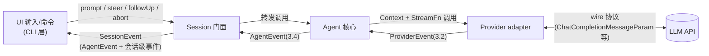

[← 返回地图](./README.md)

# 03 内部协议完整规格

本文是全项目的核心契约文档。`src/protocol/` 下的类型是所有其他模块的唯一共同语言:agent 核心、工具、session、CLI 全部只认这里定义的类型;OpenAI Chat Completions 的 wire 类型被隔离在 adapter 内部,永远不出现在本文所述的任何接口上。本文定义的每一条不变量都是可测试的验收项(见文末清单)。

## 1. 定位:四层类型体系中的中间两层



核心四层从外到内仍是:**UI 输入/命令 → AgentMessage/Context(会话数据)→ ProviderEvent/StreamFn(agent↔provider)→ wire 协议(adapter 内部)**。Session 是 agent 与 UI 之间的外围门面:下行转发命令,上行把 AgentEvent 与 retry/compaction/usage 联合成 SessionEvent。本文规格化消息模型(数据层)、ProviderEvent(provider 边界)、AgentEvent(agent→session 边界),以及承载流事件的 `EventStream` 类；SessionEvent 见 [08-session-persistence](./08-session-persistence.md)。

这个分层直接取自两个被验证过的先例:

- pi-mono 把协议分为 `Message/Context`(数据)、`AssistantMessageEvent`(provider→agent)、`AgentEvent`(agent→外围消费者)三层,agent-core 完全不依赖 provider catalog,只认一个 `StreamFn` 函数类型——我们保留这个核心结构,由 Session 作为外围消费者再扇出;
- codex 用 `UserInput → TurnItem → ResponseItem` 三层表示,adapter 在层间转换,证明了"UI 表示、会话条目、模型 wire 格式必须是三种类型"的必要性。gemini-cli 是反例:core 直接用 `@google/genai` 的 `Content` 类型当内部表示,导致 core 与 SDK 耦合——这正是我们需求 1 明令禁止的。

`src/protocol/` 的纪律:**零运行时依赖**(仅类型 + `EventStream` 一个纯数据结构类),禁止 import 任何 provider SDK,ESLint 边界规则强制(见 [02-architecture](./02-architecture.md))。

## 2. 消息模型(`src/protocol/messages.ts`)

### 2.1 类型全文(canonical)

```ts
export type StopReason = 'stop' | 'length' | 'tool_calls' | 'content_filter' | 'error' | 'aborted';

export interface TextPart      { type: 'text'; text: string }
export interface ReasoningPart { type: 'reasoning'; text: string; signature?: string }
export interface ImagePart     { type: 'image'; data: string /* base64 */; mimeType: string }
export interface ToolCallPart  {
  type: 'tool_call'; id: string; name: string;
  arguments: Record<string, unknown>;   // 解析后的参数(流式期间用容错 JSON 解析持续刷新)
  rawArguments?: string;                // 原始 JSON 字符串(截断诊断用)
}

export interface ModelRef { provider: string; api: string; model: string }  // api 如 'openai-chat'

export interface Usage {
  input: number;          // inclusive:含 cacheRead/cacheWrite
  output: number;         // inclusive:含 reasoning
  cacheRead?: number; cacheWrite?: number; reasoning?: number;
  costUSD?: number;
}

export interface UserMessage {
  role: 'user'; id: string; timestamp: number;
  content: (TextPart | ImagePart)[];
  source?: 'prompt' | 'steering' | 'follow_up' | 'synthetic';  // synthetic = 系统合成(如 plan 批准注入)
}
export interface AssistantMessage {
  role: 'assistant'; id: string; timestamp: number;
  content: (TextPart | ReasoningPart | ToolCallPart)[];
  model: ModelRef;
  stopReason: StopReason; errorMessage?: string;   // error/aborted 也是一条合法消息,保留在转录中
  errorDetails?: ProviderErrorDetails;             // adapter 填写的结构化错误分类(M7 retry 消费,见 08 §5.1)
  usage: Usage;
}

export interface ProviderErrorDetails {
  status?: number;            // HTTP 状态码
  code?: string;              // provider 错误码
  requestId?: string;
  kind: 'network' | 'http' | 'overflow' | 'auth' | 'rate_limit' | 'aborted' | 'unknown';
  retryable: boolean;         // adapter 的初判,session 可覆盖
  retryAfterMs?: number;      // 来自 Retry-After / ratelimit 头
}
export interface ToolResultMessage {
  role: 'tool_result'; id: string; timestamp: number;
  toolCallId: string; toolName: string;
  content: (TextPart | ImagePart)[];   // 工具结果支持图片
  isError: boolean;
  details?: unknown;                    // 结构化细节(如 edit 的 diff),UI/持久化用,不发给模型
}
export type AgentMessage = UserMessage | AssistantMessage | ToolResultMessage;

export interface Context {
  systemPrompt?: string;
  messages: AgentMessage[];
  tools?: ToolSchema[];    // { name, description, parameters: JSONSchema }
}
```

### 2.2 Part 类型逐一说明

- **TextPart**:普通文本。assistant 出站到 Chat Completions 时会被合并为纯字符串 content(pi 的 openai-completions adapter 注释明确指出:数组形式 `[{type:"text"}]` 会诱发 DeepSeek 等模型模仿结构输出),但内部协议保留数组形态——这是"内部表达力 ≥ 任意 wire 格式"原则的体现,降级永远发生在 adapter。
- **ReasoningPart**:思维链文本。`signature` 承载 provider 的加密签名(Anthropic thinking signature、第三方 `reasoning_content` 的伴随字段),跨模型 replay 时由 transform 层剥离或整块降级为文本(见 [04-provider-adapter](./04-provider-adapter.md))。
- **ImagePart**:base64 + mimeType,不做 URL 形态(避免生命周期/鉴权问题)。出现在 user 输入与工具结果中(read 工具读图片文件时);Chat Completions 的 tool 消息不能携带图片,adapter 会把它抽出补一条 user 消息——这是 pi 验证过的降级手法。
- **ToolCallPart**:`arguments` 是**解析后的对象**。流式期间 adapter 用容错 JSON 解析(partial-json)在每个 delta 后刷新它,所以 UI 随时能渲染"参数正在生长"的预览;`rawArguments` 保留原始字符串,专供 `stopReason === 'length'` 截断场景的诊断(此时 `arguments` 可能"能解析但不完整",loop 层一律不执行,见 [05-agent-loop](./05-agent-loop.md))。

`UserMessage.source` 标记消息来源(prompt/steering/follow_up/synthetic),供 UI 差异化渲染与统计;它不发给模型(adapter 出站时忽略)。pi 的 UI 镜像队列靠消息文本字符串匹配回收、重复文本会误删——我们给每条消息强制 `id`,`source` + `id` 让队列展示与转录对账不再依赖文本匹配。

### 2.3 为什么 error/aborted 也是 AssistantMessage

这是整个协议最重要的单一决策,pi 的原设计,我们全盘继承:

1. **转录永远完整**。abort 发生时模型往往已经流出了半段文本或半个 tool call,若错误走异常路径,这些内容会丢失;编码为 `stopReason: 'aborted'` 的 AssistantMessage,partial 内容原样保留,调试、审计、UI 回显都有据可查。
2. **loop 零异常路径**。`streamAssistantResponse()` 的返回值恒为 `AssistantMessage`,agent loop 只需检查 `stopReason` 一个字段就能决定继续、停止或报错——不存在"有的错误是异常、有的错误是返回值"的双轨。这与 3.3 节 StreamFn"永不 throw"铁律互为表里。
3. **replay 安全交给 transform 层**。stopReason ∈ {error, aborted} 的消息保留在转录但**出站时被 transform 层过滤**(不完整 turn 重放会触发 API 报错,pi 的 transform-messages 已验证)。信息保留与请求合法性由两层分别负责,而不是靠删数据换合法性。

对比 Vercel AI SDK:它的 stream part 里 `{type:'error'}` 可多次出现且 error 是 `unknown`,消费端要自己决定错误终止语义;我们收紧为"error 事件恰好终止流,且 error 本身就是一条结构完整的消息",消费端更简单。

### 2.4 为什么 AssistantMessage 自带 ModelRef

每条 assistant 消息记录"是谁产生的我"(provider + api + model 三元组),而不是把当前模型作为会话级全局属性。理由来自 pi 的 transform-messages 层:

- **跨模型迁移的判定基础**:会话中途换模型(或恢复会话后换 provider)时,transform 层对每条历史 assistant 消息做 `isSameModel(msg.model, currentModel)` 判断——同模型的 reasoning/signature 原样回放,异模型的 reasoning 降级为文本、剥离 signature、toolCallId 归一化(Responses API 的超长 id 压缩)。没有 per-message ModelRef,这个判断无从做起。
- **成本与统计按模型聚合**:session 层的 token/成本统计直接从消息流折叠,不需要额外记账结构。
- `api` 字段(如 `'openai-chat'`)与 `provider` 分离,因为同一 provider 可能有多个 API 形态(OpenAI 有 chat 与 responses),兼容性判断以 `api` 为准。

### 2.5 ToolResultMessage.details:UI 专用,不发给模型

`content` 与 `details` 是刻意的双通道:

- `content`(TextPart/ImagePart 数组)是**发给模型的部分**——工具执行的文本结论,受框架级截断(2000 行 / 50KB)约束;
- `details` 是**结构化细节**,类型 `unknown`,只进 UI 渲染与 JSONL 持久化,adapter 出站转换时直接忽略。

为什么不合并?三个理由:

1. **token 经济**:edit 工具的 unified diff、bash 的完整输出路径、grep 的结构化匹配列表,对 UI 是刚需,对模型是纯浪费(模型只需要"编辑成功,3 处替换")。codex 的 `CommandExecutionItem` 同样把 `aggregated_output/exit_code/duration` 放在 UI 侧的 TurnItem 上,不进模型历史。
2. **类型逃逸**:`details` 是 `unknown`,每个工具自带自己的 details 类型(`ToolOutput<D>` 泛型),协议层不为任何具体工具建模——新工具不改协议。pi 的 `ToolResultMessage<TDetails>` 同构。
3. **渲染保真**:截断后的 content 丢失了信息,details 保留全量(如 diff 的 firstChangedLine 供 UI 跳转),持久化后回放会话时 UI 仍能完整渲染。

### 2.6 Context

`Context` 是一次 provider 请求的完整输入:systemPrompt + 消息数组 + 工具 schema。注意它是**值对象**:agent 每次调用 StreamFn 前由 `transformContext` 钩子(压缩/裁剪)与 transform 层(转录清洗)重新构造,provider 不持有会话状态。`tools` 里的 `parameters` 已经是 JSON Schema(工具层用 `z.toJSONSchema()` 渲染,见 [07-tools](./07-tools.md)),协议层不依赖 zod。

## 3. Usage 口径:inclusive totals

### 3.1 规则

```
input  = 本次请求计入上下文窗口的全部输入 token(含 cacheRead + cacheWrite)
output = 全部输出 token(含 reasoning)
不变量:input >= (cacheRead ?? 0) + (cacheWrite ?? 0)
        output >= (reasoning ?? 0)
```

`cacheRead/cacheWrite/reasoning` 是**信息性拆分**,不是需要加回去的补充项。任何消费者做 `input + output` 就得到上下文占用近似值(compaction 触发判断的依据,见 [08-session-persistence](./08-session-persistence.md));做成本计算时用拆分字段套差异化费率(cacheRead 通常 0.1x)。

### 3.2 为什么强制单一口径:opencode 的双轨制教训

各家 API 的原生口径不一致:OpenAI 的 `prompt_tokens` 是 inclusive(已含 cached tokens,`prompt_tokens_details.cached_tokens` 是其子集);Anthropic 的 `input_tokens` 是 exclusive(cache_read/cache_creation 单独计,需要相加才是总量)。opencode 在协议层没有钉死口径,`tokens.input` 在不同 provider 下含义不同,display、成本计算、上下文占用估算各自按自己理解的口径消费,跨 provider 时出现重复计数/漏计,修复散落在每个消费端——这是其 V1→V2 重构要偿还的债之一。pi 也踩过同样的坑(其 openai-completions adapter 里做的是 exclusive 换算,与 anthropic adapter 口径又不同)。

我们的对策:**口径归一是 adapter 的出站责任,协议层只有一种含义**。

- openai-chat adapter:`input = prompt_tokens`(原生已 inclusive),`cacheRead = prompt_tokens_details.cached_tokens`,`output = completion_tokens`,`reasoning = completion_tokens_details.reasoning_tokens`;
- 未来的 Anthropic adapter(M7):`input = input_tokens + cache_read_input_tokens + cache_creation_input_tokens`,拆分字段照录;
- usage 缺失容忍:流式 usage chunk 可能不出现(`supportsUsageInStreaming` 关闭或 provider 不发),此时 `input/output` 填 0,可选字段留 undefined——`Usage` 的必填字段永远存在,消费端无需判空。
- `costUSD` 由 adapter(知道模型费率时)或 session 层计算写入,协议只承载结果,不承载费率表。

## 4. ProviderEvent(`src/protocol/provider.ts`)

### 4.1 类型全文(canonical)

```ts
export type ProviderEvent =
  | { type: 'start'; partial: AssistantMessage }
  | { type: 'text_start';      contentIndex: number; partial: AssistantMessage }
  | { type: 'text_delta';      contentIndex: number; delta: string; partial: AssistantMessage }
  | { type: 'text_end';        contentIndex: number; content: string; partial: AssistantMessage }
  | { type: 'reasoning_start'; contentIndex: number; partial: AssistantMessage }
  | { type: 'reasoning_delta'; contentIndex: number; delta: string; partial: AssistantMessage }
  | { type: 'reasoning_end';   contentIndex: number; content: string; partial: AssistantMessage }
  | { type: 'tool_call_start'; contentIndex: number; partial: AssistantMessage }
  | { type: 'tool_call_delta'; contentIndex: number; delta: string; partial: AssistantMessage }
  | { type: 'tool_call_end';   contentIndex: number; toolCall: ToolCallPart; partial: AssistantMessage }
  | { type: 'done';  message: AssistantMessage }    // stopReason ∈ stop | length | tool_calls | content_filter
  | { type: 'error'; message: AssistantMessage };   // stopReason ∈ error | aborted
```

### 4.2 事件文法与不变量

```
stream   := start block* terminal
block    := text | reasoning | tool_call
text     := text_start text_delta* text_end          (reasoning / tool_call 同构)
terminal := done | error                             (恰好一个,且是最后一个事件)
```

1. **首事件必为 `start`**。即使 setup 立即失败(无效 apiKey、URL 不通),adapter 也先同步 push 一个空 partial 的 `start` 再 push `error`——消费端(agent 的 `message_start` 发射逻辑)因此不需要"error 先于 start"的兜底分支。
2. **终止事件恰好一个**:`done` 或 `error`,之后流结束(`EventStream.end()` 被调用)。`done.message.stopReason` 只允许 stop/length/tool_calls/content_filter;`error.message.stopReason` 只允许 error/aborted。这个划分让 loop 的判断退化为对事件类型的判断。
3. **`done` 之前所有块必须闭合**。Chat Completions 流常常不给显式的块结束信号,adapter 在收到 finish_reason 时负责补发未闭合块的 `*_end`(Vercel AI SDK 在 `flush()` 里做同样的事)。`error` 则允许截断任何未闭合的块——错误路径不做补齐,`error.message` 即最终快照,半截文本保留在其中。
4. **`contentIndex` 即 `partial.content` 数组下标**,块按 index 递增追加(append-only)。协议不禁止多个块同时打开(为 Anthropic/Responses API 式并行块留门),消费者必须用 `contentIndex` 定位,**不得假设"当前块 = 最后一个块"**;v1 的 Chat Completions adapter 实际串行产块。
5. **`partial` 是同一个逐步生长的对象**(引用恒定),每个事件携带最新快照。消费者不得改写它;需要不可变快照时自行 clone(如 JSONL 持久化在 message_end 时深拷贝一次)。`tool_call_delta` 的 `delta` 是原始 JSON 字符串片段,同时 partial 中对应 `ToolCallPart.arguments` 已被容错解析刷新;`tool_call_end.toolCall` 携带最终解析结果。
6. `text_end/reasoning_end` 的 `content` 是该块完整文本,消费者可用它校验自己的增量拼接。

### 4.3 设计理由:三段式 + contentIndex + partial 快照

**三段式(start/delta/end)** 是 Vercel AI SDK stream part 与 pi AssistantMessageEvent 的共同结论,也是 codex "Item start/complete + 定位 item_id 的 delta" 的同构:块的打开与闭合必须显式,否则多块场景下 UI 无法知道"上一段文本结束了、现在是新块"。gemini-cli 是反例——其 `Content` 事件是无块 id 的粗粒度 chunk,多块交错时 UI 无法归属,协议对比报告明确列为"不建议"。

**contentIndex(数字下标)对比 Vercel 的字符串块 id**:Vercel 的 `text-start {id}` 需要消费端维护 id→块 的映射;我们的 contentIndex 直接就是最终 `AssistantMessage.content` 的下标,事件与数据结构天然对齐,流式期间与流结束后用同一个下标访问同一个块。代价是块必须 append-only——这对"一条 assistant 消息"的场景没有损失。

**partial 快照(pi 独有,Vercel 没有)是我们最看重的机制**:每个事件携带完整的中间态 AssistantMessage,消费端可以二选一——做精细增量渲染(消费 delta),或者无脑重渲快照(只看 partial)。这带来两个杠杆:

1. **消费端可降级**:headless JSON 模式、测试断言、简易 UI 只看 partial/最终 message 就够;只有需要逐 token 展示的交互前端（当前为 OpenTUI，classic 为保底）消费 delta。
2. **协议演进缓冲**(见第 9 节):将来新增块类型时,不认识新事件的旧消费者仍能从 partial 中渲染它认识的 part,未知 part 显示占位——不会白屏。

代价是每个事件多携带一个引用(不是拷贝),几乎免费。

## 5. EventStream 行为规格(`src/protocol/event-stream.ts`)

```ts
export class EventStream<TEvent, TResult> implements AsyncIterable<TEvent> {
  push(e: TEvent): void; end(r: TResult): void;
  result(): Promise<TResult>;
  [Symbol.asyncIterator](): AsyncIterator<TEvent>;
}
export class ProviderEventStream extends EventStream<ProviderEvent, AssistantMessage> {}
// 注:ProviderEventStream 实际定义于 provider.ts(event-stream.ts 若引用 ProviderEvent
// 会与 provider.ts 构成循环导入);EventStream 泛型本体在 event-stream.ts。
```

实现形态照抄 pi 的 `event-stream.ts`(手写 push 队列 + waiting resolver),等价于 Claude Code 社区分析中的 h2A 队列:**有消费者正在 `await` 时,push 直接 resolve 其 Promise(零延迟路径);否则事件进内部 FIFO buffer**。行为规格:

1. **push**:非阻塞,永不 throw。`end()` 之后的 push 被忽略(开发模式 `console.warn`)——宽容而非抛错,与"永不 throw"铁律一致。
2. **end**:只生效一次,第二次调用忽略 + 警告。`end(result)` 使所有进行中与后续的迭代收到 `{done: true}`,并 resolve `result()`;**end 前已 push 进 buffer 的事件仍会先于 `{done: true}` 被迭代到(排空后才 done)**——否则"push 终止事件后立即 end"的 adapter 义务会使慢消费者永远看不到 done/error 事件,破坏事件文法。对 `ProviderEventStream`,adapter 的义务是:push 终止事件(done/error)后**立即**以同一条 AssistantMessage 调用 `end(message)`——"以 done|error 为完成信号"指的是事件文法层面,`end()` 是它的机械对应。
3. **result()**:任意时刻可调、可多次调(返回缓存的同一 Promise);在 `end()` 前调用则挂起直到 end。它**永不 reject**——错误场景下 resolve 的是 stopReason 为 error/aborted 的消息。典型用法:不关心流式过程的调用方 `const msg = await stream.result()` 一把拿最终值。
4. **迭代语义**:单消费者。多个迭代器会互相"偷"事件(共享同一队列),这是刻意不支持的场景——需要广播时在消费侧分发(agent 的 `message_update` 就是广播层)。消费者 `break` 提前退出迭代不影响 `result()`,但生产者不会因此停止(取消要走 AbortSignal,不走迭代器 return)。
5. **迭代器永不 throw**:for await 循环体外不需要 try/catch,错误以 error 事件形态从循环体内经过。
6. **背压:无**。buffer 无上界,push 不等待消费。理由:上游(一条 LLM 流式响应)天然有界(单条消息的 token 上限),下游(loop 消费 + UI 渲染)通常快于网络;为这个场景引入背压会把复杂度传染给 adapter(SSE 消费暂停/恢复)。已知权衡:若消费者长时间不迭代,内存占用以"单条 assistant 消息的全部事件"为上界——可接受。pi 同款取舍。

## 6. StreamFn 契约与"永不 throw"铁律

### 6.1 类型全文(canonical)

```ts
// CompatFlags 在 protocol 层是开放袋:精确形状是各 adapter 的私有契约(openai-chat 的
// 完整字段见 04 §5,由 adapter 导出精确类型并在入口 resolveCompat 处收窄)。protocol
// 零依赖,不得引用 adapter 类型,故此处只承载"透传给 adapter 的配置袋"。
export type CompatFlags = { [key: string]: unknown };

export interface ModelConfig {
  ref: ModelRef;
  baseURL?: string; apiKey?: string; headers?: Record<string, string>;
  compat?: CompatFlags;      // 方言开关,见 04 文档
  limits?: { context: number; output: number };
  defaults?: { temperature?: number; reasoningEffort?: string; maxOutputTokens?: number };
}
export interface StreamOptions { signal?: AbortSignal; temperature?: number; maxOutputTokens?: number; reasoningEffort?: string }
export type StreamFn = (model: ModelConfig, context: Context, options?: StreamOptions) => ProviderEventStream;
```

`StreamFn` 是 Agent 唯一认识的 provider 形态:一个普通函数,不是类、不是注册表。agent 通过 `AgentConfig.streamFn` 注入(见 [05-agent-loop](./05-agent-loop.md)),因此 `src/agent/` 对 `src/providers/` 零 import——这是 pi "agent-core 不依赖 provider catalog" 的直接复刻,也是 Vercel `LanguageModelV3.doStream` 的函数化极简版(我们不需要 doGenerate,coding agent 只有流式路径)。

### 6.2 铁律

> **StreamFn 一旦被调用绝不 throw、绝不 reject。**一切错误——网络失败、4xx/5xx、AbortSignal 触发、SSE 中断、adapter 自身 bug——都编码为流内 `error` 事件 + stopReason 为 `error`/`aborted` 的 AssistantMessage。

实现要点(伪码):

```ts
export const streamOpenAIChat: StreamFn = (model, context, options) => {
  const stream = new ProviderEventStream();
  const partial = makeEmptyAssistantMessage(model.ref);
  stream.push({ type: 'start', partial });
  (async () => {
    try {
      // 动态 import SDK、构造请求、for await 消费 chunk、push 块事件……
      stream.push({ type: 'done', message: finalize(partial, finishReason, usage) });
      stream.end(partial);
    } catch (err) {
      const stopReason = isAbort(err) ? 'aborted' : 'error';
      const msg = finalizeError(partial, stopReason, describe(err)); // 已流出内容保留
      stream.push({ type: 'error', message: msg });
      stream.end(msg);
    }
  })();
  return stream;   // 同步返回,setup 全在异步体内
};
```

三个细节:

- **同步返回、异步执行**:函数体先构造 EventStream 并同步 push `start`,再启动异步任务。pi 的 `lazyApi/lazyStream` 用同样手法把动态 import 也包进去(setup 失败 push error 事件),SDK 首次请求才加载。
- **abort 与 error 的区分**在 catch 分支完成:openai SDK 的 `APIUserAbortError`(或 `signal.aborted` 为真)→ `'aborted'`,其余 → `'error'` + errorMessage(带 HTTP status/requestID,见 [04-provider-adapter](./04-provider-adapter.md))。
- **错误消息保留已流出内容**:catch 时 partial 里已有的半截文本/半个 toolCall 原样保留(清理容错解析的 scratch 字段后),这就是 2.3 节"转录完整"的来源。

为什么铁律值得付出"adapter 内全量 try/catch"的成本:pi 的注释把它写死为核心契约,收益是 agent loop **零 try/catch 处理 provider 差异**——loop 里没有任何一处需要区分"哪类错误从哪条路径来",错误处理逻辑从 N 个 provider × M 种错误坍缩为对 stopReason 的一次 switch。测试上,faux provider 也按同一契约脚本化回放错误,loop 的全部错误路径离线可测(见 [10-testing](./10-testing.md))。

## 7. AgentEvent(`src/protocol/agent-events.ts`)

### 7.1 类型全文(canonical)

```ts
export interface QueuedMessage { id: string; text: string; kind: 'steering' | 'follow_up' }
export interface PlanStep { step: string; status: 'pending' | 'in_progress' | 'completed' }

export type AgentEvent =
  | { type: 'agent_start'; reason: 'prompt' | 'follow_up' | 'continue' }
  | { type: 'agent_end';   reason: 'completed' | 'aborted' | 'error'; messages: AgentMessage[] }
  | { type: 'turn_start' }
  | { type: 'turn_end'; message: AssistantMessage; toolResults: ToolResultMessage[] }
  | { type: 'message_start'; message: AgentMessage }                       // user / assistant / tool_result 都走此生命周期
  | { type: 'message_update'; messageId: string; event: ProviderEvent }    // 仅 assistant 流式期间
  | { type: 'message_end'; message: AgentMessage }
  | { type: 'tool_execution_start'; toolCallId: string; toolName: string; args: unknown }
  | { type: 'tool_execution_update'; toolCallId: string; update: { output?: string; [k: string]: unknown } }
  | { type: 'tool_execution_end'; toolCallId: string; result: ToolResultMessage }
  | { type: 'queue_update'; steering: QueuedMessage[]; followUp: QueuedMessage[] }
  | { type: 'plan_update'; steps: PlanStep[] }
  | { type: 'approval_request'; approvalId: string; toolCallId: string; description: string }   // M6
  | { type: 'error'; message: string; fatal: boolean };
```

### 7.2 逐事件规格:触发时机与携带数据

**生命周期骨架**(嵌套文法):

```
run  := agent_start turn* agent_end
turn := turn_start injected-user-message* assistant-message tool-phase? turn_end
assistant-message := message_start message_update* message_end
tool-phase := (tool_execution_start (approval_request | tool_execution_update)* tool_execution_end)+
              tool-result-message*        // message_start/message_end 对,按 assistant 源顺序
```

`queue_update`、`plan_update`、`error(fatal:false)` 是旁路事件,可出现在骨架的任意间隙(codex 把 TokenCount/StreamError 归为同类"旁路通知",不参与生命周期文法——这个分类让文法保持稳定,见第 9 节)。

- **agent_start**:一次 run 开始。`reason` 三值:`'prompt'`(空闲时用户发起)、`'follow_up'`(follow-up 队列续命开的新 run——注意 [05-agent-loop](./05-agent-loop.md) §2 的 runLoop 里 follow-up 是内部续跑不发新 agent_start,此值用于 session 层 `continue()` 消费残留 follow-up 的场景)、`'continue'`(abort/重试后 `Agent.continue()` 续跑)。
- **agent_end**:run 结束。`messages` 携带**本次 run 新增的全部消息**(不是整个转录)——pi 同款,session 层据此追加 JSONL,无需 diff。`reason` 与最后一条 assistant 的 stopReason 对应:`aborted`/`error` 时 run 提前终止,队列可能有残留(是否 `continue()` 由 session 层决定,见 [06-steering-following](./06-steering-following.md))。
- **turn_start / turn_end**:一个 turn = 一次 assistant 响应 + 其全部工具执行。`turn_end` 携带本 turn 的 assistant 消息与按源顺序排列的 toolResults——UI 可以只订阅 turn_end 做粗粒度渲染。
- **message_start / message_end**:**三种角色的消息都走这对事件**。user 消息(prompt/steering/follow-up 注入、synthetic 合成)start 与 end 紧邻;assistant 消息的 start 在收到 ProviderEvent `start` 时发出(携带空 partial),end 在收到 `done|error` 时发出(携带最终消息);tool_result 消息在工具批次完成后按源顺序逐条 start/end。统一生命周期的价值:持久化层只订阅 `message_end` 一种事件就拿到全部需要落盘的数据。
- **message_update**:仅 assistant 流式期间,原样转发 ProviderEvent 的**块事件**。约定:ProviderEvent 的 `start` 由 `message_start` 承载、`done|error` 由 `message_end` 承载,**不重复**以 message_update 转发;message_update 只搬运 text/reasoning/tool_call 的三段式事件。这样消费端不会收到语义重复的两个事件。
- **tool_execution_start**:每个 toolCall 进入执行阶段时发出。prepare 被 reject 的调用(未知工具/参数校验失败/beforeToolCall 拦截)同样发出 start/end 对——此时 `args` 为原始 `call.arguments`,`tool_execution_end.result` 为合成的 isError 结果(UI 一致性方案见 [05-agent-loop](./05-agent-loop.md) §4);正常路径携带解析后的 args。parallel 批次里 preflight 顺序进行,因此 start 事件按源顺序发出。
- **tool_execution_update**:长时工具的流式输出(bash 的 stdout 尾部,100ms 节流),`update.output` 是当前累积快照而非增量——UI 直接整块替换,免拼接(与 partial 快照同一哲学)。开放的 `[k: string]: unknown` 允许工具附加自定义进度字段。
- **tool_execution_end**:单个工具完成(成功、isError、被拦截合成错误结果均算完成)。**按完成顺序发出**(parallel 下可能乱序),但随后的 ToolResultMessage 消息事件按 assistant 源顺序——事件消费者用 `toolCallId` 关联,不依赖顺序。
- **queue_update**:两个队列内容**每次变化**即发:`steer()/followUp()` 入队、注入点 drain 出队、`clearQueues()`。携带两队列全量快照(codex 的 item 快照式思路:UI 无需维护增量状态,直接替换渲染排队徽标)。
- **plan_update**:plan 工具每次执行成功后发出,整表快照(codex `update_plan`/`PlanUpdate` 同款全量覆盖式)。plan 状态不进消息正文,是旁路事件——模型侧的事实在 tool call 参数里,UI 侧的事实在这个事件里。
- **approval_request**(M6):`beforeToolCall` 钩子决定需要审批时发出,loop 挂起等待 Promise resolver 注册表的决议(codex 的 oneshot channel + pending_approvals 同构)。决议 `deny` 时合成"用户拒绝 + 理由"的 isError 工具结果回喂模型、任务继续——codex `Denied` 与 `Abort` 的区分我们照搬(见 [07-tools](./07-tools.md))。
- **error**:`fatal: true` 表示 run 无法继续(随后必有 `agent_end{reason:'error'}`);`fatal: false` 是旁路警告(如未来的流重试通知,对应 codex 的 `StreamError`——"模型流断开重试,不终止 turn")。

订阅面:`Agent.subscribe(listener)`。listener 支持异步且**按序 await**(pi 的权衡:listener 慢会拖慢 loop,换来 "agent_end 后全部落盘完成再 idle" 的确定性——`waitForIdle()` 在 listeners settle 后才 resolve)。

## 8. 事件序列示例:2 个工具调用 + 1 条 steering

场景:用户 prompt「查一下项目里哪里配置了超时时间」;assistant 第一个 turn 说明思路并并行调用 grep + read;工具执行期间用户敲入 steering「顺便把默认值也告诉我」;turn 结束后 steering 注入;第二个 turn assistant 纯文本作答,run 结束。

完整事件序列(缩进仅示意嵌套;`u1/a1/tr1...` 为消息 id,`tc1/tc2` 为 toolCallId):

```
 1. agent_start { reason:'prompt' }
 2. turn_start                                            // ── turn 1
 3.   message_start { message: u1 (user, source:'prompt') }
 4.   message_end   { message: u1 }
 5.   message_start { message: a1 (assistant, 空 partial) }    // ← ProviderEvent 'start'
 6.   message_update { messageId:'a1', event: text_start(0) }
 7.   message_update { messageId:'a1', event: text_delta(0, "我先搜索…") }   // × N 条
 8.   message_update { messageId:'a1', event: text_end(0) }
 9.   message_update { messageId:'a1', event: tool_call_start(1) }
10.   message_update { messageId:'a1', event: tool_call_delta(1, '{"pattern":"timeo') } // × N
11.   message_update { messageId:'a1', event: tool_call_end(1, toolCall: grep tc1) }
12.   message_update { messageId:'a1', event: tool_call_start(2) }
13.   message_update { messageId:'a1', event: tool_call_delta(2, …) }        // × N
14.   message_update { messageId:'a1', event: tool_call_end(2, toolCall: read tc2) }
15.   message_end   { message: a1 (stopReason:'tool_calls') }  // ← ProviderEvent 'done'
16.   tool_execution_start { toolCallId:'tc1', toolName:'grep', args }
17.   tool_execution_start { toolCallId:'tc2', toolName:'read', args }   // parallel:preflight 按源顺序
18.   queue_update { steering:[q1], followUp:[] }   // ← 用户此刻敲入 steering(异步到达,
                                                    //    与工具事件交错属正常;它不打断执行)
19.   tool_execution_end { toolCallId:'tc2', result: tr2 }   // 完成顺序:read 先完成
20.   tool_execution_end { toolCallId:'tc1', result: tr1 }
21.   message_start { message: tr1 } ; message_end { message: tr1 }   // 回填按源顺序:grep 在前
22.   message_start { message: tr2 } ; message_end { message: tr2 }
23. turn_end { message: a1, toolResults: [tr1, tr2] }
24. queue_update { steering:[], followUp:[] }       // ← steering 注入点:drainSteering() 取走 q1
25. turn_start                                            // ── turn 2
26.   message_start { message: u2 (user, source:'steering') }
27.   message_end   { message: u2 }
28.   message_start { message: a2 }
29.   message_update { messageId:'a2', event: text_start(0) }
30.   message_update { messageId:'a2', event: text_delta(0, …) }   // × N
31.   message_update { messageId:'a2', event: text_end(0) }
32.   message_end   { message: a2 (stopReason:'stop') }
33. turn_end { message: a2, toolResults: [] }
34.                                   // drainSteering() 空 → 内层循环退出;drainFollowUp() 空
35. agent_end { reason:'completed', messages: [u1, a1, tr1, tr2, u2, a2] }
```

值得注意的四个点:

- 第 18 行:steering 入队只产生 `queue_update`,**不产生任何打断**——tc1/tc2 照常执行完([06-steering-following](./06-steering-following.md) 的 steering 语义 1:"Tool calls from the current assistant message are not skipped",pi 原注释);
- 第 19-22 行:`tool_execution_end` 按完成顺序、ToolResultMessage 按源顺序,两者刻意分离;
- 第 24 行:drain 发生在 turn_end 之后、下一个 turn_start 之前;注入的 user 消息(26 行)在 turn 2 内部宣告;
- 若 turn 2 结束时 follow-up 队列非空,则不发 agent_end,外层循环以注入 follow-up 消息开启 turn 3(事件形态与 24-27 行相同,source:'follow_up')。

## 9. 协议演进与兼容策略

内部协议同时是对外协议:headless 模式把 `SessionEvent`（`AgentEvent` 核心事件加会话级事件）以 NDJSON 吐给外部进程(见 [09-cli](./09-cli.md)),session JSONL 持久化 AgentMessage。演进规则必须从第一天写死:

### 9.1 规则

| 变更 | 级别 | 说明 |
|---|---|---|
| 新增事件类型(AgentEvent/ProviderEvent 联合新成员) | 允许(minor) | 消费者必须容忍未知 `type`(见下) |
| 新增可选字段 | 允许(minor) | 如 Session 已在 `agent_end` 上采用的 `willRetry?` |
| 新增消息 part 类型 | 允许(minor) | partial 快照保证旧消费者可降级渲染 |
| 改名、改字段必填性、复用 type 名改语义 | 禁止 | 等同新协议,必须走新 type 名 |
| 改事件文法不变量(4.2/7.2 的顺序与嵌套规则) | 禁止 | 文法本身是契约的一部分 |
| 新增枚举值(StopReason、agent_end.reason 等) | 谨慎(major 待遇) | 消费端 switch 的 default 分支行为未知,优先用新增可选字段表达 |

### 9.2 机制

1. **Tolerant reader 写进消费端规范**:所有 SessionEvent/AgentEvent/ProviderEvent 消费者(CLI 渲染器、headless 客户端、测试断言辅助函数)对未知 `type` 的事件**静默忽略**(可 debug 日志),对已知事件的未知字段忽略。codex 的 `EventMsg` 约 60 个变体且 `#[non_exhaustive]`,靠的就是同一纪律;我们在 TS 里没有编译器强制,用 lint 约定 + 测试(fixture 里混入伪造的未知事件,断言消费者不崩)兜底。
2. **版本号显式化**:session JSONL 头部 meta 行与 headless NDJSON 首行携带 `protocolVersion`(semver)。参考 Vercel 的 `specificationVersion: 'v3'`——它让 provider 接口 v2/v3/v4 三版并存平滑迁移;我们单一实现不需要并存,但版本字段让旧 session 文件与新版本 CLI 的兼容判断有据可依。
3. **新能力优先走旁路事件**:生命周期文法(agent/turn/message/tool 四层嵌套)保持冻结,新信息(token 计数、重试通知、压缩通知)一律做成可忽略的旁路事件——codex 的 `TokenCount/StreamError/ContextCompacted` 全是这个形态,UI 不订阅也不影响正确性。
4. **partial 快照是演进缓冲**(4.3 节):新增块类型时旧 UI 从 partial 渲染已知 part;新增事件时快照式事件(`queue_update`/`plan_update`/`tool_execution_update` 均为全量快照)让消费者永远可以"丢掉历史、以最新快照为准"地自愈。
5. **ProviderEvent 与 AgentEvent 独立演进**:adapter 新增能力(如 provider 侧执行的工具、citation)先扩展 ProviderEvent,agent 对未知 ProviderEvent 的默认行为是"仅随 partial 转发"(message_update 透传),UI 层再决定是否理解——三层解耦让一次扩展不必贯穿全栈。

## 10. 验收清单

协议层(M1)完成的标准:

- [ ] `src/protocol/` 零运行时依赖;ESLint 边界规则就位,`import "openai"` 出现在 protocol/agent/tools 下会报错
- [ ] 全部类型与本文 2.1/4.1/6.1/7.1 逐字一致;`tsc --noEmit` strict 通过
- [ ] EventStream 单测:push→迭代 FIFO 顺序;先 await 后 push 的零延迟路径;end 后 push 被忽略;end 前已 buffer 的事件先于 done 排空;result() 先于/后于 end 调用均正确;多次 result() 同一 Promise;消费者 break 后 result() 仍可用且被放弃的 pending waiter 被清理(事件不被吞)
- [ ] ProviderEvent 文法校验器(测试辅助):对 faux provider 与真实 adapter 的事件流断言「start 开头、恰好一个终止事件、done 前块全闭合、contentIndex 与 partial.content 对齐、done/error 的 stopReason 划分正确」
- [ ] StreamFn 铁律测试:faux provider 脚本化 setup 同步异常、流中异常、abort 三种场景,断言调用方拿到的是流(不 throw)且以 error 事件 + 对应 stopReason 收尾、已流出内容保留在 message 中
- [ ] Usage 不变量测试:`input >= cacheRead + cacheWrite`、`output >= reasoning`;usage chunk 缺失时 input/output 为 0 而非 undefined
- [ ] AgentEvent 序列测试(faux provider 驱动 loop):第 8 节场景的完整序列可复现,断言嵌套文法、tool_execution_end 完成顺序与 ToolResultMessage 源顺序分离、queue_update 时机
- [ ] Tolerant reader 测试:向 CLI 渲染器/headless 输出注入未知 type 事件,进程不崩、已知事件照常处理
- [ ] headless NDJSON 首行与 session JSONL meta 行携带 protocolVersion

## 相关文档

- [02-architecture.md](./02-architecture.md) —— 分层与依赖规则,协议层在目录结构中的位置与 ESLint 强制
- [04-provider-adapter.md](./04-provider-adapter.md) —— ProviderEvent/StreamFn 的生产者一侧:Chat Completions adapter 全细节与 CompatFlags
- [05-agent-loop.md](./05-agent-loop.md) —— ProviderEvent 的消费者与 AgentEvent 的生产者:runLoop 如何驱动本协议
- [06-steering-following.md](./06-steering-following.md) —— queue_update/注入点语义的展开与转录修复(transform 层)
