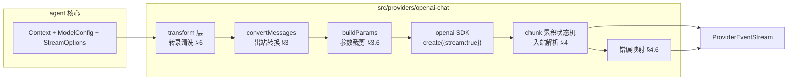
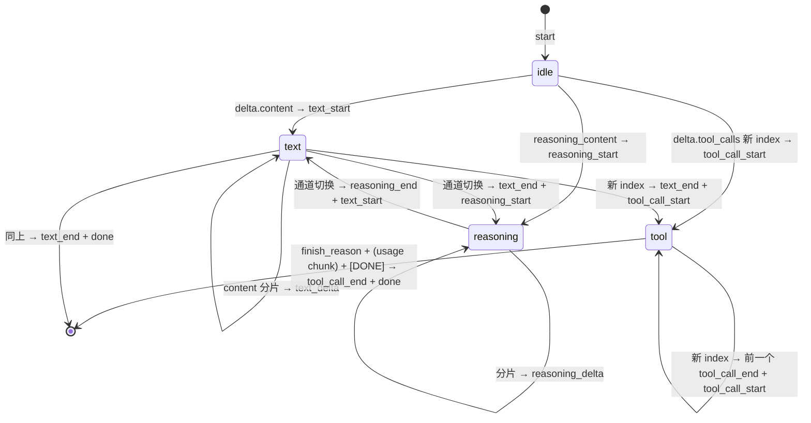

[← 返回地图](./README.md)

# 04 · Provider 接口契约与 Adapters

本文是 provider 层的完整规格:先回顾 agent 执行引擎唯一消费的 provider 形态(`StreamFn`),然后
逐节展开 Chat Completions adapter 的出站转换、入站解析状态机、错误映射、`CompatFlags` 方言系统
与 transform 转录清洗层；第 8 节定义 Anthropic Messages adapter，第 11 节定义 OpenAI
Responses adapter 的独立 wire 契约。协议隔离(需求 1)的生产落点都在本文:
**生产 `src/` 中，`openai` 包及类型只允许出现在 `src/providers/openai-chat/` 与
`src/providers/openai-responses/` 内；`@anthropic-ai/sdk` 只允许出现在
`src/providers/anthropic-messages/` 内；adapter 互相隔离，ESLint 边界规则违者报错**。手动录制
fixture 的 `scripts/record-fixture*.ts` 是带局部 lint 说明的非运行时例外，不能被 core 引用。

当前 provider composition 有两条稳定路径，共享同一 `StreamFn` 契约与 `ModelRef.api` 协议选择:

- 显式 `createRuntime({capabilityMode:'registry', capabilityServices})` 路径由
  `ProviderAdapterRegistry` 原子注册版本化 StreamFn，并在每个 turn 开始时捕获一次不可变
  snapshot；ThreadRuntime/Agent 只消费该 snapshot 解析出的函数。
- production CLI、普通 direct `Agent` / `Session` 与缺省 `createRuntime()` 有意保留 static
  compatibility path；CLI 的 `createProviderStreamFn()` 只按当次 `model.ref.api` 在已知 adapter 中分发，
  不按 provider id、model 名或 base URL 猜协议。

两条路径的未知 api 都按 StreamFn 铁律产生流内 error，不 fallback。registry 与同 turn 一致性的
canonical 定义见
[12 · Supervisor Runtime](./12-supervisor-runtime.md)。

## 1. StreamFn 契约回顾

类型定义与 [内部协议](./03-internal-protocol.md) 完全一致,原样引用:

```ts
// src/protocol/provider.ts
export interface ModelConfig {
  ref: ModelRef;
  baseURL?: string; apiKey?: string; headers?: Record<string, string>;
  compat?: CompatFlags;      // 方言开关,见 §5
  capabilities?: Readonly<Record<string, unknown>>; // provider model metadata,供参数协商
  limits?: { context: number; output: number };
  defaults?: { temperature?: number; reasoningEffort?: string; maxOutputTokens?: number };
}
export interface StreamOptions { signal?: AbortSignal; temperature?: number; maxOutputTokens?: number; reasoningEffort?: string }
export type StreamFn = (model: ModelConfig, context: Context, options?: StreamOptions) => ProviderEventStream;
```

三条铁律(违反任意一条即 adapter 实现 bug):

1. **绝不 throw、绝不 reject。**一切错误——网络失败、4xx/5xx、abort、SSE 中断、setup 阶段异常——编码为流内 `error` 事件,附 stopReason 为 `error`/`aborted` 的 AssistantMessage。pi-mono 的 `StreamFunction` 契约注释把这条写死,收益是 agent loop 零 try/catch 处理 provider 差异;codex 的 Rust 实现同样把 provider 错误收敛为协议内事件而非异常传播。
2. **同步返回流。**`StreamFn` 不是 async 函数:先构造 `ProviderEventStream` 返回,内部再启动 async 工作(参考 pi 的 `lazyStream` 模式,setup 失败也 push `error` 事件而不是 reject)。
3. **事件序列合法。**`start` 首发;每个内容块严格三段式 `*_start → *_delta* → *_end`,`contentIndex` 对应 `partial.content` 下标;终止事件恰好一个(`done` 或 `error`);每个事件携带同一个逐步生长的 `partial` 快照;`stream.end(message)` 在终止事件后调用,使 `result()` resolve。

Adapter 的责任边界:**生产 `src/` 的 wire 协议(`ChatCompletionMessageParam`、`ChatCompletionChunk`、Responses input/stream event)只存在于对应 adapter 内部**,进出都是内部协议类型；手动 recorder 只负责采集 fixture，不进入运行时转换链。这是四层类型体系的最后一层(见 [架构](./02-architecture.md))。

`StreamFn` 仍是一次 turn 内的值依赖，而不是让 Agent 持有或回查可变 registry。static
compatibility path 继续通过 `AgentConfig.streamFn` 直接注入；registry path 由 ThreadRuntime 从 turn
起点捕获的 provider snapshot 解析并注入。registry 在流式期间 register/unregister 不得替换
正在执行的函数，也不得让未知 api fallback 到另一个协议。

## 2. ChatCompletionsAdapter 总体结构



模块形态遵循 pi 的经验:**无状态模块级函数,不是类层次**。对外只导出:

```ts
// src/providers/openai-chat/index.ts
export const streamOpenAIChat: StreamFn;           // 唯一入口
export function detectCompat(baseURL: string | undefined): Required<CompatFlags>;  // §5
```

SDK client 按 `(baseURL, apiKey, 排序后的 headers)` 惰性构造并缓存；headers 不同必须使用不同
client，否则后续配置的请求头会被静默忽略。`maxRetries` 保留 SDK 默认(2 次,覆盖网络层瞬时错误),
**整轮重发策略放在 RetryCoordinator**——openai-node 的重试只到响应头返回为止,SSE 流中途断开
SDK 不会续传,这类恢复必须由持有完整转录的 ThreadRuntime 决定。

## 3. 出站转换:Context → ChatCompletionMessageParam[]

入口伪码:

```ts
function convertMessages(ctx: Context, model: ModelConfig, compat: Required<CompatFlags>): ChatCompletionMessageParam[] {
  const out: ChatCompletionMessageParam[] = [];
  if (ctx.systemPrompt) out.push({ role: compat.supportsDeveloperRole ? 'developer' : 'system', content: ctx.systemPrompt });
  for (const m of ctx.messages) {
    switch (m.role) {
      case 'user':        out.push(convertUser(m, compat)); break;
      case 'assistant':   pushAssistant(out, m);            break;  // 可能跳过(§3.2)
      case 'tool_result': pushToolResult(out, m, compat);   break;  // 可能追加补充 user 消息(§3.4)
    }
  }
  return out;
}
```

注意:此函数假定输入已经过 transform 层清洗(§6)——aborted 消息已滤除、孤儿 toolCall 已补结果。convertMessages 自身只做机械映射,不做修复;职责分开才可各自测试。

### 3.1 逐 role 映射规则

| 内部消息 | wire 形状 | 规则 |
|---|---|---|
| `systemPrompt` | `{role:'system'\|'developer', content: string}` | `compat.supportsDeveloperRole` 为 true 时用 developer(openai-node 类型注释:o1 及更新模型以 developer 取代 system;OpenAI 端会自动映射,但第三方兼容端点大多只认 system,默认 system) |
| `UserMessage` | `{role:'user', content: string \| ContentPart[]}` | 纯文本时输出**字符串**而非单元素数组;含 ImagePart 且 `compat.supportsImageParts` 时转 `{type:'image_url', image_url:{url:'data:<mime>;base64,<data>'}}` part 数组;不支持视觉的模型由 transform 层提前降级(§6),此处不再判断 |
| `AssistantMessage` | `{role:'assistant', content: string \| null, tool_calls?}` | 见 §3.2 |
| `ToolResultMessage` | `{role:'tool', tool_call_id, content: string}` | 见 §3.3、§3.4 |

`source` 字段(steering/follow_up/synthetic)不影响 wire 形状——steering 消息就是普通 user 消息,这正是 Chat Completions 无状态协议的红利:所有上下文由客户端持有,turn 之间插入消息零成本。

### 3.2 assistant 消息:纯字符串 content、白名单字段、空消息跳过

```ts
function pushAssistant(out, m: AssistantMessage): void {
  const text = m.content.filter(p => p.type === 'text').map(p => p.text).join('');
  const toolCalls = m.content.filter(p => p.type === 'tool_call');
  if (!text && toolCalls.length === 0) return;          // ★ 空 assistant 消息跳过
  out.push({
    role: 'assistant',
    content: text || null,                              // 有 tool_calls 时允许 null
    ...(toolCalls.length > 0 && {
      tool_calls: toolCalls.map(tc => ({
        id: tc.id, type: 'function' as const,
        function: { name: tc.name, arguments: tc.rawArguments ?? JSON.stringify(tc.arguments) },
      })),
    }),
  });
}
```

三个决策及理由:

1. **text 合并为纯字符串,不用 `[{type:'text'}]` 数组。**pi 的 convertMessages 注释明确:数组形式会诱发 DeepSeek 等模型模仿结构化输出。ReasoningPart 在这里被**丢弃**(同模型重放时 Chat Completions 无处安放 reasoning;跨模型时 transform 层已按需降级为文本,见 §6)。
2. **空 assistant 消息(aborted 后无任何内容)直接跳过。**很多 provider 拒绝 content 与 tool_calls 皆空的 assistant 消息(400)。
3. **只输出请求侧白名单字段。**openai-node 的 `AbstractChatCompletionRunner.toRequestMessage()` 在回放历史时剥掉 `parsed`、`annotations` 等响应侧字段;我们从内部协议渲染,天然不会带脏字段,但要注意 `arguments` 优先用 `rawArguments`(保留模型原始输出,避免 parse→stringify 往返改变键序或丢失截断现场)。

### 3.3 tool_calls / tool 配对纪律与常见 400

Chat Completions 的硬性规则(违反即 `BadRequestError` 400):

- 每个 `tool_calls[].id` 必须有**恰好一条** `role:'tool'` 消息响应,且 tool 消息必须**紧跟**在该 assistant 消息之后,顺序建议与 tool_calls 一致。缺失时的典型报错:`... The following tool_call_ids did not have response messages: call_xxx`;
- `role:'tool'` 不能没有前置的 assistant(tool_calls) 消息(API 报错原文带拼写错误 `preceeding`);
- `tool_call_id` 必须与 assistant 中的 id 逐字一致——第三方 provider 返回空 id 时必须在入站侧先兜底(§4.3),否则回传时配对断裂;
- tool 消息 `content` 只能是 string 或 text part 数组,**不能放 image part**。

adapter 不负责「制造」配对完整性——那是 transform 层(§6)与 agent loop(被打断的批次补合成结果,见 [steering 文档](./06-steering-following.md))的职责;adapter 在 debug 构建下可加一个廉价断言:渲染完成后扫描一遍配对,不合法时 log 完整 messages 现场再照发(留给服务端报 400,现场日志是修 bug 的关键)。

### 3.4 图片工具结果:抽出补 user 消息

工具结果(如 read 读图片)可含 ImagePart,但 tool 消息装不下。照抄 pi 的做法:

```ts
function pushToolResult(out, m: ToolResultMessage, compat): void {
  const text = renderTextParts(m.content) || (m.isError ? 'Error (no output)' : '(no output)');
  out.push({ role: 'tool', tool_call_id: m.toolCallId, content: text,
             ...(compat.requiresToolResultName && { name: m.toolName }) });
  // 图片在批内收集,「整批 tool 消息结束后」统一补一条 user 消息:
  //   { role:'user', content: [ {type:'text', text:'Attached image(s) from tool result:'}, ...images ] }
  // 不得逐条 toolResult 立即插入——多工具批次会被 user 消息从中间劈开,违反 §3.3 配对纪律(400)。
  // compat.requiresAssistantAfterToolResult:插入决策基于 wire 相邻关系而非转录相邻——
  // push 任何 user 消息(含图片合成消息)前,若 out 末尾是 role:'tool',先插合成
  // assistant 占位(内容 "Continuing.")。空/仅 reasoning 的 assistant 在 wire 上被跳过,
  // 「转录里的下一条」不等于「wire 上的下一条」,按转录判断会被绕过。
}
```

`details` 字段(结构化诊断,如 edit 的 diff)**永不出站**——它是 UI/持久化专用。

### 3.5 工具 schema 渲染与 strict

```ts
tools: ctx.tools?.map(t => ({
  type: 'function' as const,
  function: {
    name: t.name, description: t.description,
    parameters: t.parameters,                     // 已由工具框架经 z.toJSONSchema() 生成
    ...(compat.supportsStrictTools && { strict: true }),
  },
}))
```

`strict: true`(OpenAI Structured Outputs)保证 arguments 严格符合 schema,可免去大量参数校验,但要求 JSON Schema 子集:根为 object、所有对象 `additionalProperties:false`、**所有属性进 `required`**(可选语义用 `type:['string','null']`)。adapter 在附加 `strict:true` 前对 ToolSchema 做子集清洗:`additionalProperties:false`、全属性入 `required`、可选语义转 `type:[...,'null']`(非 OpenAI 端点支持度参差,受 `supportsStrictTools` 开关控制;protocol 层的 ToolSchema 保持原始 JSON Schema,见 [工具文档](./07-tools.md))。注意:**即便 strict,`finish_reason:'length'` 截断时 arguments 仍可能非法**,不能因 strict 而省掉 length 防线(§4.4)。

### 3.6 参数裁剪(buildParams)

参数裁剪必须同时看 endpoint 方言与已知模型能力,否则推理模型收到 `temperature` 或不支持的
`reasoning_effort` 会直接 400。`compat` 决定字段名和 endpoint 是否接受可选字段；adapter 内的私有
模型表只能进一步收窄。模型匹配只接受精确 id 或官方日期快照(`base-YYYY-MM-DD`)，不能用宽泛前缀
让 Pro、Codex、Chat 等命名变体误继承基础模型能力。未知模型保留 endpoint 的兼容回退，但非法
effort 字符串以及非有限值、超出 `0..2` 的 temperature 一律省略。

```ts
function buildParams(model, ctx, options, compat): ChatCompletionCreateParamsStreaming {
  const maxTokens = options?.maxOutputTokens ?? model.defaults?.maxOutputTokens;
  const known = knownModelParameters(model.ref.model);
  const temperature = normalizeTemperature(model, options, compat, known);
  const reasoningEffort = normalizeReasoningEffort(model, options, compat, known);
  return {
    model: model.ref.model, messages: convertMessages(ctx, model, compat),
    stream: true,
    ...(compat.supportsUsageInStreaming && { stream_options: { include_usage: true } }),
    ...(maxTokens != null && { [compat.maxTokensField]: maxTokens }),   // 'max_completion_tokens' | 'max_tokens'
    ...(temperature !== undefined && { temperature }),
    ...(reasoningEffort !== undefined && { reasoning_effort: reasoningEffort }),
    ...toolsAndChoice(ctx, compat),
  };
}
```

当前 OpenAI 已知模型矩阵如下；Responses-only 的 Pro/Codex 型号不加入 Chat 表：

| 已知模型 | reasoning effort | temperature |
|---|---|---|
| GPT-4o、GPT-4.1、GPT-4 Turbo、GPT-3.5 Turbo | 省略 | `0..2` 内透传 |
| o1/o3/o4-mini | `low/medium/high` | 省略 |
| GPT-5 | `minimal/low/medium/high` | 省略 |
| GPT-5.1 | `none/low/medium/high` | 省略 |
| GPT-5.2/5.4/5.5（含 5.4 mini/nano） | `none/low/medium/high/xhigh` | 省略 |
| GPT-5.6（含 Sol/Terra/Luna） | `none/low/medium/high/xhigh/max` | 省略 |
| Responses: GPT-5.2/5.4/5.5 Pro | `medium/high/xhigh` | 省略 |
| Responses: GPT-5 Pro | `high` | 省略 |
| Responses: GPT-5.2/5.3 Codex | `low/medium/high/xhigh` | 省略 |

给推理模型设太小的 `max_completion_tokens` 会出现「token 全烧在 reasoning、content 为空、finish_reason:'length'」,这不是 adapter 能救的,Runtime 的 model limits 配置负责给足预算。

## 4. 入站解析:chunk 累积状态机

### 4.1 消费骨架

```ts
export const streamOpenAIChat: StreamFn = (model, context, options) => {
  const stream = new ProviderEventStream();
  void (async () => {
    const state = newStreamState(model);          // partial AssistantMessage + 解析状态
    stream.push({ type: 'start', partial: state.partial });
    try {
      const raw = await client.chat.completions.create(buildParams(...), { signal: options?.signal });
      for await (const chunk of raw) handleChunk(chunk, state, stream);   // ★ 手写 for-await,见 §7
      finalize(state, stream);                    // 收尾:flush 未闭合块、映射 finish_reason、push done
    } catch (err) {
      pushErrorEvent(err, state, stream, options?.signal);               // §4.6
    }
  })();
  return stream;
};
```

### 4.2 状态与事件发射

```ts
interface StreamState {
  partial: AssistantMessage;        // 所有事件共享同一引用,content 数组逐步生长
  open: { kind: 'none' } | { kind: 'text' | 'reasoning'; contentIndex: number };
  toolSlots: Map<number, ToolSlot>; // key = delta.tool_calls[].index(★ 累积 key,不是数组位置)
  finishReason: string | null;      // 最后一个内容 chunk 携带;usage chunk 在其后
}
interface ToolSlot { contentIndex: number; id: string; name: string; rawArguments: string }
```



handleChunk 规则(照抄 openai-node `ChatCompletionStream.ts` 的 `#accumulateChatCompletion` 官方累积算法,这是与官方 helper 行为等价的保证):

- 只看 `choices[0]`(不发 `n>1`);**容忍空 `choices` 数组**——OpenAI 只有 usage chunk 如此,某些第三方 provider 常发;
- `delta.content` 非空 → 若 open 是 reasoning 先发 `reasoning_end` 切块;不在 text 块则 push TextPart 进 `partial.content` 并发 `text_start`;追加文本、发 `text_delta`;
- reasoning 扩展字段(§4.5)同理走 reasoning 三段式;
- `delta.tool_calls[]`:对每个条目,**按 `index` 定位槽位**(`index` 缺失回退 0——部分第三方从不给 index);新 index → 关闭当前 text/reasoning 块、为**上一个** tool slot 发 `tool_call_end`(openai-node helper 的 `arguments.done` 触发时机:新 index 出现或 finish_reason 到来),再建槽发 `tool_call_start`;`id`/`type`/`function.name` 仅首个分片携带,**name 覆盖不拼接**;`function.arguments` **字符串拼接**——它是任意切割的 JSON 分片;
- **每个 arguments delta 后用容错 JSON 解析刷新 `ToolCallPart.arguments`**(pi 的 `parseStreamingJson` 模式,partial-json 解析器):UI 可以实时看到半成品参数;`rawArguments` 始终保留原始串;`tool_call_end` 时做最终 `JSON.parse`,失败则保留容错解析结果并在 rawArguments 留现场(loop 层依据 stopReason 决定是否执行);
- `delta.refusal`(structured outputs 的拒绝路径,官方累积器单独拼接)→ 并入 text 通道,保证拒绝文本进转录(「转录永远完整」不变量);
- `delta.function_call`(deprecated 旧方言)→ 按官方累积器语义折算为单一 tool slot(伪 index),与 `finish_reason:'function_call'` 的映射保持一致——声称兼容就必须产出 ToolCallPart,不许空转录;
- `finish_reason` 非 null → 记录到 state,**不立即收尾**(include_usage 时其后还有一个 `choices:[]` 的 usage chunk);
- usage chunk → 按 §4.4 映射进 `partial.usage`。

### 4.3 id 缺失兜底

第三方 provider 常返回空/缺失的 tool call id。openai-node 在 `normalizeToolCallIds` 中自动补 `call_${uuid4()}`,我们照做:tool slot 建立时 `id ||= 'call_' + crypto.randomUUID()`。不兜底的后果:回传时 `tool_call_id` 配对断裂,下一轮请求 400(§3.3)。

### 4.4 finish_reason 映射表与 usage

| wire `finish_reason` | 内部 `StopReason` | 说明 |
|---|---|---|
| `stop` | `stop` | 自然结束或命中 stop sequence |
| `tool_calls` | `tool_calls` | loop 进入工具执行阶段 |
| `length` | `length` | **arguments 可能是非法/截断 JSON:照常产出 toolCall part,但 loop 层全批合成失败结果不执行**(pi 的教训:容错解析可能产出「能通过校验但被截断」的参数,一律不可执行) |
| `content_filter` | `content_filter` | 作为一等 StopReason 保留(pi 映成 error,我们不采纳——它是合法终态,转录应如实记录) |
| `function_call`(deprecated) | `tool_calls` | 兼容旧方言 |
| 流结束仍为 null | `error` | 「stream ended without finish_reason」,pi 同款处理 |
| 其它未知值 | `stop` | 保守当作干净收尾,console.warn 留现场(第三方方言的 'eos'/'max_tokens' 等) |

usage 映射(`CompletionUsage` → 内部 `Usage`,注意内部语义是 **inclusive**):

```
input     = prompt_tokens                                  // 已含 cached tokens,直接用(pi 做减法求 exclusive,我们的 Usage 语义相反,勿抄)
output    = completion_tokens                              // 已含 reasoning tokens
cacheRead = prompt_tokens_details?.cached_tokens
cacheWrite= prompt_tokens_details?.cache_write_tokens      // 非标扩展,可缺失
reasoning = completion_tokens_details?.reasoning_tokens
```

usage chunk **可能不来**(abort 中断、provider 不支持、`supportsUsageInStreaming` 关闭),`partial.usage` 初始化为全 0,缺失即保持 0——Usage 各字段设计上容忍缺失。个别 provider 在每个 chunk 都带非 null usage:直接覆盖(最后一次为准),不累加。

### 4.5 reasoning_content 第三方扩展

Chat Completions 标准协议**不返回 reasoning 内容**(那是 Responses API 的能力),但 DeepSeek、OpenRouter、vLLM 等在 delta 上扩展了非标字段。SDK 类型不含它、官方累积器按未知字段丢弃,所以必须自行从原始 chunk 读:

```ts
const d = chunk.choices[0]?.delta as Record<string, unknown> | undefined;
const reasoningDelta = compat.reasoningFormat !== 'none'
  ? (d?.reasoning_content ?? d?.reasoning ?? d?.reasoning_text) as string | undefined
  : undefined;
```

命中即走 `reasoning_start/delta/end` 三段式,落成 `ReasoningPart`。`compat.reasoningFormat` 同时决定出站侧的 reasoning 参数方言(§5)。

### 4.6 错误映射与 abort

catch 分支统一处理(SSE 层的 in-band 错误——`data:` 行 JSON 带 `error` 字段——SDK 已转为 throw `APIError`,与 HTTP 错误同路径):

```ts
function pushErrorEvent(err, state, stream, signal): void {
  const aborted = err instanceof APIUserAbortError || signal?.aborted === true;
  const msg = state.partial;                       // 保留已累积的 content(转录如实记录半成品)
  closeOpenBlocks(state, stream);                  // 未闭合块补 *_end 事件
  msg.stopReason = aborted ? 'aborted' : 'error';
  msg.errorMessage = aborted ? undefined
    : err instanceof APIError
      ? `${err.constructor.name} status=${err.status ?? 'n/a'} requestID=${err.requestID ?? 'n/a'}: ${err.message}`
      : String(err);
  stream.push({ type: 'error', message: msg });
  stream.end(msg);
}
```

| openai-node 错误类 | stopReason | 备注 |
|---|---|---|
| `APIUserAbortError`(或 catch 时 signal 已 aborted) | `aborted` | steering 硬打断 / Esc 的正常路径 |
| `RateLimitError` / `InternalServerError` / `APIConnectionTimeoutError` / `APIConnectionError` | `error` | errorMessage 保留类名,RetryCoordinator 据此判定可重试(见 [会话文档](./08-session-persistence.md)) |
| `BadRequestError`(400) | `error` | 大概率是我们的协议 bug,log 完整出站 messages 现场 |
| 其余 `APIError`(401/403/404/422…) | `error` | 不可重试,带 status/requestID |

`ProviderErrorDetails` 会进入 strict-JSON Runtime event；`status`、`code`、`requestId`、`retryAfterMs`
等可选字段没有值时必须省略，不能保留显式 `undefined`，否则诊断消息会在提交前被拒绝并退化成无原因的
interrupted 终态。三种 provider adapter 的错误分类都遵守这一边界。

abort 的传导链有**两条路径**(openai v6 实测):请求建立阶段(响应头返回前)abort → SDK throw `APIUserAbortError` → catch 分支映射;**SSE 流中途** abort → SDK 的流迭代器捕获 AbortError 后 **clean return,不 throw**(core/streaming.js 显式吞掉)→ for-await 正常结束——adapter 必须在收尾前检查 `signal.aborted && finishReason == null`,命中即按 aborted 收尾,否则用户打断会被误编码为「残缺流」类可重试 network 错误,RetryCoordinator 可能错误地重发用户明确取消的请求。被中断的 AssistantMessage(stopReason `'aborted'`)**保留已流出的部分内容进转录**,重放时由 transform 层过滤(§6)——这保证「转录永远完整」与「出站永远合法」两个不变量同时成立。

## 5. CompatFlags:方言开关与 baseURL 自动推断

pi 的 `OpenAICompletionsCompat` 证明了正确形态:**把方言差异声明化为数据,而不是代码分支散落各处**。完整字段清单(右侧为 OpenAI 官方端点的默认值):

```ts
// src/providers/openai-chat/compat.ts
export interface CompatFlags {
  maxTokensField?: 'max_completion_tokens' | 'max_tokens';  // 'max_completion_tokens'(max_tokens 已 deprecated 且与 o 系列不兼容)
  supportsDeveloperRole?: boolean;          // true:systemPrompt 渲染为 developer(第三方大多只认 system)
  supportsUsageInStreaming?: boolean;       // true:发 stream_options:{include_usage:true};关闭则不发该参数(有的端点见到即 400)
  supportsStrictTools?: boolean;            // true:工具 schema 附 strict:true
  supportsParallelToolCalls?: boolean;      // true:允许透传 parallel_tool_calls 参数
  supportsImageParts?: boolean;             // user content 可带 image_url part(视觉能力)
  supportsTemperature?: boolean;            // o 系列为 false(400 防线)
  supportsStop?: boolean;                   // o3/o4-mini 不支持 stop
  supportsReasoningEffort?: boolean;        // 是否透传 reasoning_effort
  reasoningFormat?: 'none' | 'openai' | 'reasoning_content';
    // 入站:读哪个扩展字段('reasoning_content' 覆盖 DeepSeek/OpenRouter/vLLM 系);出站:reasoning 参数方言
  requiresToolResultName?: boolean;         // tool 消息须附 name 字段(个别方言)
  requiresAssistantAfterToolResult?: boolean; // tool 结果后必须跟 assistant 消息(插合成占位)
}
```

推断策略:`detectCompat(baseURL)` 按 host 关键字给出完整 profile,`model.compat` 显式字段浅覆盖:

```ts
function resolveCompat(model: ModelConfig): Required<CompatFlags> {
  return { ...detectCompat(model.baseURL), ...model.compat };
}
// detectCompat 规则表(数据驱动,新方言加一行):
// api.openai.com / 未设置   → 全开:strict、usage、developer、max_completion_tokens、reasoningFormat:'openai'
// api.deepseek.com          → maxTokensField:'max_tokens'、reasoningFormat:'reasoning_content'、strict:false、developer:false
// openrouter.ai             → reasoningFormat:'reasoning_content'、usage:true、strict:false
// localhost / 未识别 host    → 保守 profile:一切可选参数关闭、max_tokens、reasoningFormat:'reasoning_content'
```

保守 profile 的原则:**未知端点宁可少发参数**——未知参数有的端点忽略、有的 400(openai-node 调研 §8 的行为差异清单)。此外第三方端点的已知怪癖 adapter 无条件容错,不设开关:tool call id 缺失(§4.3)、空 choices chunk、`index` 缺失回退 0、`[DONE]` 缺失靠连接关闭结束、SSE keep-alive 注释行(SDK decoder 已忽略)、错误体非标准结构(只依赖 status)。

## 6. transform 层:出站前转录清洗

位置在 `src/agent/`(纯内部协议操作,与 wire 无关,所有 provider 共用),每次发起 provider 请求前由 agent loop 调用。pi 的 `transform-messages.ts` 是直接蓝本——这一层让 abort、steering、换模型都不会产生非法请求,是健壮性核心:

```ts
// src/agent/transform.ts
export function convertContext(ctx: Context, target: ModelRef): Context {
  // 1. aborted/error 的 assistant 消息整条跳过不重放(不完整 turn 重放触发 API 报错;
  //    其 content 已在转录/UI 留档,重放无信息增量)
  // 2. 孤儿 toolCall 补合成结果:assistant 有 tool_call part 但后续无对应 toolResult 时,
  //    插入 { role:'tool_result', toolCallId, isError:true, content:[{type:'text',
  //    text:'[Tool execution was interrupted]'}] } —— abort 腰斩工具批次后,下一轮请求依然满足 §3.3 配对纪律
  // 3. 跨模型(!isSameModel(m.model, target)):ReasoningPart 降级为 TextPart 或剥离
  //    signature(其它模型无法验证签名);toolCallId 归一化(如 Responses 系超长 id 压到 40 字符)
  // 4. 非视觉模型:ImagePart 降级为占位文本 '[image omitted: <mimeType>]'
  return cleaned;
}
// 实现纪律(核查追加):
// a. 配对匹配必须按「assistant 块」归属——每条 tool_result 只归属其前方最近一条声明了
//    该 id 的 assistant。provider 跨 turn 复用 id(vLLM/llama.cpp 的 call_0 之类确定性 id)
//    时,全局 id 集合会把后 turn 的真实结果错配给前 turn 的孤儿/被滤块;
// b. 补合成结果按该 assistant 的 tool_calls 声明序输出(与 §3.3 的顺序断言一致);
// c. 不属于任何 kept assistant 的 dangling tool_result 一并丢弃(转录事实层不会自产,
//    但 transformContext 钩子可能产出;convertContext 是出站合法性的最后一道);
// d. 步骤 4 只在显式 supportsImageParts:false 时触发(agent 层读不到 baseURL 自动推断的
//    resolved profile);自动推断为非视觉的端点由 adapter 兜底——tool 消息里的图片
//    以 '[image omitted: <mime>]' 并入文本,user 消息同样占位,均不无声丢弃。
export const isSameModel = (a: ModelRef, b: ModelRef) =>
  a.provider === b.provider && a.api === b.api && a.model === b.model;
```

顺序敏感:先滤 aborted(规则 1)再补孤儿(规则 2)——被滤掉的 aborted assistant 若含 toolCall,其 toolResult 也要一并滤除,否则产生「无前置 assistant 的 tool 消息」这一反向 400。`isSameModel` 依赖 AssistantMessage 自带的 `ModelRef` 三元组,这正是消息模型(见 [内部协议](./03-internal-protocol.md))把模型出处编码进每条消息的原因。

与 adapter 的分工:transform 管**语义修复**(协议层不变量),convertMessages 管**机械翻译**(wire 格式)。opencode V1 曾把二者混在渲染层,V2 重构时才拆开——从一开始就分层可避免这次返工。

## 7. 为什么手写 for-await,不用 SDK 的 `.stream()` helper

`client.chat.completions.stream()` 返回的 `ChatCompletionStream` 提供事件订阅、snapshot 维护与 finalize,看似省事,但三条理由决定不用:

1. **事件粒度不匹配。**helper 的事件模型(`content.delta`、`tool_calls.function.arguments.delta`…)是为终端用户设计的,没有 contentIndex 定位、没有我们的三段式块结构、没有逐事件 partial 快照;要凑出 `ProviderEvent` 仍需自建一层状态机,等于状态机写两遍。
2. **错误策略冲突。**helper 在 auto-parse 模式(strict tools / zodFunction)下对 `finish_reason === 'length' | 'content_filter'` 直接 throw(`LengthFinishReasonError` / `ContentFilterFinishReasonError`);而我们的协议里这两者是合法 StopReason——length 要走「产出 toolCall 但全批不执行」路径,content_filter 要如实进转录。被 helper 抢先抛掉就失去了决定权。
3. **第三方脏数据容忍度。**helper 的累积器丢弃未知字段(`reasoning_content` 读不到)、finalize 校验(缺 finish_reason、缺 type/name)直接抛 `OpenAIError`;对非 OpenAI 端点的残缺流,我们需要的是降级容错而非 fail-fast。手写消费依赖面最小,方言适配全部收在自己的状态机里。

helper 中**值得照抄**的部分(抄算法不抄依赖):`#accumulateChatCompletion` 的按 index 归并 + arguments 拼接算法(§4.2)、`normalizeToolCallIds` 的 id 兜底(§4.3)、`arguments.done` 的触发时机(新 index 或 finish_reason 到来时给上一个 call 收尾)。

## 8. Anthropic Messages Adapter 与新增 provider 清单

`src/providers/anthropic-messages/` 是已落地的独立 adapter，对外唯一运行时入口是
`streamAnthropicMessages: StreamFn`。生产 `src/` 中，`@anthropic-ai/sdk` 及其 wire 类型只能出现在
该目录，不得进入 protocol、agent、session、runtime 或 CLI 函数签名；手动 recorder 例外仍只在
`scripts/` 内。当前实现契约如下:

- **出站:**`systemPrompt` 进顶层 `system`；连续同 role 消息合并以满足 user/assistant
  交替约束；`ToolResultMessage` 进 user 消息的 `tool_result` block，文本/图片都可原生回传；
  有合法 signature 的 `ReasoningPart` 恢复为 `thinking` block；其中 adapter 私有的
  `redacted_thinking` opaque envelope 恢复为同名 block，`data` 字符串原样回传；工具 schema
  使用 `input_schema`。
  当前 envelope 使用 `anthropic-messages:redacted-thinking:v1:` 前缀和
  `{type:'redacted_thinking',data:string}` JSON 载荷；载荷中的 `data` 不被 adapter 解释。
  `max_tokens` 是必填项，默认值、thinking budget、图片与 temperature 支持由 adapter 自己的
  `AnthropicCompatFlags` 解析，不复用 openai-chat 的 compat 类型。`reasoningEffort` 只接受
  Anthropic SDK 当前 `OutputConfig.effort` 的 `low | medium | high | xhigh | max` 值。
- **thinking 能力安全:**官方 endpoint 的已知 adaptive 模型（Claude 4.6、4.7、4.8、5
  以及 Fable/Mythos 5 和 Mythos Preview）发送精确的
  `{ thinking: { type: 'adaptive' }, output_config: { effort } }`，不发送
  `budget_tokens`，也不为 adaptive 模式抬高 `max_tokens`。仍只支持旧 extended-thinking 的
  4.5、4.1、较早 Claude 4 与 3.7 模型保留
  `{ thinking: { type: 'enabled', budget_tokens } }`；只有 Opus 4.5 额外发送官方允许的
  `output_config.effort`。未知 model id 或保守的第三方 endpoint 不发送 `thinking`/
  `output_config`，避免把任一模式猜测到不支持的模型上。
- **temperature 能力安全:**`supportsTemperature` 只是 endpoint 门禁；Claude Fable 5、
  Mythos 5/Preview、Opus 5、Opus 4.8/4.7、Sonnet 5 只接受默认 temperature，resolver 对这些
  精确 model id 收窄为省略 temperature；thinking 开启时所有模型也省略 temperature。未知模型与
  兼容端点继续使用 endpoint profile，不按模型名猜测其能力；实际发送值还必须是 `0..1` 内的有限数。
- **入站:**`content_block_start/delta/stop` 按 wire index 定位，按本地 append 顺序分配
  `contentIndex`；`input_json_delta` 持续拼接 `rawArguments` 并刷新容错解析。
  `redacted_thinking.data` 作为 opaque 字符串保存在 `ReasoningPart` 的 adapter 私有 envelope
  中，并通过既有 reasoning 三段式事件占位；不得解密、解释或转成可见文本。其他未建模的
  server-tool block 仍按 tolerant-reader 规则忽略。
- **终态:**`end_turn | stop_sequence | pause_turn` → `stop`，`max_tokens` → `length`，
  `tool_use` → `tool_calls`，`refusal` → `content_filter`。`model_context_window_exceeded` 是
  Anthropic 的上下文窗口截断标记，编码为 `error` + `errorDetails.kind = 'overflow'`，交给
  session compaction；流结束仍无 `stop_reason` 是可重试 network error。其他未知值警告后
  fail closed 为不可重试的 `error`(`errorDetails.kind = 'unknown'`)，不能把未来新增的截断
  原因误报为成功。
- **usage:**Anthropic 的 exclusive 输入口径在 adapter 内归一为
  `input_tokens + cache_read_input_tokens + cache_creation_input_tokens`；`cacheRead/cacheWrite/reasoning`
  仍是 inclusive totals 的信息性拆分。
- **错误与 abort:**SDK/HTTP/SSE/网络错误统一映射为 `ProviderErrorDetails` 与流内
  `error`；请求建立期 throw 与 SSE 中途 abort 后的 clean return 都映射为 `aborted`，并保留
  已产生的 partial content。
- **client:**缓存键为 `(剔除末尾一个 /v1 后的 baseURL, apiKey, 排序后的 headers)`。
  只精确剔除末尾 `/v1`，避免 Anthropic SDK 追加 `/v1/messages` 时形成 `/v1/v1/messages`。

本项目当前的 Chat Completions 与 Anthropic Messages wire 都没有 Responses assistant message
`phase` 的等价字段。两者产生的普通可见文本继续保存为缺失 `phase` 的 `AssistantTextPart`；不得根据
文本先后、`tool_calls` / `tool_use` stop reason 或是否紧邻工具调用，推断并写回 `commentary`。
需要跨 provider 展示中间进度时，前端组合既有 Runtime 事实：message/turn 生命周期、
`tool_call_*`、approval、`tool_execution_start/update/end`、plan、retry 与 compaction；这些是应用执行
进度，不是 assistant commentary。Chat 的 reasoning 扩展与 Anthropic `thinking/signature` 仍只走
`ReasoningPart` / `reasoning_*`。如果未来需要模型主动报告语义里程碑，应增加显式、无副作用的
progress capability 及独立 provenance/event，而不是借用 thinking block 或伪造 provider phase。
Anthropic 的公开流事件边界见其
[streaming 文档](https://platform.claude.com/docs/en/build-with-claude/streaming)。

新增其他 provider 时按以下清单实施:

1. 新建隔离的 `src/providers/<adapter>/`，并在 ESLint/边界测试中把第三方 SDK 精确限定在该目录。
2. 实现同步返回、never-throw 的 `StreamFn`，将 wire 类型、方言 compat、错误映射和手写流状态机
   收在 adapter 内；录制 fixture 并复用事件文法/abort/never-throw 契约测试。
3. 在 registry composition 中原子注册 `{api, version, implementationDigest, stream}`，并测试热更新
   只影响下一 turn。如果默认 production CLI 也要暴露该 provider，还要在当前 static
   compatibility composition 的 `providerAdapterForApi()` 和 model directory 中显式登记；这个 switch
   是 CLI composition boundary，不得下沉到 Agent、Session 或 CLI 事件循环。
4. 未知 api 在两条 composition 中都产生合法 start → error 流，不 throw、fallback 或根据
   provider/model/baseURL 猜协议。
5. 原则上不改 `src/protocol/`、`src/agent/`、`src/tools/` 与 ThreadRuntime 执行循环；如果新
   provider 必须修改这些层，先确认是否内部协议确有抽象缺口。

## 9. faux provider 规格(脚本化回放,测试专用)

`src/providers/faux/` 是测试专用 provider:纯内存、零网络,让 agent loop、steering、abort 的全部测试离线运行(pi 的 `providers/faux.ts` 同思路)。接口与行为的完整规格以 [测试文档 §3](./10-testing.md) 为准:`createFauxStreamFn(script)` 返回 `StreamFn & { calls }`;脚本形如 `FauxScript{ turns, onExhausted }`,每个 `FauxTurn` 由 `events`(text/reasoning/tool_call/gate)、`stopReason`、`error`、`usage`、`onRequest` 组成;`Gate` 原语让流悬停在指定位置,由测试显式放行。本文只记结论性要点:

- 每次被调用消费下一个 turn,按内部协议发出**完全合法**的事件序列(start → 三段式块 → done/error),每事件带生长中的 partial;stopReason 缺省推导:含 tool_call → `'tool_calls'`,否则 `'stop'`;脚本耗尽行为由 `onExhausted` 决定(测试默认让多余的 loop 迭代直接 fail);
- **尊重 `options.signal`**:每个事件发射间隙与 gate 等待中检查 signal,aborted 则按 §4.6 语义收尾(stopReason `'aborted'`、保留已发内容)——用 gate 把流挂起再 abort,是 abort/steering 时序测试的受控注入点;
- `calls` 数组是关键断言面:steering 测试验证第二次调用的 context 里出现 `source:'steering'` 的 user 消息;transform 测试验证 aborted 消息未被重放、孤儿 toolCall 已补结果;
- faux 走与真实 adapter 完全相同的 `StreamFn` 契约与契约测试套件——它既是测试工具,也是「内部协议自身可实现性」的常驻证明。

adapter 本体的测试不用 faux,用**录制的 SSE/event fixture 回放**并走与生产相同的消费管线。
Chat 需覆盖 tool_calls 多片分割、双 index、usage chunk、`length` 截断 JSON、in-band error、id 缺失、
`reasoning_content` 与空 choices；Responses 需覆盖 text/reasoning/function-call/terminal 事件与并行
arguments；Anthropic 需覆盖 text/tool/thinking/redacted_thinking round-trip、exclusive → inclusive
usage、stop_reason、残缺流与 abort clean return。完整矩阵见 [测试文档](./10-testing.md)。

## 10. 验收清单

- [ ] ESLint 边界规则生效:在 `src/agent/` 里 import `openai` 或 `@anthropic-ai/sdk` 触发 lint 错误，三个真实 adapter 目录之间的交叉 SDK import 同样报错;
- [ ] `streamOpenAIChat` 在断网、无效 apiKey、404 baseURL、请求中 abort 四种场景下均不 throw/reject,流以正确 stopReason 的 `error` 事件收尾;
- [ ] `streamAnthropicMessages` 的 text/tool/thinking fixture、stop_reason 映射、exclusive → inclusive usage、缺失终态与 abort clean-return 路径都产出合法事件序列;
- [ ] Chat、Responses 与 Anthropic client cache 都把排序后的 headers 纳入 key；Anthropic 只剔除 baseURL 末尾精确一个 `/v1`;
- [ ] 出站快照测试:含 system/user(图)/assistant(text+2 toolCall)/2 toolResult(其一带图)的 Context 渲染结果与快照一致;空 assistant 被跳过;tool 配对紧邻且序一致;
- [ ] strict 清洗的快照测试:原始 ToolSchema → 清洗后 schema 与快照一致;
- [ ] 入站 fixture 回放:§9 列出的全部 fixture 产出合法事件序列(自动校验器:三段式配对、contentIndex 连续、终止事件唯一);
- [ ] `length` fixture:toolCall 照常产出、`rawArguments` 保留截断现场、stopReason 为 `'length'`;
- [ ] id 缺失 fixture:产出 `call_` 前缀 UUID,且出站回传时配对成立;
- [ ] usage:OpenAI fixture 映射出 input/output/cacheRead/reasoning;无 usage chunk 的 fixture 保持全 0 不报错;
- [ ] `detectCompat` 规则表单测:四类 baseURL 各返回预期 profile,`model.compat` 覆盖生效;
- [ ] transform 层单测:aborted 消息(含其 toolResult)滤除、孤儿补结果、跨模型 reasoning 降级、非视觉图片降占位;
- [ ] faux provider 通过与 openai-chat 相同的 StreamFn 契约测试套件;
- [ ] 真实 OpenAI 端点冒烟(手动/CI 可选):一次带工具调用的完整 turn 往返无 400。
- [ ] ProviderAdapterRegistry snapshot 冻结 revision/entries；同名 adapter 热更新时当前 turn 继续使用旧 StreamFn，下一 turn 才使用新版本；
- [ ] 未知 `ModelRef.api` 产生合法 start→error 流，不 throw、fallback 或按 provider 猜协议。

## 11. OpenAI Responses Adapter

`src/providers/openai-responses/` 是与 `openai-chat` 并列、互不依赖的 adapter。对外唯一运行时入口是
`streamOpenAIResponses: StreamFn`；OpenAI SDK、Responses 请求类型与流事件类型不得出现在
`protocol/`、`agent/`、`session/`、`runtime/` 或 CLI 的函数签名里。模型配置只携带
`ModelRef{provider:'openai', api:'openai-responses', model}`。registry mode 由 turn 捕获的
ProviderAdapterRegistry snapshot 按 `api` 选择该入口；production CLI 的 static compatibility
dispatcher 也只按当次 `model.ref.api` 选择同一 StreamFn，不按 provider/model 猜测。

### 11.1 出站：Context → instructions / input / tools

生产调用等价于:

```ts
client.responses.create({
  model: model.ref.model,
  instructions: context.systemPrompt,
  input: convertInput(context.messages),
  tools: convertTools(context.tools),
  stream: true,
  // 已知 reasoning 模型与未知兼容模型才加入；已知非 reasoning 模型整体省略
  ...(supportsReasoning && { include: ['reasoning.encrypted_content'] }),
  ...(supportsReasoning && { reasoning: { summary: 'auto', /* effort 已按模型校验 */ } }),
  // options/defaults 按需映射 max_output_tokens、temperature、reasoning effort
}, { signal });
```

逐项映射:

| 内部形态 | Responses wire |
|---|---|
| `systemPrompt` | 顶层 `instructions` |
| `UserMessage` 文本/图片 | `input` 中 user message；图片为 data URI `input_image` |
| assistant `AssistantTextPart` | assistant input message；`phase` 明确存在时原样回传 `commentary` / `final_answer`，缺失时不猜测 |
| assistant `ReasoningPart` | 仅当 `signature` 是本 adapter 的 replay 信封时恢复为 `reasoning` item；信封保存 item id、item/summary/content kind、index 与可选 `encrypted_content` |
| `ToolCallPart` | `{type:'function_call', call_id: part.id, name, arguments}`，优先使用 `rawArguments` |
| `ToolResultMessage` | `{type:'function_call_output', call_id: toolCallId, output}`；文本/图片均可回传，`details` 永不出站 |
| `ToolSchema` | Responses 的扁平 function tool `{type:'function', name, description, parameters, strict:false}` |

`ToolCallPart.id` 在本 adapter 中明确等于 Responses `call_id`，不是 output item 的 `id`。
这是本地工具结果与 `function_call_output.call_id` 配对的唯一键。adapter 只做转换，**不得执行工具**；
工具发现、审批、调度与执行继续完全属于 agent loop。

同一内部 `AssistantMessage` 可以依次包含多个 Responses message item，因此 phase 只能落在
`AssistantTextPart`，不能放到整条内部消息上。出站转换只合并相邻且 phase 相同的文本；phase 边界、
reasoning item 和 function call 都会先 flush 当前 assistant input message，以保持完整输出次序。

已知 reasoning 模型显式发送 `reasoning.summary:'auto'`，即使未指定 `reasoning.effort` 也请求摘要；
已知非 reasoning 模型同时省略 `reasoning` 与 `include:['reasoning.encrypted_content']`。未知模型保留
summary-only 的历史兼容回退。它请求的是 API 可返回的 reasoning **摘要**，不是原始 reasoning tokens；TUI 只用 public
`ReasoningPart.kind === 'summary'` 的文本更新临时 Working 行，Runtime review 仍是完整 canonical
message/reasoning 内容的读取面。加密 replay 数据继续由 `include:['reasoning.encrypted_content']`
保留，不能因摘要 UI 而移除。

未知兼容端点仍可能拒绝整个 `reasoning` 参数。adapter 只在首次参数是严格的
summary-only `{summary:'auto'}`，且 SDK 抛出 HTTP 400、结构化 `param` 精确为 `reasoning` 或
`reasoning.summary` 时，复制参数并省略整个 `reasoning` 字段重试**一次**。显式 effort、任何未来
reasoning 选项、无结构 message-only 400、401/403/422/429/5xx、网络错误和已经开始的 SSE 流都不得
降级；第二次请求前再次检查 abort，第二次失败直接进入既有唯一 error 终态。这里不做全局负缓存
或第三次请求。

### 11.2 transcript 是唯一事实源

每次请求都从传入的本地 `Context.messages` 完整重建 `input`。当前实现**不发送
`previous_response_id`**，也不依赖服务端 conversation/store 状态；因此进程恢复、自动重试和
compaction 后的请求仍由本地 JSONL transcript 决定。未来允许把 `previous_response_id` 加成
可选性能优化，但必须同时保留完整本地转录，并满足以下约束:

1. 缺失、过期或服务端拒绝该 id 时可立即退回全量 replay；
2. retry/恢复不得只持有 response id；
3. 任何优化都不得改变 `Context` 的消息顺序、assistant phase、工具配对或 reasoning replay 内容。

### 11.3 入站事件与并行状态机

Responses 流的 item/content index 是 wire 定位键；内部 `contentIndex` 仍按首次观察到块的顺序
append-only 分配。状态机允许多个块同时打开，尤其允许多个 function call 的 arguments 交错分片:

| Responses 事件 | ProviderEvent |
|---|---|
| message item 的 `phase` + `response.output_text.delta/done`、`response.refusal.delta/done` | `AssistantTextPart.phase` + `text_start/delta/end` |
| `response.reasoning_summary_text.delta/done`、`response.reasoning_text.delta/done` | `reasoning_start/delta/end` |
| `response.output_item.added` 的 `function_call` | 建立 `ToolCallPart` 并发 `tool_call_start` |
| `response.function_call_arguments.delta/done` | 按 `item_id`/`output_index` 独立拼接并发 `tool_call_delta/end` |
| terminal response 的 `usage` | 覆盖映射内部 inclusive `Usage` |

arguments 分片只做字符串拼接；每个 delta 后用容错 JSON 解析刷新 `arguments`，done/terminal 时
再以完整字符串做最终解析。`response.output_item.done` 与 terminal response 的完整 output 是
reconciliation 快照：只允许补上已流式前缀的缺失后缀；若完整值与已收到前缀矛盾，编码为流内
非重试协议错误，而不是静默改写 transcript。两个并行 call 各有独立槽位，任何时候都不能用
“最后一个块”推断当前目标。

message item 的 `phase` 按 `item_id` 记录，`output_item.added/done` 与 terminal output 都参与
reconciliation；晚到的已知 phase 可补进最终 TextPart，冲突的已知值是协议错误。`null`、缺失和未知
未来值按 tolerant-reader 规则省略，不擅自改成 `final_answer`。commentary 仍是公开 assistant 文本，
不会生成 `ReasoningPart` 或 `reasoning_*`；Responses reasoning item/summary、Anthropic thinking 与
Chat 的 reasoning 扩展也绝不能反向标成 commentary。

reasoning summary/content 分别成为 `kind:'summary'` / `kind:'content'` 的 `ReasoningPart`；item-only
replay 占位不设置 public `kind`。output item 完成时若得到
`encrypted_content`，adapter 更新该 part 的私有 signature 信封，使同一
`ModelRef` 的下一轮全量 replay 可以恢复原 Responses reasoning item；跨模型时既有 transform
规则会将它降级为文本并剥离信封。若 reasoning item 没有任何可见 summary/content，仍必须生成
一个空文本 `ReasoningPart`，用 `kind:'item'` 信封保留 id/encrypted content；这不是 UI 内容，
而是 function-call 后续回合所需的 stateless replay 项。

### 11.4 终态、usage、abort 与错误

- `response.completed` → `done`；只要最终内容含 function call，stopReason 为 `tool_calls`，否则为 `stop`；
- `response.incomplete` 的 `max_output_tokens` / `content_filter` 分别映射为 `length` /
  `content_filter`，都是合法 `done`；未知 incomplete reason 编码为 `error`；
- `response.failed`、流内 `type:'error'`、SDK 抛出的 SSE/HTTP/网络错误都关闭已打开块并产出唯一
  `error` 终态；`StreamFn` 本身和 `result()` 不 reject；
- SDK v6 在流中 abort 时可能让异步迭代器 clean return；若 signal 已 aborted 且尚无 terminal，
  必须映射为 `stopReason:'aborted'`，保留半截内容且不设置 `errorMessage`；
- 正常迭代结束却没有任何 Responses terminal 事件是可重试 network error；
- usage 使用 Responses 的 `input_tokens` / `output_tokens` 作为 inclusive 总量，
  `input_tokens_details.cached_tokens/cache_write_tokens` 与
  `output_tokens_details.reasoning_tokens` 仅在满足协议不变量时落入可选拆分字段。

该 adapter 不访问 `Agent`、`Session`、steering/follow-up 队列或持久化，不修改 agent loop，也不
持有跨请求会话状态。离线 fixture 与错误注入覆盖见 [测试文档 §4.4](./10-testing.md)。

上游事实依据以 OpenAI 官方文档为准:
[streaming Responses](https://developers.openai.com/api/docs/guides/streaming-responses)、
[assistant phase](https://developers.openai.com/api/docs/guides/reasoning#phase-parameter)、
[reasoning summaries](https://developers.openai.com/api/docs/guides/reasoning#reasoning-summaries)、
[streaming function calls](https://developers.openai.com/api/docs/guides/function-calling#streaming)、
[Responses migration](https://developers.openai.com/api/docs/guides/migrate-to-responses) 与
[streaming event reference](https://developers.openai.com/api/reference/resources/responses/streaming-events)。

## 12. Model directory 与 ProviderAdapterRegistry

Model directory 把 `provider id / model id / api / baseURL / credential` 解析成完整
`ModelConfig`；它描述“调用哪个模型”，不保存 executor。阶段 3 已新增可嵌入 runtime 的
`ProviderAdapterRegistry`，但没有移除缺省 CLI/direct API 的 static compatibility path：

```ts
export interface ProviderAdapterRegistration {
  readonly api: ModelApi;
  readonly version: string;
  readonly implementationDigest: string;
  readonly stream: StreamFn;
}

export type ProviderAdapterEntry = Readonly<ProviderAdapterRegistration> & {
  readonly registrationDigest: string;
};

export type ProviderRegistryMutationResult =
  | { readonly ok: true; readonly revision: number }
  | { readonly ok: false;
      readonly code: 'duplicate_provider_adapter' | 'provider_adapter_not_found' |
        'revision_conflict' | 'invalid_provider_adapter';
      readonly message: string; readonly revision: number };

export interface ProviderAdapterSnapshot {
  readonly revision: number;
  readonly entries: readonly ProviderAdapterEntry[];
  resolve(api: ModelApi): ProviderAdapterEntry | undefined;
}

export interface ProviderAdapterRegistry {
  register(registration: ProviderAdapterRegistration): ProviderRegistryMutationResult;
  update(api: ModelApi, registration: ProviderAdapterRegistration,
    options?: { readonly expectedRevision?: number }): ProviderRegistryMutationResult;
  unregister(api: ModelApi,
    options?: { readonly expectedRevision?: number }): ProviderRegistryMutationResult;
  snapshot(): ProviderAdapterSnapshot;
}

export interface ProviderAdapterRegistryReader {
  snapshot(): ProviderAdapterSnapshot;
}

export function createProviderAdapterRegistry(): ProviderAdapterRegistry;
```

在显式 registry composition 中，CLI factory 或其他宿主持有 mutable registry 并注册 built-in/第三方
adapter；`RuntimeCapabilityServices` 只接收 `ProviderAdapterRegistryReader` snapshot-only view。
提交 prompt 后前端只与 RuntimePort 交互，不参与 turn 的 adapter 选择。ThreadRuntime 在
**每个 turn 开始时恰好捕获一次** snapshot，
按当次 `model.ref.api` 得到 registration，并把其中的 StreamFn 作为不可变值传给 Agent。流式期间的
register/unregister 只影响下一 turn，不能替换正在运行的 executor；snapshot 必须冻结 entries，
不得暴露 registry 的可变 Map。registry 在 register 时复制并冻结 registration，snapshot 的 entries、
查找索引与 `resolve()` 返回值都深冻结；调用方改写原注册对象或 resolve 结果不能改变当前/后续 snapshot。

production `main.ts` 当前有意不把 CLI registry factory 传入 `createRuntime()`；它通过
`createProviderStreamFn()` 注入一个 static dispatcher。该 dispatcher 不持有 mutable registry 或热更新语义，
但同样只在调用时按 `model.ref.api` 选择已登记 StreamFn；两条 path 不得在同一 attachment
中部分混用。

revision 从 0 开始，只在成功 mutation 后增加。duplicate register、missing update/unregister、
`registration.api !== api` 或 expectedRevision conflict 返回稳定 failure 且不改状态。register 追加稳定
槽位，update 保留槽位，unregister 删除；删除后重新 register 追加末尾。turn 只使用捕获 entry 的
registrationDigest/StreamFn，绝不回查 live registry。

`implementationDigest` 格式与 capability registry 相同：`impl_sha256_` + 64 个小写 hex，由 adapter
release 唯一代表 StreamFn 行为，不能用 `Function#toString`。registrationDigest 的 payload 仅为规范化
strict JSON `{api,version,implementationDigest}`，用 [12](./12-supervisor-runtime.md) §3.4 canonical
serializer；计算 `SHA-256(UTF8('coda.runtime.provider-adapter-registration.v1') || 0x00 ||
canonicalBytes)` 并加 `providerreg_v1_`。golden payload
`{api:'openai-chat',version:'1',implementationDigest:'impl_sha256_'+64×'0'}` 得到
`providerreg_v1_ef4b8b6c776430d60fdf3706175bd47c0b49f7c0b8f3fa8097dc3ff26ad3398d`。
同一 `(api,version)` 在一个 registry history 内不得换 digest；跨部署的宿主也必须升级 version，且
审计/grant 若引用 provider generation 必须同时绑定 digest，不能只信 version 字符串。

不能按 `ModelRef.provider` 分发。一个 provider 可以同时承载多种 wire 协议，provider/model
切换也不能沿用上一个 turn 的 registration。未知 `api` 或已从新 snapshot 移除的 api 必须返回
符合 `StreamFn` 铁律的流内 error，而不是 throw、fallback 或猜测协议。static compatibility
dispatcher 也必须遵守同一规则，不得把 provider id 或上次选择当成协议。

### 12.1 OpenCode Go 是显式混合协议 provider

OpenCode Go 固定为:

```ts
{
  providerId: 'opencode-go',
  baseURL: 'https://opencode.ai/zen/go/v1'
}
```

其官方 endpoint 目录同时提供 OpenAI-compatible Chat Completions 与 Anthropic Messages。
model directory 维护以下显式表；`api` 以官方 endpoint 目录为事实源，limits 以 OpenCode 自身使用的
models.dev provider 目录为事实源，不能从模型名、厂商前缀或 `/models` 响应猜测:

| model id | `ModelRef.api` | context | max output |
|---|---|---:|---:|
| `grok-4.5` | `openai-chat` | 500,000 | 500,000 |
| `glm-5.2` | `openai-chat` | 1,000,000 | 131,072 |
| `glm-5.1` | `openai-chat` | 202,752 | 32,768 |
| `kimi-k3` | `openai-chat` | 1,048,576 | 131,072 |
| `kimi-k2.7-code` | `openai-chat` | 262,144 | 262,144 |
| `kimi-k2.6` | `openai-chat` | 262,144 | 65,536 |
| `deepseek-v4-pro` | `openai-chat` | 1,000,000 | 384,000 |
| `deepseek-v4-flash` | `openai-chat` | 1,000,000 | 384,000 |
| `mimo-v2.5` | `openai-chat` | 1,000,000 | 128,000 |
| `mimo-v2.5-pro` | `openai-chat` | 1,048,576 | 128,000 |
| `minimax-m3` | `anthropic-messages` | 1,000,000 | 131,072 |
| `minimax-m2.7` | `anthropic-messages` | 204,800 | 131,072 |
| `qwen3.7-max` | `anthropic-messages` | 1,000,000 | 65,536 |
| `qwen3.8-max` | `anthropic-messages` | 1,000,000 | 131,072 |
| `qwen3.7-plus` | `anthropic-messages` | 1,000,000 | 65,536 |
| `qwen3.6-plus` | `anthropic-messages` | 1,000,000 | 65,536 |
| `hy3` | `openai-chat` | 256,000 | 64,000 |
| `gpt-5.6-luna` | `openai-responses` | 1,050,000 | 128,000 |

保存 key 后 GET `/models`，对响应的标准 `{data:[{id}]}` 去重，再与上表求交集作为可选模型。
OpenCode Go 当前的该 endpoint 只给标准 id 元数据，因此完整 `ModelConfig.limits` 从显式表复制；
显式表只保留 models.dev `opencode-go` 中没有 `status: "deprecated"` 的 active 项，像
`minimax-m2.5` 这样的 deprecated 项不可选。实时返回但不在表内的 id 只进入 ignored 列表并在
登录结果中提示，不能无提示地消失；表内但实时未返回的 id 也不可选。更新表必须依据
[OpenCode Go 官方 endpoint 目录](https://opencode.ai/docs/go#endpoints)和 models.dev 的
`opencode-go` 目录，并同步更新生成式离线 fixture，禁止只改测试期望。

OpenCode 的 Anthropic endpoint 已包含 `/v1`。`ModelConfig.baseURL` 保留原值供 model directory 与日志
定位；Anthropic SDK adapter 构造 client 时只剥掉**末尾恰好一个** `/v1`，避免 SDK 再追加
`/v1/messages` 形成 `/v1/v1/messages`。其他路径不做广义裁剪。

### 12.2 Custom provider

Custom provider 在登录时绑定一个固定 `api`，且只能是
`openai-chat | openai-responses | anthropic-messages`。`/models` 返回的每个合法 id 都带该
固定 api 进入缓存；切换协议等价于 endpoint 语义变化，旧缓存必须清空后重新发现。Custom 的
provider name 只负责形成稳定、大小写不敏感的 id，不参与 wire 分发。

官方 Anthropic `/models` 的 `ModelInfo` 还可能返回开放的 `capabilities` 对象以及
`max_input_tokens`、`max_tokens`。registry 原样保留能力对象，并在两个值都是有效正整数时把它们
归一为 `ModelConfig.limits`；其它未知顶层字段、缺失/`null`/非法可选元数据不影响该模型进入缓存。
`resolveModel()` 将这些只读元数据带入下一次采样，供后续参数协商使用；旧的仅含 `id`/`api` 缓存
仍按 `limit unknown` 兼容加载。

## 相关文档

- [03 · 内部协议](./03-internal-protocol.md) —— 本文所有出入类型(ProviderEvent、EventStream、消息模型)的定义
- [05 · Agent 核心](./05-agent-loop.md) —— StreamFn 的消费方:length 全批失败、abort 传导、turn 生命周期
- [06 · steering / follow-up](./06-steering-following.md) —— transform 层与 abort/steering 交互的完整语义
- [10 · 测试策略](./10-testing.md) —— SSE fixture 录制/回放机制与 StreamFn 契约测试套件
- [12 · Supervisor Runtime](./12-supervisor-runtime.md) —— ProviderAdapterRegistry、turn snapshot 与 public Runtime 边界
