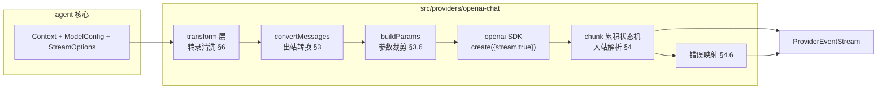
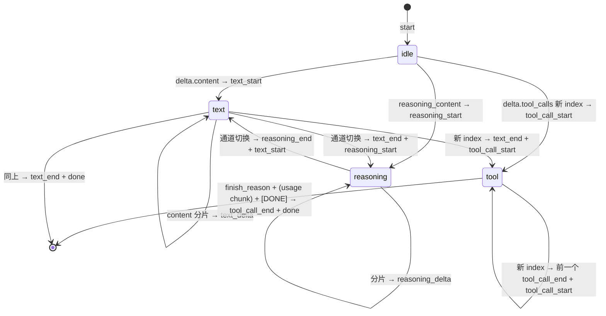

[← 返回地图](./README.md)

# 04 · Provider 接口契约与 Chat Completions Adapter 全细节

本文是 provider 层的完整规格:先回顾 agent 唯一认识的 provider 形态(`StreamFn`),然后逐节展开 `ChatCompletionsAdapter` 的出站转换、入站解析状态机、错误映射、`CompatFlags` 方言系统、transform 转录清洗层,最后给出「新增一个 provider 的步骤清单」与测试用 faux provider 规格。协议隔离(需求 1)的全部落点都在本文:**`openai` 包只允许出现在 `src/providers/openai-chat/` 内,ESLint 边界规则违者报错**。

## 1. StreamFn 契约回顾

类型定义与 [内部协议](./03-internal-protocol.md) 完全一致,原样引用:

```ts
// src/protocol/provider.ts
export interface ModelConfig {
  ref: ModelRef;
  baseURL?: string; apiKey?: string; headers?: Record<string, string>;
  compat?: CompatFlags;      // 方言开关,见 §5
  limits?: { context: number; output: number };
  defaults?: { temperature?: number; reasoningEffort?: string; maxOutputTokens?: number };
}
export interface StreamOptions { signal?: AbortSignal; temperature?: number; maxOutputTokens?: number; reasoningEffort?: string }
export type StreamFn = (model: ModelConfig, context: Context, options?: StreamOptions) => ProviderEventStream;
```

三条铁律(违反任意一条即 adapter 实现 bug):

1. **绝不 throw、绝不 reject。**一切错误——网络失败、4xx/5xx、abort、SSE 中断、setup 阶段异常——编码为流内 `error` 事件,附 stopReason 为 `error`/`aborted` 的 AssistantMessage。pi-mono 的 `StreamFunction` 契约注释把这条写死,收益是 agent loop 零 try/catch 处理 provider 差异;codex 的 Rust 实现同样把 provider 错误收敛为协议内事件而非异常传播。
2. **同步返回流。**`StreamFn` 不是 async 函数:先构造 `ProviderEventStream` 返回,内部再启动 async 工作(参考 pi 的 `lazyStream` 模式,setup 失败也 push `error` 事件而不是 reject)。
3. **事件序列合法。**`start` 首发;每个内容块严格三段式 `*_start → *_delta* → *_end`,`contentIndex` 对应 `partial.content` 下标;终止事件恰好一个(`done` 或 `error`);每个事件携带同一个逐步生长的 `partial` 快照;`stream.end(message)` 在终止事件后调用,使 `result()` resolve。

Adapter 的责任边界:**wire 协议(`ChatCompletionMessageParam`、`ChatCompletionChunk`)只存在于 adapter 内部**,进出都是内部协议类型。这是四层类型体系的最后一层(见 [架构](./02-architecture.md))。

## 2. ChatCompletionsAdapter 总体结构



模块形态遵循 pi 的经验:**无状态模块级函数,不是类层次**。对外只导出:

```ts
// src/providers/openai-chat/index.ts
export const streamOpenAIChat: StreamFn;           // 唯一入口
export function detectCompat(baseURL: string | undefined): Required<CompatFlags>;  // §5
```

SDK client 按 `(baseURL, apiKey)` 惰性构造并缓存;`maxRetries` 保留 SDK 默认(2 次,覆盖网络层瞬时错误),**整轮重发策略放在 session 层**——openai-node 的重试只到响应头返回为止,SSE 流中途断开 SDK 不会续传,这类恢复必须由持有完整转录的上层决定。

## 3. 出站转换:Context → ChatCompletionMessageParam[]

入口伪码:

```ts
function convertMessages(ctx: Context, model: ModelConfig, compat: Required<CompatFlags>): ChatCompletionMessageParam[] {
  const out: ChatCompletionMessageParam[] = [];
  if (ctx.systemPrompt) out.push({ role: compat.supportsDeveloperRole ? 'developer' : 'system', content: ctx.systemPrompt });
  for (const m of ctx.messages) {
    switch (m.role) {
      case 'user':        out.push(convertUser(m, compat)); break;
      case 'assistant':   pushAssistant(out, m);            break;  // 可能跳过(§3.2)
      case 'tool_result': pushToolResult(out, m, compat);   break;  // 可能追加补充 user 消息(§3.4)
    }
  }
  return out;
}
```

注意:此函数假定输入已经过 transform 层清洗(§6)——aborted 消息已滤除、孤儿 toolCall 已补结果。convertMessages 自身只做机械映射,不做修复;职责分开才可各自测试。

### 3.1 逐 role 映射规则

| 内部消息 | wire 形状 | 规则 |
|---|---|---|
| `systemPrompt` | `{role:'system'\|'developer', content: string}` | `compat.supportsDeveloperRole` 为 true 时用 developer(openai-node 类型注释:o1 及更新模型以 developer 取代 system;OpenAI 端会自动映射,但第三方兼容端点大多只认 system,默认 system) |
| `UserMessage` | `{role:'user', content: string \| ContentPart[]}` | 纯文本时输出**字符串**而非单元素数组;含 ImagePart 且 `compat.supportsImageParts` 时转 `{type:'image_url', image_url:{url:'data:<mime>;base64,<data>'}}` part 数组;不支持视觉的模型由 transform 层提前降级(§6),此处不再判断 |
| `AssistantMessage` | `{role:'assistant', content: string \| null, tool_calls?}` | 见 §3.2 |
| `ToolResultMessage` | `{role:'tool', tool_call_id, content: string}` | 见 §3.3、§3.4 |

`source` 字段(steering/follow_up/synthetic)不影响 wire 形状——steering 消息就是普通 user 消息,这正是 Chat Completions 无状态协议的红利:所有上下文由客户端持有,turn 之间插入消息零成本。

### 3.2 assistant 消息:纯字符串 content、白名单字段、空消息跳过

```ts
function pushAssistant(out, m: AssistantMessage): void {
  const text = m.content.filter(p => p.type === 'text').map(p => p.text).join('');
  const toolCalls = m.content.filter(p => p.type === 'tool_call');
  if (!text && toolCalls.length === 0) return;          // ★ 空 assistant 消息跳过
  out.push({
    role: 'assistant',
    content: text || null,                              // 有 tool_calls 时允许 null
    ...(toolCalls.length > 0 && {
      tool_calls: toolCalls.map(tc => ({
        id: tc.id, type: 'function' as const,
        function: { name: tc.name, arguments: tc.rawArguments ?? JSON.stringify(tc.arguments) },
      })),
    }),
  });
}
```

三个决策及理由:

1. **text 合并为纯字符串,不用 `[{type:'text'}]` 数组。**pi 的 convertMessages 注释明确:数组形式会诱发 DeepSeek 等模型模仿结构化输出。ReasoningPart 在这里被**丢弃**(同模型重放时 Chat Completions 无处安放 reasoning;跨模型时 transform 层已按需降级为文本,见 §6)。
2. **空 assistant 消息(aborted 后无任何内容)直接跳过。**很多 provider 拒绝 content 与 tool_calls 皆空的 assistant 消息(400)。
3. **只输出请求侧白名单字段。**openai-node 的 `AbstractChatCompletionRunner.toRequestMessage()` 在回放历史时剥掉 `parsed`、`annotations` 等响应侧字段;我们从内部协议渲染,天然不会带脏字段,但要注意 `arguments` 优先用 `rawArguments`(保留模型原始输出,避免 parse→stringify 往返改变键序或丢失截断现场)。

### 3.3 tool_calls / tool 配对纪律与常见 400

Chat Completions 的硬性规则(违反即 `BadRequestError` 400):

- 每个 `tool_calls[].id` 必须有**恰好一条** `role:'tool'` 消息响应,且 tool 消息必须**紧跟**在该 assistant 消息之后,顺序建议与 tool_calls 一致。缺失时的典型报错:`... The following tool_call_ids did not have response messages: call_xxx`;
- `role:'tool'` 不能没有前置的 assistant(tool_calls) 消息(API 报错原文带拼写错误 `preceeding`);
- `tool_call_id` 必须与 assistant 中的 id 逐字一致——第三方 provider 返回空 id 时必须在入站侧先兜底(§4.3),否则回传时配对断裂;
- tool 消息 `content` 只能是 string 或 text part 数组,**不能放 image part**。

adapter 不负责「制造」配对完整性——那是 transform 层(§6)与 agent loop(被打断的批次补合成结果,见 [steering 文档](./06-steering-following.md))的职责;adapter 在 debug 构建下可加一个廉价断言:渲染完成后扫描一遍配对,不合法时 log 完整 messages 现场再照发(留给服务端报 400,现场日志是修 bug 的关键)。

### 3.4 图片工具结果:抽出补 user 消息

工具结果(如 read 读图片)可含 ImagePart,但 tool 消息装不下。照抄 pi 的做法:

```ts
function pushToolResult(out, m: ToolResultMessage, compat): void {
  const text = renderTextParts(m.content) || (m.isError ? 'Error (no output)' : '(no output)');
  out.push({ role: 'tool', tool_call_id: m.toolCallId, content: text,
             ...(compat.requiresToolResultName && { name: m.toolName }) });
  // 图片在批内收集,「整批 tool 消息结束后」统一补一条 user 消息:
  //   { role:'user', content: [ {type:'text', text:'Attached image(s) from tool result:'}, ...images ] }
  // 不得逐条 toolResult 立即插入——多工具批次会被 user 消息从中间劈开,违反 §3.3 配对纪律(400)。
  // compat.requiresAssistantAfterToolResult:插入决策基于 wire 相邻关系而非转录相邻——
  // push 任何 user 消息(含图片合成消息)前,若 out 末尾是 role:'tool',先插合成
  // assistant 占位(内容 "Continuing.")。空/仅 reasoning 的 assistant 在 wire 上被跳过,
  // 「转录里的下一条」不等于「wire 上的下一条」,按转录判断会被绕过。
}
```

`details` 字段(结构化诊断,如 edit 的 diff)**永不出站**——它是 UI/持久化专用。

### 3.5 工具 schema 渲染与 strict

```ts
tools: ctx.tools?.map(t => ({
  type: 'function' as const,
  function: {
    name: t.name, description: t.description,
    parameters: t.parameters,                     // 已由工具框架经 z.toJSONSchema() 生成
    ...(compat.supportsStrictTools && { strict: true }),
  },
}))
```

`strict: true`(OpenAI Structured Outputs)保证 arguments 严格符合 schema,可免去大量参数校验,但要求 JSON Schema 子集:根为 object、所有对象 `additionalProperties:false`、**所有属性进 `required`**(可选语义用 `type:['string','null']`)。adapter 在附加 `strict:true` 前对 ToolSchema 做子集清洗:`additionalProperties:false`、全属性入 `required`、可选语义转 `type:[...,'null']`(非 OpenAI 端点支持度参差,受 `supportsStrictTools` 开关控制;protocol 层的 ToolSchema 保持原始 JSON Schema,见 [工具文档](./07-tools.md))。注意:**即便 strict,`finish_reason:'length'` 截断时 arguments 仍可能非法**,不能因 strict 而省掉 length 防线(§4.4)。

### 3.6 参数裁剪(buildParams)

per-model 参数裁剪而非无脑透传,否则 400——openai-node 类型注释明确 o 系列不支持 `temperature`/`top_p`/`presence_penalty`/`frequency_penalty`,`max_tokens` 已 deprecated 且与 o 系列不兼容:

```ts
function buildParams(model, ctx, options, compat): ChatCompletionCreateParamsStreaming {
  const maxTokens = options?.maxOutputTokens ?? model.defaults?.maxOutputTokens;
  const temperature = options?.temperature ?? model.defaults?.temperature;
  return {
    model: model.ref.model, messages: convertMessages(ctx, model, compat),
    stream: true,
    ...(compat.supportsUsageInStreaming && { stream_options: { include_usage: true } }),
    ...(maxTokens != null && { [compat.maxTokensField]: maxTokens }),   // 'max_completion_tokens' | 'max_tokens'
    ...(temperature != null && compat.supportsTemperature && { temperature }),
    ...(reasoningEffort != null && compat.supportsReasoningEffort && { reasoning_effort: reasoningEffort }),
    ...toolsAndChoice(ctx, compat),
  };
}
```

给推理模型设太小的 `max_completion_tokens` 会出现「token 全烧在 reasoning、content 为空、finish_reason:'length'」,这不是 adapter 能救的,session 层的 limits 配置负责给足预算。

## 4. 入站解析:chunk 累积状态机

### 4.1 消费骨架

```ts
export const streamOpenAIChat: StreamFn = (model, context, options) => {
  const stream = new ProviderEventStream();
  void (async () => {
    const state = newStreamState(model);          // partial AssistantMessage + 解析状态
    stream.push({ type: 'start', partial: state.partial });
    try {
      const raw = await client.chat.completions.create(buildParams(...), { signal: options?.signal });
      for await (const chunk of raw) handleChunk(chunk, state, stream);   // ★ 手写 for-await,见 §7
      finalize(state, stream);                    // 收尾:flush 未闭合块、映射 finish_reason、push done
    } catch (err) {
      pushErrorEvent(err, state, stream, options?.signal);               // §4.6
    }
  })();
  return stream;
};
```

### 4.2 状态与事件发射

```ts
interface StreamState {
  partial: AssistantMessage;        // 所有事件共享同一引用,content 数组逐步生长
  open: { kind: 'none' } | { kind: 'text' | 'reasoning'; contentIndex: number };
  toolSlots: Map<number, ToolSlot>; // key = delta.tool_calls[].index(★ 累积 key,不是数组位置)
  finishReason: string | null;      // 最后一个内容 chunk 携带;usage chunk 在其后
}
interface ToolSlot { contentIndex: number; id: string; name: string; rawArguments: string }
```



handleChunk 规则(照抄 openai-node `ChatCompletionStream.ts` 的 `#accumulateChatCompletion` 官方累积算法,这是与官方 helper 行为等价的保证):

- 只看 `choices[0]`(不发 `n>1`);**容忍空 `choices` 数组**——OpenAI 只有 usage chunk 如此,某些第三方 provider 常发;
- `delta.content` 非空 → 若 open 是 reasoning 先发 `reasoning_end` 切块;不在 text 块则 push TextPart 进 `partial.content` 并发 `text_start`;追加文本、发 `text_delta`;
- reasoning 扩展字段(§4.5)同理走 reasoning 三段式;
- `delta.tool_calls[]`:对每个条目,**按 `index` 定位槽位**(`index` 缺失回退 0——部分第三方从不给 index);新 index → 关闭当前 text/reasoning 块、为**上一个** tool slot 发 `tool_call_end`(openai-node helper 的 `arguments.done` 触发时机:新 index 出现或 finish_reason 到来),再建槽发 `tool_call_start`;`id`/`type`/`function.name` 仅首个分片携带,**name 覆盖不拼接**;`function.arguments` **字符串拼接**——它是任意切割的 JSON 分片;
- **每个 arguments delta 后用容错 JSON 解析刷新 `ToolCallPart.arguments`**(pi 的 `parseStreamingJson` 模式,partial-json 解析器):UI 可以实时看到半成品参数;`rawArguments` 始终保留原始串;`tool_call_end` 时做最终 `JSON.parse`,失败则保留容错解析结果并在 rawArguments 留现场(loop 层依据 stopReason 决定是否执行);
- `delta.refusal`(structured outputs 的拒绝路径,官方累积器单独拼接)→ 并入 text 通道,保证拒绝文本进转录(「转录永远完整」不变量);
- `delta.function_call`(deprecated 旧方言)→ 按官方累积器语义折算为单一 tool slot(伪 index),与 `finish_reason:'function_call'` 的映射保持一致——声称兼容就必须产出 ToolCallPart,不许空转录;
- `finish_reason` 非 null → 记录到 state,**不立即收尾**(include_usage 时其后还有一个 `choices:[]` 的 usage chunk);
- usage chunk → 按 §4.4 映射进 `partial.usage`。

### 4.3 id 缺失兜底

第三方 provider 常返回空/缺失的 tool call id。openai-node 在 `normalizeToolCallIds` 中自动补 `call_${uuid4()}`,我们照做:tool slot 建立时 `id ||= 'call_' + crypto.randomUUID()`。不兜底的后果:回传时 `tool_call_id` 配对断裂,下一轮请求 400(§3.3)。

### 4.4 finish_reason 映射表与 usage

| wire `finish_reason` | 内部 `StopReason` | 说明 |
|---|---|---|
| `stop` | `stop` | 自然结束或命中 stop sequence |
| `tool_calls` | `tool_calls` | loop 进入工具执行阶段 |
| `length` | `length` | **arguments 可能是非法/截断 JSON:照常产出 toolCall part,但 loop 层全批合成失败结果不执行**(pi 的教训:容错解析可能产出「能通过校验但被截断」的参数,一律不可执行) |
| `content_filter` | `content_filter` | 作为一等 StopReason 保留(pi 映成 error,我们不采纳——它是合法终态,转录应如实记录) |
| `function_call`(deprecated) | `tool_calls` | 兼容旧方言 |
| 流结束仍为 null | `error` | 「stream ended without finish_reason」,pi 同款处理 |
| 其它未知值 | `stop` | 保守当作干净收尾,console.warn 留现场(第三方方言的 'eos'/'max_tokens' 等) |

usage 映射(`CompletionUsage` → 内部 `Usage`,注意内部语义是 **inclusive**):

```
input     = prompt_tokens                                  // 已含 cached tokens,直接用(pi 做减法求 exclusive,我们的 Usage 语义相反,勿抄)
output    = completion_tokens                              // 已含 reasoning tokens
cacheRead = prompt_tokens_details?.cached_tokens
cacheWrite= prompt_tokens_details?.cache_write_tokens      // 非标扩展,可缺失
reasoning = completion_tokens_details?.reasoning_tokens
```

usage chunk **可能不来**(abort 中断、provider 不支持、`supportsUsageInStreaming` 关闭),`partial.usage` 初始化为全 0,缺失即保持 0——Usage 各字段设计上容忍缺失。个别 provider 在每个 chunk 都带非 null usage:直接覆盖(最后一次为准),不累加。

### 4.5 reasoning_content 第三方扩展

Chat Completions 标准协议**不返回 reasoning 内容**(那是 Responses API 的能力),但 DeepSeek、OpenRouter、vLLM 等在 delta 上扩展了非标字段。SDK 类型不含它、官方累积器按未知字段丢弃,所以必须自行从原始 chunk 读:

```ts
const d = chunk.choices[0]?.delta as Record<string, unknown> | undefined;
const reasoningDelta = compat.reasoningFormat !== 'none'
  ? (d?.reasoning_content ?? d?.reasoning ?? d?.reasoning_text) as string | undefined
  : undefined;
```

命中即走 `reasoning_start/delta/end` 三段式,落成 `ReasoningPart`。`compat.reasoningFormat` 同时决定出站侧的 reasoning 参数方言(§5)。

### 4.6 错误映射与 abort

catch 分支统一处理(SSE 层的 in-band 错误——`data:` 行 JSON 带 `error` 字段——SDK 已转为 throw `APIError`,与 HTTP 错误同路径):

```ts
function pushErrorEvent(err, state, stream, signal): void {
  const aborted = err instanceof APIUserAbortError || signal?.aborted === true;
  const msg = state.partial;                       // 保留已累积的 content(转录如实记录半成品)
  closeOpenBlocks(state, stream);                  // 未闭合块补 *_end 事件
  msg.stopReason = aborted ? 'aborted' : 'error';
  msg.errorMessage = aborted ? undefined
    : err instanceof APIError
      ? `${err.constructor.name} status=${err.status ?? 'n/a'} requestID=${err.requestID ?? 'n/a'}: ${err.message}`
      : String(err);
  stream.push({ type: 'error', message: msg });
  stream.end(msg);
}
```

| openai-node 错误类 | stopReason | 备注 |
|---|---|---|
| `APIUserAbortError`(或 catch 时 signal 已 aborted) | `aborted` | steering 硬打断 / Esc 的正常路径 |
| `RateLimitError` / `InternalServerError` / `APIConnectionTimeoutError` / `APIConnectionError` | `error` | errorMessage 保留类名,session 层据此判定可重试(见 [会话文档](./08-session-persistence.md)) |
| `BadRequestError`(400) | `error` | 大概率是我们的协议 bug,log 完整出站 messages 现场 |
| 其余 `APIError`(401/403/404/422…) | `error` | 不可重试,带 status/requestID |

abort 的传导链有**两条路径**(openai v6 实测):请求建立阶段(响应头返回前)abort → SDK throw `APIUserAbortError` → catch 分支映射;**SSE 流中途** abort → SDK 的流迭代器捕获 AbortError 后 **clean return,不 throw**(core/streaming.js 显式吞掉)→ for-await 正常结束——adapter 必须在收尾前检查 `signal.aborted && finishReason == null`,命中即按 aborted 收尾,否则用户打断会被误编码为「残缺流」类可重试 network 错误,M7 session 层会自动重发用户明确取消的请求。被中断的 AssistantMessage(stopReason `'aborted'`)**保留已流出的部分内容进转录**,重放时由 transform 层过滤(§6)——这保证「转录永远完整」与「出站永远合法」两个不变量同时成立。

## 5. CompatFlags:方言开关与 baseURL 自动推断

pi 的 `OpenAICompletionsCompat` 证明了正确形态:**把方言差异声明化为数据,而不是代码分支散落各处**。完整字段清单(右侧为 OpenAI 官方端点的默认值):

```ts
// src/providers/openai-chat/compat.ts
export interface CompatFlags {
  maxTokensField?: 'max_completion_tokens' | 'max_tokens';  // 'max_completion_tokens'(max_tokens 已 deprecated 且与 o 系列不兼容)
  supportsDeveloperRole?: boolean;          // true:systemPrompt 渲染为 developer(第三方大多只认 system)
  supportsUsageInStreaming?: boolean;       // true:发 stream_options:{include_usage:true};关闭则不发该参数(有的端点见到即 400)
  supportsStrictTools?: boolean;            // true:工具 schema 附 strict:true
  supportsParallelToolCalls?: boolean;      // true:允许透传 parallel_tool_calls 参数
  supportsImageParts?: boolean;             // user content 可带 image_url part(视觉能力)
  supportsTemperature?: boolean;            // o 系列为 false(400 防线)
  supportsStop?: boolean;                   // o3/o4-mini 不支持 stop
  supportsReasoningEffort?: boolean;        // 是否透传 reasoning_effort
  reasoningFormat?: 'none' | 'openai' | 'reasoning_content';
    // 入站:读哪个扩展字段('reasoning_content' 覆盖 DeepSeek/OpenRouter/vLLM 系);出站:reasoning 参数方言
  requiresToolResultName?: boolean;         // tool 消息须附 name 字段(个别方言)
  requiresAssistantAfterToolResult?: boolean; // tool 结果后必须跟 assistant 消息(插合成占位)
}
```

推断策略:`detectCompat(baseURL)` 按 host 关键字给出完整 profile,`model.compat` 显式字段浅覆盖:

```ts
function resolveCompat(model: ModelConfig): Required<CompatFlags> {
  return { ...detectCompat(model.baseURL), ...model.compat };
}
// detectCompat 规则表(数据驱动,新方言加一行):
// api.openai.com / 未设置   → 全开:strict、usage、developer、max_completion_tokens、reasoningFormat:'openai'
// api.deepseek.com          → maxTokensField:'max_tokens'、reasoningFormat:'reasoning_content'、strict:false、developer:false
// openrouter.ai             → reasoningFormat:'reasoning_content'、usage:true、strict:false
// localhost / 未识别 host    → 保守 profile:一切可选参数关闭、max_tokens、reasoningFormat:'reasoning_content'
```

保守 profile 的原则:**未知端点宁可少发参数**——未知参数有的端点忽略、有的 400(openai-node 调研 §8 的行为差异清单)。此外第三方端点的已知怪癖 adapter 无条件容错,不设开关:tool call id 缺失(§4.3)、空 choices chunk、`index` 缺失回退 0、`[DONE]` 缺失靠连接关闭结束、SSE keep-alive 注释行(SDK decoder 已忽略)、错误体非标准结构(只依赖 status)。

## 6. transform 层:出站前转录清洗

位置在 `src/agent/`(纯内部协议操作,与 wire 无关,所有 provider 共用),每次发起 provider 请求前由 agent loop 调用。pi 的 `transform-messages.ts` 是直接蓝本——这一层让 abort、steering、换模型都不会产生非法请求,是健壮性核心:

```ts
// src/agent/transform.ts
export function convertContext(ctx: Context, target: ModelRef): Context {
  // 1. aborted/error 的 assistant 消息整条跳过不重放(不完整 turn 重放触发 API 报错;
  //    其 content 已在转录/UI 留档,重放无信息增量)
  // 2. 孤儿 toolCall 补合成结果:assistant 有 tool_call part 但后续无对应 toolResult 时,
  //    插入 { role:'tool_result', toolCallId, isError:true, content:[{type:'text',
  //    text:'[Tool execution was interrupted]'}] } —— abort 腰斩工具批次后,下一轮请求依然满足 §3.3 配对纪律
  // 3. 跨模型(!isSameModel(m.model, target)):ReasoningPart 降级为 TextPart 或剥离
  //    signature(其它模型无法验证签名);toolCallId 归一化(如 Responses 系超长 id 压到 40 字符)
  // 4. 非视觉模型:ImagePart 降级为占位文本 '[image omitted: <mimeType>]'
  return cleaned;
}
// 实现纪律(核查追加):
// a. 配对匹配必须按「assistant 块」归属——每条 tool_result 只归属其前方最近一条声明了
//    该 id 的 assistant。provider 跨 turn 复用 id(vLLM/llama.cpp 的 call_0 之类确定性 id)
//    时,全局 id 集合会把后 turn 的真实结果错配给前 turn 的孤儿/被滤块;
// b. 补合成结果按该 assistant 的 tool_calls 声明序输出(与 §3.3 的顺序断言一致);
// c. 不属于任何 kept assistant 的 dangling tool_result 一并丢弃(转录事实层不会自产,
//    但 transformContext 钩子可能产出;convertContext 是出站合法性的最后一道);
// d. 步骤 4 只在显式 supportsImageParts:false 时触发(agent 层读不到 baseURL 自动推断的
//    resolved profile);自动推断为非视觉的端点由 adapter 兜底——tool 消息里的图片
//    以 '[image omitted: <mime>]' 并入文本,user 消息同样占位,均不无声丢弃。
export const isSameModel = (a: ModelRef, b: ModelRef) =>
  a.provider === b.provider && a.api === b.api && a.model === b.model;
```

顺序敏感:先滤 aborted(规则 1)再补孤儿(规则 2)——被滤掉的 aborted assistant 若含 toolCall,其 toolResult 也要一并滤除,否则产生「无前置 assistant 的 tool 消息」这一反向 400。`isSameModel` 依赖 AssistantMessage 自带的 `ModelRef` 三元组,这正是消息模型(见 [内部协议](./03-internal-protocol.md))把模型出处编码进每条消息的原因。

与 adapter 的分工:transform 管**语义修复**(协议层不变量),convertMessages 管**机械翻译**(wire 格式)。opencode V1 曾把二者混在渲染层,V2 重构时才拆开——从一开始就分层可避免这次返工。

## 7. 为什么手写 for-await,不用 SDK 的 `.stream()` helper

`client.chat.completions.stream()` 返回的 `ChatCompletionStream` 提供事件订阅、snapshot 维护与 finalize,看似省事,但三条理由决定不用:

1. **事件粒度不匹配。**helper 的事件模型(`content.delta`、`tool_calls.function.arguments.delta`…)是为终端用户设计的,没有 contentIndex 定位、没有我们的三段式块结构、没有逐事件 partial 快照;要凑出 `ProviderEvent` 仍需自建一层状态机,等于状态机写两遍。
2. **错误策略冲突。**helper 在 auto-parse 模式(strict tools / zodFunction)下对 `finish_reason === 'length' | 'content_filter'` 直接 throw(`LengthFinishReasonError` / `ContentFilterFinishReasonError`);而我们的协议里这两者是合法 StopReason——length 要走「产出 toolCall 但全批不执行」路径,content_filter 要如实进转录。被 helper 抢先抛掉就失去了决定权。
3. **第三方脏数据容忍度。**helper 的累积器丢弃未知字段(`reasoning_content` 读不到)、finalize 校验(缺 finish_reason、缺 type/name)直接抛 `OpenAIError`;对非 OpenAI 端点的残缺流,我们需要的是降级容错而非 fail-fast。手写消费依赖面最小,方言适配全部收在自己的状态机里。

helper 中**值得照抄**的部分(抄算法不抄依赖):`#accumulateChatCompletion` 的按 index 归并 + arguments 拼接算法(§4.2)、`normalizeToolCallIds` 的 id 兜底(§4.3)、`arguments.done` 的触发时机(新 index 或 finish_reason 到来时给上一个 call 收尾)。

## 8. 新增一个 provider 的步骤清单(以 Anthropic Messages 为假想例,M7 验证项)

**需要做的:**

1. 新建 `src/providers/anthropic-messages/`,在 ESLint 边界规则中登记:`@anthropic-ai/sdk` 只允许出现在该目录;
2. 实现 `streamAnthropicMessages: StreamFn`:
   - 出站:`systemPrompt` → 顶层 `system` 参数(不是消息);toolResult → user 消息内的 `tool_result` content block(Messages API 允许其中携带图片,§3.4 的抽出补丁**不需要**);assistant 的 ReasoningPart → `thinking` block(带 signature 原样回传);工具 schema 字段名改 `input_schema`;
   - 入站:Messages API 的 `content_block_start/delta/stop` 事件天然对应我们的三段式,状态机比 Chat Completions 简单(不需要按 index 归并 arguments——`input_json_delta` 自带块定位);
   - stop_reason 映射:`end_turn→'stop'`、`max_tokens→'length'`、`tool_use→'tool_calls'`、`refusal→'content_filter'`;
   - 错误映射:Anthropic SDK 错误家族 → 同 §4.6 的 stopReason 编码,铁律不变;
3. 如有方言(第三方 Anthropic 兼容端点),建该 adapter 自己的 compat 结构——CompatFlags 是 openai-chat 的私有类型,不跨 adapter 复用;
4. 测试:录制 Messages SSE fixture 回放(见 [测试文档](./10-testing.md)),用与 openai-chat 相同的契约测试套件(事件序列合法性、永不 throw、abort 编码)跑一遍。

**不需要动的:**`src/protocol/`、`src/agent/`(含 transform 层——它操作内部协议,规则 3 的跨模型降级自动生效)、`src/tools/`、`src/session/` 全部零改动;`src/cli/` 只在模型目录/配置里注册新的 `ModelRef` 与 StreamFn 分发项。**如果发现新增 provider 需要改 protocol 或 agent,说明内部协议抽象漏了,先修协议再写 adapter**——这是需求 1 的验收方式,也是 pi「agent-core 只认 StreamFn」结构被反复验证的地方。

## 9. faux provider 规格(脚本化回放,测试专用)

`src/providers/faux/` 是第三个「provider」:纯内存、零网络,让 agent loop、steering、abort 的全部测试离线运行(pi 的 `providers/faux.ts` 同思路)。接口与行为的完整规格以 [测试文档 §3](./10-testing.md) 为准:`createFauxStreamFn(script)` 返回 `StreamFn & { calls }`;脚本形如 `FauxScript{ turns, onExhausted }`,每个 `FauxTurn` 由 `events`(text/reasoning/tool_call/gate)、`stopReason`、`error`、`usage`、`onRequest` 组成;`Gate` 原语让流悬停在指定位置,由测试显式放行。本文只记结论性要点:

- 每次被调用消费下一个 turn,按内部协议发出**完全合法**的事件序列(start → 三段式块 → done/error),每事件带生长中的 partial;stopReason 缺省推导:含 tool_call → `'tool_calls'`,否则 `'stop'`;脚本耗尽行为由 `onExhausted` 决定(测试默认让多余的 loop 迭代直接 fail);
- **尊重 `options.signal`**:每个事件发射间隙与 gate 等待中检查 signal,aborted 则按 §4.6 语义收尾(stopReason `'aborted'`、保留已发内容)——用 gate 把流挂起再 abort,是 abort/steering 时序测试的受控注入点;
- `calls` 数组是关键断言面:steering 测试验证第二次调用的 context 里出现 `source:'steering'` 的 user 消息;transform 测试验证 aborted 消息未被重放、孤儿 toolCall 已补结果;
- faux 走与真实 adapter 完全相同的 `StreamFn` 契约与契约测试套件——它既是测试工具,也是「内部协议自身可实现性」的常驻证明。

adapter 本体的测试不用 faux,用**录制的 SSE chunk fixture 回放**(mock fetch 层,喂真实录制的字节流):必备 fixture 见 [测试文档](./10-testing.md)——tool_calls 多片分割、并行双工具同 chunk 双 index、usage chunk、`length` 截断非法 JSON、in-band `data.error`、id 缺失方言、`reasoning_content` 方言、空 choices chunk。

## 10. 验收清单

- [ ] ESLint 边界规则生效:在 `src/agent/` 里 `import 'openai'` 触发 lint 错误;
- [ ] `streamOpenAIChat` 在断网、无效 apiKey、404 baseURL、请求中 abort 四种场景下均不 throw/reject,流以正确 stopReason 的 `error` 事件收尾;
- [ ] 出站快照测试:含 system/user(图)/assistant(text+2 toolCall)/2 toolResult(其一带图)的 Context 渲染结果与快照一致;空 assistant 被跳过;tool 配对紧邻且序一致;
- [ ] strict 清洗的快照测试:原始 ToolSchema → 清洗后 schema 与快照一致;
- [ ] 入站 fixture 回放:§9 列出的全部 fixture 产出合法事件序列(自动校验器:三段式配对、contentIndex 连续、终止事件唯一);
- [ ] `length` fixture:toolCall 照常产出、`rawArguments` 保留截断现场、stopReason 为 `'length'`;
- [ ] id 缺失 fixture:产出 `call_` 前缀 UUID,且出站回传时配对成立;
- [ ] usage:OpenAI fixture 映射出 input/output/cacheRead/reasoning;无 usage chunk 的 fixture 保持全 0 不报错;
- [ ] `detectCompat` 规则表单测:四类 baseURL 各返回预期 profile,`model.compat` 覆盖生效;
- [ ] transform 层单测:aborted 消息(含其 toolResult)滤除、孤儿补结果、跨模型 reasoning 降级、非视觉图片降占位;
- [ ] faux provider 通过与 openai-chat 相同的 StreamFn 契约测试套件;
- [ ] 真实 OpenAI 端点冒烟(手动/CI 可选):一次带工具调用的完整 turn 往返无 400。

## 相关文档

- [03 · 内部协议](./03-internal-protocol.md) —— 本文所有出入类型(ProviderEvent、EventStream、消息模型)的定义
- [05 · Agent 核心](./05-agent-loop.md) —— StreamFn 的消费方:length 全批失败、abort 传导、turn 生命周期
- [06 · steering / follow-up](./06-steering-following.md) —— transform 层与 abort/steering 交互的完整语义
- [10 · 测试策略](./10-testing.md) —— SSE fixture 录制/回放机制与 StreamFn 契约测试套件
