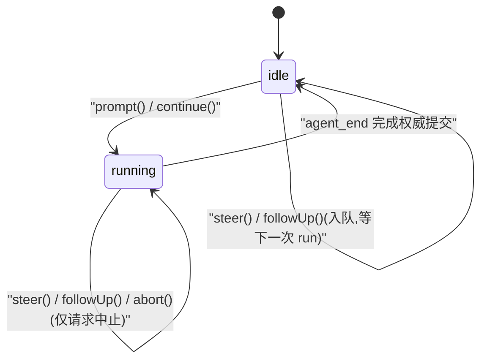
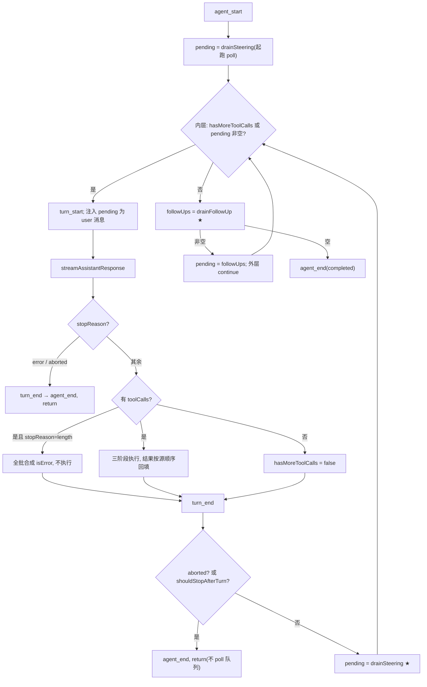

[← 返回地图](./README.md)

# 05 · Agent 核心:双层循环、turn 生命周期、工具执行与中断语义

本文是 `src/agent/` 的实施规格:Agent 类对外 API 与状态机、runLoop 双层循环的完整语义、streamAssistantResponse 的流水线、工具执行三阶段、parallel/sequential 调度、abort 语义、事件发射规则、错误分类。队列(steering/follow-up)的精确注入语义与转录修复细节见 [06](./06-steering-following.md),工具本体规格见 [07](./07-tools.md),provider 契约见 [04](./04-provider-adapter.md)。

阶段 0 起，Agent 的架构身份被收窄为**单个 ThreadRuntime 内的 run/turn 执行引擎**。每个 thread
至多一个 active run；不同 ThreadRuntime 各有自己的 Agent、转录、mailbox 与 cancellation root，
可以并发运行。Supervisor 管理 thread 生命周期与父子拓扑，Agent 不持有全局 thread map；子 Agent
是独立 child thread，不是 `ToolDefinition`，也不共享父 Agent 的可变状态。canonical 边界见
[12 · Supervisor Runtime](./12-supervisor-runtime.md)。

阶段 0 的 Agent 核心依赖 `protocol/shared`，并通过唯一的迁移期类型边
`tools/types.ts` 接收 `ToolDefinition[]`；provider 以 `StreamFn` 注入，既有
`subscribe(listener)` 行为保持不变。自阶段 2 起，runtime-managed Agent 通过独立、awaited 的 internal
`authoritativeEventSink` 直连唯一 EventCommitter，绝不把 committer 注册成会吞错的 public subscriber；
普通 UI 由 EventHub 异步订阅。阶段 3 的 ThreadRuntime 改用只消费不可变 catalog/adapter snapshot 的
runtime engine；exported legacy Agent 仍保留 `AgentConfig.tools/StreamFn` surface，由精确的兼容 facade
文件持有唯一 `tools/types.ts` type-import。这层的全部复杂度都围绕一个目标:**转录(`AgentMessage[]`)在任何时刻——
包括 abort、length 截断、工具失败、provider 出错——都保持完整且可重放**。

## 1. Agent 类对外 API

本项目设计约定的对外 API 如下(canonical,不得偏离):

```ts
class Agent {
  constructor(config: AgentConfig)
  setModel(model: ModelConfig): void               // 仅 idle；只改变下一次采样
  prompt(text: string, opts?): Promise<void>     // 仅空闲时;运行中调用 throw(强制走 steer/followUp)
  steer(msg: UserMessage | string): void         // 随时可调,入 steering 队列
  followUp(msg: UserMessage | string): void      // 随时可调,入 follow-up 队列
  abort(): void                                  // 硬中断
  continue(): Promise<void>                      // abort/重试后续跑:优先 drain steering,否则 follow-up
  waitForIdle(): Promise<void>
  subscribe(listener: (e: AgentEvent) => void | Promise<void>): () => void
  steeringMode / followUpMode: 'all' | 'one-at-a-time'   // 默认 one-at-a-time
  clearQueues(): void
  readonly state: 'idle' | 'running'
}
interface AgentConfig {
  streamFn: StreamFn; model: ModelConfig; tools: ToolDefinition[];
  systemPrompt: string | (() => string);
  transformContext?: (ctx: Context) => Promise<Context>;        // 压缩/裁剪钩子
  beforeToolCall?: (call: ToolCallPart) => Promise<{ block: true; reason: string } | { block?: false }>;
  afterToolCall?:  (call: ToolCallPart, result: ToolResultMessage) => Promise<ToolResultMessage>;
  shouldStopAfterTurn?: (ctx: Context) => Promise<boolean>;
  toolExecution?: 'sequential' | 'parallel';                     // 默认 parallel(工具可声明强制 sequential)
}
```

这是保留的 library/legacy API，不是多线程 RuntimePort。ThreadRuntime 在调用它之前建立
`WorkspaceId/ThreadId/RunId`，在每次 assistant 采样前建立 `TurnId`；AgentEvent 保持无身份的内层
payload，由 EventCommitter 统一包装成 EventEnvelope。每次 `prompt()` / `continue()`（包括 retry
与 compaction 后续跑）都得到新的 RunId；后续 run 只用 `predecessorRunId` 关联，不能复用旧 id。

补充字段(本文档新增,不改上述 API 语义):`AgentConfig.cwd?: string`(工具执行工作目录,由 Bun CLI 启动层解析并显式注入,填充 `ToolContext.cwd`)。Agent 实例另持有一个会话级 `FileTracker`(read-before-edit 约束的登记表,见 [07](./07-tools.md)),随 `ToolContext` 传给每次工具执行。

### 1.1 状态机



只有两个状态,没有 `aborting`/`paused` 之类的中间态——这是有意的。abort 是"请求",不是"瞬时完成的动作":调用 `abort()` 后 state 仍是 `running`,直到 provider 流/工具执行观察到 signal、loop 走完收尾路径、`agent_end` 完成权威提交,才回到 `idle`。想等中止真正完成,用 `waitForIdle()`。直接使用 legacy `Agent` 时始终等待其全部 subscribe listener，行为冻结；自阶段 2 起，ThreadRuntime 内部 Agent 使用独立 awaited `authoritativeEventSink`，普通 observer 改订阅 EventHub，因而 runtime run 只等待权威提交。gemini-cli 的 CoreToolScheduler 用七态 discriminated union 描述**单个工具调用**的状态,那是 item 级粒度;Agent 级只需要 idle/running 二值,多余状态只会制造"状态机之间互相追认"的同步问题。

### 1.2 逐方法语义与合法调用时机

| 方法 | `idle` 时 | `running` 时 |
|---|---|---|
| `setModel(model)` | 更新下一次采样使用的完整 `ModelConfig`，不改 transcript | **throw** |
| `prompt(text)` | 构造 `UserMessage{source:'prompt'}`,发 `agent_start{reason:'prompt'}` 后以 `seed.initialPending` 交给 runLoop——消息在首 turn 经注入路径([B])落转录,走完整 `message_start/end` 生命周期(TranscriptRepository 与 UI 因此不需要为 prompt 消息开特例);返回的 Promise 在 `agent_end` 后 resolve | **throw**(`"Agent is running; use steer() or followUp()"`) |
| `steer(msg)` | 入 steering 队列(下次 run 的起跑 poll 会吃到,见 2.1 注释 A) | 入 steering 队列,turn 边界注入 |
| `followUp(msg)` | 入 follow-up 队列 | 入 follow-up 队列,agent 将停时消费 |
| `abort()` | no-op | `taskAbort.abort()`,请求中止;队列**不清空** |
| `continue()` | 见下文;返回 Promise 同 prompt | **throw** |
| `waitForIdle()` | 立即 resolve | 当前 run 的 `agent_end` 权威提交后 resolve；直接构造的 legacy `Agent` 还等待其 Emitter listener，Session/Runtime 的普通 observer 已异步隔离 |
| `subscribe` / `clearQueues` / `steeringMode=` | 任意时刻合法 | 任意时刻合法 |

**为什么 `prompt()` 在运行中 throw 而不是自动排队**:pi 的原话是"入口强制二选一,没有第三种模糊状态"。"运行中的新输入"存在两种截然不同的意图——引导当前任务(steer)与追加下一个任务(followUp),API 层面替调用者猜意图必然猜错一半。codex 走了另一条路:同一个 `Op::UserInput` 由 core 按当前状态自动分派(有 active turn 即 steering)——那是**跨进程外协议**的正确选择,因为客户端无法可靠感知 core 状态;而我们的 Agent 是进程内对象,`state` 就在手边,让调用方(CLI 键位层:Enter=steer,Alt+Enter=followUp)显式选择,错误立即暴露。

**`continue()` 的精确语义**(pi `Agent.continue()` 的移植):仅 `idle` 可调,依次尝试三种启动方式:

1. steering 队列非空 → 按 `steeringMode` drain 出初始 `pendingMessages`,`agent_start{reason:'follow_up'}` 启动(并跳过 runLoop 的起跑 poll,防止双重 drain);
2. 否则 follow-up 队列非空 → 同上,drain follow-up;
3. 否则,若转录末尾存在残局——末条 assistant 消息的 stopReason 是 `aborted`/`error`,**或**转录末尾存在未配对的 toolCall / 末条消息不是完结态(崩溃恢复场景:工具执行中被杀的会话,末条是 `stopReason:'tool_calls'` 的 assistant 或 tool_result,见 [08](./08-session-persistence.md) §4.3)→ 以空 `pendingMessages` 启动,`agent_start{reason:'continue'}`——即**重采样**:残缺的 assistant 会被 transform 层过滤、孤儿 toolCall 会被补上合成结果(见第 3 节 convertContext 与 [06](./06-steering-following.md)),模型看到的是干净转录,等价于"重试上一轮"。RetryCoordinator 与崩溃恢复都建立在这条路径上，且每次续跑创建新的 RunId;
4. 三者皆无 → throw(`"Nothing to continue"`)。

`agent_start.reason` 的分配规则由此确定:`prompt()` → `'prompt'`;`continue()` 消费了排队消息 → `'follow_up'`;`continue()` 纯重采样 → `'continue'`。

## 2. runLoop:双层循环

### 2.1 turn 的精确定义

**一个 turn = (0..n 条注入的排队 user 消息)+ 恰好一次 assistant 采样 + 该 assistant 的全部工具执行**(length 截断时的"全批合成失败"也算工具执行阶段)。`turn_start`/`turn_end` 括住整个区间,`turn_end` 携带 `{message, toolResults}`。stopReason 为 `error`/`aborted` 的采样同样构成一个(短)turn——错误也是转录的一部分。

术语对齐:我们的 run(`agent_start`..`agent_end`)≈ codex 的 task(一次用户请求驱动的完整运行);我们的 turn ≈ codex task 内的一次采样迭代;gemini-cli 的 `Turn.run()` 恰好等于我们的一次 streamAssistantResponse(它只管一次模型请求,工具执行在外层)。

### 2.2 完整伪码(runLoop 骨架展开)

```ts
// src/agent/loop.ts —— 独立于 Agent 类的纯函数,faux provider 下全离线可测(见 10 文档)
async function runLoop(
  cfg: AgentConfig,
  transcript: AgentMessage[],                    // 权威转录,就地追加
  queues: { steering: Queue; followUp: Queue },
  taskSignal: AbortSignal,
  emit: (e: AgentEvent) => Promise<void>,
  seed: { initialPending: UserMessage[]; skipInitialPoll: boolean },
): Promise<void> {
  const newMessages: AgentMessage[] = [];        // 本 run 新增消息,agent_end 携带

  // [A] 起跑前 poll 一次 steering:用户在上一个回答期间就可能已输入(pi 的注释原话)。
  //     seed.initialPending(prompt 的 user 消息 / continue() 预 drain 的队列消息)排在最前;
  //     continue() 已自行 drain 时跳过 poll,防止双重消费。
  let pendingMessages = seed.skipInitialPoll
    ? [...seed.initialPending]
    : [...seed.initialPending, ...queues.steering.drain()];

  outer: while (true) {                          // ── 外层:follow-up 续命 ──
    let hasMoreToolCalls = true;                 // 初始 true:即使无 pending 也要采样一次
    while (hasMoreToolCalls || pendingMessages.length > 0) {   // ── 内层:工具循环 + steering ──
      await emit({ type: 'turn_start' });

      // [B] 注入排队消息:逐条走 message_start/end 生命周期,追加进转录。
      //     注入形态 = 排在上一批 toolResults 之后的 user 消息(source:'steering'|'follow_up')。
      for (const m of pendingMessages) {
        await emit({ type: 'message_start', message: m });
        transcript.push(m); newMessages.push(m);
        await emit({ type: 'message_end', message: m });
      }
      pendingMessages = [];

      // [C] 采样:transformContext → convertContext → StreamFn → 消费事件流(见第 3 节)
      const assistant = await streamAssistantResponse(cfg, transcript, taskSignal, emit);
      transcript.push(assistant); newMessages.push(assistant);

      // [D] error/aborted → 直接收尾(理由见 2.3)
      if (assistant.stopReason === 'error' || assistant.stopReason === 'aborted') {
        await emit({ type: 'turn_end', message: assistant, toolResults: [] });
        await emit({ type: 'agent_end',
                     reason: assistant.stopReason === 'aborted' ? 'aborted' : 'error',
                     messages: newMessages });
        return;
      }

      // [E] 工具执行
      const toolCalls = assistant.content.filter((p): p is ToolCallPart => p.type === 'tool_call');
      let toolResults: ToolResultMessage[] = [];
      if (toolCalls.length > 0) {
        let terminate = false;
        if (assistant.stopReason === 'length') {
          // [E1] length 截断 ⇒ 参数可能不完整,全批合成 isError 结果,不执行(理由见 2.4)
          toolResults = failTruncatedToolCalls(toolCalls);
        } else {
          // [E2] 三阶段执行,sequential/parallel 由 cfg 与工具声明共同决定(见第 5 节)
          ({ toolResults, terminate } = await executeToolCalls(cfg, toolCalls, taskSignal, emit));
        }
        // [F] 回填:严格按 assistant 内 toolCall 的源顺序,每条走 message_start/end
        for (const r of toolResults) {
          await emit({ type: 'message_start', message: r });
          transcript.push(r); newMessages.push(r);
          await emit({ type: 'message_end', message: r });
        }
        // terminate:批内全部结果都 terminate 才停(见 4.3);length 合成批永远不 terminate
        hasMoreToolCalls = !terminate;
      } else {
        hasMoreToolCalls = false;                // 纯文本回复:内层是否继续取决于 steering
      }

      await emit({ type: 'turn_end', message: assistant, toolResults });

      // [G] abort 检查:工具批次执行中被 abort(流采样中的 abort 已在 [D] 收尾)。
      //     pi 不做此检查,靠下一次 StreamFn 立即返回 aborted 消息收尾——行为等价,
      //     但转录会多一条空的 aborted assistant(虽会被 transform 过滤)。我们选显式检查,转录更干净。
      if (taskSignal.aborted) {
        await emit({ type: 'agent_end', reason: 'aborted', messages: newMessages });
        return;
      }

      // [H] 优雅停:shouldStopAfterTurn 优先级高于两个队列——返回 true 直接结束,不 poll。
      //     队列残留保留,由 ThreadRuntime 检查后决定是否 continue()(见 06 的 steering 语义第 7 条)。
      if (await cfg.shouldStopAfterTurn?.(currentContext())) {
        await emit({ type: 'agent_end', reason: 'completed', messages: newMessages });
        return;
      }

      // [I] ★ steering 注入点:每个 turn 结束后。队列非空即"续命"——
      //     即使 assistant 没发工具调用(hasMoreToolCalls=false),内层循环也继续。
      pendingMessages = queues.steering.drain();
    }

    // [J] ★ follow-up 注入点:agent 本来要停止时(无 toolCall、无 steering)才 poll。
    const followUps = queues.followUp.drain();
    if (followUps.length > 0) { pendingMessages = followUps.map(toUserMessage); continue outer; }
    break;
  }
  await emit({ type: 'agent_end', reason: 'completed', messages: newMessages });
}
```

Agent 类是这个纯函数的薄封装:管理 state 翻转(`running` → finally 中回 `idle` 并 resolve waitForIdle)、持有两个 `PendingMessageQueue` 与 `taskAbort`、把 `subscribe` 的 listener 接到 `emit`。pi 同样把 Agent(agent.ts)与 loop(agent-loop.ts)分成两个文件,loop 以 config 钩子(`getSteeringMessages` 等)与队列解耦——这个切分让 loop 的每一个分支都能用脚本化 faux provider 单测,不需要构造真实 Agent。



### 2.3 为什么 error/aborted 直接结束,不在 loop 内重试

1. **abort 是用户意图**,唯一正确的响应是尽快停下并保留现场(队列不清、转录完整),把"接下来做什么"还给 ThreadRuntime/调用方。
2. **error 的重试是策略问题,不是机制问题**:退避曲线、重试上限、是否先 compaction、如何向用户呈现——属于 RetryCoordinator/CompactionCoordinator。loop 若内置重试,这些策略要么写死要么以配置形式泄漏进核心。pi 把 auto-retry 放在 AgentSession(`agent_end` 带 `willRetry` 语义),其 3300 行 AgentSession 的教训恰恰是"queue/loop 核心"与"retry/compaction/persistence 会话服务"必须尽早分层——阶段 2 已把二者拆成独立协作者，loop 保持哑。
3. **结束是无损的**:错误已编码为带 `errorMessage` 的合法 AssistantMessage 留在转录里(可持久化、可诊断),transform 层重放时会过滤它,所以 `continue()` 的重采样在语义上与"loop 内重试"完全等价,只是控制权交还了一层。
4. 备选方案:codex 在 turn 内做流断线重试并发 `StreamError` 事件通知 UI("不终止 turn")。这个体验更平滑,但需要 loop 感知"可重试性"。v1 走"结束 + session continue()"的简单路线,M7 若引入 in-loop 流重试,`AgentEvent.error{fatal:false}` 可承担 StreamError 的通知角色。

### 2.4 为什么 stopReason 为 length 时全批工具失败、不执行

`length` 意味着模型输出在生成中途被 maxOutputTokens 掐断,最后一个 toolCall 的 arguments JSON 大概率不完整。危险在于:adapter 的流式容错解析(每个 delta 用 partial-JSON 解析刷新 `arguments`,见 [04](./04-provider-adapter.md))会自动补闭括号,产出**语法合法、甚至能通过 zod 校验、但语义被截断**的参数——比如 write 工具的 `content` 字符串停在一半仍是合法 string。执行它等于写半个文件、跑半条命令。pi 明确把这条列为"很多 agent 忽略的坑"(`failToolCallsFromTruncatedMessage`)。

为什么是**全批**失败而不是只失败最后一个?按内容序只有最后一个 toolCall 可能被截断,前面的已完整。但:(a) 模型的原始意图可能是更长的批次,后续调用根本没生成出来,执行前半批会造成"部分生效 + 提示截断"的含糊状态,模型重试时难以推断哪些已执行;(b) 全批失败是确定性的、幂等可重试的。合成的 isError 文案要**可执行**:说明"你的输出被 length 截断,参数可能不完整,请缩小单次输出或分多次调用后重发完整参数"。责任划分:adapter 只报告事实(照常产出 toolCall + stopReason),安全策略由 loop 统一执行——这样每个新 adapter 不必各自重新发明这条规则。

## 3. streamAssistantResponse

职责:把"当前转录"变成"一条完整落地的 AssistantMessage",途中把 provider 流事件转发为
`message_update`。下列伪码保留阶段 0 的直接注入形态；阶段 3 的 snapshot/PromptAssembler 替换点见
§3.1，流式生命周期不变。流水线五步:

```ts
async function streamAssistantResponse(
  cfg: AgentConfig, transcript: AgentMessage[], taskSignal: AbortSignal,
  emit: (e: AgentEvent) => Promise<void>,
): Promise<AssistantMessage> {
  // (1) 阶段 0 legacy 组装 Context:systemPrompt 每 turn 重新求值；tools 在 Agent
  //     构造时经 z.toJSONSchema() 预渲染。阶段 3 改由 §3.1 的 PromptAssembler
  //     使用该 turn 捕获的 catalog snapshot 组装。
  let ctx: Context = {
    systemPrompt: typeof cfg.systemPrompt === 'function' ? cfg.systemPrompt() : cfg.systemPrompt,
    messages: transcript,
    tools: cachedToolSchemas,
  };

  // (2) 用户钩子 transformContext:压缩/裁剪与 system prompt 增强。CompactionCoordinator
  //     与 PromptAssembler 通过明确依赖组装出站视图；只改出站副本。
  if (cfg.transformContext) ctx = await cfg.transformContext(ctx);

  // (3) 固定清洗 convertContext(transform 层的 agent 侧入口):
  //     产出出站副本,绝不改写权威转录。规则:
  //     a. stopReason error/aborted 的 assistant 消息跳过不重放;
  //     b. 孤儿 toolCall(有 tool_call 无对应 tool_result)补合成
  //        "[Tool execution was interrupted]" isError 结果——保证 tool_calls/tool 配对合法;
  //     c. 跨模型(ModelRef 三元组不同)时 reasoning 降级为文本/剥离 signature、toolCallId 归一化;
  //     d. 非视觉模型图片降占位文本。规则表与实现细节见 04/06。
  ctx = convertContext(ctx, cfg.model.ref);

  // (4) 每次模型调用取 child signal(AbortController 树,见第 6 节)
  const signal = AbortSignal.any([taskSignal]);

  // (5) StreamFn 铁律:绝不 throw、绝不 reject,一切错误在流内。
  //     外层 try/catch 只是协议 bug 的最后防线(见第 8 节),不是错误处理路径。
  const stream = cfg.streamFn(cfg.model, ctx, { signal, ...cfg.model.defaults });

  for await (const ev of stream) {
    if (ev.type === 'start') {
      await emit({ type: 'message_start', message: ev.partial });   // 首个事件宣布 assistant 消息诞生
      continue;
    }
    if (ev.type === 'done' || ev.type === 'error') continue;        // 终态不走 message_update,由下方 message_end 承载
    // 仅转发三段式块事件(text/reasoning/tool_call 的 start/delta/end):
    // UI 既可消费 delta 增量渲染,也可只看 partial 快照
    await emit({ type: 'message_update', messageId: messageIdOf(ev), event: ev });
  }

  // (6) 收尾:EventStream.result() 对 done 与 error 一视同仁地返回最终 AssistantMessage
  //     (stopReason 已定,usage 已填)。message_end 发完整消息。
  const message = await stream.result();
  await emit({ type: 'message_end', message });
  return message;
}
```

两个刻意的顺序决策:

- **transformContext 在 convertContext 之前**。用户钩子(压缩)应当看到权威转录的原貌并自由改写;而 convertContext 是**合法性保证**,必须是出站前的最后一道——即使用户钩子有 bug 产出了非法配对,固定清洗也会修复,adapter 永远收到合法 Context。反过来排则一个错误的 transformContext 就能让 Chat Completions 400。
- **convertContext 产出副本、不落盘**。权威转录永远保留 error/aborted 消息与孤儿 toolCall 的"事实"([03](./03-internal-protocol.md) 的消息模型约定:错误也是合法消息);清洗只发生在每次出站的视图上。pi 的 transform-messages 就是这样一层"垫层",它是 abort/steering/换模型不产生非法请求的核心,我们照搬结构。

### 3.1 turn 身份与不可变依赖快照

阶段 3 后，ThreadRuntime 开始一次 assistant 采样时必须原子完成以下准备，再发
`turn_start`：

1. 创建 `TurnId`，捕获一次 `ToolCatalogSnapshot{revision, entries}` 与一次
   `ProviderAdapterSnapshot`；再用同一 TurnPolicyContext 捕获 BasePromptSnapshot、RuleSnapshot、
   PolicyGrantSnapshot、workspace/run ceiling，并由 PolicyEngine 产生含 context/
   policyBasisRevision/grantRevision 的 EffectivePolicySnapshot；任一步 identity/revision 错配都在采样前
   fail closed；
2. PromptAssembler 仅用 base prompt、`effectivePolicy.rules`、该 catalog snapshot 的 JSON Schema/
   description/prompt snippet、model view 及 TranscriptRepository 的出站视图构造深冻结 Context；它不
   接受另一份 rules，也不读取 mutable store；
3. 该 turn 所有 tool call 的查找、参数规范化/资源解析、PolicyEngine 判定和 executor 都只来自同一 catalog
   snapshot；
4. registry/rules/grants/provider 在流式期间的更新只影响下一 turn；当前 turn 不回查“最新”版本。

这样模型看到的 schema 与实际执行的 executor 机械同版。阶段 0 的 `ToolDefinition[]` 和固定
`StreamFn` 由 legacy adapter 形成 revision 固定的 snapshot，保持既有 Agent API；Agent 自身不拥有
动态 registry，也不决定 workspace/thread 权限。

## 4. 工具执行三阶段

每个 toolCall 依次经过 prepare → execute → finalize。下列 `Prepared` 是阶段 0 的 legacy
`ToolDefinition[]` 形态；阶段 3 的 canonical `PreparedInvocation` 直接持有 catalog revision、固定
validator/executor 引用、深冻结 parsed args 与 identity-bearing InvocationContext，execute 阶段禁止
再按 name 回查 registry。pi 的对应物是
`prepareToolCall / executePreparedToolCall / finalizeExecutedToolCall`。

```ts
type Prepared =
  | { kind: 'ok'; call: ToolCallPart; tool: ToolDefinition; args: unknown }
  | { kind: 'reject'; call: ToolCallPart; result: ToolResultMessage };  // 直接就是回喂结果

// —— 阶段 1:prepare(查找 → 校验 → 拦截)——
async function prepareToolCall(cfg: AgentConfig, call: ToolCallPart): Promise<Prepared> {
  const tool = cfg.tools.find(t => t.name === call.name);
  if (!tool) return reject(call,
    `Unknown tool "${call.name}". Available tools: ${cfg.tools.map(t => t.name).join(', ')}`);

  const parsed = tool.parameters.safeParse(call.arguments);         // zod v4
  if (!parsed.success) return reject(call,
    `Invalid arguments for "${call.name}": ${prettyZodError(parsed.error)}. ` +
    `Fix the arguments and call the tool again.`);

  if (cfg.beforeToolCall) {
    const d = await cfg.beforeToolCall(call);
    if (d.block) return reject(call, d.reason);   // M6 审批的 deny 决策也从这条路回喂
  }
  return { kind: 'ok', call, tool, args: parsed.data };
}

// —— 阶段 2:execute(throw = 失败)——
async function executePrepared(p, ctx: ToolContext, emit): Promise<{ result: ToolResultMessage; terminate: boolean }> {
  await emit({ type: 'tool_execution_start', toolCallId: p.call.id, toolName: p.call.name, args: p.args });
  let output: ToolOutput | undefined;
  let result: ToolResultMessage;
  try {
    output = await p.tool.execute({ id: p.call.id, args: p.args }, ctx);
    result = toToolResultMessage(p.call, output);       // isError:false;框架级截断 post-hook
                                                        // (2000 行/50KB,超限落盘)在此应用,见 07
  } catch (e) {
    result = errorToolResult(p.call, formatToolError(e));  // AbortError → "Tool execution was interrupted"
  }
  return { result, terminate: output?.terminate === true };
}

// —— 阶段 3:finalize(改写 → 收尾事件)——
async function finalizeToolCall(cfg, call, r, emit) {
  if (cfg.afterToolCall) r.result = await cfg.afterToolCall(call, r.result);
  await emit({ type: 'tool_execution_end', toolCallId: call.id, result: r.result });
  return r;
}
```

关键决策:

- **校验失败与未知工具名回喂模型,而不是抛异常**。幻觉工具名、漏参数、类型错都是模型的常规失误,属于对话内容而非程序错误;合成 isError ToolResultMessage(附可用工具列表 / 美化后的 zod 错误 + "请修正后重试")让模型自我修正,任务继续。抛异常会把一次可自愈的失误升级成整个 run 的失败。gemini-cli 把这类失败建模为工具状态机的 `Error` 终态、同样回喂——业界一致。注意 reject 出的结果**不发 `tool_execution_start/end`**?不——为了 UI 一致性,reject 结果同样走 finalize 发 `tool_execution_end`(start 可省;实现时统一发 start/end 对更简单,args 用原始 `call.arguments`)。
- **`beforeToolCall` 是阶段 0 的权限兼容挂载点**:直接构造的 legacy `Agent` 仍可通过
  `approval_request` + Promise resolver 保持原行为；production Runtime 自阶段 2 起不再让
  `ApprovalBroker` 或 CLI 持有 waiter。legacy driver 经 `ThreadDriverHostServices` 把请求交给 durable
  control bridge：`control_request{kind:'approval'}` 先由 EventCommitter 权威提交，调用方再用
  identity-bearing `control_response` op 应答，first-wins claim、abort 与恢复都在同一 thread journal。
  CLI 注入的 `LegacyApprovalAdapter` 只对 frozen 请求做 preflight/applyResponse，并通过 fence-bound
  pattern repository 落 `allow_always`，不发事件、不持 waiter。阶段 3 再由 PolicyEngine 读取唯一
  `PreparedInvocation`（身份只取其 frozen context）返回 `allow | deny | ask`。legacy hook 不能绕过
  thread/run 作用域、跨 thread resolve，或在等待期间偷换 executor。deny 仍合成 isError 结果回喂，
  abort 则先传播 cancellation 再以 aborted 结案 pending control。
- **CLI 可组合多个 `beforeToolCall` gate 而无需扩展 loop**：项目规则感知先检查 `edit` /
  `write` 目标目录，以及 bash 最终 workdir / literal `cd` / 具备目录语义的 `-C` /
  重定向 / 显式路径 / 现存裸目录的分层 `AGENTS.md` 是否已出现在最近一次模型上下文；
  动态展开、shell 控制结构等无法静态确定路径的 bash 调用回喂可恢复错误，要求模型改写
  成明确作用域；
  未出现则 block 一轮，让下一 turn 经 `transformContext` 注入后重试。随后才进入 approval，
  避免为本轮不会执行的调用请求授权。由于 batch preflight 早于整批 execute，CLI 包装三个
  工具在真正副作用边界复检一次，覆盖同批前序命令改写规则的竞态。两种 block 都沿用既有
  isError tool result，核心协议与事件文法不变。
- **`afterToolCall` 可整体改写结果**:脱敏、追加提示、改 isError——pi 用它做结果注入,我们同样开放整条 ToolResultMessage 的替换权。
- **terminate 语义:批内全部 terminate 才提前停**(`hasMoreToolCalls = !terminate`)。单个工具说"停"不算数:同批其他工具的结果模型还没看到,提前停会留下模型认知外的状态。全批一致才表达了"这轮工具集体认为任务该收尾"。terminate 停下时走的是内层循环自然退出 → follow-up poll → `agent_end('completed')` 的正常路径,不是异常路径。plan 类工具是 terminate 的预期用户。

## 5. parallel vs sequential

```ts
async function executeToolCalls(cfg, toolCalls, taskSignal, emit) {
  // preflight:prepare(含 before 钩子)一律按源顺序串行——审批 UI 必须逐个弹出,
  // 且 FileTracker 等校验依赖确定顺序。pi 在 parallel 模式下同样串行 preflight。
  const prepared: Prepared[] = [];
  for (const call of toolCalls) prepared.push(await prepareToolCall(cfg, call));

  // 模式判定:任一被调用工具声明 executionMode:'sequential' ⇒ 整批退化为顺序执行
  const sequential = cfg.toolExecution === 'sequential'
    || prepared.some(p => p.kind === 'ok' && p.tool.executionMode === 'sequential');

  const results = new Map<string, ToolResultMessage>();
  let allTerminate = true;

  if (sequential) {
    for (const p of prepared) {
      const r = await runOne(p);                    // 三阶段
      results.set(p.call.id, r.result); allTerminate &&= r.terminate;
      if (taskSignal.aborted) break;                // ★ 每个工具后检查;剩余成为孤儿(见第 6 节)
    }
  } else {
    await Promise.all(prepared.map(async p => {     // 并发执行;tool_execution_end 按完成顺序发出
      const r = await runOne(p);
      results.set(p.call.id, r.result); allTerminate &&= r.terminate;
    }));
  }

  // ★ 回填按 assistant 源顺序,不按完成顺序——转录顺序必须确定,重放与测试才可复现
  const ordered = toolCalls.map(c => results.get(c.id)).filter(Boolean);
  return { toolResults: ordered,
           terminate: allTerminate && ordered.length === toolCalls.length };
}
```

- **默认 parallel**:read/grep/glob/ls 是典型的只读并发受益者,模型经常一次发 3-5 个读操作。
- **声明退化是整批的,不是逐个的**:批内混合并行会产生"read A 与 edit A 竞速"这类模型无法预知的交错——模型按源顺序生成调用,心智模型就是顺序语义;只要批内出现一个 bash/edit/write(它们都声明 `executionMode:'sequential'`,见 [07](./07-tools.md)),整批退化,保住这个心智模型。gemini-cli 同样以"一次模型回复的全部 tool calls"为批调度单元。
- **同路径写操作串行化是第二道防线**:工具层的 per-path mutation queue(pi 的 `withFileMutationQueue`)保护跨批次、以及未来放开并行写配置时的竞争。移植时注意 pi 的细节:**不在 abort 事件回调里 reject,只在每个 await 后检查 `signal.aborted`**——否则队列锁会被提前释放,后续写操作在前一个未完成时闯入。
- 事件顺序约定:`tool_execution_start` 按源顺序(preflight 串行保证)、`tool_execution_end` 按完成顺序、toolResult 的 `message_start/end` 按源顺序在批后统一发出。UI 用 toolCallId 关联,不依赖到达顺序。

## 6. abort 语义:AbortController 树

```
Agent.abort() ──> taskAbort: AbortController            // 每次 run(prompt/continue)新建一个
                    ├─ 模型调用 child signal              // 每次 streamAssistantResponse 一个
                    └─ 工具执行 child signal × N          // 每个 tool.execute 一个(ToolContext.signal)
```

用 child(`AbortSignal.any([taskSignal])`,由 Bun 1.3.14 运行时基线保证;或手动 link 并在 finally 里 removeEventListener)而不是全员共享一个 signal,理由:(a) 未来的单工具级取消(per-tool timeout、doom-loop 强杀单个调用)不必牵连整个 run;(b) 长 run 中数百次执行往同一个 signal 上 addEventListener 会泄漏与告警,child 随执行结束解除挂接;(c) codex 的 cancellation token 树(task token → 采样/工具 child token)是同构验证。

这棵树的根属于一个 `(ThreadId, RunId)`，不是进程全局 signal。Runtime 的
`abort{threadId, expectedRunId?}` 先由 Supervisor 路由到目标 ThreadRuntime；给出 expectedRunId 时
必须匹配当前 active run，避免迟到命令误杀 retry/compaction 创建的 successor run。abort 默认不
级联 parent/child thread；只有 Supervisor 的显式 subtree scope 才按拓扑快照并行下发。一个 thread
的 abort、清理失败或慢 observer 都不得改变其他 thread 的 cancellation tree。

abort 发生在不同时点的行为:

| 时点 | 行为 |
|---|---|
| 模型流式中 | child signal 触发 → adapter 以 `error` 事件收尾(stopReason `'aborted'`,**已生成的 partial 内容保留在消息里**)→ loop 走 [D] 分支 → `turn_end` + `agent_end('aborted')` |
| sequential 工具批次中 | 当前工具通过 `ToolContext.signal` 观察到中止,尽快返回或 throw AbortError(转 isError 结果);批循环在**每个工具完成后检查 signal 直接 break**——剩余 toolCall 不执行、**也不伪造结果**,成为转录中的孤儿;[G] 检查 → `agent_end('aborted')` |
| parallel 工具批次中 | 全部 child signal 同时触发,各工具自行了断(已 settle 的结果保留);批后 [G] 检查收尾 |
| turn 边界间隙 | [G] 检查或下一次 StreamFn 立即返回 aborted 消息,殊途同归 |
| idle | no-op |

**孤儿 toolCall 交给 transform 层,不在 abort 现场修补**:被中断批次留下的"有 tool_call 无 tool_result"配对,由 convertContext 在**下一次出站前**补合成 `"[Tool execution was interrupted]"` 的 isError 结果(仅出站视图,权威转录保持事实)。为什么不当场往转录里写合成结果?因为 abort 现场写入会把"没执行"伪造成"执行失败"落进持久化转录,而出站时修补则让事实与合法性各归其位。Chat Completions 对悬空 tool_call 直接 400,这层修补是硬需求(codex/gemini 各自有等价处理)。

其余要点:`abort()` 不清队列(pi 的 UX:Esc = abort 后,已排队输入保留可再编辑;清空是 `clearQueues()` 的显式动作);aborted 的 assistant 消息保留在转录、重放时被 transform 过滤,所以 abort → `continue()` 是无损续跑。M6 前瞻(codex 教训):abort 时要**先让工具/流观察到 cancellation,再以 abort 决议清空 pending approvals**——顺序反了,悬着的审批会先以"拒绝"形态漏给模型。

## 7. 权威提交与观察者通道

### 7.1 阶段 0 characterization

阶段 0 的既有 `Emitter` 用单一 promise chain 串行全部 listener：每个 listener 逐个 await，异常被
吞掉并诊断，`waitForIdle()` 要等它们全部 settle。这是**冻结现状，不是目标背压模型**；阶段 0 不
改变该行为，避免文档重写夹带生产语义变化。

### 7.2 阶段 2 已落地的 canonical 路径

```text
AgentEvent / control event
  → await EventCommitter.commit(identity, event)
      ├─ TranscriptRepository / control / seq high-water 权威写入
      └─ 返回 EventEnvelope 或连续原子 batch（per-thread seq）
  → EventHub.publish(envelope)        // 非阻塞入各订阅者队列
      ├─ Runtime legacy projector
      ├─ headless output pump
      ├─ TUI
      └─ telemetry / tests
```

exported direct `Session` 不创建 workspace Runtime/EventHub；它由 `StandaloneSessionHost` 组合单默认
thread、backend lease 与 private journal-backed observer pump。该路径同样先完成权威提交和 v1 mirror，
再异步唤醒 legacy listener，但不产生 RuntimePort 的跨 thread/cursor-gap 语义。

规则与取舍:

1. **只有 EventCommitter 背压 Agent。**runtime-managed 构造路径把它接到独立 awaited
   `authoritativeEventSink`，不经过 `subscribe`/Emitter 的 catch-and-diagnose fan-out。它是该 thread 的
   唯一事件序列化点，负责 transcript/control 的权威提交、分配 seq 和推进持久化 high-water mark；
   sink reject 直接失败并中止该 thread，提交失败时不得先向观察者发布。Agent 在 `agent_end` commit
   完成后才 idle，因此 `waitForIdle()` 仍保证转录与事件事实已落定。
2. **普通 observer 异步且隔离。**EventHub.publish 只把 envelope 入各自 FIFO，不 await UI、stdout、
   telemetry 或 legacy subscriber 的回调。一个订阅者变慢、throw 或退订不影响 Agent，也不影响
   同 thread 的其他订阅者或别的 thread。每个订阅者内部仍按 seq 保序。
3. **溢出不得静默。**observer 队列必须选择“断开并报告 seq gap”或“以 durable cursor 补读”；
   `queue_update` 等快照事件能帮助渲染自愈，但不能冒充丢失的权威事件。
4. **前端自行 drain。**headless stdout 的 drain 只背压自己的 output pump；Runtime close/shutdown
   显式等待该 pump 收束，绝不能把 stdout 压力反传到 Agent。TUI 同理把 delta 合帧后渲染。
5. **兼容面的等待边界分开。**直接构造的 standalone `Agent.subscribe` 继续按阶段 0 逐 listener
   await，并保持 listener reject 只诊断的既有语义；它没有 TranscriptRepository，也不承诺 durable replay。
   ThreadRuntime 不把 EventCommitter 或普通 observer 挂到这个入口，而使用上述独立 authoritative sink。
   `Session.subscribe` 自阶段 2 起经 private journal-backed pump 保持 payload/顺序，但不再反向延迟
   run；需要“前端已显示/写完”时等前端自己的 drain。
6. **无 gap channel 的 Session subscriber 必须 cursor-backed。**Session facade 不得把有限队列的
   disconnect/gap 隐藏起来；standalone host 先把完整 batch flush 到 private durable journal，每个
   listener 再维护独立的内存 delivery cursor。新订阅从当前 tail 开始；存活的慢 listener 不走有界
   queue，也不会因容量溢出丢事件，而是从共享 durable source 依序追上。unsubscribe/Session close
   立即释放 cursor，close 不等待普通 listener drain。listener reject
   只诊断，并把该次尝试视为已消费后继续向同一 listener 投递后续事件；它不自动退订、不成为 run
   error，也不影响其他 listener。只有显式 unsubscribe/close 才移除 listener。只有原生
   RuntimePort AsyncIterable 有 typed gap terminal channel，可选择 disconnect 策略。
7. **非 awaited update 也不能漏掉 writer fatal。**legacy 工具的 `onUpdate` 可能以 `void emit(...)`
   发出 `tool_execution_update`；runtime sink 必须把 commit rejection 原子 latch 为 writer fatal，立即
   abort 当前 run 与 tool child signal。所有后续 awaited emit、启动下一工具/provider 与其他 side-effect
   gate 都先检查该 latch 并失败；不能只留下 rejected Promise/unhandled rejection 后继续执行。普通
   subscriber rejection 不设置这个 latch。

## 8. 错误分类与处理策略

loop 对错误的态度:**能回喂模型的回喂,不能回喂的编码进转录后结束,永远不裸 throw**(唯一例外是协议 bug 的防御路径)。可重试性判定不在 loop——errorMessage 里带 adapter 附的 status/requestID，RetryCoordinator 解析分类。

| 类别 | 典型触发 | 编码形态 | loop 行为 | 恢复责任方 |
|---|---|---|---|---|
| 用户中止 | `abort()` / Esc | AssistantMessage `stopReason:'aborted'`(或工具批孤儿) | `turn_end` + `agent_end('aborted')`,队列保留 | ThreadRuntime/调用方决定是否 `continue()` |
| 可重试 provider 错误 | 429、5xx、ECONNRESET、流中断(无 finish_reason)、超时 | `stopReason:'error'` + errorMessage(status/requestID) | `agent_end('error')` | RetryCoordinator:指数退避 + 新 RunId 的 `continue()` 重采样(error 消息被 transform 过滤) |
| 不可重试请求错误 | 400 参数/schema、401/403、404 model | 同上 | 同上 | 呈现用户,人工处理;禁止 retry(重试只会烧钱) |
| 上下文超限 | 400 context_length_exceeded | 同上 | 同上 | CompactionCoordinator 后以 successor RunId `continue()` |
| content_filter | 提供商内容拦截 | `stopReason:'content_filter'`(**done 分支,不是 error**) | 正常 turn 完结;无 toolCalls 则自然走向结束 | 用户改写请求。响应本身完整合法(可能含部分文本),按错误处理会丢内容 |
| length 截断 + toolCalls | maxOutputTokens 耗尽 | toolCall 照常产出 | 全批合成 isError 回喂,**不执行**,loop 继续 | 模型重发;Runtime 可调大 maxOutputTokens |
| 未知工具 / 参数校验失败 | 幻觉工具名、漏参数 | 合成 isError ToolResultMessage | 回喂,loop 继续 | 模型自我修正 |
| 工具执行 throw | 文件不存在、命令非零退出已是正常输出,这里指真异常:权限、超时 | isError ToolResultMessage | 回喂,loop 继续 | 模型改道 |
| `beforeToolCall` 拦截 | 权限 deny(M6) | isError ToolResultMessage(附 reason) | 回喂,loop 继续 | 模型换方案(codex `Denied` 语义) |
| 协议 bug | StreamFn throw/reject、流无终止事件、`done` 后继续推事件 | 防御 catch → 合成 `stopReason:'error'` assistant + `AgentEvent error{fatal:true}` | `agent_end('error')` | 修 adapter。faux/fixture 测试中直接 assert(见 [10 测试](./10-testing.md));生产防御路径只求不丢转录 |

## 9. 验收清单

状态机与 API:

- [ ] `setModel()` 仅 idle 成功，既有 transcript 不变；running 时 throw
- [ ] 运行中调 `prompt()` throw;`steer/followUp` 在 idle 与 running 均入队不 throw
- [ ] `continue()` 三路启动:steering 优先 → follow-up → 末条 assistant 为 aborted/error、或转录末尾存在未配对 toolCall / 末条消息非完结态(崩溃恢复)时重采样;三者皆无 throw;`agent_start.reason` 分别为 `'follow_up'/'follow_up'/'continue'`
- [ ] 阶段 0 characterization:`Agent.waitForIdle()` 仍等待人为 gate 住的 direct legacy listener；阶段 2 回归断言 Session/Runtime 只等待权威提交，不等待普通 observer

runLoop(全部用 faux provider 离线验证):

- [ ] 纯文本回复 + 空队列:恰好 1 个 turn,`agent_end('completed')`,事件序 `agent_start → turn_start → message_start(assistant) → message_update* → message_end → turn_end → agent_end`
- [ ] assistant 带 2 个 toolCall:结果按源顺序回填(故意让第 1 个工具慢于第 2 个),toolResult 的 message_* 在 turn_end 前发出
- [ ] `stopReason:'length'` + toolCalls:工具 execute 未被调用(spy 断言),转录出现全批 isError 结果,loop 继续采样
- [ ] 未知工具名/校验失败:不 throw,isError 结果含可用工具列表/zod 错误文案
- [ ] terminate:全批 terminate → run 结束;2 个中 1 个 terminate → 继续
- [ ] `shouldStopAfterTurn` 返回 true:不 poll 队列,队列残留可被随后的 `continue()` 消费

调度与 abort:

- [ ] 批内含声明 `executionMode:'sequential'` 的工具 → 整批顺序执行(用时间戳断言无并发)
- [ ] parallel 批:`tool_execution_end` 按完成顺序,toolResult 消息按源顺序
- [ ] 流式中 abort:assistant `stopReason:'aborted'` 且保留 partial 文本,`agent_end('aborted')`,队列未清
- [ ] sequential 批第 1 个工具执行中 abort:第 2 个不执行、转录无伪造结果;下一次出站 Context 中孤儿 toolCall 已补 `"[Tool execution was interrupted]"` isError 结果(检查 convertContext 输出而非转录)
- [ ] abort → `continue()`:重采样请求的出站消息里不含 aborted assistant

错误路径:

- [ ] faux provider 推 `error` 事件(模拟 500):转录含 `stopReason:'error'` + errorMessage 的 assistant,`agent_end('error')`,后续 `continue()` 出站不含该消息
- [ ] 故意让 StreamFn throw(违约 provider):loop 不崩,产出协议 bug 防御路径的 error assistant + `fatal:true` 事件
- [ ] listener throw:loop 不受影响,后续 listener 仍收到事件
- [ ] 每个 ThreadRuntime 只允许一个 active run；两个 thread 可同时卡在 provider gate，任一 abort/释放不影响另一方
- [ ] EventCommitter 通过独立 authoritative sink 背压 Agent；public subscribe listener reject 仍隔离，普通 observer gate 不背压 run，且 observer 内 envelope.seq 顺序不乱
- [ ] `tool_execution_update` commit reject 会 latch writer fatal 并 abort run/tool signal，后续采样、工具与 side-effect gate 均不越过
- [ ] retry/compaction 续跑创建新的 RunId 并关联 predecessor；旧 expectedRunId 的 abort 不影响 successor
- [ ] turn 中热更新 capability/provider registration：当前 turn 的 schema、validator 与 executor/StreamFn 仍来自同一旧 snapshot，下一 turn 才见新版本

## 相关文档

- [03 内部协议](./03-internal-protocol.md) —— AgentMessage/ProviderEvent/AgentEvent/EventStream 的 canonical 定义
- [04 Provider 与 Chat Completions adapter](./04-provider-adapter.md) —— StreamFn 铁律、流解析、compat 开关
- [06 steering 与 follow-up](./06-steering-following.md) —— 队列语义、注入点、abort 交互、transform 层转录修复全表
- [07 工具集](./07-tools.md) —— ToolDefinition/ToolContext、各工具规格、截断策略、文件互斥队列
- [12 Supervisor Runtime](./12-supervisor-runtime.md) —— per-thread active run、identity、EventCommitter/EventHub 与 snapshot 契约
