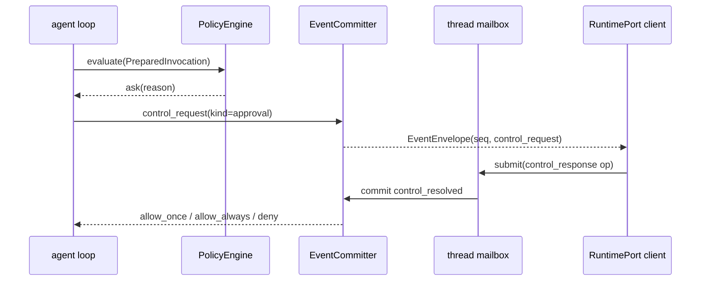

[← 返回地图](./README.md)

# 07 工具集完整规格

本文定义 coda 的 capability 框架与全部八个内置工具(read / ls / glob / grep / bash / edit / write / plan)的参数 schema、行为规格与实现要点,并给出权限/approval 系统设计,以及工具与 steering/abort 的交互契约。工具执行在 agent loop 中的三阶段调度(prepare → execute → finalize)见 [05 Agent 核心](./05-agent-loop.md),本文只写 capability/tool 侧。

> **阶段 0 基线说明**：本文件以 [12 Supervisor Runtime](./12-supervisor-runtime.md) 为上位契约。
> 阶段 3 后 canonical 面是 JSON-Schema-first `CapabilityRegistry`、不可变
> `ToolCatalogSnapshot`、`PreparedInvocation`、`PromptAssembler` 与 `PolicyEngine`；下文现有
> `ToolDefinition` / zod / `beforeToolCall` / `ApprovalBroker` 形态只作为 legacy adapter 的输入，
> 不是新 runtime 的注册、查找或权限边界。子 Agent 是 Supervisor 管理的独立 thread，绝不注册成
> capability/tool。

设计路线先说结论:我们走 opencode / pi-mono / gemini-cli 的「专用工具面」路线,而不是 codex 的「极小工具面 + 强 shell」路线。专用工具能做结构化截断、read-before-edit 追踪、按 kind 分级的权限 gate——这些用裸 shell 都做不到;codex 靠 apply_patch 专用语法 + PTY 会话弥补,复杂度远超 v1 需要。

## 1. 工具框架

### 1.1 JSON-Schema-first canonical 注册项

core 直接消费 JSON Schema，schema 与 executor 必须在一次原子注册中绑定：

```ts
export type CapabilityValidation =
  | { ok: true; value: unknown }
  | { ok: false; message: string };

export interface CapabilityResult {
  content: (TextPart | ImagePart)[];
  details?: unknown;
  terminate?: boolean;
}

export type CapabilityValidator = (input: unknown) => CapabilityValidation;
export type CapabilityExecutor = (
  input: unknown,
  context: CapabilityExecutionContext,
) => Promise<CapabilityResult>;

export interface CapabilityResourceSelector {
  selectorId: string; // registration 内唯一、版本化的稳定 id
  resourceType: 'filesystem' | 'command' | 'network' | 'other';
  argumentPointer: string; // 指向规范化 args 的 JSON Pointer
  access: 'read' | 'write' | 'execute' | 'connect';
  required?: boolean; // 缺省 true；false 仅表示该资源确实可不出现
}

export interface CapabilityPolicyDescriptor {
  kind: 'read' | 'search' | 'edit' | 'execute' | 'plan';
  resources: readonly CapabilityResourceSelector[];
  attributes?: Readonly<Record<string, unknown>>;
}

export type CapabilityResourceResolution =
  | { readonly ok: true;
      readonly resources: readonly Readonly<ResolvedCapabilityResource>[] }
  | { readonly ok: false;
      readonly code: 'resource_resolution_failed' | 'ambiguous_resource';
      readonly message: string };

export type CapabilityResourceResolver = (
  args: unknown,
  context: Readonly<InvocationContext>,
) => Promise<CapabilityResourceResolution>;

export interface EffectivePolicySnapshot {
  readonly context: Readonly<TurnPolicyContext>;
  readonly revision: string;
  readonly policyBasisRevision: string;
  readonly ceilingRevision: string;
  readonly grantRevision: string;
  readonly constraints: readonly Readonly<Record<string, unknown>>[];
  readonly rules: Readonly<RuleSnapshot>;
}

export interface RuleSnapshot {
  readonly revision: string;
  readonly owner: Readonly<TurnPolicyContext>;
  readonly discovery: {
    readonly knownResourceScopes: readonly string[];
    readonly budget: Readonly<RuleSnapshotBudget>;
    readonly diagnostics: readonly Readonly<RuleSnapshotDiagnostic>[];
  };
  readonly files: readonly {
    readonly path: string;
    readonly scope: string;
    readonly contentDigest: string;
    readonly content: string;
  }[];
}

export interface RuleSnapshotBudget {
  readonly maxFiles: number;
  readonly maxFileBytes: number;
  readonly maxBytes: number;
  readonly maxPromptTokens: number;
}

export interface RuleSnapshotDiagnostic {
  readonly code: 'rule_skipped' | 'rule_budget_exhausted' | 'rule_unreadable';
  readonly path?: string;
  readonly message: string;
}

export type RuleSnapshotCaptureResult =
  | { readonly ok: true; readonly snapshot: Readonly<RuleSnapshot> }
  | { readonly ok: false;
      readonly code: 'rule_discovery_failed' | 'invalid_rule_snapshot';
      readonly message: string };

export interface RuleSnapshotProvider {
  capture(input: {
    readonly context: Readonly<TurnPolicyContext>;
    readonly knownResourceScopes: readonly string[];
    readonly budget: Readonly<RuleSnapshotBudget>;
  }): Promise<RuleSnapshotCaptureResult>;
}

export interface BasePromptSnapshot {
  readonly owner: Readonly<TurnPolicyContext>;
  readonly model: Readonly<ModelRef>;
  readonly revision: string;
  readonly content: string;
}

export interface BasePromptProvider {
  capture(input: {
    readonly context: Readonly<TurnPolicyContext>;
    readonly model: Readonly<PromptModelView>;
  }): Promise<Readonly<BasePromptSnapshot>>;
}

export interface ResolvedCapabilityResource {
  selectorId: string; // 必须精确引用 descriptor 中的一项
  resourceType: 'filesystem' | 'command' | 'network' | 'other';
  access: 'read' | 'write' | 'execute' | 'connect';
  canonicalTarget: string;
}

export interface RuleFreshnessPort {
  check(input: {
    readonly snapshot: Readonly<RuleSnapshot>;
    readonly context: Readonly<InvocationContext>;
    readonly resources: readonly Readonly<ResolvedCapabilityResource>[];
  }): Promise<
    | { readonly fresh: true }
    | { readonly fresh: false; readonly code: 'rule_scope_missing';
        readonly missingScopes: readonly [string, ...string[]]; readonly message: string }
    | { readonly fresh: false; readonly code: 'rule_changed'; readonly message: string }
  >;
}

import type { FileTrackerPort } from '../shared/file-tracker.js';

export interface CapabilityRegistration {
  readonly id: string;
  readonly version: string;
  readonly implementationDigest: string;
  readonly description: string;
  readonly inputSchema: JSONSchema;
  readonly promptSnippet?: string;
  readonly executionMode?: 'sequential';
  readonly metadata: Readonly<Record<string, unknown>>;
  readonly policy: Readonly<CapabilityPolicyDescriptor>;
  readonly prepare?: (input: unknown) => unknown;
  readonly validate: CapabilityValidator;
  readonly resolveResources: CapabilityResourceResolver;
  readonly execute: CapabilityExecutor;
}

export type CapabilityCatalogEntry = Readonly<CapabilityRegistration> & {
  readonly registrationDigest: string;
};

export interface InvocationContext {
  readonly workspaceId: WorkspaceId;
  readonly threadId: ThreadId;
  readonly runId: RunId;
  readonly turnId: TurnId;
  readonly opId?: OpId;
  readonly invocationId: string;
  readonly toolCallId: string;
  readonly capabilityId: string;
  readonly catalogRevision: number;
  readonly cwd: string;
}

export interface CapabilityExecutionServices {
  readonly fileTracker: FileTrackerPort;
}

export interface CapabilityExecutionContext extends InvocationContext {
  readonly signal: AbortSignal;
  readonly onUpdate: (update: Readonly<Record<string, unknown>>) => void;
  readonly services: CapabilityExecutionServices;
}
```

```ts
export type RegistryMutationResult =
  | { readonly ok: true; readonly revision: number }
  | { readonly ok: false;
      readonly code: 'duplicate_capability' | 'capability_not_found' |
        'revision_conflict' | 'invalid_registration';
      readonly message: string; readonly revision: number };

export type PrepareInvocationResult =
  | { readonly ok: true; readonly invocation: Readonly<PreparedInvocation> }
  | { readonly ok: false;
      readonly code: 'unknown_capability' | 'invalid_arguments' |
        'prepare_failed' | 'resource_resolution_failed' | 'ambiguous_resource' |
        'invalid_prepared_value' | 'invalid_invocation_context';
      readonly message: string };

export interface CapabilityRegistry {
  register(registration: CapabilityRegistration): RegistryMutationResult;
  update(capabilityId: string, registration: CapabilityRegistration,
    options?: { readonly expectedRevision?: number }): RegistryMutationResult;
  unregister(capabilityId: string,
    options?: { readonly expectedRevision?: number }): RegistryMutationResult;
  snapshot(): ToolCatalogSnapshot;
}

export interface CapabilityRegistryReader {
  snapshot(): ToolCatalogSnapshot;
}

export interface ToolCatalogSnapshot {
  readonly revision: number;
  readonly entries: readonly CapabilityCatalogEntry[];
  resolve(capabilityId: string): CapabilityCatalogEntry | undefined;
  prepare(input: {
    readonly capabilityId: string;
    readonly rawArgs: unknown;
    readonly context: Readonly<InvocationContext>;
    readonly effectivePolicy: Readonly<EffectivePolicySnapshot>;
  }): Promise<PrepareInvocationResult>;
}

export interface PreparedInvocation {
  readonly capabilityVersion: string;
  readonly registrationDigest: string;
  readonly description: string;
  readonly inputSchema: Readonly<JSONSchema>;
  readonly metadata: Readonly<Record<string, unknown>>;
  readonly policy: Readonly<CapabilityPolicyDescriptor>;
  readonly effectivePolicy: Readonly<EffectivePolicySnapshot>;
  readonly executionMode: 'parallel' | 'sequential';
  readonly args: unknown;
  readonly resources: readonly Readonly<ResolvedCapabilityResource>[];
  readonly context: Readonly<InvocationContext>;
  readonly validator: CapabilityValidator;
  readonly executor: CapabilityExecutor;
}

export interface PromptModelView {
  readonly ref: Readonly<ModelRef>;
  readonly limits?: { readonly context: number; readonly output: number };
}

export interface PromptAssemblyInput {
  readonly basePrompt: Readonly<BasePromptSnapshot>;
  readonly outboundMessages: readonly Readonly<AgentMessage>[];
  readonly effectivePolicy: Readonly<EffectivePolicySnapshot>;
  readonly model: Readonly<PromptModelView>;
  readonly catalog: ToolCatalogSnapshot;
}

export type PromptAssemblyResult =
  | { readonly ok: true; readonly context: Readonly<Context> }
  | { readonly ok: false;
      readonly code: 'invalid_prompt_context' | 'invalid_prompt_input';
      readonly message: string };

export interface PromptAssembler {
  assemble(input: PromptAssemblyInput): PromptAssemblyResult;
}

export type PolicyDecision =
  | { readonly kind: 'allow'; readonly code: string; readonly reason: string }
  | { readonly kind: 'deny'; readonly code: string; readonly reason: string;
      readonly recoverable: true }
  | { readonly kind: 'ask'; readonly code: string; readonly reason: string;
      readonly description: string;
      readonly grantProposal?: Readonly<PolicyGrantScope> };

export interface TurnPolicyContext {
  readonly workspaceId: WorkspaceId;
  readonly threadId: ThreadId;
  readonly runId: RunId;
  readonly turnId: TurnId;
  readonly cwd: string;
}

export interface PolicyGrant {
  readonly grantId: ExternalOpId;
  readonly workspaceId: WorkspaceId;
  readonly capabilityId: string;
  readonly capabilityVersion: string;
  readonly registrationDigest: string;
  readonly scope: Readonly<PolicyGrantScope>;
  readonly policyBasisRevision: string;
  readonly acceptedAt: number;
}

export interface PolicyGrantSnapshot {
  readonly workspaceId: WorkspaceId;
  readonly revision: string;
  readonly grants: readonly Readonly<PolicyGrant>[];
  readonly legacyGlobal?: Readonly<LegacyApprovalPatternSnapshot>;
}

// LegacyApprovalPatternSnapshot 从 protocol type-import；capabilities 不重新声明。

export type PolicyGrantCommitResult =
  | { readonly kind: 'applied' | 'duplicate'; readonly revision: string }
  | { readonly kind: 'definitely_not_applied'; readonly message: string }
  | { readonly kind: 'conflict'; readonly revision: string; readonly message: string }
  | { readonly kind: 'fenced'; readonly code: 'stale_fence' | 'wrong_workspace';
      readonly message: string };

export interface PolicyGrantRepositoryPort {
  readonly workspaceId: WorkspaceId;
  readonly mode: 'workspace' | 'legacy_global_approvals_v1';
  snapshot(): Promise<Readonly<PolicyGrantSnapshot>>;
  commitAllowAlways(grant: Readonly<PolicyGrant>): Promise<PolicyGrantCommitResult>;
}

export interface PolicyGrantRepository extends PolicyGrantRepositoryPort {
  close(): Promise<void>;
}

// key=(workspaceId,grantId)：完整 canonical PolicyGrant 相等才 duplicate；同 key 不同 payload 为
// conflict。definitely_not_applied 保证 receipt/outbox/grant 都未 reserve/写入。

export interface ThreadPolicyEngine {
  capture(input: {
    readonly context: Readonly<TurnPolicyContext>;
    readonly workspaceCeiling: Readonly<PermissionCeilingSnapshot>;
    readonly runCeiling: Readonly<PermissionCeilingSnapshot>;
    readonly turnCeiling: Readonly<PermissionCeilingSnapshot>;
    readonly rules: Readonly<RuleSnapshot>;
    readonly grants: Readonly<PolicyGrantSnapshot>;
  }): Promise<Readonly<EffectivePolicySnapshot>>;
  evaluate(invocation: Readonly<PreparedInvocation>): Promise<PolicyDecision>;
  close(): Promise<void>;
}

export interface PolicyEngine {
  openThread(input: {
    readonly workspaceId: WorkspaceId;
    readonly threadId: ThreadId;
  }): Promise<ThreadPolicyEngine>;
}

export interface RuntimeCapabilityServices {
  readonly capabilities: CapabilityRegistryReader;
  readonly providers: ProviderAdapterRegistryReader;
  readonly promptAssembler: PromptAssembler;
  readonly basePrompts: BasePromptProvider;
  readonly ruleSnapshots: RuleSnapshotProvider;
  readonly ruleBudget: Readonly<RuleSnapshotBudget>;
  readonly policyEngine: PolicyEngine;
  readonly ruleFreshness: RuleFreshnessPort;
  readonly grantMode: PolicyGrantRepository['mode'];
}

export function createCapabilityRegistry(): CapabilityRegistry;
export function createPromptAssembler(): PromptAssembler;
export function createPolicyEngine(): PolicyEngine;
```

mutable `CapabilityRegistry`/`ProviderAdapterRegistry` 只由 composition host 持有；传入 Runtime/
ThreadRuntime 的 service bundle 使用上述 snapshot-only reader ports。完整 registry 结构上可作为 reader
注入，但 core 的静态类型面看不到 register/update/unregister，不能从 attachment 热修改 live catalog。

`PolicyGrantScope` 与 `WorkspaceWriteFence` 是 protocol/shared value，逐字段 canonical 定义见
[03](./03-internal-protocol.md) §7.3；capabilities 只单向 type-import，不能反向
依赖 Supervisor/storage 实现。

registry revision 从 0 开始，只在成功 mutation 后增加。duplicate register、missing update/unregister、
update 的 registration.id 不匹配以及 expectedRevision conflict 都返回稳定 failure 且不改 revision。
register 追加稳定槽位，update 保留槽位，unregister 删除；删除后重新注册追加到末尾。registry 在返回前
复制并验证 strict JSON 数据；`snapshot.resolve/prepare` 只用冻结索引和捕获的函数引用，绝不回查
live registry。`implementationDigest`、registrationDigest 的精确 domain/canonical JSON 算法与 golden
vector 见 [12](./12-supervisor-runtime.md) §10.2；snapshot entry、PreparedInvocation 与 grant 均携带
registrationDigest。同一 `(id,version)` 在 live registry history 内不得换 digest，跨 deployment 误复用
version 也不能命中旧 grant。

`ToolCatalogSnapshot.prepare()` 固定执行 strict JSON deep copy → 同一 entry 的 `prepare?` →
`validate` → freeze validated value → `resolveResources` → freeze resource result；validator 成功 value
是最终 args，resolver 不能改写它。throw、invalid JSON、参数/resource failure 都成为 typed recoverable
result，executor 不运行。registration 内 selectorId 必须非空且唯一。prepare 先校验
capabilityId/catalogRevision 与 EffectivePolicySnapshot.context 的 workspace/thread/run/turn/cwd；错配为
invalid_invocation_context。resolver 输出按 selectorId/type/access/target 排序，逐字段完全相同的 tuple
规范化为一项；同一 selectorId 绑定多个不同 canonicalTarget 合法（除非 resolver 自己判为
ambiguous_resource）。每项必须以
selectorId 精确引用 descriptor selector，且 type/access 相等；每个缺省 required selector 必须命中。
unknown selector、type/access 错配、required 未命中、额外或 resolver 声明含糊的资源 fail closed，但没有 required selector（如 plan
resources=[]）时空 result 合法。这样两个同为 filesystem/write 的 `/src` 与 `/dst` 也不会混认。bash/path
analyzer 必须与 executor 同 registration revision，generic PolicyEngine 不猜资源。

`ThreadRuntime` 在 turn 开始、provider sampling 前只捕获一次 catalog/provider/grant/BasePromptSnapshot/
RuleSnapshot。RuleSnapshotProvider 输入的 TurnPolicyContext、canonical known scopes 与四维 budget 深冻结；
输出 owner 必须匹配；revision 只覆盖 known scopes/budget/diagnostics 与 files 的
path/scope/digest/content，明确排除 owner/run/turn identity。相同规则材料跨新 turn 可保持同 revision，
owner 只做接线校验；combined policy revision 仍绑定新 context。ceilingRevision 必须等于本 turn 的
turnCeiling.revision；其 revision 排除纯 run/turn identity，但 workspace/run/narrowing 安全材料变化会
改 basis。capture 失败不采样；新资源 scope
缺规则时提交 hint 并 recoverable deny，下一 turn 才重捕获。CLI 只注入 provider/budget。

`PromptAssembler` 只从同一 EffectivePolicySnapshot.rules 渲染，不收第二份 RuleSnapshot；它验证
base prompt/rules/policy owner 与 model ref 后，使用 outbound message view、base prompt、model、catalog
纯组装深冻结 Context。错配返回 invalid_prompt_context 且 provider 零调用；不得读/改权威 transcript、
live registry、filesystem/env 或 ModelConfig secret。turn 中途热更新只影响下一 turn。

校验成功后产生 `PreparedInvocation`。它持有 capability/version/catalog revision、同一 snapshot
entry 的 description/schema/metadata/policy/executionMode、深冻结后的 parsed args/resources、validator
与 executor 引用，以及 JSON-safe 的身份化 InvocationContext 和完整 EffectivePolicySnapshot；approval
等待或真正执行时不得按名字回查最新 registry。未知 capability 与参数错误仍按 §1.4 回喂模型。

Runtime/registry 共享的是无 thread mutable state 的 `PolicyEngine` factory；每个 ThreadRuntime 必须
`openThread({workspaceId,threadId})` 得到独占 `ThreadPolicyEngine`，并在 attachment close 时 close。
open 必须发生在 provider/tool 前；失败使 attachment fail closed。成功实例不得共享或复用到其他 thread，
close 恰好一次；普通 abort/continue 不另开 engine，只有 recovery reattachment/thread close 重置状态。
`ThreadPolicyEngine.capture()` 只解释显式 ceilings/rules/grants：policyBasisRevision 覆盖 engine、constraints、
ceiling、rules 但排除 grants/turn identity；combined revision 再覆盖 grantRevision/context。因此新增
grant 不会自失效，规则/ceiling/implementation 改变会失效。evaluate 只接收 PreparedInvocation，
未知/缺失约束 fail closed，不读 mutable store/filesystem 或执行 capability。

唯一允许的 mutable policy state 是该 per-thread engine 内的 legacy doom-loop tracker：preflight 按
thread accepted/tool-call source 顺序串行调用 evaluate，tracker 以
`capabilityId + capabilityVersion + registrationDigest + canonical(args)` 的 digest 计连续次数；相同值从
1 递增，不同值重置为 1，第 3 次及以后强制 ask 且不携带 grantProposal。它不跨 thread、不持久化，
进程恢复重建 attachment 或 thread close 后重置（普通 abort/continue 不另建 engine）；共享 factory 不得
维护按隐式全局 key 的计数 Map。

ask 的 grantProposal 是唯一 scope 来源，随 pending control 冻结；canonical_resources_v1 仅支持
`canonical_target_exact_v1`；prepare 完成 selector binding 校验后，grant proposal 才投影掉 selectorId，
proposal 与后续匹配都要求 resourceType/access/canonicalTarget 去重集合
双向完全相等，scope attributes 与 descriptor attributes canonical JSON 深等；generic engine 不解释
glob/prefix/regex 或再次 normalize。空/含糊/不可 canonicalize 调用没有 proposal，canonical
workspace mode 的 allow_always 为 invalid_decision，legacy-global mode 则在 ThreadRuntime 内按旧行为
规范化成 allow_once（resolved 记录 requestedDecision）且不记忆。合法 grant response 以 ExternalOpId、durable acceptedAt、workspace、
capability id/version/registrationDigest、PolicyGrantScope、policyBasisRevision 构造 grant，并携当前
WorkspaceWriteFence；response accepted_pending 必须先 durable 提交自己的 `op_started`，才调用 workspace
storage 打开的 bound repository，commit+flush 后才写 control_resolved/
释放 waiter/执行；repository 在同一 storage transaction 原子比较 token 并 reserve mutation，不能
check-then-act。`definitely_not_applied` 才允许把 response op interrupted、原子释放其 first-wins claim并
保持 request pending，客户用新 OpId 重答；conflict 保留 claim并 quarantine 整个 workspace，fenced
停止 workspace admission，throw/unknown outcome degraded；后三者都停止该 workspace 的新 admission/
capability execution，不继续 mailbox/executor。grant→control
crash 重试 duplicate 后补 control，但旧 waiter 消失时绝不重放 executor。allow_once 不写 repository。
canonical mode workspace-scoped 且只接受 scope.kind canonical_resources_v1；legacy CLI adapter 用
互斥 scope.kind legacy_global_approvals_v1 中明确的 patterns 与
PolicyGrantSnapshot.legacyGlobal 继续读写全局 approvals.json，保持旧跨 cwd 行为；先在 fenced workspace
transaction 持久 reserve patterns outbox，再以跨 workspace lock/CAS 写 shared Set，只有新 holder 可恢复
已 reserve outbox。未 reserve 的 stale writer 无权写；全过程服从幂等 crash state machine。
legacy composition 的 tolerant-load 也必须兼容现有 `loadPersistedRules()`：文件缺失、JSON 损坏、非数组
或含任一非 string 项都视为空 Set，并产生 projector 丢弃的稳定 warning diagnostic
`legacy_approvals_invalid_ignored`；不能让历史坏文件使 CLI construction fatal。后续合法 allow_always 可
按旧写法重建文件。普通 canonical workspace grant store 损坏则 fail closed，不套用此兼容例外。

以上对象及嵌套 JSON 数据均深冻结；`PreparedInvocation` 的 schema、metadata、policy/executionMode、
validator、executor 和 args 必须来自同一个 catalog snapshot entry，`effectivePolicy` 则来自 turn 开始时捕获的
单一 policy snapshot。PolicyEngine 不得在 evaluate 时读取 mutable rule store；`allow_always` 的
缓存/审计 key 必须包含 `policyBasisRevision` 与 registrationDigest。`entries` 的查找索引属于 snapshot 私有实现，
调用方不能得到可变 registration 引用。

项目规则需要独立的 freshness gate，不能让纯 `ThreadPolicyEngine.evaluate(preparedInvocation)` 回读 mutable
rule store。ThreadRuntime 在 policy preflight 前、以及 approval/同批前序工具之后但 executor 副作用
之前，各调用一次注入的 `RuleFreshnessPort.check()`，输入只取 PreparedInvocation 已冻结的
`effectivePolicy.rules/context/resources`。freshness 只能把 allow/ask 收窄为 recoverable deny，促使
下一 turn 重新组装规则；不得替换 snapshot、args、schema、executor、approval 或 effective policy。
`rule_scope_missing` 必须返回 strict JSON copy、非空、去重且按 UTF-8 排序的 `missingScopes`；
ThreadRuntime 逐字持久化这些 scope hint，不能从 canonicalTarget 猜项目规则边界。`rule_changed` 不带
scope。

`InvocationContext.toolCallId` 是 provider 消息中的原始调用 id，专供事件关联与 legacy
`ToolDefinition.execute({id,args})` 映射；`invocationId` 是 runtime 为本次执行生成的审计/allow_once
身份，按 workspace/thread/run/turn + source tool-call ordinal 确定性生成；不同 message/turn 复用
toolCallId 不得碰撞，二者不能互相猜测。单个 assistant message 内重复 toolCallId 在 prepare 前作为
`duplicate_tool_call_id` provider protocol error 终结该 turn；final assistant 在 message_end 前移除全部
ToolCallPart、改为 nonretryable error，且不发 control/tool execution/result，保持 legacy ToolResult/UI
pairing 无歧义。
registration 缺省 executionMode 在 prepare 时规范化为 `parallel`；批调度
只读各 PreparedInvocation 固定的 executionMode，任一为 sequential 时整批保持现有顺序语义。

### 1.2 `ToolDefinition` legacy adapter

现有内置工具继续使用下列实现友好的 zod 类型，但它不再是 core canonical：

```ts
// src/tools/types.ts
export interface ToolDefinition<P = any, D = unknown> {
  name: string; description: string;
  parameters: z.ZodType<P>;                       // z.toJSONSchema() 渲染进 Context.tools
  executionMode?: 'sequential';                   // 声明则整批退化为顺序执行(bash/edit/write 声明)
  promptSnippet?: string;                         // 拼进 system prompt 的使用指引
  execute(call: { id: string; args: P }, ctx: ToolContext): Promise<ToolOutput<D>>;
}
export interface ToolContext { cwd: string; signal: AbortSignal; onUpdate?: (u: { output?: string }) => void; fileTracker: FileTracker }
export interface ToolOutput<D> { content: (TextPart | ImagePart)[]; details?: D; terminate?: boolean }
```

补充字段与配套类型(legacy adapter 继续保留这些既有语义):

```ts
// ToolDefinition 补充可选字段
export interface ToolDefinition<P = any, D = unknown> {
  // ...同上...
  kind?: 'read' | 'search' | 'edit' | 'execute' | 'plan';   // 权限分级用,缺省视为 'execute'
  prepareArguments?: (raw: unknown) => unknown;              // zod 校验前的宽容修补(见 1.5)
}

// src/shared/file-tracker.ts —— read-before-edit 硬约束的 port 与默认实现。
// 宿主在 shared 而非 tools:Agent 实例持有会话级 FileTracker(05 文档第 1 节),
// 而 ESLint zone 只放行 agent → tools/types.ts,类的构造必须落在双方都可见的 shared。
export interface FileTrackerPort {
  markRead(path: string, mtimeMs: number): void;
  assertFresh(path: string, currentMtimeMs: number):
    | { ok: true }
    | { ok: false; reason: 'never_read' | 'stale' };
}

export class FileTracker implements FileTrackerPort {
  markRead(path: string, mtimeMs: number): void;             // read 成功、edit/write 成功后登记
  assertFresh(path: string, currentMtimeMs: number):
    | { ok: true }
    | { ok: false; reason: 'never_read' | 'stale' };
}
```

`execute` 的失败语义:**throw 表示失败**,loop 层捕获后转为 `isError: true` 的 ToolResultMessage(错误消息即 throw 的 message,面向模型撰写)。工具内部不自己构造 error 结果——统一由 loop 转换,保证所有错误路径产出形态一致(pi-mono 同款约定)。

legacy adapter 在注册时只**捕获并封装** `prepareArguments`、executionMode、zod validator 与 executor（不提前对
调用参数执行它们），同时一次性生成 JSON Schema 与 `CapabilityRegistration`。validator 与 executor 属于同一 registration；snapshot 存活期间二者都
不能被替换。adapter **不得捕获 FileTracker 实例**：执行时从
`CapabilityExecutionContext.services.fileTracker` 取得当前 thread 的 tracker，再映射成 legacy
`ToolContext.fileTracker`。同一个 registration/snapshot 因而可安全用于多个并发 thread，且
read-before-edit 状态不会串线。第三方 capability 消费者不需要安装 zod。
execute 时 adapter 把 `prepared.context.toolCallId` 原样作为 legacy call.id；不得用 invocationId、数组
下标或新生成 id 替代。

policy/resource 不能由通用 adapter 读取 `ToolDefinition.kind`、按 `tool.name` 分支或猜参数位置；bridge
调用方必须把它们作为同一版本的显式 binding 注册：

```ts
export interface LegacyToolCapabilityBinding<P = any, D = unknown> {
  readonly tool: ToolDefinition<P, D>;              // tool.name 是 capability id
  readonly version: string;
  readonly implementationDigest: string;
  readonly metadata?: Readonly<Record<string, unknown>>;
  readonly policy: Readonly<CapabilityPolicyDescriptor>;
  readonly resolveResources: CapabilityResourceResolver;
}

export function adaptLegacyTool(
  binding: Readonly<LegacyToolCapabilityBinding>,
): CapabilityRegistration;

// src/integrations/legacy-coding-tools/index.ts
export function createCodingToolCapabilityBindings():
  readonly Readonly<LegacyToolCapabilityBinding>[];
```

adapter 只机械封装 schema/prepare/validator/executor，并逐字段复制 binding 的 policy/resolver；binding
缺失、selectorId 重复或 resolver 与 descriptor 对不上时以 `invalid_registration` 拒绝，不能生成所谓
“保守默认值”。八个内置工具必须由 `createCodingToolCapabilityBindings()` 明示下表，且 analyzer/
resolver 的版本材料计入 implementationDigest：

| capability | kind | selector（type/access/pointer/required） | resolver 约束 |
|---|---|---|---|
| `read` | read | `file`（filesystem/read, `/path`, true） | 相对 cwd 解析为 canonical file |
| `ls` | read | `root`（filesystem/read, `/path`, true） | 缺省 path 仍绑定 canonical cwd |
| `glob` | search | `root`（filesystem/read, `/path`, true） | 缺省 path 仍绑定 canonical cwd；pattern 不是资源 target |
| `grep` | search | `root`（filesystem/read, `/path`, true） | 缺省 path 仍绑定 canonical cwd；query 不是资源 target |
| `bash` | execute | `command`（command/execute, `/command`, true）；`workdir`（filesystem/read, `/workdir`, true）；`filesystem_read_target`（filesystem/read, `/command`, false）；`filesystem_write_target`（filesystem/write, `/command`, false） | 固定版本的 command analyzer 必须始终绑定 command 与实际/default cwd，并可为后两 selector 各返回 0..n 个 canonical target；不得在 evaluate 时重解析 shell |
| `edit` | edit | `file`（filesystem/write, `/path`, true） | 绑定 canonical target；read-before-edit 仍由 per-thread service 强制 |
| `write` | edit | `file`（filesystem/write, `/path`, true） | 绑定 canonical target；read-before-edit 仍由 per-thread service 强制 |
| `plan` | plan | 无 | 必须返回空 resources |

同一 bash selector 返回多个不同 target 是合法集合，不是歧义；重复的完整
`(selectorId,resourceType,access,canonicalTarget)` tuple 才规范化去重。第三方 legacy tool 也必须提供
同形 binding，否则不注册。这样 schema、analyzer、policy 与 executor 的 registrationDigest 一起冻结，
PolicyEngine 永远只读取 PreparedInvocation。

模块归属也冻结：通用 `LegacyToolCapabilityBinding/adaptLegacyTool` 位于
`capabilities/legacy-tool-adapter` 且只窄依赖 `tools/types.ts`；认识八个具体工具与 bash analyzer 的
`createCodingToolCapabilityBindings()` 位于 `integrations/legacy-coding-tools/`，它允许依赖
capabilities public types 与具体 tools。CLI composition root 只调用该 integration 的 public entry。
不得把内置 policy switch 藏进 generic capabilities 或 CLI，也不得让 tools 反向依赖 capabilities。

### 1.3 zod v4 → JSON Schema 渲染

legacy tool 注册到 registry 时一次性渲染:

```ts
const toolSchemas: ToolSchema[] = tools.map((t) => ({
  name: t.name,
  description: t.description,
  parameters: z.toJSONSchema(t.parameters),
}));
```

约束:参数 schema 只允许 JSON 可表示的 zod 类型(object/string/number/boolean/array/enum/optional),禁用 `z.date`、`z.transform` 等无法渲染的类型;每个字段必须 `.describe()`——这些描述是模型唯一稳定可见的参数文档。strict mode 清洗(`additionalProperties: false`、剥除方言不支持的关键字)不在这里做,是 adapter 的职责(见 [04 Provider adapter](./04-provider-adapter.md)),`protocol` 层的 ToolSchema 保持原始 JSON Schema。

### 1.4 校验失败:回喂而非中断

未知工具名、参数校验失败都**不 throw、不终止 loop**,而是合成 isError 的 ToolResultMessage 回喂模型(opencode `InvalidArgumentsError` 的做法,实测模型一轮内即可自我修正)。文案策略:

- 未知工具:`Unknown tool "X". Available tools: read, ls, glob, grep, bash, edit, write, plan.`
- 校验失败:`The <tool> tool was called with invalid arguments: <detail>. Please rewrite the input so it satisfies the expected schema.` 其中 `<detail>` 用 `z.prettifyError()` 输出的逐字段错误(路径 + 期望类型),**不要**把整个 JSON Schema 倒回去——上下文成本高且模型并不需要。

### 1.5 prepareArguments:校验前宽容,校验后严格

模型会产出结构畸形但意图明确的参数,pi-mono 实测两类高频:edits 数组被发成 JSON 字符串(Opus 4.6、GLM-5.1 均出现过);旧式平铺参数(`oldText/newText` 而非 `edits: [...]`)。`prepareArguments` 在 zod 校验**之前**做无损修补:

```ts
// edit 工具的 prepareArguments 伪码
prepareArguments(raw) {
  if (typeof raw?.edits === 'string') { try { raw.edits = JSON.parse(raw.edits); } catch {} }
  if (!raw?.edits && raw?.oldText !== undefined) {
    raw = { path: raw.path, edits: [{ oldText: raw.oldText, newText: raw.newText, replaceAll: raw.replaceAll }] };
  }
  return raw;
}
```

原则:只做结构搬运,不猜语义;修补后照常走 zod,失败仍按 1.4 回喂。

### 1.6 promptSnippet 拼装

`description` 随 tool schema 每次请求可见,写单工具契约;`promptSnippet` 拼进 system prompt,写**跨工具协作规范**(read-before-edit、避免 `cd`、plan 的使用时机等)。`PromptAssembler` 只读取该 turn 捕获的同一 `ToolCatalogSnapshot`，按 snapshot 的稳定顺序把非空 promptSnippet 收进固定小节:

```
# Tool usage notes
<read 的 snippet>
<bash 的 snippet>
...
```

只包含本次 snapshot 激活的工具的 snippet,避免向模型描述不存在的工具；不能先读 registry 最新
schema，再从旧列表执行 executor。

### 1.7 统一截断 post-hook(框架级横切)

抄 opencode `Truncate.output` 的完整方案,所有工具输出统一过一遍:

- 双上限 **2000 行 / 50KB(48 * 1024 bytes 级别,谁先命中算谁)**,与 read 的默认读取量一致(pi-mono 与 opencode 使用完全相同的常量,已是事实标准)。
- 超限时**全文落盘**到 `~/.coda/truncated/<safe-thread-key>/<safe-file-key>.txt`，7 天保留、启动时
  清理。`safe-thread-key` 由 storage 层对 `(workspaceId,threadId)` 做稳定 hash/安全编码，
  `safe-file-key` 同样编码 timestamp + toolCallId；caller/model 提供的 opaque ThreadId/ToolCallId
  绝不能原样拼路径。创建前后都要 resolve 并验证目标仍位于 truncation root 下。日志/details 可另行
  展示原诊断 ID，但它不是路径成分。
- 结果尾部附**可执行的续读提示**,精确告诉模型下一步动作,例如:

```
[Output truncated: showing first 2000 of 8214 lines.
Full output saved to: ~/.coda/truncated/s01/17538-call_ab12.txt
Use the read tool with offset=2001 on the original file to continue,
or grep the saved file to search the full content.]
```

- 工具可声明自己已截断(details 带 `truncated: true`)则跳过 post-hook——bash 需要**尾部**截断(错误在末尾),与框架默认的头部截断方向相反,故自带截断逻辑并打标。

所有参考项目里,「截断时告诉模型下一步怎么办」是回报率最高的一条:pi-mono 的每处 truncation 都附 `offset=N` 或落盘路径,显著减少模型来回试错。


## 2. 逐工具规格

### 2.1 read

```ts
const ReadParams = z.object({
  path: z.string().describe('Path to the file to read (absolute, or relative to cwd)'),
  offset: z.number().int().min(1).optional().describe('Line number to start reading from (1-indexed)'),
  limit: z.number().int().min(1).optional().describe('Maximum number of lines to read (default 2000)'),
});
```

行为规格:

- 默认 2000 行 / 50KB / 单行 2000 字符三重上限;流式逐行读取并同时计数行与字节,命中 50KB 即中断上游文件流(opencode 做法,不整读大文件进内存)。
- **行号前缀 `N: text` 必须有**:edit 的 oldText 匹配依赖模型对文件内容的精确记忆,行号显著帮助定位;promptSnippet 里强调「edit 匹配时剥掉行号前缀」(Claude Code 同款提示)。
- 结尾状态三态,**永远告诉模型下一步 offset**:
  - 读完:`(End of file - total 42 lines)`
  - 行数截断:`[Showing lines 1-2000 of 5321. Use offset=2001 to continue.]`
  - 字节截断:`[Output capped at 50KB at line 731. Use offset=732 to continue.]`
- 二进制检测 = 扩展名黑名单 ∪ 4KB 采样(含 NUL 即二进制;不可打印字符占比 > 30% 即二进制),命中报错 `Cannot read binary file: X`。
- 图片(png/jpeg/gif/webp)转 base64 走 `ImagePart` 返回(内部协议 tool result 支持图片;Chat Completions 侧的降级由 adapter 处理,见 04)。
- 文件不存在 → 列同目录下与 basename 互为子串的最多 3 个候选:`File not found: X\n\nDid you mean one of these?\n  src/foo.ts\n  src/foo.test.ts`(opencode 做法,低成本高收益)。
- offset 越界显式报错:`Offset 3000 is out of range for this file (412 lines).`
- **FileTracker 登记**:读取成功后 `fileTracker.markRead(resolvedPath, mtimeMs)`——这是 edit/write 硬约束的数据来源(见 2.6)。

输出示例:

```
1: import { z } from 'zod';
2: 
3: export const config = {
(End of file - total 3 lines)
```

参考对照:opencode `read.ts` 为主参照(行号 / 三态结尾 / 相似名建议 / 流式字节上限齐全);pi-mono 无行号(其 edit fuzzy 更强,我们选行号 + 保守 fuzzy 的组合);gemini-cli 的 20MB 文件上限可作为额外保险。

### 2.2 ls

```ts
const LsParams = z.object({
  path: z.string().optional().describe("Directory to list. Omit for cwd — do NOT pass 'undefined' or 'null'"),
  limit: z.number().int().min(1).optional().describe('Maximum entries to return (default 500)'),
});
```

- `readdir` 按字母序,目录加 `/` 后缀,包含 dotfiles,**不递归**(递归找文件是 glob 的事)。
- 遵守 .gitignore 常见忽略(`node_modules/`、`.git/`、构建产物目录),被忽略的目录仍列出名字但不计入内容遍历。
- 超 limit 截断 + 提示:`(Showing first 500 of 1893 entries. Use glob for targeted listing.)`
- path 不是目录 → `Not a directory: X (did you mean the read tool?)`。
- 参数描述里的 "do NOT pass 'undefined'" 抄 opencode 实战经验:模型真的会填字符串 `"undefined"`。

参考对照:pi-mono `ls.ts` 是最简洁样板,照抄;gemini-cli 的 `respect_git_ignore` 思路吸收为默认行为而非参数。

### 2.3 glob

```ts
const GlobParams = z.object({
  pattern: z.string().describe("Glob pattern, e.g. '**/*.ts' or 'src/**/*.test.ts'"),
  path: z.string().optional().describe("Directory to search. Omit for cwd — do NOT pass 'undefined' or 'null'"),
  limit: z.number().int().min(1).optional().describe('Maximum files to return (default 100)'),
});
```

- 实现走 ripgrep:`rg --files --glob <pattern>`,天然吃 .gitignore、排除隐藏文件(opencode 同款,免去再引 glob 库)。
- **排序规则抄 gemini-cli `sortFileEntries`**:24 小时内修改过的文件按 mtime 新 → 旧排最前,其余按字母序——「找我刚改过的文件」是高频任务,实测有用。
- 0 结果:`No files match pattern "X"`;满 limit:`(Results truncated: showing first 100. Refine the pattern or path.)`

### 2.4 grep

```ts
const GrepParams = z.object({
  pattern: z.string().describe('Regex to search for (ripgrep syntax)'),
  path: z.string().optional().describe('File or directory to search. Omit for cwd'),
  glob: z.string().optional().describe("Filter files, e.g. '*.ts' or '**/*.spec.ts'"),
  ignoreCase: z.boolean().optional().describe('Case-insensitive search'),
  literal: z.boolean().optional().describe('Treat pattern as a fixed string, not regex'),
  context: z.number().int().min(0).optional().describe('Lines of context around each match'),
  limit: z.number().int().min(1).optional().describe('Maximum matches (default 100)'),
});
```

行为规格与实现要点:

- **调 ripgrep 二进制,不自实现**。五个参考项目无一例外依赖 rg,自实现 JS 搜索只出现在 gemini-cli 的三级兜底链末端。我们用 `@vscode/ripgrep` 内嵌平台二进制,免去 pi-mono 式运行时下载。
- spawn 参数:`rg --json --line-number --color=never --hidden --no-require-git --glob '!.git/**' [--ignore-case] [--fixed-strings] [--glob G] pattern path`,用 `--json` 流式解析拿结构化 `path / line_number / lines.text`。`--hidden` 让 dotfiles 可搜,但会连带解除 rg 对 `.git/` 的默认跳过,必须显式排除(opencode 同款处理);`--no-require-git` 让 `.gitignore` 在非 git 目录同样生效(与 glob 一致)。
- **match 数达到 limit 即 kill rg 进程**(pi-mono 做法):大仓库上全量搜完再截断浪费数秒;kill 后结果注明 `(more matches available — refine pattern or path)`。
- context 行不用 rg 的 `-C`(会让 limit 数到 context 行),而是命中后自行读文件切片(带文件缓存),limit 只数 match。
- 单行截到 500 字符;exit code 1 = 无匹配**不是错误**,返回 `No matches found`(空串会让模型困惑);exit code ≥ 2 才是 rg 报错。
- 输出 gnu grep 风格,match 行 `path:line: text`,context 行 `path-line- text`,按文件分组:

```
src/agent/loop.ts:42: const stream = streamFn(model, ctx, { signal });
src/agent/loop.ts-43-   for await (const ev of stream) {
```

参考对照:参数面取 pi-mono 的中间态(opencode 太少、gemini-cli 太多);gemini-cli 的「单 match 自动带 50 行 context」留作 v2 增强。

### 2.5 bash

```ts
const BashParams = z.object({
  command: z.string().describe('The command to execute'),
  timeout: z.number().int().min(1).max(600_000).optional().describe('Timeout in milliseconds (default 120000)'),
  workdir: z.string().optional().describe("Working directory for this command. Use this instead of 'cd'"),
  description: z.string().optional().describe('5-10 word active-voice summary of what this command does'),
});
```

声明 `executionMode: 'sequential'`、`kind: 'execute'`。`description` 字段抄 Claude Code / gemini-cli:让模型给命令写一句人话,approval UI 直接可用。

**不做持久 shell(v1)的理由**:四个参考项目(opencode / pi-mono / gemini-cli / codex 的 shell_command)全部选择每次 spawn 新进程。持久 shell 的隐式状态(cwd 漂移、env 变化、挂着的后台 job)对模型不可见,是幻觉温床;崩溃恢复与 abort 语义都变复杂。codex 是唯一提供持久能力的,但形态是**显式的 PTY 会话对象**(`exec_command` 到 yield_time 未结束返回 session_id,`write_stdin` 续写)——这套语义留作 v2 的交互式/长任务方案,比 gemini-cli 的 `is_background: boolean` 更统一。cwd 需求由 `workdir` 参数满足,promptSnippet 明令 `AVOID cd <dir> && cmd`(opencode 原话)。

行为规格:

- `Bun.spawn([shell, '-c', command], { detached: true, cwd: canonicalize(resolve(ctx.cwd, workdir ?? '.')) })` 建**进程组**;CLI/tool cwd 与 workdir 统一物理化，相对 workdir 不得回退成进程启动目录，也不能在 symlink cwd 下与规则分析分叉。为让规则/审批静态分析与真实 shell 一致，spawn 环境清除会隐式执行脚本或改写 `cd` 查找的 `BASH_ENV` / `CDPATH`。timeout / abort 时调 `killProcessTree`(SIGTERM → 3s 后 SIGKILL 整棵树)。只 kill 直接子进程会漏掉 `bun run dev` 起的孙进程,这是 detached 进程组的全部意义。Bun 负责 spawn 与流式 stdout/stderr；POSIX signal/PGID 收尾属于受控 `process` compatibility 边界。
- stdout + stderr 合并收集进 rolling buffer(只保留 2 × 上限的滚动窗口,防长命令吃内存);**尾部截断**保留末尾 2000 行 / 50KB——命令输出的错误几乎总在尾部,与 read 的头部截断方向相反;超限全文落盘,输出头部注明 `...output truncated...\nFull output saved to: <path>`。details 打 `truncated` 标记跳过框架 post-hook(见 1.7)。
- `onUpdate` 以 100ms 节流推送增量输出(`tool_execution_update` 事件),CLI 据此渲染实时进度——用户看得见卡在哪,才知道该不该 Esc。
- 输出显式带退出状态:末尾附 `exit code N`;非 0 → isError: true 但**仍附完整输出**(模型需要 stderr 判断怎么修)。
- timeout 触发:kill tree 后输出尾附 `Command timed out after 120000 ms and was killed. Retry with a larger timeout value if the command legitimately needs more time.`(opencode 的 `<shell_metadata>` 思路:把「为什么停了、下一步怎么办」讲给模型)。
- abort 触发:kill tree 后输出尾附 `User aborted the command`,isError: true(该结果进转录,模型能理解发生了什么,见 §4)。

### 2.6 edit

```ts
const EditParams = z.object({
  path: z.string().describe('Path to the file to edit'),
  edits: z.array(z.object({
    oldText: z.string().describe('Exact text to replace, as it appears in the file (strip read line-number prefixes)'),
    newText: z.string().describe('Replacement text (must differ from oldText)'),
    replaceAll: z.boolean().optional().describe('Replace all occurrences (default false: oldText must be unique)'),
  })).min(1).describe('All edits are matched against the original file content; edits must not overlap'),
});
```

声明 `executionMode: 'sequential'`、`kind: 'edit'`,配 1.5 的 prepareArguments。选型:old/new 精确替换是 2025-26 的绝对主流(Claude Code / opencode / gemini-cli / pi-mono 全部采用);codex 的 apply_patch 依赖 freeform custom tool + grammar 约束,走普通 function calling 时语法错误率上升,不取;全文重写只作为 write 存在。

**匹配策略:精确优先 + 零风险 fuzzy,明确拒绝编辑距离类。**

1. 精确 `indexOf` 匹配,命中即用。
2. 失败进入**归一化空间**重试(pi-mono 方案):NFKC + 每行 `trimEnd` + 智能引号/Unicode 破折号/特殊空格 → ASCII,在归一化文本上 `indexOf`;命中后**按行 overlay 回原文**——只重写被触及的行,未触碰行保留原始字节。这层只修「模型不可能看见的差异」(不可见字符与行尾空白),零误匹配风险。
3. 到此为止。**不做编辑距离 / 相似度 / 锚点匹配**:aider 的 `replace_closest_edit_distance`(0.8 相似度)被作者刻意用一个裸 `return` 变成死代码——实战验证了相似度匹配会静默改错地方;opencode 的 BlockAnchor(首尾行锚点 + 0.65 行相似度)不得不再配 `isDisproportionateMatch` 防呆,防它把 500 行函数当成 3 行 oldText 的匹配结果吞掉。静默改错的代价远大于让模型重发一次 edit。gemini-cli 式 LLM 自修复留作 v2 可选增强。

不变量与错误文案(全行业公共约定):

- `oldText === newText` → `No changes to apply: oldText and newText are identical.`
- 0 次匹配 → `Could not find the text to replace in X. It must match exactly, including whitespace and indentation. Re-read the file and try again.`
- ≥ 2 次匹配且非 replaceAll → `Found 4 occurrences of the text in X. Provide more surrounding context to make the match unique, or set replaceAll: true.`
- 多 edit 语义抄 pi-mono:**所有 oldText 对原始内容匹配,按 offset 逆序应用,禁止重叠**(重叠报错)。不用「顺序应用」语义——Claude Code 的 MultiEdit 因模型搞不清顺序语义而被移除。

**read-before-edit 硬约束**(Claude Code 是唯一硬约束实现,opencode 只写在 prompt 里没有强制,我们做成硬的):

- `fileTracker.assertFresh(path, mtime)` 返回 `never_read` → `File has not been read in this thread. Use the read tool first.`
- 返回 `stale`(磁盘 mtime 比登记值新)→ `File has been modified since it was last read. Re-read it to see the current content.`
- edit/write 成功后自身调 `markRead` 更新登记(自己的写不算外部修改)。实现成本极低,消除「覆盖用户手改」一整类事故。

**BOM/CRLF 三步**(opencode 与 pi-mono 一致,Windows 仓库必做,否则 edit 必挂):剥 BOM + CRLF → LF 归一化;在 LF 空间匹配与替换;按原文件行尾风格还原、写回时补回 BOM。模型永远输出 LF,这层负责双向翻译。

其他要点:同路径写操作经 per-path 串行队列(pi 的 `withFileMutationQueue`,parallel 工具批次下防竞争);成功输出给模型一行确认(`Applied 2 edits to src/foo.ts`),unified diff(npm `diff` 包的 `createTwoFilesPatch`)进 `details` 供 UI 渲染与 additions/deletions 统计——**diff 不回喂模型**,省 token。

### 2.7 write

```ts
const WriteParams = z.object({
  path: z.string().describe('Path to the file to write. Parent directories are created automatically'),
  content: z.string().describe('Full content to write (this replaces the entire file)'),
});
```

声明 `executionMode: 'sequential'`、`kind: 'edit'`。

- 语义 = 新建或**整体覆盖**;自动 `mkdir -p` 父目录。
- **覆盖已有文件同样受 read-before-edit 约束**(fileTracker 校验,文案同 2.6);新文件不受约束。覆盖时保留原文件 BOM 与行尾风格。
- 与 edit 分工由文案引导:write 的 description 写明 "Prefer the edit tool for modifying existing files; use write only for new files or intentional full rewrites"(opencode 用 edit 空 oldString 的报错把模型往 write 引,我们双向都写清楚)。
- 成功输出:`Wrote 120 lines (3.4 KB) to src/new.ts`;`details` 带覆盖前旧内容生成的 diff(approval UI 用)。
- 走同一 per-path 写队列;成功后 `markRead` 登记。

### 2.8 plan

```ts
const PlanParams = z.object({
  steps: z.array(z.object({
    step: z.string().min(1).describe('Short description of this step'),
    status: z.enum(['pending', 'in_progress', 'completed']),
  })).describe('The complete updated plan (full replacement of the previous list)'),
});
```

`kind: 'plan'`。参数结构与 [03 内部协议](./03-internal-protocol.md) 的 `PlanStep` 逐字对应。

**整表替换语义**(opencode todowrite / gemini-cli write_todos / codex update_plan 三家同构,没有增量 add/complete API):模型每次重申完整列表,状态不会漂移;列表随每次 tool result 重新进入上下文,等于模型自维护的 scratchpad——这正是它防长任务跑偏的机制。

行为规范写进 description + promptSnippet(opencode `todowrite.txt` 是最好的范本,整段借鉴):

- ≥ 3 步的任务才用 plan,琐碎任务不开表;
- **至多一个 in_progress(执行中应恰好一个)**(codex 原话 "At most one step can be in_progress at a time"),违反时不报错但输出提醒;
- 开工前把该步标 in_progress,完成**即时**更新,不许批量补记,不许按意图提前标 completed;
- 被阻塞:保持 in_progress,新增一条描述 blocker 的 step。

实现要点:工具本体只回显编号列表(`1. [completed] 定位配置加载代码` …)并把 `{ steps }` 放进 `details`;**`plan_update` 事件由 loop 在 finalize 阶段识别 plan 工具的 details 后发出**——工具不直接依赖 agent 事件总线,保持 `tools → protocol` 的依赖方向。plan mode(只读探索 → 批准 → 动工)不在 v1 范围,但按本项目设计约定预留:它是权限层的模式标志 gate 写工具(工具保留在列表、执行时报错),批准动作 = 注入一条 synthetic user message——与 steering/follow-up 的消息注入机制天然同构。

## 3. 权限 / approval 系统

### 3.1 架构：PolicyEngine + 统一 control 事件

权限不侵入 capability executor。`ThreadPolicyEngine.evaluate(preparedInvocation)` 只读取其中冻结的
capability policy descriptor、规范化 args 与 effective policy snapshot，并返回
`allow | deny | ask` 与可审计 reason，不执行 capability，也不修改 snapshot。唯一身份事实是
`preparedInvocation.context`；不得再传入第二份 InvocationContext。策略在 workspace 给出上限，
thread/run 只能收窄。子 thread 默认继承父 thread 有效权限的交集，创建子 thread 不能提权，父
thread 也不能静默代替子 thread 批准。

`ask` 不再走 CLI 旁路 resolver。`ThreadRuntime` 先把
`control_request { requestId, kind:'approval', owningRunId, owningTurnId, policyRevision, payload }`
交给 `EventCommitter` 权威提交，再等待同
thread mailbox 中的 `control_response` op；决议后同样提交 `control_resolved`，最后才继续或拒绝
executor。跨 thread、错误 run 或已结案 request 的响应必须拒绝。



阶段 0 保留裸 legacy `beforeToolCall` / `ApprovalBroker` 旁路；阶段 1 的 legacy thread driver 在
边缘把 `approval_request` 投影成 identity-bearing `control_request`，并把 `control_response` op
映回 broker，因此 canonical wire 从阶段 1 起不含第二种 legacy approval **event** 分支。阶段 2
`legacyProposal` 只是 canonical control_request payload 中冻结的兼容数据；本阶段才把 request/response
与等待者状态迁入 durable EventCommitter 链并删除 core 旁路，不是再次修改 public wire。阶段 2
static ThreadRuntime 使用 [12](./12-supervisor-runtime.md) §6.2 的 LegacyApprovalAdapter：preflight 只返回
allow/deny/冻结的 `{patterns,forceConfirm}` ask，不发事件/持 waiter；ThreadRuntime 提交唯一
control_request，response accepted 后 adapter 先幂等持久化旧 global pattern Set，ThreadRuntime 再提交
control_resolved 并释放 waiter。force/空 pattern 的 allow_always 按既有行为规范化为 allow_once；
repository 明确 definitely-not-applied 时 response interrupted + claim release、request 保持 pending并可用
新 OpId 重答；conflict/fenced/unknown 保留 claim并分别 quarantine workspace/停 admission/degrade，
且都停止该 workspace 的新 admission/capability execution。crash recovery
可补 pattern/control 但绝不重放 executor。阶段 3
才以 PreparedInvocation/PolicyEngine/grant repository 取代这个窄 bridge。按 `kind`
分级的默认策略保持：`read` / `search` / `plan` 通常直通；`edit` 的描述包含 diff 摘要；
`execute`（bash）包含命令与模型提供的 description。

### 3.2 决策语义与作用域

| 决策 | 语义与绑定范围 |
|---|---|
| `allow_once` | 只放行 `preparedInvocation.context` 中的 `(threadId, runId, invocationId)`，不得被同名新 invocation 复用 |
| `allow_always` | canonical grant 受 workspace、capability id/version/registrationDigest、PolicyGrantScope 与 policyBasisRevision 限制；legacy CLI adapter 显式保留旧 global patterns；edit/write 按路径 pattern，bash 按受审命令 pattern |
| `deny` | 合成文案回喂模型：`User denied permission: <reason>. Do not retry the same call; ask the user or take a different approach.`；任务继续 |
| `abort` | canonical 上是目标 `threadId`/`expectedRunId` 的 abort op，不是普通 deny；先传播 cancellation，再以 aborted 结案 pending control |

approval 等待期间 registry/policy 更新不能偷换已经 prepare 的 schema、args、executor 或 effective
policy snapshot。若新 policy revision 必须撤销旧决定，应以目标 run/invocation 的显式取消结案，并在
后续 turn 重新 prepare；不得让尚在等待的 PreparedInvocation 静默读到新 revision。

### 3.3 bash 命令结构解析与 $() 升级

前缀 allowlist 有一个经典穿透:`echo $(rm -rf /)` 的 command root 是 `echo`。gemini-cli 用 tree-sitter-bash 解析后**单独标记 command substitution、反引号、process substitution、重定向、subshell**(`shell-utils.ts:340-380`),opencode 同样用 tree-sitter-bash WASM 逐子命令生成权限 pattern。我们的方案:

- v1 实施保守 token 拆分:尊重引号/转义的扫描器拆分复合命令(`&&` / `;` / `|` / `&`),对每个子命令取 root 做 allowlist 匹配。tree-sitter-bash(WASM)的完整语法解析列为 v2 升级项——保守拆分对「拆不动的结构」一律走强制确认,安全性不降级,只是免审面更窄(可接受的 v1 取舍)。
- **含 `$()`、反引号、`<()`、重定向到系统路径的命令,一律强制升级为需确认,且不允许 allow_always 泛化**——嵌套结构里藏着什么静态分析看不全,只能交给人。
- 危险模式 denylist 先行(`rm -rf /`、`curl … | sh` 等),命中直接 deny 不进 approval。
- 路径约束:workdir 与共享 bash path analyzer 解析出的 literal `cd`、具备目录语义命令的 `-C`、重定向及路径参数 resolve 后落在项目根外 → 单独触发一次 external-directory 确认(opencode 语义)；动态展开、脚本/opaque 命令或未建模的 group/control flow 不可 allow_always。

### 3.4 doom-loop 检测

模型可能反复发出同一个失败调用(deny 后重试、edit 反复匹配失败)。检测规则:`hash = capabilityId + version + stableStringify(args)`,**同 hash 连续出现 3 次 → 强制进入 approval(绕过 always 规则与 kind 直通)**,description 注明 `This exact call has been attempted 3 times in a row — possible loop.`。用户可选 deny 给出引导文案,或 abort 收手。计数器在出现任何不同调用时清零，按 thread 隔离；一个 thread 的失败不得触发另一个 thread 的 gate。

## 4. 工具与 steering / abort 的交互

steering 的完整语义在 [06 steering/follow-up](./06-steering-following.md),这里只写工具侧契约。

**signal 贯穿**:每个 thread 的每次 run 都有独立 AbortController，同一 run signal 传给 provider 流(StreamOptions.signal)；执行 capability 时再构造含 child signal 的
`CapabilityExecutionContext`。其全部 identity/capability/revision 字段必须逐字段取自同一个
`PreparedInvocation.context`，只有 signal/onUpdate/services 可在执行前附加；adapter/调用方不得
覆盖这些字段。PolicyEngine 只看 PreparedInvocation 中不含 signal 的 context。取消只作用于目标
`ThreadId/RunId`，一个 thread 的 abort 不得终止另一个 thread 的工具。execution services 同样由
ThreadRuntime 按 thread 构造，不进入 policy/envelope/PreparedInvocation 的 JSON 数据，也不得被
registration 闭包捕获成 workspace 全局可变状态。工具的义务分两档:

- 有子进程/外部资源的工具(bash、grep)**必须主动监听 signal**:bash kill 整棵进程树,grep kill rg;
- 纯 fs 工具(read/edit/write)在关键 `await` 之后检查 `signal.aborted` 即可。特别地,edit/write 的 per-path 写队列**不在 abort 事件回调里 reject,只在每个 await 后检查 signal**(pi-mono 的教训:回调式 reject 会让队列锁的释放时序失控)。

**steering 不打断工具**:steering 消息在 turn 边界注入,当前批次的工具全部跑完。工具侧唯一的配合是 bash 的 onUpdate 流式输出——用户看得到长命令的实时进度,才能判断是继续等、Enter 发 steering,还是 Esc 硬打断。

**被中断工具的结果形态**(abort 发生在工具批次中间时,三种):

1. 已完成的工具:正常 ToolResultMessage,保留在转录。
2. 正在执行被 kill 的工具(典型 bash):部分输出 + 尾附 `User aborted the command`,isError: true——这条结果进转录,模型下次看到时能理解发生了什么。
3. 尚未开始的工具:loop 不执行也**不造结果**,转录留下孤儿 toolCall;下一次出站请求前由 transform 层补合成 `"[Tool execution was interrupted]"` 的 isError 结果——保证 Chat Completions 的 tool_calls/tool 配对永远合法([05 Agent 核心](./05-agent-loop.md) 第 2 节的铁律,机制在 06/04 展开)。

approval 等待中被 abort：先让目标 run signal 可见，再由统一 control 链以 aborted 结案该 thread 的
pending request，不留悬挂 Promise；不得投影成用户主动 deny。

## 5. 验收清单

框架:

- [ ] capability 注册项直接携带 JSON Schema；legacy zod 只在注册 adapter 内转换一次，schema 与 executor 原子绑定
- [ ] turn 开始捕获不可变 `ToolCatalogSnapshot`；同名 capability 热更新后，当前 turn 的 prompt schema、validator、policy 与 executor 仍使用旧 revision，下一 turn 才使用新 revision
- [ ] `PreparedInvocation` 深冻结 parsed args 并持有版本化 executor；approval 等待期间不回查 registry
- [ ] 八个工具的 zod schema 经 `z.toJSONSchema()` 渲染无 unrepresentable 报错,每个字段有 description
- [ ] 未知工具名 / 校验失败产出 isError 结果回喂,loop 不中断;文案含逐字段错误
- [ ] prepareArguments 修补「edits 为 JSON 字符串」与「平铺 oldText/newText」两个 fixture
- [ ] 任何工具输出超 2000 行或 50KB:截断 + 落盘 + 尾部续读提示;bash 为尾部截断且跳过框架 post-hook
- [ ] bash/edit/write 声明 executionMode: 'sequential',批内含任一即整批顺序执行

逐工具(fixture 驱动,见 [10 测试策略](./10-testing.md)):

- [ ] read:行号前缀、三态结尾、二进制拒读、图片 ImagePart、相似文件名候选、offset 越界、FileTracker 登记
- [ ] glob:24h recency 排序;grep:limit 到即 kill rg、exit 1 返回 "No matches found"、行截 500 字符
- [ ] bash:timeout kill tree(孙进程也死)、尾部截断落盘、exit code 非 0 带完整输出、abort 附 "User aborted the command"
- [ ] edit:精确/归一化 fuzzy 命中(未触碰行字节不变)、0 次/多次匹配文案、逆序应用与重叠拒绝、CRLF+BOM 仓库往返不变、never_read/stale 两种硬约束报错
- [ ] write:自动建目录、覆盖受 read-before-edit 约束、diff 进 details
- [ ] plan:整表替换、details 触发 plan_update 事件、多个 in_progress 时输出提醒

权限:

- [ ] read/search/plan 直通;deny 回喂后任务继续;allow_always 泛化按 kind 生效
- [ ] `echo $(rm -rf /)` 被升级为强制确认且不可 always 泛化
- [ ] 同参数同 capability 连续 3 次强制审批且计数按 thread 隔离
- [ ] approval request/response 均经同 thread 的 control 提交链；跨 thread 响应拒绝，abort 结案不留悬挂 Promise
- [ ] 子 Agent 只能由 Supervisor 创建为独立 thread，不出现在 capability snapshot 或工具转录中

## 相关文档

- [05 Agent 核心](./05-agent-loop.md) —— 工具执行三阶段调度、parallel/sequential、stopReason=length 全批失败
- [06 steering / follow-up](./06-steering-following.md) —— 队列注入点、abort 全链路、转录修复
- [03 内部协议](./03-internal-protocol.md) —— ToolResultMessage、ToolSchema、AgentEvent 定义
- [10 测试策略](./10-testing.md) —— 工具单测 fixture 与 e2e 方案
- [12 Supervisor Runtime](./12-supervisor-runtime.md) —— registry snapshot、身份化权限、统一 control 与子 thread 契约
