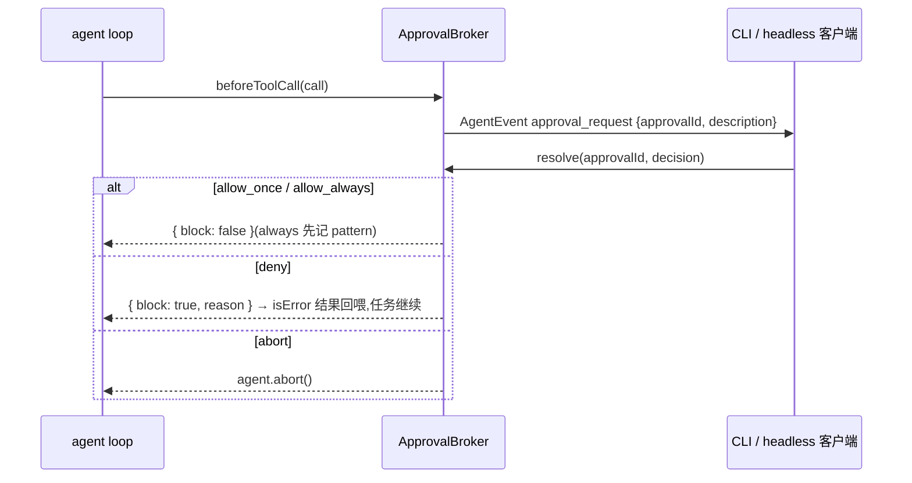

[← 返回地图](./README.md)

# 07 工具集完整规格

本文定义 coda 的工具框架与全部八个内置工具(read / ls / glob / grep / bash / edit / write / plan)的参数 schema、行为规格与实现要点,并给出 M6 的权限/approval 系统设计,以及工具与 steering/abort 的交互契约。工具执行在 agent loop 中的三阶段调度(prepare → execute → finalize)见 [05 Agent 核心](./05-agent-loop.md),本文只写工具侧。

设计路线先说结论:我们走 opencode / pi-mono / gemini-cli 的「专用工具面」路线,而不是 codex 的「极小工具面 + 强 shell」路线。专用工具能做结构化截断、read-before-edit 追踪、按 kind 分级的权限 gate——这些用裸 shell 都做不到;codex 靠 apply_patch 专用语法 + PTY 会话弥补,复杂度远超 v1 需要。

## 1. 工具框架

### 1.1 核心类型(canonical)

```ts
// src/tools/types.ts
export interface ToolDefinition<P = any, D = unknown> {
  name: string; description: string;
  parameters: z.ZodType<P>;                       // z.toJSONSchema() 渲染进 Context.tools
  executionMode?: 'sequential';                   // 声明则整批退化为顺序执行(bash/edit/write 声明)
  promptSnippet?: string;                         // 拼进 system prompt 的使用指引
  execute(call: { id: string; args: P }, ctx: ToolContext): Promise<ToolOutput<D>>;
}
export interface ToolContext { cwd: string; signal: AbortSignal; onUpdate?: (u: { output?: string }) => void; fileTracker: FileTracker }
export interface ToolOutput<D> { content: (TextPart | ImagePart)[]; details?: D; terminate?: boolean }
```

补充字段与配套类型(新增,不改上述 canonical 语义):

```ts
// ToolDefinition 补充可选字段
export interface ToolDefinition<P = any, D = unknown> {
  // ...同上...
  kind?: 'read' | 'search' | 'edit' | 'execute' | 'plan';   // 权限分级用,缺省视为 'execute'
  prepareArguments?: (raw: unknown) => unknown;              // zod 校验前的宽容修补(见 1.4)
}

// src/shared/file-tracker.ts —— read-before-edit 硬约束的载体。
// 宿主在 shared 而非 tools:Agent 实例持有会话级 FileTracker(05 文档第 1 节),
// 而 ESLint zone 只放行 agent → tools/types.ts,类的构造必须落在双方都可见的 shared。
export class FileTracker {
  markRead(path: string, mtimeMs: number): void;             // read 成功、edit/write 成功后登记
  assertFresh(path: string, currentMtimeMs: number):
    | { ok: true }
    | { ok: false; reason: 'never_read' | 'stale' };
}
```

`execute` 的失败语义:**throw 表示失败**,loop 层捕获后转为 `isError: true` 的 ToolResultMessage(错误消息即 throw 的 message,面向模型撰写)。工具内部不自己构造 error 结果——统一由 loop 转换,保证所有错误路径产出形态一致(pi-mono 同款约定)。

### 1.2 zod v4 → JSON Schema 渲染

工具注册时一次性渲染:

```ts
const toolSchemas: ToolSchema[] = tools.map((t) => ({
  name: t.name,
  description: t.description,
  parameters: z.toJSONSchema(t.parameters),
}));
```

约束:参数 schema 只允许 JSON 可表示的 zod 类型(object/string/number/boolean/array/enum/optional),禁用 `z.date`、`z.transform` 等无法渲染的类型;每个字段必须 `.describe()`——这些描述是模型唯一稳定可见的参数文档。strict mode 清洗(`additionalProperties: false`、剥除方言不支持的关键字)不在这里做,是 adapter 的职责(见 [04 Provider adapter](./04-provider-adapter.md)),`protocol` 层的 ToolSchema 保持原始 JSON Schema。

### 1.3 校验失败:回喂而非中断

未知工具名、参数校验失败都**不 throw、不终止 loop**,而是合成 isError 的 ToolResultMessage 回喂模型(opencode `InvalidArgumentsError` 的做法,实测模型一轮内即可自我修正)。文案策略:

- 未知工具:`Unknown tool "X". Available tools: read, ls, glob, grep, bash, edit, write, plan.`
- 校验失败:`The <tool> tool was called with invalid arguments: <detail>. Please rewrite the input so it satisfies the expected schema.` 其中 `<detail>` 用 `z.prettifyError()` 输出的逐字段错误(路径 + 期望类型),**不要**把整个 JSON Schema 倒回去——上下文成本高且模型并不需要。

### 1.4 prepareArguments:校验前宽容,校验后严格

模型会产出结构畸形但意图明确的参数,pi-mono 实测两类高频:edits 数组被发成 JSON 字符串(Opus 4.6、GLM-5.1 均出现过);旧式平铺参数(`oldText/newText` 而非 `edits: [...]`)。`prepareArguments` 在 zod 校验**之前**做无损修补:

```ts
// edit 工具的 prepareArguments 伪码
prepareArguments(raw) {
  if (typeof raw?.edits === 'string') { try { raw.edits = JSON.parse(raw.edits); } catch {} }
  if (!raw?.edits && raw?.oldText !== undefined) {
    raw = { path: raw.path, edits: [{ oldText: raw.oldText, newText: raw.newText, replaceAll: raw.replaceAll }] };
  }
  return raw;
}
```

原则:只做结构搬运,不猜语义;修补后照常走 zod,失败仍按 1.3 回喂。

### 1.5 promptSnippet 拼装

`description` 随 tool schema 每次请求可见,写单工具契约;`promptSnippet` 拼进 system prompt,写**跨工具协作规范**(read-before-edit、避免 `cd`、plan 的使用时机等)。组装规则:systemPrompt 构建时,按工具注册顺序把非空 promptSnippet 收进固定小节:

```
# Tool usage notes
<read 的 snippet>
<bash 的 snippet>
...
```

只包含本次激活的工具的 snippet,避免向模型描述不存在的工具。

### 1.6 统一截断 post-hook(框架级横切)

抄 opencode `Truncate.output` 的完整方案,所有工具输出统一过一遍:

- 双上限 **2000 行 / 50KB(48 * 1024 bytes 级别,谁先命中算谁)**,与 read 的默认读取量一致(pi-mono 与 opencode 使用完全相同的常量,已是事实标准)。
- 超限时**全文落盘**到 `~/.coda/truncated/<sessionId>/<timestamp>-<toolCallId>.txt`,7 天保留、启动时清理。
- 结果尾部附**可执行的续读提示**,精确告诉模型下一步动作,例如:

```
[Output truncated: showing first 2000 of 8214 lines.
Full output saved to: ~/.coda/truncated/s01/17538-call_ab12.txt
Use the read tool with offset=2001 on the original file to continue,
or grep the saved file to search the full content.]
```

- 工具可声明自己已截断(details 带 `truncated: true`)则跳过 post-hook——bash 需要**尾部**截断(错误在末尾),与框架默认的头部截断方向相反,故自带截断逻辑并打标。

所有参考项目里,「截断时告诉模型下一步怎么办」是回报率最高的一条:pi-mono 的每处 truncation 都附 `offset=N` 或落盘路径,显著减少模型来回试错。


## 2. 逐工具规格

### 2.1 read

```ts
const ReadParams = z.object({
  path: z.string().describe('Path to the file to read (absolute, or relative to cwd)'),
  offset: z.number().int().min(1).optional().describe('Line number to start reading from (1-indexed)'),
  limit: z.number().int().min(1).optional().describe('Maximum number of lines to read (default 2000)'),
});
```

行为规格:

- 默认 2000 行 / 50KB / 单行 2000 字符三重上限;流式逐行读取并同时计数行与字节,命中 50KB 即中断上游文件流(opencode 做法,不整读大文件进内存)。
- **行号前缀 `N: text` 必须有**:edit 的 oldText 匹配依赖模型对文件内容的精确记忆,行号显著帮助定位;promptSnippet 里强调「edit 匹配时剥掉行号前缀」(Claude Code 同款提示)。
- 结尾状态三态,**永远告诉模型下一步 offset**:
  - 读完:`(End of file - total 42 lines)`
  - 行数截断:`[Showing lines 1-2000 of 5321. Use offset=2001 to continue.]`
  - 字节截断:`[Output capped at 50KB at line 731. Use offset=732 to continue.]`
- 二进制检测 = 扩展名黑名单 ∪ 4KB 采样(含 NUL 即二进制;不可打印字符占比 > 30% 即二进制),命中报错 `Cannot read binary file: X`。
- 图片(png/jpeg/gif/webp)转 base64 走 `ImagePart` 返回(内部协议 tool result 支持图片;Chat Completions 侧的降级由 adapter 处理,见 04)。
- 文件不存在 → 列同目录下与 basename 互为子串的最多 3 个候选:`File not found: X\n\nDid you mean one of these?\n  src/foo.ts\n  src/foo.test.ts`(opencode 做法,低成本高收益)。
- offset 越界显式报错:`Offset 3000 is out of range for this file (412 lines).`
- **FileTracker 登记**:读取成功后 `fileTracker.markRead(resolvedPath, mtimeMs)`——这是 edit/write 硬约束的数据来源(见 2.6)。

输出示例:

```
1: import { z } from 'zod';
2: 
3: export const config = {
(End of file - total 3 lines)
```

参考对照:opencode `read.ts` 为主参照(行号 / 三态结尾 / 相似名建议 / 流式字节上限齐全);pi-mono 无行号(其 edit fuzzy 更强,我们选行号 + 保守 fuzzy 的组合);gemini-cli 的 20MB 文件上限可作为额外保险。

### 2.2 ls

```ts
const LsParams = z.object({
  path: z.string().optional().describe("Directory to list. Omit for cwd — do NOT pass 'undefined' or 'null'"),
  limit: z.number().int().min(1).optional().describe('Maximum entries to return (default 500)'),
});
```

- `readdir` 按字母序,目录加 `/` 后缀,包含 dotfiles,**不递归**(递归找文件是 glob 的事)。
- 遵守 .gitignore 常见忽略(`node_modules/`、`.git/`、构建产物目录),被忽略的目录仍列出名字但不计入内容遍历。
- 超 limit 截断 + 提示:`(Showing first 500 of 1893 entries. Use glob for targeted listing.)`
- path 不是目录 → `Not a directory: X (did you mean the read tool?)`。
- 参数描述里的 "do NOT pass 'undefined'" 抄 opencode 实战经验:模型真的会填字符串 `"undefined"`。

参考对照:pi-mono `ls.ts` 是最简洁样板,照抄;gemini-cli 的 `respect_git_ignore` 思路吸收为默认行为而非参数。

### 2.3 glob

```ts
const GlobParams = z.object({
  pattern: z.string().describe("Glob pattern, e.g. '**/*.ts' or 'src/**/*.test.ts'"),
  path: z.string().optional().describe("Directory to search. Omit for cwd — do NOT pass 'undefined' or 'null'"),
  limit: z.number().int().min(1).optional().describe('Maximum files to return (default 100)'),
});
```

- 实现走 ripgrep:`rg --files --glob <pattern>`,天然吃 .gitignore、排除隐藏文件(opencode 同款,免去再引 glob 库)。
- **排序规则抄 gemini-cli `sortFileEntries`**:24 小时内修改过的文件按 mtime 新 → 旧排最前,其余按字母序——「找我刚改过的文件」是高频任务,实测有用。
- 0 结果:`No files match pattern "X"`;满 limit:`(Results truncated: showing first 100. Refine the pattern or path.)`

### 2.4 grep

```ts
const GrepParams = z.object({
  pattern: z.string().describe('Regex to search for (ripgrep syntax)'),
  path: z.string().optional().describe('File or directory to search. Omit for cwd'),
  glob: z.string().optional().describe("Filter files, e.g. '*.ts' or '**/*.spec.ts'"),
  ignoreCase: z.boolean().optional().describe('Case-insensitive search'),
  literal: z.boolean().optional().describe('Treat pattern as a fixed string, not regex'),
  context: z.number().int().min(0).optional().describe('Lines of context around each match'),
  limit: z.number().int().min(1).optional().describe('Maximum matches (default 100)'),
});
```

行为规格与实现要点:

- **调 ripgrep 二进制,不自实现**。五个参考项目无一例外依赖 rg,自实现 JS 搜索只出现在 gemini-cli 的三级兜底链末端。我们用 `@vscode/ripgrep` 内嵌平台二进制,免去 pi-mono 式运行时下载。
- spawn 参数:`rg --json --line-number --color=never --hidden --no-require-git --glob '!.git/**' [--ignore-case] [--fixed-strings] [--glob G] pattern path`,用 `--json` 流式解析拿结构化 `path / line_number / lines.text`。`--hidden` 让 dotfiles 可搜,但会连带解除 rg 对 `.git/` 的默认跳过,必须显式排除(opencode 同款处理);`--no-require-git` 让 `.gitignore` 在非 git 目录同样生效(与 glob 一致)。
- **match 数达到 limit 即 kill rg 进程**(pi-mono 做法):大仓库上全量搜完再截断浪费数秒;kill 后结果注明 `(more matches available — refine pattern or path)`。
- context 行不用 rg 的 `-C`(会让 limit 数到 context 行),而是命中后自行读文件切片(带文件缓存),limit 只数 match。
- 单行截到 500 字符;exit code 1 = 无匹配**不是错误**,返回 `No matches found`(空串会让模型困惑);exit code ≥ 2 才是 rg 报错。
- 输出 gnu grep 风格,match 行 `path:line: text`,context 行 `path-line- text`,按文件分组:

```
src/agent/loop.ts:42: const stream = streamFn(model, ctx, { signal });
src/agent/loop.ts-43-   for await (const ev of stream) {
```

参考对照:参数面取 pi-mono 的中间态(opencode 太少、gemini-cli 太多);gemini-cli 的「单 match 自动带 50 行 context」留作 v2 增强。

### 2.5 bash

```ts
const BashParams = z.object({
  command: z.string().describe('The command to execute'),
  timeout: z.number().int().min(1).max(600_000).optional().describe('Timeout in milliseconds (default 120000)'),
  workdir: z.string().optional().describe("Working directory for this command. Use this instead of 'cd'"),
  description: z.string().optional().describe('5-10 word active-voice summary of what this command does'),
});
```

声明 `executionMode: 'sequential'`、`kind: 'execute'`。`description` 字段抄 Claude Code / gemini-cli:让模型给命令写一句人话,approval UI 直接可用。

**不做持久 shell(v1)的理由**:四个参考项目(opencode / pi-mono / gemini-cli / codex 的 shell_command)全部选择每次 spawn 新进程。持久 shell 的隐式状态(cwd 漂移、env 变化、挂着的后台 job)对模型不可见,是幻觉温床;崩溃恢复与 abort 语义都变复杂。codex 是唯一提供持久能力的,但形态是**显式的 PTY 会话对象**(`exec_command` 到 yield_time 未结束返回 session_id,`write_stdin` 续写)——这套语义留作 v2 的交互式/长任务方案,比 gemini-cli 的 `is_background: boolean` 更统一。cwd 需求由 `workdir` 参数满足,promptSnippet 明令 `AVOID cd <dir> && cmd`(opencode 原话)。

行为规格:

- `Bun.spawn([shell, '-c', command], { detached: true, cwd: canonicalize(resolve(ctx.cwd, workdir ?? '.')) })` 建**进程组**;CLI/tool cwd 与 workdir 统一物理化，相对 workdir 不得回退成进程启动目录，也不能在 symlink cwd 下与规则分析分叉。为让规则/审批静态分析与真实 shell 一致，spawn 环境清除会隐式执行脚本或改写 `cd` 查找的 `BASH_ENV` / `CDPATH`。timeout / abort 时调 `killProcessTree`(SIGTERM → 3s 后 SIGKILL 整棵树)。只 kill 直接子进程会漏掉 `bun run dev` 起的孙进程,这是 detached 进程组的全部意义。Bun 负责 spawn 与流式 stdout/stderr；POSIX signal/PGID 收尾属于受控 `process` compatibility 边界。
- stdout + stderr 合并收集进 rolling buffer(只保留 2 × 上限的滚动窗口,防长命令吃内存);**尾部截断**保留末尾 2000 行 / 50KB——命令输出的错误几乎总在尾部,与 read 的头部截断方向相反;超限全文落盘,输出头部注明 `...output truncated...\nFull output saved to: <path>`。details 打 `truncated` 标记跳过框架 post-hook(见 1.6)。
- `onUpdate` 以 100ms 节流推送增量输出(`tool_execution_update` 事件),CLI 据此渲染实时进度——用户看得见卡在哪,才知道该不该 Esc。
- 输出显式带退出状态:末尾附 `exit code N`;非 0 → isError: true 但**仍附完整输出**(模型需要 stderr 判断怎么修)。
- timeout 触发:kill tree 后输出尾附 `Command timed out after 120000 ms and was killed. Retry with a larger timeout value if the command legitimately needs more time.`(opencode 的 `<shell_metadata>` 思路:把「为什么停了、下一步怎么办」讲给模型)。
- abort 触发:kill tree 后输出尾附 `User aborted the command`,isError: true(该结果进转录,模型能理解发生了什么,见 §4)。

### 2.6 edit

```ts
const EditParams = z.object({
  path: z.string().describe('Path to the file to edit'),
  edits: z.array(z.object({
    oldText: z.string().describe('Exact text to replace, as it appears in the file (strip read line-number prefixes)'),
    newText: z.string().describe('Replacement text (must differ from oldText)'),
    replaceAll: z.boolean().optional().describe('Replace all occurrences (default false: oldText must be unique)'),
  })).min(1).describe('All edits are matched against the original file content; edits must not overlap'),
});
```

声明 `executionMode: 'sequential'`、`kind: 'edit'`,配 1.4 的 prepareArguments。选型:old/new 精确替换是 2025-26 的绝对主流(Claude Code / opencode / gemini-cli / pi-mono 全部采用);codex 的 apply_patch 依赖 freeform custom tool + grammar 约束,走普通 function calling 时语法错误率上升,不取;全文重写只作为 write 存在。

**匹配策略:精确优先 + 零风险 fuzzy,明确拒绝编辑距离类。**

1. 精确 `indexOf` 匹配,命中即用。
2. 失败进入**归一化空间**重试(pi-mono 方案):NFKC + 每行 `trimEnd` + 智能引号/Unicode 破折号/特殊空格 → ASCII,在归一化文本上 `indexOf`;命中后**按行 overlay 回原文**——只重写被触及的行,未触碰行保留原始字节。这层只修「模型不可能看见的差异」(不可见字符与行尾空白),零误匹配风险。
3. 到此为止。**不做编辑距离 / 相似度 / 锚点匹配**:aider 的 `replace_closest_edit_distance`(0.8 相似度)被作者刻意用一个裸 `return` 变成死代码——实战验证了相似度匹配会静默改错地方;opencode 的 BlockAnchor(首尾行锚点 + 0.65 行相似度)不得不再配 `isDisproportionateMatch` 防呆,防它把 500 行函数当成 3 行 oldText 的匹配结果吞掉。静默改错的代价远大于让模型重发一次 edit。gemini-cli 式 LLM 自修复留作 v2 可选增强。

不变量与错误文案(全行业公共约定):

- `oldText === newText` → `No changes to apply: oldText and newText are identical.`
- 0 次匹配 → `Could not find the text to replace in X. It must match exactly, including whitespace and indentation. Re-read the file and try again.`
- ≥ 2 次匹配且非 replaceAll → `Found 4 occurrences of the text in X. Provide more surrounding context to make the match unique, or set replaceAll: true.`
- 多 edit 语义抄 pi-mono:**所有 oldText 对原始内容匹配,按 offset 逆序应用,禁止重叠**(重叠报错)。不用「顺序应用」语义——Claude Code 的 MultiEdit 因模型搞不清顺序语义而被移除。

**read-before-edit 硬约束**(Claude Code 是唯一硬约束实现,opencode 只写在 prompt 里没有强制,我们做成硬的):

- `fileTracker.assertFresh(path, mtime)` 返回 `never_read` → `File has not been read in this session. Use the read tool first.`
- 返回 `stale`(磁盘 mtime 比登记值新)→ `File has been modified since it was last read. Re-read it to see the current content.`
- edit/write 成功后自身调 `markRead` 更新登记(自己的写不算外部修改)。实现成本极低,消除「覆盖用户手改」一整类事故。

**BOM/CRLF 三步**(opencode 与 pi-mono 一致,Windows 仓库必做,否则 edit 必挂):剥 BOM + CRLF → LF 归一化;在 LF 空间匹配与替换;按原文件行尾风格还原、写回时补回 BOM。模型永远输出 LF,这层负责双向翻译。

其他要点:同路径写操作经 per-path 串行队列(pi 的 `withFileMutationQueue`,parallel 工具批次下防竞争);成功输出给模型一行确认(`Applied 2 edits to src/foo.ts`),unified diff(npm `diff` 包的 `createTwoFilesPatch`)进 `details` 供 UI 渲染与 additions/deletions 统计——**diff 不回喂模型**,省 token。

### 2.7 write

```ts
const WriteParams = z.object({
  path: z.string().describe('Path to the file to write. Parent directories are created automatically'),
  content: z.string().describe('Full content to write (this replaces the entire file)'),
});
```

声明 `executionMode: 'sequential'`、`kind: 'edit'`。

- 语义 = 新建或**整体覆盖**;自动 `mkdir -p` 父目录。
- **覆盖已有文件同样受 read-before-edit 约束**(fileTracker 校验,文案同 2.6);新文件不受约束。覆盖时保留原文件 BOM 与行尾风格。
- 与 edit 分工由文案引导:write 的 description 写明 "Prefer the edit tool for modifying existing files; use write only for new files or intentional full rewrites"(opencode 用 edit 空 oldString 的报错把模型往 write 引,我们双向都写清楚)。
- 成功输出:`Wrote 120 lines (3.4 KB) to src/new.ts`;`details` 带覆盖前旧内容生成的 diff(approval UI 用)。
- 走同一 per-path 写队列;成功后 `markRead` 登记。

### 2.8 plan

```ts
const PlanParams = z.object({
  steps: z.array(z.object({
    step: z.string().min(1).describe('Short description of this step'),
    status: z.enum(['pending', 'in_progress', 'completed']),
  })).describe('The complete updated plan (full replacement of the previous list)'),
});
```

`kind: 'plan'`。参数结构与 [03 内部协议](./03-internal-protocol.md) 的 `PlanStep` 逐字对应。

**整表替换语义**(opencode todowrite / gemini-cli write_todos / codex update_plan 三家同构,没有增量 add/complete API):模型每次重申完整列表,状态不会漂移;列表随每次 tool result 重新进入上下文,等于模型自维护的 scratchpad——这正是它防长任务跑偏的机制。

行为规范写进 description + promptSnippet(opencode `todowrite.txt` 是最好的范本,整段借鉴):

- ≥ 3 步的任务才用 plan,琐碎任务不开表;
- **至多一个 in_progress(执行中应恰好一个)**(codex 原话 "At most one step can be in_progress at a time"),违反时不报错但输出提醒;
- 开工前把该步标 in_progress,完成**即时**更新,不许批量补记,不许按意图提前标 completed;
- 被阻塞:保持 in_progress,新增一条描述 blocker 的 step。

实现要点:工具本体只回显编号列表(`1. [completed] 定位配置加载代码` …)并把 `{ steps }` 放进 `details`;**`plan_update` 事件由 loop 在 finalize 阶段识别 plan 工具的 details 后发出**——工具不直接依赖 agent 事件总线,保持 `tools → protocol` 的依赖方向。plan mode(只读探索 → 批准 → 动工)不在 v1 范围,但按本项目设计约定预留:它是权限层的模式标志 gate 写工具(工具保留在列表、执行时报错),批准动作 = 注入一条 synthetic user message——与 steering/follow-up 的消息注入机制天然同构。

## 3. 权限 / approval 系统(M6)

### 3.1 架构:beforeToolCall + approval_request 事件 + resolver 注册表

权限不侵入工具本体,整个系统挂在 loop 的 `beforeToolCall` 钩子上([05 Agent 核心](./05-agent-loop.md) 第 1 节的 AgentConfig 已预留)。核心是一个 ApprovalBroker:

```ts
// src/agent/approval.ts
export type ApprovalDecision = 'allow_once' | 'allow_always' | 'deny' | 'abort';

export class ApprovalBroker {
  private pending = new Map<string, (d: ApprovalDecision) => void>();   // resolver 注册表
  private alwaysRules = new Set<string>();                              // allow_always 记忆的 pattern

  request(req: { toolCallId: string; description: string; patterns: string[] }): Promise<ApprovalDecision> {
    // 1. patterns 全部命中 alwaysRules → 直接 resolve('allow_once')
    // 2. 否则生成 approvalId,登记 resolver,emit AgentEvent { type: 'approval_request', approvalId, toolCallId, description }
    // 3. 返回 pending Promise;abort signal 触发时以 'abort' 决议所有 pending(防挂死)
  }
  resolve(approvalId: string, decision: ApprovalDecision): void;        // CLI/headless 客户端回调
}
```



按 `kind` 分级:`read` / `search` / `plan` 默认直通不产生 approval;`edit` 的 description 带 unified diff 摘要(details 里现成);`execute`(bash)带 command + 模型自己写的 description 参数。

### 3.2 决策语义

| 决策 | 语义 |
|---|---|
| `allow_once` | 放行本次调用,不记忆 |
| `allow_always` | 记入 alwaysRules 后放行;泛化规则:edit/write 按路径 pattern(如项目根内整体放行),bash 按 `命令前缀 + " *"`(opencode 的泛化形态) |
| `deny` | `{ block: true, reason }`,合成文案回喂模型:`User denied permission: <reason>. Do not retry the same call; ask the user or take a different approach.` **任务继续**——deny 是引导不是终止 |
| `abort` | 调 `agent.abort()`,按硬中断语义收尾(见 §4) |

四值枚举对齐 gemini-cli 的 `ToolConfirmationOutcome`(ProceedOnce / ProceedAlways / Cancel)并补上 codex 式的 deny-but-continue——gemini-cli 的 Cancel 直接砍掉任务,实践中「拒绝这一步但让它换路走」是更高频的需求。

### 3.3 bash 命令结构解析与 $() 升级

前缀 allowlist 有一个经典穿透:`echo $(rm -rf /)` 的 command root 是 `echo`。gemini-cli 用 tree-sitter-bash 解析后**单独标记 command substitution、反引号、process substitution、重定向、subshell**(`shell-utils.ts:340-380`),opencode 同样用 tree-sitter-bash WASM 逐子命令生成权限 pattern。我们的方案:

- v1 实施保守 token 拆分:尊重引号/转义的扫描器拆分复合命令(`&&` / `;` / `|` / `&`),对每个子命令取 root 做 allowlist 匹配。tree-sitter-bash(WASM)的完整语法解析列为 v2 升级项——保守拆分对「拆不动的结构」一律走强制确认,安全性不降级,只是免审面更窄(可接受的 v1 取舍)。
- **含 `$()`、反引号、`<()`、重定向到系统路径的命令,一律强制升级为需确认,且不允许 allow_always 泛化**——嵌套结构里藏着什么静态分析看不全,只能交给人。
- 危险模式 denylist 先行(`rm -rf /`、`curl … | sh` 等),命中直接 deny 不进 approval。
- 路径约束:workdir 与共享 bash path analyzer 解析出的 literal `cd`、具备目录语义命令的 `-C`、重定向及路径参数 resolve 后落在项目根外 → 单独触发一次 external-directory 确认(opencode 语义)；动态展开、脚本/opaque 命令或未建模的 group/control flow 不可 allow_always。

### 3.4 doom-loop 检测

模型可能反复发出同一个失败调用(deny 后重试、edit 反复匹配失败)。检测规则:`hash = toolName + stableStringify(args)`,**同 hash 连续出现 3 次 → 强制进入 approval(绕过 alwaysRules 与 kind 直通)**,description 注明 `This exact call has been attempted 3 times in a row — possible loop.`。用户可选 deny 给出引导文案,或 abort 收手。计数器在出现任何不同调用时清零,按 session 维护。

## 4. 工具与 steering / abort 的交互

steering 的完整语义在 [06 steering/follow-up](./06-steering-following.md),这里只写工具侧契约。

**signal 贯穿**:每次 run 由 Agent 创建一个 AbortController,同一个 signal 传给 provider 流(StreamOptions.signal)与每个工具(ToolContext.signal)。工具的义务分两档:

- 有子进程/外部资源的工具(bash、grep)**必须主动监听 signal**:bash kill 整棵进程树,grep kill rg;
- 纯 fs 工具(read/edit/write)在关键 `await` 之后检查 `signal.aborted` 即可。特别地,edit/write 的 per-path 写队列**不在 abort 事件回调里 reject,只在每个 await 后检查 signal**(pi-mono 的教训:回调式 reject 会让队列锁的释放时序失控)。

**steering 不打断工具**:steering 消息在 turn 边界注入,当前批次的工具全部跑完。工具侧唯一的配合是 bash 的 onUpdate 流式输出——用户看得到长命令的实时进度,才能判断是继续等、Enter 发 steering,还是 Esc 硬打断。

**被中断工具的结果形态**(abort 发生在工具批次中间时,三种):

1. 已完成的工具:正常 ToolResultMessage,保留在转录。
2. 正在执行被 kill 的工具(典型 bash):部分输出 + 尾附 `User aborted the command`,isError: true——这条结果进转录,模型下次看到时能理解发生了什么。
3. 尚未开始的工具:loop 不执行也**不造结果**,转录留下孤儿 toolCall;下一次出站请求前由 transform 层补合成 `"[Tool execution was interrupted]"` 的 isError 结果——保证 Chat Completions 的 tool_calls/tool 配对永远合法([05 Agent 核心](./05-agent-loop.md) 第 2 节的铁律,机制在 06/04 展开)。

approval 等待中被 abort:ApprovalBroker 把所有 pending resolver 以 `abort` 决议,不留悬挂 Promise。

## 5. 验收清单

框架:

- [ ] 八个工具的 zod schema 经 `z.toJSONSchema()` 渲染无 unrepresentable 报错,每个字段有 description
- [ ] 未知工具名 / 校验失败产出 isError 结果回喂,loop 不中断;文案含逐字段错误
- [ ] prepareArguments 修补「edits 为 JSON 字符串」与「平铺 oldText/newText」两个 fixture
- [ ] 任何工具输出超 2000 行或 50KB:截断 + 落盘 + 尾部续读提示;bash 为尾部截断且跳过框架 post-hook
- [ ] bash/edit/write 声明 executionMode: 'sequential',批内含任一即整批顺序执行

逐工具(fixture 驱动,见 [10 测试策略](./10-testing.md)):

- [ ] read:行号前缀、三态结尾、二进制拒读、图片 ImagePart、相似文件名候选、offset 越界、FileTracker 登记
- [ ] glob:24h recency 排序;grep:limit 到即 kill rg、exit 1 返回 "No matches found"、行截 500 字符
- [ ] bash:timeout kill tree(孙进程也死)、尾部截断落盘、exit code 非 0 带完整输出、abort 附 "User aborted the command"
- [ ] edit:精确/归一化 fuzzy 命中(未触碰行字节不变)、0 次/多次匹配文案、逆序应用与重叠拒绝、CRLF+BOM 仓库往返不变、never_read/stale 两种硬约束报错
- [ ] write:自动建目录、覆盖受 read-before-edit 约束、diff 进 details
- [ ] plan:整表替换、details 触发 plan_update 事件、多个 in_progress 时输出提醒

权限(M6):

- [ ] read/search/plan 直通;deny 回喂后任务继续;allow_always 泛化按 kind 生效
- [ ] `echo $(rm -rf /)` 被升级为强制确认且不可 always 泛化
- [ ] 同参数同工具连续 3 次强制审批;approval 等待中 abort 不留悬挂 Promise

## 相关文档

- [05 Agent 核心](./05-agent-loop.md) —— 工具执行三阶段调度、parallel/sequential、stopReason=length 全批失败
- [06 steering / follow-up](./06-steering-following.md) —— 队列注入点、abort 全链路、转录修复
- [03 内部协议](./03-internal-protocol.md) —— ToolResultMessage、ToolSchema、AgentEvent 定义
- [10 测试策略](./10-testing.md) —— 工具单测 fixture 与 e2e 方案
