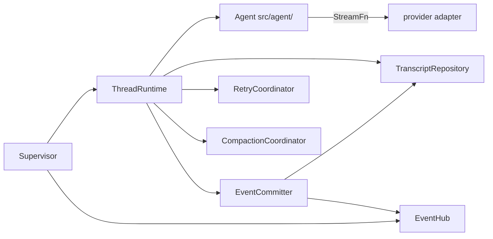
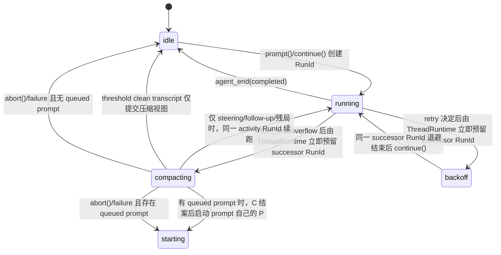

[← 返回地图](./README.md)

# 08 Thread Runtime 与持久化（Transcript / Retry / Compaction / Events / Usage）

本文规定 `ThreadRuntime` 的职责边界、JSONL 存储格式、恢复语义、auto-retry、compaction、事件提交
与 token/成本统计。session 层位于 `src/session/`，是每个 thread 的「运营服务层」：它编排单个
Agent 执行引擎及其协作者；workspace/thread 生命周期与跨线程操作路由由 `Supervisor` 负责。

> **阶段 0 基线说明**：本文件以 [12 Supervisor Runtime](./12-supervisor-runtime.md) 为上位契约。
> “单 active run”只在一个 thread 内成立；不同 thread 可以并发。阶段 0 不改变现有 `Session`
> 行为；阶段 1 保留现有 `Session` API/settlement 实现，由隔离的 legacy driver 供新 Runtime 包装；
> 阶段 2 已把 public `Session` 收窄为由 `StandaloneSessionHost` 组合的单默认 thread facade，并把
> repository、retry、compaction、权威提交与观察者广播拆到下文协作者。

## 1. 职责边界:为什么必须分层

### 1.1 pi 的 3300 行教训

pi-mono 的 `AgentSession` 是本项目最重要的反面教材:一个类 3300+ 行,把会话管理、持久化、上下文压缩、重试、扩展机制全部揉在一起,以致 pi 团队正在用 `packages/agent/harness` 返工重写。根因不是代码风格,而是**职责没有边界**——压缩要改消息数组、重试要控制循环、持久化要监听一切,三者都直接伸手进 agent 内部状态,任何一个需求变化都要动整个类。

我们的对策是把 agent 核心(`src/agent/`)做成**无持久化、无重试、无压缩**的纯执行引擎:它只认 `AgentConfig` 里注入的钩子(`transformContext` / `shouldStopAfterTurn` / `beforeToolCall` 等,见 [05](./05-agent-loop.md)),对外只发 `AgentEvent`。session 层的所有能力都通过这两条通道实现,**绝不新增 agent 内部状态**:

| 能力 | 实现通道 | agent 是否感知 |
|---|---|---|
| 持久化 | `EventCommitter` 接收事件并经 `TranscriptRepository` 权威提交 | 否 |
| 恢复 | 构造 Agent 时注入 `initialMessages`(补充字段,见 3.1) | 只是初始数据 |
| auto-retry | `RetryCoordinator` 监听 run 终态 → 返回分类/退避/重试决策；`ThreadRuntime` 预留 successor run | 否 |
| compaction 触发 | `CompactionCoordinator` 令 `shouldStopAfterTurn` 返回 true | 只知道「该停了」 |
| compaction 生效 | repository fold + `transformContext` 出站时丢前缀、注入摘要 | 否 |
| usage 统计 | repository reducer 对 `message_end`(assistant)累加 | 否 |

opencode 的佐证:V1 的 `SessionProcessor` 把「事件 → 持久化状态」做成独立 reducer、`SessionRetry.policy` 是独立模块、compaction 由 processor 返回 `"compact"` 信号驱动外层——同样是「核心循环只发信号,决策在外层」的结构。codex 也是同构:会话以 rollout 文件(JSONL)追加保存,核心 loop 不做存储。

### 1.2 session 层的六个协作者

`ThreadRuntime` 只做单 thread active-run 门禁与编排，其余五个协作者各自独立可测；阶段 2 以这
六个窄边界取代了巨型 `Session` 的混合职责。其中 EventHub 的**实例所有权是 workspace Runtime 级**，其余
五项按 thread 建立；“拆出六组件”不表示每 thread 各建一个无法看见未来 thread 的 hub：



| 协作者 | 唯一职责 | 不得承担 |
|---|---|---|
| `ThreadRuntime` | 一个 thread 的 mailbox dispatcher、active-run 门禁与协作者编排 | 全局 thread map、UI、具体 provider/tool |
| `TranscriptRepository` | thread journal 的 append/load/fold IO 与 transcript view（含 identity、mailbox、control、compaction、event records） | 分配 seq、决定 op/control/retry、事件广播 |
| `RetryCoordinator` | 错误分类、attempt 状态、可取消退避与重试决策 | 直接改 transcript、分配/持久化 identity 或复用旧 run |
| `CompactionCoordinator` | 阈值/overflow 决策、摘要、合法切点与 active transform view | 拥有 Agent 消息数组或分配/持久化 identity |
| `EventCommitter` | 经 runtime-only awaited authoritative sink 分配 per-thread `seq`，权威提交 transcript/seq/control，产出一个或原子连续的一组 `EventEnvelope` | 注册为 public Agent subscriber 或执行普通 observer 回调 |
| `EventHub` | 每 workspace 一个；汇聚所有 per-thread committer，支持未来 thread filter、cursor、每观察者保序与故障隔离 | 持有 ThreadRuntime/全局执行状态、重新编号、成为事实源或反向背压 Agent |

usage 是从 repository transcript fold 出的纯投影；可保留 `UsageTracker` 作为内部 reducer，但它不
拥有独立事实源或生命周期。Runtime/UI 只消费 workspace `EventHub` 的 envelope；production CLI 的
legacy projector 从指定默认 thread 投影裸 `SessionEvent`，direct exported `Session.subscribe` 则走
standalone host 自己的 private durable cursor pump；该 pump 仅在同批 legacy v1 mirror 完成后推进
`publishedThroughSeq`，因此 canonical-only 的后续 envelope 不会越过兼容投影提前送达观察者。
`RuntimePort.events()` 直接在这个 workspace hub 原子 hot-register；hub 只从有界内存 retention window
按 thread cursor replay，cursor 早于保留下界时显式报 gap，并不拥有或回读 journal。某 thread writer fatal 只终止包含该 thread 的 subscriptions（先
drain，error 带 threadId）；明确排除它的订阅与其他 thread commit 继续。Runtime close 在所有
EventCommitter/in-flight close barrier 后才给 hub 排 end marker。

### 1.3 边界与迁移约束

- 不要求把每个 content part 拆成独立数据库实体；`AgentMessage` 仍是 transcript 的最小事实粒度，
  但 identity、op/mailbox、control、event commit 与 seq high-water 必须可持久恢复。
- 不把 CLI/TUI state 当第二份事实源；server/IDE 与本地 CLI 都通过同一个 `RuntimePort`、mailbox 与
  envelope 契约工作。
- 已返回 accepted 的 op 必须已由 thread journal durable 保存完整 payload/resolved target/run
  reservation/lifecycle；只有 dispatcher ready queue 可作内存缓存。阶段 2 已把阶段 1 writer 的同一
  记录与权威提交语义提取进 `TranscriptRepository` / `EventCommitter`，没有改变 durability 边界。
- 不做 git snapshot / patch 记录(opencode 的 snapshot part)。

## 2. ThreadRuntime 与 Session 兼容面

canonical 外部入口是 `RuntimePort.submit(RuntimeOp)` / `events()`；`Supervisor` 校验
`WorkspaceId/ThreadId/OpId` 并把 op 路由到目标 `ThreadRuntime`。`ThreadRuntime` 的内部端口必须
显式携带 identity，并保证同 thread 至多一个 active run：

```ts
export type ExternalThreadRuntimeOp = Exclude<
  RuntimeOp,
  { type: 'thread_create' | 'thread_resume' | 'cancel_scope' }
>;

export type ThreadRuntimeOp = ExternalThreadRuntimeOp | InternalThreadRuntimeOp;

export interface ThreadRuntime {
  readonly workspaceId: WorkspaceId;
  readonly threadId: ThreadId;
  readonly parentThreadId?: ThreadId;
  accept(op: ExternalThreadRuntimeOp): Promise<OpReceipt>;
  accept(op: InternalThreadRuntimeOp): Promise<InternalOpReceipt>;
  interactionState():
    | 'idle' | 'starting' | 'running' | 'retrying' | 'compacting' | 'suspended' | 'closing' | 'closed';
  usage(): ThreadUsage;
  close(): Promise<void>;
}
```

`prompt/continue/retry/compaction` 每次启动都创建新 `RunId`；retry/compaction successor 通过
`predecessorRunId` 与旧 run 关联，不能复用。run 内每次模型采样创建 `TurnId`，外部命令携带
`OpId` 并按 mailbox 成功接收顺序处理。跨 thread 的执行/commit mutex 彼此独立、无共享
Agent/mailbox/usage；workspace-exclusive Supervisor lease 只防第二个 mutable 路由者与陈旧写入，
不把不同 thread 的运行串行化。
所有外部 RuntimeOp 都先由 Supervisor 的 workspace-wide `SupervisorOpLedger` 保留 ExternalOpId 与
canonical payload hash，再路由到 thread journal；这一步不分配 event seq。internal op 先经共享
workspace keyspace 的 `reserveDerivedOpIdentity` claim，再进目标 mailbox，不能伪装成 public op。
`cancel_scope` root 不进入 ThreadRuntimeOp；其 fan-out 恢复由 external ledger 负责，每个派生取消仍在目标 thread 自己的 journal/seq 中提交（见
[12](./12-supervisor-runtime.md) §3.4）。

以下 `Session` API 是必须保留的兼容 surface；阶段 2 起它是单默认 thread facade：

```ts
// src/session/session.ts
export interface SessionOptions {
  agentConfig: AgentConfig;          // streamFn/model/tools/systemPrompt 由 CLI 组装后传入
  dir?: string;                      // 默认 ~/.coda/sessions
  pricing?: ModelPricing;            // 成本计算,见第 7 节;缺省则 costUSD 不计算
  retry?: RetryOptions;              // M7,见第 5 节;sleep 可注入以确定性测试退避
  compaction?: CompactionOptions;    // M7,见第 6 节
}

export class Session {
  static create(opts: SessionOptions): Promise<Session>;
  static resume(id: string, opts: SessionOptions): Promise<Session>;
  static list(dir?: string): Promise<SessionListItem[]>;   // 读各文件首行 meta + 首条 user 消息作标题

  readonly id: string;

  prompt(text: string): Promise<void>;   // 门面:compaction 期间暂存,其余透传 agent.prompt
  continue(): Promise<void>;             // 仅 idle；恢复残局时经 Session 门面续跑
  steer(text: string): void;             // 透传 agent.steer
  followUp(text: string): void;          // 透传 agent.followUp
  abort(): void;                         // 透传,同时取消退避等待/压缩请求
  interactionState(): 'idle' | 'running' | 'retrying' | 'compacting';
  currentModel(): ModelRef;
  setModel(model: ModelConfig): void;     // 仅 idle；切换下一次采样使用的完整配置
  usage(): SessionUsage;
  waitForIdle(): Promise<void>;          // 等 Agent 与 detached retry/compaction 链共同稳定
  subscribe(listener: (e: SessionEvent) => void | Promise<void>): () => void;
  close(): Promise<void>;                // flush 落盘 + 关闭文件句柄
}

export type SessionEvent =
  | (AgentEvent & { willRetry?: boolean })              // 透传；重试中的 agent_end 带注解
  | { type: 'retry_scheduled'; attempt: number; maxAttempts: number; delayMs: number; errorMessage: string }
  | { type: 'compaction_start'; reason: 'threshold' | 'overflow' }
  | { type: 'compaction_end'; ok: boolean; droppedMessages: number }
  | { type: 'usage_update'; usage: SessionUsage };
```

exported `Session.create/resume` **不**为每个实例调用 `createRuntime()`，也不取得/共享 workspace
`SupervisorLease`。阶段 2 的 internal `StandaloneSessionHost` 必须组装恰好一个 canonical
`ThreadRuntime`，public facade 只经该 runtime 的 mailbox/legacy projection 工作：

- identity 由该 v1 session 的 legacy WorkspaceId/ThreadId 与私有 durable op/run/turn sidecar 提供；
  `SessionOptions.agentConfig/retry/compaction/pricing` 全部是 per-instance attachment config，不进全局
  registry，所以同 cwd、同 session root 下两个不同 session id 可使用不同 streamFn/model/tools 并行；
- host 只对自己的 session backend/sidecar 取得 `StandaloneSessionLease`，不具有 canonical workspace
  ledger/catalog 的写权，也不与另一个 session id 或 Runtime 的 SupervisorLease 竞争。`Session.list()`
  仍是无 lease 只读查询；阶段 2 起同一 backend/session id 被两个 direct `Session.resume` 同时打开则
  稳定 `session_in_use`，这是为保持“每 thread 单 writer/active run”列明的安全收紧；
- 每个 standalone host 拥有一个只服务该 Session 的 private EventHub/cursor pump；“每 workspace 一个
  EventHub”只约束 canonical Runtime。private hub 不汇聚同 cwd 的其他 standalone Session，也不产生
  RuntimePort/跨 thread 语义；Session close 只关闭自身 hub/ThreadRuntime/sidecar lease；
- Runtime/CLI composition 的 approval 不得退回 ApprovalBroker 旁路：它使用 Runtime-owned、fence-bound
  `LegacyApprovalPatternRepositoryPort`，request/response、first-wins、pattern-before-control 与 crash
  recovery 都走 EventCommitter control 状态机。
- exported direct `Session` 是兼容例外。其既有 `AgentConfig.beforeToolCall` 是任意 opaque callback，public
  API 又没有 control-response ingress；host 无法可靠识别其中是否使用 `ApprovalBroker`，也拿不到
  patterns、decision 或 resolver。因此 direct Session 中由调用方放进该 callback 的 broker/policy gate
  保持 caller-owned、process-local，不伪造 `control_request`、pending control 或 durable receipt；崩溃
  恢复只中断旧 activity，不能恢复一个不可观察的审批等待。若未来增加显式 structured approval adapter
  与 response API，可由调用方 opt in durable control，但阶段 2 不改变现有 public API 或 callback 行为。

direct Session 与 canonical Runtime 同时写同一个 claimed v1 backend 仍按 [12 §11.1](./12-supervisor-runtime.md)
明确 unsupported：fingerprint mismatch 后 Runtime quarantine/重建私有 mirror，不能用上述 standalone
composition 绕开。这样保留“两份独立 direct Session 并行”，而不伪造一个能容纳不同 per-instance config
的进程全局 shared Runtime。

legacy `Session` 把这些调用转换成目标默认 thread 的身份化 op，并把 envelope 投影为既有
`SessionEvent`。`prompt/steer/followUp` 的双队列语义与注入点仍见
[06](./06-steering-following.md)；canonical mailbox 属于 thread，不在 facade 中复制。

兼容还包括方法 settle/throw 边界：

- 阶段 1 旧 `Session` 类的兼容 settle 边界继续保留：`prompt()/continue()` 在它们启动的首个 Agent
  run boundary resolve；detached retry/compaction 继续由 `waitForIdle()` 等待。canonical driver 的
  完整因果链 completion 是内部 Runtime 契约，不得泄漏来延迟旧 promise。
- 阶段 2 facade 的 `prompt()/continue()` 先经 mailbox admission，再只等待 receipt 中 root RunId 的
  首个 `agent_end` 权威提交；`waitForIdle()` 才等待该 thread 所有 causal successor/coordinator 收束。
- `steer()/followUp()/abort()/setModel()` 保持同步 void/同步 guard。阶段 2 facade 使用 ThreadRuntime
  的同步 legacy admission shim：只做本地 closed/state 校验并把 identity-bearing op 放入同一 mailbox，
  不直接执行或绕过事实链；后续 durable 失败走 error event。不得把这些方法改成 Promise，也不得
  吞掉原有同步 throw。
- `setModel(ModelConfig)` 走一个仅供同包 facade 使用的 trusted resolved-model admission：同步验证
  `model.ref` 与生成的 canonical `set_model.model` 逐字段相等，以该 OpId 注册不落盘的完整
  `ModelConfig`，再按同一 FIFO/EventCommitter 路径提交且只持久化 `ModelRef`。该 admission 一旦通过，
  `currentModel()` 与紧随其后的 `prompt()` 必须立即看到这份精确 config；异步持久化失败时 thread
  fail closed/发 error 并停止采样，不能静默回滚成旧模型或再调用 resolver 得到另一份配置。重启后
  该秘密 sidecar 不恢复，仍只能由显式 `thread_resume`/新的 setModel 调用提供。public
  `RuntimePort.submit({type:'set_model'})` 不开放此 sidecar，始终通过 `RuntimeModelResolver`。
- `Session.subscribe()` 的 payload/相对顺序保持；阶段 2 改为 private journal-backed 异步 observer，
  listener 延迟不再延迟 run/`waitForIdle()`。这是 observer 规则要求的唯一刻意 timing 变化；close
  仍等待 run/权威提交，但不等待普通 listener drain。由于 legacy API 无 gap/error channel，facade
  使用 per-listener durable cursor-backed pump；standalone canonical sidecar 在 Session 存活期 append-only，
  因而完整历史本身就是 cursor 的 retention floor，不另建可遗忘的内存 pin。wake-up 不携带 payload，
  backlog 始终从 sidecar fold 补读，不能静默 disconnect。unsubscribe/close 释放 cursor；listener reject
  只诊断、推进该 listener 对本次 event 的 cursor 并继续投递后续事件，保持当前 Emitter 的“异常不自动
  退订”行为。

`interactionState()` 是模型/provider 管理命令的权威门禁。retry backoff 与 compaction 中 Agent
可能短暂报告 idle，Session 必须继续分别报告 `retrying` / `compacting`；只有四层状态都落到
`idle` 才允许 `setModel()`。切换同时更新 Agent 与 Session 持有的完整 `ModelConfig`，并重置
旧模型的 retry/overflow 计数，但绝不清空或重写 transcript。

同理，retry backoff 中 `prompt()` 必须拒绝第二个任务，调用方改用 `steer()` / `followUp()`；
`waitForIdle()` 必须循环等待可能被续接的 detached op 与其启动的 Agent run，直到
`interactionState()` 确认回到 `idle`，不能只观察 Agent 的瞬时状态；即使在 detached op
交接期间关闭 Session，也必须经过同一清理路径复位交互状态。

runtime 创建可用 thread 前始终要求真实 `ModelConfig`。允许“没有模型”的冷启动是 CLI 前端适配
状态：它在有效的最近显式选择恢复或 `/model` 成功前不提交 `thread_create/thread_resume`，因此
不会产生空 JSONL、占位 meta 或伪造 `ModelRef`。

## 3. JSONL 存储格式

### 3.1 记录类型

一个 thread = 一个追加式 JSONL journal；物理文件名是实现细节，消费者只能用 `ThreadId` 定位。
阶段 2 的 canonical 记录至少能表达：

```ts
export interface ThreadMetaRecord {
  type: 'thread_meta';
  version: 2;
  protocolVersion: string;
  workspaceId: WorkspaceId;
  threadId: ThreadId;
  parentThreadId?: ThreadId;
  createdByRunId?: RunId;
  createdByOpId?: ExternalOpId;
  permissionCeiling: PermissionCeilingSnapshot;
  createdAt: number;
  cwd: string;
  model: ModelRef;
  driverRef?: ThreadDriverRef; // 阶段 1 legacy backend 映射；不得包含秘密或任意路径
}

export interface LegacyThreadSeedRecord {
  type: 'legacy_seed';
  sourceSessionId: string;
  transcript: readonly AgentMessage[];
  usage: ThreadUsage;
  compaction?: {
    id: string; timestamp: number; tailStartId: string; summary: string;
    contextTokensBefore?: number;
  };
}

export interface MailboxPrepareRecord {
  type: 'mailbox_prepare';
  opId: OpId;
  op: MailboxRuntimeOp;
  timestamp: number;
}

export type IdentityPrepareRecord =
  | { type: 'successor_run_prepare'; runId: RunId; predecessorRunId: RunId;
      reason: 'retry' | 'compaction'; permissionCeiling: PermissionCeilingSnapshot;
      timestamp: number }
  | { type: 'turn_prepare'; runId: RunId; turnId: TurnId; turnOrdinal: number;
      workspaceCeiling: PermissionCeilingSnapshot;
      runCeiling: PermissionCeilingSnapshot;
      turnCeiling: PermissionCeilingSnapshot;
      timestamp: number };

// canonical internal type 见 12 §5.1；这里存它的 JSON 形态。
export type ResolvedAbortTarget =
  | { kind: 'run'; runId: RunId }
  | { kind: 'suspended'; ownerOpId: OpId; terminalRunId: RunId;
      inputOwnerOpId?: OpId }
  | { kind: 'no_current_activity' };

export type MailboxMutation =
  | { type: 'accepted_pending'; opId: OpId;
      opType: Exclude<MailboxRuntimeOp['type'], 'abort'> }
  | { type: 'accepted_pending'; opId: OpId; opType: 'abort';
      resolvedTarget: ResolvedAbortTarget; parentOpId?: ExternalOpId }
  | { type: 'started'; opId: OpId }
  | { type: 'completed'; opId: OpId;
      outcome: 'applied' | 'no_op' | 'interrupted' | 'superseded' }
  | { type: 'rejected'; opId: OpId; reason: string };

export type InputOwnershipMutation =
  | { type: 'input_materialized'; ownerOpId: OpId; messageId: string }
  | { type: 'input_transferred'; fromOpId: OpId; toOpId: OpId }
  | { type: 'input_cancelled'; ownerOpId: OpId; byAbortOpId: OpId };

export type TranscriptMutation =
  | { type: 'message_appended'; message: AgentMessage }
  | { type: 'compaction_committed'; compaction: {
      id: string; timestamp: number; tailStartId: string; summary: string;
      contextTokensBefore?: number } };

export type ControlMutation =
  | { type: 'control_requested';
      request: Extract<RuntimeControlEvent, { type: 'control_request' }> }
  | { type: 'control_response_claimed'; requestId: string;
      responseOpId: ExternalOpId; decision: ControlResponseDecision; acceptedAt: number }
  | { type: 'control_response_claim_released'; requestId: string;
      responseOpId: ExternalOpId; reason: 'effect_definitely_not_applied' }
  | { type: 'control_resolved';
      resolution: Extract<RuntimeControlEvent, { type: 'control_resolved' }> };

export interface PendingControlRecord {
  readonly threadId: ThreadId;
  readonly requestId: string;
  readonly kind: 'approval' | 'resource_confirmation';
  readonly owningRunId: RunId;
  readonly owningTurnId: TurnId;
  readonly policyRevision: string;
  readonly payload: Readonly<ApprovalControlPayload | ResourceConfirmationPayload>;
  readonly responseClaim?: {
    readonly responseOpId: ExternalOpId;
    readonly decision: ControlResponseDecision;
    readonly acceptedAt: number;
  };
  // approval payload 的 legacyProposal/grantProposal 二者至多一个；存在时都完整 frozen 持久化，
  // grantProposal 还包含 capability id/version、registrationDigest、policyBasisRevision 与 scope。
}

export type RunMutation =
  | { type: 'run_reserved'; runId: RunId; ownerOpId: OpId; reason: 'prompt';
      permissionCeiling: PermissionCeilingSnapshot }
  | { type: 'run_reserved'; runId: RunId; ownerOpId: OpId; reason: 'continue';
      predecessorRunId?: RunId; permissionCeiling: PermissionCeilingSnapshot }
  | { type: 'run_reserved'; runId: RunId; predecessorRunId: RunId;
      reason: 'retry' | 'compaction'; permissionCeiling: PermissionCeilingSnapshot }
  | { type: 'run_started'; runId: RunId }
  | { type: 'run_terminal'; runId: RunId;
      status: 'completed' | 'aborted' | 'error' | 'interrupted' };

export type TurnMutation =
  | { type: 'turn_activated'; runId: RunId; turnId: TurnId; turnOrdinal: number };

export interface ActivityRecoveryMutation {
  type: 'activity_interrupted';
  rootOpId: OpId;
  rootRunId: RunId;
  terminalRunId: RunId;
  terminalTurnId?: TurnId;
  discardedPartialAssistantId?: string;
  discardedStartedToolCallIds: readonly string[];
}

export interface ModelSelectionMutation {
  type: 'model_selected';
  ownerOpId: OpId;
  model: ModelRef;
}

export interface RuleScopeMutation {
  type: 'rule_scope_observed';
  scope: string; // dangling-aware canonical resource scope
  owningTurnId: TurnId;
  invocationId: string;
}

export interface ThreadResultOutboxMutation {
  type: 'thread_result_pending';
  resultOpId: DerivedOpId;
  parentThreadId: ThreadId;
  childThreadId: ThreadId;
  terminalRunId: RunId;
  status: 'completed' | 'aborted' | 'error';
  summary?: string;
}

export interface ThreadResultDeliveryRecord {
  type: 'thread_result_delivered';
  resultOpId: DerivedOpId;
  parentThreadId: ThreadId;
  parentCommitSeq: number;
}

export interface ThreadCommitRecord {
  type: 'commit';
  firstSeq: number;
  envelopes: readonly [EventEnvelope, ...EventEnvelope[]];
  mutations?: readonly (
    | TranscriptMutation
    | MailboxMutation
    | InputOwnershipMutation
    | ThreadResultOutboxMutation
    | ControlMutation
    | RunMutation
    | TurnMutation
    | ActivityRecoveryMutation
    | RuleScopeMutation
    | ModelSelectionMutation
  )[];
}

export type ThreadRecord =
  | ThreadMetaRecord
  | LegacyThreadSeedRecord
  | MailboxPrepareRecord
  | IdentityPrepareRecord
  | ThreadResultDeliveryRecord
  | ThreadCommitRecord;
```

首次导入 v1 时，storage 的 journal-create 边界必须把 `ThreadMetaRecord` 与唯一、已验证的
`LegacyThreadSeedRecord` 作为同一个 immutable initial prefix，以 exclusive create + flush 原子写入；
重复调用逐字段核对该 prefix。不得先只落 meta 再补 seed，也不得仅凭
`ThreadDriverRef.kind === 'session-v1'` 推断 provenance：Runtime 自己新建的 legacy adapter attachment
也使用同一 opaque ref kind，但不拥有 legacy seed。

EventCommitter 先写 `mailbox_prepare`（尚未对调用方承诺），验证通过后在一个
`ThreadCommitRecord` 中原子写 `MailboxMutation(accepted_pending)` 与 `op_accepted` envelope；对
`prompt/continue`，同一 commit 还必须写 `RunMutation(reserved)`，把 admission state 置为
`starting` 并把 reserved RunId 追加到 `pendingRunIds`；唯一例外是已有 active compaction RunId 时，
状态保持 `compacting`，只追加 prompt reservation。对 `abort`，accepted mutation 必须写入接收时
解析出的 `ResolvedAbortTarget`（包括显式的 `no_current_activity`），不能只保留
`expectedRunId: undefined` 的原始 op 并在恢复/出队时重新读取 current run。只有
这条 commit durable 后 `submit()` 才能返回 accepted receipt，dispatcher 也只有此后才能执行它。
**禁止先启动 run、resolve control waiter 或触发外部副作用，再补写 accepted。**dispatcher 领取操作时
提交 `started`；纯状态操作可把 `accepted_pending → completed` 与 queue/model/control mutation 合并在
一个 commit 中，但该 record 必须按顺序携带 `op_accepted`、`op_completed` 两个 envelope。run/tool/provider
等外部副作用开始前必须已有 durable `op_started` envelope/RunMutation，结束后再提交 `op_completed`
或终态。

`envelopes` 永远非空，`envelopes[0].seq === firstSeq`，其后 seq 在 record 内逐一 `+1`；同一 record
的 identity 必须都归属该 thread。这样一次原子状态转移可以产生多个 canonical lifecycle 事件，又
不会制造 mutation-only 的隐藏 seq。EventHub 只在整条 record durable 后按数组顺序发布全部 envelope。
`control_requested/control_resolved` mutation 必须与同 record 的同 requestId control envelope 逐字段
一致；pending-control fold 产出的 `PendingControlRecord` 因而自带 owning run/turn、kind、完整
payload 与至多一个 response claim，不能只存 requestId 或在 response/recovery 时重读 mutable policy。
全历史 `control_requested`（包括已 resolved/aborted 的 request）同时构成永久 `usedRequestIds`；pending
fold 不能代替它，close/recovery 后也不得回收，否则 raw id suffix 会碰撞旧审计事实。
pending kind、decision 以及当前 grant mode/proposal 的合法性必须在 accepted/claim 前于同一 transaction
校验；`invalid_decision` 只写 rejected receipt/op_rejected，不写 response claim/op_accepted/started，
request 仍 pending。合法 `control_response` 的 accepted commit 必须原子写 mailbox accepted/op_accepted 与
`control_response_claimed`；commit 时 request 必须仍 pending 且无其他 claim。第二个 ExternalOpId
稳定 rejected 为 `control_response_already_claimed`；同 OpId duplicate 只由 workspace/thread op ledger
返回原 receipt。effect 写入前发生且 repository 明确保证未 reserve/未写入的 recoverable failure 时，
response 的 interrupted terminal commit
必须同时写 `control_response_claim_released`，且只在当前 claim 的 responseOpId 相等时生效；请求保持
pending，后续新 OpId 才能重试。conflict 表示同 receipt key 已存在不同 durable payload，可能已有 policy
effect，必须保留 claim 并 quarantine/degrade，不能释放后叠加另一授权。`allow_always` grant 的
acceptedAt 逐字段取对应 control_response `op_accepted` envelope 的 durable timestamp，不能在 retry/
recovery 时重新调用 clock。成功 compaction 的
`compaction_committed` mutation 必须和 `compaction_end{ok:true}` envelope 同 record 提交；恢复只从
该 mutation 的 `{tailStartId, summary}` 重建出站上下文，不能从可能超前的 v1 镜像补读。

`rule_scope_observed` 与发现缺 scope 后合成的 recoverable tool-result/event 在同一 commit 中落盘；
mutation 的 scope 只能逐项取 `RuleFreshnessResult{code:'rule_scope_missing'}.missingScopes`，该列表已
strict-copy、非空、去重并按 UTF-8 排序；ThreadRuntime 不从 ResolvedCapabilityResource.canonicalTarget
反推规则 scope。repository fold 按 canonical scope 去重，和 thread cwd/root 初始 scope 一起成为下一 turn
RuleSnapshotProvider 的 `knownResourceScopes`（UTF-8 排序）。它不在当前 turn 加载/替换规则，也不因
crash/resume 丢失；同 invocation 重放 mutation 是幂等的。

`successor_run_prepare/turn_prepare` 与 `mailbox_prepare` 一样是**事件提交前的 durable reservation**，
本身不分配 seq、也不是普通观察者可见状态。successor prepare 立即参与 admission/abort；它在随后
提交 predecessor end/coordinator envelope 的同一 commit 变成 `run_reserved`，crash 前未激活则恢复为
interrupted、绝不自动采样。turn prepare 必须发生在 initial poll/turn-boundary drain 前；第一个属于
该 turn 的 queue_update（若有）或 turn_start commit 同时写 `turn_activated`，之后整 turn 复用该 ID。
turn_prepare 还持久化 host 对 bound/current run CAS 后得到的 turnOrdinal 与同一 PermissionPolicyPort
产出的 workspace/run/turn ceilings；同 key retry 必须读回逐字段相同值，`turn_activated` 的 ordinal/id
必须匹配。successor key `(predecessorRunId,reason)` 同样把 runId/permissionCeiling 固定在 prepare；
同 key retry 不重调 factory/policy，同 predecessor 的不同 reason/fork 是
`invalid_successor_reservation` fatal。journal 永久 fold used RunId/TurnId；不同 reservation key 命中
旧 ID 是 `identity_collision` fatal，不能循环猜新 ID。crash 留下未激活 turn prepare 时直接丢弃，
因为队列/transcript 尚无 committed mutation。这样 identity
可以在副作用前稳定，又不制造没有 envelope 的隐藏 seq。

`thread_result_delivered` 是另一种不分配 seq 的 durable acknowledgement，不是 RuntimeOp 或
RuntimeEvent，不能塞进 `SupervisorOpLedgerRecord`。child 的 activity 终态路径在 driver completion
返回后，把 root `op_completed`、`run_terminal` 与 `thread_result_pending` 放入同一个有 envelope 的
atomic commit；这里的“terminal commit”指这次 driver-completion commit，不要求和较早的 agent event
commit 是同一条记录。投递器随后按 resultOpId 让 parent journal 幂等提交 `thread_result` 并取得
`parentCommitSeq`，再经 child 自己的单 writer append+flush 上述 delivery record。任何时刻都不得同时
在一个 writer critical section 内嵌套 await 另一 thread writer，也不做双 journal 原子事务：先完成
parent commit 并释放它的 commit mutex，再排队 child ack；同一 Runtime 长期持有各独立 thread lease
本身合法。若两步之间 crash，child
仍是 pending，恢复后重投由 parent 的 resultOpId ledger 返回同一 seq，再补 child ack；若 ack 已存在
则不重投。Supervisor 启动时扫描 catalog 中各 child journal，fold pending-delivered 差集主动恢复，
不等待 parent/客户重发 op。无 attached child 时用短期 child lease append ack；已 attached 时必须走
该 child 的同一 writer，禁止第二写者。

`legacy_seed` 只允许在首次验证 v1 文件的 attach barrier 写一次；它是 transcript/usage/compaction
checkpoint seed，不是历史事件，不能含 envelope 或推进 seq。后续 canonical commit 只引用 seed 的
projection，永远不再回读 v1 镜像覆盖它。

`model_selected` 是 current model 的唯一可变事实：create/legacy seed 写初始 ModelRef，resume 在
resolver 成功的 lifecycle commit、set_model 在 applied commit 中更新；失败不写。ModelConfig 的
apiKey/headers 永不进入 record，snapshot.model 只从最后 committed mutation（无则 meta/seed）fold。

prompt 文本的 durable owner 从 accepted 起就是 mailbox op，而不是尚未落盘的 Agent 内存消息。
`op_started` 不删除该 payload；只有 user `message_end` 与对应 transcript mutation 提交时，
`InputOwnershipMutation(input_materialized, messageId)` 才标记它已进入 transcript。若 crash 落在 started 与
该 message_end 之间，恢复只转移这份**尚未 materialized 的纯输入**给显式 successor，不重放旧 run、
provider 或工具副作用；若 marker 已存在则绝不重复注入。

因此任何已经返回的 accepted op 都已被 durable claim，状态机为
`prepared → accepted_pending → started → completed`（拒绝/中断为终态旁支）。崩溃只留下
`prepared` 时恢复为 `rejected(interrupted_before_accept)`，绝不假装曾被接收，也不阻塞后续 FIFO；
`accepted_pending` 则按 §4.1 恢复，不能被重复 OpId 永久孤儿化。重复 `OpId` 通过折叠 journal 返回
同一 receipt，不重复 mutation/副作用。`EventCommitter` 在唯一权威提交点分配连续 seq，并让 envelope
batch 与对应 transcript/control/run mutation 成为同一个 `ThreadCommitRecord`，成功后才交给
`EventHub`。恢复时最后一条合法 commit 的最后一个 envelope.seq 就是 high-water mark，新事件从
`seq + 1` 继续，绝不按进程重启归零。

子 thread 的任务终态与 `ThreadResultOutboxMutation` 在同一个 commit 中落盘。父 thread 未 attach 时
它继续 pending；Supervisor 可从全部 child journal fold 重建 outbox 索引。投递父 journal 时以
`resultOpId` 去重并提交 `thread_result` envelope，成功后再经 child 的唯一 writer append+flush
`ThreadResultDeliveryRecord`（不分配 child seq、绝不进入 SupervisorOpLedger，且不嵌套两边 commit
mutex）；若两步间 crash，重投只返回父 journal 的既有 seq/event，再补 ack，不产生第二份通知。
recovery 的 `activity_interrupted` 对 child 映射为 public `status:'error'`，并在同一 recovery commit
写稳定 resultOpId 的 pending outbox；不得因内部多了 interrupted run 状态就让父永远等不到结果。

同一 workspace 同时只允许一个持有 fencing token 的 mutable Supervisor；第二个 Runtime 必须在读取
recovery state/接受 op 前以 `workspace_in_use` 拒绝。每个 `ThreadId` 仍取得绑定同一 SupervisorLease
的 write lease，作为 defense-in-depth，不能出现两个 EventCommitter 各自分配 seq；旧 fencing token
的 append 即使旧进程迟到也必须失败。只读审计/catalog 可并发，但不构造 mutable Runtime。
mailbox、pending control、run predecessor、compaction 与 transcript 都在同一 thread 存储边界内 fold。

#### v1 Session JSONL 兼容格式

现有一个 session = 一个追加式 JSONL 文件，路径 `~/.coda/sessions/<id>.jsonl`，文件由下列三种
记录组成，每条一行：

```ts
// src/session/store.ts
export interface MetaRecord {
  type: 'meta'; version: 1;    // 存储格式版本:JSONL 记录结构本身的版本
  protocolVersion: string;     // semver,AgentEvent/AgentMessage 协议版本(见 03 §9.2 协议演进)
  id: string; createdAt: number;
  cwd: string;                 // 创建会话时的工作目录；阶段 0 全局 picker 不按 cwd 过滤
  model: ModelRef;
}
export interface MessageRecord { type: 'message'; message: AgentMessage }
export interface CompactionRecord {
  type: 'compaction'; id: string; timestamp: number;
  tailStartId: string;         // 保留尾部的第一条消息 id(opencode 同款 tail_start_id)
  summary: string;             // LLM 摘要全文
  contextTokensBefore?: number;
}
export type SessionRecord = MetaRecord | MessageRecord | CompactionRecord;
```

v1 文件必须继续可读且不原地破坏性重写。首次映射时用 [12](./12-supervisor-runtime.md) §2.1 冻结的
domain-separated SHA-256 函数，以 `MetaRecord.cwd` 的已记录字节生成 legacy `WorkspaceId`，再以
workspaceId + session id 生成 `legacyThreadId`；不得读取恢复
时当前 cwd 后重新归属。原 v1 meta、message 与 compaction 字节仍是审计事实，不伪造从未持久化的
历史运行事件。导入只 seed transcript/usage/最后一条有效 compaction checkpoint，event high-water
固定从 0 开始；第一条真实 lifecycle/recovery canonical commit 使用 seq 1。v1 记录缺少合法
run/turn/op identity，任何迁移器都不得为它们补造历史 envelope 或预占 seq。

identity 映射与可执行性分层：只读 catalog/审计对任意 well-formed raw `MetaRecord.cwd`（包括 empty、
relative 与 NUL）仍计算稳定 legacy ID；lone surrogate 只能 quarantine，不能经 UTF-8 replacement hash。
mutable import/resume 则要求 cwd 在**当前 host**上是 non-empty、无 NUL 的 absolute path；Runtime 不用
`process.cwd()` 补全，也不 realpath/normalize。失败项仍由 `StoredThreadLocator` 以
`executionEligibility:{kind:'read_only',code:'invalid_legacy_workspace_cwd'}` 展示并产生 diagnostic，
不得取得 lease、创建 canonical storage、attach driver 或执行 provider/tool。异主机 Windows/Unix 路径
同样按当前 host 判定，不偷偷转换语法；adapter/runtime 在 mutable import 时必须再次验证，不能只信索引。

`MetaRecord.model` 记录**创建会话时**的模型，是审计元数据而不是可变的当前配置。运行中
`setModel()` 不回写首行，也不改历史 assistant；每条 `AssistantMessage.model` 已记录实际采样
所用的完整 `ModelRef`，这是跨模型历史的权威事实。恢复时由 CLI 的当前显式选择提供新的
`ModelConfig`，旧转录原样注入，后续 assistant 再记录新选择。

补充字段声明(相对本项目既有设计约定的新增,不改任何既有语义):

- `AgentConfig.initialMessages?: AgentMessage[]` —— 恢复会话时的初始转录;
- `AssistantMessage.errorDetails?: ProviderErrorDetails` —— adapter 填写的结构化错误(见 5.1);
- `agent_end` 事件透传时 session 可注解 `willRetry?: boolean`(见 5.3)。

### 3.2 v1 格式示例

```jsonl
{"type":"meta","version":1,"protocolVersion":"1.0.0","id":"20260726-153012-a1b2","createdAt":1753515012000,"cwd":"/Users/zp/proj","model":{"provider":"openai","api":"openai-chat","model":"gpt-5.2"}}
{"type":"message","message":{"role":"user","id":"msg_01","timestamp":1753515013000,"source":"prompt","content":[{"type":"text","text":"把 utils.ts 里的重复代码抽成函数"}]}}
{"type":"message","message":{"role":"assistant","id":"msg_02","timestamp":1753515016000,"model":{"provider":"openai","api":"openai-chat","model":"gpt-5.2"},"stopReason":"tool_calls","usage":{"input":2310,"output":95},"content":[{"type":"text","text":"先看一下文件。"},{"type":"tool_call","id":"call_a","name":"read","arguments":{"path":"src/utils.ts"}}]}}
{"type":"message","message":{"role":"tool_result","id":"msg_03","timestamp":1753515016400,"toolCallId":"call_a","toolName":"read","isError":false,"content":[{"type":"text","text":"1: export function ..."}]}}
{"type":"compaction","id":"cmp_01","timestamp":1753518800000,"tailStartId":"msg_41","summary":"任务:重构 utils.ts……已完成:……未完成:……关键文件:……"}
```

要点:

- **一行一条 AgentMessage,原样序列化**。`ToolResultMessage.details`(如 edit 的 diff)也随行落盘——它不发给模型但恢复后 UI 要用;若 details 不可 JSON 序列化,落盘时置 undefined 并告警,不得让写盘失败。
- **compaction 记录只追加、不改写历史**。文件永远保留全量转录(审计/调试价值),活动上下文的裁剪在加载和出站时计算(见 4.1、6.2)。这是「存储 append-only、视图靠折叠」——opencode V2 event-sourcing 的极简版。
- meta 不回写。会话标题在 `list()` 时取首条 user 消息截断 80 字符,避免任何「改写文件中部」的操作。

### 3.3 追加纪律、事件提交与崩溃容忍

- 写入时机：每个 `message_end` 通过 `EventCommitter` 与 message mutation 一起提交。legacy v1
  facade 仍表现为追加一条 MessageRecord。**不是** `agent_end` 时批量写——agent 中途崩溃也要能
  恢复到最后一条完整消息。
- 流式期间不把 partial assistant 写成 transcript mutation：只有 `message_end` 才追加终态消息。
  但每个 `message_update` envelope 本身仍作为 commit record 持久化，才能支持按 seq cursor 无缝重放；
  崩溃后可能没有对应终态 message，转录仍合法，事件订阅者则可重放已提交的 partial/delta。
- 落盘确定性：只有独立 runtime-only `authoritativeEventSink` 调用的 `EventCommitter` 权威 append/flush
  可以背压 Agent；committer 绝不能注册到会 catch listener rejection 的 public Agent Emitter。普通 UI/headless/telemetry
  observer 由 `EventHub` 独立异步入队，变慢或失败不得拖慢 provider、工具或其他 thread。直接
  `Agent.subscribe` 仍保留阶段 0 awaited Emitter 语义；阶段 2 的 `Session.subscribe` 已改由 private
  journal-backed cursor pump 异步投递。`ThreadRuntime.close()` 必须等待 active run 与权威提交；各前端在关闭订阅后自行
  等待输出泵 drain，不能把 UI drain 重新塞回 core 提交链。
- legacy tool `onUpdate` 的 fire-and-forget emit 若遇到 `tool_execution_update` commit reject，sink 必须
  latch writer fatal 并 abort run/tool child signal；每个后续 awaited emit、provider/tool 启动与
  side-effect gate 都先观察该 latch。普通 subscriber reject 只诊断，绝不触发 writer-fatal latch。
- 崩溃截断:进程在写半行时被杀,文件尾部会出现不完整 JSON。加载时**最后一行 parse 失败则静默丢弃**;非最后一行损坏则拒绝加载并报错(文件真的坏了,不能装作没事)。
- fsync 策略必须满足两条可观察承诺：accepted mailbox op 在回执前已经 durable，已发布 envelope 的
  seq high-water 可恢复。可以批量/分组 fsync，但不能先向调用方确认或发布再赌 OS 缓冲。
- Bun-native 边界:运行时固定为 Bun 1.3.14；`Bun.file` / `Bun.write` 覆盖普通文件读写，Bun 暂无等价系统语义的目录操作及 append/fsync/truncate 允许使用 `node:fs` compatibility API。迁移不得以“纯 Bun API”为由削弱本节的 append-only、flush 与 crash-recovery 保证；路径处理统一落在允许的 `node:path` 边界。

## 4. 恢复语义

### 4.1 加载与重建

```
resume(workspaceId, threadId):
  acquireWriteLease(threadId)；失败则拒绝或只读打开
  records = 逐行读 thread journal；最后半行可丢弃，中部损坏拒绝
  meta = 验证 workspace/thread/parent identity 不变
  commits = 验证 firstSeq/envelopes 全局严格连续且每个 envelope identity 与 meta 一致
  highWaterMark = commits.at(-1)?.envelopes.at(-1)?.seq ?? 0
  messages/compaction/pendingControl/runLinks = fold(commits.mutations)
  pendingThreadResults = fold thread_result_pending - thread_result_delivered
  mailbox = fold mailbox_prepare + commit.mutation；prepared→rejected(interrupted_before_accept)
  identityPrepares = fold successor_run_prepare/turn_prepare 与 commit 中 run_reserved/turn_activated
  usedRunIds/usedTurnIds = fold 全历史 prepare/activated/terminal identity；永久不删除
  usedRequestIds = fold 全历史 control_requested（含 resolved/aborted）；永久不删除
  未被 run_reserved 激活的 successor prepare 记 interrupted 且绝不采样；未激活 turn prepare 直接丢弃
  acceptedOrder = 按 op_accepted seq 排列所有 accepted_pending/started 且未 terminal 的 mailbox op
  严格单次遍历 acceptedOrder；下列是同一 switch 的 case，绝不能按 op type 分多轮重排：
    steer/follow_up：已有 completed queue mutation 只 fold；否则原子 enqueue+completed，不启动 run
    set_model：由本次显式 thread_resume ModelRef 确定性 supersede，并与 resume model_selected 同 commit；
      不用历史凭据重解；已 completed 的旧 model 只先 fold，再由 resume 覆盖
    prompt/continue：绝不自动执行。started activity 先 interrupted；若 prompt 输入既无
      input_materialized 也无 input_cancelled，才生成 interrupted continuation；accepted_pending 生成
      reserved_op。二者按 accepted 顺序暂存，后续较晚 abort/thread_close 仍可在本次 fold 中移除
    abort：只使用 durable ResolvedAbortTarget。目标 reserved/started 仍存活则终止 activity；未
      materialized prompt 写 input_cancelled；matching suspended token 只移除 ready item并取消其 input；
      已 terminal/removed/no_current_activity 则 no-op。它还以 aborted 结案目标 run 的 pending controls
    control_response：只处理 PendingControlRecord.responseClaim 的唯一 winner。若较早 abort/thread_close
      已 resolution 该 request，则本 response op completed(superseded)，claim 随已 resolved request
      消费，policy effect/executor 均零调用。否则 accepted_pending 必须先提交本 response 的
      started/op_started 并 flush，才可调用 pattern/grant repository；已经 started 不重复该事件。
      旧 waiter 已消失时，allow_once/deny、resource_confirmation confirm/deny 与 legacy force/空-pattern
      normalize-once 的 response interrupted，request 用稳定 recovery identity aborted。阶段 2 的
      可持久化 legacy allow_always 用原 responseOpId/acceptedAt 幂等补旧 Set→control_resolved；阶段 3
      的完整 grantProposal 同理 grant→control_resolved；activity 仍 interrupted、executor 零调用。
      definitely_not_applied 时 response interrupted + claim release，随后因 waiter 不存在把 request
      aborted；同 OpId 不重试。conflict/fenced/unknown outcome 保留 claim：分别 quarantine workspace/
      停止 workspace admission/degrade，三者都停止新 admission/capability execution并交 recovery 对账。
      effect 已写但 control commit 失败也停止 admission，recovery 只补 control/op terminal
    thread_close：建立 closing barrier，按当前位置先结案此前 obligation，再取消/aborted pending activity/
      controls；其后尚未 terminal op 确定性 superseded，不接受 live attach
  因而 R(control allow_always)→A(abort/close) 必须先履行 R 的 durable policy effect/control obligation再
    处理 A；A→R 必须先 aborted request，再让 R superseded 且 effect 零调用。恢复不得按“先所有 abort”
    或“先所有 response”改写 live FIFO
  对 partial assistant/started tool 提交明确 interrupted recovery 终态并清 frontend activity
  recovery commits durable 后才 new Agent(initialMessages, initialQueues)；队列 seed 不重复发事件
  return idle 或 suspended ThreadRuntime；不自动执行，不复活崩溃前已 started 的 RunId

阶段 3 的 registry Runtime 在普通 driver attach 前还要执行一次**阶段 2 legacy-control upgrade
barrier**：在当前 SupervisorLease 下扫描全部 canonical journals；只要存在带 `legacyProposal` 的 unresolved
request/accepted response 时，逐 thread 按该 thread 完整、跨 op-type 的 accepted FIFO 做无副作用
inventory fold；不能只扫 pending-control map，也不声明跨 thread 的全局顺序。无 claim、allow_once/deny/force-or-empty 或被更早 abort/close supersede 的
旧 request 可直接用 journal recovery commit aborted/superseded，不需要 legacy writer。只有 fold 后仍
存在“allow_always + 非空 + !force”的 winner effect obligation，或 storage 的 fence-bound、只读
`inspectLegacyApprovalRecovery()`（与 outbox reservation 线性一致、无 writer side effect）报告 workspace
已有 pending reserved legacy pattern outbox 时，才必须通过 storage extension 打开 recovery-only、fence-bound
`LegacyApprovalPatternRepository`，并在其 FIFO 位置以原 responseOpId/acceptedAt 补旧 global Set→
control_resolved；随后旧 activity 仍 interrupted。R→A 先补 R 再 A，A→R 不得写 Set。全部旧 control
收束后立即关闭该 repository，才打开 registry grant repository/attach live driver。需要 writer 时
extension 缺失/open 失败以 `legacy_approval_recovery_unavailable` 终止；不得重跑 preflight、不得把旧
Set/pattern 转成 workspace grant、不得重放 executor。inventory extension 缺失/读取失败同样在 attach
前 typed fail；只有它明确为 false 且没有上述 effect obligation 时，registry Runtime 才不打开这条
兼容 writer。

resumeLegacy(sessionId):
  lines = 逐行读 <sessionId>.jsonl
  meta = 第一行 v1 MetaRecord
  workspaceId = legacyWorkspaceId(meta.cwd)
  threadId = legacyThreadId(workspaceId, meta.id)
  messages = 依序收集 MessageRecord.message
  comp = 最后一条 CompactionRecord(若有)
  if comp:
    idx = messages.findIndex(m => m.id === comp.tailStartId)
    active = idx >= 0
      ? [syntheticSummaryMessage(comp), ...messages.slice(idx)]
      : messages                       // tailStartId 找不到:忽略该 compaction,告警
  else: active = messages
  expose as idle ThreadRuntime + legacy Session projection
```

`syntheticSummaryMessage` 是一条 `source: 'synthetic'` 的 UserMessage,内容形如 `[Conversation summary]\n<summary>`——与 plan 批准注入(见 [07](./07-tools.md))共用同一 source 语义,模型视角就是一条普通用户消息。从 `CompactionRecord` fold 时，其 message id 由完整 record 做 domain-separated SHA-256 确定性派生，timestamp 固定为 compaction timestamp；同一 checkpoint 被 bootstrap、execution 与 transform 重读多少次都必须得到逐字段相同的 synthetic message，不能用进程随机数或恢复时 wall clock。

恢复后的 `continue` 先领取统一 suspended FIFO 的最老项：它可能是 `accepted_pending`
prompt/continue，也可能是 recovery 已把旧 op completed(interrupted)、但原 prompt input 仍未
materialized/cancelled 的 started 项。EventCommitter 必须用**一个
多-envelope ThreadCommitRecord**原子提交：旧 reservation/op 以合法 outcome `superseded` 结案（发生
在 start 前；若旧 op 已 interrupted 则不重复结案）、其输入
所有权转给新 continue、为新 continue 写 accepted + successor RunId reservation，并关联
`predecessorRunId`；同 record 还把旧 op 的原始 text/sourceOpId 固化为新 driver command 的
`ResolvedRunInput{kind:'prompt_input'}`。若在该 record 前崩溃，旧 ready/input 完整保留而新 prepare 被拒绝；若在其后
崩溃，新 reservation/input 完整可恢复，绝无两步之间的丢失窗口。只有没有 transferable prompt input
时，`continue` 才用 `existing_residue` 为已中断 transcript/queue 残局创建 successor。这样迟到的 `expectedRunId` 不会命中新 activity，也没有在 crash
后复活旧 RunId；`started` 过的 op 更不得自动重放。

上述 start 前 `superseded` 仍是 prompt/continue 的终态，因此其 `op_completed` 必须携带
`terminalRunId`：值固定为**旧 op receipt 自己预留的 root RunId**，envelope 的 `runId` 也取这个旧
root RunId，绝不能借用领取输入的新 continue RunId。对已 started 后由 recovery 结案的旧 op，
`terminalRunId` 则是旧因果链最后一个已预留 successor；envelope `runId` 仍是原 root RunId。新 continue
拥有独立 op lifecycle/RunId，两条 lifecycle 只能在同一 atomic record 中相邻提交，不能合并身份。

只要存在 suspended ready 项，admission gate 就拒绝新 `prompt`，避免新输入越过已返回 accepted 的
旧 FIFO 项；允许 `steer/follow_up` 继续排队，允许匹配 reservation 的 abort 先于任何 provider/tool
副作用把它结案。若 FIFO head 是 interrupted token，无 expectedRunId abort 固化该 token；显式
expectedRunId 只有等于 token.terminalRunId 才匹配。结案只 dismiss continuation/input ownership，
不把 terminal run 改成 active，也不清 transcript/steering/follow-up。clean completed transcript、
空队列且无 ready/residue 时，`continue` 仍拒绝
`Nothing to continue`，不因为“刚 resume”就强制采样。

adapter 的 internal start-with-input 只消费这份 durable seed，并在 user message_end commit 后写
input_materialized；若 seed 是 `existing_residue` 才调用 Agent/Session.continue。任何 crash 重试都以
ownership markers 去重，原 prompt 文本只能进入 transcript/provider 一次。

### 4.2 恢复后为什么不需要改写 transcript 中断状态

被中断/出错的会话文件尾部可能是任意形态:最后一条是带 tool_call 的 assistant 而 tool_result 缺失(工具执行到一半被杀)、最后一条 assistant 的 stopReason 是 `aborted` 或 `error`、甚至最后一条是孤零零的 user。**恢复代码对这些一律不做修补**,因为出站合法性由 transform 层统一保证(见 [06](./06-steering-following.md)):

- stopReason ∈ {aborted, error} 的 assistant 消息重放时被过滤;
- 悬空 toolCall 在下一次请求前被补上 `"[Tool execution was interrupted]"` 的 isError 合成结果,Chat Completions 的 tool_calls/tool 配对永远合法。

这正是把转录修复放在 transform 层而非持久化层的红利:**崩溃恢复、abort 续跑、重试重发是同一条代码路径**。opencode 的对应物是 replay 时把 pending/running tool 转成 `output-error "[Tool execution was interrupted]"`;pi 的对应物是 transform-messages 补 "No result provided"。两家都踩过 Anthropic 类协议对孤儿 tool_use 直接 400 的坑,教训一致:修复必须发生在「每次出站前」,而不是「恢复时一次性」——因为运行中随时可能产生新的孤儿。

### 4.3 恢复后的 successor run 与新输入

恢复完成后 thread 不自动跑，由调用方通过 RuntimePort 显式提交 op：

- 用户直接输入新内容 → `prompt` op，创建新 `RunId`；
- 调用方要求「接着刚才的干」→ `continue` op，创建新 `RunId`，并把崩溃前/被续接 run 作为
  `predecessorRunId`；内部仍调用 Agent `continue()`，优先 drain steering、否则 follow-up，两队列皆
  空时只有存在 aborted/error/孤儿 tool-call 等残局才重采样；clean completed transcript 则拒绝；
- auto-retry 或 compaction 后续跑同样创建 successor `RunId`，不能复用已结束的 id。

模型看到 transform 修复后的转录（含合成的中断结果），自然接续任务。legacy CLI 的
`--resume` / `--continue` 负责选择默认 thread 并把旧 Session 调用投影成这些 op。

边界情况:

- 空文件 / 只有 meta 行:合法,等价新会话。
- 模型与 meta.model 不一致(用户换了模型恢复):允许。AssistantMessage 自带 ModelRef,transform 层的跨模型规则(reasoning 降级、toolCallId 归一化)会处理历史消息,这正是消息级 ModelRef 的设计目的。
- workspace/thread journal 被并发打开：workspace Supervisor lease 与绑定其 fencing token 的 thread
  write lease 都是硬约束，不以“调用方自行避免”或新 processEpoch 代替；只读审计可以并发，但不得
  接受 op 或发布新 seq。

## 5. auto-retry(M7)

### 5.1 错误分类:结构化优先,字符串兜底

StreamFn 铁律保证一切失败都以 `stopReason: 'error' | 'aborted'` 的 AssistantMessage 收尾,所以 retry 的输入就是这条消息。为避免 session 靠 errorMessage 正则猜错误类别(opencode 用 8 种 typed error + `isRetryable` 标志,证明结构化分类是必要投资),我们给 AssistantMessage 补充可选字段:

```ts
// src/protocol/messages.ts(补充)
export interface ProviderErrorDetails {
  status?: number;            // HTTP 状态码
  code?: string;              // provider 错误码
  requestId?: string;
  kind: 'network' | 'http' | 'overflow' | 'auth' | 'rate_limit' | 'aborted' | 'unknown';
  retryable: boolean;         // adapter 的初判,session 可覆盖
  retryAfterMs?: number;      // 来自 Retry-After / ratelimit 头
}
// AssistantMessage 增加:errorDetails?: ProviderErrorDetails
```

adapter 最了解错误来源(APIError 的 status/code、fetch 网络错误、in-band error 对象),由它填写;faux provider 也照填,让 retry 逻辑可离线测试。分类基线:

| 类别 | 判定 | retryable |
|---|---|---|
| aborted | stopReason 'aborted' | 否(用户意志) |
| network | 无 status 的连接/超时错误 | 是 |
| rate_limit | 429 | 是(优先用 retryAfterMs) |
| http 5xx / 408 / 409 | status | 是 |
| in-band(SSE data 行带 error 对象,无 status) | error 体的 type/code:`server_error`/`internal_error` → http 可重试;其余 → unknown 不重试 | 视分类 |
| overflow | context length exceeded 类错误码/文案(仅 400/in-band 时按文案判定;429 的 "too many tokens" 是限流不是 overflow) | 否 → 转交 compaction(6.5) |
| auth 401/403、400、404 | status | 否(重试无意义) |

### 5.2 退避与决策纯函数

阶段 2 的 `src/session/retry-coordinator.ts` 已把可变 attempt/reset 状态与可取消 `sleep` 收进
`RetryCoordinator`；错误分类和 delay 计算仍留在 `retry.ts` 的纯函数中。coordinator 只返回决策，
successor `RunId` 的 reservation、事件提交和实际 `continue()` 仍由 ThreadRuntime/driver 编排，因此
它不能直接写 transcript 或绕过 authoritative sink。

```ts
// src/session/retry.ts
export type RetrySleep = (delayMs: number, signal: AbortSignal) => Promise<boolean>;
export interface RetryOptions {
  maxAttempts?: number /*5*/;
  baseDelayMs?: number /*1000*/;
  maxDelayMs?: number /*32000*/;
  jitter?: () => number /*Math.random*/;
  sleep?: RetrySleep /*sleepWithAbort*/;
}
export type ResolvedRetryPolicyOptions = Required<Omit<RetryOptions, 'sleep'>>;
export type RetryDecision = { retry: false; reason: string } | { retry: true; delayMs: number };

export function decideRetry(msg: AssistantMessage, attempt: number, opts: ResolvedRetryPolicyOptions): RetryDecision {
  // 伪码:
  // if (msg.stopReason !== 'error') return no('not an error')
  // if (!classifyRetryable(msg.errorDetails, msg.errorMessage)) return no(kind)
  // if (attempt >= opts.maxAttempts) return no('max attempts')
  // base = msg.errorDetails?.retryAfterMs ?? opts.baseDelayMs * 2 ** attempt
  // return { retry: true, delayMs: round(min(opts.maxDelayMs, base) * (0.5 + random())) }
  // equal-jitter 变体；进入 EventEnvelope 前归一为非负安全整数毫秒
}
```

`maxDelayMs` 封顶的是**乘 jitter 之前的 base**,不是最终值——最终 `delayMs` 系数 ∈ [0.5, 1.5),可达 `1.5 × maxDelayMs`。这是有意的 equal-jitter(不是 AWS full-jitter `random()*cap`),避免所有客户端在退避末端同时重试的 thundering herd。若某场景要求 `maxDelayMs` 是最终硬上限,应在此处改公式(对最终值再 clamp),而非默认行为。

`sleep` 是 `RetryCoordinator` 的依赖,不进入 `ResolvedRetryPolicyOptions`;因此 `decideRetry` 仍是无 IO、无计时器的纯函数。生产默认使用目标 thread/run 可取消的 `sleepWithAbort`,集成测试注入受控 gate,观察 `delayMs` 后主动 resolve,不依赖真实时间或 Bun fake timer。RetryPolicy 单测只喂消息和 attempt 数即可,这是从 pi 的教训里直接换来的形态(重试逻辑一旦和循环控制缠在一起就再也测不动了)。

自定义 `RetrySleep` 必须及时观察传入的 `AbortSignal`,并以 `true` 表示取消、`false` 表示等待完成。reject 表示重试基础设施本身失效：`RetryCoordinator` 经 `EventCommitter` 提交 `fatal:true` 的 error 事件并停止续跑；一次性 CLI 据此以 1 退出，不能把已经声明 `willRetry:true` 的 thread 静默留在悬空状态。

### 5.3 与 agent_end 的关系

```
retryCoordinator.onRunEnd(currentRunId, e):
  case turn_end 且 message.stopReason 不是 error: attempt = 0        // 任何成功 turn 重置计数
  case agent_end:
    if e.reason !== 'error': 透传;return
    d = decideRetry(lastAssistant(e.messages), attempt, opts)
    if !d.retry: 透传 agent_end;return
    attempt++
    successor = await threadRuntime.reserveSuccessor(currentRunId)     // runtime 先 durable 预留 identity
    successorRunId = successor.runId
    record { successorRunId, predecessorRunId: currentRunId, state: 'retrying' }
    透传 { ...e, willRetry: true }                                    // UI 显示「重试中」而非「已结束」
    commit retry_scheduled { attempt, delayMs, predecessorRunId: currentRunId,
                             successorRunId }
    cancelled = await retry.sleep(d.delayMs, successorRunSignal)      // true=已取消，false=等待完成
    if cancelled || successorRunSignal.aborted:
      commit successor run aborted terminal；return                   // 绝不调用 continue
    agent.continue()                                                  // 在 successor run 身份下执行
```

关键设计:**重试的执行动作仍是 `continue()`，但身份上必须是新 run**。失败的 assistant 消息(stopReason 'error')留在转录里,transform 层重放时过滤它,于是 continue 发出的请求与失败前完全一致——与 4.3 的恢复续跑、abort 续跑共用同一机制。`predecessorRunId` 保留因果链，旧 `RunId` 永不复活。legacy `agent_end.willRetry` 是裸 SessionEvent 投影；canonical envelope 直接携带所属 run identity。

RetryCoordinator 产出重试决策后，ThreadRuntime/driver host 立即 durable 预留 successor RunId；该 identity
在 backoff/采样/工具期间始终是该 thread 的
`activeRunId`，不会出现“retrying 但没有可取消身份”的空窗。退避等待期间用户输入照常进入该 thread
mailbox；匹配 successor RunId 的 abort 会取消计时器并以 aborted 结案该 activity。其他 thread 的
abort 不得影响这条链，仍指向 predecessor 或更旧 RunId 的迟到 abort 必须拒绝。

## 6. compaction(M7)

### 6.1 触发:threshold 主动 + overflow 被动

阶段 2 的 `src/session/compaction-coordinator.ts` 已统一拥有 threshold flag、overflow 次数、checkpoint、
合法 tail plan、摘要/硬截断选择与 active transform view；`compactor.ts` 只保留无状态的切点、渲染和
摘要 helper。coordinator 读取 Agent 消息快照但不拥有或原地改写消息数组，successor identity 与
commit 仍由 ThreadRuntime/driver 完成。

上下文当前体量的估算不需要 tokenizer:**最近一条成功 assistant 的 `usage.input + usage.output` 就是下一次请求的上下文规模下界**(usage 是 inclusive 口径,input 已含缓存部分)。触发条件:

```
contextTokens > threshold * (model.limits.context - reserveOutput)
  threshold 默认 0.8;reserveOutput = model.defaults.maxOutputTokens ?? 0
```

`limits.output` 是 provider 声明的理论能力上限，不代表 adapter 实际请求的输出预算；只有显式
配置并传给 adapter 的 `maxOutputTokens` 才能作为预留量，避免两者相等时把阈值错误降为零。

检测点在 `turn_end`。检测为真时**不打断当前 run**——`CompactionCoordinator` 的
`shouldStopAfterTurn` 钩子返回 true,让 agent 在 turn 边界体面停下([05](./05-agent-loop.md)
第 2 节:shouldStopAfterTurn 提前停不 poll 队列),然后立即分配带 predecessor 的 compaction
activity RunId。摘要等待使用该 identity；若只有 steering/follow-up/残局，后续采样可沿用它；若有
compacting 期间 accepted 的 prompt，则 compaction activity 先以零 turn completed 结案，再按 FIFO
启动 prompt 自己在 receipt 中预留的 RunId。没有任何 pending 输入/残局时，threshold compaction 在
`compaction_end` 后以零 turn completed 结束并回到 idle，**不得**对 clean
transcript 强行调用 `Agent.continue()`。这样 compaction 永远发生在「无进行中工具、无流式响应」
的静止点。

被动路径:provider 返回 overflow 错误(`errorDetails.kind === 'overflow'`)→ 不重试，立即创建 compaction
successor activity，成功后在同一 RunId 下 `continue()`。这是对「估算失灵」的兜底。

### 6.2 生效机制:compaction 状态 + transformContext,不动 agent 内存

压缩**不修改** agent 持有的消息数组,也不改 JSONL 已有行。`CompactionCoordinator` 产出
`{ tailStartId, summary }`，由 `EventCommitter` 把 compaction mutation 追加到 repository；真正的
裁剪发生在 `ThreadRuntime` 安装的 `transformContext` 里:

```
transformContext(ctx):
  if compactionState:
    idx = ctx.messages.findIndex(m => m.id === compactionState.tailStartId)
    ctx = { ...ctx, messages: [syntheticSummaryMessage(summary), ...ctx.messages.slice(idx)] }
  return 既有 transform(ctx)     // aborted 过滤、孤儿修复等,见 06 文档
```

收益:agent 零感知;恢复路径(4.1)与运行路径共用同一折叠逻辑;历史完整保留。每个 thread 的活动
消息视图独立，不能把父/子或 sibling thread transcript 混入摘要。内存优化可由 repository view
实现，不能以直接删改权威历史换取空间。

### 6.3 切点选择与摘要生成

```
selectTailStart(messages, keepBudget):
  从尾部向前累计估算 token(len(JSON)/4 粗估)直到达到 keepBudget(默认 contextTokens * keepRatio, keepRatio=0.25)
  切点向前对齐到最近一条 role === 'user' 且 source ∈ {prompt, steering, follow_up} 的消息
    —— user 消息天然是 turn 起点,保证不会把 assistant 的 tool_call 与其 tool_result 切开
  若找不到(尾部是一个超长 turn):退化为保留最后一整个 turn,并告警
```

摘要生成通过该 thread 捕获的 provider adapter 调用（不经过 agent loop）：构造一次性 Context，
systemPrompt 用专门的 SUMMARIZE_PROMPT，messages 为被丢弃前缀的文本化渲染（超长时对中部做硬
截断，首尾优先保留），请求要求输出：任务目标、已完成/未完成、关键文件与路径、重要决策与约束、
下一步。`maxOutputTokens` 用 `summaryMaxTokens`（默认 2000）。摘要请求挂目标 thread/run 的 child
signal，其他 thread 的 Esc/abort 不能取消它。

```ts
export interface CompactionOptions {
  enabled?: boolean;        // M7 起默认 true
  threshold?: number;       // 0.8
  keepRatio?: number;       // 0.25
  summaryMaxTokens?: number; // 2000
}
```

### 6.4 compaction 期间的 mailbox：持久接收、串行重放

压缩执行时 agent 处于 idle（被 shouldStopAfterTurn 停下或 overflow 出错后），但
`ThreadRuntime` 仍处于 `compacting`，其 mailbox dispatcher 继续接收可接受的 op：

- `steer` / `follow_up`：先持久进入本 thread mailbox，再映射到 Agent 双队列；successor run 起跑前
  poll steering，之后按既有 turn 边界规则消费；
- `prompt`：running/retrying/starting/suspended 时拒绝；compacting 时沿用兼容暂存语义，每条 accepted
  op 都保留自己 receipt 中的 RunId 并进入 `pendingRunIds` FIFO，且 admission state 保持
  `compacting`。compaction success/failure/abort 结案 C 时，若队列非空，必须在同一原子 commit 把
  状态转为 `starting` 并选中最老 P；随后依次启动这些 prompt 的独立 run，不得借用或丢弃其 RunId；
- `abort`：只取消目标 thread 的摘要请求并放弃本次压缩成功 mutation；queued prompt 不清空。C 结案
  后按上一条转 `starting(P)`，仅在 pending FIFO 为空时回 idle；
- `control_response`：只能结案同 thread 的 pending control，跨 thread 响应拒绝。



### 6.5 失败降级

摘要请求本身失败(网络/超限):

- threshold 主动触发的:放弃本次压缩,发 `compaction_end { ok: false }`；只在有 queued
  prompt/steering/follow-up/残局时按上述 identity 规则续跑，clean transcript 则回 idle。下一次真实
  turn_end 可再次触发。
- overflow 被动触发的:不能继续用原上下文(会再次 400)。降级为**硬截断**:按同样切点丢前缀,summary 用占位文本 `[Earlier conversation truncated due to context limit]`,照常写 CompactionRecord。信息有损但会话能活——比直接把错误抛给用户好。

## 7. token / 成本统计

### 7.1 口径:inclusive 总量,消费方永不做减法

`Usage` 的口径在协议层定死(见 [03](./03-internal-protocol.md)):`input` 含 cacheRead/cacheWrite,`output` 含 reasoning。这是 opencode 用血泪换来的:AI SDK v6 把 inputTokens 口径从「不含 cache」改成「含 cache」,迫使 opencode 全链路重算成本。我们的规则:**各 adapter 负责把 provider 原生口径换算成 inclusive 口径;session 及以上永远只做加法**。

### 7.2 聚合

```ts
// src/session/usage.ts
export interface SessionUsage {
  lastTurn?: Usage;          // 最近一条 assistant 的 usage(per-turn 视图)
  cumulative: Usage;         // 全会话累计:对每条 assistant 消息逐字段求和
  turns: number;             // assistant 消息条数(含 error/aborted)
  contextTokens: number;     // 最近一条成功 assistant 的 input + output,compaction 触发用
}
```

canonical 名称为 `ThreadUsage`；`SessionUsage` 是默认 thread 的类型别名/兼容投影。所有累计与恢复
都严格按 `ThreadId` fold，不提供把多个 thread 悄悄相加成“全局会话”的隐式口径。

thread usage reducer 对**全量 thread journal** 中权威提交的 `message_end`（role assistant）累加；可选字段
(cacheRead/reasoning/costUSD)按「出现过才累加,从未出现保持 undefined」处理,避免把「provider
不上报」渲染成 0。恢复时从 repository transcript view 重建累计值——统计与转录同源,无独立状态
文件。compaction 只改变出站 transcript view，绝不重置 cumulative/cost/turns；恢复前后口径一致。
每次更新经 EventCommitter 发 `usage_update` envelope，CLI 状态栏据此渲染(见
[09](./09-cli.md))。

`cumulative` 是**thread 全生命周期**累计花费；`contextTokens` 才是当前活动窗口的最近成功采样
大小，用于 compaction 门限。两者不能复用一个 reducer，也不能因恢复时 Agent 只注入 active view
就丢掉历史成本。

注意 error/aborted 的 assistant 消息也可能带部分 usage(流断在中途),照常累加——钱已经花了。

### 7.3 成本

```ts
export interface ModelPricing {   // 每百万 token 美元价
  inputPer1M: number; outputPer1M: number;
  cacheReadPer1M?: number; cacheWritePer1M?: number;
}
// inclusive 口径下的换算(session 层唯一做「减法」的地方,且只在此一处):
// costUSD = (input - cacheRead - cacheWrite) * inputPer1M/1e6
//         + cacheRead * cacheReadPer1M/1e6 + cacheWrite * cacheWritePer1M/1e6
//         + output * outputPer1M/1e6        // reasoning 按 output 价计
```

定价放 runtime/thread 配置（legacy 映射自 `SessionOptions.pricing`），adapter 不内置价表——价格变动
不该发 adapter 版本。`Usage.costUSD` 由 thread usage reducer 计算后随 message mutation 权威提交，
汇总即该 thread 成本。无定价时 costUSD 保持 undefined，UI 显示 token 数即可。

## 8. 边界情况清单

- 最后一行半截 JSON：持有有效 writer lease 后丢弃残片（完整 JSON 只缺 LF 则补 LF）；中部损坏行拒绝
  加载。direct Session 若 canonical sidecar 已权威提交对应 v1 message/compaction，则丢弃残片后按原始
  append history 补齐 mirror suffix；同 message id 的历史重复记录也不能被 legacy 折叠视图掩盖。
- MessageRecord 里出现未知 role / 未知 part type(未来版本写的文件):拒绝加载并提示版本不兼容(meta.version 升版时提供迁移脚本,v1 不做向前兼容)。
- compaction record 的 tailStartId 指向不存在的消息:忽略该 record,告警,用全量转录。
- thread 目录不存在：create 时建立；磁盘满导致权威 append 失败时，该 thread 进入 degraded/fatal，
  不把未提交 envelope 发给普通 observer，也不在“内存模式”继续产生不可审计副作用。其他 thread
  可继续运行。
- 重试等待期间进程被杀：retry 状态、predecessor 与已接受 mailbox op 可恢复，但 resume 只重建
  idle `ThreadRuntime`，不自动发起网络请求；显式 `continue` 创建新 `RunId`，语义等价重试。
- 连续 overflow → compaction → 又 overflow:压缩后 contextTokens 仍超限(尾部单 turn 过大)时,最多再硬截断一次;仍失败则放弃并报 fatal 错误,提示用户换更大上下文的模型。实现用 `#overflowCompactions` 计数(任何成功 turn 归零):第 1 次 overflow 走正常 summarize 压缩,第 2 次强制硬截断(不再 summarize——否则又吃一次超限上下文),第 3 次直接 `error{fatal:true}` 停。护栏必需:overflow 的 error assistant 不更新 `contextTokens`,若无计数,切点与 dropped 前缀每轮不变 → 无限重压缩 + 无限 summarize 调用(核查实证)。

## 9. 验收清单

- [ ] 同一 thread 的第二个 prompt 被拒绝；两个 thread 可并发卡在各自 gate，任一 abort/observer 变慢不影响另一个
- [ ] `WorkspaceId/ThreadId` 与 parent metadata 跨恢复稳定；崩溃前 `RunId` 不复活，已知 predecessor 的 continue/retry/compaction 创建带关联的新 `RunId`，纯 v1/queued-input continue 不伪造 predecessor
- [ ] 每个 thread 的 envelope seq 严格递增且恢复后继续 high-water mark；两个 thread 的 seq 独立，不伪造全局顺序
- [ ] accepted OpId 恢复后可去重且不重复副作用；同 workspace 的第二个 mutable Runtime 被拒绝，
  crash 后新 fencing token 可恢复，旧 token 的 thread append 仍失败
- [ ] 只有独立 authoritative sink 的 `EventCommitter` 权威写入 gate 背压 Agent；public subscriber reject 仍隔离，慢 EventHub observer 不背压 run，关闭时前端输出泵仍完整 drain
- [ ] fire-and-forget tool update 的 commit reject 会 latch writer fatal、abort run/tool signal，后续 side-effect gate 不越过
- [ ] v1 Session JSONL 不原地改写且可确定性映射默认 workspace/thread；legacy `SessionEvent` 逐事件兼容
- [ ] M5:`Session.create/resume/list/close` 可用;每条 message_end 追加落盘;`close()` 后 kill -9 再 resume,转录与 usage 完整。
- [ ] M5:恢复「工具执行中被杀」的会话后 `--continue`,出站请求里悬空 toolCall 已被 transform 补上合成结果(用 faux provider 断言出站 Context,见 [10](./10-testing.md))。
- [ ] M5:尾行半截 JSON 的文件可正常恢复;中部损坏拒绝加载。
- [ ] M5:`usage()` 的 cumulative 与逐条 assistant 手工求和一致;恢复后统计不丢。
- [ ] 无模型的 `InteractiveRuntime` 不调用 create/resume、不产生 Session 文件；首次 `/model` 后才 attach 并重放恢复消息。
- [ ] `setModel()` 仅 idle 成功；running/retrying/compacting 全部拒绝。切换后旧消息与 meta 逐字不变，新 assistant 记录新 `ModelRef`。
- [ ] M7:5xx/429/network 错误自动退避重试,attempt 达上限后透传 agent_end;成功 turn 重置计数;429 的 retryAfterMs 被采用;退避期间 abort 立即生效。
- [ ] retry backoff 拒绝第二个 prompt；`waitForIdle()` 不在 Agent 瞬时 idle 时提前返回，而是等 detached 重试/压缩完全落定；交接期间 `close()` 也会复位交互状态。
- [ ] M7:构造超阈值会话触发 compaction:agent 在 turn 边界停下、摘要生成、CompactionRecord 落盘、continue 续跑,期间的 prompt 暂存重放、steer 不丢。
- [ ] M7:overflow 错误走被动压缩;摘要失败降级硬截断;压缩后出站消息数与 token 显著下降且首条为 synthetic summary。
- [ ] 成本:给定 pricing 与含 cache 字段的 usage,costUSD 与手算一致;无 pricing 时为 undefined。

## 相关文档

- [03 内部协议](./03-internal-protocol.md) —— AgentMessage / Usage / AgentEvent 的 canonical 定义
- [05 Agent 核心循环](./05-agent-loop.md) —— shouldStopAfterTurn / continue / 钩子的宿主语义
- [06 steering 与 follow-up](./06-steering-following.md) —— transform 层转录修复,恢复无需特判的依据
- [10 测试策略](./10-testing.md) —— faux provider 如何离线验证恢复/重试/压缩
- [12 Supervisor Runtime](./12-supervisor-runtime.md) —— identity、mailbox、EventEnvelope、取消/恢复与兼容矩阵
