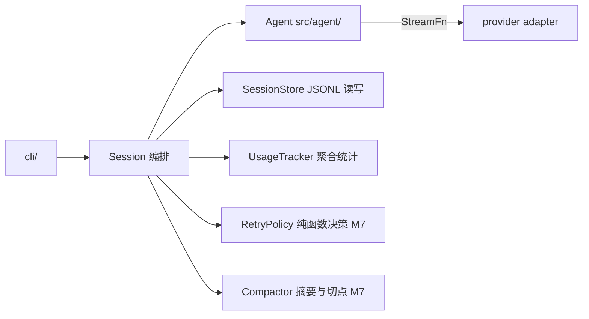
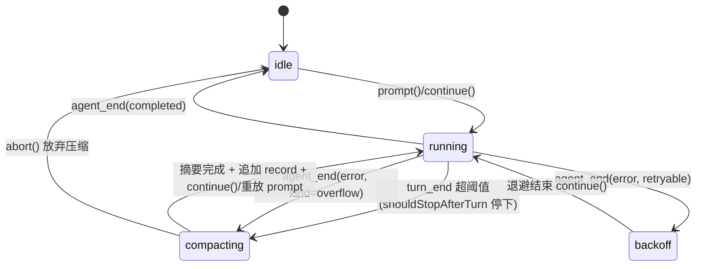

[← 返回地图](./README.md)

# 08 会话与持久化(Session / Persistence / Compaction / Usage)

本文规定 session 层的职责边界、JSONL 存储格式、恢复语义、auto-retry(M7)、compaction(M7)与 token/成本统计。session 层位于 `src/session/`,是 agent 核心之外的「运营服务层」:它组装 Agent、订阅 AgentEvent、把转录落盘,并在 agent 停止后决定「接下来做什么」(重试、压缩、续跑)。

## 1. 职责边界:为什么必须分层

### 1.1 pi 的 3300 行教训

pi-mono 的 `AgentSession` 是本项目最重要的反面教材:一个类 3300+ 行,把会话管理、持久化、上下文压缩、重试、扩展机制全部揉在一起,以致 pi 团队正在用 `packages/agent/harness` 返工重写。根因不是代码风格,而是**职责没有边界**——压缩要改消息数组、重试要控制循环、持久化要监听一切,三者都直接伸手进 agent 内部状态,任何一个需求变化都要动整个类。

我们的对策是把 agent 核心(`src/agent/`)做成**无持久化、无重试、无压缩**的纯执行引擎:它只认 `AgentConfig` 里注入的钩子(`transformContext` / `shouldStopAfterTurn` / `beforeToolCall` 等,见 [05](./05-agent-loop.md)),对外只发 `AgentEvent`。session 层的所有能力都通过这两条通道实现,**绝不新增 agent 内部状态**:

| 能力 | 实现通道 | agent 是否感知 |
|---|---|---|
| 持久化 | `subscribe` 监听 `message_end` 追加 JSONL | 否 |
| 恢复 | 构造 Agent 时注入 `initialMessages`(补充字段,见 3.1) | 只是初始数据 |
| auto-retry | 监听 `agent_end(error)` → 退避后调 `continue()` | 否 |
| compaction 触发 | `shouldStopAfterTurn` 返回 true 让 agent 停下 | 只知道「该停了」 |
| compaction 生效 | `transformContext` 出站时丢前缀、注入摘要 | 否 |
| usage 统计 | 监听 `message_end`(assistant)累加 | 否 |

opencode 的佐证:V1 的 `SessionProcessor` 把「事件 → 持久化状态」做成独立 reducer、`SessionRetry.policy` 是独立模块、compaction 由 processor 返回 `"compact"` 信号驱动外层——同样是「核心循环只发信号,决策在外层」的结构。codex 也是同构:会话以 rollout 文件(JSONL)追加保存,核心 loop 不做存储。

### 1.2 session 层内部再拆四个协作者

Session 本体只做编排(目标 < 300 行),四个协作者各自独立可测:



CLI 订阅的是 **Session** 而不是 Agent——session 透传 AgentEvent 并叠加自己的事件(`retry_scheduled` / `compaction_start` 等),这让「重试中」「压缩中」这类状态无需 agent 知情就能到达 UI。

### 1.3 非目标(v1)

- 不做 event-sourcing / Part 级独立存储(opencode V2 路线):我们的 AgentMessage 粒度足够,SQLite + projector 的复杂度不值得在单机 CLI 上支付。
- 不做多客户端 server 化;不持久化 steering/follow-up 队列(opencode V2 的 durable inbox 是好方向,列入 v2 备选,见 6.3)。
- 不做 git snapshot / patch 记录(opencode 的 snapshot part)。

## 2. Session 对外 API

```ts
// src/session/session.ts
export interface SessionOptions {
  agentConfig: AgentConfig;          // streamFn/model/tools/systemPrompt 由 CLI 组装后传入
  dir?: string;                      // 默认 ~/.coda/sessions
  pricing?: ModelPricing;            // 成本计算,见第 7 节;缺省则 costUSD 不计算
  retry?: RetryOptions;              // M7,见第 5 节
  compaction?: CompactionOptions;    // M7,见第 6 节
}

export class Session {
  static create(opts: SessionOptions): Promise<Session>;
  static resume(id: string, opts: SessionOptions): Promise<Session>;
  static list(dir?: string): Promise<SessionListItem[]>;   // 读各文件首行 meta + 首条 user 消息作标题

  readonly id: string;
  readonly agent: Agent;             // 暴露给需要直接访问的场景(测试);CLI 正常只用下面的门面

  prompt(text: string): Promise<void>;   // 门面:compaction 期间暂存,其余透传 agent.prompt
  steer(text: string): void;             // 透传 agent.steer
  followUp(text: string): void;          // 透传 agent.followUp
  abort(): void;                         // 透传,同时取消退避等待/压缩请求
  usage(): SessionUsage;
  subscribe(listener: (e: SessionEvent) => void | Promise<void>): () => void;
  close(): Promise<void>;                // flush 落盘 + 关闭文件句柄
}

export type SessionEvent =
  | AgentEvent                                          // 透传
  | { type: 'retry_scheduled'; attempt: number; maxAttempts: number; delayMs: number; errorMessage: string }
  | { type: 'compaction_start'; reason: 'threshold' | 'overflow' }
  | { type: 'compaction_end'; ok: boolean; droppedMessages: number }
  | { type: 'usage_update'; usage: SessionUsage };
```

`prompt/steer/followUp` 的队列语义、注入点完全由 agent 决定(见 [06](./06-steering-following.md)),session 不复制这套逻辑——唯一的例外是 compaction 进行期间对 `prompt()` 的暂存(见 6.4)。

## 3. JSONL 存储格式

### 3.1 记录类型

一个会话 = 一个追加式 JSONL 文件,路径 `~/.coda/sessions/<id>.jsonl`,id 形如 `20260726-153012-a1b2`(时间前缀天然可按文件名排序)。文件由三种记录组成,每条一行:

```ts
// src/session/store.ts
export interface MetaRecord {
  type: 'meta'; version: 1;    // 存储格式版本:JSONL 记录结构本身的版本
  protocolVersion: string;     // semver,AgentEvent/AgentMessage 协议版本(见 03 §9.2 协议演进)
  id: string; createdAt: number;
  cwd: string;                 // 创建会话时的工作目录,--resume 默认按 cwd 过滤
  model: ModelRef;
}
export interface MessageRecord { type: 'message'; message: AgentMessage }
export interface CompactionRecord {
  type: 'compaction'; id: string; timestamp: number;
  tailStartId: string;         // 保留尾部的第一条消息 id(opencode 同款 tail_start_id)
  summary: string;             // LLM 摘要全文
  contextTokensBefore?: number;
}
export type SessionRecord = MetaRecord | MessageRecord | CompactionRecord;
```

补充字段声明(相对本项目既有设计约定的新增,不改任何既有语义):

- `AgentConfig.initialMessages?: AgentMessage[]` —— 恢复会话时的初始转录;
- `AssistantMessage.errorDetails?: ProviderErrorDetails` —— adapter 填写的结构化错误(见 5.1);
- `agent_end` 事件透传时 session 可注解 `willRetry?: boolean`(见 5.3)。

### 3.2 格式示例

```jsonl
{"type":"meta","version":1,"protocolVersion":"1.0.0","id":"20260726-153012-a1b2","createdAt":1753515012000,"cwd":"/Users/zp/proj","model":{"provider":"openai","api":"openai-chat","model":"gpt-5.2"}}
{"type":"message","message":{"role":"user","id":"msg_01","timestamp":1753515013000,"source":"prompt","content":[{"type":"text","text":"把 utils.ts 里的重复代码抽成函数"}]}}
{"type":"message","message":{"role":"assistant","id":"msg_02","timestamp":1753515016000,"model":{"provider":"openai","api":"openai-chat","model":"gpt-5.2"},"stopReason":"tool_calls","usage":{"input":2310,"output":95},"content":[{"type":"text","text":"先看一下文件。"},{"type":"tool_call","id":"call_a","name":"read","arguments":{"path":"src/utils.ts"}}]}}
{"type":"message","message":{"role":"tool_result","id":"msg_03","timestamp":1753515016400,"toolCallId":"call_a","toolName":"read","isError":false,"content":[{"type":"text","text":"1: export function ..."}]}}
{"type":"compaction","id":"cmp_01","timestamp":1753518800000,"tailStartId":"msg_41","summary":"任务:重构 utils.ts……已完成:……未完成:……关键文件:……"}
```

要点:

- **一行一条 AgentMessage,原样序列化**。`ToolResultMessage.details`(如 edit 的 diff)也随行落盘——它不发给模型但恢复后 UI 要用;若 details 不可 JSON 序列化,落盘时置 undefined 并告警,不得让写盘失败。
- **compaction 记录只追加、不改写历史**。文件永远保留全量转录(审计/调试价值),活动上下文的裁剪在加载和出站时计算(见 4.1、6.2)。这是「存储 append-only、视图靠折叠」——opencode V2 event-sourcing 的极简版。
- meta 不回写。会话标题在 `list()` 时取首条 user 消息截断 80 字符,避免任何「改写文件中部」的操作。

### 3.3 追加纪律与崩溃容忍

- 写入时机:每个 `message_end` 事件追加一条 MessageRecord。**不是** `agent_end` 时批量写——agent 中途崩溃也要能恢复到最后一条完整消息。
- 流式期间不落盘:assistant 消息在 `message_update` 阶段只存在于内存,`message_end` 时一次性写入终态(含 stopReason/usage)。崩溃丢失的最多是「正在流式的那一条」,恢复后转录依旧合法(见 4.2)。
- 落盘确定性:pi 的经验是事件监听 await 串行虽拖慢 loop,但换来 `waitForIdle()` 返回即全部落盘的确定性。我们采纳同一取舍:Agent 对 subscribe 的 async listener 串行 await(见 [05](./05-agent-loop.md)),因此 `session.close()` = `agent.waitForIdle()` + flush,之后进程可安全退出。listener 内部必须 try/catch,持久化失败发 `error` 事件(fatal: false)而不是打断 loop。
- 崩溃截断:进程在写半行时被杀,文件尾部会出现不完整 JSON。加载时**最后一行 parse 失败则静默丢弃**;非最后一行损坏则拒绝加载并报错(文件真的坏了,不能装作没事)。
- fsync 策略:默认依赖 OS 缓冲(appendFile 即返回);`agent_end` 时做一次 fsync。单机 CLI 场景足够,不为每条消息付 fsync 代价。

## 4. 恢复语义

### 4.1 加载与重建

```
resume(id):
  lines = 逐行读 <id>.jsonl
  meta  = 第一行,必须是 MetaRecord 且 version 兼容,否则拒绝加载
  messages = 依序收集 MessageRecord.message
             同 id 重复出现时保留最后一条(防御性,正常流程不产生重复)
  comp  = 最后一条 CompactionRecord(若有)
  if comp:
    idx = messages.findIndex(m => m.id === comp.tailStartId)
    active = idx >= 0
      ? [syntheticSummaryMessage(comp.summary), ...messages.slice(idx)]
      : messages                       // tailStartId 找不到:忽略该 compaction,告警
  else: active = messages
  agent = new Agent({ ...agentConfig, initialMessages: active })
```

`syntheticSummaryMessage` 是一条 `source: 'synthetic'` 的 UserMessage,内容形如 `[Conversation summary]\n<summary>`——与 plan 批准注入(见 [07](./07-tools.md))共用同一 source 语义,模型视角就是一条普通用户消息。

### 4.2 恢复后为什么不需要特判中断状态

被中断/出错的会话文件尾部可能是任意形态:最后一条是带 tool_call 的 assistant 而 tool_result 缺失(工具执行到一半被杀)、最后一条 assistant 的 stopReason 是 `aborted` 或 `error`、甚至最后一条是孤零零的 user。**恢复代码对这些一律不做修补**,因为出站合法性由 transform 层统一保证(见 [06](./06-steering-following.md)):

- stopReason ∈ {aborted, error} 的 assistant 消息重放时被过滤;
- 悬空 toolCall 在下一次请求前被补上 `"[Tool execution was interrupted]"` 的 isError 合成结果,Chat Completions 的 tool_calls/tool 配对永远合法。

这正是把转录修复放在 transform 层而非持久化层的红利:**崩溃恢复、abort 续跑、重试重发是同一条代码路径**。opencode 的对应物是 replay 时把 pending/running tool 转成 `output-error "[Tool execution was interrupted]"`;pi 的对应物是 transform-messages 补 "No result provided"。两家都踩过 Anthropic 类协议对孤儿 tool_use 直接 400 的坑,教训一致:修复必须发生在「每次出站前」,而不是「恢复时一次性」——因为运行中随时可能产生新的孤儿。

### 4.3 恢复后的 continue() 与新输入

恢复完成后 session 不自动跑,由 CLI 决定:

- 用户直接输入新内容 → `session.prompt(text)`,正常开新一轮;
- 用户要求「接着刚才的干」(`--resume --continue` 或 REPL 命令)→ `agent.continue()`:按 [05](./05-agent-loop.md) 第 1 节的 Agent API 语义,continue 优先 drain steering、否则 follow-up;两队列皆空时(恢复场景必然如此,队列不持久化)强制执行至少一个 turn——模型看到 transform 修复后的转录(含合成的中断结果),自然接续任务。`agent_start.reason` 为 `'continue'`。

边界情况:

- 空文件 / 只有 meta 行:合法,等价新会话。
- 模型与 meta.model 不一致(用户换了模型恢复):允许。AssistantMessage 自带 ModelRef,transform 层的跨模型规则(reasoning 降级、toolCallId 归一化)会处理历史消息,这正是消息级 ModelRef 的设计目的。
- 会话文件被并发打开:v1 不做锁,文档明示「同一会话同时只允许一个进程」;v2 可加 lockfile。

## 5. auto-retry(M7)

### 5.1 错误分类:结构化优先,字符串兜底

StreamFn 铁律保证一切失败都以 `stopReason: 'error' | 'aborted'` 的 AssistantMessage 收尾,所以 retry 的输入就是这条消息。为避免 session 靠 errorMessage 正则猜错误类别(opencode 用 8 种 typed error + `isRetryable` 标志,证明结构化分类是必要投资),我们给 AssistantMessage 补充可选字段:

```ts
// src/protocol/messages.ts(补充)
export interface ProviderErrorDetails {
  status?: number;            // HTTP 状态码
  code?: string;              // provider 错误码
  requestId?: string;
  kind: 'network' | 'http' | 'overflow' | 'auth' | 'rate_limit' | 'aborted' | 'unknown';
  retryable: boolean;         // adapter 的初判,session 可覆盖
  retryAfterMs?: number;      // 来自 Retry-After / ratelimit 头
}
// AssistantMessage 增加:errorDetails?: ProviderErrorDetails
```

adapter 最了解错误来源(APIError 的 status/code、fetch 网络错误、in-band error 对象),由它填写;faux provider 也照填,让 retry 逻辑可离线测试。分类基线:

| 类别 | 判定 | retryable |
|---|---|---|
| aborted | stopReason 'aborted' | 否(用户意志) |
| network | 无 status 的连接/超时错误 | 是 |
| rate_limit | 429 | 是(优先用 retryAfterMs) |
| http 5xx / 408 / 409 | status | 是 |
| in-band(SSE data 行带 error 对象,无 status) | error 体的 type/code:`server_error`/`internal_error` → http 可重试;其余 → unknown 不重试 | 视分类 |
| overflow | context length exceeded 类错误码/文案(仅 400/in-band 时按文案判定;429 的 "too many tokens" 是限流不是 overflow) | 否 → 转交 compaction(6.5) |
| auth 401/403、400、404 | status | 否(重试无意义) |

### 5.2 退避与决策纯函数

```ts
// src/session/retry.ts
export interface RetryOptions { maxAttempts?: number /*5*/; baseDelayMs?: number /*1000*/; maxDelayMs?: number /*32000*/ }
export type RetryDecision = { retry: false; reason: string } | { retry: true; delayMs: number };

export function decideRetry(msg: AssistantMessage, attempt: number, opts: Required<RetryOptions>): RetryDecision {
  // 伪码:
  // if (msg.stopReason !== 'error') return no('not an error')
  // if (!classifyRetryable(msg.errorDetails, msg.errorMessage)) return no(kind)
  // if (attempt >= opts.maxAttempts) return no('max attempts')
  // base = msg.errorDetails?.retryAfterMs ?? opts.baseDelayMs * 2 ** attempt
  // return { retry: true, delayMs: min(opts.maxDelayMs, base) * (0.5 + random()) }  // full jitter
}
```

纯函数、无 IO、无计时器——RetryPolicy 单测只喂消息和 attempt 数即可,这是从 pi 的教训里直接换来的形态(重试逻辑一旦和循环控制缠在一起就再也测不动了)。

### 5.3 与 agent_end 的关系

```
session.onAgentEvent(e):
  case turn_end 且 message.stopReason 不是 error: attempt = 0        // 任何成功 turn 重置计数
  case agent_end:
    if e.reason !== 'error': 透传;return
    d = decideRetry(lastAssistant(e.messages), attempt, opts)
    if !d.retry: 透传 agent_end;return
    attempt++
    透传 { ...e, willRetry: true }                                    // UI 显示「重试中」而非「已结束」
    emit retry_scheduled { attempt, delayMs }
    await sleepWithAbort(d.delayMs, sessionAbortSignal)               // abort() 取消等待并放行真正的 agent_end
    agent.continue()                                                  // 见下
```

关键设计:**重试 = `continue()`,不是特殊路径**。失败的 assistant 消息(stopReason 'error')留在转录里,transform 层重放时过滤它,于是 continue 发出的请求与失败前完全一致——与 4.3 的恢复续跑、abort 续跑共用同一机制。`agent_end.willRetry` 是 session 透传时的注解(本项目设计约定预留的「语义可后置」项):agent 本身不知道会被重试,UI 只需在 willRetry 为 true 时不渲染「会话结束」。

退避等待期间用户输入照常入队(steer/followUp 本来就随时可调);等待期间用户 `abort()` → 取消计时器、补发不带 willRetry 的 agent_end 语义(session 发 `error` 事件说明重试已取消)。

## 6. compaction(M7)

### 6.1 触发:threshold 主动 + overflow 被动

上下文当前体量的估算不需要 tokenizer:**最近一条成功 assistant 的 `usage.input + usage.output` 就是下一次请求的上下文规模下界**(usage 是 inclusive 口径,input 已含缓存部分)。触发条件:

```
contextTokens > threshold * (model.limits.context - reserveOutput)
  threshold 默认 0.8;reserveOutput = maxOutputTokens(给下一次输出留位)
```

检测点在 `turn_end`。检测为真时**不打断当前 run**——session 的 `shouldStopAfterTurn` 钩子返回 true,让 agent 在 turn 边界体面停下([05](./05-agent-loop.md) 第 2 节:shouldStopAfterTurn 提前停不 poll 队列),然后 session 执行压缩,完毕后 `continue()` 续跑。这样 compaction 永远发生在「无进行中工具、无流式响应」的静止点,不需要任何并发控制。

被动路径:provider 返回 overflow 错误(`errorDetails.kind === 'overflow'`)→ 不重试,直接进入 compaction,成功后 `continue()`。这是对「估算失灵」(如恢复的旧会话第一次请求就超限,此时还没有 usage 可参考)的兜底。

### 6.2 生效机制:compaction 状态 + transformContext,不动 agent 内存

压缩**不修改** agent 持有的消息数组,也不改 JSONL 已有行。Compactor 产出 `{ tailStartId, summary }`,session 持有为当前 compaction 状态并追加一条 CompactionRecord;真正的裁剪发生在 session 安装的 `transformContext` 里:

```
transformContext(ctx):
  if compactionState:
    idx = ctx.messages.findIndex(m => m.id === compactionState.tailStartId)
    ctx = { ...ctx, messages: [syntheticSummaryMessage(summary), ...ctx.messages.slice(idx)] }
  return 既有 transform(ctx)     // aborted 过滤、孤儿修复等,见 06 文档
```

收益:agent 零感知;恢复路径(4.1)与运行路径共用同一折叠逻辑;历史完整保留。代价:内存里消息数组只增不减——单机 CLI 会话的量级(数百条消息)完全可接受,不为此引入 opencode V1 那种「每步从 DB 重读」的结构。

### 6.3 切点选择与摘要生成

```
selectTailStart(messages, keepBudget):
  从尾部向前累计估算 token(len(JSON)/4 粗估)直到达到 keepBudget(默认 contextTokens * keepRatio, keepRatio=0.25)
  切点向前对齐到最近一条 role === 'user' 且 source ∈ {prompt, steering, follow_up} 的消息
    —— user 消息天然是 turn 起点,保证不会把 assistant 的 tool_call 与其 tool_result 切开
  若找不到(尾部是一个超长 turn):退化为保留最后一整个 turn,并告警
```

摘要生成直接调 `streamFn`(不经过 agent):构造一次性 Context,systemPrompt 用专门的 SUMMARIZE_PROMPT,messages 为被丢弃前缀的文本化渲染(超长时对中部做硬截断,首尾优先保留),请求要求输出:任务目标、已完成/未完成、关键文件与路径、重要决策与约束、下一步。`maxOutputTokens` 用 `summaryMaxTokens`(默认 2000)。摘要请求挂 session 的 AbortSignal,用户 Esc 可取消。

```ts
export interface CompactionOptions {
  enabled?: boolean;        // M7 起默认 true
  threshold?: number;       // 0.8
  keepRatio?: number;       // 0.25
  summaryMaxTokens?: number; // 2000
}
```

### 6.4 compaction 期间的用户输入:暂存后重放

压缩执行时 agent 处于 idle(被 shouldStopAfterTurn 停下或 overflow 出错后),但用户不知道也不该关心:

- `steer()` / `followUp()`:直接透传。agent 队列本身就是暂存区,runLoop 起跑前会 poll 一次 steering([05](./05-agent-loop.md) 第 2 节 runLoop 骨架第一行),`continue()` 后自然消费——**不需要 session 再做一层队列**。
- `prompt()`:agent 空闲时 prompt 会立刻开新 run,与压缩并发——所以 session 门面在 `compacting` 状态下把 prompt 文本暂存,`compaction_end` 后重放(先重放 prompt,若压缩后还有 continue 需求则 prompt 已隐含开跑)。
- `abort()`:取消摘要请求,放弃本次压缩(状态回滚,不写 record),会话保持原样。



### 6.5 失败降级

摘要请求本身失败(网络/超限):

- threshold 主动触发的:放弃本次压缩,发 `compaction_end { ok: false }`,继续用原上下文跑——下次 turn_end 会再触发。
- overflow 被动触发的:不能继续用原上下文(会再次 400)。降级为**硬截断**:按同样切点丢前缀,summary 用占位文本 `[Earlier conversation truncated due to context limit]`,照常写 CompactionRecord。信息有损但会话能活——比直接把错误抛给用户好。

## 7. token / 成本统计

### 7.1 口径:inclusive 总量,消费方永不做减法

`Usage` 的口径在协议层定死(见 [03](./03-internal-protocol.md)):`input` 含 cacheRead/cacheWrite,`output` 含 reasoning。这是 opencode 用血泪换来的:AI SDK v6 把 inputTokens 口径从「不含 cache」改成「含 cache」,迫使 opencode 全链路重算成本。我们的规则:**各 adapter 负责把 provider 原生口径换算成 inclusive 口径;session 及以上永远只做加法**。

### 7.2 聚合

```ts
// src/session/usage.ts
export interface SessionUsage {
  lastTurn?: Usage;          // 最近一条 assistant 的 usage(per-turn 视图)
  cumulative: Usage;         // 全会话累计:对每条 assistant 消息逐字段求和
  turns: number;             // assistant 消息条数(含 error/aborted)
  contextTokens: number;     // 最近一条成功 assistant 的 input + output,compaction 触发用
}
```

UsageTracker 监听 `message_end`(role assistant)累加;可选字段(cacheRead/reasoning/costUSD)按「出现过才累加,从未出现保持 undefined」处理,避免把「provider 不上报」渲染成 0。恢复会话时从 initialMessages 重建累计值——统计与转录同源,无独立状态文件。每次更新发 `usage_update` 事件,CLI 状态栏据此渲染(见 [09](./09-cli.md))。

注意 error/aborted 的 assistant 消息也可能带部分 usage(流断在中途),照常累加——钱已经花了。

### 7.3 成本

```ts
export interface ModelPricing {   // 每百万 token 美元价
  inputPer1M: number; outputPer1M: number;
  cacheReadPer1M?: number; cacheWritePer1M?: number;
}
// inclusive 口径下的换算(session 层唯一做「减法」的地方,且只在此一处):
// costUSD = (input - cacheRead - cacheWrite) * inputPer1M/1e6
//         + cacheRead * cacheReadPer1M/1e6 + cacheWrite * cacheWritePer1M/1e6
//         + output * outputPer1M/1e6        // reasoning 按 output 价计
```

定价放 `SessionOptions.pricing`(CLI 从配置读),adapter 不内置价表——价格变动不该发 adapter 版本。`Usage.costUSD` 由 session 计算后回填到落盘消息,汇总即会话总成本。无定价时 costUSD 保持 undefined,UI 显示 token 数即可。

## 8. 边界情况清单

- 最后一行半截 JSON:丢弃;中部损坏行:拒绝加载。
- MessageRecord 里出现未知 role / 未知 part type(未来版本写的文件):拒绝加载并提示版本不兼容(meta.version 升版时提供迁移脚本,v1 不做向前兼容)。
- compaction record 的 tailStartId 指向不存在的消息:忽略该 record,告警,用全量转录。
- 会话目录不存在:create 时 `mkdir -p`;磁盘满导致 append 失败:发 fatal:false 的 error 事件,会话降级为「内存模式」继续跑,退出码非 0。
- 重试等待期间进程被杀:恢复后转录里有 stopReason 'error' 的尾消息,`--continue` 即等价重试——无需持久化重试状态。
- 连续 overflow → compaction → 又 overflow:压缩后 contextTokens 仍超限(尾部单 turn 过大)时,最多再硬截断一次;仍失败则放弃并报 fatal 错误,提示用户换更大上下文的模型。

## 9. 验收清单

- [ ] M5:`Session.create/resume/list/close` 可用;每条 message_end 追加落盘;`close()` 后 kill -9 再 resume,转录与 usage 完整。
- [ ] M5:恢复「工具执行中被杀」的会话后 `--continue`,出站请求里悬空 toolCall 已被 transform 补上合成结果(用 faux provider 断言出站 Context,见 [10](./10-testing.md))。
- [ ] M5:尾行半截 JSON 的文件可正常恢复;中部损坏拒绝加载。
- [ ] M5:`usage()` 的 cumulative 与逐条 assistant 手工求和一致;恢复后统计不丢。
- [ ] M7:5xx/429/network 错误自动退避重试,attempt 达上限后透传 agent_end;成功 turn 重置计数;429 的 retryAfterMs 被采用;退避期间 abort 立即生效。
- [ ] M7:构造超阈值会话触发 compaction:agent 在 turn 边界停下、摘要生成、CompactionRecord 落盘、continue 续跑,期间的 prompt 暂存重放、steer 不丢。
- [ ] M7:overflow 错误走被动压缩;摘要失败降级硬截断;压缩后出站消息数与 token 显著下降且首条为 synthetic summary。
- [ ] 成本:给定 pricing 与含 cache 字段的 usage,costUSD 与手算一致;无 pricing 时为 undefined。

## 相关文档

- [03 内部协议](./03-internal-protocol.md) —— AgentMessage / Usage / AgentEvent 的 canonical 定义
- [05 Agent 核心循环](./05-agent-loop.md) —— shouldStopAfterTurn / continue / 钩子的宿主语义
- [06 steering 与 follow-up](./06-steering-following.md) —— transform 层转录修复,恢复无需特判的依据
- [10 测试策略](./10-testing.md) —— faux provider 如何离线验证恢复/重试/压缩
