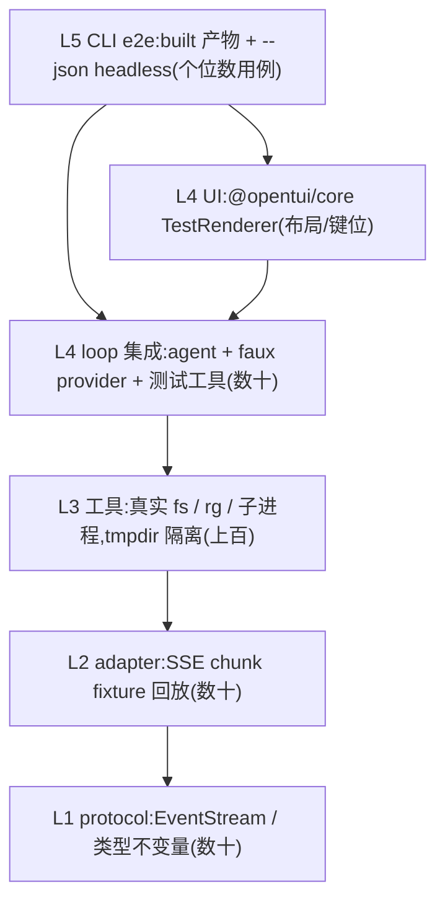

[← 返回地图](./README.md)

# 10 测试策略(Testing)

本文规定测试金字塔、faux provider 规格、adapter 的 SSE fixture 回放、steering/follow-up 的确定性测试方法、工具测试矩阵、OpenTUI 内存渲染回归、headless e2e 与 CI 建议。运行时与测试框架统一为 Bun 1.3.14 / `bun:test`。

## 1. 测试哲学

三条原则,全部来自参考项目的正反面经验:

1. **默认离线、默认确定**。任何进 CI 的测试不碰网络、不依赖真实模型。能做到的前提是架构本身:agent 只认 `StreamFn`,于是一个脚本化的 faux provider 就能驱动全部循环逻辑;adapter 的流解析是纯函数(opencode V2 把协议做成 `step(state, chunk) → events` 的纯转换,正是为了可单测),于是录制的 chunk 回放即可覆盖。
2. **真实 IO 只出现在它是被测对象的层**。工具测试用真实文件系统、真实 ripgrep、真实子进程——mock 文件系统测 edit 等于没测(CRLF/BOM/mtime 全是真实 fs 行为)。除此之外的层一律无 IO。
3. **协议不变量用测试钉死**。StreamFn 铁律(绝不 throw)、事件三段式语法、tool_calls/tool 配对合法性——这些是文档承诺,每条都要有对应断言,防止实现漂移。

## 2. 测试金字塔



| 层 | 位置 | 依赖 | 速度目标 |
|---|---|---|---|
| L1 protocol | `src/protocol/*.test.ts` | 无(零运行时依赖是该目录的架构约束) | 毫秒级 |
| L2 adapter | `src/providers/<adapter>/*.test.ts` + `__fixtures__/` | fixture 文件 | 毫秒级 |
| L3 tools | `src/tools/*.test.ts` | tmpdir、rg 二进制、`Bun.spawn` | 秒级 |
| L4 loop | `src/agent/*.test.ts`、`src/session/*.test.ts` | faux provider | 毫秒级 |
| L4 UI | `src/cli/tui.test.ts` | `@opentui/core/testing` 内存 renderer + mock highlighter | 亚秒级 |
| L5 e2e | `e2e/*.test.ts`(`bun run test:e2e`) | `Bun.build` 构建产物 | 数秒 |

L1 要点(不展开):`EventStream` 的 push/end/result 语义(end 后 push 被忽略并产生开发模式警告(console.warn)、迭代器收尾、result 在 end 前 pending)、单消费者迭代顺序、`partial` 快照与 delta 累积一致性的属性测试(随机事件序列折叠后等于 done 消息——对应 opencode `LLMResponse.reduce` 的 reducer 思路)。

## 3. faux provider 详细规格

`src/providers/faux/` 不是测试夹具堆,而是**正式 provider**:实现 `StreamFn`、遵守全部协议不变量,e2e 也用它(CLI `--provider faux`)。它同时是内部协议的可执行规格——faux 自己违反事件语法,L4 全线报警。

### 3.1 接口

```ts
// src/providers/faux/types.ts
export interface Gate { open(): void; readonly opened: Promise<void> }
export function createGate(): Gate;

export type FauxEventSpec =
  | { kind: 'text'; text: string; chunkSize?: number }        // 按 chunkSize 拆成多个 text_delta,默认 8
  | { kind: 'reasoning'; text: string; chunkSize?: number }
  | { kind: 'tool_call'; name: string; args: Record<string, unknown>; id?: string;
      truncatedRaw?: string }                                  // 配合 stopReason:'length' 模拟截断参数
  | { kind: 'gate'; gate: Gate };                              // 暂停发射直到测试放行(受控注入点)

export interface FauxTurn {
  events?: FauxEventSpec[];
  stopReason?: StopReason;    // 缺省推断:有 tool_call → 'tool_calls',否则 'stop'
  error?: { message: string; details?: ProviderErrorDetails }; // 以 error 事件收尾(stopReason 'error')
  usage?: Partial<Usage>;     // 缺省 { input: 100, output: 10 }
  onRequest?: (model: ModelConfig, context: Context, options?: StreamOptions) => void; // 出站断言钩子
}

export interface FauxScript {
  turns: FauxTurn[];
  onExhausted?: 'throw' | 'emptyStop';   // 脚本耗尽:测试默认 'throw'(多余请求即 bug),e2e 用 'emptyStop'
}

export function createFauxStreamFn(script: FauxScript): StreamFn & {
  readonly calls: { model: ModelConfig; context: Context; options?: StreamOptions }[];  // 深拷贝留档
};
```

### 3.2 行为语义

- 第 n 次调用消费 `turns[n]`;调用参数深拷贝进 `calls`,供测试断言 transform 层的出站产物(aborted 消息被过滤了吗、孤儿 toolCall 补结果了吗、steering 注入位置对吗)。**断言出站转录永远用 `calls` / `onRequest`,不要去猜 agent 内部状态**。
- 事件发射逐个 `await Promise.resolve()` 让出微任务,保证消费端观察到真实的流式顺序;**不用计时器**,除 gate 外没有任何时间依赖——这是确定性的根基。
- 严格遵守事件语法:`start` → 各内容块三段式(`*_start`/`*_delta`/`*_end`,contentIndex 递增)→ `done` 或 `error`;每个事件带逐步生长的 `partial` 快照;`tool_call` 的 arguments 分片经容错 JSON 解析持续刷新——与真 adapter 行为一致。
- **铁律同守**:faux 一旦被调用绝不 throw/reject(pi 的 StreamFunction 铁律)。`onExhausted: 'throw'` 的「throw」发生在测试进程的断言层面(通过 `stream.push` 前检测并 fail 测试),不是 StreamFn 抛异常。
- abort:在每个事件发射间隙与 gate 等待中检查 `options.signal`;已 abort 则立即以 `error` 事件收尾,`partial` 保留已发内容,stopReason 'aborted'——精确复刻真 adapter 的中断形态。
- `error` turn:先发 `events` 里的内容(可模拟「流到一半断掉」),再发 `error` 事件,消息带 `errorDetails`(见 [08](./08-session-persistence.md) 5.1),让 retry 分类逻辑可离线测试。
- length 截断:`stopReason: 'length'` + `tool_call` 的 `truncatedRaw`(写入 `rawArguments`,`arguments` 为容错解析结果)——用于验证 loop 层「length + toolCalls 全批合成错误结果不执行」的规则。

### 3.3 gate:受控注入点

gate 是本方案唯一的同步原语,把「时序巧合」变成「显式放行」:

```ts
const gate = createGate();
const streamFn = createFauxStreamFn({ turns: [
  { events: [ { kind: 'text', text: 'thinking...' },
              { kind: 'gate', gate },                    // 流悬停在此
              { kind: 'text', text: 'done' } ] },
]});
agent.prompt('go');
await waitForEvent(events, 'message_update');   // 确认流已开始
agent.steer('改用方案 B');                       // 流式中途注入——必须入队而非立即生效
gate.open();
await agent.waitForIdle();
```

pi 的教训「steering UI 队列靠消息文本 indexOf 匹配回收会误伤重复文本」提醒我们:队列断言一律用 `QueuedMessage.id` 与 `source` 字段,不用文本内容匹配。

## 4. adapter 测试:SSE chunk fixture 回放

### 4.1 结构:把流解析做成可注入 chunk 的纯入口

openai-node 的 `ChatCompletionStream.ts` 内部处理了大量累积边界(tool_calls 按 index 拼装、usage 尾 chunk、in-band error)。我们决定不用这个 helper(事件粒度与错误策略不匹配,见 [04](./04-provider-adapter.md)),等于把这些边界全接到自己手里——**必须用 fixture 回放守住同等覆盖**。为此 adapter 内部拆出纯函数入口,测试不 mock openai SDK、不碰网络:

```ts
// src/providers/openai-chat/consume.ts(内部模块,测试直接 import)
export function consumeChatStream(
  chunks: AsyncIterable<unknown /* ChatCompletionChunk 形状,不 import openai 类型到签名 */>,
  init: { model: ModelRef; compat: CompatFlags },
  out: ProviderEventStream,
  signal?: AbortSignal,
): Promise<void>;
```

fixture 是 JSONL:一行 = 一条 SSE `data:` 的 JSON payload,存 `src/providers/openai-chat/__fixtures__/`。测试 helper `replayFixture(name, compat?)` 返回 `{ events: ProviderEvent[]; final: AssistantMessage }`。

```jsonl
{"id":"c1","choices":[{"index":0,"delta":{"tool_calls":[{"index":0,"id":"call_a","function":{"name":"read","arguments":""}}]},"finish_reason":null}]}
{"id":"c1","choices":[{"index":0,"delta":{"tool_calls":[{"index":0,"function":{"arguments":"{\"path\":\"a.ts\"}"}},{"index":1,"id":"call_b","function":{"name":"grep","arguments":"{\"pattern\":\"x\"}"}}]},"finish_reason":null}]}
{"id":"c1","choices":[{"index":0,"delta":{},"finish_reason":"tool_calls"}]}
{"id":"c1","choices":[],"usage":{"prompt_tokens":120,"completion_tokens":31}}
```

### 4.2 fixture 清单(canonical,M2 验收项)

| fixture | 场景 | 关键断言 |
|---|---|---|
| `basic-text.jsonl` | 正常文本流 | `start` → `text_start/delta*/end` → `done`;拼接 content 与 `text_end.content` 一致;stopReason 'stop' |
| `parallel-tool-calls.jsonl` | 两个 tool_calls 按 `index` 交错分片 | 按 index 定位槽位不串包;arguments 逐段拼接;流式期间容错解析持续刷新 `arguments`;两个 `tool_call_end`;stopReason 'tool_calls' |
| `usage-chunk.jsonl` | `include_usage` 的尾 chunk(`choices:[]`) | 空 choices 的 usage chunk 不 crash;Usage 换算为 inclusive 口径(含 cached/reasoning 明细字段映射) |
| `usage-missing.jsonl` | provider 未发 usage chunk | usage 各字段为 0/undefined,无 NaN;done 正常 |
| `length-truncated.jsonl` | `finish_reason:"length"` 且 arguments 半截 JSON | 照常产出 ToolCallPart;`rawArguments` 保留原始截断串;stopReason 'length'(不执行是 loop 层的事,adapter 不管) |
| `in-band-error.jsonl` | 流中 `data: {"error":{...}}` | `error` 事件;stopReason 'error';errorMessage 含 code/message;errorDetails 分类正确 |
| `missing-tool-call-id.jsonl` | delta.tool_calls 无 `id` 字段 | 兜底生成 `call_<uuid>`;同一槽位后续 delta 仍归并到同一 toolCall;两次回放 id 不冲突 |
| `reasoning-content.jsonl` | 第三方方言 `delta.reasoning_content` | compat.reasoningFormat 开启时产出 ReasoningPart 与 `reasoning_*` 三段事件;关闭时忽略不 crash |
| `empty-choices-keepalive.jsonl` | 中途出现 `choices:[]` 且无 usage 的 chunk | 静默忽略;后续 chunk 正常处理 |
| `text-then-tool.jsonl` | 同一响应先文本后 tool_calls | contentIndex 正确递进;`text_end` 在 `tool_call_start` 前 |
| `content-filter.jsonl` | `finish_reason:"content_filter"` | 走 done 分支正常收尾;stopReason 'content_filter' |

fixture 之外的两个错误路径用单测直接构造(无法录成 chunk):SDK `create()` reject(APIError with status)→ 流内 `error` 事件、绝不向外抛(**铁律测试**:对每种错误注入方式断言 `streamFn` 调用本身 never rejects);`APIUserAbortError` → stopReason 'aborted'。

### 4.3 录制与维护

`scripts/record-fixture.ts`:读 `OPENAI_API_KEY` 环境变量,对真实 endpoint 发起带 `stream:true` 的请求,把每条 chunk 原样写 JSONL(脱敏:去 headers、request id 可保留)。**手动运行、fixture 入库**;CI 永不联网。第三方方言(DeepSeek 等的 `reasoning_content`)同法录制。fixture 一经断言固化,升级 `openai` 包大版本时先跑回放——SDK 变更影响一目了然。

### 4.4 OpenAI Responses 离线 fixtures

Responses adapter 的测试住在 `src/providers/openai-responses/`，通过
`consumeResponsesStreamForTest` 注入 `AsyncIterable<unknown>`，生产与测试走同一条
`runResponsesStream` 管线。fixture 由
`scripts/generate-openai-responses-fixtures.ts` 确定性生成；修改场景后运行:

```bash
bun run fixtures:openai-responses
```

生成器是这些 JSONL 的维护入口，禁止直接手改 fixture。所有用例离线运行，不读取 `.env`、不访问
网络、不 mock agent loop:

| fixture | 场景 | 关键断言 |
|---|---|---|
| `text.jsonl` | `response.output_text.delta/done` + completed | TextPart 三段式、stop、terminal usage |
| `reasoning.jsonl` | reasoning summary 分片 + encrypted content + text | ReasoningPart、私有 replay signature、reasoning usage、下一轮 reasoning item 重建 |
| `tool-call.jsonl` | function call arguments 任意分片 | `call_id === ToolCallPart.id`、raw/parsed arguments 一致、工具结果成为同 call_id 的 `function_call_output` |
| `parallel-tool-calls.jsonl` | 两个 call 的 arguments 交错 | 两个开放槽位互不串包、contentIndex append-only、声明序保留 |
| `usage.jsonl` | cached/cache-write/reasoning 明细 | inclusive Usage 及两条不变量 |
| `abort.jsonl` | 有半截文本但无 terminal | SDK v6 clean-return 形态 + aborted signal → `aborted`，半截内容保留 |
| `incomplete.jsonl` | `max_output_tokens` | done/length；另用内联事件覆盖 content_filter 与未知 reason |
| `sse-error.jsonl` | Responses `type:'error'` | 唯一 error terminal、server_error 可重试、已流内容保留 |
| `failed.jsonl` | `response.failed` | response error code/message/usage 映射 |

HTTP 401/429/500、`Retry-After`、factory reject、原生迭代中断与“干净结束但无 terminal”无法表示为
正常 SSE payload，测试以 SDK error/拒绝的 factory 直接注入；断言 `StreamFn` 同步返回，
`for await` 与 `result()` 都正常完成，错误只出现在 `ProviderEvent.error` 中。

出站测试额外锁定 `instructions/input/tools`、`strict:false`、options/defaults 与
`include:['reasoning.encrypted_content']`，并明确断言请求对象不存在 `previous_response_id`。
这条断言保证 fixture replay、恢复与 retry 始终由本地 transcript 驱动。

## 5. loop 集成测试(L4):steering / follow-up / abort 的确定性方法

全部用 faux provider + 测试工具(`ToolDefinition` 的极简实现,execute 可挂 gate)。事件序列断言用「归一化快照」:收集 AgentEvent 流,剥掉 timestamp/id/usage 后 snapshot 事件 type 序列——gemini-cli 的工具状态机思路,状态迁移序列本身就是规格。

关键用例:

1. **steering 在 turn 边界注入,不打断工具**:turn1 返回 tool_call,工具 execute 挂 gate;工具执行中 `steer()`;放行后断言:(a) `calls[1].context` 中 steering user 消息(source:'steering')紧跟 toolResult 之后;(b) 事件序列为 `tool_execution_end → turn_end → message_start(user/steering) → turn_start` 的相对顺序;(c) 工具没有被中断(结果非 isError)。
2. **steering 续命**:turn1 纯文本(stop),但流式期间(gate)注入 steering → 断言 agent 未结束、发起第 2 次请求;队列空 + 无 toolCall 时才 agent_end。
3. **follow-up 只在收尾时消费**:turn1 纯文本;流式期间 `followUp()` → turn1 结束后断言 agent 继续(`calls[1]` 含 source:'follow_up' 消息)且中间无 `agent_end`;对照组:同场景用 steer,注入时机相同、结果一致但 `queue_update` 内容不同——两队列语义差异在「turn 中还有工具」的场景才分化,补一个 turn1 带 toolCall 的对照用例。
4. **one-at-a-time vs all**:连注 3 条 steering,默认模式断言每个注入点只取最老一条(`calls` 逐次多一条);切 'all' 断言一次取空。
5. **abort 全链路**:流式中途 abort(faux 在 gate 处感知 signal)→ assistant stopReason 'aborted' 入转录;`continue()` 后用 `calls` 断言 transform 产物:aborted 消息被过滤、孤儿 toolCall 已补 `[Tool execution was interrupted]` 结果。工具执行中 abort → 工具收到 signal、结果 isError。
6. **length + toolCalls 不执行**:faux turn stopReason 'length' 带 truncatedRaw → 断言工具 execute 从未被调用(spy)、全批合成错误结果回喂、loop 继续。
7. **校验失败回喂不终止**:faux 发未知工具名 / 非法参数的 tool_call → 断言合成 isError 结果内容含「可用工具列表 / 请修正参数」文案且下一 turn 照常发起(opencode 的 `invalid` 工具与「请按 schema 重写输入」文案是该行为的出处)。
8. **parallel 与 sequential**:两个 gate 工具并行批次,断言并发执行、结果按源顺序回填;批内含 `executionMode:'sequential'` 工具(bash)时整批顺序。
9. **retry / compaction(M7,session 层)**:faux turn1 `error{ details: { kind:'http', status:500,retryable:true } }`、turn2 成功 → 通过 `RetryOptions.sleep` 注入可控 gate,由测试观察 `delayMs` 后主动 resolve,断言退避时长、`agent_end.willRetry === true`、`retry_scheduled` 事件、`calls[1]` 与 `calls[0]` 出站一致(失败消息被过滤);overflow kind → 断言走 compaction 而非退避。不能依赖测试运行器推进真实 timer——Bun 1.3.14 的 fake timer 不等价覆盖这些异步退避语义。compaction 用「faux usage 报高 input」触发阈值,断言 shouldStopAfterTurn 停跑、摘要请求(也是一次 faux call)、续跑后出站消息数骤减且首条为 synthetic summary。

Session 持久化集成测试同层:真实 tmpdir 下 create → 跑脚本 → 直接丢弃 Session 对象(模拟 kill)→ resume → 断言转录/usage/compaction 状态复原;尾行截断文件的恢复(手工 truncate 文件尾)。

## 6. 工具测试(L3):真实文件系统

每个测试 `beforeEach` 建独立 tmpdir 作为 `ToolContext.cwd`,`afterEach` 清理;FileTracker 每测试新建。

### 6.1 edit 工具测试矩阵

edit 是全项目风险密度最高的工具。矩阵按「匹配层级 × 文件形态 × 约束」展开,每行一个独立用例:

| # | 场景 | 期望 |
|---|---|---|
| 1 | 精确匹配单处命中 | 替换成功,details 含合法 unified diff |
| 2 | oldText 出现 2 次且无 replaceAll | isError,错误信息含出现次数与消歧建议 |
| 3 | `replaceAll: true` 多处命中 | 全部替换 |
| 4 | oldText === newText | isError(无意义编辑) |
| 5 | oldText 为空串 | isError(新建文件走 write) |
| 6 | CRLF 文件 + LF 风格 oldText | 剥离-匹配-还原:命中且输出保持 CRLF |
| 7 | UTF-8 BOM 文件 | BOM 保留在输出首部 |
| 8 | 智能引号/em-dash:磁盘是 `"…"`,oldText 是 ASCII `"..."` | 精确失败 → fuzzy 归一化命中;**未触碰行逐字节与原文件相等**(行 overlay 断言) |
| 9 | NFKC:全角字符差异 | 同上,fuzzy 命中且保留原字节 |
| 10 | 行尾空白差异(trailing spaces) | fuzzy 命中 |
| 11 | 真实内容差异(改了词) | fuzzy 不得命中,isError——零风险层绝不做编辑距离(aider 作者把 fuzzy 匹配 return 成死代码的教训:激进模糊匹配宁可没有) |
| 12 | 未 read 直接 edit | isError:read-before-edit 硬约束 |
| 13 | read 后文件被外部修改(测试里 utimes/重写)再 edit | isError:mtime 变新 |
| 14 | read → edit 成功 → 再 edit | 成功:FileTracker 在成功写入后自动刷新登记 |
| 15 | 多 edits 顺序应用 | 后一 edit 作用在前一 edit 的结果上;中途失败则整体不落盘(原子性) |
| 16 | parallel 批次中两个 edit 同一路径 | 串行化执行,结果无交错(同路径写锁) |
| 17 | write 覆盖已读旧文件 | 与 12/13 同约束;write 新文件自动建目录 |

### 6.2 bash 工具

| 场景 | 方法与期望 |
|---|---|
| timeout | `sleep 5` + timeout 1s → isError,输出解释超时原因与下一步建议;耗时 ≈1s(上限断言,防没生效) |
| kill tree | 命令内 spawn 孙进程(`sh -c 'sleep 30 & sleep 30'`);超时/abort 后按记录的 pgid 检查无存活进程——detached 进程组 + killProcessTree 是 pi/opencode 共同做法,必须有测试钉住 |
| abort | 长命令执行中触发 signal → 进程组被杀,结果 isError 且说明被中断 |
| tail 截断 | 产出 5000 行 → 结果保留尾部 2000 行/50KB,附完整输出落盘路径且该文件存在、内容全量(错误信息在尾部,所以保尾不保头) |
| onUpdate 节流 | 持续输出的命令,收集 update 时间戳,相邻间隔 ≥ 100ms(允许首条例外) |
| exit code | 非零退出 → isError,输出含 exit code;stderr 并入输出 |
| workdir | 指定 workdir 后 `pwd` 输出验证;不存在的 workdir → isError |

计时类断言给宽松上下界(如 0.9s–3s),并标注为「宽松时序用例」;L3 是唯一允许真实时间流逝的层。

### 6.3 read / grep / glob(要点)

- read:offset/limit 的 1-indexed 语义与 `N: text` 前缀;单行 2000 字符截断;二进制检测(写入含 NUL 的文件);不存在路径返回相似文件名候选(tmpdir 里放近似名文件);读取后 FileTracker 有登记。
- grep:大 fixture 下 `limit=100` 达到即 kill rg(断言结果条数与进程退出);literal 与正则模式;行长 500 截断。
- glob:touch 控制 mtime,断言 24h 内修改的文件排最前。

## 7. CLI 测试:OpenTUI 内存帧 + PTY / headless e2e

### 7.1 OpenTUI TestRenderer(L4 UI)

`src/cli/tui.test.ts` 用 `createTestRenderer({width,height,kittyKeyboard:true,autoFocus:false})` 构建内存终端，不写真实 stdout；`autoFocus` 显式匹配生产配置,避免测试默认值掩盖组件级鼠标聚焦缺陷。覆盖:

1. header 含版本、Unicode 像素 Logo 与 tips；page、header、ScrollBox 四层、动态 Text/Markdown、composer、Textarea 普通/聚焦态和 footer 的背景全部保持 alpha 0。prompt 是两条纯 `─` 洋红横线,中间没有侧边/圆角/title；聚焦输入文字使用终端默认前景 intent,硬件光标固定为 `[201,71,64,255]` 且状态为 visible/line/blinking。测试同时渲染 user、Markdown heading/quote/table/code 与 approval,并在 color/`NO_COLOR` 两条路径逐 span 断言背景 `[0,0,0,0]`；`NO_COLOR` 下所有非空 span 的前景 intent 也必须为 default,但保留高对比硬件光标作为焦点提示,上下两条 rule 则钉死透明背景及对应语义前景。构建产物还由 `e2e/tui.test.ts` 在不设置 `COLORTERM` 的双 TTY 中检查启动 ANSI 输出必须包含 SGR 49、OSC 12 `#c94740` 与 blinking-bar DECSCUSR,不能出现白色光标或任何 `48;2` / `48;5` 实色背景。
2. 短 transcript 的第一条消息紧跟 header,assistant 在 user 下方,二者与 prompt 之间保留空白——直接钉死“从顶部向下增长”；长 transcript 上滚后,动态增高 prompt 和新增输出不得抢回跟尾,PageDown 可回到最新内容。
3. `usage_update` 使用 `contextTokens`,不误用 cumulative；无 limit 的纯函数测试显示 `limit unknown`。
4. prompt 空输入默认 1 行；Shift+Enter 显式换行增高,100→54→100 resize 时软换行按 1→2→1 行变化且 tips/Logo 隐藏后恢复。12 行输入封顶 8 行时末行与光标仍可见、Textarea 已内部滚动、窄/宽 footer 都锚定最后两行,transcript 至少保留 1 行真实内容。审批使用非空多行 draft + 60×18 compact 布局,断言持久 footer 键位的倒数第二行锚点、黄色双横线和冻结光标,决议后恢复 workspace、可见光标与洋红双横线。9/7/5/3/2/1 行分别带长 draft 验证 ultra-compact 光标不越界且末行可见,1 行审批只显示键位并隐藏光标。
5. mock keys 验证常规 Return(作为 Enter)与 Kitty keypad Enter submit、Shift+Enter newline；CJK 与 ZWJ emoji 的程序化赋值后光标位于 buffer 末尾。mock mouse 先使 Textarea 失焦再点击输入区,验证其自行恢复焦点,且 visible/line/blinking 硬件光标重新落在 prompt 边界和输入列范围内。终端窗口失焦后的空心 inactive cursor 由终端模拟器绘制,不属于 TestRenderer 的 framebuffer 状态。
6. sanitizer 纯函数注入 CSI/OSC/DCS/C0/C1；live user/assistant/tool/plan/approval/error 路径分别注入 OSC,断言帧中不存在 ESC/BEL。terminal title 额外折叠 tab/newline 并移除 OSC；多 text/reasoning part 在 streaming 与 final 两条路径保持相同分块。
7. 恢复转录断言 tool call 参数生成原摘要、plan tool result 恢复最新步骤、plan error 可见,且畸形 plan details 回退为普通工具结果。
8. 以真实 `Session` + faux stream 驱动 TUI controller,通过 mock input 的真实 ANSI PageUp/PageDown 序列验证按键被消费、转录滚动且输入焦点/内容不丢；同时覆盖 retry backoff 的 Enter=steer、Esc=cancel,以及审批时非空 draft 下持久键位先可见、只有无修饰 y/a/n/Esc 生效、paste 全量冻结且决议后恢复。compaction 在本文件用 SessionEvent 投影 + 纯键位决策覆盖；真实摘要 gate、暂存 prompt 与 abort 生命周期由 session 层测试负责,不得把它表述成 controller 集成覆盖。
9. CLI 配置纯函数用与生产相同的 eligibility 判定钉死缺 key 策略：只有无 prompt 的双 TTY、非 `TERM=dumb` 启动可延迟校验；headless、一次性、管道与 classic 路径仍 fail-fast；空白 flag/env/file key 不得遮蔽低优先级有效来源。

Markdown 测试注入 `MockTreeSitterClient`,由测试显式 resolve highlighting；销毁前等待 visual idle，再按 renderer → SyntaxStyle/highlighter 顺序清理，禁止用真实 timeout 猜异步高亮时机。真实人工终端仍保留一条冒烟:alternate screen 进入/退出、resize、长输出滚动与 raw mode 恢复。

### 7.2 构建产物 e2e(L5)

`e2e/tui.test.ts` 在 macOS 用系统 `/usr/bin/script` 为 **`Bun.build` 构建产物**提供真实双 TTY,显式移除 `COLORTERM` 后启动 faux TUI 并输入 `/quit`。它定位 prompt 顶线,直接断言 native ANSI 输出对透明单元格使用 SGR 49、横线使用 indexed/125 前景、硬件光标使用 OSC 12 `#c94740` 而非 `#ffffff`、DECSCUSR 为 blinking bar,且全程不能包含任何 `48;2` / `48;5` 实色背景。同时验证终端标题、退出码和 15 秒进程看门狗。`/usr/bin/script` 不是图形终端模拟器,不能验证窗口失焦时的 inactive cursor 外观。非 macOS 跳过这条平台专属探针,由 TestRenderer 的逐 span 断言继续提供跨平台覆盖。

其余 e2e 主要使用 headless 模式(stdin JSON 命令、stdout NDJSON SessionEvent,见 [09](./09-cli.md))验证「内部协议对外暴露」；codex 的 `exec` 模式同思路,机器可驱动的入口让会话行为测试无需 PTY 仿真。

```
harness:
  child = Bun.spawn(['bun', 'dist/main.js', '--json', '--provider', 'faux',
                     '--faux-script', 'e2e/scripts/<case>.json', '--cwd', tmpdir])
  写 stdin: {"type":"prompt","text":"..."}\n
  逐行读 stdout NDJSON → 事件断言(带 30s 看门狗)
```

`--faux-script` 是 FauxScript 的可序列化子集(events + stopReason + usage,无回调无 gate)。用例:

1. 纯文本对话:事件序列 `agent_start → message_* → agent_end(completed)`,退出码 0。
2. 工具回路:脚本让模型 read tmpdir 里的预置文件,断言 `tool_execution_*` 事件与 tool_result 内容。
3. steer:脚本 turn1 调 bash 工具跑 `sleep 0.5`;harness 观察到 `tool_execution_start` 后写入 steer 命令,断言后续出现 source:'steering' 的 message_start。文件脚本没有 gate,这里依赖 0.5s 窗口——**e2e 是唯一允许这种宽松时序的层**,该用例标记 `retry: 1`;其精确版本已在 L4 用 gate 钉死,e2e 只验「管道通」。
4. abort:写 abort 命令,断言 agent_end(aborted)、进程干净退出。
5. resume:会话 1 跑完退出,`--resume <id>` 启动会话 2,断言首个事件前的转录回显/usage 与会话 1 一致。

## 8. CI 建议

- **矩阵**:GitHub Actions,`os: [ubuntu-latest, macos-latest] × bun: [1.3.14]`。Windows 不进 v1 矩阵(bash 工具依赖 POSIX 进程组),CRLF 相关行为已由 L3 用例在 POSIX 上覆盖文件内容层面；双 OS 同时验证 `@vscode/ripgrep` 与 `@opentui/core` native optional dependency。
- **步骤**:`bun install --frozen-lockfile` → `bun run lint` → `bun run typecheck` → `bun run test`。测试编排器依次运行 L1–L4、`Bun.build`、L5，因而在无 `dist/` 的干净检出中也自包含；`bun run test:unit` 只跑 L1–L4，`bun run test:e2e` 会先重建再跑 L5。编排器和 e2e harness 都显式净化继承环境中的 API key、base URL、token 与常见凭证，以 `--no-env-file` 启动子 Bun，并固定 `NODE_ENV=test`；每个 e2e 子进程还使用临时 HOME，不能读取或清理用户的真实 Coda 配置与数据。统一交付入口为 `bun run check`,总预算 < 5 分钟,L1–L4 < 60 秒。
- **边界规则自检**:lint 步骤跑 `import/no-restricted-paths` 与 `no-restricted-imports`(`openai` 只准出现在两个 OpenAI adapter，且所有 provider 互相隔离);另加一个「守卫的守卫」测试——程序化调用 ESLint 检查违规 import 与合法 Responses 白名单片段,断言规则确实报错/放行。opencode V1 的 `tools: Record<string, ai.Tool>` 类型泄漏说明:边界靠自觉必失守,必须机械强制且强制本身要有测试。
- **无密钥**:CI 环境不配置任何 API key;`record-fixture.ts` 只在开发者本机手动跑。可选:manual-dispatch 的 nightly workflow 用 secret 对真实 API 做一次冒烟(basic-text + tool call),失败只告警不 block。
- **flake 政策**:只有 §7.2 headless e2e 用例 3 允许 `retry: 1`;其余任何测试出现 flake 按 bug 处理(几乎总意味着漏了 gate 或用了真实计时器)。
- **覆盖率**:`bun test --coverage` 产出 Bun coverage / LCOV；对 `src/protocol`、`src/agent` 与真实 adapter 保持行覆盖阈值 90%,若 Bun 原生配置只能表达全局阈值,则由 CI 读取 LCOV 做目录级 gate。`src/cli` 不设统一阈值,但 TUI 的纯格式函数和关键布局/键位必须由 TestRenderer 回归。
- **确定性守则**(写进 CONTRIBUTING):测试内禁用裸 `setTimeout` 等待(用 gate 或事件等待);id/timestamp 经注入的 idgen/clock 或快照归一化;快照只对「事件 type 序列」做,不对含时间戳的完整对象做。

## 9. 验收清单

- [ ] M1:L1 全绿;faux provider 通过「事件语法自检」用例集(每种 FauxTurn 形态产出的事件序列合法、铁律成立)。
- [ ] M2:§4.2 全部 11 个 fixture 入库且断言通过;两个错误路径单测(reject 不外抛、abort 映射)通过;`record-fixture.ts` 可用。
- [ ] OpenAI Responses:§4.4 九个生成式 fixture、HTTP/factory 错误注入与出站 replay 测试全部通过；`previous_response_id` 不进入请求；agent core 零改动。
- [ ] M3:工具矩阵(§6)全绿,macOS 与 Linux 双平台;bash kill tree 用例验证无孤儿进程。
- [ ] M4:§5 用例 1–8 全绿,steering/follow-up/abort/transform 的断言全部基于 `calls` 与事件序列,无一处依赖真实时间。
- [ ] M5:session 持久化集成测试、OpenTUI 顶部起排/固定 footer/resize 与 Enter/Shift+Enter 回归、共享纯键位逻辑测试，以及 headless e2e 用例 1–5 全绿。
- [ ] M7:§5 用例 9(retry/compaction)全绿。
- [ ] CI:双 OS × Bun 1.3.14 矩阵稳定通过,总时长 < 5 分钟;边界规则自检在位。

## 相关文档

- [03 内部协议](./03-internal-protocol.md) —— 被 L1 与 faux provider 钉死的事件语法与不变量
- [04 Provider adapter](./04-provider-adapter.md) —— fixture 覆盖的 chunk 边界与 CompatFlags 语义
- [07 工具集](./07-tools.md) —— edit/bash 等被测行为的规格出处
- [09 CLI](./09-cli.md) —— headless --json 模式,e2e 的驱动接口
