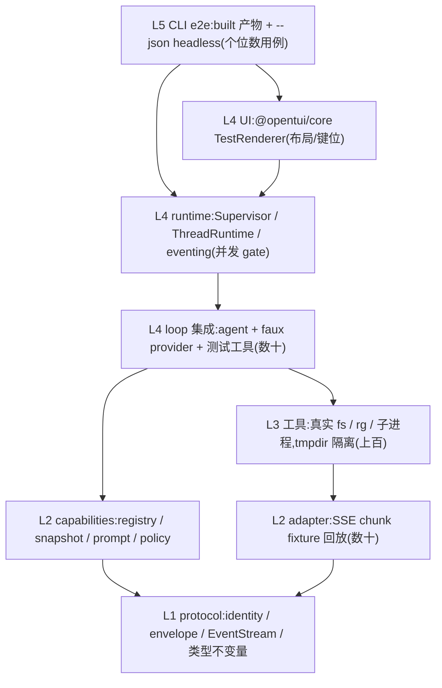

[← 返回地图](./README.md)

# 10 测试策略(Testing)

本文规定测试金字塔、faux provider 规格、adapter 的 SSE fixture 回放、steering/follow-up 的确定性测试方法、工具测试矩阵、OpenTUI 内存渲染回归、headless e2e，以及当前 CI 与规划门禁。运行时与测试框架统一为 Bun 1.3.14 / `bun:test`。Supervisor、identity、EventEnvelope、事件提交和能力快照的新增用例以 [12](./12-supervisor-runtime.md) 为 canonical 契约；CLI 产品化的用户旅程、surface 边界、presentation state、环境与性能门禁以 [13](./13-cli-ux.md) 为 canonical 契约；旧 M0–M7 标签仅用于定位既有测试族。

## 1. 测试哲学

四条原则,全部来自参考项目的正反面经验:

1. **默认离线、默认确定**。任何进 CI 的测试不碰网络、不依赖真实模型。能做到的前提是架构本身:agent 只认 `StreamFn`,于是一个脚本化的 faux provider 就能驱动全部循环逻辑;adapter 的流解析是纯函数(opencode V2 把协议做成 `step(state, chunk) → events` 的纯转换,正是为了可单测),于是录制的 chunk 回放即可覆盖。
2. **真实 IO 只出现在它是被测对象的层**。工具测试用真实文件系统、真实 ripgrep、真实子进程——mock 文件系统测 edit 等于没测(CRLF/BOM/mtime 全是真实 fs 行为)。除此之外的层一律无 IO。
3. **协议不变量用测试钉死**。StreamFn 铁律(绝不 throw)、事件三段式语法、tool_calls/tool 配对合法性——这些是文档承诺,每条都要有对应断言,防止实现漂移。
4. **并发与版本语义用对抗时序证明**。线程隔离、权威提交背压、observer 隔离和 catalog snapshot 不能靠“跑得够快”推断；测试必须把双方挂在 gate 上，在已知边界更新 registry、abort 或释放提交，并断言身份、顺序与使用的 revision。

### 1.1 已完成 Supervisor 迁移的分阶段门禁

以下记录实施阶段 0–3 时使用的门禁，当前保留为回归来源而非 active rollout。四阶段当时严格串行
推进：每一阶段先跑本节定向门禁，再跑既有回归与 `bun run check`。阶段 0–1 沿用 review-to-clear
闭环；阶段 2 起每个阶段实现完成后只允许两轮完整 review：第一轮发现问题后
直接修复并复跑定向门禁，第二轮重新覆盖完整范围并验证修复；第二轮的新修复继续复跑受影响门禁，
但不得启动第三轮完整 review。提交条件仍是没有已知问题且最终 check 通过。

| 阶段 | 新增测试面 | 必须保持的兼容面 |
|---|---|---|
| 0 · 冻结基线 | 两个 legacy `Session` 可同时停在各自 gate；同一 Session 的第二个 prompt 被拒绝；abort A 不释放/取消 B；mailbox/transcript 不串线 | 生产行为不变；默认 headless 仍逐行输出裸 `SessionEvent`，无 identity/envelope |
| 1 · 身份化 Runtime | opaque ID 不可混传的类型测试；Supervisor 跨 thread 并发；per-thread seq 独立递增并在 resume 后续接；重复 OpId 幂等；public runtime entry import 无副作用 | `Agent`/`Session` API 与默认 headless 逐事件深等投影；旧 JSONL 可读；显式 envelope 模式可用 |
| 2 · Session 拆分 | 六个协作者的窄单测；repository/committer gate 会背压 Agent；任意 observer gate/异常/退订不背压；control request/response 同链提交；headless 输出泵自行 drain | 当前单 Agent 生命周期、retry、compaction、approval、usage、恢复与事件相对顺序不变 |
| 3 · 动态 registry | schema/executor 热更新对抗；不可变 snapshot；PreparedInvocation 固定 validator/executor/args/resources/analysis/revision；resolver/policy/selector/analysis exact-shape；provider adapter snapshot；PromptAssembler/PolicyEngine 身份、冻结配置与权限矩阵；opaque/incomplete once-only；跨 thread FileTracker services 隔离 | 现有工具/provider 全经 adapter 后行为与错误形态不变；同 turn 永不混用 revision，CLI policy/freshness 不重解析 command |

阶段 0 的 characterization tests 只记录既有事实，不提前实现 Supervisor。至少需要下列可观察
断言：

1. A/B 两个 Session 的 faux stream 同时到达各自 gate，证明当前进程没有全局 active-run 锁；A
   的第二次 `prompt()` 仍被拒绝，证明门禁局部存在。
2. A abort 后 B 仍为 running，B gate 放行后正常 completed；A 的 steering/follow-up、转录与事件
   不出现在 B 的 provider `calls` 或转录里。
3. legacy `Session.subscribe()` 和默认 `--json` 的对象保持当前裸事件形态，不出现
   `workspaceId/threadId/runId/seq/event`。阶段 1 的兼容测试必须复用同一断言或黄金事件序列。
4. 同一 session dir 的 `Session.list()` 不按 cwd 过滤，且 `Session.resume()` 使用本次调用方注入的
   system prompt/cwd 配置；阶段 1 对跨 cwd CLI 的安全收紧必须作为显式差异单独测试，不能误称旧行为。
5. legacy ApprovalBroker 的 `approval_request` 必须先于对应 `tool_execution_start`，且 decision gate
   未放行时 executor 为零调用；这条顺序与后续 canonical control 的“先提交请求、再执行”同向。

阶段 1 的身份与 envelope 测试使用注入式 id generator/clock，不对 UUID 文本或真实时间做快照：

- 同一 thread 的 `seq` 从 1 严格递增；A/B 交错发事件时分别连续，不断言跨 thread 总序；close/
  resume 后第一条新事件大于持久化 high-water mark。
- legacy identity pure-function golden vectors 必须逐字匹配：
  `/work/alpha → ws_v1_33c68026e39376337b611a28b1e8f4625f1e0afe3fa140e3ab3b602ca944e5ee`，
  `/工作/甲 → ws_v1_b85604486dec545464d56c643ee14acee012d00576a42d3a7136127d5e3df119`，
  JSON literal `"C:\\repo"`（解码后的原始字符串含一个反斜杠：`C:\repo`）
  `→ ws_v1_06ae402892a0930119b83e143b055d02fba6f2461ec9d6f471600ea3056bea27`。
  在第一个 workspace 下 session `20250101-010203-abcd` 必须映射
  `th_v1_5754738e401cada8c5130e7b6c381e19fb19542fa43f659db399c7f4c6cad782`；不做路径/
  Unicode normalize，并用 `../escape` 对抗证明 ID 与 storage key 均不逃逸 root。
- 五类 ID、derive parts、cwd/sessionId、RuntimeOp string/key 的 well-formed Unicode gate 覆盖 empty、NUL、
  supplementary scalar 与两种不同 lone surrogate：Workspace/Thread/Run/Turn 的 NUL/合法 scalar 保持
  opaque，OpId/LegacyWorkspaceId 另须固定 origin/version alphabet；lone surrogate 在 UTF-8/
  lookup 前按各 public surface 的 typed code 拒绝。`createRuntime`、`events`、`getThreadSnapshot`、projector、
  legacy pure functions 与 RuntimeOp 逐入口断言零 IO/ledger/event；strict JSON 的两个 surrogate object key
  也不得退化为 insertion-order hash，普通 payload 的 empty string/key 则稳定 canonicalize。五类 identity
  的 empty 都拒绝，OpId 含 NUL走 `invalid_external_op_id`。`legacyThreadId` 只接受
  `LegacyWorkspaceId(ws_v1_+64hex)`，拒绝普通
  WorkspaceId，并用含 NUL 的 sessionId 证明 preimage 无歧义；含 lone surrogate 的 v1 meta quarantine 为
  `invalid_legacy_identity` 而不进入 catalog。
- `legacyWorkspaceId(raw)` 对 well-formed empty/relative/NUL raw string 仍有稳定 pure golden；但
  `createRuntime.workspace.cwd` 对 empty、relative、NUL 与当前 host 非 absolute 路径在 storage spy/lease
  前 reject `invalid_workspace_cwd`，且绝不调用 `process.cwd`/resolve/realpath。v1 global listing 对同类
  MetaRecord.cwd 返回 read-only `invalid_legacy_workspace_cwd` locator，mutable import/resume/provider/tool
  零调用；Windows/Unix 样例按运行测试的当前 host 判定。
- 每条可归属事件带正确的 workspace/thread/run/turn/op identity；未归属字段必须缺失，不能是空串。
- `newOpId()` 只产 `op_e_` + 32 lowercase hex，四类 internal derivation 只产稳定且互不碰撞的
  `op_d_` + 64 hex；submit 派生前缀/畸形 external ID 在 ledger 前 reject typed
  `RuntimeOpValidationError{code:'invalid_external_op_id'}`，不返回无法容纳 raw id 的 OpReceipt。
  unknown/required/nested-undefined/cycle/BigInt/nonfinite RuntimeOp 同样在 ledger 前 reject
  `invalid_runtime_op`（合法 raw external id 可用于边缘关联），不写 receipt/event；
  custom factory cross-origin/非法输出 fault，shared claim keyspace 的
  purpose/parts 冲突不能吞掉 cancel/control/result/runtime-close envelope。
  默认 derived golden（workspace=`ws_demo`）固定为：cancel parts
  `[op_e_00000000000000000000000000000000,th_A] → op_d_dcdea1751e98146913ba9f4ea6e2d82b021dd3863cfa9204b8d63125e971742c`；
  control `[th_A,req_1] → op_d_88bf94a9203f908053641af9283876a54b7cb9ea02aa3a4649a244132e780b47`；
  result `[th_parent,th_child,run_9] → op_d_824809be668f4f8b9dbd6cbfbdc712840ac05586936fb5128a07b4f370442c05`；
  close `[th_A,op_e_11111111111111111111111111111111] → op_d_108d0373c577a6437b9f141fd007ca7a434b3d757eaa0139e8ead4ea2c775df9`。
  另测同 tuple 不同 ID 与同 ID 不同 tuple 的双向 CAS conflict。
- 注入恶意 identity factory：不同 reservation key 复用已用 RunId/TurnId 必须
  `identity_collision` fatal，同 key crash/retry 则返回原 identity 且不再调用 factory。
  `reserveSuccessor(predecessor,reason)` 同 key idempotent；同 predecessor 换 reason/fork 是
  `invalid_successor_reservation`，provider 零调用。`reserveTurn({runId,turnOrdinal})` 同 key idempotent，
  ordinal/owner 错配拒绝；workspace 在同 run 下一 turn 收紧必须进入 turnCeiling，而安全材料相同的新
  run/turn ceiling revision 保持相同，不因 owner identity 漂移；legacy/static approval
  `control_request.policyRevision` 也必须逐字采用该 turnCeiling 组成的 revision，不能沿用 run 初值。
- turn reservation 在 ceiling/append 前失败时 driver 不推进 ordinal，capture-error closure 仍以 ordinal 1
  形成完整 error turn；appendPrepare 成功后 concurrent workspace fatal 也必须让同 key 取回原 TurnId，
  不追加第二条 prepare，且新 reservation 仍优先暴露 workspace fatal 而不是 active-run 跳号错误。
- legacy Session retry/compaction 的 host reservation gate 未放行时，不得发布 coordinator event 或
  启动内部 successor；放行后 event、后续 turn 与迟到 abort 都使用同一新 RunId，TurnId 逐采样新建。
- retry/compaction 决策后把 gate 卡在 predecessor agent_end 之前：reservation 未 durable 时旧 end
  不可见；放行后在该旧 end listener 中立即提交无 expectedRunId abort，必须固化/取消 successor，
  不能命中 predecessor/no-activity，也不能让新 sampling 越过取消。
- authoritative commit/reserveTurn hook reject 时不得开始 provider/tool/retry/compaction；普通
  Session.subscribe listener reject 仍按旧行为隔离，证明二者不是同一条会吞错的 fan-out 路径。
  `tool_execution_update` 的 authoritative commit reject 必须 latch writer fatal、abort 当前 run/tool
  child signal；即使 legacy `onUpdate` 调用点不能 await，后续 awaited emit/side-effect gate 也必须观察
  fatal，不能留下 unhandled rejection 后继续采样或启动下一项工具。
- 在 steering/follow-up 初始 poll 与 turn-boundary drain 前卡住 reserveTurn gate；队列不得先 mutation/
  发布。放行后 queue_update、注入消息、turn_start/整 turn 必须复用同一 TurnId。
- driver activity completion 在中间 willRetry agent_end、compaction 前 agent_end 和裸
  Session.prompt resolve 时都保持 pending；最终 successor/zero-turn compaction 权威结案后才返回
  status+terminalRunId，另行 queued prompt 的 completion 不被合并。
- PreparedThreadDriverCommand 的类型/运行时测试强制 prompt/continue 有 runId、同一 RunMutation 的
  permissionCeiling 与 durable resolvedInput、set_model 有 resolvedModel、abort 有 durable resolvedTarget；延迟到 successor 后 dispatch 的旧 abort 只 no-op/
  取消旧 id，绝不调用无目标的 Session.abort()。
- crash 落在 accepted/started prompt 的 input_materialized 前，resume 后显式 continue 必须把旧 op 的
  原文/sourceOpId 作为 prompt_input ownership-transfer，只一次进入 provider/transcript；clean residue
  才走 Session.continue，不能丢文、重复或改成 steering/follow-up。
- started run 已 recovery-interrupted、输入仍 suspended 时，snapshot 暴露
  `interrupted{ownerOpId,terminalRunId,inputOwnerOpId}` token；无 expected abort 或匹配 terminalRunId 的
  abort 只取消该 token/input ownership、不调用 driver.abort/复活旧 run。迟到旧 id 不得命中之后的
  successor；多个 reserved/interrupted item 混排时按统一 FIFO 逐个寻址。
- ownership-transfer 前旧 accepted prompt 的 superseded `op_completed.terminalRunId` 与 envelope.runId
  必须是旧 receipt 的 root RunId，不得写新 continue RunId；started recovery 的 terminalRunId 是旧
  causal chain 最后 successor，envelope.runId 仍归原 root。
- 新 thread 仅有 queued steer/follow_up、或纯 v1 seed residue 时，continue 可无 predecessorRunId；
  已知旧 run 的 recovery/retry continue 必须记录 predecessor，不能伪造一个 v1 RunId。
- 在 steer/follow_up accepted/started 但 queue mutation 前 crash，recovery 按 accepted FIFO 恰好一次
  enqueue+complete 且不启动 run；mutation 已完成则只 fold。旧 pending/started set_model 被显式 resume
  model supersede，并与 model_selected 同 commit，不尝试用历史秘密重解。
- legacy driver create 返回并持久绑定 durable Session ref；在 backend create→ledger bind 窗口 crash
  后，同 OpId/creationKey 重投不创建第二个文件。path-like ThreadId 不能成为路径，重启 resume 仍打开
  原 Session id。
- fresh create 的 initialCheckpoint 先 canonical commit 再 activate；resume/import 返回 checkpoint 与
  supplied committedCheckpoint 任一字段不同都 `driver_checkpoint_mismatch`、关闭 quarantined driver，
  provider/tool 零调用，不能用 stale queue/context 覆盖 snapshot。resume/import 的 close 明确成功且
  证明 activate 前零 host/mirror effect 时 release attach claim、允许新 OpId；close reject/unknown 保留
  claim/quarantine。fresh create 已产生 backend 时即使 close 成功也保留 create claim+creationKey，重试
  不得用新 OpId 创建第二份；activate 已开始失败同样保留。
- catalog 先用 canonical meta、final/pending create 的 validated driverRef/creationKey claim v1 mirror；
  正常 create 只列一个 canonical ThreadId，backend-create→bind crash 的 orphan 不作为 legacy 项冒出，
  恢复绑定后仍只有一项；只有 unclaimed 历史 v1 才用 legacyThreadId 映射。
- hot subscribe 与 snapshot 之间注入 queue/plan/control/partial tool/retry 更新；snapshot 的完整 reducer
  projection 含所有当前状态，丢弃 `seq <= highWaterSeq` 后再消费 live 不重复消息也不丢可行动状态。
  v1 transcript 由 snapshot hydrate，不能伪造历史 envelope。
- events option table tests empty/duplicate filters、duplicate cursors、cursor outside explicit filter、negative/fractional/
  unsafe afterSeq 在 `events()` 返回前同步抛 `EventCursorValidationError`，且即使永不调用 `next()` 也已
  hot-register shell。需要 durable lookup 的 cursor-ahead 与 future ThreadId 的非零 cursor 在首次
  `next()`、任何 event 前异步抛 typed `EventCursorValidationError`；future ThreadId 的 0 合法。
  threadIds 缺省时 cursor 只设置该 thread replay，其他 current/future thread live-only；retention-too-old
  同样在首个 event 前走 iterator `EventSubscriptionGapError`，不能静默跳过。stateful validation gate
  期间提交的 live event 在合法 replay 后无缺口/重复，非法 iterator 结案不关闭 Runtime。
- seq/highWater 注入 0、负数、小数、unsafe integer 与 `MAX_SAFE_INTEGER` 边界；0 只允许 empty
  high-water。下一 atomic batch 将溢出时 append/publish 均为零并报 `sequence_exhausted`，recovery 对
  非法 seq quarantine thread，不得 wrap/coerce/重复。
- 阶段 1 临时 writer 已必须逐 event 做 strict JSON deep snapshot：早期 message_update.partial commit 后
  producer 继续追加 token，旧 seq 的 durable/live/cursor replay 仍是旧内容；required cycle/BigInt/
  nonfinite/undefined 在 seq 前 fault，legacy optional bag 才 omit+diagnostic。两个 subscriber 不共享
  可变 envelope。阶段 2 提取 EventCommitter/EventHub 时重跑同组用例，不能把语义推迟到阶段 2。
- gate 卡在 legacy Agent transcript 内存已更新、但 authoritative-before-mirror host.commitEvent 尚未
  提交的位置；v1 JSONL mirror 必须仍未 append，snapshot 返回 writer 的旧
  checkpoint.frontend+旧 highWater。放行 canonical commit 后再允许 mirror append；在两者之间 crash，
  恢复只从 canonical checkpoint 补齐/重建 mirror，反向次序永不可构造。compaction 场景还要把 gate 卡在
  `compaction_end` 与 `{tailStartId,summary}` mutation 的同一次提交前；放行后 frontend/execution
  checkpoint/highWater 原子前进，crash+resume 的下次出站仍准确使用 committed summary+tail，不让
  v1 镜像覆盖 canonical state。
- Runtime claim v1 backend 后另用 exported direct Session 追加同一文件：adapter fingerprint 必须检测
  `legacy_backend_concurrent_writer`，canonical checkpoint/transcript/high-water 不吸收外来 record，并在
  下一 provider/tool 副作用前 quarantine；显式 resume 从 canonical 重建私有 backend 后恢复。该测试
  同时证明 SupervisorLease 不被误宣称能约束 direct legacy Session。
- 阶段 2 用同 cwd/session root、不同 id 与不同 streamFn/tools 配置构造两个 exported direct Session：
  它们各自通过 StandaloneSessionHost/private EventHub/sidecar lease 并行，均不调用 createRuntime 或取得
  SupervisorLease，A 的 abort/model/control/listener 不影响 B。approval allow_always 仍走各自 durable
  control→standalone outbox→共享 approvals CAS，receipt key 含 legacy thread；同一 backend/id 双 resume
  稳定 `session_in_use`，不同 id 不互斥。
- 分别在 committed queue_update、pending control_request、partial assistant/started tool、retry/
  compaction activity 后模拟 crash。resume barrier 必须无重复事件恢复 queue id/FIFO，稳定派生 aborted
  control resolution，给 in-flight work 明确 interrupted 终态并清 activity；thread_resumed/snapshot
  只能在 barrier 后可见，下一次 continue 用新 RunId 且不重放 provider/tool 副作用。
  若 crash 的是 child 且 parent unloaded，同一 recovery commit 必须写 status:error 的稳定 result
  outbox；parent resume 后恰好收到一次，delivery-window 再 crash 仍不重复 seq。
- 同一 `OpId` 重投返回 duplicate receipt，且 provider 调用数、工具副作用和 transcript append 次数
  均不增加；带旧 `expectedRunId` 的迟到 abort 不取消 successor run。
- RuntimeOp 对象 key insertion order/合法 optional undefined 不同但语义相同，canonical SHA-256 hash
  必须相同并返回 duplicate；已知字段值或 array/target scope 改变才 `op_id_conflict`，unknown/non-JSON
  字段在 acceptance 前拒绝。
- child 在父 unloaded 时完成，result outbox 保持 pending；父 resume 后只收到一次带稳定 resultOpId 的
  `thread_result`。在父 commit 与 outbox delivered 标记之间注入 crash，恢复重投仍不得产生第二个 seq。
- 不经客户重投启动 Runtime：`loadSupervisorOps()` 中 pending create/resume/cancel_scope 必须主动收束，
  frozen targets/derived OpId 不变。result delivery 同样从 child pending-delivered 差集恢复；父返回原
  result seq 后 append child `ThreadResultDeliveryRecord`，不得伪装成 RuntimeOp 或分配 child event seq。
- 同一 storage/workspace 同时构造两个 mutable Runtime：第一个在 recovery 前取得 SupervisorLease，
  第二个稳定失败 `workspace_in_use`，不得各自 attach parent/child。模拟 holder crash/OS lock release 后，
  新 Runtime 取得更高 fencing token 并恢复 pending parent result 与 subtree cancel；旧 port/token 的迟到
  thread append 必须被拒绝。`listStoredThreads()` 只读查询在 lease 持有期间仍可并发且不取得 mutable
  lease；workspace lease 不能把 A/B thread 的 provider/commit gate 串行化。
- 单独子进程只 import package 的 runtime export，比较 import 前后的临时目录、signal listeners、
  provider/TTY 探针和网络 spy，必须没有变化；测试从包外临时 consumer 按 `coda/runtime` 的
  package exports import 构建产物/声明，不直连 src/dist。显式创建 runtime 前不得读取配置或 `.env`。
- 对每个 canonical envelope 应用 legacy projector，所得事件与旧 Session/headless 黄金序列深等；
  阶段 1 legacy driver 把 `approval_request` 映为 `control_request(kind:'approval')`，反向 projector
  再得到原事件；`control_response` op 映回同一个 ApprovalBroker，阶段 2 前不冒充 durable control。
- 同时让 A/B 两个 legacy attachment 等待 approval/rule gate：二者必须有独立 ApprovalBroker、pending
  map、FileTracker 与 policy/doom-loop 状态，A 的 response/abort/read 不得释放或授权 B。对
  approval/resource pending request 提交不兼容 decision 必须得到 `invalid_decision` 且 waiter 仍 pending。
  对旧 approvalId 的迟到 `decision:'abort'` 必须用记录中的 owningRunId 生成 expectedRunId；successor
  已启动时稳定拒绝/no-op，绝不取消 successor。
- stage1 PermissionPolicyPort 在 parent run reservation 固定 ceiling；child meta 与 driver factory 收到
  逐字段同一 snapshot，resume 不重算。parent 配置随后放宽/收紧都不改写 child frozen ceiling；
  workspace 收紧从下一 run/turn snapshot 生效，已 prepare turn 只经 cancel/reprepare 撤销。
  同一 thread 的两个 run 使用不同 ceiling 时，driver 必须在 sampling 前切换；retry/compaction successor
  使用 `reserveSuccessor()` 返回并持久化的 ceiling，control policyRevision 随之变化且绝不提权。
  recovery ownership-transfer/explicit continue 只要有 canonical predecessor 也与其 ceiling 取交集；
  parent run 活动期间先收紧 workspace、再创建 child、随后放宽时，child 仍不得回升到旧 parent ceiling。
  workspace snapshot 由显式 `snapshotWorkspaceCeiling` 注入并与 resolveCeiling 收到的对象逐字段同一；
  thread_create/prompt/continue permissionNarrowing 进入 op hash/journal，缺省不额外收窄，retry 无新
  narrowing。root create 后 workspace 放宽也不能超过 persisted thread ceiling。
- 在没有模型、没有 attached thread/写 lease 的新进程中调用 `listThreads()`，仍可列出 canonical 与
  v1 索引项的 createdAt/title 并选最近项；选中并配置模型后验证 events → resume → snapshot 无缺口。
  端口 workspaceId 与同 cwd 的 v1 映射一致，newThreadId/newOpId 在首个 op 前可用且不写 journal。
  对每个 event family 逐表断言 runId/turnId/opId 的 required/omitted/matching 规则。
- 用自定义 tmp/in-memory `RuntimeStoragePort` 验证 core 不读 HOME/env；默认目录和 `--session-dir`
  覆盖按 09 的固定映射把 catalog、v1 import、canonical create/resume 接到同一 adapter，list 不 attach/
  不取 write lease，覆盖目录下不向真实 home 泄漏文件。
- workspace storage 首次原子绑定 `(workspaceId,recordedCwd)`；同 ID 以不同 raw cwd 重开必须在 lease/
  catalog/attach/provider 前 reject typed `workspace_binding_mismatch`，error 回显 stored/requested cwd，
  不做 realpath/case/Unicode normalization。相同 binding 重开才取得 lease并恢复。
- legacy CLI bootstrap 保持 global `--continue` newest、无 id picker 和显式旧 id 的选择结果；跨 cwd
  命中后必须告警并在 MetaRecord.cwd 所属 workspace/recorded cwd 执行（与阶段 0 invocation-cwd 行为
  的列明安全差异）。parser 断言 equals-form opaque id 不吞 prompt，空格 legacy-id 与
  `coda --resume "prompt"` 旧启发式不变，裸 `--resume` 仍 picker；global lookup 的 0/1/N 匹配分别
  not-found/direct/`ambiguous_thread_id`，构造两个 workspace 合法复用同 ThreadId，只有
  `--workspace=<ws> --resume=<thread>` pair 能唯一选择。
- create/resume/set_model 的 model_selected 与 lifecycle/op event 同 gate；resolver 失败不改 snapshot，
  gate 前 driver 不得先切换。crash 后只恢复最后 committed ModelRef，journal 从不出现 key/headers。
- create/resume 在确定性 pre-side-effect validation/model failure 时保留 rejected OpId receipt、释放独立
  ThreadId/attach claim，允许新 OpId 重试；factory/create/open 已开始且 outcome unknown 时保留 claim+
  creationKey，第二个 OpId 必须冲突。启动恢复最新 create/resume intent 而 resolver 返回
  `credentials_unavailable` 时，原 accepted receipt 保持、intent 结为 recovery_interrupted、catalog 为
  closed/unloaded 且 driver/provider/tool 零调用；随后新 OpId/new ModelRef 的显式 resume supersede stale
  intent，并分别覆盖有/无 durableRef 的 resume/create-by-creationKey 路径。
- parent topology admission 覆盖 missing/self/cross-workspace parent 的 `invalid_parent_thread` durable
  rejection；createdByRunId 只接受父 thread 在 acceptance 点当前 reserved/started active run，历史
  terminal/suspended/successor 已替换均 `stale_parent_run`。省略 run 时 ceiling 只继承 parent-thread+
  workspace。subtree cancel 的 unknown/unclaimed/cross-workspace root rejected 且零 derived op；合法 root
  universe 含自身，空 workspace scope accepted `targetThreadIds:[]`。多 target acceptance 中一项 writer
  fault 时 root reject `RuntimeScopeDispatchError`、成功项不回滚；同 OpId/recovery 只补失败项，全部
  accepted 后 receipt 固定 target list，后续 cleanup fault 仅是 per-thread diagnostic。
- raw approvalId 序列 `x,x,x~1` 时 canonical id 依次为 `x`,`x~1`,`x~1~1`，证明 suffix 只在各 raw
  base 自己的 namespace 中取最小空闲值；resolved/close/restart 后 used set 也不回收。gate 证明易失
  canonical→raw map 已安装后才 atomic commit request/used-id、再 publish；subscriber
  在 publish 回调中同步 response 能命中。commit 前 crash 可重用 candidate，commit 后/publish 前 crash
  恢复同 id，绝不另分 suffix。
- `RuntimePort.close()` 与 in-flight create/resume/cancel_scope/普通 submit 在 admission mutex 两侧逐项
  竞态：close 先赢的新 submit 抛 RuntimeClosedError；已登记 token 在无独立 validation/port/storage
  fault 时返回正常 accepted 或 durable rejected/superseded receipt；独立 fault 保持自身 typed error，
  绝不事后改成
  RuntimeClosedError。resolver 收到 close signal，忽略 signal 时 barrier 必须等待，
  且迟到结果不能越过 barrier 写入。drain 后从 ledger/catalog 重算 cohort；post-close close/submit/events/
  list/snapshot/new IDs 精确遵循 [12 §3.1](./12-supervisor-runtime.md) 表，RuntimeClosedError 优先于 malformed
  input，永久 Op/Run/Turn identity 不释放。
- default legacy headless golden 明确断言第二个 prompt 的精确裸 error 文本与未知 approval silent no-op；
  CLI-private receipt mapper 只读 command+receipt，public projector 仍纯函数且丢弃 op lifecycle。

阶段 2 的背压测试必须区分两个 gate，禁止只测“最终都收到”：

```text
commit gate 未开  → Agent 不得越过该事件的权威提交
commit gate 打开  → envelope 进入 EventHub，Agent 可以继续
observer gate 未开 → Agent 与另一个 thread 仍必须完成
shutdown           → headless 自己的输出泵等待 drain 后退出
```

repository 另有一组不依赖 wall clock 的增量 fold 门禁：generic repository 的 fold spy 证明 cold full fold
只在初始化调用一次，连续 N 次 hot append 的 incremental callback 只接收 N 条新增 record，而不是访问
`1+2+…+N` 条历史；thread journal 对每个 prefix 与不同 batch partition 比较 incremental state 和 cold
`foldThreadJournal(records)`，必须覆盖全部 Map/Set、envelopes、checkpoint 与 summary。测试还要证明同批
前一 record 的 mutation 对后一 record 可见、非法 suffix/append failure 不修改当前 projection、历史
validated envelope identity 不被重新 snapshot；连续 `message_update` 还必须保持未变化 transcript 数组及
历史 message 的 identity，证明 hot checkpoint path-copy 没有再次遍历巨大 tool result。性能调查可以用
冻结的长 journal 报告 full/incremental 耗时对照，但 CI pass/fail 只依赖上述 record-visit、identity 与
differential 不变量，不设置易抖动的毫秒阈值。

cold fold 还必须有非 wall-clock 的复杂度门禁：在已完成历史 message 中放置唯一大 sentinel，再跟随
多次累计 `message_update`，通过字符访问 spy 证明历史 payload 只在输入 record validation 与最终
checkpoint snapshot 中被常数次访问，而不是随 update 数重复扫描。另用“倒数第二个 partial 含非法
Unicode、最后一个 partial 合法”的 journal 证明每条中间 record 仍逐条 strict-validate；最终 checkpoint
必须与源 records 脱离并保持递归冻结，且继续与 incremental prefix/batch fold 逐字段等价。

文件 journal port 另以 fs spy 证明一次 writable load 后连续 N 次 append 不再调用 JSONL
`readFileSync`，但 reopen/cold load 仍逐字段得到相同 records。边界测试必须覆盖合法外部 append、同尺寸
新 inode replacement 都在写入前 fail closed，opened inode 与 replacement 均不被改写；非法 multi-record
batch 不得泄漏 candidate grammar state，随后同一合法 record 仍可追加。`ReasoningPart.kind`
的 `summary` / `content` 也必须经 canonical commit 与 reopen 原样 round-trip，未知 kind 在 storage boundary
fail closed。append-before-load 还要证明只
lazy full repair 一次；既有 torn-tail/final-LF 用例继续证明显式 writable load 是 repair/rebase 点。

同时对每个 observer 断言局部 FIFO；慢 observer 队列溢出必须得到显式 disconnect/gap，observer
throw 不得变成 run error。approval 请求先提交再等待，response 也先提交再 resolve；abort 竞态的
结案必须是 aborted，不得投影成 deny。分别断言 gap iterator drain 后 throw
`EventSubscriptionGapError`、writer fatal drain 后 throw `RuntimeEventStreamError`、RuntimePort.close
不等 consumer 且把 end marker 排在已入队事件后，iterator 消费完 buffer 再正常 done；headless 只把
前两者投影成无 seq 的 transport_error。
同一 attachment 重复 RuntimePort.close 使用同一个 derived close OpId；随后以新 lifecycle OpId
resume、再次 RuntimePort.close 必须得到新 derived OpId 并真正关闭，不能复用旧 receipt no-op。

阶段 2 还必须覆盖 control/bridge/facade 的完整状态机：

- Runtime 每 workspace 只构造一个 EventHub，A/B EventCommitter 都发布到它；预订 future ThreadId、
  workspace-wide filter 与 cursor replay 无缺口。thread-fatal 只终止包含该 thread 的订阅。有限 native
  observer 溢出显式 gap；无 gap channel 的 Session facade 把 listener 卡过 hub capacity 后从 durable
  cursor 补齐、不重排/重复且不背压 run。listener reject 只诊断并推进该 event cursor，后续 event 仍
  投递；仅 unsubscribe/close 移除并释放 retention pin。
- control_response acceptance 原子 first-wins claim：第二 ExternalOpId 得到
  `control_response_already_claimed`，winner 同 OpId duplicate 返回原 accepted receipt。accepted_pending
  在任何 pattern/grant effect 前先 durable `op_started`；crash recovery 不重复 started。repository
  `definitely_not_applied` 让 response interrupted+release claim、request 保持 live，且只有**新** OpId 可
  重试；同 OpId 仍回原历史 receipt。conflict/fenced/unknown 保留 claim并分别 workspace quarantine/
  stop/degrade，三者均停止新 admission/capability execution。
- approval/resource kind mismatch 的 invalid_decision 必须在 op_accepted/first-wins claim 前 rejected：
  无 claim/started/resolved，request 仍 pending，随后 valid 新 OpId 可 accepted。阶段 3 canonical
  workspace 缺 grantProposal 的 allow_always 重跑同一 pre-claim 用例；legacy-global normalize-once 分支
  则是合法 acceptance。
- 在同一 thread 跨 op-type 的 accepted FIFO 构造 R(allow_always response)→A(abort/close) 与 A→R：前者先完成幂等 policy effect+
  control obligation 再处理 A；后者先 aborted request，R superseded 且 effect/executor 零调用。resource
  confirmation confirm/deny 的旧 waiter recovery 同样以 interrupted/aborted 结案，不伪装 approval。
- durable legacy bridge 覆盖 non-empty non-force multi-pattern 的 reserve-outbox→global CAS→finalize→
  control 顺序、force/empty 降级 once、tolerant corrupt approvals.json→empty+diagnostic，以及每个 crash
  window。阶段 2→3 upgrade 在 workspace barrier 下逐 thread 按完整 accepted FIFO inventory（不比较不同
  thread 的先后），并用 fence-bound 只读 inventory probe 探测阶段 2 pending reserved pattern outbox：仅
  live legacyProposal effect obligation 或该 reserved outbox 才打开 recovery-only legacy writer；明确无
  obligation 时不得打开。阶段 3 legacy-global `PolicyGrant` receipt 由 PolicyGrantRepository 自恢复，不算
  阶段 2 pending。probe 缺失/非法/失败，以及需要 writer 时缺 adapter/storage extension，均为
  `legacy_approval_recovery_unavailable` construction failure；恢复后 writer 关闭一次，且不开 preflight、
  不迁移 grant、不重放 executor。
- facade `setModel(ModelConfig):void` 的 trusted resolved-model admission 验证 ref 一致并只持久 ModelRef；
  调用返回后 `currentModel()` 与紧随 prompt 的 driver 立即看到同一完整 config。public set_model 仍走
  async resolver；trusted sidecar 不落盘，durable failure fail closed而不静默 rollback。其余 sync guard/
  throw 与 prompt/continue settle boundary 保持 legacy golden。

JSON snapshot 对抗测试把 ProviderEvent.partial/details/update 原对象在 commit 后继续 mutation，durable
record/live event 不得变化；cycle/BigInt/function/symbol/nonfinite/undefined required 值在 seq 分配前走
明确 fatal，legacy optional details/update 则整项 omit 并产生 diagnostic。observer A 尝试修改
envelope、nested partial/details 和 batch array 后，observer B 与 cursor replay 必须仍逐字段等于
durable record；A 的行为不得变成 run error。

阶段 3 的核心是一个可重复的双 registry 热更新剧本：turn T 捕获 capability/provider revision 1 后，
provider gate 暂停；此时 update/unregister live registry，再让 T 发出 tool call。断言 T 的 prompt schema、
registrationDigest、validator/resource resolver、PolicyEngine 输入、executor 与 StreamFn 全为 revision 1；
下一 turn 才整体看到 revision 2/移除结果。再覆盖：

- 从包外临时 consumer 只经 `coda/runtime`、`coda/capabilities` 与
  `coda/legacy-coding-tools` 的 package exports 编译并运行 registry-mode 最小组装：四个 public
  `create*` factory、built-in binding adapter、host-provided base/rule/freshness/storage ports 能构造
  `RuntimeCapabilityServices` 并通过 `createRuntime`；不得 deep-import src/dist。ESM import 与 `.d.ts`
  resolution 都通过，且单独 import `coda/runtime` 仍不加载 zod/具体工具/provider SDK 或产生 ambient IO。
- capability/provider mutation table 覆盖 duplicate、missing、id/api mismatch、expectedRevision conflict
  均不推进 revision，register append、update 原槽、unregister+register 末尾顺序稳定；两者都校验
  `impl_sha256_` 格式，并分别逐字匹配 capability 的 `capreg_v1_…`、provider 的 `providerreg_v1_…`
  domain/canonical payload 与 golden。capability `(id,version)`、provider `(api,version)` 在各自 registry
  history 内换 digest 都拒绝。注册后改写原对象、resolve 返回值或 live registry 都不能改变旧 snapshot；
- raw args 与 validator value 在 freeze 前 strict JSON copy；prepare/validate/resource resolver throw、
  required resource 缺失、额外/歧义资源、非法 JSON 及 catalog/InvocationContext/
  EffectivePolicySnapshot context 错配都返回 typed recoverable failure且 executor 零调用。bash/path analyzer
  与 executor 同 registrationDigest；PreparedInvocation 固定 schema/metadata/policy/validator/executor、
  normalized args/resources/analysis、executionMode、原 toolCallId 与同 turn effective policy，approval 等待期间
  不换版。resolver 省略 analysis 时固定规范化为 complete/persistable/eligible/空 attributes；显式 analysis
  strict-copy/deep-freeze，非法 reasons、inherited/accessor/unknown fields fail closed。registration policy/
  selector、resolution/resources 与 analysis 边界都必须用 exact own-data-property shape，拼错 selector key 不得
  被静默忽略；
- generic legacy adapter 缺显式 binding 一律 `invalid_registration`，不得按 tool.name/kind 猜。integration
  工厂必须恰好产出 read/ls/glob/grep/bash/edit/write/plan 八项及 [07 §1.2](./07-tools.md) 的 selector 表；
  schema、policy、resolver/analyzer、executor 的同一 registrationDigest 热更新对抗全链一致。用两个
  type/access 相同但 selectorId 不同的 selector 证明 resolver 按 id 精确绑定；同 selector 多 target
  合法，完整 tuple 才去重，required missing/unknown/type-access mismatch 均 fail closed；
- authoritative Bash resolver 覆盖 literal `cd`、directory `-C`、输入/输出重定向、裸相对文件与目录，
  并把可见 filesystem target 保守绑定 read + write。substitution/opaque script、项目外路径与
  canonicalization 不全都保留 askable invocation，但 analysis 必须是 incomplete 或 once_only，绝不生成/
  命中持久 grant；危险命令产生 `safety:deny`。CLI policy 只消费 exact-shape
  `legacy_bash_analysis_v2` frozen attributes/resources：篡改 PreparedInvocation.args 后 decision 不变，spy
  证明 evaluate 不调用 analyzer/realpath/live filesystem。完整项目内 pattern 继续匹配 legacy remembered
  approval，opaque/external pattern 即使预存也只能 ask once；
- Python/Node/Bun/Deno/Perl 等 direct、script 与 runner-wrapped interpreter 入口必须冻结为 opaque/
  incomplete/once-only；先存 `bash:python *`/`bash:node *` 也不能免审后续 inline code。catastrophic deny
  覆盖 `rm -rf //`、`/./*`、HOME 词法等价形态及 BusyBox/Toybox dispatcher，全程不读取 HOME/filesystem；
- 八个 built-in binding version/digest v2 冻结 exact `filesystemTargets`：file、directory 与冲突后的 unknown。
  facts 与 resources 集合不一致 fail closed；对同一 PreparedInvocation 在 prepare 后创建/替换目标，freshness
  scope 不变，且 spy 证明不对 target 做 stat/realpath。file 只取父目录，directory/unknown 取自身保守链；
- RuleSnapshot capture 固定 owner、四维 budget、正文/digest、canonical path、root→narrow 顺序和 diagnostics；
  capture failure 不采样。BasePromptSnapshot、RuleSnapshot.owner 与 EffectivePolicySnapshot.context 的
  workspace/thread/run/turn/cwd，以及 base prompt/model ref 任一错配，PromptAssembler 都返回 typed
  `invalid_prompt_context` 且 provider 零调用。assembler 只读传入的 outbound messages、base prompt、
  `effectivePolicy.rules`、model/catalog，返回深冻结 Context，不读 live transcript/registry/filesystem/env/secret；
- 分别把 grant snapshot、RuleSnapshotProvider、BasePromptProvider、ThreadPolicyEngine capture 卡在永不
  自行释放的 gate，再提交目标 run abort：每一处都必须由 capture signal 唤醒，形成配对 aborted
  assistant/turn_end/agent_end，provider/executor 零调用，abort op、waitForIdle 与 close 全部完成；后台
  只读 promise 的迟到 resolve/reject 不得产生 unhandled rejection 或第二份 capture；
- `ThreadPolicyEngine.capture()` 的 `ceilingRevision`、`policyBasisRevision`、`grantRevision` 与 combined revision
  分开断言：engine/constraints/ceiling/rule 改变会改 basis，新增 grant 只推进 grant/combined revision，
  不让新 grant 自失效。evaluate 只读同一 PreparedInvocation；identity/constraint 缺失或 context mismatch
  fail closed，spy 证明它不读 mutable rule/grant store、filesystem，也不执行 capability。construction-time
  policy configuration 进入 basis：CLI 的 approvalMode、projectRoot、projectRootReal、bashAnalysisVersion
  任一改变都会改变 policyBasisRevision，旧配置 snapshot/grant 不得跨配置命中；
- RuleSnapshot/policy basis 的 revision golden 排除纯 owner run/turn identity：相同安全材料的新 turn/run
  basis 相同，ceiling/rule/constraint material 改变才变化；combined revision 仍绑定当前 context。每个
  attachment `PolicyEngine.openThread()` 得到独占 doom-loop state，同 invocation digest 第三次 ask 不再
  proposal；A 的计数不影响 B，普通 abort/continue 不重置，recovery attachment/thread close 才重置；
  openThread throw/owner mismatch 在 driver activate/provider/executor 前 fail closed并清理已有资源；成功
  engine 每 attachment close 恰好一次，close fault 进入 aggregate cleanup而不复用实例；
- ask 的 grantProposal 随 pending control 冻结。canonical workspace mode 无 proposal 的 allow_always 返回
  `invalid_decision` 且保持 pending；legacy-global mode 则提交
  `control_resolved{decision:'allow_once',requestedDecision:'allow_always'}`、仅执行一次且不记忆。
  合法 allow_always key 完整绑定 workspace、capability id/version、registrationDigest、frozen
  PolicyGrantScope 与 policyBasisRevision，明确不使用会被本次 grant 推进的 grantRevision/combined revision；
- registry-mode Runtime 必须在取得 SupervisorLease 后调用
  `RuntimeWorkspaceStoragePort.openPolicyGrantRepository(lease, grantMode)`；port 缺失/open 失败在
  recovery/attach/provider 前使构造失败。bound repository 的 commit 在**同一 workspace transaction**
  原子比较 captured fencing token 并 reserve grant mutation，workspace mode 还必须在该事务内保存 grant；
  wrong workspace、post-release/旧 token typed fenced，单独 `validateWriteFence()` 的 check-then-act 不能
  通过测试；close 也纳入构造失败/正常退出门禁；
- upgrade barrier 用 action log 固定 `legacy:open → per-thread legacy FIFO/unresolved-request recovery →
  legacy:close → grants:open → PolicyEngine/driver attach`；control-only journal 不打开 legacy writer，
  effect/outbox 才打开。close 失败时 grants/engine/driver 均为零，registry create/resume input 永远没有
  `legacyApprovalPatterns`；同 journal 并存的 registry grant response 留给 grant repo 打开后的正常 recovery；
- registry `ruleBudget` 带 symbol、accessor、non-enumerable、额外字段或 non-plain prototype 时，在
  `storage.openWorkspace` 计数仍为 0 时拒绝；合法四字段 snapshot 在 host 随后改写原对象时保持不变；
- grant flush gate 未开时不得提交 control_resolved、resolve waiter 或调用 executor；commit
  `definitely_not_applied` 使 response interrupted、释放 claim而 request 保持 pending，仅新 OpId 可重试；
  conflict/fenced/unknown 保留 claim，并分别 quarantine/stop/degrade 整个 workspace，全部停止新 admission/
  capability execution。grant 成功而 control commit 前 crash，恢复以同 response
  ExternalOpId 得到 duplicate grant 并恰好一次补 control；若旧 waiter/run 已消失，先完成 grant/control、
  再把 activity 记为 interrupted，executor 必须保持 **0 次**。allow_once 不写 repository，后续 turn 才
  捕获新 grantRevision；
- legacy-global compatibility proposal 的多 pattern strict-copy、去重、UTF-8 排序后整组进入 fenced
  workspace outbox；同一 transaction reserve `(grantId,patterns)` 后才用跨 workspace lock/CAS 原子更新
  shared approvals Set 并 finalize。两个 workspace holder、outbox/CAS 各 crash window、旧 holder 迟到写与
  新 holder 恢复都不得丢复合 bash 的任一 pattern、重复授权或接受未 reserve 的 stale mutation；既有
  跨 cwd/global approval scope 黄金用例保持。阶段 2 legacy outbox 同样注入 rename 已成功、directory
  fsync 失败的窗口：结果必须是 unknown outcome/throw，reserved receipt 与 response claim 保留，绝不能
  返回 `definitely_not_applied` 后允许新 OpId 叠加授权；
- RuleFreshnessPort 在 preflight 与真实 execute 前只读 frozen RuleSnapshot/resources/analysis；同批前序工具改写
  AGENTS.md 后，后序工具得到 recoverable stale deny、零副作用，下一 turn 才重捕获/assemble。freshness
  不能升级为 allow/ask 或替换 PreparedInvocation，也不能检查 command resource、解析 args/shell 或重建
  capability resource 语义；它只允许读取当前规则文件/目录指纹以回答 freshness。`rule_scope_missing.missingScopes` 必须是
  `RuleFreshnessPort.check()`
  返回的 non-empty strict-copy、去重、UTF-8 排序精确集合，runtime 逐字持久化，不能从 canonicalTarget
  猜 scope；
- 同 assistant message 的 duplicate toolCallId 在 final message commit 前转为 nonretryable
  `duplicate_tool_call_id` error assistant，control/tool_execution/ToolResult/executor 全为零；不同 turn 可
  复用同 raw id，TurnId 与按 ordinal 派生的 invocationId 必须不同。parallel batch 中 source ordinal
  决定 invocationId，completion order 不得改变它；
- child 创建时持久化父 run ceiling/provenance；随后 parent/workspace 变化及 crash/resume 不改写 frozen
  ceiling，workspace 收紧只从下一 run/turn 生效，已 prepare turn 仅经 cancel/reprepare 撤销。两个 thread
  共用 entry 时 FileTracker/services、abort、policy/control 仍隔离；path-like ThreadId/toolCallId 经 safe
  storage key 后不逃逸 truncation root。legacy sequential 批/call.id、工具/provider fixture、loop、
  Session facade、headless 与 TUI 黄金序列全绿；未知 provider api 仍按 StreamFn 铁律给流内 error。

### 1.2 阶段 3 当前测试归属与兼容边界

阶段 3 已不再只有未来测试计划。当前实现的直接证据按职责归属如下；新增回归应补进对应层，而不是
另建一个只从 private state 猜结果的“大集成测试”：

| 实现面 | 当前直接测试 |
|---|---|
| capability registration digest、mutation、immutable snapshot、prepare/resource/analysis binding 与 exact-shape 拒绝 | `src/capabilities/registration-digest.test.ts`、`capability-registry.test.ts` |
| provider registration digest、mutation 与旧 snapshot StreamFn 固定 | `src/capabilities/provider-registry.test.ts` |
| PromptAssembler owner/model/context 校验与深冻结 | `src/capabilities/prompt-assembler.test.ts` |
| conservative PolicyEngine revision/grant/doom-loop/thread isolation、configuration basis、analysis safety/grantability | `src/capabilities/policy-engine.test.ts` |
| generic zod legacy adapter、八工具显式 binding 与 authoritative Bash analysis/once-only | `src/capabilities/legacy-tool-adapter.test.ts`、`src/integrations/legacy-coding-tools/index.test.ts` |
| Agent runtime-turn seam、同 turn schema/executor 版本固定、duplicate toolCallId | `tests/agent-loop.test.ts` |
| CLI registry composition（八工具 + OpenAI Chat/Responses + Anthropic + faux）、冻结 policy basis/Bash projection、legacy approval compatibility | `src/cli/capability-services.test.ts` |
| CLI `ProjectRules` 的结构化 snapshot/freshness、frozen analysis、无 command reparse、budget/owner/path/stale fail-closed | `src/cli/project-rule-capability.test.ts` |
| workspace/legacy-global grant repository 的 snapshot、幂等/conflict/fence/corrupt-store | `src/runtime/memory-storage.test.ts`、`src/runtime/file-storage.test.ts` |
| package exports、外部 ESM/`.d.ts` consumption、依赖边界 | `e2e/capabilities-package.test.ts`、`tests/boundaries.test.ts` |
| registry Runtime turn capture、freshness、control/grant 与 attachment cleanup | `src/session/thread-runtime.test.ts` |
| registry driver 只执行 runtime turn、阶段 2 legacy approval 仅作历史 recovery | `src/integrations/legacy-session-runtime/index.test.ts`、`src/runtime/supervisor.test.ts` |

production CLI 与未由 Runtime 注入 internal turn provider 的普通 direct Agent/direct Session 仍走 static
compatibility path，因此阶段 3 的“兼容 fixture
全绿”是对既有 test suites 的保留要求，不应误写成 `main.ts` 已默认启用 registry。CLI registry
composition 测试只证明显式 factory 可无 ambient IO 组装八工具、四 provider 与
`legacy_global_approvals_v1` policy；`ProjectRules` 的独立 adapter 测试证明同一对象可提供结构化
snapshot/freshness。两者已经具备显式组合所需端口，但 production `main.ts` 仍按兼容矩阵有意保留
static composition；以后若切换默认路径，仍须通过阶段 2 legacy recovery 与本节完整门禁。

## 2. 测试金字塔



| 层 | 位置 | 依赖 | 速度目标 |
|---|---|---|---|
| L1 protocol | `src/protocol/*.test.ts` | 无(零运行时依赖是该目录的架构约束) | 毫秒级 |
| L2 adapter | `src/providers/<adapter>/*.test.ts` + `__fixtures__/` | fixture 文件 | 毫秒级 |
| L2 capabilities | `src/capabilities/*.test.ts` | protocol、注入式 registration/policy | 毫秒级 |
| L3 tools | `src/tools/*.test.ts` | tmpdir、rg 二进制、`Bun.spawn` | 秒级 |
| L4 loop | `tests/agent-*.test.ts`、`tests/transform.test.ts`、`tests/approval.test.ts`、`tests/plan.test.ts`、`tests/session*.test.ts`、`src/session/*.test.ts` | faux provider | 毫秒级 |
| L4 runtime | `src/runtime/*.test.ts`、`tests/supervisor-baseline-characterization.test.ts` | faux provider、tmpdir、gate/idgen/clock | 毫秒至秒级 |
| L4 CLI / UI | `src/cli/*.test.ts` | 纯 parser/controller/renderer fixture；`tui.test.ts` / `ux-characterization.test.ts` 使用 `@opentui/core/testing` 内存 renderer + mock highlighter | 毫秒至秒级 |
| L5 e2e | `e2e/*.test.ts`(`bun run test:e2e`) | `Bun.build` 构建产物 | 数秒 |

Agent 当前的 loop/steering/abort/transform 是跨模块契约，因此测试按
[CODING_RULES](./CODING_RULES.md) 放在 `tests/`，`src/agent/` 当前没有共置 `*.test.ts`；不得把
测试金字塔中的目标路径误写成已存在的文件。CLI 覆盖也不只有 TUI renderer：当前
`src/cli/` 中的 parser、headless/envelope、provider command、presentation、Runtime frontend、
one-shot output 和 TUI 都有共置测试。

L1 要点(不展开):`EventStream` 的 push/end/result 语义(end 后 push 被忽略并产生开发模式警告(console.warn)、迭代器收尾、result 在 end 前 pending)、单消费者迭代顺序，以及
`runtime-events.test.ts` 对 `partial`/contentIndex/terminal block 一致性的校验。“随机事件序列折叠后
等于 done 消息”的固定种子属性测试实际位于 `src/providers/faux/faux.test.ts`，它是
faux provider 的可执行事件语法门禁，不是 `src/protocol/` 中的 L1 用例。

## 3. faux provider 详细规格

`src/providers/faux/` 不是测试夹具堆,而是**正式 provider**:实现 `StreamFn`、遵守全部协议不变量,e2e 也用它(CLI `--provider faux`)。它同时是内部协议的可执行规格——faux 自己违反事件语法,L4 全线报警。

### 3.1 接口

```ts
// src/providers/faux/types.ts
export interface Gate { open(): void; readonly opened: Promise<void> }
export function createGate(): Gate;

export type FauxEventSpec =
  | { kind: 'text'; text: string; chunkSize?: number }        // 按 chunkSize 拆成多个 text_delta,默认 8
  | { kind: 'reasoning'; text: string; chunkSize?: number }
  | { kind: 'tool_call'; name: string; args: Record<string, unknown>; id?: string;
      truncatedRaw?: string }                                  // 配合 stopReason:'length' 模拟截断参数
  | { kind: 'gate'; gate: Gate };                              // 暂停发射直到测试放行(受控注入点)

export interface FauxTurn {
  events?: FauxEventSpec[];
  stopReason?: StopReason;    // 缺省推断:有 tool_call → 'tool_calls',否则 'stop'
  error?: { message: string; details?: ProviderErrorDetails }; // 以 error 事件收尾(stopReason 'error')
  usage?: Partial<Usage>;     // 缺省 { input: 100, output: 10 }
  onRequest?: (model: ModelConfig, context: Context, options?: StreamOptions) => void; // 出站断言钩子
}

export interface FauxScript {
  turns: FauxTurn[];
  onExhausted?: 'throw' | 'emptyStop';   // 脚本耗尽:测试默认 'throw'(多余请求即 bug),e2e 用 'emptyStop'
}

export function createFauxStreamFn(script: FauxScript): StreamFn & {
  readonly calls: { model: ModelConfig; context: Context; options?: StreamOptions }[];  // 深拷贝留档
};
```

### 3.2 行为语义

- 第 n 次调用消费 `turns[n]`;调用参数深拷贝进 `calls`,供测试断言 transform 层的出站产物(aborted 消息被过滤了吗、孤儿 toolCall 补结果了吗、steering 注入位置对吗)。**断言出站转录永远用 `calls` / `onRequest`,不要去猜 agent 内部状态**。
- 事件发射逐个 `await Promise.resolve()` 让出微任务,保证消费端观察到真实的流式顺序;**不用计时器**,除 gate 外没有任何时间依赖——这是确定性的根基。
- 严格遵守事件语法:`start` → 各内容块三段式(`*_start`/`*_delta`/`*_end`,contentIndex 递增)→ `done` 或 `error`;每个事件带逐步生长的 `partial` 快照;`tool_call` 的 arguments 分片经容错 JSON 解析持续刷新——与真 adapter 行为一致。
- **铁律同守**:faux 一旦被调用绝不 throw/reject(pi 的 StreamFunction 铁律)。`onExhausted: 'throw'` 的「throw」发生在测试进程的断言层面(通过 `stream.push` 前检测并 fail 测试),不是 StreamFn 抛异常。
- abort:在每个事件发射间隙与 gate 等待中检查 `options.signal`;已 abort 则立即以 `error` 事件收尾,`partial` 保留已发内容,stopReason 'aborted'——精确复刻真 adapter 的中断形态。
- `error` turn:先发 `events` 里的内容(可模拟「流到一半断掉」),再发 `error` 事件,消息带 `errorDetails`(见 [08](./08-session-persistence.md) 5.1),让 retry 分类逻辑可离线测试。
- length 截断:`stopReason: 'length'` + `tool_call` 的 `truncatedRaw`(写入 `rawArguments`,`arguments` 为容错解析结果)——用于验证 loop 层「length + toolCalls 全批合成错误结果不执行」的规则。

### 3.3 gate:受控注入点

gate 是本方案唯一的同步原语,把「时序巧合」变成「显式放行」:

```ts
const gate = createGate();
const streamFn = createFauxStreamFn({ turns: [
  { events: [ { kind: 'text', text: 'thinking...' },
              { kind: 'gate', gate },                    // 流悬停在此
              { kind: 'text', text: 'done' } ] },
]});
agent.prompt('go');
await waitForEvent(events, 'message_update');   // 确认流已开始
agent.steer('改用方案 B');                       // 流式中途注入——必须入队而非立即生效
gate.open();
await agent.waitForIdle();
```

pi 的教训「steering UI 队列靠消息文本 indexOf 匹配回收会误伤重复文本」提醒我们:队列断言一律用 `QueuedMessage.id` 与 `source` 字段,不用文本内容匹配。

## 4. adapter 测试:SSE chunk fixture 回放

### 4.1 结构:把流解析做成可注入 chunk 的纯入口

openai-node 的 `ChatCompletionStream.ts` 内部处理了大量累积边界(tool_calls 按 index 拼装、usage 尾 chunk、in-band error)。我们决定不用这个 helper(事件粒度与错误策略不匹配,见 [04](./04-provider-adapter.md)),等于把这些边界全接到自己手里——**必须用 fixture 回放守住同等覆盖**。为此 adapter 内部拆出纯函数入口,测试不 mock openai SDK、不碰网络:

```ts
// src/providers/openai-chat/consume.ts(内部模块,测试直接 import)
export function consumeChatStream(
  chunks: AsyncIterable<unknown /* ChatCompletionChunk 形状,不 import openai 类型到签名 */>,
  init: { model: ModelRef; compat: CompatFlags },
  out: ProviderEventStream,
  signal?: AbortSignal,
): Promise<void>;
```

fixture 是 JSONL:一行 = 一条 SSE `data:` 的 JSON payload,存 `src/providers/openai-chat/__fixtures__/`。测试 helper `replayFixture(name, compat?)` 返回 `{ events: ProviderEvent[]; final: AssistantMessage }`。

```jsonl
{"id":"c1","choices":[{"index":0,"delta":{"tool_calls":[{"index":0,"id":"call_a","function":{"name":"read","arguments":""}}]},"finish_reason":null}]}
{"id":"c1","choices":[{"index":0,"delta":{"tool_calls":[{"index":0,"function":{"arguments":"{\"path\":\"a.ts\"}"}},{"index":1,"id":"call_b","function":{"name":"grep","arguments":"{\"pattern\":\"x\"}"}}]},"finish_reason":null}]}
{"id":"c1","choices":[{"index":0,"delta":{},"finish_reason":"tool_calls"}]}
{"id":"c1","choices":[],"usage":{"prompt_tokens":120,"completion_tokens":31}}
```

### 4.2 fixture 清单(canonical,M2 验收项)

| fixture | 场景 | 关键断言 |
|---|---|---|
| `basic-text.jsonl` | 正常文本流 | `start` → `text_start/delta*/end` → `done`;拼接 content 与 `text_end.content` 一致;stopReason 'stop' |
| `parallel-tool-calls.jsonl` | 两个 tool_calls 按 `index` 交错分片 | 按 index 定位槽位不串包;arguments 逐段拼接;流式期间容错解析持续刷新 `arguments`;两个 `tool_call_end`;stopReason 'tool_calls' |
| `interleaved-tool-calls.jsonl` | index 0 → 1 → 0 的迟到分片 | 迟到的 index 0 delta 仍回到原槽位；每个 ToolCallPart 的 `arguments === JSON.parse(rawArguments)` |
| `usage-chunk.jsonl` | `include_usage` 的尾 chunk(`choices:[]`) | 空 choices 的 usage chunk 不 crash;Usage 换算为 inclusive 口径(含 cached/reasoning 明细字段映射) |
| `usage-missing.jsonl` | provider 未发 usage chunk | usage 各字段为 0/undefined,无 NaN;done 正常 |
| `length-truncated.jsonl` | `finish_reason:"length"` 且 arguments 半截 JSON | 照常产出 ToolCallPart;`rawArguments` 保留原始截断串;stopReason 'length'(不执行是 loop 层的事,adapter 不管) |
| `in-band-error.jsonl` | 流中 `data: {"error":{...}}` | `error` 事件;stopReason 'error';errorMessage 含 code/message;errorDetails 分类正确 |
| `missing-tool-call-id.jsonl` | delta.tool_calls 无 `id` 字段 | 兜底生成 `call_<uuid>`;同一槽位后续 delta 仍归并到同一 toolCall;两次回放 id 不冲突 |
| `reasoning-content.jsonl` | 第三方方言 `delta.reasoning_content` | compat.reasoningFormat 开启时产出 ReasoningPart 与 `reasoning_*` 三段事件;关闭时忽略不 crash |
| `empty-choices-keepalive.jsonl` | 中途出现 `choices:[]` 且无 usage 的 chunk | 静默忽略;后续 chunk 正常处理 |
| `text-then-tool.jsonl` | 同一响应先文本后 tool_calls | contentIndex 正确递进;`text_end` 在 `tool_call_start` 前 |
| `content-filter.jsonl` | `finish_reason:"content_filter"` | 走 done 分支正常收尾;stopReason 'content_filter' |

上表是当前 12 个 synthetic canonical fixture。`recorded-kimi-text.jsonl` 与
`recorded-kimi-tool.jsonl` 是额外的真实网关录制回归，不纳入这个计数。fixture 之外的错误路径用单测
直接构造(无法录成 chunk):SDK `create()` reject(APIError with status)→ 流内 `error` 事件、
绝不向外抛(**铁律测试**:对每种错误注入方式断言 `streamFn` 调用本身 never rejects);
`APIUserAbortError` → stopReason 'aborted'。

### 4.3 录制与维护

`scripts/record-fixture.ts` 从本地 provider 环境读取 endpoint/key，对真实 endpoint 发起带
`stream:true` 的请求，把每条 chunk 原样写 JSONL(不写 headers，request id 可保留):

```bash
bun run record:fixture -- --model kimi-k3 --scenario text \
  --out src/providers/openai-chat/__fixtures__/recorded-kimi-text.jsonl
bun run smoke -- --model kimi-k3
```

两者都是**手动联网流程**，不得进入默认测试或 CI。第三方方言(DeepSeek 等的
`reasoning_content`)同法录制。fixture 一经断言固化，升级 `openai` 包大版本时先跑
离线回放——SDK 变更影响一目了然。

### 4.4 OpenAI Responses 离线 fixtures

Responses adapter 的测试住在 `src/providers/openai-responses/`，通过
`consumeResponsesStreamForTest` 注入 `AsyncIterable<unknown>`，生产与测试走同一条
`runResponsesStream` 管线。fixture 由
`scripts/generate-openai-responses-fixtures.ts` 确定性生成；修改场景后运行:

```bash
bun run fixtures:openai-responses
```

生成器是这些 JSONL 的维护入口，禁止直接手改 fixture。所有用例离线运行，不读取 `.env`、不访问
网络、不 mock agent loop:

| fixture | 场景 | 关键断言 |
|---|---|---|
| `text.jsonl` | `response.output_text.delta/done` + completed | TextPart 三段式、stop、terminal usage |
| `reasoning.jsonl` | reasoning summary 分片 + encrypted content + text | ReasoningPart、私有 replay signature、reasoning usage、下一轮 reasoning item 重建 |
| `tool-call.jsonl` | function call arguments 任意分片 | `call_id === ToolCallPart.id`、raw/parsed arguments 一致、工具结果成为同 call_id 的 `function_call_output` |
| `parallel-tool-calls.jsonl` | 两个 call 的 arguments 交错 | 两个开放槽位互不串包、contentIndex append-only、声明序保留 |
| `usage.jsonl` | cached/cache-write/reasoning 明细 | inclusive Usage 及两条不变量 |
| `abort.jsonl` | 有半截文本但无 terminal | SDK v6 clean-return 形态 + aborted signal → `aborted`，半截内容保留 |
| `incomplete.jsonl` | `max_output_tokens` | done/length；另用内联事件覆盖 content_filter 与未知 reason |
| `sse-error.jsonl` | Responses `type:'error'` | 唯一 error terminal、server_error 可重试、已流内容保留 |
| `failed.jsonl` | `response.failed` | response error code/message/usage 映射 |

HTTP 401/429/500、`Retry-After`、factory reject、原生迭代中断与“干净结束但无 terminal”无法表示为
正常 SSE payload，测试以 SDK error/拒绝的 factory 直接注入；断言 `StreamFn` 同步返回，
`for await` 与 `result()` 都正常完成，错误只出现在 `ProviderEvent.error` 中。

出站测试额外锁定 `instructions/input/tools`、`strict:false`、options/defaults、首次请求存在的
`reasoning:{summary:'auto'}` 与 `include:['reasoning.encrypted_content']`，并明确断言请求对象不存在
`previous_response_id`。`request.test.ts` 另锁定 summary-only 协商矩阵：支持端点只请求一次；只有
HTTP 400 且结构化 `param` 为 `reasoning` / `reasoning.summary` 才省略 reasoning 重试一次；无关/无结构
400、其他 HTTP/网络错误、显式 effort 或额外 reasoning 字段都不得降级；首次失败后 abort 不发第二次，
第二次失败不发第三次。SSE 流内 error 已经取得流，只走既有唯一终态，绝不重新生成。
这条断言保证 fixture replay、恢复与 retry 始终由本地 transcript 驱动。

内联事件另覆盖 assistant message `phase`：`commentary` / `final_answer` 按文本 part 保真回放，
相邻但 phase 不同的文本不得合并；迟到的合法 phase 可补写最终 part，空值与未知未来值按未标注处理。
断言全过程仍只产生 `text_*`，绝不把 commentary 映射为 `reasoning_*`。

### 4.5 Anthropic Messages 录制 fixture

Anthropic adapter 已经是当前实现，不再是“新增 provider”的假想例。
`src/providers/anthropic-messages/consume.test.ts` 通过生产同路径的
`consumeAnthropicStreamForTest` 回放三个已录制 Messages 事件 fixture:

| fixture | 当前覆盖 |
|---|---|
| `text.jsonl` | 文本三段式、`end_turn`、inclusive usage |
| `tool.jsonl` | text + `tool_use`、`input_json_delta` 累积、wire id 保留 |
| `thinking.jsonl` | thinking/signature 回放、ReasoningPart、reasoning usage |

同一测试文件还用内联事件/SDK error 注入覆盖 usage 缺失与换算、stop reason、HTTP/
network 错误、`Retry-After` 与 abort；`convert.test.ts` 覆盖出站 role/tool_result/thinking 转换。
录制与真实端点冒烟对应的 package scripts 是:

```bash
bun run record:anthropic -- --scenario text \
  --out src/providers/anthropic-messages/__fixtures__/text.jsonl
bun run smoke:anthropic -- --model claude-opus-5
```

`--scenario` 可取 `text|tool|thinking`，冒烟命令可加 `--vision`。这两个命令会读本地
Anthropic endpoint/key 并访问真实网络，只能由开发者明确手动执行；CI 只回放已入库的 JSONL。

### 4.6 Provider models 离线 fixture

`src/cli/__fixtures__/provider-models.json` 由
`scripts/generate-provider-model-fixtures.ts` 确定性生成:

```bash
bun run fixtures:provider-models
```

fixture 同时包含 OpenCode Go 的 `openai-chat` 已知 id（含 `deepseek-v4-flash`）、
`anthropic-messages` 已知 id、实时目录中的未知 id，以及 Custom 的标准 model ids。
`ProviderRegistry` 测试注入内存 `fetch` 返回该 fixture，CI 不访问 OpenCode、models.dev 或任何
custom endpoint。测试必须断言已知 id 的显式协议与 limits、未知 id 被忽略且不可 resolve、
`/models` URL 与 OpenAI bearer / Anthropic `x-api-key` headers，并确认 `/model` 把 context limit
传给 footer、成功切换不再追加“已选择 …”消息；Custom 无可信元数据时仍不生成 limits。Anthropic
models 的分页测试覆盖 `has_more`/`last_id` → `after_id`、空页、跨页重复 id，以及缺失/重复游标
不会继续循环。fixture
只能经生成脚本更新，不能手改以掩盖 mapping 漂移。

## 5. loop 集成测试(L4):steering / follow-up / abort 的确定性方法

全部用 faux provider + 测试工具(`ToolDefinition` 的极简实现,execute 可挂 gate)。事件序列断言用「归一化快照」:收集 AgentEvent 流,剥掉 timestamp/id/usage 后 snapshot 事件 type 序列——gemini-cli 的工具状态机思路,状态迁移序列本身就是规格。

关键用例:

1. **steering 在 turn 边界注入,不打断工具**:turn1 返回 tool_call,工具 execute 挂 gate;工具执行中 `steer()`;放行后断言:(a) `calls[1].context` 中 steering user 消息(source:'steering')紧跟 toolResult 之后;(b) 事件序列为 `tool_execution_end → turn_end → message_start(user/steering) → turn_start` 的相对顺序;(c) 工具没有被中断(结果非 isError)。
2. **steering 续命**:turn1 纯文本(stop),但流式期间(gate)注入 steering → 断言 agent 未结束、发起第 2 次请求;队列空 + 无 toolCall 时才 agent_end。
3. **follow-up 只在收尾时消费**:turn1 纯文本;流式期间 `followUp()` → turn1 结束后断言 agent 继续(`calls[1]` 含 source:'follow_up' 消息)且中间无 `agent_end`;对照组:同场景用 steer,注入时机相同、结果一致但 `queue_update` 内容不同——两队列语义差异在「turn 中还有工具」的场景才分化,补一个 turn1 带 toolCall 的对照用例。
4. **one-at-a-time vs all**:连注 3 条 steering,默认模式断言每个注入点只取最老一条(`calls` 逐次多一条);切 'all' 断言一次取空。
5. **abort 全链路**:流式中途 abort(faux 在 gate 处感知 signal)→ assistant stopReason 'aborted' 入转录;`continue()` 后用 `calls` 断言 transform 产物:aborted 消息被过滤、孤儿 toolCall 已补 `[Tool execution was interrupted]` 结果。工具执行中 abort → 工具收到 signal、结果 isError。
6. **length + toolCalls 不执行**:faux turn stopReason 'length' 带 truncatedRaw → 断言工具 execute 从未被调用(spy)、全批合成错误结果回喂、loop 继续。
7. **校验失败回喂不终止**:faux 发未知工具名 / 非法参数的 tool_call → 断言合成 isError 结果内容含「可用工具列表 / 请修正参数」文案且下一 turn 照常发起(opencode 的 `invalid` 工具与「请按 schema 重写输入」文案是该行为的出处)。
8. **parallel 与 sequential**:两个 gate 工具并行批次,断言并发执行、结果按源顺序回填;批内含 `executionMode:'sequential'` 工具(bash)时整批顺序。
9. **retry / compaction(历史 M7，阶段 2 后为 coordinator 层)**:faux turn1 `error{ details: { kind:'http', status:500,retryable:true } }`、turn2 成功 → 通过 `RetryOptions.sleep` 注入可控 gate,由测试观察 `delayMs` 后主动 resolve,断言退避时长、`agent_end.willRetry === true`、`retry_scheduled` 事件、`calls[1]` 与 `calls[0]` 出站一致(失败消息被过滤);overflow kind → 断言走 compaction 而非退避。不能依赖测试运行器推进真实 timer——Bun 1.3.14 的 fake timer 不等价覆盖这些异步退避语义。compaction 用「faux usage 报高 input」触发阈值,断言 shouldStopAfterTurn 停跑、摘要请求(也是一次 faux call)、续跑后出站消息数骤减且首条为 synthetic summary。阶段 1 起 retry/compaction 续跑还要断言新 `RunId` 和 `predecessorRunId`；阶段 2 起分别从 `RetryCoordinator` / `CompactionCoordinator` 的边界注入 gate。

持久化集成测试同层:阶段 0 通过 legacy Session 在真实 tmpdir 下 create → 跑脚本 → 直接丢弃 Session 对象(模拟 kill)→ resume → 断言转录/usage/compaction 状态复原;尾行截断文件的恢复(手工 truncate 文件尾)。阶段 2 后同一剧本从 `ThreadRuntime` 驱动，并分别断言 `TranscriptRepository` 的记录、mailbox/pending control、parent 元数据和 event seq high-water mark；`Session` 测试只验证 facade 投影，不再借它读取协作者私有状态。

## 6. 工具测试(L3):真实文件系统

每个测试 `beforeEach` 建独立 tmpdir 作为 `ToolContext.cwd`,`afterEach` 清理;FileTracker 每测试新建。

### 6.1 edit 工具测试矩阵

edit 是全项目风险密度最高的工具。矩阵按「匹配层级 × 文件形态 × 约束」展开,每行一个独立用例:

| # | 场景 | 期望 |
|---|---|---|
| 1 | 精确匹配单处命中 | 替换成功,details 含合法 unified diff |
| 2 | oldText 出现 2 次且无 replaceAll | isError,错误信息含出现次数与消歧建议 |
| 3 | `replaceAll: true` 多处命中 | 全部替换 |
| 4 | oldText === newText | isError(无意义编辑) |
| 5 | oldText 为空串 | isError(新建文件走 write) |
| 6 | CRLF 文件 + LF 风格 oldText | 剥离-匹配-还原:命中且输出保持 CRLF |
| 7 | UTF-8 BOM 文件 | BOM 保留在输出首部 |
| 8 | 智能引号/em-dash:磁盘是 `"…"`,oldText 是 ASCII `"..."` | 精确失败 → fuzzy 归一化命中;**未触碰行逐字节与原文件相等**(行 overlay 断言) |
| 9 | NFKC:全角字符差异 | 同上,fuzzy 命中且保留原字节 |
| 10 | 行尾空白差异(trailing spaces) | fuzzy 命中 |
| 11 | 真实内容差异(改了词) | fuzzy 不得命中,isError——零风险层绝不做编辑距离(aider 作者把 fuzzy 匹配 return 成死代码的教训:激进模糊匹配宁可没有) |
| 12 | 未 read 直接 edit | isError:read-before-edit 硬约束 |
| 13 | read 后文件被外部修改(测试里 utimes/重写)再 edit | isError:mtime 变新 |
| 14 | read → edit 成功 → 再 edit | 成功:FileTracker 在成功写入后自动刷新登记 |
| 15 | 多 edits 原文匹配 | 每个 oldText 都相对同一份原始内容定位，offset 逆序应用；重叠或任一匹配失败则整体不落盘（原子性） |
| 16 | parallel 批次中两个 edit 同一路径 | 串行化执行,结果无交错(同路径写锁) |
| 17 | write 覆盖已读旧文件 | 与 12/13 同约束;write 新文件自动建目录 |

### 6.2 bash 工具

| 场景 | 方法与期望 |
|---|---|
| timeout | `sleep 5` + timeout 1s → isError,输出解释超时原因与下一步建议;耗时 ≈1s(上限断言,防没生效) |
| kill tree | 命令内 spawn 孙进程(`sh -c 'sleep 30 & sleep 30'`);超时/abort 后按记录的 pgid 检查无存活进程——detached 进程组 + killProcessTree 是 pi/opencode 共同做法,必须有测试钉住 |
| abort | 长命令执行中触发 signal → 进程组被杀,结果 isError 且说明被中断 |
| tail 截断 | 产出 5000 行 → 结果保留尾部 2000 行/50KB,附完整输出落盘路径且该文件存在、内容全量(错误信息在尾部,所以保尾不保头) |
| onUpdate 节流 | 持续输出的命令，收集 update 时间戳，相邻间隔 ≥ 100ms（允许首条例外）；每条 output 是前一条的累计扩展，UI 只替换不拼接 |
| exit code | 非零退出 → isError,输出含 exit code;stderr 并入输出 |
| workdir | 指定 workdir 后 `pwd` 输出验证;不存在的 workdir → isError |

计时类断言给宽松上下界(如 0.9s–3s),并标注为「宽松时序用例」;L3 是唯一允许真实时间流逝的层。

### 6.3 read / grep / glob(要点)

- read:offset/limit 的 1-indexed 语义与 `N: text` 前缀;单行 2000 字符截断;二进制检测(写入含 NUL 的文件);不存在路径返回相似文件名候选(tmpdir 里放近似名文件);读取后 FileTracker 有登记。
- grep:大 fixture 下 `limit=100` 达到即 kill rg(断言结果条数与进程退出);literal 与正则模式;行长 500 截断。
- glob:touch 控制 mtime,断言 24h 内修改的文件排最前。

### 6.4 分层项目规则

`src/cli/project-rules.test.ts` 使用每用例独立 Git 形状 tmpdir，覆盖：

1. 嵌套 cwd 向上定位 `.git` 根，`根/AGENTS.md → … → 目标目录/AGENTS.md` 的区块顺序、
   source/scope 元数据与子目录优先；
2. 完全没有规则时 system prompt 对象不变，`edit` / `write` / `bash` 不产生额外 gate；
3. 三种副作用工具首次触达新作用域均先 block，下一 turn prompt 已含规则后才放行；真实
   `write` 集成用 faux 三 turn 剧本断言首次不落盘、第二次才写入；同批 `bash` 先改规则、
   `write` 后写文件的剧本再钉死 execute 边界复检；
4. 单文件字节上限与最终渲染区块 token 上限分别触发 warning，总预算不足时窄作用域仍被
   保留；历史 sibling 占满预算也不能放行未注入当前规则的工具调用；
5. `AGENTS.md` 软链、目标父目录及 dangling leaf 软链指向仓库外时不读取外部正文、保留
   链接前安全祖先并发非致命 warning；规则链接指向仓库内 missing 目标也必须 warning；
   共享 canonicalizer 另测普通 missing、内链、循环与 workdir 物理化；
6. 两次真实 `Agent.prompt()` 之间直接修改规则文件，第二次 faux call 看到新正文，且两版
   正文都不出现在 `agent.transcript`；
7. bash 相对 workdir 的真实 `pwd` 与规则/approval 解析一致，literal `cd` / 合法 `-C`、
   重定向及现存裸目录参数（含纯数字与 `-` 开头目录）进入规则链；失败 `cd` 保留两条 cwd，
   `curl -C` 不误改 cwd，动态展开、group/control flow、runner 包装的 `sh -c` 或 opaque
   路径返回可恢复 block；
8. warning 在前端订阅前缓冲，TUI 经 `println` 清洗展示并在关闭后退订；同步 replay 的
   渲染失败保持非致命，故障恢复后同类 warning 再现；
9. 构建产物 `--json -p` 触发超限规则时，warning 只进 stderr，stdout 每行仍可解析为
   NDJSON。

所有规则断言读 faux 的 `calls[n].context.systemPrompt`，不读取 Agent 私有状态；文件修改不
依赖 mtime 等待，因为生产逻辑每 turn 重读正文。

阶段 3 另由 `src/cli/project-rule-capability.test.ts` 直接按 `RuleSnapshotProvider`/
`RuleFreshnessPort` 契约覆盖：root→cwd canonical files、owner-independent revision、下一 turn 才吸收新
scope、四维 budget 与窄规则优先、结构化 diagnostics、仓库外 symlink 不泄漏、frozen incomplete analysis
fail-closed、无 command resource/parser 依赖、preflight/execute 双 freshness 检查，以及非法 budget/owner
mismatch 的 typed failure。freshness 测试允许为指纹比较读取当前规则 filesystem，但必须证明它不从
args/shell 或 live cwd 重建 resource 语义。它验证的是 registry adapter surface，不取代上面 static
CLI/Agent 的既有行为 fixture。

## 7. CLI 测试:OpenTUI 内存帧 + PTY / headless e2e

### 7.1 OpenTUI TestRenderer(L4 UI)

`src/cli/tui.test.ts` 用 `createTestRenderer({width,height,kittyKeyboard:true,autoFocus:false})` 构建内存终端，不写真实 stdout；`autoFocus` 显式匹配生产配置,避免测试默认值掩盖组件级鼠标聚焦缺陷。覆盖:

1. header 含版本、Unicode 像素 Logo 与 tips；page、header、ScrollBox 四层、动态 Text/Markdown、composer、Textarea 普通/聚焦态和 footer 的背景全部保持 alpha 0。composer 与 transcript user prompt 都使用两条纯 `─` 洋红横线,中间没有侧边/圆角/title；转录不显示 `you` / `coda` 标签，assistant Markdown 直接跟在有框 user prompt 后。聚焦输入文字使用终端默认前景 intent,硬件光标固定为 `[201,71,64,255]` 且状态为 visible/line/blinking。测试同时渲染 user、Markdown heading/quote/table/code 与 approval,并在 color/`NO_COLOR` 两条路径逐 span 断言背景 `[0,0,0,0]`；`NO_COLOR` 下所有非空 span 的前景 intent 也必须为 default,但保留高对比硬件光标作为焦点提示,上下两条 rule 则钉死透明背景及对应语义前景。构建产物还由 `e2e/tui.test.ts` 在不设置 `COLORTERM` 的双 TTY 中检查启动 ANSI 输出必须包含 SGR 49、OSC 12 `#c94740` 与 blinking-bar DECSCUSR,不能出现白色光标或任何 `48;2` / `48;5` 实色背景。
2. 短 transcript 的第一条 user prompt 双横线块紧跟 header，assistant 无标签输出位于其下方，二者与 composer 之间保留空白——直接钉死“从顶部向下增长”；长 transcript 用 PageUp 或鼠标滚轮上滚后，动态增高 prompt 和新增输出不得抢回跟尾，footer 累积 `N new`；PageDown 到底、End 或 `/latest` 才清 unread。
3. `usage_update` 使用 `contextTokens`,不误用 cumulative；无 limit 的纯函数测试显示 `limit unknown`。
4. prompt 空输入默认 1 行；Shift+Enter 显式换行增高，首次输入后 header 从 onboarding 收缩为 3 行任务栏，100→54→100 resize 时软换行按 1→2→1 行变化且 tips/Logo 不再弹回。12 行输入封顶 8 行时末行与光标仍可见、Textarea 已内部滚动，窄/宽 footer 都锚定 task/workspace/runtime 三行，transcript 至少保留 1 行真实内容。审批使用非空多行 draft + 60×18 布局，断言完整临时面板、末项下方灰色留白、框外透明确认提示和冻结光标，决议后恢复 workspace、可见光标与洋红双横线；40×10 + 多行 command/reason 逐次切换 selection，当前选项仍可见，禁止 blind selection。
5. mock keys 验证常规 Return(作为 Enter)与 Kitty keypad Enter submit、Shift+Enter newline；CJK 与 ZWJ emoji 的程序化赋值后光标位于 buffer 末尾。mock mouse 先使 Textarea 失焦再点击输入区,验证其自行恢复焦点,且 visible/line/blinking 硬件光标重新落在 prompt 边界和输入列范围内。终端窗口失焦后的空心 inactive cursor 由终端模拟器绘制,不属于 TestRenderer 的 framebuffer 状态。
6. sanitizer 纯函数注入 CSI/OSC/DCS/C0/C1；live user/assistant/tool/plan/approval/error 路径分别注入 OSC,断言帧中不存在 ESC/BEL。terminal title 额外折叠 tab/newline 并移除 OSC；多 text part 在 streaming 与 final 两条路径保持相同分块；只有 `ReasoningPart.kind:'summary'` 替换 prompt 正上方的 Working 行，raw/content/未标记 reasoning 不显示、不封口探索，终态不遗留 thinking transcript 卡片。
7. 工具块间距断言独立调用恰隔一行，同一调用的完成摘要与 diff 连续无空行；TUI 还断言嵌套 diff 仍可搜索。live/replay 的探索失败必须显示 `✗` 摘要，`[read, edit, read]` 形成两个块且 edit 不拆开；tool/reasoning-only assistant 不新增空 block。bash mono 成败分别为 `• Ran` / `[x] Ran`，命令 ZWJ grapheme 不拆分且 omission marker 不超宽。plan 展示纯函数断言 `Updated Plan`、完成进度、树状首项/续行缩进与 CJK/长词安全折行；TUI 逐 span 断言 completed 弱化、in-progress cyan 焦点、pending 弱化，并在 mono 下验证 `[x]` / `[>]` / `[ ]`；TUI 恢复只显示最后一个成功 plan，plan error 可见，畸形 details 回退普通工具结果。one-shot renderer 另验证静态人类输出，不承担交互 replay 契约。
8. 以真实 `Session` + faux stream 驱动 TUI controller,通过 mock input 的真实 ANSI PageUp/PageDown 序列验证按键被消费、转录滚动且输入焦点/内容不丢；同时覆盖 retry backoff 的 Enter=steer、Esc=cancel,以及审批时非空 draft 下持久键位先可见、只有无修饰 y/a/n/Esc 生效、paste 全量冻结且决议后恢复。两条 pending approval 只显示队首，输入抢占 active diff/session panel，第一张决议后才显示第二张；第一工具启动不能撤下第二张。彩色 active run 的退出顺序断言 screen destroy/drop-live 先于 renderer idle，防止 shutdown 悬挂。compaction 在本文件用 SessionEvent 投影 + 纯键位决策覆盖；真实摘要 gate、暂存 prompt 与 abort 生命周期由 session 层测试负责,不得把它表述成 controller 集成覆盖。
   exploration 另以定向用例覆盖 parallel group 封口后等待全部 result、缺失 result 不伪造成功，以及
   completed read A + unmatched read B 在 TUI replay 中仍保持 a.ts → b.ts 的声明顺序。
   approval lifecycle 另覆盖 recovered initial snapshot、targeted initial 的 supersede，以及
   resolve snapshot 不跨中间 legacy event 被后续 request level 合并，
   外部 allow/deny/abort 与 already-claimed/not-found 清除队首；TUI 同 head snapshot 不重置
   selection/展开态，TUI 在首个输入前同步 seed，且 headless wire 不增加事件类型。
9. CLI 配置纯函数钉死“无硬编码默认模型”：TTY 交互无 key/model 可进入未选择状态，headless、
   一次性与管道在 Session 创建前 fail-fast；空白 flag/env/file key 不得遮蔽低优先级有效来源。
10. `ProviderCommandController` 以 fake view + 离线 registry 覆盖 OpenCode Go/OpenAI/Anthropic/Custom
    一级 preset、disabled OAuth、OpenCode 混合协议、Custom 固定协议选项/多名称更新、刷新失败保留
    配置、`/model` 与 `/logout`、运行中门禁；
    gate 还要覆盖退出取消在途 fetch、view 回调重入 close，以及两个 registry 中旧 refresh
    迟到时不能越过 revision CAS。
    fake view 还要断言每个枚举步骤输出结构化 `value/label/description`，不由 controller 打印
    UI 专属编号。TUI 只接这一个控制器：TestRenderer 断言 `/login` 后 OAuth /
    API key 复用 slash command 的上拉候选层、没有编号、`↑/↓` 改变当前项且 `Enter` 确认；还要断言 `Esc` 从 Custom protocol →
    secret → base URL → name → preset 逐级静默返回、根步骤静默退出；palette 打开前的任务 draft 在整个
    provider 流程后原样恢复，普通 name/base URL 不进入 presentation store，API key 永不进入 renderer
    frame/动态行。80 列 frame 必须在长 name/base URL 下仍显示当前 `[步骤 n]`、字段名和返回方式。
11. `InteractiveRuntime` + 真实 faux Session 覆盖零模型不 create、首次选择才 create/resume、同一
    Session 内跨 provider/model 切换、meta/历史不改写、assistant 保留实际 `ModelRef`、失效选择
    不恢复，以及 running/retrying/compacting 拒绝切换。创建/关闭用 gate 固定 single-flight
    时序，并验证 attach listener 内重入 close 不自锁。
12. provider dispatcher 用 adapter identity 注入覆盖三个 `ModelRef.api`，确保选择仅由 api 决定；
    未知 api 仍返回合法 start → error 流，Anthropic baseURL 的末尾 `/v1` 归一化另有回归。
13. UX2 presentation gate 分散在 `presentation-state.test.ts`、`presentation-actions.test.ts`、
    `command-catalog.test.ts` 与 `tui.test.ts`：验证
    `(workspaceId,threadId)` 文件隔离、0600/atomic/quarantine、200ms 合并与同步 stash barrier；以普通文件
    阻塞目标目录的故障注入证明 stash/restore/flush/dispose 抛出、内存 draft/composer 不清空、surface 不打印
    成功且 shutdown 非零；恢复 transcript 初始化 Ctrl+R；categorized fuzzy palette 的参数/快捷键/
    availability；`@` completion 不跟随
    symlink；外部 editor/clipboard/export；secret 零持久化；stable anchor 跨 resize/reopen；PageUp 与鼠标
    wheel 的 unread/no-snap。presentation state 只使用
    `RuntimeFrontendSession` 暴露的 identity/high-water 与 canonical messages，不读取 thread repository；
    facade 另以定向测试覆盖缺失最终 `agent_end` 时由 canonical `op_completed` 收束 phase，以及 abort
    `stale_run` 竞态不产生误导 warning。统一目录还要覆盖 `/doctor`、`/auth`/`/auth-status` 的 parser、
    palette availability 及 TUI 实际 handler，不能只断言候选字符串存在。
14. UX3 gate 分层而不只做截图：`runtime-ops.test.ts`/`runtime-events.test.ts` 验证新增 op、manual compact、
    metadata lifecycle 与 identity-bound ApprovalPresentation 的 strict JSON/exact-key admission，并逐项篡改
    description、workspace/thread、policy revision、capability identity、policy basis、scope/存在性来证明
    展示卡片不能与实际授权 payload 分叉；
    `thread-runtime.test.ts` 验证 rename/archive/manual compact 的 durable mutation/activity；
    `supervisor.test.ts` 验证 committed checkpoint fork、reservation 时冻结 message/turn/text/digest、target
    creation 已提交而 nested prompt 未提交后 source 又前进的 crash recovery、busy-source 拒绝、active turn
    在 `turn_end` 前的 diff、review/diff query 与 Git port 缺省；file storage 另验证 frozen prompt round-trip
    与 digest tamper fail-closed。`legacy-session-runtime/index.test.ts` 验证 seeded
    create 和 manual compact 不隐式 continue。`runtime-frontend.test.ts` 用两个 thread/cursor 证明后台 run
    在 switch 后完成、new 失败回滚、snapshot/live splice 和 target pending approval；审批测试还覆盖
    initial level snapshot 不越过 canonical request、同 requestId 的跨 thread 隔离、迟到 receipt、
    envelope-first already-claimed、failed-new 回滚期间不发布缓存旧卡，以及 accepted response 以 interrupted
    终止后按原 opId 恢复；presentation action 的
    故障注入证明源 flush 不可写时 Runtime action 零调用且画面/approval 保持源，目标投影失败则回切源；
    `presentation-state.test.ts` 验证跨 thread draft/scroll/unread/panel 独立恢复；`git-review-port.test.ts`
    在真实临时 Git repo 中验证 staged/unstaged/untracked 完整 patch 且无 shell interpolation；
    `review-format.test.ts` 验证 full output 与 sanitizer。TUI TestRenderer 覆盖 diff file/scope navigation、
    picker 对完整 catalog 的 live search、approval 与 Working 行的窄屏 composer；running `/archive off`
    必须解析为 command 而不是 steer。现代 presentation 缺少 allow-always scope 时，TUI 的 `a` 不得提交或移除 pending card，legacy
    无 presentation 路径仍保留兼容键。fork seed 必须覆盖 fork→restart→retry，v1 import 断言持久化稳定
    message/turn provenance；tool review 用至少两条累计 update（`a`→`ab`）证明 reducer 得到 `ab` 而非 `aab`。

Markdown 测试注入 `MockTreeSitterClient`,由测试显式 resolve highlighting；销毁前等待 visual idle，再按 renderer → SyntaxStyle/highlighter 顺序清理，禁止用真实 timeout 猜异步高亮时机。真实人工终端仍保留一条冒烟:alternate screen 进入/退出、resize、长输出滚动与 raw mode 恢复。

### 7.2 构建产物 e2e(L5)

`e2e/tui.test.ts` 在 macOS 用系统 `/usr/bin/script` 为 **`Bun.build` 构建产物**提供真实双 TTY,显式移除 `COLORTERM` 后启动 faux TUI 并输入 `/quit`。它定位 prompt 顶线,直接断言 native ANSI 输出对透明单元格使用 SGR 49、横线使用 indexed/125 前景、硬件光标使用 OSC 12 `#c94740` 而非 `#ffffff`、DECSCUSR 为 blinking bar,且全程不能包含任何 `48;2` / `48;5` 实色背景。同时验证终端标题、退出码和 15 秒进程看门狗。`/usr/bin/script` 不是图形终端模拟器,不能验证窗口失焦时的 inactive cursor 外观。非 macOS 跳过这条平台专属探针,由 TestRenderer 的逐 span 断言继续提供跨平台覆盖。

其余 e2e 主要使用 headless 模式验证机器可驱动入口，无需 PTY 仿真。当前默认仍是 stdin JSON
命令、stdout NDJSON 裸 `SessionEvent`；显式 `--event-format=envelope` 使用同一 harness，但现有
L5 只是独立 smoke，**没有**把每个 legacy faux 剧本成对重跑。日志、审批旁路或 stdout
背压错误仍不得混进任一协议行（见 [09](./09-cli.md)）。

```
harness:
  child = Bun.spawn(['bun', 'dist/main.js', '--json', '--provider', 'faux',
                     '--faux-script', '<tmpdir>/faux-script-<random>.json', '--cwd', tmpdir],
                    {env: sanitizedEnvWithIsolatedHome})
  写 stdin: {"type":"prompt","text":"..."}\n
  逐行读 stdout NDJSON → legacy 事件或 envelope 断言(单等待 15s 看门狗,用例上限 60s)
```

`--faux-script` 是 FauxScript 的可序列化子集(events + stopReason + usage,无回调无 gate)。当前 L5 用例:

1. 纯文本对话:事件序列 `agent_start → message_* → agent_end(completed)`,退出码 0。
2. 工具回路:脚本让模型 read tmpdir 里的预置文件,断言 `tool_execution_*` 事件与 tool_result 内容。
3. steer:脚本 turn1 调 bash 工具跑 `sleep 0.5`;harness 观察到 `tool_execution_start` 后写入 steer 命令,断言后续出现 source:'steering' 的 message_start。文件脚本没有 gate,这里依赖 0.5s 窗口——**e2e 是唯一允许这种宽松时序的层**,该用例标记 `retry: 1`;其精确版本已在 L4 用 gate 钉死,e2e 只验「管道通」。
4. abort:写 abort 命令,断言 agent_end(aborted)、进程干净退出。
5. resume:会话 1 跑完退出，`--resume <id>` 启动会话 2。legacy headless 不回显历史转录；
   `e2e/resume.test.ts` 的证据是会话 1 JSONL 在会话 2 后仍逐记录保留为 append-only 前缀，
   以及第二次 prompt 后 cumulative usage/turns 同时包含两次会话。
6. envelope smoke:`e2e/envelope.test.ts` 固定 RuntimeOp stdin 不被当成 one-shot 文本、
   accepted `thread_create` receipt、`thread_created` envelope 的 identity/整数 seq，以及 crash 后的
   Supervisor attachment 能被 legacy resume 采纳。它当前不声称 seq resume 续接、双模式投影深等、
   duplicate/rejected receipt 或 parse-error transport frame 的进程级覆盖。
7. approval/control:`e2e/approval.test.ts` 在 legacy 运输上覆盖 deny/allow-once/allow-always、
   abort/shutdown 与静态 deny；canonical control 的 durable commit/replay 深度断言当前位于 L4。

完整设计门禁仍保留，但要把已有覆盖归到实际层级：`src/cli/envelope-headless.test.ts`
覆盖 invalid input/scope dispatch/receipt，`src/cli/runtime-headless.test.ts` 覆盖 legacy 不新增 receipt frame；
`src/session/event-committer.test.ts`
覆盖 per-thread seq high-water 续接和慢 observer 不背压；`src/runtime/runtime-concurrency.test.ts`
覆盖 OpId 幂等/冲突；`src/session/thread-runtime.test.ts` 与 `src/runtime/supervisor.test.ts` 覆盖
control durable claim/replay。若后续需要进程级强证据，再把“同一 faux 剧本双跑、seq 恢复续接、
duplicate/rejected/transport_error、canonical control 与慢 stdout drain”升为新的 L5 用例，
在落地前不得写成当前 e2e 覆盖。

### 7.3 UX0–UX4 产品体验门禁

产品化阶段沿用本章的离线、确定性原则，但 review gate 统一为：每阶段实现完成后**恰好两轮完整
Agent review**。第一轮覆盖全部阶段范围，修复后复跑定向测试；第二轮重新覆盖完整范围并验证修复，
第二轮新问题仍直接修复并定向验证，但不得启动第三轮完整 review。最终再跑 `bun run check` 与
`git diff --check`，单独 commit/push 后进入下一阶段。

| 阶段 | 新增机械门禁 | 必须保持的兼容面 |
|---|---|---|
| UX0 | `src/cli/ux-characterization.test.ts` 冻结 40×10/80×24/120×40、CJK/emoji、NO_COLOR、TERM=dumb、tmux/SSH 路由和性能数量级；文档记录六旅程/surface 边界 | 生产文件零变化；现有 CLI/TUI/headless tests 原样通过 |
| UX1 | `e2e/product-cli.test.ts` 对构建产物验证 help/version/completion 零副作用、usage stdout/stderr/exit、doctor/auth/models/sessions/exec；`command-catalog.test.ts` 验证统一 parser/help/completion/slash/shortcut；`renderer.test.ts`、`provider-commands.test.ts`、`tui.test.ts` 覆盖 sanitizer、one-shot 人类输出与 TUI onboarding | 裸 prompt、`-p`、continue/resume、默认 legacy NDJSON 与 envelope golden |
| UX2 | compact header/status、palette availability/fuzzy search；Ctrl+R/editor/stash/`@`/per-thread draft；scroll/search/unread/copy/export；provider 全表单 taint 隔离与 durability fault injection；cold pending→attached migration；workspace permission snapshot | Enter/steer/follow-up/abort/control identity；UI 只读 snapshot/envelope |
| UX3 | reasoning Working 摘要/工具 cards、完整 diff viewer、session picker/switch、approval presentation 的 snapshot/live 深等、retry/fork/recovery；跨 thread abort/control 隔离 | background run 不因切换停止；PreparedInvocation/PolicyEngine 的权威 scope 由 Runtime 投影进 snapshot/envelope，UI 不直读或重算 |
| UX4 | TUI theme/PTY 加固；frame coalescing/virtualization；one-shot output/final-only/ephemeral/timeout；真实 PTY 全退出矩阵；1000 history/10k delta/100ms input | 默认 `--json` 逐字节兼容，普通 observer/慢 UI 不背压 Runtime |

UX4 实现门禁落在四组可机械定位的测试中：`command-catalog.test.ts` 与
`one-shot-output.test.ts` 固定 flag 互斥、duration grammar、terminal record 与 timeout；
`e2e/product-cli.test.ts` 驱动构建产物固定 text/json/stream-json/final-only、ephemeral 零 journal、
timeout 124，并用本地 403 provider 证明可选错误字段省略 `undefined` 后能穿过 strict Runtime boundary；
`ux-characterization.test.ts` 固定输入反馈 `<100ms`、10,000 patterned delta 完整且每批 visual frame
callback `<=2`、1,000 个 single-message turn 的首批 renderable `<=121` 并可经 PageUp 恢复全部原序内容；
`e2e/tui.test.ts` 的 macOS real-PTY 用例覆盖正常退出、40×10 resize + multiline paste、运行中
abort、审批 abort、真实 fatal、悬挂本地 provider HTTP 请求中退出、OpenTUI 初始化失败，以及
`TERM=dumb`/非完整 TTY 的明确拒绝。进入过全屏的每条路径逐一匹配 alternate screen、
mouse 1000/1002/1003/1006、bracketed paste、title 与 default cursor 的 enable/restore 顺序；Expect
harness 还在启动命令前固定 `stty sane` 并记录 `stty -g`，进程 EOF 后从同一 slave PTY 再读一次，所有
`runPty` 退出路径都必须逐字相等，不能用 ANSI leave sequence 代替 raw/termios 复原证据。

UX0 characterization 的精确职责：

1. 三个 viewport 都必须保留 task 文本、draft、workspace、context 和 viewport 内光标；40×10 隐藏
   Logo/tips/model 与紧凑 header，为双横线 user prompt 让出空间，80×24 与 120×40 保留紧凑 taskbar。
2. CJK、ZWJ emoji 和宽字符不以 UTF-16 length 计算光标列；characterization 断言 composer 的精确显示
   列；one-shot renderer 的静态截断另有纯函数覆盖。
3. `TERM=dumb` 双 TTY 让 main 共用的 routing predicate 返回 false；`screen-256color`、
   `tmux-256color` 与带 `SSH_CONNECTION` 的常见 `xterm-256color` 在双 TTY 下仍 eligible。动态
   OpenTUI module 确实未加载由 UX1 的构建产物进程 probe 证明，UX0 不把纯 predicate 测试冒充该证据。
4. UX0 分别冻结 `--no-color` parser surface 与 NO_COLOR-equivalent 的无语义色透明 renderer 结果，不把
   test 注入的 `color:false` 冒充 production env wiring。UX1 构建产物进程 probe 才证明 `NO_COLOR` 与
   `--no-color` 都经真实 main 路径选择该结果；one-shot 人类输出不产生 cursor control。
5. UX0 的 human output sanitizer debt 已在 UX1 翻转为安全断言；不能把 characterization 当成永久兼容承诺。
6. 性能测试用相互独立的 view 和宽上限防止 CI flake；10,000 delta 精确比较完整 patterned 内容，
   1,000 transcript 精确比较 child count 与首/中/末顺序，不能让丢失/重排靠 wall-clock 通过。精确本机
   观察值记录在 [13 §9](./13-cli-ux.md)。UX4 额外用 invalidation/frame 次数的确定性断言证明
   coalescing，而不是只依赖 wall-clock。

UX1 的 help/version 零副作用必须由构建产物子进程探针证明：在临时 HOME 下比较前后目录、signal
listener、provider/OpenTUI module probe 和网络 spy；`-h/--help/-V/--version` 在任何 config read、
cleanup directory、Runtime storage、signal 或动态 native import 前退出。UX4 的真实 PTY 至少覆盖正常
退出、运行中 abort、fatal、审批 abort、provider 请求中退出、初始化失败、resize、多行 paste、
TERM=dumb 和 NO_COLOR，并逐项断言 raw mode、mouse、bracketed paste、title 与 alternate screen 恢复；
初始化失败必须明确退出，不能启动第二交互前端。
raw mode 的断言必须比较同一真实 slave PTY 在命令启动前与 EOF 后的 `stty -g`，不能只搜索输出中的
控制序列。

UX1 当前门禁还必须机械证明：`sessions` 只经 `RuntimePort.listThreads()` 且不创建 thread/journal；
`models --select` 只更新 CLI-edge 默认选择且不 attach；`exec` 与旧 one-shot legacy NDJSON 等价；
真实异步 one-shot 在 stdin 已 EOF 时仍等最终 `agent_end`，构建入口以 top-level await 保持进程存活；
`TERM=dumb`、非完整双 TTY 与 OpenTUI 初始化失败都明确退出，`--ui=auto|tui` 不静默降级；TUI
`/help` 只显示真实快捷键。bash/zsh completion 必须以真实 shell 执行，证明 `auth` 与
`login|logout|status` 是不同 argv 层级，不把 `auth login` 作为单 token；`sessions` 不触发 truncated
retention 删除。`ux-characterization.test.ts` 中 human output sanitizer 断言保持安全，旧控制序列透传
不视为兼容行为。macOS 的 `e2e/tui.test.ts` 还用真实 PTY 断言 `TERM=dumb` 以 2 退出且不产生全屏
控制序列。

UX2 已交付门禁机械证明：第一次 ordinary input 即收缩 header，task/model/permission/context/
Git/queue 不因 draft 非空消失；运行中 read-only/presentation 命令仍执行而 provider/quit 显示 disabled 原因；
持久化失败保留 composer/stash 且退出非零，provider 普通字段与 secret 都不触达 task history/store/frame；
同一 thread 重开恢复 draft、search、Vim 和 stable scroll anchor，不同 workspace/thread 状态隔离；
`/doctor`、`/auth` 与其 alias 从 catalog 到 TUI handler 可执行；未选模型的 stable pending draft
跨进程恢复且不创建 Runtime thread/journal，attachment
后迁移到真实 thread；palette `/edit` 等待期间 composer/store 不清空；permission mode 由经过 exact-shape
校验的冻结 `WorkspaceRuntimeSnapshot` 提供，snapshot query 本身保持零 thread。

UX3 门禁必须机械证明：fork/retry 只复制 committed transcript，源 active/pending-control 时拒绝，retry 的
nested prompt 在重启/duplicate 下恰好一次；manual compact 使用 activity RunId 并只提交 checkpoint；
metadata、approval presentation、review/diff 都可由 journal/snapshot 恢复。workspace-wide frontend stream
用 per-thread cursor 接续，隐藏 thread 的 completion 结案 waiter 但不污染可见 phase/transcript；switch
失败回滚，切换后只重建目标 pending approvals，abort/control 不串 thread。Git adapter 只由 Runtime
composition 注入，完整 staged/unstaged/untracked patch 经 Runtime snapshot 返回；CLI/TUI 代码不得 import
repository 或通过自由文本重算 capability/resource/scope。session picker 的连续输入/退格始终重新过滤原始
catalog。legacy default NDJSON、one-shot、continue/resume 和旧 threshold/overflow compaction golden 保持
不变。

UX4 门禁还必须证明默认 legacy `--json` 与历史 `-p` 根本不调用新 output adapter；machine output 的
stdout 只有 JSON record 且恰好一个终态，text progress 与 final 分流；ephemeral 临时 mirror 即使 timeout
也由 finally 回收。ordered stream stdout 在首个 sink failure 时必须立即 abort/close 当前 run、stderr
只诊断一次并返回 1；测试用尚未结束的 scripted run 证明 broken pipe 后不会继续副作用。TUI 的重复
`toolCallId` 跨 turn live→persist→replay 使用确定 occurrence ordinal，第二次调用的 anchor 必须 exact 命中，
不能依赖当前渲染顺序生成后缀。TUI listener 对 delta 只排轻量 frame task，不等待 Markdown layout；Runtime
EventHub observer-isolation 既有测试继续证明慢 frontend/切换 attachment 不反向背压 run。

## 8. 当前 CI 与规划门禁

下列条目明确区分已落地的 workflow 与尚未机械强制的设计目标，不得把“建议/规划”
写成当前 CI 已证明的结论。

- **当前矩阵**:`.github/workflows/ci.yml` 的 strategy matrix 只包含
  `os: [ubuntu-latest, macos-latest]`，并由 setup-bun 对两个 OS 固定安装 Bun 1.3.14。Windows 不进 v1 矩阵(bash 工具依赖
  POSIX 进程组)，CRLF 内容行为由 L3 在 POSIX 上覆盖。双 OS 会执行 rg/OpenTUI 相关测试，
  但 `resolveRgPath()` 允许回退 PATH 中的 `rg`，因此现有测试不能单独证明
  `@vscode/ripgrep` 的 bundled platform binary 已被选中；若这是发布门禁，还需独立探针。
- **当前步骤**:workflow 运行 `bun install --frozen-lockfile` 后调用 `bun run check`。
  `check` 依次执行 lint、typecheck 与测试编排器；编排器先跑 L1–L4，再 `Bun.build`，最后跑 L5，
  因而在无 `dist/` 的干净检出中自包含。`bun run test:unit` 只跑 L1–L4；
  `bun run test:e2e` 会先重建再跑 L5，应优先于可能读取陈旧 `dist/` 的裸 `bun test e2e`。
  编排器和 e2e harness 显式净化 API key/base URL/token/常见凭证，内层 Bun 用
  `--no-env-file` + `NODE_ENV=test`，e2e 子进程使用测试拥有的 HOME。“总预算 < 5 分钟、
  L1–L4 < 60 秒”仍是性能目标，workflow 当前没有 suite-level 时间门禁。
- **当前边界门禁**:lint 和 `tests/boundaries.test.ts` 已机械验证
  `import/no-restricted-paths` / `no-restricted-imports`，包括合法的 OpenAI Responses 白名单、
  provider 隔离与 runtime/capabilities 正反例。这些是已列方向的证据，不是所有层间设计方向的完整
  allowlist 证明；agent/tools/session/providers 与 `integrations/legacy-session-runtime` 仍有若干
  internal-path 方向只由契约/review 约束，准确清单见 [02 §3.3](./02-architecture.md)。补齐时必须同时
  增加 zone 与正反探针。**已知 CI 缺口**：workflow 的第二道 grep
  只排除 `providers/openai-chat`，没有排除同样合法的 `providers/openai-responses`；当前
  Responses imports 会使该 grep 退出 1。这是 workflow 实现缺口，不是可放宽的架构例外；
  修复前不得把双 OS CI 写成“当前稳定全绿”。
- **当前无密钥**:CI 不配置 API key；`record:fixture`、`record:anthropic`、`smoke`与
  `smoke:anthropic` 只能在开发者明确手动执行。带 secret 的 manual-dispatch/nightly 真实 API
  冒烟仍是可选规划，当前没有对应 workflow。
- **flake 政策**:只有 §7.2 headless e2e 用例 3 允许 `retry: 1`；其余任何测试出现
  flake 按 bug 处理(几乎总意味着漏了 gate 或用了真实计时器)。
- **覆盖率现状与规划**:当前没有 coverage package script、`bunfig.toml` 配置、CI LCOV 上传或
  阈值 gate。Bun 1.3.14 的 `bun test --coverage` 默认只输出 text reporter，不会自动产出 LCOV；
  该裸命令还绕过现有的净化编排器，并可能让 e2e 读到陈旧 `dist/`。设计目标仍是对
  `src/protocol`、`src/agent` 与真实 adapter 保持 90% 行覆盖；落地时必须新增专用的
  无密钥 coverage 编排命令，显式使用 `--coverage-reporter=lcov`，再由 CI 读取 LCOV 做
  目录级 gate。在此之前 90% 是未机械强制的规划值，不是当前交付结论。`src/cli`
  不设统一阈值，但 TUI 的纯格式函数和关键布局/键位仍必须由 TestRenderer 回归。
- **确定性守则**:权威规则已写入 [CODING_RULES](./CODING_RULES.md) §5：测试内禁用裸
  `setTimeout` 猜时机(用 gate 或事件等待)；id/timestamp 经注入的 idgen/clock 或快照归一化；
  快照只对事件 type 序列做，不对含时间戳的完整对象做。仓库当前没有 `CONTRIBUTING.md`，
  因此不再把一个不存在的文件写成已落地门禁。

## 9. 验收清单

- [x] 阶段 0:legacy characterization 覆盖同 Session 单 run、双 Session gate 并行、abort/mailbox/transcript 隔离与裸 headless 形态；生产行为零变化。
- [x] 阶段 1:identity/envelope/RuntimePort/Supervisor、per-thread seq resume、OpId 幂等、无副作用 import 与 legacy 投影门禁全绿。
- [x] 阶段 2:六个协作者边界、权威 committer 背压、observer 隔离、control 同链与 headless 自有 drain 门禁全绿。
- [x] 阶段 3:registry/snapshot/prepared invocation/provider/prompt/policy、registry Runtime、grant repository 与 package exports 定向矩阵全绿；既有 static 工具/provider 兼容 fixture 保持全绿。
- [x] UX0:六条旅程、交互键位、极端终端环境与性能 baseline 已冻结；完整两轮 Agent review
  后生产文件零变化，characterization、`bun run check` 与 `git diff --check` 全绿。
- [x] UX1:零副作用 bootstrap、统一 command catalog、产品子命令/onboarding/UI routing 与全 human
  sanitizer 完成；历史 classic/line 门禁已随对应前端移除。
- [x] UX2:紧凑信息层级、统一 palette、composer/presentation/transcript 工作流完成；恰好两轮 Agent
  review，第二轮的 pending draft、异步 editor ownership 与 Runtime permission snapshot 修复均经定向门禁。
- [x] UX3:reasoning/tool/diff/review、approval card、session switch、manual compact 与 fork/retry 的 Runtime
  事实边界和恢复门禁已实现；恰好两轮 Agent review 已完成，第二轮的 allow-always 可用性、seed turn
  provenance 与 tool update snapshot 修复均经定向验证，最终 check/diff/scope/public-export 门禁全绿。
- [x] UX4:TUI theme/PTY、限帧/分段加载与 automation output 已实现；恰好两轮 Agent
  review 已完成。第一轮的 timeout/plan/tool-anchor/termios 修复与第二轮的 broken-pipe lifecycle、重复
  toolCallId occurrence anchor 修复均经定向验证，之后未发起第三轮完整 review。

下面的 M1–M7/CI 条目保留为全产品历史覆盖清单，不是阶段 3 completion 状态；本次不因定向门禁通过
而推断未在当前环境重跑的双 OS CI 等外部结果。

- [ ] M1:L1 全绿;faux provider 通过「事件语法自检」用例集(每种 FauxTurn 形态产出的事件序列合法、铁律成立)。
- [ ] M2:§4.2 全部 12 个 synthetic canonical fixture 入库且断言通过，额外两个
  recorded Kimi fixture 保持回归；错误注入与 abort 映射通过；`record:fixture`/`smoke` 仅手动可用。
- [ ] OpenAI Responses:§4.4 九个生成式 fixture、assistant message phase、HTTP/factory 错误注入与出站 replay 测试全部通过；`previous_response_id` 不进入请求；agent core 零改动。
- [ ] Anthropic Messages:§4.5 的 text/tool/thinking 三个录制 fixture、usage/stop/error/abort 注入与出站
  role/tool_result/thinking 转换全部通过；`record:anthropic`/`smoke:anthropic` 仅手动可用。
- [ ] Provider 登录/模型目录:§4.6 生成式 fixture、OAuth 占位、OpenCode 混合 mapping、多个 Custom、刷新失败、恢复/切换/logout 与 TUI 密钥不泄漏回归全部通过。
- [ ] M3:工具矩阵(§6)全绿,macOS 与 Linux 双平台;bash kill tree 用例验证无孤儿进程。
- [ ] M4:§5 用例 1–8 全绿,steering/follow-up/abort/transform 的断言全部基于 `calls` 与事件序列,无一处依赖真实时间。
- [ ] M5:session 持久化集成测试、OpenTUI 顶部起排/固定 footer/resize 与 Enter/Shift+Enter 回归、共享纯键位逻辑测试，以及 headless e2e 用例 1–5 全绿。
- [ ] M7:§5 用例 9(retry/compaction)全绿。
- [ ] CI:修复 Responses 合法 import 被第二道 grep 误拦的已知缺口后，双 OS × Bun 1.3.14
  矩阵稳定通过；总时长 < 5 分钟的性能目标有实际 CI 记录支持。
- [ ] Coverage:新增无密钥的专用编排命令与 LCOV 目录级 gate；落地前不声称
  protocol/agent/adapter 的 90% 行覆盖已由 CI 机械保证。

## 相关文档

- [03 内部协议](./03-internal-protocol.md) —— 被 L1 与 faux provider 钉死的事件语法与不变量
- [04 Provider adapter](./04-provider-adapter.md) —— fixture 覆盖的 chunk 边界与 CompatFlags 语义
- [07 工具集](./07-tools.md) —— edit/bash 等被测行为的规格出处
- [09 CLI](./09-cli.md) —— headless --json 模式,e2e 的驱动接口
- [12 Supervisor Runtime](./12-supervisor-runtime.md) —— 阶段 0–3 的身份、事件、隔离、恢复与能力快照必测不变量
