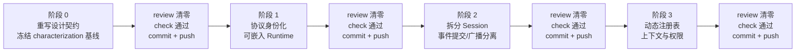

[← 返回地图](./README.md)

# 11 实施路线图：Supervisor Runtime 阶段 0–3

本文规定从当前单 `Session` 实现迁移到可嵌入多线程 Runtime 的唯一 active roadmap。目标语义以
[12-supervisor-runtime](./12-supervisor-runtime.md) 为 canonical 契约；原 M0–M7 已经形成的
protocol、provider、agent、工具、CLI、持久化、approval、retry 与 compaction 能力是**历史实现
基线**，不再是待执行路线，也不得覆盖阶段 0–3 的新约束。

## 0. 总览与硬门禁



| 阶段 | 结果 | 允许改变生产行为 |
|---|---|---|
| 0 | 新设计契约 + characterization tests | 否 |
| 1 | identity/envelope + `RuntimePort`/Supervisor + legacy 投影 | 只新增 canonical/public surface；旧 surface 保持 |
| 2 | `Session` 六协作者 + authoritative commit/async observers + control 统一 | 内部结构改变；现有单 Agent 行为保持 |
| 3 | capability/provider registry + snapshot + prompt/policy | 注册方式改变；现有工具/provider 行为保持 |

四个阶段必须严格串行，不把后一阶段的实现“顺手”塞入当前提交。每一阶段执行同一闭环：

1. 对照本文件、[12](./12-supervisor-runtime.md) 与对应专题设计文档确认范围；先补测试，再实现。
2. 运行阶段定向测试和受影响的既有回归；对架构、协议、恢复、并发和兼容投影做独立 review。
3. review 发现任何问题时直接修复，重新运行定向测试并再次 review；问题未清零不得进入下一步。
4. 运行 `bun run check`，检查文档、public exports、依赖边界和 worktree scope。
5. 只提交当前阶段的变更并推送；commit/push 成功后才开始下一阶段。

review 清零表示没有已知 correctness、并发、恢复、权限、兼容或边界问题；不是只看格式，也不能用
“留到下一阶段”掩盖当前阶段已承诺的验收项。

## 1. 阶段 0：重写设计契约，冻结基线

### 1.1 目标

把“进程内全局单 Agent、子 Agent 是工具”的旧假设替换为：一个 workspace 由 Supervisor 管理多个
独立 thread，每个 thread 至多一个 active run，不同 thread 可并发；子 Agent 是有独立身份、转录、
mailbox、取消和权限的 thread。阶段 0 只改变文档与 characterization tests，不改变生产行为。

### 1.2 交付物

- [12](./12-supervisor-runtime.md) 冻结 Workspace/Thread/Run/Turn/Op 身份、per-thread seq、
  EventEnvelope、Supervisor/ThreadRuntime 职责和目标依赖图。
- 对应专题文档同步 identity、mailbox、steering/follow-up、取消、恢复、lease、权限、approval/control、
  observer 背压与 legacy projection 语义；冲突时不再保留模糊的“双重 canonical”。
- 兼容矩阵明确阶段 0–3 对 `Agent`、`Session`、默认 headless、envelope headless、JSONL v1、
  `ToolDefinition` 与 provider switch 的承诺。
- characterization tests 固定当前可观察事实：同 Session 拒绝第二个 prompt，两个 Session 可并发
  卡在不同 gate，abort/mailbox/transcript 相互隔离，默认 headless 仍输出裸 `SessionEvent`。

### 1.3 禁止事项

- 不增加 identity/envelope/runtime 生产类型，不重排事件，不改变 listener 背压或 JSONL 格式。
- 不提前拆 `Session`，不迁移工具/provider，不把测试写成阶段 1–3 的理想行为。
- 不把“CLI 当前只打开一个 Session”重新表述成全局运行时互斥。

### 1.4 验收与 review

1. `rg` 检查所有设计文档，不再把“子 Agent 是工具”或“全局只有一个 Agent/run”作为目标架构。
2. characterization tests 用 gate 而非 timer，断言只观察 public event/transcript/provider calls。
3. reviewer 逐项核对依赖图、身份生命周期、mailbox 顺序、取消 scope、恢复 high-water mark、权限
   继承与兼容矩阵，确认术语在各文档一致。
4. 定向测试与 `bun run check` 全绿；diff 只含 `docs/` 与 characterization tests。

完成 review 循环后提交并推送阶段 0，才允许创建阶段 1 的生产文件。

## 2. 阶段 1：协议身份化与可嵌入 Runtime

### 2.1 目标

让 identity 和 envelope 成为 canonical protocol，并提供无 UI、无隐式副作用、可由 CLI 或未来
宿主嵌入的 Runtime。旧 `SessionEvent` 与默认 headless 通过显式 projector 兼容。

### 2.2 交付物

- `src/protocol/` 增加 opaque `WorkspaceId`、`ThreadId`、`RunId`、`TurnId`、`OpId`、
  `RuntimeOp`、`OpReceipt`、`RuntimeEvent`、`EventEnvelope`、JSON-safe PermissionCeilingSnapshot 与
  per-create/run PermissionNarrowing；相对导入保持 `.js`。
- envelope 使用目标 thread 的独立 `seq`；阶段 1 由 runtime 内部的临时 event journal/writer 持久化
  high-water mark，close/resume 后继续递增；阶段 2 将其原样提取进 EventCommitter/Repository。
- 同一临时 thread journal 在 accepted receipt 前保存完整 RuntimeOp payload、resolved abort target、
  run reservation 与 op lifecycle；dispatcher cache 可在内存，crash 后从 journal 重建 suspended FIFO。
- `src/runtime/` 提供 `Supervisor`、`RuntimePort` 与显式 factory；一个 Supervisor 只服务一个
  workspace，负责 thread 生命周期、op 路由、幂等和 parent/child 元数据；port 暴露稳定 workspaceId
  与可注入的 newThreadId/newOpId bootstrap helpers，调用方无需重复生成 identity。
- 阶段 1–2 只落 `CreateRuntimeBaseOptions` 的 `capabilityMode?:'static'` 构造分支，并拒绝
  `capabilityServices`；阶段 3 才以向后兼容的类型扩展加入 `capabilityMode:'registry'` 与
  `RuntimeCapabilityServices`。阶段 1 不为尚未实现的 registry 建占位业务类型或部分 service bundle。
- 注入式 `RuntimeStoragePort/RuntimeWorkspaceStoragePort/ThreadJournalPort` 提供 catalog、完整 op ledger、
  atomic append+flush/lease、安全 storage key 与 v1 import；core 不读 HOME/env/默认目录。CLI 把默认
  legacy/runtime roots 或 `--session-dir` 的固定映射显式交给同一 file adapter，测试可换 tmp/in-memory port。
  workspace storage 首次原子绑定 immutable workspaceId+recordedCwd，mismatch 在 lease/recovery 前 typed
  reject。
- `getThreadSnapshot()` 原子返回 transcript/usage 与完整当前 frontend reducer projection，再用
  highWaterSeq 与 hot subscription 无缝拼接；CLI 不绕过 RuntimePort 读 repository，v1 历史不伪造事件。
- create/resume/set_model 以 JSON-safe model_selected mutation 原子维护 current ModelRef；resolver 的
  ModelConfig/秘密不落盘，失败不改变 checkpoint。
- 阶段 1 临时 writer 在首次 attach 时持久 seed，此后原子 fold committed envelope 与 compaction
  mutation→frontend/execution checkpoint+highwater；snapshot 禁止回读已先 mutation 的 Session 内存。
  重启把 committed checkpoint（含 `{tailStartId,summary}`）传回 driver 初始化，只有首次纯 v1 import
  才从 legacy 文件建 seed。
- Supervisor core 只依赖注入的 `ThreadDriverFactory/ThreadDriverPort`。阶段 1 的独立 legacy adapter
  为每个 ThreadId 驱动一个现有 Session，并把 SessionEvent/ApprovalBroker 映射到 canonical event/op；
  阶段 2 在不改 RuntimePort 的前提下用 ThreadRuntime 替换它。阶段 1 factory 接收
  per-attachment config factory：无状态 StreamFn/ToolDefinition 可共享，ApprovalBroker、pending map、
  FileTracker 与 rule/policy/doom-loop 状态必须每 thread 新建；不提前要求阶段 3 registry。
- legacy Session 的内部 retry/compaction 必须经 Supervisor 注入的 `reserveSuccessor` 权威 hook 取得
  并在 predecessor agent_end 可见前持久登记/激活新的 RunId+permission ceiling；turn 经异步
  `reserveTurn` 先登记 TurnId，
  全部事件经 `commitEvent`。它不是
  会吞 listener reject 的普通 Session.subscribe；hook 失败必须阻止后续副作用。driver 不得在事件
  到达后补猜 identity。
- driver 的 activity completion 以 per-op 因果链为边界，覆盖 detached retry/compaction successor，
  返回最终 status/terminalRunId；不能把当前 Session.prompt 的早期 resolve 或全局 waitForIdle 直接
  当成完成，也不能吞并 compacting 期间另行 accepted 的 prompt。
- Supervisor 只向 driver 传 discriminated PreparedThreadDriverCommand：run/model/abort target 均在类型上
  必填且来自 durable/trusted resolution；prompt/continue 还携带同 RunMutation 的 permission ceiling
  与 resolved prompt-input/residue seed，
  legacy driver 不得二次读取 current activity/空 Session 猜输入。
- legacy factory 的 create 返回实际 Session backend 的 durableRef；Supervisor 持久绑定
  ThreadId→driverRef。create 使用基于 workspace/thread/create-op 的幂等安全 creationKey，任意
  ThreadId 不得直接成为文件名；resume 只用已验证 ref。
- child terminal commit 写稳定 resultOpId 的 durable outbox；父未 attach 时延迟，resume 后向父 journal
  恰好一次提交 `thread_result`，crash 重投由父 journal/result ledger 去重。
- public runtime package export 可独立 import；import 不读取环境/配置、不创建目录、不注册 signal、
  不加载 TTY/provider SDK、不发网络请求。consumer specifier 固定为 `coda/runtime`，exports 的 import/
  types 分别指向 dist/runtime/index.js 与 .d.ts；package root 不承诺 library import。
- createRuntime 只接受调用方预解析的 current-host non-empty absolute cwd，empty/relative/NUL 在任何
  storage/lease 前 `invalid_workspace_cwd`；Runtime 不读取 ambient cwd、不 resolve/realpath。legacy ID
  pure hash 仍覆盖 arbitrary well-formed raw cwd，v1 invalid executable cwd 只读列出并禁止 mutable attach。
- Runtime 可在没有模型且零 attached thread/journal 时提供只读 workspace catalog；`listThreads()`
  枚举未 attach canonical/v1 索引的 createdAt/title，选择模型后 `thread_resume` 显式携带 ModelRef。
- PermissionPolicyPort 显式 snapshot 当前 workspace ceiling，再以同一 snapshot、persisted thread/
  predecessor ceiling 与 RuntimeOp narrowing 派生 effective ceiling；Supervisor 不暗读/解释策略。
- CLI 收敛为参数/配置/composition 与前端适配：输入映射为 op，canonical envelope 映射为 UI；
  legacy `Session`/headless 使用 projector，默认输出保持旧形态，显式 flag 才输出 envelope。
- exported Session 类在阶段 1 保持现有 promise/sync throw 与 awaited listener 实现；runtime driver 的
  完整 causal completion 不泄漏给旧 prompt promise，阶段 2 才把 Session 改为 facade。
- 旧 JSONL v1 确定性映射到默认 workspace/thread；恢复不自动启动 run。retry/continue 创建新
  `RunId`，用 `predecessorRunId` 关联。

### 2.3 必测不变量

1. 同 thread 仍只有一个 active run；两个 thread 可并发，mailbox/abort/事件互不影响。
2. A/B 事件交错时各自 seq 从 1 严格递增；恢复后续接，绝不声明全局总序。
3. 重复 `OpId` 返回 duplicate receipt，不重复 provider 调用、工具副作用或 transcript append；旧
   `expectedRunId` abort 不误杀 successor run。
   legacy driver 的 retry/compaction 在 coordinator event/内部续跑前已通过 host gate 登记 successor
   RunId；在 gate 前后取消均不产生未知或复用的 run identity。
4. envelope identity 归属正确；不适用的 `runId/turnId/opId` 字段直接缺失。
5. 旧 `Session` API、默认 headless NDJSON 和 JSONL v1 回归全绿；同一 canonical event 的 legacy
   投影与阶段 0 黄金序列深等。
6. package export smoke test 证明 runtime import 无副作用，构建产物可被 ESM 消费。
7. `events()` 返回即原子建立订阅；先订阅尚未 create 的 ThreadId、延迟首次 `next()` 也不丢 lifecycle/
   op envelope。envelope headless 对每个可解析 op 只输出一个 receipt，覆盖 duplicate/rejected 与
   transport error；legacy 模式不新增 frame。
8. 在 legacy backend create 成功与 driverRef ledger 绑定之间注入 crash；相同 create OpId 重投取得
   同一 Session id，重启 resume 精确打开它，且任意/path-like ThreadId 从不进入文件路径。
9. 两个 attachment 的 approval/rule/FileTracker 状态互不串线；control decision 按 request kind 校验，
   legacy approval-abort 从 pending record 固定 owningRunId/expectedRunId，迟到命令不杀 successor。
10. compaction event/mutation/checkpoint 同 gate，crash/resume 后出站仍为 committed summary+tail；
    event-family identity presence/matching 矩阵逐项覆盖；reserveTurn gate 未放行时 next-turn queue drain
    不得 mutation/发布，放行后 drain 与随后整 turn 复用该 TurnId。
11. queue/control/partial-tool/retry/compaction 各 crash 点经 resume barrier 后，driver queue/context 与
    snapshot/ledger 一致；旧 activity/control 已确定性结案，显式 continue 才以新 RunId 接续；child
    interrupted 同 commit 写 status:error outbox，parent unloaded/resume 路径仍 exactly once。
12. 未 apply 的 steer/follow_up 在 recovery 按 accepted FIFO 恰好一次 enqueue+complete；旧 pending/
    started set_model 由本次 resume ModelRef supersede，同 commit 更新 model_selected，已完成 mutation 不重放。
13. 所有 public identity surface 在 IO/lookup 前按各自 typed error 拒绝 identity empty/lone-surrogate；Workspace/
    Thread/Run/Turn 的 NUL 与合法 Unicode 保持 opaque，OpId/LegacyWorkspaceId 仍服从固定 alphabet。
    legacy ID golden、LegacyWorkspaceId/thread framing、v1 invalid identity quarantine、
    strict JSON key/value 与 Run/Turn/derived 双向 collision 都覆盖。legacyWorkspaceId pure raw 可含
    empty/relative/NUL，但 executable workspace cwd 必须 current-host absolute/no-NUL；v1 不合格项只读 quarantine。
14. thread create/attach claim 的 definitely-pre-side-effect failure 释放可重试 claim，unknown outcome
    保留 creationKey；resume/import checkpoint mismatch 仅在 quarantined close 明确成功且零 host/mirror
    effect 时释放 attach claim，close unknown 保留，fresh create backend 已存在时无论 close 成功都保留
    create claim+creationKey；recovery 缺 credentials 时原 accepted lifecycle 结为 recovery_interrupted/unloaded，
    新 ModelRef/OpId resume 可恢复。parent 必须同 workspace 已存在且非 self，createdByRunId 必须是父
    acceptance 点当前 active reservation；subtree root 与 empty workspace scope 语义逐项覆盖。
15. raw approval requestId `x/x~1` 的永久 used-set、map-before-commit/publish、同步 response 与 crash window
    全部确定；Runtime.close 与所有 in-flight token 竞态、resolver signal、cohort 重算和 post-close method
    table 全绿，已登记 token 不事后抛 RuntimeClosedError，永久 Op/Run/Turn identity 不释放。
16. `reserveSuccessor`/`reserveTurn` 同 reservation key idempotent、不同 key collision/fork fatal；turnOrdinal
    正确，workspaceCeiling/runCeiling 两个输入逐对象原样传给 resolve，返回的 turnCeiling 与
    turn_prepare/PreparedThreadDriverCommand/policyRevision 逐字段一致。默认 headless busy error/unknown approval silent no-op
    逐字匹配阶段 0 golden。

### 2.4 review 焦点

- identity 是否从入口贯穿存储/事件，而不是靠可变 current id 猜归属；seq 是否只在权威点分配并
  持久化。
- Supervisor 是否仅管理 thread，未吸收 Agent loop、transcript merge、provider 或工具执行。
- CLI 是否仍藏有 run/retry/approval 状态机；public entry 是否意外 import `src/cli/main.ts`。
- projector 是否是单向兼容边界，canonical core 是否反向依赖 legacy `SessionEvent`。
- Supervisor 是否只依赖窄 driver port，Session/ApprovalBroker import 是否被隔离在 legacy adapter，
  从而既能阶段 1 多 thread，又没有提前拆 Session 或实现 registry。

review 清零、`bun run check` 全绿并完成阶段 1 commit/push 后，才能拆分 Session。

## 3. 阶段 2：拆分 Session 与事件通道

### 3.1 目标

把当前 Session 的执行编排、持久化、retry、compaction 与广播职责拆成窄协作者，同时保持现有
单 Agent 生命周期和 legacy 投影不变。只有权威提交背压 Agent，普通观察者异步消费。

### 3.2 交付物与职责

| 组件 | 阶段 2 职责 |
|---|---|
| `ThreadRuntime` | 单 thread active-run 门禁、mailbox dispatcher、六组件编排 |
| `TranscriptRepository` | 提供完整 thread journal 的 append/load/fold IO 与 transcript view（含 identity/mailbox/control/event/run/compaction records）；不分配 seq、不决定 control 状态 |
| `RetryCoordinator` | 错误分类、可取消退避、创建 successor run |
| `CompactionCoordinator` | 阈值、摘要、合法切点与 successor run 协调 |
| `EventCommitter` | 唯一权威 writer：由 runtime-only awaited authoritative sink 调用 repository append port，分配 per-thread seq、提交 transcript/seq/control 并返回 envelope 或连续原子 batch；不注册为 public subscriber |
| `EventHub` | Runtime-owned、每 workspace 一个；汇聚 per-thread committer，支持 future-thread filter、每订阅者 FIFO、cursor/gap/退订与错误隔离 |

`Session` 保留为一个默认 thread 的 facade，只委托 `ThreadRuntime` 并投影事件；不允许在 facade
重新实现 retry、compaction、approval 或 fan-out。需要调用方决议的 approval/resource confirmation
统一为 `control_request/control_resolved`，request 和 response 都走 EventCommitter；child
`thread_result` 是无需应答的通知事件。legacy projector 把 approval 分支恢复为旧事件。

exported direct `Session.create/resume` 使用 internal `StandaloneSessionHost`，不各自创建 Runtime 或争抢
workspace SupervisorLease：每个不同 session id 有自己的 ThreadRuntime、per-instance AgentConfig、private
EventHub 与 backend/sidecar `StandaloneSessionLease`。standalone approval repository 用该 lease 的私有
outbox + `(workspace,thread,responseOpId)` receipt key，再走共享 approvals lock/CAS；ThreadRuntime 仍只见
同一 LegacyApprovalPatternRepositoryPort/control 链。不同 session id 同 cwd 可并行且配置互不串；同一
backend 双 resume 阶段 2 起 `session_in_use`。direct Session 与 Runtime 共写 claimed backend 仍 unsupported。

facade 保持 prompt/continue 在 root Agent run boundary settle、waitForIdle 等全部 causal successor；
同步 void/guard 方法经本地 admission shim 进入同一 mailbox。唯一有意改变的旧 timing 是普通
Session.subscribe listener 不再延迟 run，这正是本阶段 observer 背压目标。

事件路径固定为：

```text
Agent/control event
  → internal authoritativeEventSink → EventCommitter（Agent await：权威 transcript/seq/control）
  → EventHub.publish（非阻塞入订阅者队列）
  → UI/headless/telemetry/tests（各自异步消费）
```

headless stdout `drain` 只背压该前端的输出泵，不能反向卡住 Agent；shutdown 必须等待输出泵排空。

阶段 1 已在 legacy driver **边缘**完成 `approval_request ↔ control_request` 与
`control_response ↔ ApprovalBroker` 的 wire 映射，以保持 RuntimeEvent 联合单一；阶段 2 的新增语义
是把 request/response、等待者状态与 abort 结案移入同一 durable EventCommitter 链，并删除 core 对
legacy broker 的依赖，不是再次改变 public wire。registry/PolicyEngine 尚未进入本阶段，因此 static
ThreadRuntime 必须使用 [12 §6.2](./12-supervisor-runtime.md) 的 `LegacyApprovalAdapter` 窄 bridge：CLI
注入 factory，Runtime 取得 SupervisorLease 后由 workspace storage 打开 fence-bound
LegacyApprovalPatternRepository，per-thread adapter 只做 preflight/applyResponse，不发事件或持 waiter。
ask 的 `{patterns,forceConfirm}` 随 control_request 持久化；allow_always 先以
`(workspaceId,responseOpId)` 幂等、fenced outbox + global CAS 保存全部旧 patterns，再提交 resolved/
释放 waiter。force/空 patterns 按旧行为规范化 allow_once。crash 可补 pattern/control，但 executor
绝不重放；阶段 3 原 wire 替换为 PreparedInvocation/PolicyEngine/grant repository。

### 3.3 必测不变量

1. repository/committer gate 未开或 reject 时 Agent 不能越过提交；该 gate 使用独立 awaited
   authoritative sink，不能借用会吞 listener reject 的 public subscribe。任意 observer gate 未开、throw
   或退订时，当前 run 和另一 thread 都可完成。
   另构造同 cwd/root 的两个 direct Session（不同 id、不同 streamFn/tools gate）：二者不取得
   SupervisorLease、可并行且 abort/model/approval/hub 不串；同一 id 双 resume 稳定 `session_in_use`。
2. 每个 observer 内 envelope 顺序不变；溢出明确 disconnect/gap，不静默丢关键事件。
   无 gap channel 的 Session/Agent facade 例外使用 durable cursor-backed pump：把 listener gate 卡到
   超过 EventHub capacity，run/其他 thread 仍完成，放行后 listener 收到完整、不重复、严格有序序列；
   listener reject 只诊断并继续后续事件，不自动退订；unsubscribe/close 才释放 retention pin。
3. control request 先权威提交再等待，response 先提交再 resolve；first-wins response claim 拒绝第二 OpId，
   同 OpId duplicate 回原 receipt。approval 等待中 abort 先传播
   cancellation，结案为 aborted 而非 denied。
   kind/proposal invalid_decision 在 op_accepted/claim 前 rejected，request 仍 pending且 valid 新 OpId 可答。
4. retry/compaction/usage/resume/尾行截断与 tool-call 配对回归保持；successor run identity 正确。
5. facade 与默认 headless 的 legacy 事件相对顺序、内容和退出纪律保持。
6. `ThreadRuntime`、repository、coordinator、committer、hub 均有窄单测，集成测试不读取私有状态。
   另以 fire-and-forget `tool_execution_update` commit reject 断言 writer-fatal latch 会 abort run/tool
   signal，后续 awaited emit、provider/tool 与 side-effect gate 均不越过；普通 listener reject 不触发 latch。
7. legacy approval request/response 只走一条 durable control 链；multi-pattern allow_always 在 flush 前
   不 resolve/执行，forceConfirm/空 pattern 降级 once 且不记忆。pattern→control crash 恢复不重复写
   Set/seq/executor，stale/wrong workspace writer 不能 reserve 新 outbox。
8. response accepted_pending 在 effect 前 durable started；`definitely_not_applied` 使 response interrupted+
   release claim，request 保持 live且仅新 OpId 可重试。conflict/fenced/unknown 保留 claim并停止整个
   workspace 新 admission/capability execution；R→A 与 A→R 按同一 thread 跨 op-type 的统一 accepted FIFO
   得到相反但确定的
   effect/control 结果。
9. 阶段 2→3 upgrade barrier 先按 FIFO inventory；只有 live effect obligation/reserved outbox 才打开
   recovery-only legacy extension。缺 extension typed failure，纯可 abort control 不要求，且不 preflight/
   migrate grant/replay executor。corrupt approvals.json 仍 tolerant-load empty + stable diagnostic。
10. Runtime 只拥有一个 workspace EventHub，future-thread/global filter、thread-fatal isolation 与 cursor
    replay 全绿；Session pump 超 capacity 后 durable 补读完整。六协作者任一不得偷偷创建第二 hub/writer。
11. facade trusted `setModel(ModelConfig):void` 保持同步 guard、立即 currentModel/prompt exact config，
    canonical FIFO 只落 ModelRef；public set_model 仍走 resolver，sidecar 不恢复/不静默 rollback。

### 3.4 review 焦点

- 是否仍存在第二个 event writer/seq allocator，committer 是否误挂进会吞错的 public subscribe，或普通 listener 被 await 回热路径。
- transcript、seq 和 control 的原子边界在崩溃点是否可恢复；EventHub 是否被误当事实源。
- abort/close 是否覆盖 provider、工具、sleep、compaction、pending control 和输出泵，且默认不跨 thread。
- 是否仍有 ApprovalBroker core 旁路；LegacyApprovalAdapter 是否只消费 frozen request/current run
  ceiling，并把 persistence 置于 control_resolved/waiter/executor 之前。
- 拆分类是否只是把大类字段机械搬家，仍通过互相访问内部状态形成隐式巨类。

review 清零、`bun run check` 全绿并完成阶段 2 commit/push 后，才能迁移注册表。

## 4. 阶段 3：动态注册表、上下文与权限

### 4.1 目标

让 capability/provider 的 schema、选择、校验、权限和执行基于同一个不可变 turn snapshot，消除
静态 switch 和“模型看到 v1 schema、实际执行 v2 executor”的版本撕裂。

### 4.2 交付物

- JSON-Schema-first `CapabilityRegistry` 实现 [12 §10](./12-supervisor-runtime.md) 的正式 mutation/snapshot
  surface：registration 原子包含 id/version、deployment-stable `implementationDigest`、schema/metadata/
  policy、prepare/validator/resource-resolver/executor、prompt metadata 与 executionMode；成功 mutation 才
  推进 revision，register/update/unregister 的 duplicate/missing/id/expectedRevision 失败不改状态，
  update 保留槽位、删除后重注册追加末尾。规范化 JSON 与 implementation release 共同产生
  `registrationDigest`，不能用 `Function#toString` 代替。
- `ToolCatalogSnapshot.resolve/prepare` 只使用冻结索引与函数引用。prepare 固定执行 strict JSON copy、
  参数修补/校验、规范化 args 冻结、同 revision 的 capability-specific resource resolution，再生成
  带 registrationDigest 的 `PreparedInvocation`；未知 capability、参数/资源歧义、非法 JSON 或
  InvocationContext/EffectivePolicySnapshot context 不匹配都返回 typed recoverable failure，executor
  为零调用。prepare 后禁止按名字回查 live registry 或 mutable policy store。
- `ProviderAdapterRegistry` 同样提供 register/update/unregister/snapshot、success-only revision、稳定槽位、
  expectedRevision 与 implementation/registration digest 语义；turn snapshot 只按 `ModelRef.api` 解析
  adapter，未知 api 产生合法流内 error，不 fallback，旧 snapshot 不受 live update/unregister 影响。
- Runtime construction 以 `capabilityMode:'registry'` 一次性注入完整 `RuntimeCapabilityServices`：
  capability/provider snapshot-only reader ports、`BasePromptProvider`、`RuleSnapshotProvider` 与四维
  `RuleSnapshotBudget`、`PromptAssembler`、
  `PolicyEngine`、`RuleFreshnessPort` 和 `grantMode`；不允许部分 service bundle。
  Runtime 取得 SupervisorLease 后才用 workspace storage 的 `openPolicyGrantRepository(lease,grantMode)`
  打开 bound repository，open/fence 失败在
  recovery/attach/provider 前关闭构造。ThreadRuntime 在 provider sampling 前只捕获一次 catalog/provider/
  grant/base-prompt/rule snapshots；mutable registry 只由 composition host 持有，Runtime/attachment 的
  类型面看不到 mutation methods；CLI 只注册实现与注入 budget，不暗读或拼装业务规则。
- Stage 3 package exports additive 提供 `coda/runtime` 的 registry option/service port types、
  `coda/capabilities` 的四个 concrete `create*` factory + registration/snapshot/prompt/policy/legacy-adapter
  surface，以及 `coda/legacy-coding-tools` 的八项 binding factory；外部 embedding 不得 deep-import src。
  环境相关 base/rule/freshness/storage ports 只导出接口并显式注入，runtime entry 不 eager-load zod/tool/SDK。
- `RuleSnapshotProvider` 以冻结的 `TurnPolicyContext`、canonical known scopes 与 files/单文件字节/
  总字节/prompt token budget 捕获正文、digest、root→narrow 稳定顺序和 diagnostics；owner/context
  错配或 capture failure 均 fail closed。`ThreadPolicyEngine.capture()` 只解释显式 ceilings/rules/grants，
  产出带唯一 context 的 `EffectivePolicySnapshot`：`ceilingRevision` 标识有效 ceiling，
  `policyBasisRevision` 覆盖 engine/constraints/ceiling/rules 但排除 grants/turn identity，
  `grantRevision` 单独标记授权集，combined revision 再绑定两者与 turn context。
- `PromptAssembler` 只接收同一 turn 的 BasePromptSnapshot、outbound message view、
  EffectivePolicySnapshot、PromptModelView 与 ToolCatalogSnapshot；规则只能取
  `effectivePolicy.rules`，不能另传第二份 RuleSnapshot。它验证 base-prompt/rules/policy owner 与 model
  ref，纯组装深冻结 Context；错配返回 typed `invalid_prompt_context`，不调用 provider，也不读/改
  transcript、filesystem/env、live registry 或 ModelConfig secret。
- `ThreadPolicyEngine.evaluate()` 唯一输入是 frozen PreparedInvocation，返回 allow/deny/ask；ask 的
  `grantProposal?: PolicyGrantScope` 是唯一可持久化泛化方案。`allow_once` 只释放本 invocation；
  `allow_always` 必须把 frozen proposal、workspace/capability version+registrationDigest 与
  policyBasisRevision 以 response ExternalOpId/accepted timestamp 幂等写入 grant repository，flush 后才
  提交 control_resolved、释放 waiter 或执行。grant→control crash 恢复先 duplicate-complete grant 再补
  control；旧 waiter 已消失时也绝不重放 executor。canonical workspace mode 中无 proposal 的
  allow_always 是 invalid_decision；legacy-global mode 则按正式兼容规则规范化为 allow_once，不能由
  ThreadRuntime/UI 猜 pattern。
- 注入式只读 `RuleFreshnessPort` 在 preflight 与 executor 副作用前核对 PreparedInvocation 中冻结的
  RuleSnapshot/resources；它只能把 allow/ask 收窄为 recoverable deny，不能替换 args、policy、schema
  或 executor。workspace 给权限上限，thread/run 只能收窄，child ceiling 仍取父有效 ceiling 与当前
  workspace 上限的交集。
- 现有 `ToolDefinition`、内置工具、全局 approvals 与 provider switch 经 legacy adapter 注册；每个
  legacy tool 必须提供显式、版本化的 binding（policy + selector/resource resolver），adapter 不按 name/
  kind 猜权限。八个内置工具的 binding 表与 bash command analyzer 按 [07 §1.2](./07-tools.md) 落地；
  通用 adapter 留在 capabilities，仅窄依赖 tools/types；认识具体工具的 binding 工厂落在
  `integrations/legacy-coding-tools/` 并由 ESLint 固定只依赖 capabilities+tools。zod 只留在
  adapter/validator 边界，FileTracker 等 execution services 仍 per-thread，canonical registry/
  schema/grant 数据保持 JSON-safe。

### 4.3 必测不变量

1. turn 捕获 catalog/provider revision 1 后 gate 暂停，分别 update/unregister live registry，再让当前
   turn 发出 tool call：prompt schema、registrationDigest、validator/resource resolver、policy 输入、
   executor 与 StreamFn 全用 revision 1，下一 turn 才整体看到 revision 2/移除结果。
   另有 package-external consumer smoke 只经三个正式 specifier 构造 registry Runtime 并验证 ESM/声明；
   任一所需 service/binding/factory 若只能 deep import 才取得即失败。
2. capability/provider mutation table 覆盖 duplicate、missing、id/api mismatch 与 expectedRevision
   conflict 均不推进 revision；register append、update 原槽、unregister+register 末尾顺序稳定。
   implementationDigest/registrationDigest golden 与“同 semantic version 换实现”拒绝用例齐全；旧
   snapshot 的 resolve/prepare 不因调用方或 live registry mutation 漂移。
3. raw args、validator value、resource result、entries/schema/metadata/policy/effective-policy 与 prepared
   args 全部深冻结。prepare/validate/resolver throw、required resource 缺失、额外/歧义资源、非法 JSON、
   catalog/context/policy identity 错配都返回对应 typed failure，executor 零调用；
   PreparedInvocation 固定 executionMode、原 provider toolCallId、registrationDigest 与同 entry executor。
   generic adapter 缺 binding 拒绝；integration 工厂恰好提供八项及固定 selector 表，同 type/access 的
   不同 selectorId 仍精确区分，同 selector 多 target 合法且完整 tuple 才去重。
4. RuleSnapshot capture 的 owner、四维 budget、正文/digest、canonical path、root→narrow order 与
   diagnostics 可重复；capture failure 不采样。PromptAssembler 只能看到传入的 outbound messages、
   base prompt、effectivePolicy.rules、model 与 catalog，返回深冻结 Context；basePrompt/rules/policy 的
   workspace/thread/run/turn/cwd 或 model ref 任一错配稳定 `invalid_prompt_context` 且 provider 零调用。
5. `ThreadPolicyEngine.capture()` 的 context 与所有输入逐字段一致；policyBasisRevision 在 engine/constraint/
   ceiling/rule 改变时变化，但 grant 新增只推进 grantRevision/combined revision，不能让新 grant自失效。
   evaluate 只读取 PreparedInvocation，缺失/未知约束或 context mismatch fail closed，不读 mutable
   rule/grant store，也不执行 capability。纯 owner run/turn 变化不改变 basis/ceiling revision，combined
   revision 仍绑定 context；`openThread` 的 doom-loop state 在 A/B 隔离，只在 attachment lifecycle 重置。
6. ask 的 grantProposal 随 pending control 冻结；canonical workspace mode 中无 proposal 的
   allow_always 保持 request pending 并返回 invalid_decision，legacy-global mode 则记录 requested/effective
   decision、只执行一次且不写 pattern。合法 allow_always 的匹配 key 完整绑定 workspace、capability
   id/version、registrationDigest、frozen PolicyGrantScope 与 policyBasisRevision，**不使用会因本次 grant 改变的
   grantRevision/combined revision**。grant flush gate 未开时不得 control_resolved/释放 waiter/执行；
   grant 成功而 control commit 前 crash 后以同 response OpId duplicate grant 并恰好一次补 control，旧
   waiter/run 消失时 executor 仍为零调用；allow_once 不写 repository，后续 turn 才捕获新 grantRevision。
   `definitely_not_applied` interrupted+release claim、仅新 OpId 重试；conflict/fenced/unknown retain claim
   并分别 quarantine/stop/degrade workspace。workspace storage/bound repository 还覆盖 wrong-workspace/
   stale-fence、open/commit failure 和 close；
   legacy compatibility proposal 的 pattern 组必须原子保存，不能丢复合 bash 中的任一项。
7. PolicyEngine/approval 从同一 PreparedInvocation 收到完整 workspace/thread/run/turn/capability/
   catalog identity、规范化 args/resources 与 policy basis；跨 thread response 拒绝，allow_once 不越过
   invocation。child 创建时的 parent-run ceiling/provenance 必须持久化，parent 后续放宽/收紧、workspace
   放宽及 crash/resume 均不能改写；workspace 收紧从下一 run/turn snapshot 生效，已 prepare turn 只经
   cancel/reprepare 撤销。
8. RuleFreshnessPort 在 preflight 与真实 execute 前只读取 frozen RuleSnapshot/resources；同批前序工具
   改写 AGENTS.md 后，后序工具得到 recoverable stale deny、零副作用，下一 turn 才重捕获/assemble；
   freshness 不能升级为 allow/ask 或替换 PreparedInvocation；missingScopes 严格 non-empty/dedup/UTF-8
   order 且逐字持久化，不从 target 猜 scope。
9. 两个 thread 共用 catalog entry 时 FileTracker/services、abort 与 policy/control 仍隔离；legacy
   sequential 批/call.id、全局 approvals scope、现有工具/provider fixture、Session facade、headless 与
   TUI 黄金回归全绿。同 assistant duplicate toolCallId 在 final commit 前变 nonretryable error、零执行；
   不同 turn 复用 raw id 合法且 invocationId/TurnId 不同。

### 4.4 review 焦点

- JSON Schema 是否真是 registry canonical 数据，implementation/registration digest 是否同时绑定数据
  与实现 release；mutation failure、update 槽位和旧 snapshot 是否仍有隐藏的 live-map 回查。
- `capabilityMode:'registry'` 是否强制完整 RuntimeCapabilityServices，workspace storage 是否只在取得
  SupervisorLease 后打开 fence-bound grant repository；RuleSnapshot/BasePrompt/budget/grant 是否仍
  由 CLI、PromptAssembler 或 PolicyEngine 暗读 filesystem/env/singleton，所有 owner/context mismatch
  是否在 provider/executor 前 typed fail closed。
- ToolCatalogSnapshot.prepare 是否使用同 entry 的 prepare/validator/resource resolver/executor，且
  PreparedInvocation 是否持有该 entry 的 schema/metadata/policy/validator/executor、registrationDigest、
  已解析 resources 与同 turn EffectivePolicySnapshot；是否只做浅冻结或在 approval wait 后偷换
  args/resources/executor。
- policyBasisRevision、grantRevision 与 combined revision 是否被混用；allow_always scope/key 是否漏绑
  workspace/implementation/policy basis，grant→control crash 是否可能丢 grant、重复 executor 或用已消失
  waiter 回放副作用。
- PromptAssembler、PolicyEngine、registry/grant repository 和 adapter 的依赖方向是否符合
  [02](./02-architecture.md)，CLI 是否只负责 registration/composition；热更新、unregister、approval、
  grant flush、parallel tool calls、freshness 与 abort 的交错是否都有 deterministic gate，而非 timer。

review 清零、`bun run check` 全绿并完成阶段 3 commit/push 后，本路线图完成。

## 5. 跨阶段风险与缓解

| 风险 | 失败形态 | 硬性缓解 |
|---|---|---|
| identity 依赖 mutable current state | 并发事件串 thread/run | identity 随 op/record/envelope 显式传递；交错 gate 测试 |
| seq 只存在内存 | resume 后重复/倒退 | high-water mark 与 thread 权威记录同边界持久化；恢复测试 |
| legacy 与 canonical 双写 | 顺序漂移、恢复事实分叉 | canonical journal 是唯一事实源；v1 mirror 仅 best-effort/可重建且不得反向 fold，按 driverRef/creationKey claim 去重；direct Session 与 Runtime 共写同 claimed backend 明确 unsupported，fingerprint mismatch 后 quarantine/重建私有 backend；headless 只做纯投影；黄金序列对比 |
| observer await 热路径 | delta 卡顿、跨 thread 连坐 | 只有 EventCommitter 可背压；observer 独立队列和故障测试 |
| 取消 scope 过宽 | abort 父线程误杀无关/子线程 | `(threadId, expectedRunId?)` 定位；subtree 必须显式 |
| registry 版本撕裂 | schema v1 + executor v2 | turn snapshot + PreparedInvocation 直接持有引用；热更新对抗 |
| 权限变成进程全局记忆 | child/thread 越权 | identity 化 policy context；workspace 上限与最小权限交集 |
| CLI 继续拥有业务状态机 | runtime 无法嵌入、两套真相 | public RuntimePort smoke + 依赖边界 lint/test |

## 6. 历史 M0–M7 基线（非 active roadmap）

下表只解释当前仓库能力来自哪里，便于定位旧测试和文档中的 `M*` 标记；这些项视为阶段 0 的
兼容基线，不应重新执行，也不能作为推迟阶段 0–3 契约的理由。

| 历史里程碑 | 已形成的基线 |
|---|---|
| M0 | Bun/TypeScript/ESM、build/lint/test 与 import boundary |
| M1 | canonical messages/provider/agent events、EventStream、faux provider |
| M2 | OpenAI Chat Completions adapter 与离线 SSE fixtures |
| M3 | Agent loop、工具执行框架与内置工具 |
| M4 | steering/follow-up/abort/transform 与 tool-call 配对修复 |
| M5 | TUI/classic/plain/headless、Session JSONL create/resume |
| M6 | plan、approval、截断输出与前端交互 |
| M7 | retry、compaction、usage/cost 与多 provider adapter |

旧实现中的 `SessionEvent`、`ToolDefinition`、静态 provider dispatch 和单默认 Session 都是兼容
输入，而非目标架构。子 Agent/MCP 也不再归入“新增工具”：MCP capability 可注册进 registry；子
Agent 必须由 Supervisor 创建独立 thread。server/daemon、持久 shell、独立 TUI client 等仍不属于
阶段 0–3 的产品交付，但 RuntimePort、mailbox 和 envelope 必须让它们未来无需改写 Agent core。

## 7. 通用完成定义（Definition of Done）

- 当前阶段全部验收项、受影响回归与 `bun run check` 全绿；默认测试离线、确定性，无裸 timer。
- 新增/改变行为有测试；协议、架构、恢复或权限语义同步维护 canonical `docs/`。
- import 边界零违例；新增 `runtime/capabilities` 目录的阶段同步扩展 ESLint zone 和
  `tests/boundaries.test.ts`。
- public/legacy surface 的 package exports、类型与构建产物均有消费测试；不手改 `dist/`。
- review 没有未解决问题；修复后已重新 review 和复跑门禁。
- 当前阶段 commit scope 纯净、提交成功并已推送；下一阶段尚未混入当前 diff。

## 相关文档

- [01-overview.md](./01-overview.md) —— 产品目标与新执行模型摘要
- [02-architecture.md](./02-architecture.md) —— 阶段 1–3 目录与依赖规则
- [03-internal-protocol.md](./03-internal-protocol.md) —— identity、op、envelope 与兼容投影
- [08-session-persistence.md](./08-session-persistence.md) —— 阶段 2 协作者与恢复边界
- [10-testing.md](./10-testing.md) —— 各阶段可执行测试门禁
- [12-supervisor-runtime.md](./12-supervisor-runtime.md) —— 本路线图的 canonical 设计契约
