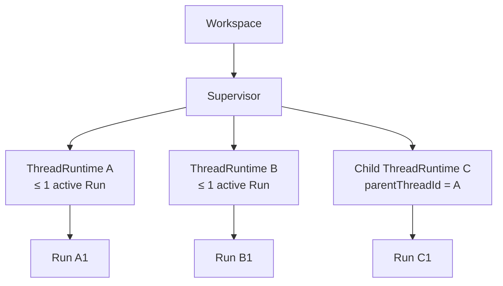
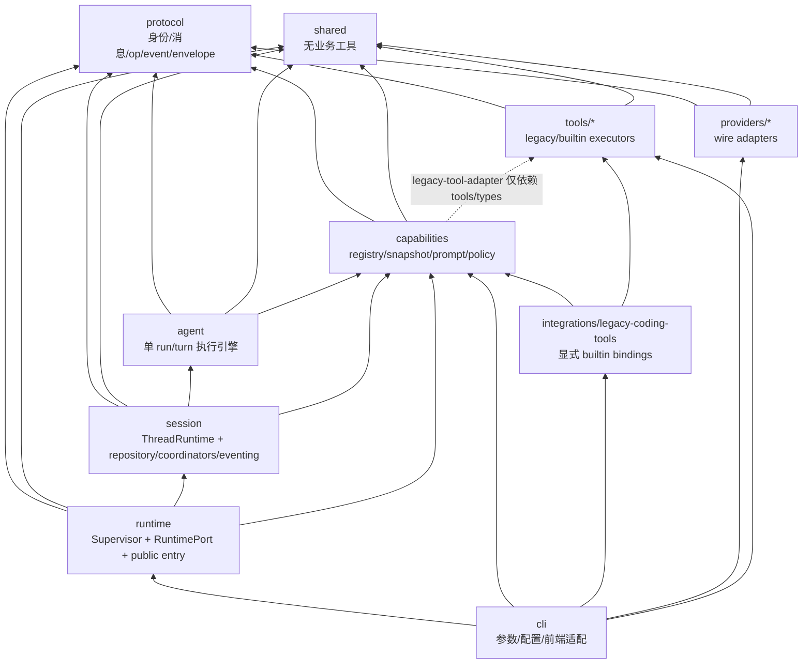

[← 返回地图](./README.md)

# 12 · Supervisor、多线程 Runtime 与能力快照契约

本文冻结 coda 从单会话门面演进到可嵌入多线程 Runtime 的目标架构。它是
`WorkspaceId / ThreadId / RunId / TurnId / OpId`、`EventEnvelope`、Supervisor、mailbox、
取消/恢复、权限与兼容投影的 canonical 宿主；与旧文档冲突时，以本文为准。阶段 0 只修改了
设计与 characterization tests，没有改变当时的 `Agent` / `Session` / CLI 行为；阶段 1–3 的 production
结构现已按本文落地，并继续保留 §11.1 所列兼容面。下文“阶段 1/2”措辞用于说明迁移来源与历史
兼容责任，不表示当前 public Runtime 仍停留在 Phase-1-only 形态。

## 1. 核心模型：每线程单 active run

旧基线“进程内全局只有一个 Agent，子 Agent 未来作为工具”废止。新基线是：

1. **Workspace 是资源与策略边界。**一个 workspace 可以包含任意多个 thread；文件根、默认
   capability 集、provider 配置和权限上限以 workspace 为作用域。
2. **Thread 是转录、mailbox、事件序号与恢复边界。**每个 thread 拥有独立 transcript、
   steering/follow-up mailbox、usage、retry/compaction 状态、pending control 请求和单调事件序号。
3. **每个 thread 至多一个 active run。**同一 thread 内 `prompt/continue/retry/compaction`
   续跑必须串行；不同 thread 的 run 可以并发，互不背压、互不取消、互不读取 mailbox。
4. **Supervisor 管理线程，不执行 turn。**Supervisor 负责创建/恢复/列出/关闭 thread、路由 op、
   执行 workspace 级取消和维护 parent/child 拓扑；每个 `ThreadRuntime` 才拥有 Agent 执行引擎。
5. **子 Agent 是独立 thread，不是工具。**父线程请求并行工作时，Supervisor 创建带
   `parentThreadId` 的子线程。子线程有自己的身份、run、转录、mailbox、权限和事件流；结果通过
   Supervisor 投递到父 EventCommitter 的 durable、无需应答 `thread_result` 事件回到父线程，宿主可
   在后续 turn 显式把其摘要汇入出站上下文；它不是 mailbox RuntimeOp/control，绝不伪造成父线程的
   `ToolCallPart/ToolResultMessage`，也不共享父线程的可变 Agent 状态。

“单 active run”是**每线程不变量**，不是进程级互斥。兼容 CLI 在阶段 1 仍只打开一个默认
thread，因此用户可见的现有单 Agent 行为保持不变；可嵌入 Runtime 与未来前端可同时驱动多个
thread。



允许 `R1/R2/R3` 同时活动；禁止同一 `ThreadRuntime A` 同时存在 `Run A1/A2`。

## 2. 身份模型

### 2.1 canonical 类型

阶段 1 在 `src/protocol/identity.ts` 定义 opaque branded string；序列化后仍是普通 JSON string：

```ts
export type WorkspaceId = string & { readonly __brand: 'WorkspaceId' };
export type ThreadId = string & { readonly __brand: 'ThreadId' };
export type RunId = string & { readonly __brand: 'RunId' };
export type TurnId = string & { readonly __brand: 'TurnId' };
export type OpId = string & { readonly __brand: 'OpId' };
export type ExternalOpId = OpId & { readonly __origin: 'external' };
export type DerivedOpId = OpId & { readonly __origin: 'derived' };
export type LegacyWorkspaceId = WorkspaceId & { readonly __legacyVersion: 1 };

export interface ThreadDriverRef {
  readonly kind: string;
  readonly key: string;
}

const LEGACY_WORKSPACE_DOMAIN = 'coda.runtime.workspace.v1';
const LEGACY_THREAD_DOMAIN = 'coda.runtime.thread.v1';

export function legacyWorkspaceId(recordedCwd: string): LegacyWorkspaceId;
export function legacyThreadId(workspaceId: LegacyWorkspaceId, sessionId: string): ThreadId;
```

品牌只防止 TypeScript 误传，不把格式变成业务语义。`WorkspaceId` 在同一 runtime catalog namespace
内唯一；跨主机 federation 必须另带 host namespace。其他 ID 在下表的
拥有者作用域内唯一且不可变（ThreadId/workspace、RunId/thread、TurnId/run、OpId/workspace），
EventEnvelope 始终携带消歧所需的上层身份。ID 不可只从数组下标或易碰撞时间戳推导；生成器可注入
以便测试。除下面 OpId origin wire validation 外，字符串前缀只用于诊断，消费者不得解析它推断业务
语义。这个作用域规则允许旧
`legacyThreadId(workspaceId, session.id)` 在不同 workspace 中安全共存。

五类 identity 的共同最小 wire 约束是“非空、well-formed Unicode scalar sequence 的 JSON string”；
WorkspaceId/ThreadId/RunId/TurnId 的 path-like 文本、合法 supplementary character 与 NUL 都仍是
opaque 合法值，且不做 Unicode normalization，物理 key 必须另编码；OpId/LegacyWorkspaceId 另服从
下述严格 origin/version alphabet。任何 lone UTF-16 surrogate 都在 UTF-8 framing/hash 前拒绝，不能
依赖 `TextEncoder` 的 U+FFFD replacement。**well-formed** 约束同样适用于
`recordedCwd/sessionId`、derive parts、invocation framing 以及 strict JSON 中的全部 string value/property
key；**非空**只适用于五类 identity 与各接口另行标为 non-empty 的字段，普通 prompt/rawArguments/schema
string 或 object key 可以为空，是否接受由该字段/schema 决定。workspace construction、RuntimeOp route
与 custom factory output 在 ledger/path lookup 前校验；只有 **RuntimeOp 内**空/非 string/ill-formed
identity 或其他非法 canonical JSON 才是 `invalid_runtime_op`，其他 public surface 使用 §3.1
各自冻结的 RuntimeIdentity/EventCursor validation error。内部 factory 返回非法值是 fatal factory fault。任何 envelope/record 不得用空串
占位表示缺省，缺省字段必须真正 omit。

`legacyWorkspaceId(recordedCwd)` 是只做 framing/hash 的 public pure function：任意 well-formed raw string
（包括 empty、relative、NUL 与非规范路径）都按原始 UTF-8 字节确定性映射，只有 lone surrogate 拒绝；
它不表示该字符串在当前 host 可作为执行 cwd。mutable Runtime 的 `CreateRuntimeOptions.workspace.cwd`
另有更强门禁：必须是当前 host path semantics 下 non-empty、well-formed、无 NUL 的 absolute path。
Runtime 不 fallback `process.cwd()`，也不先 realpath/resolve/case-fold/Unicode normalize；不满足时在任何
storage/lease/catalog lookup 前 reject `RuntimeIdentityValidationError{code:'invalid_workspace_cwd',
field:'workspace.cwd'}`。因此在 Unix host 上历史 `C:\repo` 可继续由 pure function/listing 得到 legacy ID，
但不能被 mutable attach；Windows/其他 host 同理按该 host 的 absolute-path 判定。

OpId 额外冻结不相交 origin namespace：外部 RuntimeOp/newOpId 只能使用
`op_e_` + 32 个小写 hex（128-bit），内部 `deriveOpId` 只能产生 `op_d_` + 64 个小写 hex
（domain-separated SHA-256）。`submit()` 在查 ledger/路由前校验 wire 值，任何 `op_d_` 或不合法格式
都 reject Promise 为 typed `RuntimeOpValidationError{code:'invalid_external_op_id'}`；它不返回
OpReceipt、不写 ledger/event，因为原始 string 不能冒充 ExternalOpId。因此客户即使猜到未来
result/control/cancel/close ID 也不能抢占。
自定义 RuntimeIdentityFactory 的每次返回都要由 Runtime 校验，invalid/cross-origin 立即作为 factory
fault 失败。消费者仍只应保存/回传 ID，不应根据前缀决定 operation 语义。

默认 `deriveOpId` 的字节算法永久冻结。domain 是 ASCII
`coda.runtime.derived-op.v1`；`frame(s) = uint32_be(UTF8(s).byteLength) || UTF8(s)`；preimage 是
`UTF8(domain) || 0x00 || frame(purpose) || frame(workspaceId) || uint32_be(parts.length) ||
frame(parts[0]) ...`，再取 SHA-256 完整小写 hex 并加 `op_d_`。length framing 使任意 NUL/分隔符内容
无歧义；purpose 字符串逐字使用 `DerivedOpPurpose` 值。默认算法/常量不得升级覆盖旧 storage。
storage 对 derived claim 同时原子索引 opId 与完整 `(purpose,workspaceId,parts)` derivation tuple：同
opId 不同 tuple、或同 tuple 不同 opId 都是 conflict/fatal；这也检测 custom factory/restart 漂移。

每个 thread journal 永久 fold `usedRunIds/usedTurnIds`。prompt/continue OpId、successor reservation key
与 `(runId,turnOrdinal)` 等**同一 reservation key** 重试必须返回已持久化 identity，不再调用 factory；
不同 key 得到曾用 RunId/TurnId 是 `identity_collision` fatal，停止该 thread admission，不允许循环调用
factory 猜另一个值。`reserveSuccessor` 的 key 是 `(predecessorRunId,reason)`：同 key idempotent 返回原
RunId/ceiling；同一 predecessor 再以不同 reason 或不同 successor fork，稳定
`invalid_successor_reservation` fatal，且 provider 尚未采样。crash/recovery 后 used set 与 reservation
mapping 都不能遗失。

`InvocationContext.invocationId` 不信任 provider 的 toolCallId 唯一性，也不由可变 factory 生成。对每条
assistant message 中 tool call 的 0-based source ordinal，固定计算
`inv_ + SHA256(UTF8('coda.runtime.invocation.v1') || 0x00 || frame(workspaceId) || frame(threadId) ||
frame(runId) || frame(turnId) || uint32_be(sourceOrdinal))`。ordinal 必须在 uint32 范围；同一
PreparedInvocation/approval wait 始终复用该 id；provider 在**不同 assistant message/turn** 复用同一
toolCallId 时仍因 TurnId/ordinal 得到不同 id。单个 assistant message 内 toolCallId 必须唯一：重复值在
任何 PreparedInvocation、approval 或 tool_execution_start 前以 provider protocol error
`duplicate_tool_call_id` 结束该 turn，executor 为零。具体在 final `message_end` commit 前，canonical
loop boundary 把终态 assistant 的全部 ToolCallPart 移除（text/reasoning 可保留），写成
`stopReason:'error'`、`errorDetails:{kind:'unknown',code:'duplicate_tool_call_id',retryable:false}`，随后正常
提交 turn_end/agent_end(error)；此前 partial 只保留在 event history，不进入终态 transcript。不发
control/tool_execution/ToolResult。这样既有 ToolResultMessage/UI 仍可用 toolCallId 无歧义配对。
toolCallId 只用于 provider/event 关联，不能作为
allow_once 或审计唯一键。

上面两个 legacy identity 纯函数只接受上述 well-formed 输入，实现永久冻结：分别计算
`SHA-256(UTF8(domain) || 0x00 || UTF8(value))` 与
`SHA-256(UTF8(domain) || 0x00 || UTF8(workspaceId) || 0x00 || UTF8(sessionId))`，输出完整小写 hex，
前缀分别为 `ws_v1_`、`th_v1_`。`recordedCwd/sessionId` 按 JSON 解码后的原始 Unicode 字符串编码，
不做 realpath、路径 normalize、大小写折叠、分隔符替换或 Unicode normalization。domain 常量、NUL
分隔、前缀与输出长度都是协议的一部分；首版以后不得变更。物理 storage key 仍需另做 root-contained
安全编码，不能把这些 ID 或 sessionId 当路径。
`legacyThreadId` 的首参必须是本函数族生成/校验过的 `ws_v1_` + 64 lowercase hex
`LegacyWorkspaceId`，不是任意 WorkspaceId；这个固定 alphabet/length 让分隔后的
`workspaceId/sessionId` 无歧义，即使 sessionId 含 NUL。JS 调用绕过 brand 时也必须在 hash 前拒绝普通
WorkspaceId，不能把含 NUL 的任意 workspace 值送进旧的分隔式 preimage。
v1 meta 中的 cwd/id 若含 lone surrogate，则该文件以 `invalid_legacy_identity` 隔离并从 mutable catalog/
import 候选中排除；不得先 replacement 再生成可能碰撞的 workspace/thread id。只读审计入口可以回显
文件级 diagnostic，但不能制造 canonical identity。

### 2.2 作用域与生命周期

| 身份 | 创建时机 | 持久性 | 关联规则 |
|---|---|---|---|
| `WorkspaceId` | 打开/创建 workspace | 跨进程稳定 | 一个 Supervisor 实例只服务一个 workspace；跨 workspace 引用必须显式桥接 |
| `ThreadId` | 创建 thread；旧 session id 升级时确定性迁移 | 跨恢复稳定 | transcript、mailbox、seq、权限请求均以它隔离 |
| `RunId` | `prompt/continue` accepted 时预留；retry/compaction activity 决定时创建 | run 结束后仍可审计 | reservation 在 started 前也参与 admission/abort；successor 用 `predecessorRunId` 关联，不复用旧 id |
| `TurnId` | run 内每次 assistant 采样前 | 随事件/记录持久化 | 同一 turn 的 assistant 与全部工具执行共用；注入 user 消息属于随后开始的 turn |
| `OpId` | 调用方提交命令或 Supervisor 派生内部 operation/mutation 时 | 用于幂等与审计 | 在 workspace 内唯一；thread op 只目标一个 thread；workspace scope 固定目标快照；重复 OpId 不重复副作用 |

父子 thread 关系是不可变拓扑元数据：`parentThreadId?: ThreadId`、`createdByRunId?: RunId`、
`createdByOpId?: ExternalOpId`，以及创建时派生并持久化的 `PermissionCeilingSnapshot`。父线程结束不隐式
删除子线程；是否联动取消由明确的取消 scope 决定，恢复时也不从父当前 policy 重算 ceiling。

## 3. 操作协议与 mailbox

### 3.1 RuntimePort

Runtime 的可嵌入边界是无 UI、无环境读取、无进程 signal 注册的端口：
`getWorkspaceSnapshot()` 在零 thread 时也可提供权限的权威只读状态，不创建 catalog entry、journal 或
driver；它与 thread snapshot 一样只返回 validated、detached、deep-readonly 数据。

```ts
export interface RuntimePort {
  readonly workspaceId: WorkspaceId;
  newThreadId(): ThreadId;
  newOpId(): ExternalOpId;
  submit(op: RuntimeOp): Promise<OpReceipt>;
  events(options?: EventSubscriptionOptions): AsyncIterable<Readonly<EventEnvelope>>;
  listThreads(): Promise<readonly ThreadSummary[]>;
  listThreadDetails(): Promise<readonly RuntimeThreadListItem[]>;
  getWorkspaceSnapshot(): Promise<Readonly<WorkspaceRuntimeSnapshot>>;
  getThreadSnapshot(threadId: ThreadId): Promise<Readonly<ThreadSnapshot> | undefined>;
  getReviewSnapshot(threadId: ThreadId): Promise<Readonly<RuntimeReviewSnapshot> | undefined>;
  getDiffSnapshot(threadId: ThreadId, scope: 'turn' | 'workspace'):
    Promise<Readonly<RuntimeDiffSnapshot> | undefined>;
  close(): Promise<void>;
}

export type RuntimePermissionMode = 'interactive' | 'allow' | 'deny' | 'custom';

export interface WorkspaceRuntimeSnapshot {
  readonly workspaceId: WorkspaceId;
  readonly permissions: {
    readonly mode: RuntimePermissionMode;
    readonly policyRevision: string;
    readonly ceiling: Readonly<PermissionCeilingSnapshot>;
  };
  readonly git?: { readonly branch?: string; readonly dirty: boolean };
}

export interface RuntimeThreadListItem {
  readonly workspaceId: WorkspaceId;
  readonly cwd: string;
  readonly thread: Readonly<ThreadSummary>;
  readonly preview?: string;
  readonly updatedAt: number;
}

export type RuntimeDiffGroup = 'staged' | 'unstaged' | 'untracked' | 'turn';
export interface RuntimeDiffFile {
  readonly path: string; readonly group: RuntimeDiffGroup; readonly status: string;
  readonly patch: string; // 完整 unified patch，不在 RuntimePort 截断
}
export interface RuntimeDiffSnapshot {
  readonly workspaceId: WorkspaceId; readonly threadId: ThreadId;
  readonly scope: 'turn' | 'workspace'; readonly generatedAt: number;
  readonly files: readonly Readonly<RuntimeDiffFile>[];
}

export interface RuntimeReasoningReview {
  readonly key: string; readonly messageId: string;
  readonly status: 'running' | 'completed' | 'aborted' | 'error';
  readonly startedAt: number; readonly endedAt?: number; readonly durationMs?: number;
  readonly content: string;
}
export interface RuntimeToolReview {
  readonly key: string; readonly toolCallId: string; readonly name: string;
  readonly target?: string;
  readonly status: 'running' | 'succeeded' | 'failed' | 'aborted';
  readonly startedAt: number; readonly endedAt?: number; readonly durationMs?: number;
  readonly summary?: string; readonly args: StrictJsonValue; readonly output: string;
  readonly result?: Readonly<ToolResultMessage>;
}
export interface RuntimeReviewSnapshot {
  readonly workspaceId: WorkspaceId; readonly threadId: ThreadId;
  readonly highWaterSeq: number;
  readonly reasoning: readonly Readonly<RuntimeReasoningReview>[];
  readonly tools: readonly Readonly<RuntimeToolReview>[];
}

export interface RuntimeClock {
  now(): number;
}

export type DerivedOpPurpose =
  | 'cancel_target'
  | 'control_recovery'
  | 'thread_result'
  | 'thread_close_on_runtime_close';

export interface RuntimeIdentityFactory {
  newThreadId(): ThreadId;
  newRunId(): RunId;
  newTurnId(): TurnId;
  newOpId(): ExternalOpId;
  newProcessEpoch(): string;
  deriveOpId(input: {
    readonly purpose: DerivedOpPurpose;
    readonly workspaceId: WorkspaceId;
    readonly parts: readonly string[];
  }): DerivedOpId;
}

export type ModelResolution =
  | { readonly ok: true; readonly model: ModelConfig }
  | { readonly ok: false;
      readonly code: 'model_not_found' | 'credentials_unavailable' | 'invalid_model';
      readonly message: string };

export interface RuntimeModelResolver {
  resolve(ref: ModelRef, context: {
    readonly workspaceId: WorkspaceId;
    readonly threadId: ThreadId;
    readonly opId: OpId;
    readonly signal: AbortSignal; // runtime close 可取消尚未产生 side effect 的 resolution
  }): Promise<ModelResolution>;
}

export interface CreateRuntimeBaseOptions {
  readonly workspace: {
    readonly cwd: string; // caller-resolved host-absolute raw path；Runtime 不使用 ambient cwd
    readonly workspaceId?: WorkspaceId;
  };
  readonly storage: RuntimeStoragePort;
  readonly modelResolver: RuntimeModelResolver;
  readonly permissionPolicy: PermissionPolicyPort;
  readonly threadDriverFactory: ThreadDriverFactory;
  readonly workspaceReview?: RuntimeWorkspaceReviewPort;
  readonly identityFactory?: RuntimeIdentityFactory;
  readonly clock?: RuntimeClock;
}

// 保留阶段 1 已导出的 interface 形态，已有 consumer 可继续 extends/declaration-merge。
// capabilityMode/capabilityServices 的相关性由 factory 的 I/O 前 exact-shape gate 强制；
// 需要编译期收窄的调用方使用下面两个 alias。
export interface CreateRuntimeOptions extends CreateRuntimeBaseOptions {
  readonly capabilityMode?: 'static' | 'registry';
  readonly capabilityServices?: Readonly<RuntimeCapabilityServices>;
}

export type StaticCreateRuntimeOptions = CreateRuntimeOptions & {
  readonly capabilityMode?: 'static';
  readonly capabilityServices?: never;
};

export type RegistryCreateRuntimeOptions = CreateRuntimeOptions & {
  readonly capabilityMode: 'registry';
  readonly capabilityServices: Readonly<RuntimeCapabilityServices>;
};

export function createRuntime(options: CreateRuntimeOptions): Promise<RuntimePort>;

export interface EventSubscriptionOptions {
  threadIds?: readonly ThreadId[];
  cursors?: readonly { threadId: ThreadId; afterSeq: number }[];
  signal?: AbortSignal;
}

export interface EventSubscriptionGapError extends Error {
  readonly name: 'EventSubscriptionGapError';
  readonly code: 'event_subscription_gap';
  readonly threadId: ThreadId;
  readonly lastDeliveredSeq: number;
  readonly nextAvailableSeq?: number;
}

export interface EventCursorValidationError extends Error {
  readonly name: 'EventCursorValidationError';
  readonly code:
    | 'invalid_thread_id'
    | 'duplicate_thread_filter'
    | 'empty_thread_filter'
    | 'duplicate_cursor'
    | 'cursor_outside_filter'
    | 'invalid_after_seq'
    | 'cursor_ahead';
  readonly threadId?: ThreadId;
}

export interface RuntimeEventStreamError extends Error {
  readonly name: 'RuntimeEventStreamError';
  readonly code: 'runtime_event_stream_fatal';
  readonly threadId?: ThreadId;
  readonly causeCode: string;
}

export interface WorkspaceInUseError extends Error {
  readonly name: 'WorkspaceInUseError';
  readonly code: 'workspace_in_use';
  readonly workspaceId: WorkspaceId;
}

export interface WorkspaceBindingMismatchError extends Error {
  readonly name: 'WorkspaceBindingMismatchError';
  readonly code: 'workspace_binding_mismatch';
  readonly workspaceId: WorkspaceId;
  readonly recordedCwd: string;
  readonly requestedCwd: string;
}

export interface RuntimeOpValidationError extends Error {
  readonly name: 'RuntimeOpValidationError';
  readonly code: 'invalid_external_op_id' | 'invalid_runtime_op';
  readonly rawOpId?: string;
}

export interface RuntimeScopeDispatchError extends Error {
  readonly name: 'RuntimeScopeDispatchError';
  readonly code: 'scope_dispatch_failed';
  readonly opId: ExternalOpId;
  readonly failedThreadIds: readonly ThreadId[];
  readonly retryable: true;
}

export interface RuntimeIdentityValidationError extends Error {
  readonly name: 'RuntimeIdentityValidationError';
  readonly code:
    | 'invalid_workspace_id'
    | 'invalid_thread_id'
    | 'invalid_workspace_cwd'
    | 'invalid_legacy_workspace_cwd'
    | 'invalid_legacy_identity_input';
  readonly field: string;
}

export interface RuntimeClosedError extends Error {
  readonly name: 'RuntimeClosedError';
  readonly code: 'runtime_closed';
}

export function projectLegacySessionEvent(
  envelope: Readonly<EventEnvelope>,
  options: { readonly targetThreadId: ThreadId },
): Readonly<SessionEvent> | undefined;

export interface SupervisorOpLedgerRecord {
  readonly opId: ExternalOpId;
  readonly op: RuntimeOp; // JSON-safe canonical payload；秘密只经 resolver，不进入 op
  readonly payloadHash: string;
  readonly targetThreadIds?: readonly ThreadId[];
  readonly resolvedTargets?: readonly {
    threadId: ThreadId; target: ResolvedAbortTarget; derivedOpId: DerivedOpId;
  }[];
  readonly driverCreation?: {
    readonly creationKey: string;
    readonly driverRef?: ThreadDriverRef;
  };
  readonly retryPromptOpId?: ExternalOpId;
  readonly retryPrompt?: {
    readonly messageId: string;
    readonly turnId: TurnId;
    readonly text: string;
    readonly digest: string;
  };
  readonly retryRejectionReason?:
    | 'source_thread_not_found'
    | 'source_thread_busy'
    | 'retry_turn_not_found'
    | 'retry_requires_text_prompt';
  readonly state: 'reserved' | 'final';
  readonly receipt?: OpReceipt;
}

export type SupervisorOpReservation =
  | { readonly kind: 'reserved'; readonly record: SupervisorOpLedgerRecord }
  | { readonly kind: 'duplicate'; readonly record: SupervisorOpLedgerRecord }
  | { readonly kind: 'conflict'; readonly record: SupervisorOpLedgerRecord };

export interface DerivedOpIdentityClaim {
  readonly opId: DerivedOpId;
  readonly purpose: DerivedOpPurpose;
  readonly workspaceId: WorkspaceId;
  readonly parts: readonly string[];
}

export type DerivedOpIdentityReservation =
  | { readonly kind: 'claimed'; readonly claim: DerivedOpIdentityClaim }
  | { readonly kind: 'duplicate'; readonly claim: DerivedOpIdentityClaim }
  | { readonly kind: 'conflict'; readonly claim: DerivedOpIdentityClaim };

export interface ThreadJournalCreateInput {
  readonly threadId: ThreadId;
  readonly meta: ThreadMetaRecord;
  // 仅用于 v1 import；storage 必须与 meta 在同一次 exclusive create + flush 中写入。
  readonly initialRecords?: readonly LegacyThreadSeedRecord[];
}

export interface LegacyThreadImport {
  readonly catalog: ThreadCatalogRecord;
  readonly seed: LegacyThreadSeedRecord;
  readonly driverRef: ThreadDriverRef;
}

export type RuntimeJournalRecord = ThreadRecord;

export interface ThreadCatalogRecord {
  readonly summary: ThreadSummary;
  readonly format: 'runtime-v2' | 'session-v1';
  readonly storageKey: string; // storage adapter 生成的不透明安全 key，不是 ThreadId/path
  readonly driverRef?: ThreadDriverRef;
}

export interface StoredThreadLocator {
  readonly sourceSessionId?: string;
  readonly ownerWorkspaceId: WorkspaceId;
  readonly ownerRecordedCwd: string;
  readonly threadId: ThreadId;
  readonly catalog: ThreadCatalogRecord;
  readonly executionEligibility:
    | { readonly kind: 'mutable' }
    | { readonly kind: 'read_only'; readonly code: 'invalid_legacy_workspace_cwd' };
}

export interface ThreadJournalPort {
  acquireWriteLease(lease: Readonly<SupervisorLease>): Promise<void>;
  load(): Promise<readonly RuntimeJournalRecord[]>;
  append(records: readonly RuntimeJournalRecord[], options: { flush: true }): Promise<void>;
  releaseWriteLease(): Promise<void>;
}

export interface SupervisorLease extends WorkspaceWriteFence {
  readonly processEpoch: string;
}

export interface LegacyApprovalRecoveryInventory {
  readonly hasPendingReservedOutbox: boolean;
}

export interface RuntimeWorkspaceStoragePort {
  readonly workspaceId: WorkspaceId;
  readonly recordedCwd: string;
  acquireSupervisorLease(processEpoch: string): Promise<SupervisorLease>;
  releaseSupervisorLease(lease: Readonly<SupervisorLease>): Promise<void>;
  validateWriteFence(fence: Readonly<WorkspaceWriteFence>):
    Promise<WorkspaceWriteFenceValidation>;
  listThreads(): Promise<readonly ThreadCatalogRecord[]>;
  loadSupervisorOps(): Promise<readonly SupervisorOpLedgerRecord[]>;
  reserveDerivedOpIdentity(lease: Readonly<SupervisorLease>,
    claim: DerivedOpIdentityClaim): Promise<DerivedOpIdentityReservation>;
  reserveSupervisorOp(lease: Readonly<SupervisorLease>,
    record: SupervisorOpLedgerRecord): Promise<SupervisorOpReservation>;
  finalizeSupervisorOp(lease: Readonly<SupervisorLease>,
    record: SupervisorOpLedgerRecord): Promise<void>;
  createThreadJournal(lease: Readonly<SupervisorLease>,
    input: ThreadJournalCreateInput): Promise<ThreadJournalPort>;
  openThreadJournal(threadId: ThreadId): Promise<ThreadJournalPort | undefined>;
  importLegacyThread(lease: Readonly<SupervisorLease>,
    threadId: ThreadId): Promise<LegacyThreadImport | undefined>;
  inspectLegacyApprovalRecovery?(lease: Readonly<SupervisorLease>):
    Promise<Readonly<LegacyApprovalRecoveryInventory>>;
  openLegacyApprovalPatternRepository?(lease: Readonly<SupervisorLease>):
    Promise<LegacyApprovalPatternRepository>;
  openPolicyGrantRepository?(lease: Readonly<SupervisorLease>,
    mode: PolicyGrantRepository['mode']): Promise<PolicyGrantRepository>;
  close(): Promise<void>;
}

export interface RuntimeStoragePort {
  listStoredThreads(): Promise<readonly StoredThreadLocator[]>;
  openWorkspace(input: {
    cwd: string;
    workspaceId?: WorkspaceId;
  }): Promise<RuntimeWorkspaceStoragePort>;
}
```

`RuntimeJournalRecord`、ledger reservation/finalization 与 legacy import 是 [08](./08-session-persistence.md)
记录的 runtime-layer 序列化形态；实现必须提供原子 create/CAS、append+flush、尾行修复和安全 key/root
containment。这里的 port 刻意不暴露裸路径或 SessionStore。`listThreads()` 只读 catalog/v1 index，不取
thread write lease；`importLegacyThread()` 验证后返回 legacy_seed + durable driverRef，但不伪造事件。
ThreadDriverFactory 只负责 execution attachment，不兼任 catalog/journal。
`initialRecords` 只允许经过验证的 `legacy_seed`；file/memory adapter 必须把 `thread_meta` 与这些记录
作为一个不可分割的 journal 初始化写入。不能先创建只有 meta 的 runtime-v2 journal、再另行补 seed，
否则 crash 后既无法证明 legacy provenance，又可能把普通 runtime-created `session-v1` driverRef 误判
为待导入旧会话。重复 create 必须逐字段核对同一 immutable prefix。
`openWorkspace()` 只接收已经通过 current-host absolute cwd gate 的输入。首次创建时必须原子绑定
immutable `(workspaceId, recordedCwd 原始 Unicode bytes)`；
重开时同时验证 requested cwd 与显式/派生 workspaceId，返回 port 的两个 readonly 字段逐字等于已存
binding。cwd 不做 realpath/case/Unicode/path normalization。任一不匹配在 SupervisorLease、catalog/
recovery/attach 前 reject `WorkspaceBindingMismatchError`，不能把同一权限/storage namespace 换根。
上面的 storage port 是当前阶段 3 形态：阶段 1 的历史 interface 截止 `importLegacyThread/close`，不引用
approval/capability 类型；阶段 2 曾 additive 增加 `openLegacyApprovalPatternRepository`，阶段 3 又增加
`inspectLegacyApprovalRecovery/openPolicyGrantRepository`。对应 mode 缺 required extension 时 factory 在
任何 recovery/attach 前 typed fail；这些 extension 不是可返回空实现的占位 method。

阶段 3 registry construction 取得 `SupervisorLease` 后，必须调用 fence-bound、只读的
`inspectLegacyApprovalRecovery(lease)`，并扫描 canonical journals。inventory 与阶段 2 legacy repository
的 outbox reservation 线性一致；它只把尚未应用的阶段 2 pattern receipt 计为
`hasPendingReservedOutbox`。阶段 3 `legacy_global_approvals_v1` 的 `PolicyGrant` receipt 由
`PolicyGrantRepository` 自己恢复，不属于这个 inventory，也不能迫使 recovery-only writer 打开。
缺 inventory extension、返回非法 shape 或读取失败均在 recovery/attach 前 typed fail
`legacy_approval_recovery_unavailable`。

对阶段 2 遗留的 `legacyProposal` control/response，construction 按每个 thread 完整、跨 op-type 的
accepted FIFO 做无副作用 fold；可以扫描全部 journal，但不声明跨 thread 的全局顺序。无 claim、非持久
决定或被较早 abort/close supersede 的项直接由 journal recovery aborted/superseded。只有 fold 后仍存在
accepted allow_always + 非空非 force 的 effect obligation，或 inventory 报告 pending reserved legacy
outbox 时，才要求 `ThreadDriverFactory.openLegacyApprovalAdapter` 与
`openLegacyApprovalPatternRepository(lease)`，并打开 recovery-only writer，在 FIFO 位置补旧 Set/control。
需要时缺 adapter/storage extension、open 失败均 typed fail `legacy_approval_recovery_unavailable`；明确无
obligation 时不得打开旧 writer。

registry construction 仍总是按 `RuntimeCapabilityServices.grantMode` 打开 fence-bound
`PolicyGrantRepository`。旧 recovery 不重跑 legacy preflight，不把旧 patterns 迁成 `PolicyGrant`，旧
executor 零调用；新 attachment 的 capability 调用只使用
PreparedInvocation/PolicyEngine/PolicyGrantRepository。`Supervisor.open()` 完成历史 FIFO 恢复后立即关闭
并丢弃 recovery-only legacy writer；grant repository 则由 Runtime 持有到 `close()`。
其中 `ThreadMetaRecord`、`LegacyThreadSeedRecord`、`ThreadRecord` 的唯一逐字段定义在
[08](./08-session-persistence.md) §3.1；这里通过 type-only import 使用这些 protocol record，不能另造
一套相似结构。`ThreadDriverRef` 则是本章 §2.1 的 protocol 值类型，08 只引用它。
`loadSupervisorOps()` 返回该 workspace 的完整 ledger（至少不能漏 reserved），Supervisor 打开
workspace 时必须在接受新 op 前主动对账/收束 pending lifecycle 与 scope fan-out；恢复不能要求客户
重发原 op。external SupervisorOp reserve 与 `reserveDerivedOpIdentity()` 必须共享同一个持久、原子
workspace OpId keyspace，不能是两张互不查重的 map：同 origin 的相同 claim duplicate，不同
purpose/parts 或任何 cross-origin 重用 conflict/fatal。每个 derived envelope/journal mutation 在 commit
前先 claim；thread result/control recovery 即使不是 RuntimeOp 也因此不会和其他内部 identity 撞车。
相同 external OpId 的 lookup/reserve/finalize 是同一原子索引。
`listStoredThreads()` 是 CLI 兼容 bootstrap 的显式、只读全局 catalog 查询：它合并全部 canonical
workspace 与 unclaimed v1，不打开 workspace、不 attach thread、不取 write lease，并为每项给出 owner
identity；只有 v1/claimed mirror 项携带 sourceSessionId。普通嵌入方无需调用它。历史 v1
`MetaRecord.cwd` 即使 empty/relative/含 NUL/在当前 host 非 absolute，仍可按 raw bytes 计算 legacy
identity 并以 `executionEligibility:{kind:'read_only',code:'invalid_legacy_workspace_cwd'}` 展示；不得把它
传给 createRuntime/import/driver。mutable import/resume 必须再次验证 meta cwd，失败时 quarantine source、
发只读 diagnostic/typed `invalid_legacy_workspace_cwd`，且 storage mutation/lease/provider/tool 均为零。
file adapter 构建 catalog 时必须先读取 canonical meta 与 pending/final thread_create ledger，把已验证
`driverRef` 以及 `driverCreation.creationKey` 可幂等找回的 v1 backend 标为 claimed；claimed backend
只作为对应 canonical ThreadId 的 mirror/ref 出现，不能再以 legacyThreadId 导入第二次。若 crash 落在
backend create 与 driverRef bind 之间，pending creationKey 先隐藏该 orphan，启动恢复用同一 key 找回
并绑定；只有完全未 claimed 的历史 v1 才生成独立 legacy identity。ref/key 必须经 adapter 验证且
root-contained，碰撞/不一致时 quarantine 并报错，不能猜配。
这个 bind 复用 `finalizeSupervisorOp` 的 fenced CAS，但对已经 final accepted 的 create 只允许唯一的
单向 enrichment：`driverCreation.driverRef: undefined → exact value`，receipt、payload、creationKey 与
其余字段必须逐字不变；相同值重试幂等，改 ref 或给 rejected create 绑定均 conflict。factory.create
返回后必须先验证 durableRef 形态及 `initialCheckpoint` 与 journal checkpoint canonical deep-equal，
通过后才 bind，随后才 recover/activate。`listThreads()` 与只读 `listStoredThreads()` 构建 canonical
catalog 时必须以已验证的 pending/final-accepted create ledger ref overlay 缺省 meta/catalog ref，并对
两处不一致 fail closed；final rejected create 永不参与 overlay。这样 bind 前 crash 仍用原 creationKey
找回，bind 后 crash/restart 则稳定走 factory.resume，且 claimed v1 不会再次作为 unclaimed import 出现。

导入 public runtime entry 不得读 `.env`/配置、创建目录、打开 TTY、安装 signal handler 或启动
网络请求。IO 只在调用显式工厂、查询端口或提交 op 后发生。未给 cursor 的 thread 只接收订阅原子建立后
的新事件；给出 cursor 时先回放该 thread 所有 `seq > afterSeq` 的已提交事件，再无缝切到 live，
回放与 live 之间不得有缺口/重复。`threadIds` 缺省表示该 workspace 全部当前及未来 thread；legacy projector
必须显式选择恰好一个 thread。调用 `events()` **在方法返回前就原子建立 hot subscription**，不能
把注册延迟到 async iterator 的首次 `next()`；实现可返回已注册的自定义 AsyncIterable，但不能直接
依赖 async generator 的惰性函数体。`threadIds` 可包含调用方预生成、尚未 create/resume 的 ThreadId，
这样前端能先订阅再提交 lifecycle op 而不丢 `thread_created/op_accepted`。signal abort 后 iterator
正常结束，不关闭 Runtime。订阅队列溢出/不可补读 gap 时，iterator 在 drain 已入队 envelope 后
throw `EventSubscriptionGapError`；权威 writer/runtime fatal 时对应 iterator drain 后 throw
`RuntimeEventStreamError`。二者都是 out-of-band terminal error，不伪造 seq/RuntimeEvent。显式
`RuntimePort.close()` 只把正常 end marker 排在各订阅已经入队的 envelope 之后并立即收束权威资源，
不等待 consumer 调用 `next()`；iterator 随后的消费先吐完自身 buffer 再 `done:true`。CLI/headless
自行 drain 其输出泵；只有边缘才把 thrown error 投影成 transport_error frame。

subscription options 的纯语法约束在 `events()` 返回前同步验证：threadIds/cursor.threadId 必须先满足
§2.1 的非空 well-formed identity 约束，否则 `invalid_thread_id`；显式 `threadIds:[]` 拒绝为
`empty_thread_filter`，threadIds/cursors 各自不得重复，afterSeq 必须是非负 safe integer；每个
cursor.threadId 必须属于显式 filter（若有）。
方法仍须在返回前原子注册一个 hot subscription shell。需要查询 durable state 的校验在 iterator 内
异步完成，并且必须先于任何 envelope：尚未 create 的预生成 ThreadId 只允许 afterSeq=0；已存在
thread 的 afterSeq 高于 durable high-water 时，首次 `next()` 以
`EventCursorValidationError(code:'cursor_ahead')` 终止，不能永久等待不存在的 seq。合法但早于 retention
floor 的 cursor 同样在发出任何 event 前以 `EventSubscriptionGapError` 终止。threadIds 缺省仍是
workspace 全部当前/未来 thread，cursors 只覆盖列出的 thread 的 replay 起点，其他 thread 从注册后的
live 开始。stateful validation、replay 与 shell 注册后的 live buffer 必须在一个切换屏障内排序，合法
cursor 不得因此丢失或重复事件；上述 iterator error 都不关闭 Runtime。

CLI 是这个端口的 composition root：只解析
参数/配置、选择前端、把按键或 NDJSON 映射成 op、把 envelope 投影成 UI；业务状态机不得继续
留在 CLI。

所有 identity-bearing public 输入都必须在任何 storage/path/ledger/lease lookup 前验证。mutable
`workspace.cwd` 还必须先通过 current-host absolute/no-NUL gate。除 submit 的
专用 `RuntimeOpValidationError` 与 events 的 `EventCursorValidationError` 外，`createRuntime()` 对显式
workspaceId/executable cwd、`getThreadSnapshot(threadId)`、`projectLegacySessionEvent()` 的 target
以及两个 legacy identity pure function 使用 `RuntimeIdentityValidationError`；Promise API reject、同步
pure/query option API throw。identity 空串、executable cwd 的 empty/relative/NUL 与任意 lone surrogate
走对应 code，既不 IO 也不生成 diagnostic envelope；legacy hash 的 raw empty/NUL 不属于 executable cwd gate。
Runtime 已 closing/closed 时仍按本节 post-close 表让 `RuntimeClosedError` 优先，避免关闭后探测 validator。

显式 `createRuntime(options: CreateRuntimeOptions)` 不读取 ambient cwd；调用方必须先传 current-host
absolute `workspace.cwd`，通过纯 gate 后才经注入的 storage port 打开 workspace catalog。若传
`workspaceId`，必须与已存 metadata 匹配；CLI 省略时，严格使用 §8 同一固定 namespace + 传入 cwd
UTF-8 字节的 name-based 算法生成稳定 WorkspaceId（物理存储键另做安全 hash/encoding）。因此同 cwd
的 v1 MetaRecord 能在不 attach/改写文件时列入该 workspace catalog。返回端口公开该 `workspaceId`，所有 submit 都与它比对；`newThreadId/newOpId`
只调用可注入的 identity factory，不写 thread journal，因此调用方能在订阅/首个 op 前取得身份。
public module import 本身仍零副作用。

factory 打开 workspace 后、读取 catalog/recovery state 或接受任何 op 前，必须用新的 processEpoch
取得 workspace-exclusive `SupervisorLease`。同一 workspace 的第二个 mutable Runtime 稳定失败为
`WorkspaceInUseError`，不能退化成两个 Supervisor 各自管理一部分 parent/child routing；无需 mutable
Runtime 的审计者使用 `RuntimeStoragePort.listStoredThreads()` 等只读入口。file adapter 使用 OS 持有的
排他锁并配合持久化、单调递增的 fencing token；进程崩溃可由 OS 释放锁，远程/带租期实现则必须先
证明旧 lease 已失效再发新 token。仅生成新 processEpoch 或观察 wall-clock 超时绝不能抢占仍存活的
holder。所有 workspace ledger/CAS/catalog/import mutation 都显式携带并校验当前 SupervisorLease；
pre-acquire、post-release 或旧 fencing token 稳定拒绝，不能只保护 thread append。每个
`ThreadJournalPort` 再以同一 SupervisorLease 取得 defense-in-depth lease，所有 append 都校验 port
捕获的 fencing token，旧 holder 的迟到写稳定失败。正常 `RuntimePort.close()` 先停止
admission、收束/flush attachment，关闭 bound legacy-pattern/grant repository，释放 thread lease，再释放 Supervisor lease 并关闭 workspace port；
任一步失败都不得让新 holder 接受旧 token 的写。这个 workspace 级约束保证 parent result、subtree
cancel 与 scope snapshot 永远由同一 mutable Supervisor 恢复和路由，同时不引入跨 thread 执行串行化。

每次 `submit()` 先在短持有的 admission mutex 内登记 in-flight token，再释放锁做 model resolution/
storage/driver 等慢 await；不能跨这些 await 锁住整个 workspace。第一次 `close()` 在同一 mutex 内把
open 线性化为 closing、禁止新 token并缓存唯一 close promise；close 先赢的 submit reject
RuntimeClosedError，即使该 OpId 历史上曾完成也不查询 duplicate receipt。已登记 token 必须在 close
继续前先成为 terminal。通过 pre-ledger validation、具备 ledger lifecycle 的 token 收束为二者之一：
(a) 确定未发生 side effect，写入 durable rejected/superseded receipt，并只
释放可回滚的临时 attachment/resource claim；(b) 已/可能产生 side effect，完成 ledger/mailbox acceptance 或用 creationKey 恢复到
quarantined attachment，再纳入 close。create/resume、scope fan-out 与普通 op 都适用；model resolver
收到 close signal，忽略 signal 的实现会让 close 等待而不能被越过。mutex 中已登记、随后在任何 ledger/
receipt 写入前因 identity/canonical validation 失败的调用保留原 `RuntimeOpValidationError`，只把 admission
token 标为 terminal；其他独立 port/storage typed fault 也保留原错误。只有通过这些前置门禁的调用才进入
上述 (a)/(b) 并得到正常 `OpReceipt`；`RuntimeScopeDispatchError` 等既有 typed fault 仍按自身错误返回，但
token 同样 terminal，后来的 close 绝不把原错误改成 `RuntimeClosedError`。External OpId ledger identity 与 used RunId/TurnId reservation 永久保留，
任何 close 分支都不得释放；resolver 即使迟到成功，也只能由该 token 的既定分支提交或拒绝，不能越过
barrier 写 model_selected/attach。

全部 token terminal 后，Supervisor 从 ledger/catalog **重新计算最终 lifecycle/attachment 集**，才为
每项用其 lifecycle OpId 派生 thread_close、发 stream end、释放 lease。不能只快照 close 瞬间已经
attached 的 map，否则较早 accepted 的 create/resume 可能在 close 后 attach/写入。close 不跨慢 await
持有 admission mutex，但 stream end 与 lease release 必须等待上述 barrier。post-close 面冻结如下：

| 调用 | closing/closed 后语义 |
|---|---|
| `close()` | 返回同一个 cached promise/result；不重复派生 thread_close |
| `submit()` | Promise reject `RuntimeClosedError`；不查 ledger、不写 event |
| `events()` | 在 option validation/hot registration 前同步 throw `RuntimeClosedError`；close 前已有 iterator drain buffer 后 done/error |
| `listThreads()` / `getThreadSnapshot()` | Promise reject `RuntimeClosedError`；需要关闭后审计时改用 storage 只读端口 |
| `newThreadId()` / `newOpId()` | 同步 throw `RuntimeClosedError`，不再消耗 identity factory |

因此 malformed input 与 post-close 同时发生时 runtime_closed guard 优先；只有 open Runtime 才做
RuntimeOpValidationError/option validation。close 失败仍保持 closed（资源错误由 cached promise 报告），
不能重新开放 admission。

`CreateRuntimeOptions` 的 `capabilityMode` 冻结构造演进边界：当前仍缺省为 `static`，且 static mode
不得传入部分 registry service；显式使用 `registry` 时必须一次性提供完整 `RuntimeCapabilityServices`，Runtime
取得 SupervisorLease 后，用 workspace storage 的 `openPolicyGrantRepository` 打开一个绑定该 workspace/
fence 的 PolicyGrantRepository，再把同一只读 service bundle 与 bound repository 传给每个 attachment。
repository open 失败发生在 recovery/attach/provider 前并关闭 runtime construction；static mode 两项都
缺省。该变化只扩展 factory construction，`RuntimePort`、wire 与 legacy projection 不变。
上面代码块保留当前 public `CreateRuntimeOptions` interface；`RegistryCreateRuntimeOptions` 与
`RuntimeCapabilityServices` 已导出，既有省略 `capabilityMode` 的 static consumer、`extends
CreateRuntimeOptions` 与 declaration merging 均无需修改。两个窄 alias 提供静态判别，public interface
本身允许 additive 扩展；factory 在任何 storage/recovery I/O 前验证 mode 相关性，以及 service bundle
全部字段都是唯一、可枚举的 own data properties（禁止 inherited/accessor/未知字段）。

默认 identity factory 只在显式创建/提交后使用安全随机源；`deriveOpId` 对相同 purpose/parts 必须跨
进程稳定且按 purpose domain-separated，deployment 重开同一 storage 时不得更换其 derivation 版本。
`newProcessEpoch` 每次 Runtime 实例唯一，不能由 wall clock 单独构造。所有 envelope/record timestamp
只调用注入的 `RuntimeClock.now()`（默认 `Date.now`），测试不 patch 全局时间。ModelResolver 的
expected failure 必须返回上面的 discriminated union；成功值的 `model.ref` 必须逐字段等于输入
ModelRef，secret 只活在 ModelConfig。resolver throw 是 port fault，Runtime 在任何 driver/外部副作用
前将该 op 确定性拒绝/收束，绝不留下已切换 driver 或 model_selected mutation。

阶段 1 冻结唯一 library consumer specifier 为 `coda/runtime`：`package.json.exports["./runtime"]`
的 `import` 指向 `./dist/runtime/index.js`，`types` 指向 `./dist/runtime/index.d.ts`。它导出 RuntimePort/
factory、identity/op/event/snapshot、projector、cursor/identity/op/scope-dispatch validation errors 与 typed
stream errors；package root `coda` 不作为 library
入口，CLI 仍只由 `bin.coda` 暴露。构建必须同时产出 ESM 与声明，消费 smoke 从一个包外临时目录按
这个 specifier import，不能绕过 exports 直接相对引用 src/dist。

当前 package exports 已 additive 冻结三个可嵌入 entry，外部宿主不得 deep-import `src/`：

| specifier | 必须导出 |
|---|---|
| `coda/runtime` | 阶段 1 全部导出，加 `RegistryCreateRuntimeOptions`、`RuntimeCapabilityServices` 及该 bundle 直接引用的 snapshot-reader/Prompt/Policy/Rule/Grant port/value types |
| `coda/capabilities` | capability/provider registration、mutable registry 与 reader/snapshot/prepared/prompt/policy 类型；`createCapabilityRegistry()`、`createProviderAdapterRegistry()`、`createPromptAssembler()`、`createPolicyEngine()` 与 generic `adaptLegacyTool()` |
| `coda/legacy-coding-tools` | `LegacyToolCapabilityBinding` 所需公开类型及 `createCodingToolCapabilityBindings()`；它是唯一认识八个具体 tools/analyzer 的 entry |

四个 `create*` 是仓库提供的 concrete、零 ambient-config factory；返回上述 public interface，mutable
registry 只留在 embedding host，传给 Runtime 的仍是 reader view。BasePromptProvider、RuleSnapshotProvider、
RuleFreshnessPort 与 storage/model/permission ports 依赖宿主环境，故只导出接口、由宿主显式注入，不提供
会暗读 cwd/env 的 default。三个 entry 的 ESM/`.d.ts` 都必须由 package exports 可消费；其中
`coda/runtime` import 继续不能因 additive type 面而 eager-load zod、具体工具或 provider SDK。

构建产物的实际映射也属于契约：`coda/runtime` 与 `coda/capabilities` 分别指向
`dist/runtime/index.{js,d.ts}`、`dist/capabilities/index.{js,d.ts}`；`coda/legacy-coding-tools` 的 ESM
指向 `dist/legacy-coding-tools/index.js`，声明指向
`dist/integrations/legacy-coding-tools/index.d.ts`。外部消费 smoke 必须同时覆盖 ESM import 与 TypeScript
declaration resolution，不能因两个 legacy-tool artifact 的物理目录不同而绕过 `exports`。

`projectLegacySessionEvent()` 是 public compatibility projector 的唯一入口。它先要求
`envelope.threadId === targetThreadId`，否则返回 undefined，防止把多 thread 流混进单 Session；随后
对 CanonicalAgentEvent 只去除 envelope identity 并保留既有 `agent_end.willRetry`，对 approval control_request 映射
`approvalId=requestId/toolCallId/description`，对已有 legacy retry/compaction/usage family 去除其中新增的
predecessor/activity identity 与 envelope
后投影；op lifecycle、thread lifecycle/result、control_resolved、非 approval control 与
runtime_diagnostic 返回 undefined。它不读取 Runtime/Session mutable state，对同一 envelope 纯且
确定。默认 headless 的 stdin command/receipt/transport-error frame adapter 保持 CLI-private，只组合
这个 projector，不从 `coda/runtime` 导出第二套业务状态机。

### 3.2 RuntimeOp 与接收回执

所有外部动作都携带 `opId/workspaceId`；thread 级 op 还必须携带 `threadId`：

```ts
export type ApprovalControlDecision = 'allow_once' | 'allow_always' | 'deny';
export type ResourceConfirmationDecision = 'confirm' | 'deny';
export type ControlResponseDecision = ApprovalControlDecision | ResourceConfirmationDecision;

export interface PermissionNarrowing {
  readonly revision: string;
  readonly constraints: readonly Readonly<Record<string, unknown>>[];
}

export type RuntimeOp =
  | { type: 'thread_create'; opId: ExternalOpId; workspaceId: WorkspaceId; threadId: ThreadId;
      model: ModelRef; parentThreadId?: ThreadId; createdByRunId?: RunId;
      permissionNarrowing?: PermissionNarrowing }
  | { type: 'thread_resume'; opId: ExternalOpId; workspaceId: WorkspaceId; threadId: ThreadId;
      model: ModelRef }
  | { type: 'prompt'; opId: ExternalOpId; workspaceId: WorkspaceId; threadId: ThreadId; text: string;
      permissionNarrowing?: PermissionNarrowing }
  | { type: 'continue'; opId: ExternalOpId; workspaceId: WorkspaceId; threadId: ThreadId;
      permissionNarrowing?: PermissionNarrowing }
  | { type: 'steer'; opId: ExternalOpId; workspaceId: WorkspaceId; threadId: ThreadId; text: string }
  | { type: 'follow_up'; opId: ExternalOpId; workspaceId: WorkspaceId; threadId: ThreadId; text: string }
  | { type: 'set_model'; opId: ExternalOpId; workspaceId: WorkspaceId; threadId: ThreadId; model: ModelRef }
  | { type: 'abort'; opId: ExternalOpId; workspaceId: WorkspaceId; threadId: ThreadId; expectedRunId?: RunId }
  | { type: 'control_response'; opId: ExternalOpId; workspaceId: WorkspaceId; threadId: ThreadId;
      requestId: string; decision: ControlResponseDecision }
  | { type: 'thread_rename'; opId: ExternalOpId; workspaceId: WorkspaceId; threadId: ThreadId;
      title: string }
  | { type: 'thread_archive'; opId: ExternalOpId; workspaceId: WorkspaceId; threadId: ThreadId;
      archived: boolean }
  | { type: 'compact'; opId: ExternalOpId; workspaceId: WorkspaceId; threadId: ThreadId }
  | { type: 'conversation_fork'; opId: ExternalOpId; workspaceId: WorkspaceId;
      sourceThreadId: ThreadId; threadId: ThreadId; model: ModelRef;
      throughTurnId?: TurnId; title?: string }
  | { type: 'conversation_retry'; opId: ExternalOpId; workspaceId: WorkspaceId;
      sourceThreadId: ThreadId; threadId: ThreadId; model: ModelRef;
      turnId?: TurnId; title?: string }
  | { type: 'thread_close'; opId: ExternalOpId; workspaceId: WorkspaceId; threadId: ThreadId }
  | { type: 'cancel_scope'; opId: ExternalOpId; workspaceId: WorkspaceId;
      scope: 'workspace' | 'subtree'; rootThreadId?: ThreadId };

export type InternalThreadRuntimeOp =
  | { type: 'abort'; opId: DerivedOpId; workspaceId: WorkspaceId; threadId: ThreadId;
      parentOpId: ExternalOpId; resolvedTarget: ResolvedAbortTarget }
  | { type: 'thread_close'; opId: DerivedOpId; workspaceId: WorkspaceId; threadId: ThreadId;
      parentOpId?: ExternalOpId };

export type ExternalThreadRuntimeOp = Exclude<
  RuntimeOp,
  { type: 'thread_create' | 'thread_resume' | 'conversation_fork' | 'conversation_retry'
      | 'cancel_scope' }
>;

export type MailboxRuntimeOp = ExternalThreadRuntimeOp | InternalThreadRuntimeOp;

export type OpReceipt =
  | { accepted: true; opId: ExternalOpId; duplicate: boolean; threadId?: ThreadId; runId?: RunId;
      targetThreadIds?: readonly ThreadId[] }
  | { accepted: false; opId: ExternalOpId; duplicate: boolean; reason: string; threadId?: ThreadId };

export type InternalOpReceipt =
  | { accepted: true; opId: DerivedOpId; duplicate: boolean; threadId: ThreadId }
  | { accepted: false; opId: DerivedOpId; duplicate: boolean; reason: string; threadId: ThreadId };

export interface ThreadSummary {
  threadId: ThreadId;
  parentThreadId?: ThreadId;
  createdAt: number;
  title?: string;
  archivedAt?: number;
  updatedAt?: number;
  state: 'idle' | 'starting' | 'running' | 'retrying' | 'compacting' | 'suspended' | 'closing' | 'closed';
  activeRunId?: RunId;
  pendingRunIds?: readonly RunId[];
  suspendedWork?: readonly SuspendedWorkItem[];
}

export type SuspendedWorkItem =
  | { readonly kind: 'reserved_op'; readonly ownerOpId: OpId; readonly runId: RunId }
  | { readonly kind: 'interrupted'; readonly ownerOpId: OpId;
      readonly terminalRunId: RunId; readonly inputOwnerOpId?: OpId };

export interface ThreadSnapshot {
  readonly thread: Readonly<ThreadSummary>;
  readonly model: Readonly<ModelRef>;
  readonly transcript: readonly AgentMessage[];
  readonly usage: Readonly<ThreadUsage>;
  readonly queues: {
    readonly steering: readonly QueuedMessage[];
    readonly followUp: readonly QueuedMessage[];
  };
  readonly plan: readonly PlanStep[];
  readonly pendingControls: readonly Extract<RuntimeControlEvent, { type: 'control_request' }>[];
  readonly activity?: {
    readonly runId: RunId;
    readonly turnId?: TurnId;
    readonly partialAssistant?: Readonly<AssistantMessage>;
    readonly toolExecutions: readonly {
      readonly toolCallId: string;
      readonly toolName: string;
      readonly args: unknown;
      readonly lastUpdate?: Readonly<Record<string, unknown>>;
      readonly result?: Readonly<ToolResultMessage>;
    }[];
    readonly retry?: Readonly<Extract<RuntimeCoordinatorEvent, { type: 'retry_scheduled' }>>;
    readonly compaction?: Readonly<Extract<RuntimeCoordinatorEvent, { type: 'compaction_start' }>>;
  };
  readonly highWaterSeq: number;
}

export type RuntimeLifecycleEvent =
  | { type: 'thread_created'; thread: ThreadSummary }
  | { type: 'thread_resumed'; thread: ThreadSummary }
  | { type: 'thread_closed'; threadId: ThreadId };

export type RuntimeDiagnosticEvent = {
  type: 'runtime_diagnostic';
  severity: 'warning' | 'error';
  code: string;
  message: string;
  scope: 'thread' | 'run' | 'turn';
};

export type RuntimeEvent =
  | CanonicalAgentEvent
  | RuntimeOpLifecycleEvent
  | RuntimeControlEvent
  | ThreadResultEvent
  | RuntimeCoordinatorEvent
  | RuntimeLifecycleEvent
  | RuntimeDiagnosticEvent
  | { type: 'usage_update'; usage: ThreadUsage };
```

`RuntimePort.submit()` 只接受 `RuntimeOp`/ExternalOpId。Supervisor 的 scope fan-out 与 runtime shutdown
改用窄的 `InternalThreadRuntimeOp` 进入目标 mailbox，并只产生 `InternalOpReceipt`；control recovery、
thread_result delivery 直接走各自 EventCommitter protocol，不伪装成 RuntimeOp。这样 public type 的
origin 校验与内部 durable mailbox 都可编译，internal op 永远不能从 public submit 注入。
TypeScript brand 不是 runtime trust boundary：JS/headless 传入的 malformed/derived opId 在进入
SupervisorOpLedger 前抛 `invalid_external_op_id`。同样，unknown/缺 required 字段、nested/array
undefined、cycle、BigInt、nonfinite 等无法 canonicalize/hash 的 RuntimeOp 抛
`invalid_runtime_op`；若原 opId 是合法 external string，可在 rawOpId 回显用于边缘关联。两类都不返回
receipt/写 ledger/event。CLI edge 把它投影成无 thread/seq 的非 fatal invalid-command/transport_error
并继续读下一帧，不能构造一个类型不真实的 rejected OpReceipt。

`SuspendedWorkItem` 是统一 durable ready FIFO 的公开身份投影：未 started reservation 用
`reserved_op`，started 后被 recovery 终结但仍有 continuation/input ownership 的项用 `interrupted`；
它绝不复活 terminalRunId。`pendingRunIds` 只是其中 reserved_op 的兼容便捷投影，不能独自决定 FIFO。
`compacting` 可同时有 active compaction RunId 和稍后要启动的 ready items。无 expectedRunId 的 abort
先取 activeRunId，否则固化 `suspendedWork[0]`：reserved_op 解析为 run target，interrupted 解析为
suspended target。因此取消 compaction 不会顺带清空其后 queued prompt，也不会让 interrupted input
成为不可寻址幽灵。除 compacting/closing 收束外，不应同时暴露 active 与 ready reservation。
legacy `SessionInteractionState` 没有 starting/suspended 分支：projector 可显示为 idle/恢复提示，实际
prompt 门禁仍由 ThreadRuntime 判定，不能由 UI 展示状态猜测。

`RuntimeOpLifecycleEvent`、`RuntimeControlEvent`、`RuntimeCoordinatorEvent` 与 `ThreadUsage` 的逐字段
定义在 [03](./03-internal-protocol.md) §7.3；两处联合必须逐字同构。`RuntimeEvent` 不包含 legacy
`approval_request`，projector 只能从 canonical control 分支生成它。

`thread_create` 的 ThreadId 由调用方的可注入 ID factory 预先生成，因此接收前后都可寻址；receipt
回显它。若提供 `parentThreadId`，它必须是同 workspace catalog 中已经存在的 canonical thread，且不等于
新 childThreadId；边只允许从新 child 指向先存 parent，因此 admission 后拓扑天然为 DAG。phantom/
self/cross-workspace parent 稳定产生 durable rejected receipt `invalid_parent_thread`；允许 Supervisor ledger
先保留该 op 以支持幂等，但必须在 permission resolver、thread meta/backend/journal side effect 前结案。
`createdByRunId`
只有与 `parentThreadId` 同时出现才合法，且 Supervisor 必须验证该 run 是父
thread 在 create acceptance 线性化点已 reserved/started 的**当前 active run**；历史 terminal、suspended
token 或另一个 thread 的 RunId 均拒绝 `stale_parent_run`。省略 `createdByRunId` 时仍记录 parent link，但 child ceiling
只取 parent thread ceiling 与当前 workspace ceiling，不伪造 parent-run provenance。`createdByOpId`
直接取 create op 自身的 OpId。`prompt/continue` 在接收时预分配 RunId 并在 receipt 回显，事件与迟到 abort 随后都引用
同一身份。`thread_create/thread_resume/set_model` 只携带不含秘密的 ModelRef；Runtime factory 注入的
host resolver 在可信边界把它解析成 ModelConfig，apiKey/headers 不进入 mailbox、事件或持久记录。
resume 的 model 是本次显式选择，不从 v1 meta 的历史审计字段猜当前凭据。
`thread_create` 遇已被不同 OpId 的 live pending、unknown-outcome 或成功 final 创建 claim 占用的
ThreadId 稳定拒绝
`thread_already_exists`。model/permission/config 在任何 backend/journal side effect 前确定性失败时，
同一 atomic terminal transition 保留该 OpId 的 rejected ledger receipt、但把独立 ThreadId claim 标为
released；新 OpId 可重试该 ThreadId。backend create 已开始而 outcome 未知时必须保留 pending claim 与
creationKey，由 recovery/同 OpId 找回，不能 release 后并发创建第二份；
`thread_resume` 只允许 catalog 中存在且当前为 closed/unloaded 的 thread。未知 id 拒绝
`thread_not_found`，已 attached 的新 OpId 拒绝 `thread_already_attached`，不得把 resume 当 no-op 或
隐式 set_model。closed/unloaded thread 的 attach reservation 同理：确定性 pre-side-effect resolver/
validation rejection 保留 op receipt 但 release attach claim，新的 OpId 可重试；driver/open 已开始的
unknown outcome 保留 intent，由 recovery 收束。并发新 OpId 遇 pending intent 拒绝
`thread_attach_in_progress`；同一 resume OpId 的重投仍由 ledger 返回 duplicate/继续原 pending attach。attached
thread 要换模型必须显式提交 `set_model` 并服从其 idle 门禁。

`submit()` resolve 只表示 op 已被验证并原子地进入权威 ledger/journal/routing state（mailbox op 进入
目标 mailbox，lifecycle/scope op 进入各自 reservation），不表示 run、attach 或 scope fan-out 已完成；
只有阶段声明 durable receipt 后才额外保证崩溃可恢复。相同
`OpId` 重投返回原回执且不得重复 prompt、工具副作用或 control 决议。错误 workspace、未知
thread、已关闭 thread、运行中再次 prompt 等均产生确定的拒绝回执，不用裸异常承载正常控制流；
只有目标 thread 已存在且可归属时才另提交 `op_rejected` envelope，未知 thread/workspace 不得伪造
ThreadId 或 seq。`listThreads()` 是无副作用的 workspace 持久索引查询，必须枚举尚未 attach 的
canonical thread 与可迁移的 v1 session，并返回选择 UI 所需的稳定 `createdAt/title`；它不获取
thread 写 lease、不经 mailbox，也不建立伪造的跨 thread 事件顺序。CLI 用该结果选择最近项或展示
编号列表，选定后才先订阅并提交 `thread_resume`。`cancel_scope` 要求 workspace scope 不带
rootThreadId、subtree scope 必带 rootThreadId，
并对拓扑快照并行取消。subtree root 必须是该 workspace catalog 已存在的 canonical thread；unknown、
unclaimed-v1 或属于别 workspace 的 root 产生 durable rejected receipt `thread_not_found`，不派生 target/
event。合法 subtree 的 frozen universe 至少含 root。workspace scope 在空 catalog 上则 accepted，receipt
明确携带 `targetThreadIds:[]`。

`getThreadSnapshot()` 是无副作用、原子一致的 hydration query：在同一 repository read boundary
返回 transcript/usage/model、queue/plan/pending control 以及进行中 partial/tool/retry/compaction 的
完整**当前 reducer state**，并附该视图已折叠的 `highWaterSeq`；未知或未 attach thread 返回
`undefined`。对象及嵌套 JSON 数据是隔离的只读副本。CLI/宿主先建立 hot subscription，再读取
snapshot，hydrate 全部 projection 后丢弃已排队的 `seq <= highWaterSeq` envelope，只消费更大的 seq；
这样 snapshot 与 live 之间既不重复、不缺口，也不会丢 queue/plan/control/in-flight 状态。瞬时历史
notice 可以不在 snapshot 中，但其任何仍可行动/可渲染状态必须已被上述字段吸收。
也可以先读 snapshot 再以其 highWaterSeq 建 cursor subscription，因为 §3.1 保证 replay→live 无缝。
旧 v1 历史只通过 legacy_seed 进入 snapshot，event highWaterSeq 固定从 0 开始；第一条真实
canonical lifecycle/recovery event 使用 seq 1，绝不生成历史 migration commit 或伪造 message envelope。

### 3.3 每线程 mailbox

每个 `ThreadRuntime` 持有一个 FIFO mailbox，Supervisor 只做验证与路由：

- op 按**成功接收顺序**处理；不同 thread 间没有全局顺序，也不得用一个全局锁串行化；
- dispatcher 与 active run 并行存在，因此 `steer/follow_up/abort/control_response` 可在 run 中到达；
- `prompt` 在 idle 时启动新 run；compacting 时可按兼容语义预留自己的 RunId 并进入 pending FIFO，
  等 compaction activity 结案后独立启动；starting/suspended/running/retrying 时拒绝。`continue` 仅在
  idle/suspended 且存在队列/残局时启动 successor，suspended 时只可激活最老项；
- `set_model` 仅在 idle 时生效；ModelRef 无法由 host resolver 解析时拒绝，不改变原模型；
- `steer/follow_up` 进入该 thread 既有双队列，仍遵守 [06](./06-steering-following.md) 的 turn
  边界注入与 one-at-a-time/all 规则；
- `abort` 不越过之前已接受的 op，但一旦出队立即触发 run cancellation，不等待 turn 边界；
  未提供 expectedRunId 时，接收端把“接收当刻的 activeRunId 或 suspendedWork[0]（若有）”解析并固化到内部命令，不能到出队
  时才读取 current run，因而不会误杀其间启动的 successor；解析结果（含“当时无 activity”）必须
  进入 accepted commit 的 durable mailbox mutation，crash recovery 不得重新解析；
- `control_response` 必须匹配同 thread 的 pending request；kind/mode/proposal validation 必须先于
  accepted/claim，invalid_decision 只得到 rejected receipt、无 op_accepted/claim，request 仍 pending且
  新 valid OpId 可响应。合法 response 的 accepted commit 与 pending-control first-wins claim
  `{responseOpId,decision,acceptedAt}` 原子完成。已有 claim 时不同 OpId 拒绝
  `control_response_already_claimed`，同 OpId 只走 op-ledger duplicate；跨线程或已结案响应拒绝。
  只有 repository 明确证明 policy effect 未 reserve/未写入时，response 才能以 interrupted 结案并在
  同一 commit 释放自己的 claim，让客户用**新** OpId 重答；conflict/fenced/unknown outcome 都不得释放；
- mailbox 执行/ready queue 可是内存缓存，但阶段 1 临时 per-thread journal 已必须在 accepted receipt 前
  durable 保存完整 canonical op payload、resolved abort target、RunId reservation 与
  `prepared → accepted_pending → started → completed` 状态；外部副作用不得早于 durable `started`。
  重启从 journal 重建 dispatcher/suspended input，SupervisorOpLedger 的 hash/pointer 不能代替 payload
  事实。阶段 2 只是把同一 record/状态机的所有权提取进 TranscriptRepository/EventCommitter，而不是
  才开始持久化。接受 `prompt/continue` 的同一 commit 必须原子写入其 RunId reservation，
  admission gate 与无 expectedRunId 的 abort 都把 reservation 当作当前 activity；因此 dispatcher 启动前
  也不会接受第二个 prompt 或漏掉紧随其后的 abort。恢复不自动执行，而进入 `suspended`：新 prompt
  拒绝，显式 `continue` 必须按 FIFO 激活最老的未 started accepted op，不能让重复 OpId 只得到
  accepted receipt 却永远无法推进。

current model 也是 committed checkpoint 事实。create seed 写初始 ModelRef；thread_resume 的 resolver
成功后，在 `thread_resumed` lifecycle commit 中原子写 `model_selected{ownerOpId,model}`；set_model 只在
applied commit 写同 mutation。resolver 失败/rejected/no-op 不改变 model。driver 可使用解析后的
ModelConfig，但 journal/snapshot 只保存无秘密 ModelRef；不得让 driver 已切换而 checkpoint.frontend
仍显示旧模型。

父子协作不绕过 durable 边界。子线程任务终态 commit 同时写
`ThreadResultOutboxMutation(pending)`，其中包含由
`(workspaceId,parentThreadId,childThreadId,terminalRunId)` 确定性生成的 workspace-unique
`resultOpId`、status 与 summary。Supervisor 把它投递到父 thread 的 EventCommitter，父 envelope 的
`threadId` 是父、`opId` 是 resultOpId，payload 携带 `childThreadId/terminalRunId/resultOpId`。父 journal
按 resultOpId 去重，因此 crash 落在“父 commit 成功、outbox 标 delivered”之间也只会得到一个事件。
父未 attach/已 unloaded 时 outbox 保持 pending；父 resume 建立 EventCommitter 后再投递。Supervisor
启动时从 child journals fold `thread_result_pending` 与 [08](./08-session-persistence.md) §3.1 的
`ThreadResultDeliveryRecord` 差集，主动重建待投递索引，不能依赖易失内存通知。父 commit 成功后，
投递器经 child 的唯一 writer append+flush delivery record；它不是 RuntimeOp，绝不写
SupervisorOpLedger。跨 journal 流程不做双 journal atomic commit，也不能在一个 writer critical
section 内嵌套 await 另一个 writer；先结束 parent commit mutex 再排 child ack（Runtime 同时持有不同
thread 的长期 lease 合法）。crash 重投仍由父 resultOpId 返回原 seq。
`thread_result` 不是需要
应答的 control request；父线程是否将摘要注入 transcript 由其正常 run/turn 边界决定。

### 3.4 Supervisor workspace op/routing ledger

`OpId` 在 workspace 内唯一，因此只让各 thread journal 自行去重不够：同一 OpId 换一个 ThreadId
仍可能重复副作用。Supervisor 维护独立、持久的 `SupervisorOpLedger`，作为**所有 RuntimeOp** 的
workspace-wide routing/idempotency 索引；thread journal 仍拥有该 thread 的 mailbox/receipt 事实。
ledger 不分配 thread event seq，也不制造跨 thread 顺序。

每次 `submit()` 先原子保留完整 JSON-safe canonical `RuntimeOp`、其 `payloadHash`、冻结后的
`targetThreadIds/resolvedTargets` 与 lifecycle state。ledger 因而能在 crash 后恢复原始 scope、
完整 payload 与每个派生 OpId，而不依赖调用方重发；目标 thread journal 仍重复保存属于自己的完整 op、
mailbox/run reservation 事实：

这里的 canonical hash 算法也冻结：先按 RuntimeOp discriminator 复制全部已知字段、只把该 variant
已知的**顶层 optional** `undefined` 规范化为字段缺失，并拒绝 required/unknown/nested/array undefined
及其他非法 JSON 值，再递归按 property name 的 UTF-8 bytes
升序排列 plain-object key（array 顺序不变，`-0` 规范化为 `0`）。serializer 必须自己按该顺序拼接
`JSON.stringify(key) + ':' + canonical(value)`，不能先建 JS object 再整体 stringify（integer-index key
会被 ECMAScript 重新排序）；string/key/finite-number primitive 的 escaping/format 才逐值使用
ECMAScript `JSON.stringify`。完成后取 UTF-8 bytes 的 SHA-256 完整小写 hex。hash 不包含调用时对象的 insertion order。相同语义但 key
顺序不同必须 duplicate；任何已知字段值、array 顺序、target/scope 不同才 conflict。持久 ledger 保存
规范化后的完整 op，不保存 pre-normalization object。

- 相同 OpId + 完全相同 payload/target 是重投，返回或继续收束原 receipt，不再次 dispatch；
- 相同 OpId + 不同 type/payload/target 确定性拒绝 `op_id_conflict`，尤其不能从 thread A 改投 B；
- 普通 thread op 的 ledger entry 指向目标 journal 中的 mailbox/receipt record。若 crash 落在 supervisor
  reservation 与 thread commit 之间，恢复/重投继续第一次 dispatch；若落在 thread commit 与 ledger
  final 之间，按 OpId 从 thread journal 对账修复，绝不再次执行。

lifecycle/scoped op 还遵守：

- `thread_create` 先保留 `(OpId, ThreadId, parent/createdByRun metadata)`，再幂等建立 journal/attachment；
  crash 恢复可完成尚未完成的 reservation。相同 ThreadId 的不同 OpId 仅在 first claim 仍 live pending、
  outcome unknown 或已成功 final 时冲突；若 first op 已确定性 pre-side-effect rejected 并原子标记 claim
  released，则新 OpId 可重试；
- `thread_resume` 记录 lease acquisition 的 pending/completed；重投可继续未完成 attach，不能只回
  receipt 而留下未附着 thread。新 Supervisor 只有在 workspace storage 已证明旧 holder 不再存活并
  成功取得新 fencing token 后，才把旧 attachment intent 视为 stale；新的 process epoch 本身绝不使
  活锁失效。随后 fold 每个 thread 最新 lifecycle intent：若 resume/create 未被后续 close supersede，
  必须用当前 SupervisorLease 重获 thread lease、重建 ThreadRuntime attachment，随后相同 OpId 才返回 duplicate
  receipt；若最新 intent 已是 close，重复更早的 resume 只返回历史 receipt，不能撤销后来的 close。
  旧 fencing token 的任何迟到 append 必须拒绝；
- recovery 重建最新、未被 close supersede 的 create/resume intent 时，只能用 journal 中的 ModelRef
  重新调用 `RuntimeModelResolver`，绝不持久化/猜测旧 secret。若 resolver 返回 discriminated expected
  failure（尤其 `credentials_unavailable`），Supervisor 以一个 scope=thread、无 op/run/turn identity 的
  `attachment_<model-code>` `runtime_diagnostic` 作为 durable `recovery_interrupted` marker，释放可重试
  attach claim，并让 catalog entry 保持 `closed/unloaded`；marker 的 seq 必须晚于它所收束的最新
  `thread_created/thread_resumed`，fold 时只有“最新 marker 晚于最新 attach lifecycle”才 overlay closed；
  后续显式 resume 的更晚 `thread_resumed` 自然 supersede marker。恢复不得借原 create/resume OpId 伪造
  `thread_closed`，因为原 lifecycle accepted receipt 是不可改写的历史事实。原 lifecycle
  OpId 的 accepted receipt 仍是历史事实，不改写为 rejected，也不调用 driver/provider/tool。它不使整个
  Runtime construction 失败，`listThreads()` 仍可展示该 thread，并产生稳定
  `attachment_credentials_unavailable`（或对应 model code）diagnostic。随后调用方以新 ExternalOpId 与
  新 ModelRef 显式提交 `thread_resume`，在同一 ledger transition 中 supersede stale intent 后重新 claim/
  attach；有 durableRef 时调用 factory.resume，无 durableRef 的 accepted create skeleton 则继续其原
  creationKey 的幂等 factory.create，先校验 checkpoint、再按上面的单向 CAS 持久绑定返回 ref，之后才
  activate。startup auto-create 与原 committed checkpoint 逐字段相等；若这是携带新 ModelRef 的显式
  resume，create attachment 的预提交 checkpoint 只允许 `frontend.model` 等于已解析的新 ref，其余字段
  与 committed checkpoint exact，相同 resume lifecycle commit 随后写 `model_selected`，不能把合法新
  模型误判为 checkpoint mismatch。resolver throw/invalid
  success payload 是 port fault，仍 fail closed/quarantine，不能伪装成 expected credentials absence；
- `thread_close` 在 target journal 提交 closing/closed 后把最终 receipt 写入 ledger。卸载后相同 OpId
  从 ledger 返回原 accepted receipt；新的 close OpId 对已 unloaded thread 是 accepted no-op，也只写
  ledger receipt，不伪造一个没有 attached EventCommitter 的 envelope；
- `cancel_scope` 在接收时冻结每个目标的 `{threadId, target: ResolvedAbortTarget}`，target 按 active
  run / suspendedWork head / no-current 的同一规则解析，而不只冻结拓扑。每个派生 abort 的 OpId 由
  `(rootOpId, threadId)` 确定性生成并记录 `parentOpId=rootOpId`；无目标 RunId 的派生项是确定性
  no-op，绝不能在稍后误杀新 run。

scope 的 universe 不是 attached ThreadRuntime map：`workspace` 包含 reservation 时 catalog 中全部已知
canonical thread，`subtree` 包含 root 与按不可变 parentThreadId 边遍历得到的全部 canonical descendants；
尚未 import 的 unclaimed v1 与 reservation 后才创建的 thread 不在快照。Supervisor 在短暂的 routing
admission barrier 内读取 attached state，并以当前 fencing token 打开/折叠 unloaded journal 的 active
reservation/suspendedWork head，随后把完整 targets 原子写入 root ledger；这个 barrier 不持有 provider/
thread commit lock，也不串行执行各 thread。unloaded 但可恢复的 work 必须经短期 fenced attachment/
journal path 接受派生 abort，completed/closed/no-current 项则确定性 no-op，不能因“不在内存”静默漏掉。

派生 cancel 的 op/mutation/lifecycle event 统一带 `parentOpId`。它到达目标 mailbox 时若 frozen RunId 已自然结案或已被 successor
替换，必须 accepted 并原子以 `no_op` 结案，而不是按普通用户提交的 stale `expectedRunId` 规则拒绝；
这样根 scope 能确定完成，同时永远不会改杀 successor。普通外部 abort 的显式 expectedRunId 不匹配
仍返回 rejected receipt。

scope receipt 在所有目标 mailbox 都已接受派生 cancel 后返回，并携带固定的 `targetThreadIds`。每个
thread 仍由自己的 EventCommitter 产生取消/终态 envelope，seq 各自独立。崩溃恢复只重投 ledger 中
尚未完成的幂等动作，并按上述 thread journal 对账；相同 workspace OpId 永远回同一 reservation/目标
快照与 receipt。若某 target 在 mailbox acceptance 的 storage/writer 边界失败，root 暂不写 accepted
receipt，`submit()` 以 `RuntimeScopeDispatchError` reject 并列出 failedThreadIds；已成功 target 的 durable
effect 不回滚，root ledger 保留 frozen targets，调用方同 OpId 重试或启动 recovery 只补未完成项。所有
target acceptance 完成后才得到唯一 accepted receipt。其后单个 thread 的实际 cancellation/cleanup
失败只走该 thread 的 diagnostic/stream-fatal 与 recovery，不改写 root OpReceipt，也不声称它携带
per-target outcome。

### 3.5 UX3 审阅、session 切换与 conversation 恢复

UX3 的新增动作仍只有 `RuntimePort.submit()` 一条写入路径。`thread_rename` 与 `thread_archive` 由目标
ThreadRuntime 串行提交 metadata mutation、`thread_updated` 与 op lifecycle；archive 是可逆的目录标记，
不是 close/abort，也不承诺阻止后续 resume。`compact` 只在目标 idle 时接受，预留自己的 activity RunId，
提交 `compaction_start{reason:'manual'}`/end 和 checkpoint 后结案，不隐式 continue。rename 可在 active
run 旁提交 metadata；设置 archived=true 与 compact 在 active run/control 下 fail closed，取消 archive
仍可恢复目录可见性。任何结果都不由 UI 本地伪造。

`conversation_fork`/`conversation_retry` 是 workspace-routed lifecycle op，源和目标 ThreadId 必须不同。
Supervisor 先从 source 的 committed journal/snapshot 构造 JSON-safe seed；源有 active run 或 pending
control 时稳定拒绝 `source_thread_busy`，因而不会复制 partial assistant、未决审批或未提交副作用。fork
只复制指定 turn（缺省为全部已提交 turn）之前的 canonical transcript/usage/model checkpoint，不启动 run。
retry 在 root reservation 时就把选中 user message 的 `messageId/turnId/text/sha256 digest` 与稳定 nested
prompt OpId 一起冻结；源缺失、busy、turn 缺失或不是纯文本时也把确定的 rejection reason 冻结。创建新
thread 时去掉该 user turn 及其后续内容，再恰好提交一次冻结 text。target creation 已 durable、nested
prompt 尚未提交时即使 source 后来追加了新 prompt，崩溃恢复也只读取 ledger 的冻结 text，并根据 target
journal 与 `retryPromptOpId` 对账，不能重新选择 source 的“最新 prompt”或重复提交。两者都通过
`ThreadDriverFactory.create({initialCheckpoint})` 创建隔离 backend，并在 driver checkpoint 与 journal seed
逐字段相等后才发布 thread。它们不 rewind 文件、shell、网络或外部工具副作用，也不声称“完全撤销”。

seed 同时持久化按 transcript 顺序完整覆盖的 `turnProvenance[{messageId,turnId}]`。fork 必须复制 source
fold 中原 canonical TurnId，retry/fork-through-turn 必须从该映射定位 message，不能只扫描 source
`envelopes`：fork target 和 v1 import 的历史本来就没有本地 message envelope。旧 seed 缺字段时用 08 冻结的
legacy hash 规则合成稳定 TurnId；新 v1 import 立即显式写出映射。因此 fork→restart→retry 与
v1-import→retry 都保留可恢复的历史 turn 身份。

`listThreadDetails()`、`getReviewSnapshot()` 与 `getDiffSnapshot()` 是 detached deep-readonly query。
session item 只来自 workspace catalog/journal fold，并带 workspace/cwd、状态、updatedAt 与安全摘要；review
只折叠 canonical reasoning/tool activity，保留完整 args/output；turn diff 来自 committed tool details，
workspace diff 则调用 composition root 显式注入的 `RuntimeWorkspaceReviewPort`。默认 production CLI 的 Git
adapter 只存在于该 port 后，使用固定 cwd/argv 且不把 path 拼成 shell；Runtime 校验、复制并绑定
workspace/thread/scope 后再返回。没有注入 port 时 Git/diff 字段诚实缺省，UI 不得自己打开 repository。

前端建立一个 workspace-wide hot subscription，并按每个 thread 的 high-water cursor 接续；只有当前
attachment 的 envelope 投影到可见 transcript。切换顺序是：保留源 presentation state、为目标保持 hot
buffer、对源 presentation 执行同步 durability barrier、读取/必要时 resume 目标、snapshot splice、恢复
目标 presentation/history 与 pending controls。barrier 失败时 Runtime/画面/审批队列都保持源 thread；
目标 presentation 投影失败时必须 switch 回源并恢复源投影。源 run
继续由 Runtime 驱动，慢/隐藏 observer 不背压它；op waiter 仍可由后台 thread 的 terminal lifecycle
结案。abort 与 approval response 始终使用当前选中 target 以及 control 中冻结的 owning RunId，不读取
切换后的“当前 run”猜测目标。draft、滚动、未读和 panel 仍是 frontend-private presentation state，
不得回写 Runtime journal。

## 4. EventEnvelope 与 per-thread seq

### 4.1 canonical 信封

```ts
export interface EventEnvelope<TEvent = RuntimeEvent> {
  readonly workspaceId: WorkspaceId;
  readonly threadId: ThreadId;
  readonly runId?: RunId;
  readonly turnId?: TurnId;
  readonly opId?: OpId;
  readonly seq: number;
  readonly timestamp: number;
  readonly event: TEvent;
}
```

`seq` 的 wire 域固定为 `1..Number.MAX_SAFE_INTEGER` 的整数；0 只允许表示空 journal/snapshot 的
highWaterSeq，不能出现在 envelope。highWater/cursor 同样必须是 `0..MAX_SAFE_INTEGER` 整数。分配单条
或 atomic batch 将越过上限时，EventCommitter 在 append/发布前以 writer fatal
`sequence_exhausted` 终止该 thread stream，不能 wrap/重复 seq。recovery 遇非整数、0/负数或越界 seq
必须 quarantine 该 thread 并报 typed stream/storage error，不得 coercion。

EventCommitter 在 seq 分配前执行 [03](./03-internal-protocol.md) §1 的严格 JSON-value deep snapshot；
非法 required 值不产生 seq 而走 writer fatal，legacy 开放可选袋只允许 adapter 在此边界前整项
omit+diagnostic。durable 后 EventHub 发布深冻结/等价隔离的 envelope 与 batch，不能把 producer、
journal cache 或某个 observer 的可变引用暴露给其他 observer/cursor replay。

`opId` 始终表示产生该 envelope 的 **immediate operation/mutation identity**（外部 RuntimeOp 或
Supervisor 派生 op）；跨 op 的根因使用事件内的
`parentOpId/predecessorRunId/resultOpId` 等显式 link，不能偷塞进 envelope.opId。`turnId` 出现时
`runId` 必须同时出现。其余 presence 由下表冻结，禁止用空字符串占位：

| event family | `runId` | `turnId` | `opId` |
|---|---|---|---|
| `op_*` | accepted/started/completed 的 prompt/continue 必为 receipt 预留的 root run；未预留 run 的 rejected 与其他 op 省略 | 省略 | 必须，是该 op；派生 scope op 的 root 放 `parentOpId` |
| `thread_created/resumed/closed` | 省略 | 省略 | 必须，是 lifecycle op |
| `agent_start/agent_end` | 必须，是本次 root/successor run | 省略 | 仅直接由 prompt/continue 开始的 root run 使用其 op；successor 省略 |
| `turn_*`、`message_*`、`tool_execution_*`、`plan_update`、`usage_update` | 必须 | 必须 | 省略 |
| run/coordinator `error` | 必须 | 有 active turn 时必须，否则省略 | 省略 |
| `runtime_diagnostic` | scope=thread 时省略，否则必须 | scope=turn 时必须，否则省略 | 省略 |
| `queue_update`（steer/follow-up 入队 mutation） | 省略 | 省略 | 必须，是队列 mutation op |
| `queue_update`（turn 边界 drain） | 必须 | 必须，是消费队列的 turn | 省略 |
| `control_request` | 必须且等于 `owningRunId` | 必须且等于 `owningTurnId` | 省略 |
| `control_resolved` | 必须且等于 `owningRunId` | 必须且等于 `owningTurnId` | 必须，是 response、目标 abort 或 recovery/close 派生 resolution op |
| `retry_scheduled` | 必须且等于 `successorRunId` | 省略 | 省略 |
| `compaction_start/end` | 必须且等于 `activityRunId` | 省略 | 省略 |
| `thread_result`（提交在 parent thread） | 省略，不借 parent 当前 run | 省略 | 必须且等于 `resultOpId` |

workspace/thread 级且不属于 active run 的 fatal transport/storage 错误不伪装成 Agent `error` envelope；
它终止该订阅并走 transport error 面。内层 `RuntimeEvent` 保持 tagged union，现有 `SessionEvent` 是它的
兼容子集/投影来源。

恢复/close 自动把 pending control 结案时，Supervisor 以
`deriveOpId({ purpose:'control_recovery', workspaceId,
parts:[threadId, requestId] })` 生成稳定派生 OpId，并仅在目标 thread journal/envelope 的 opId 索引
去重；它不是 RuntimeOp，不能硬塞 SupervisorOpLedger。该 ID 不能省略或每次重启随机生成。workspace
`cancel_scope` root 自身只有 Supervisor ledger/receipt，
没有可合法归属的 thread envelope；每个目标 thread 的派生 abort 才提交 `op_*`，其 envelope.opId 是
派生 abort OpId、payload.parentOpId 是 scope root OpId。

### 4.2 序号不变量

1. `seq` 由目标 thread 的唯一 `EventCommitter` 在权威提交点分配，从 1 开始严格递增；同一
   thread 无重复、无倒退。不同 thread 的 seq 完全独立，不提供虚假的全局顺序。
2. **恢复后继续递增，不重置。**已发布 envelope 的 high-water mark 必须和 thread 一起持久化；
   crash 后新事件的 seq 大于任何已权威提交事件。实现不得只用进程内计数器。
3. 事件先完成权威提交，再向观察者可见。若 seq 已分配但提交失败，该 thread 进入 degraded/
   fatal 状态；不得把未提交 envelope 发给普通观察者。
4. 订阅方用 `(workspaceId, threadId, seq)` 去重和发现缺口；`timestamp` 只展示，不参与排序。
5. 兼容投影可以剥掉 envelope，但 canonical Runtime/EventHub 永远只传 envelope。

## 5. 依赖图与组件边界

目标目录与依赖方向如下；阶段迁移期间允许旧 `Session`/`ToolDefinition` 适配层存在，但不得让新
core 反向依赖 CLI 或具体 provider/tool：



长期职责：

| 组件 | 唯一职责 | 禁止事项 |
|---|---|---|
| `Supervisor` | workspace/thread 生命周期、op 路由、父子拓扑、跨线程取消 | 不采样模型、不执行工具、不合并 transcript |
| `ThreadRuntime` | 单 thread 的 active-run 门禁与协作者编排 | 不持有全局 thread map，不渲染 |
| `TranscriptRepository` | thread journal 的 append/load/fold IO 与 transcript view（含 event/mailbox/control records） | 不分配 seq，不决定 op/retry/权限，不发 UI |
| `RetryCoordinator` | 错误分类、attempt/可取消退避与重试决策 | 不直接修改 transcript，不分配/持久化 identity |
| `CompactionCoordinator` | 触发/摘要/切点与 transform plan | 不拥有 Agent 内部数组，不分配/持久化 identity |
| `EventCommitter` | 分配 seq、权威持久化、返回一个 envelope 或连续原子 batch | 不执行普通观察者回调 |
| `EventHub` | Runtime 每 workspace 一个，汇聚所有 per-thread committer并服务 current/future thread filter、cursor 与隔离 | 不持有 ThreadRuntime map、不重新编号、不成为事实源 |
| `CapabilityRegistry` | 原子注册 schema + executor、产出不可变 snapshot | 不在执行时回查最新版本 |
| `ProviderAdapterRegistry` | `ModelRef.api` → 版本化 adapter 注册/快照 | 不按 provider 名猜协议 |
| `PromptAssembler` | 从 transcript、规则与同一 catalog snapshot 组装 Context | 不修改权威 transcript |
| `PolicyEngine` | 基于身份/资源/capability 的 allow/deny/ask | 不执行 capability |

`Session` 保留为单默认 thread 的兼容 facade，最终只委托 `ThreadRuntime`；不得再次成为 3000 行
编排巨类。

这里的“facade”分两种 composition：Runtime/CLI 内的 default-thread view 委托 Supervisor 已拥有的
ThreadRuntime；exported direct `Session.create/resume` 则委托 internal `StandaloneSessionHost` 的单个
ThreadRuntime，**不**创建 Runtime/取得 workspace SupervisorLease。后者按 v1 session backend 持有独立
sidecar lease、per-instance AgentConfig/private EventHub。它保留既有 opaque `beforeToolCall` callback：其中
caller-owned broker/policy gate 是 process-local 兼容例外，因为 public Session 没有结构化 response ingress，
host 不得猜测 callback 或伪造 durable control。Runtime/CLI composition 才必须使用同一
LegacyApprovalPatternRepositoryPort/control 链。不同 session id 可在同 cwd 并行；同一 backend 双 resume
阶段 2 起 `session_in_use`。standalone host 无 canonical catalog/ledger 写权，不能用来绕过 Runtime lease；
direct Session 与 Runtime 共写 claimed v1 backend 仍是 §11.1 的 unsupported 边界。

### 5.1 阶段 1 的窄 backend 过渡口

阶段 1 不能提前实现阶段 2 的六协作者，也不能提前要求阶段 3 registry。Supervisor core 只依赖一个
构造时注入的窄 driver port；CLI composition root 使用 `LegacySessionThreadDriverFactory`，它为每个
ThreadId 创建独立 legacy Session，并在边缘把 SessionEvent 转成 RuntimeEvent。core 文件不 import
Session/ApprovalBroker，只有单独的 legacy adapter 模块依赖它们：

```ts
export type ResolvedAbortTarget =
  | { readonly kind: 'run'; readonly runId: RunId }
  | { readonly kind: 'suspended'; readonly ownerOpId: OpId;
      readonly terminalRunId: RunId; readonly inputOwnerOpId?: OpId }
  | { readonly kind: 'no_current_activity' };

export type ResolvedRunInput =
  | { readonly kind: 'prompt_input'; readonly sourceOpId: OpId; readonly text: string }
  | { readonly kind: 'existing_residue' };

export type PreparedThreadDriverCommand =
  | { readonly op: Extract<RuntimeOp, { type: 'prompt' }>;
      readonly runId: RunId;
      readonly permissionCeiling: PermissionCeilingSnapshot;
      readonly resolvedInput: Extract<ResolvedRunInput, { kind: 'prompt_input' }> }
  | { readonly op: Extract<RuntimeOp, { type: 'continue' }>;
      readonly runId: RunId;
      readonly permissionCeiling: PermissionCeilingSnapshot;
      readonly resolvedInput: ResolvedRunInput }
  | { readonly op: Extract<RuntimeOp, { type: 'set_model' }>;
      readonly resolvedModel: ModelConfig }
  | { readonly op: Extract<MailboxRuntimeOp, { type: 'abort' }>;
      readonly resolvedTarget: ResolvedAbortTarget }
  | { readonly op: Extract<RuntimeOp,
      { type: 'steer' | 'follow_up' | 'control_response' }> };

export interface ThreadDriverEvent {
  readonly event: RuntimeEvent;
  readonly runId?: RunId;
  readonly turnId?: TurnId;
  readonly opId?: OpId;
}

export interface ThreadCompactionCheckpoint {
  readonly id: string;
  readonly timestamp: number;
  readonly tailStartId: string;
  readonly summary: string;
  readonly contextTokensBefore?: number;
}

export interface ThreadDriverCheckpoint {
  readonly frontend: Omit<ThreadSnapshot, 'thread' | 'highWaterSeq'>;
  readonly execution: {
    readonly compaction?: ThreadCompactionCheckpoint;
  };
}

export type ThreadDriverCheckpointMutation =
  | { readonly type: 'compaction_committed';
      readonly compaction: ThreadCompactionCheckpoint }
  | { readonly type: 'activity_interrupted';
      readonly rootOpId: OpId;
      readonly rootRunId: RunId;
      readonly terminalRunId: RunId;
      readonly terminalTurnId?: TurnId;
      readonly discardedPartialAssistantId?: string;
      readonly discardedStartedToolCallIds: readonly string[] }
  | { readonly type: 'model_selected';
      readonly ownerOpId: OpId;
      readonly model: ModelRef };

export type ThreadDriverCompletion =
  | { readonly kind: 'operation'; readonly outcome: 'applied' | 'no_op' }
  | { readonly kind: 'activity'; readonly status: 'completed' | 'aborted' | 'error';
      readonly terminalRunId: RunId };

export interface ThreadDriverDispatch {
  readonly completion: Promise<ThreadDriverCompletion>;
}

export interface ThreadDriverHostServices {
  commitEvent(event: ThreadDriverEvent,
    checkpointMutation?: ThreadDriverCheckpointMutation): Promise<void>;
  commitEventBatch(events: readonly [ThreadDriverEvent, ...ThreadDriverEvent[]],
    checkpointMutation?: ThreadDriverCheckpointMutation): Promise<void>;
  reserveSuccessor(input: {
    readonly threadId: ThreadId;
    readonly predecessorRunId: RunId;
    readonly reason: 'retry' | 'compaction';
  }): Promise<{
    readonly runId: RunId;
    readonly permissionCeiling: PermissionCeilingSnapshot;
  }>;
  reserveTurn(input: { readonly runId: RunId; readonly turnOrdinal: number }): Promise<{
    readonly turnId: TurnId;
    readonly workspaceCeiling: PermissionCeilingSnapshot;
    readonly runCeiling: PermissionCeilingSnapshot;
    readonly turnCeiling: PermissionCeilingSnapshot;
  }>;
  captureRuntimeTurn?(input: {
    readonly rootOpId: ExternalOpId;
    readonly runId: RunId;
    readonly turnId: TurnId;
    readonly model: Readonly<ModelConfig>;
    readonly transcript: readonly Readonly<AgentMessage>[];
    readonly signal: AbortSignal;
  }): Promise<RuntimeTurnPort>;
  requestLegacyApproval?(input: {
    readonly toolCallId: string;
    readonly toolName: string;
    readonly cwd: string;
    readonly args: unknown;
  }): Promise<LegacyApprovalInvocationResult>;
}

export interface ThreadDriverAttachment {
  readonly driver: ThreadDriverPort;
  readonly durableRef: ThreadDriverRef;
  readonly initialCheckpoint: ThreadDriverCheckpoint;
  readonly legacyApprovalAdapter?: LegacyApprovalAdapter;
  readonly legacyApprovalPolicyRevision?: string;
}

export interface RecoveryQueueCommand {
  readonly op: Extract<RuntimeOp, { type: 'steer' | 'follow_up' }>;
}

export interface ThreadDriverPort {
  recover(commands: readonly RecoveryQueueCommand[]): Promise<void>;
  activate(): Promise<void>; // seed/recovery commit 前保持 quarantined；幂等
  dispatch(command: PreparedThreadDriverCommand): ThreadDriverDispatch;
  interactionState(): 'idle' | 'running' | 'retrying' | 'compacting';
  activityQueuedDuringCompaction?(): void;
  close(): Promise<void>;
}

export interface ThreadDriverFactory {
  readonly requirements:
    | { readonly approvalMode: 'legacy_session_edge';
        readonly capabilityMode?: 'static' | 'registry' }
    | { readonly approvalMode: 'durable_legacy_bridge';
        readonly capabilityMode?: 'static' | 'registry' };
  openLegacyApprovalAdapter?(input: {
    readonly workspaceId: WorkspaceId;
    readonly threadId: ThreadId;
    readonly patterns: LegacyApprovalPatternRepositoryPort;
  }): Promise<LegacyApprovalAdapter>;
  create(input: { workspaceId: WorkspaceId; threadId: ThreadId;
    model: ModelConfig; permissionCeiling: PermissionCeilingSnapshot;
    parentThreadId?: ThreadId; creationKey: string;
    initialCheckpoint?: ThreadDriverCheckpoint;
    legacyApprovalPatterns?: LegacyApprovalPatternRepositoryPort },
    host: ThreadDriverHostServices): Promise<ThreadDriverAttachment>;
  resume(input: { workspaceId: WorkspaceId; threadId: ThreadId;
    model: ModelConfig; durableRef: ThreadDriverRef;
    permissionCeiling: PermissionCeilingSnapshot;
    committedCheckpoint?: ThreadDriverCheckpoint;
    usedRequestIds: readonly string[];
    legacyApprovalPatterns?: LegacyApprovalPatternRepositoryPort },
    host: ThreadDriverHostServices): Promise<ThreadDriverAttachment>;
}
```

这个代码块展示当前 driver input。阶段 1 create/resume 只有 identity/model/ceiling/driver checkpoint
字段（resume 另含 fold 后永久 `usedRequestIds`）且 requirements 只有 `legacy_session_edge`；阶段 2
additive 增加 `durable_legacy_bridge` 与 `legacyApprovalPatterns`。阶段 3 的 registry 判别复用
`requirements.capabilityMode`，但 `RuntimeCapabilityServices`、per-thread PolicyEngine 和 bound grant
repository 由 Supervisor 直接交给 `ThreadRuntime`，不穿过 driver create/resume input；driver 只通过
runtime-only turn port 请求已经捕获的 turn。这样 static driver input 不出现永远 undefined 的 capability
占位字段，也避免 execution driver 获得 mutable registry/grant writer。`captureRuntimeTurn` 只在 registry
attachment 使用，`requestLegacyApproval` 只在 static durable bridge 使用；mode validation 必须阻止同一
attachment 同时依赖两条 approval/capability path。
`commitEventBatch()` 与 `commitEvent()` 使用同一个 per-thread writer gate；batch 中的连续 envelope、
checkpoint mutation 与 seq 分配必须一次 append+flush 后整体发布，不能在 message/usage 或
compaction event 之间暴露半状态。`recover()` 是 quarantined driver 的 mandatory construction hook：
fresh create 也调用一次 `recover([])`，其成功后才可 `activate()`；它不是可选 adapter shortcut。
resume 时 Supervisor 先按 accepted FIFO 把尚无 durable `queue_update` 的 steer/follow-up 原 op 交给一次
`recover(commands)`，driver 经同一 host commit queue effect；已有 durable effect 的项不得再次传入。
Supervisor 核对 effect、以原 OpId 完成 mailbox 后，才提交/暴露 `thread_resumed` 并 activate。由
`control_requested` 全历史折叠出的 `usedRequestIds` 同时传给 factory.resume，adapter 的 canonical raw-id
suffix allocator 必须从该集合续接，resolution/close/restart 均不得回收。
`requirements.approvalMode/capabilityMode` 是构造期判别：阶段 1 LegacySession factory 声明
`legacy_session_edge`，static Runtime 不开新 policy repository；阶段 2 ThreadRuntime static factory 必须
声明 `durable_legacy_bridge`，Runtime 必须成功打开/传入 LegacyApprovalPatternRepository，否则在
recovery/attach 前以 `legacy_approval_storage_unavailable` 关闭构造；registry Runtime 要求 factory 的
`capabilityMode:'registry'` 且 approvalMode 为 `legacy_session_edge`，并成功打开 grant repository，任何
mode mismatch 都拒绝。canonical approval waiter/effect 属于 ThreadRuntime，不由 driver 安装阶段 2
durable legacy bridge。static durable bridge 的 per-thread `LegacyApprovalAdapter.close()` 只释放自己的
policy state，不关闭 Runtime-owned shared pattern repository；该 shared repository 由 `RuntimePort.close()`
在全部 attachments 收束后关闭一次。registry upgrade 的 adapter 只为仍存续的历史 response 临时打开并
关闭。registry construction 先只读验证 grant-repository capability，再 inventory/fold 全部旧 legacy
control（包括无 response 的 unresolved request）；只有 allow_always effect 或 reserved outbox 才打开
recovery-only pattern writer。旧 control 收束后先清除 Supervisor 引用并关闭 writer，随后才实际打开 grant
repository、恢复 registry grant、创建 PolicyEngine/driver attachment。writer close 失败时后三者调用数都
必须为零；registry factory create/resume input 由 capability-mode 判别机械省略
`legacyApprovalPatterns`，即使未来构造顺序回归也不能泄漏 recovery writer。
两个 workspace storage `open*Repository()` 都是 recovery barrier：返回前必须在当前 fenced transaction
扫描本 workspace 已 reserved 未 finalized 的 mutation，并按各 mode 的状态机幂等完成或报告 typed
construction failure。workspace grant 在同一 workspace transaction 内保存/finalize；只有 legacy-global
grant 与阶段 2 pattern outbox 才走跨 workspace global lock/CAS 更新旧 approvals Set。之后才允许 thread
recovery/attach。传给 driver/adapter 的是无 `close()` 的 Port view，只有 Runtime 持有 owning
repository，机械避免任一 thread 提前关闭共享 writer。
legacy pattern/legacy-global mode 读取旧 `approvals.json` 时保留现有 tolerant-load：缺失、坏 JSON、
非数组或任一非 string 项一律当空 Set，并产生 stable warning diagnostic
`legacy_approvals_invalid_ignored`（legacy projector 丢弃）；不能因此 construction fatal。canonical
workspace grant 数据损坏仍 fail closed。

factory 返回的 attachment 初始一律 quarantined：`activate()` 成功前 dispatch 必须拒绝，driver 不得
向 host 提交事件或启动 provider/tool。create 在 initialCheckpoint seed durable 后 activate；resume
在下述 recovery barrier 全部 durable 后 activate。该方法幂等，但不能用它复活已 close 的 driver。
fresh create 的 `initialCheckpoint` 先做 strict JSON snapshot并作为 canonical seed commit，commit 失败
关闭 quarantined driver。canonical resume/import 时 factory 已收到 `committedCheckpoint`；返回的
`initialCheckpoint` 必须与它 canonical deep-equal（或返回/校验同一规范算法的 checkpoint digest），
否则 typed `driver_checkpoint_mismatch` attach failure、关闭 driver、provider/tool 零调用。不得让 stale
Agent queues/context 在 activate 后覆盖 repository snapshot。

checkpoint mismatch 是“driver 已 open、尚未 activate”的确定性 post-open 分支，claim 纪律必须继续
细分：对 resume/import，只有 `attachment.close()` 明确成功且 port 保证 activate 前从未提交 host event、
mirror mutation 或 provider/tool side effect，Supervisor 才以 durable failed receipt 结案并 release attach
claim，使 thread 回到 closed/unloaded、允许新 OpId 重试；close reject/unknown outcome 则保留 claim 与
quarantined attachment identity，阻止新 OpId，交 recovery 对账。fresh create 不同：factory 已用
creationKey 产生 durable backend 后，即使 quarantined close 明确成功，也不能释放 ThreadId/create claim，
因为新 OpId 会得到不同 creationKey 并可能创建第二份 backend；原 lifecycle 必须保留 creationKey，由
同 OpId/recovery 找回、绑定或明确 quarantine。任何 `activate()` 已开始后的失败也按 unknown-side-effect
分支保留 claim，不能套用 pre-side-effect release。

历史阶段 1 的 Supervisor 拥有 mailbox/OpId ledger/run reservation，并把 driver events 交给临时 per-thread
event journal/writer 后才发布；legacy driver 继续拥有当前 retry/compaction 行为。它在边缘把
`approval_request` 映射为 identity-bearing `control_request`，把 `control_response` op 映回既有
ApprovalBroker，但这个 control 还不是阶段 2 的权威持久链。阶段 2 用真正 `ThreadRuntime` backend
替换 legacy driver，并把 writer 提取为 EventCommitter/EventHub；`RuntimePort`、RuntimeOp、receipt、
envelope 与 CLI 不变。当前阶段 3 runtime factory 已能接收 capability/provider registry reader；static
composition 仍给 legacy factory 注入 per-attachment
`createAttachmentConfig(identity, model, permissionCeiling)` 工厂。
阶段 1 edge 不得直接假定 legacy broker 的短 raw approvalId 永不碰撞。它以 raw id 为兼容 base，在
该 thread journal fold 出的永久 used-requestId 集合中选择第一个空闲值（base 未用则原样；否则按
`base~1`、`base~2`…取最小空闲 suffix）。可观察顺序固定为：先在易失 pending table 安装当前 waiter 的
`canonical requestId → raw broker id` 映射，再由阶段 1 临时 authoritative writer 原子提交
`control_request + control_requested`（该 commit 才把 id 加入 durable used set），最后经临时
publisher 发布；阶段 2 由 EventCommitter/EventHub 原样承接这组语义。因此 subscriber 在 publish
回调中立即提交 response 也必能命中映射。commit 前失败移除 mapping，
candidate 因从未成为事实可以重用；commit 成功后 used id 永不回收，publish 失败由 recovery 重放同一
canonical id，不能另分 suffix。projector/UI 只看 canonical id，response 反查
raw id；resolution 后映射可释放但 used set 永不删除。preflight 串行保证同一 attachment 不同时把两个
相同 raw id 交给 broker。阶段 2 native request 也必须经同一 used-set collision gate，不能信任注入的
ID factory；crash 前未提交的候选没有对外事实，可以重用。
每次 create/resume 必须新建 ApprovalBroker、pending resolver、FileTracker、project-rule/doom-loop/
active-run permission state；不得浅拷贝或复用捕获这些对象的 hook。无状态 StreamFn、ToolDefinition
定义等纯值可以共享，但执行 services 仍按 thread 构造。attachment config 还提供稳定、不可变的
legacy rule revision；阶段 1 driver 把它与当前 run 的 permission ceiling revision 组成冻结的
`policyRevision` 并复制到 control request/resolution；当前 registry path 已改由 turn 捕获的
EffectivePolicySnapshot revision 提供，不能在等待 approval 时漂移。JSON-safe permission ceiling 由
独立 PermissionPolicyPort 在 admission 时派生并持久化，再作为 factory/createAttachmentConfig 输入；
Supervisor 在阶段 1 就冻结 child 的继承交集/provenance，阶段 3 只替换了决策实现，不能回头按父线程
当时已变化的 policy 重算。
`dispatch()` 同步返回 completion handle；Supervisor 对 prompt/continue 只跟踪该 promise，不能在
mailbox dispatcher 中 await 到整轮结束，否则 run 中到达的 steer/follow_up/abort/control_response 会
饿死。同步 adapter 异常必须被封装成 rejected completion，再由同一终态路径结案。普通状态 op 的
completion 在其权威 mutation/event 提交后返回 operation outcome；prompt/continue 的 activity
completion 必须覆盖该 op 的**完整因果链**（全部 retry/compaction successors），在最终终态事件已
提交后才返回 status 与实际 terminalRunId。中间 `agent_end{willRetry:true}`、触发 compaction 前的
agent_end 或 `Session.prompt()` 的早期 resolve 均不能结案该 handle；compaction clean zero-turn 由
authoritative hook 的明确 activity-terminal 信号结案，不依赖“再等一个 agent_end”。compacting 时
另外 accepted 的 prompt 拥有独立 handle/RunId，不并入前一条因果链。实现不得只把
`Session.prompt()` promise 或无归属的全局 `waitForIdle()` 直接当 completion；legacy adapter 使用同一
内部 hook 对每条 activity 逐一收束。child terminal outbox 只使用 activity completion 返回的 status/
terminalRunId，因此不会被 detached chain 的中间边界提前触发。
`PreparedThreadDriverCommand` 是唯一 driver 入参：prompt/continue 在类型上强制带 reserved RunId、
该 RunMutation 已持久化的 `PermissionCeilingSnapshot` 与 durable resolvedInput，
set_model 强制带可信 resolver 产出的 ModelConfig，abort 强制带 accepted commit 中持久化的
ResolvedAbortTarget。driver 对 `no_current_activity` 直接返回 no_op，对 run target 只取消该 id；
`suspended` target 不调用 Session.abort、不改变已 terminal run，而由 mailbox 原子移除匹配 ready token，
存在 inputOwnerOpId 时写 `input_cancelled`，再让 abort op applied 结案；绝不
重新读取“当前 activity”或相信 raw op 中缺省的 expectedRunId。这样 crash/延迟 dispatch 也不会误杀
successor。
普通 prompt 的 resolvedInput 固定为自身 `{sourceOpId,text}`；显式 continue 若领取 crash 前尚未
materialized 的 prompt，则 accepted ownership-transfer commit 把最老原 op 的文本/sourceOpId 固化为
`prompt_input`，否则固定为 `existing_residue`。legacy adapter 对 prompt_input 使用 internal
start-with-input hook，恰好一次生成 `UserMessage{source:'prompt'}`；只有 existing_residue 才调用
`Session.continue()`。driver 不得从新 Session 的空 transcript/queue 猜输入，也不得把旧 prompt 降成
steering/follow-up。对应 message_end 提交后才写 input_materialized。
legacy Session 内部仍决定何时 retry/compaction，但不能自行发明 identity：它在作出 follow-up 决策
后、提交/发布**前驱 `agent_end` 之前**，awaited authoritative runtime hook 就必须调用
`host.reserveSuccessor()`，由 Supervisor 在临时 journal 原子登记 predecessor/reason/run ceiling
reservation，并返回同一 `{runId, permissionCeiling}`。legacy driver 必须先把两者原子绑定到
active-run permission state，再把 admission current activity 切到新 RunId；前驱 agent_end envelope
仍显式归属旧 RunId。随后才可
提交带 `willRetry` 的 predecessor end、`retry_scheduled/compaction_start`，或允许内部 activity 继续；
每个 next-turn transition 同理由 `await host.reserveTurn({runId:activeRunId,turnOrdinal})` 先持久登记并
取得 `{turnId,workspaceCeiling,runCeiling,turnCeiling}`。driver 为每个 active run 从 1 严格递增
turnOrdinal；host CAS 校验 runId 属于 bound thread 且仍是当前 reserved/started active run、ordinal
恰为下一值。相同 `(runId,turnOrdinal)` 重试返回逐字段同一 reservation且不再调用 policy port；跳号、
复用到不同 identity、非 current run 稳定 `invalid_turn_reservation`，provider 零调用。host 必须使用
createRuntime 时注入的**同一个** PermissionPolicyPort 捕获 workspace ceiling，runCeiling 逐字段取
RunMutation persisted 值，再用同一两对象调用 `resolveCeiling({kind:'turn',...})` 得到 turnCeiling；三者
strict-copy/deep-freeze 并随 turn_prepare 持久化。legacy policy 只接收 turnCeiling；当前 registry
ThreadPolicyEngine.capture 接收三者，driver 不允许通过 closure/CLI 再注入第二份 policy port。driver
只能在 `reserveTurn()` 成功返回后推进本地 turnOrdinal；pre-append failure 与 capture-error closure 都
继续使用原 ordinal。`turn_prepare` append 一旦成功，host 必须先发布同 key 可重取的 in-memory
reservation 并把它返回给调用方；concurrent workspace fatal 由紧随其后的 capture/side-effect gate
观察。调用方因此总能取得该 durable TurnId，不能留下 orphan prepare。reservation 必须
发生在会触发该采样的 steering/follow-up 初始 poll 或 turn-boundary drain **之前**；随后 drain 的
`queue_update`、注入的 user message、`turn_start` 及整轮事件复用这个 TurnId。没有 drain 的首轮/
tool-result 续轮仍在 `turn_start` 前 reserve。实现不得先改变队列/发布 queue_update，再到 turn_start
才补猜 TurnId。所有 driver event 都经 commitEvent 成功后才进入 runtime subscription。
两个 reserve hook 先追加 [08](./08-session-persistence.md) §3.1 的 pre-event identity prepare record，
不分配 seq；下一条相关 envelope 的 commit 分别用 run_reserved/turn_activated mutation 激活。这样
reservation 可在副作用前 durable，又不需要伪造仅用于分配 identity 的 RuntimeEvent。
初始 prompt/continue dispatch 同样先绑定 command 中的 run ceiling；任何 provider sampling、tool
执行或 approval request 都不得观察 attachment 初始 thread ceiling 或前驱 run ceiling。control 的
`policyRevision` 是 stable legacy-rule revision 与本 turn 的 turnCeiling revision 的 hash；同一 run
下一 turn 若 workspace ceiling 收紧，legacy preflight/control revision 也必须收紧/变化。
因此阶段 1 的迟到 abort、event envelope 与 receipt 都引用 Supervisor 已知的同一 reservation。阶段 2
把这次握手收进 `ThreadRuntime` 与 coordinator/driver 的编排边界；coordinator 只产出 decision/plan，
不分配或持久化 identity，身份语义不变。

这个 hook **不是** `Session.subscribe()`：现有普通 listener 的 reject 会被兼容路径隔离/吞掉，不能
承担权威 gate。阶段 1 给 Session 增加可选的 internal authoritative-before-mirror hook，只由
LegacySessionThreadDriver 配置；对每个事件先构造将要提交的 canonical snapshot，await host commit，
成功后才 append v1 Session mirror、更新由 Session 自己维护的兼容 projection 并通知 public listener。
未配置 hook 时旧 Session 的 persist/listener 顺序逐事件不变。hook/reservation/turn commit 失败必须阻止下一次 sampling、retry、
compaction 或工具副作用，并把 driver activity 以 fatal/degraded 路径收束。若 event journal 本身已
失效而无法提交 fatal envelope：accept gate 前失败才可让 `submit()` 拒绝；accepted receipt 已返回后
不得追溯撤销，driver completion 必须 fault、thread 进入 degraded/aborted，该 RuntimePort event stream
以显式 fatal error 终止（headless 投影为 transport_error）。绝不能吞错后产生无 identity activity。
普通 Session subscribers 只在权威 hook 成功后收到兼容事件，仍按
旧规则隔离彼此的异常。

因此 runtime-managed v1 backend 永远不能领先 canonical journal。canonical commit 后 mirror append
失败/崩溃只会让 mirror 落后；恢复以 committed checkpoint/message id 确定性补齐缺项（或重建 adapter
私有 backend），绝不从 mirror 反向 fold。已导入的 public v1 source 也按 driverRef 被 catalog claim，
Runtime 后续写入遵守同一 canonical-first 顺序；直接使用 exported Session API 打开该文件仍是 legacy
surface，但 Runtime 的 catalog/snapshot 永远以 canonical 为准。**同一 claimed v1 backend 被 direct
Session 与 Runtime 并发写不属于兼容保证**，SupervisorLease 也不约束 legacy Session。Runtime adapter
在 claim 时及每次 mirror append/resume 前用已持久化的 expected tail fingerprint 检测外来追加；发现
不匹配提交 `legacy_backend_concurrent_writer` diagnostic，绝不反向 fold 外来 record，并在下一次
provider/tool side effect 前 quarantine 当前 attachment。显式 resume 从 canonical checkpoint 重建
adapter 私有 backend 后才可继续；direct Session 可继续拥有原文件，但不再与 Runtime 共写。这样旧
API 的单独使用仍兼容，同时不能把其无 lease 写入误当 canonical 事实。

调用方的 opaque ThreadId **绝不能直接当文件名或 legacy Session id**。Supervisor 从
`(workspaceId,threadId,createOpId)` 产生稳定 creationKey；legacy factory 必须把它安全哈希/编码为内部
创建键并使 create 幂等，返回实际 Session id 作为 `durableRef{kind:'session-v1',key}`。Supervisor 在
thread metadata/ledger 中持久绑定 ThreadId→durableRef 后才返回 create receipt。若 crash 落在 backend
create 与绑定之间，重投用同一 creationKey 重新取得同一 backend 而不创建第二个 Session；若绑定已
存在，resume 只使用该 ref。导入旧 v1 文件时 ref 来自已验证的 MetaRecord.id，同时 identity 仍按 §8
确定性映射；两条规则不能混用。adapter 必须验证 kind/key 并通过安全 store API 打开，不能拼接任意
外部路径。

阶段 1 的 `getThreadSnapshot()` **不拼接** `driver.transcript()` 与 writer high-water。首次 create 或旧
v1 import 只在无 activity 的 attach barrier 取得 `initialCheckpoint`，Supervisor 先把它作为临时 event
journal 的 seed 持久化；此后 `host.commitEvent()` 在同一串行 writer gate 内原子 append envelope、
fold 完整 frontend projection/可选 checkpoint mutation 并推进 high-water。compaction 成功时必须把
`compaction_end` 与含 `{tailStartId, summary}` 的 `compaction_committed` mutation 交给同一次 gate，
不能只靠缺少切点的事件重建。snapshot 只读 checkpoint.frontend。这样即使
legacy Agent transcript 内存已更新、但 authoritative-before-mirror commit gate 尚未放行，v1 mirror
仍未 append，snapshot 也保持旧
checkpoint.frontend+旧 high-water，不会返回“新消息+旧 seq”。重启已有 runtime journal 时，Supervisor 把
`committedCheckpoint` 传给 legacy adapter；adapter 用完整 transcript 与 committed compaction
切点重建 Agent 的 summary+tail 出站上下文。v1 文件从此只是兼容镜像，不能
反向覆盖 canonical projection。首次导入纯 v1 时才由验证后的 transcript/usage/最后一条有效
CompactionRecord 建 seed；若 tailStartId 不在 transcript，按 [08](./08-session-persistence.md) §4.1
忽略该 compaction 并告警。导入不伪造历史 envelope。阶段 2 已把同一 writer/checkpoint 原样迁入
TranscriptRepository/EventCommitter。

resume 还有一个在 `thread_resumed`/snapshot 可见前完成的 recovery barrier。Supervisor 先 fold
checkpoint 与 op/run/control ledger；factory 可构造一个 quarantined、不可 dispatch/不可发布事件的
legacy driver，然后按下列顺序对齐 canonical projection 与它：

1. 把 committed transcript + compaction 作为 Agent 初始上下文，并按原 id/FIFO 恢复
   steering/follow-up：已有 durable `queue_update` 只 seed/fold，不重复；accepted/started 但尚无 effect
   的原 op 先补 `op_started`（若需要），再经 quarantined `driver.recover()` 恰好一次提交缺失的
   `queue_update`，最后以原 OpId 完成。不得重新提交 `op_accepted`、分配新 OpId 或重排 FIFO。
2. 用稳定派生 resolution OpId 把 crash 时 pending control 以 `aborted` 结案；broker waiter 不复活。
3. 对 crash 时 partial assistant/已开始工具**不合成** message_end/tool result，也不追加事实 transcript
   （工具副作用状态未知）。同一 recovery commit 写 `activity_interrupted` checkpoint mutation（阶段 2
   逐字段映射为 [08](./08-session-persistence.md) 的 `ActivityRecoveryMutation`）清除 partial/tool/
   retry/compaction projection、把旧 terminal RunId 标 interrupted，并提交原 root prompt/continue 的
   `op_completed{outcome:'interrupted',terminalRunId}`：envelope.opId 是原 root OpId、runId 是 receipt 的
   root RunId、turnId 省略。legacy projector 丢弃该 op event。尚未 materialized 且未取消的 prompt
   输入按 §8 转 suspended residue；绝不自动调用 provider/tool，也不伪造 agent_end。若该 thread 有
   parent，同一 commit 还以该 terminalRunId 计算稳定 resultOpId，写
   `ThreadResultOutboxMutation(pending,status:'error')`；public result 不新增 interrupted 状态，沿既有
   exactly-once 路径让父线程得到确定终态。
4. 上述 recovery commit 全部 durable 后，才解除 quarantine、交付/注册 driver attachment，提交
   `thread_resumed` 并允许 `getThreadSnapshot()`；此刻 driver queues/context、ledger 与
   checkpoint.frontend 必须一致。后续显式 continue 使用新 RunId。

adapter 为此可增加只在构造期使用的 internal queue seed/recovery hook；未配置时 exported Session 的
public API、事件与 settlement 不变。不能把旧 checkpoint 的 pendingControls/activity 原样展示，同时
让新 Agent 处于空队列/idle 的另一份事实状态。

## 6. 事件提交、观察者与 control 统一

### 6.1 背压规则

事件路径固定为：

```
AgentEvent / control event
  → internal authoritativeEventSink
  → EventCommitter(分配连续 seq + transcript/seq/control 原子权威提交，Agent await)
  → EventHub.publish(envelope 或连续 batch，非阻塞入队)
  → UI / headless / telemetry / tests 等普通观察者异步消费
```

EventCommitter 的单 writer chain 还冻结了 repository 的 hot-fold 边界：cold load 对完整 journal 做一次
full fold；每次 authoritative append 在 IO 前把新 batch strict-snapshot，并在当前 validated projection 的
隔离副本上只归约该 batch。full 与 incremental 必须调用同一 record reducer并产生逐字段等价状态；batch
内保持原顺序，任一 grammar 错误不写盘，flush 成功前不安装 candidate，随后才允许 EventHub publish。
因此 transcript 增长不能让每次提交重新扫描、校验和冻结全部历史 payload；这是一条主线程响应性与
observer-isolation 所依赖的实现不变量，而不是新的 Runtime 状态源或 wire 语义。具体而言，hot checkpoint
归约只对新建的 path-copy 节点做冻结，并复用当前 projection 与已验证 envelope 中的冻结子树；流式
`partialAssistant` 更新不得 deep-snapshot 未变化的历史 transcript。cold full fold 仍是完整 strict grammar
oracle：所有输入 record 先各自 strict-snapshot，grammar/seq/correspondence 仍逐 record 全量执行；中间
checkpoint 使用同一条 frozen path-copy reducer，结束时再对最终 checkpoint 做一次完整 strict snapshot。
因此后来被覆盖的非法 record 仍会失败，但恢复不会为每个 `message_update` 重扫当时的全部 transcript。
full/incremental 的逐字段等价门禁负责防止结构共享改变恢复语义。

物理 `FileJournalPort` 不能在 repository 已经增量 fold 后又把同一优化抵消：writer 的第一次 writable
load 对完整 JSONL repair/validate，并缓存 sequence grammar state 与 append fd 的 `dev/ino/size`；后续
commit 只验证新 batch、在隔离 candidate 上推进 grammar、经同一 fd append+flush，绝不重新读取历史。
每次写入前后必须核对 fd/pathname identity 与 expected size；外部 append、truncate、rename/replacement
以 `invalid_thread_journal` fail closed。显式 writable load 才能 full repair/rebase，read-only/cold load
继续作为完整 oracle；flush 或 post-write fence 成功前不得安装 candidate。该缓存只是已持久事实的验证
边界，不是新的 Runtime、seq、checkpoint 或 presentation 状态源。

runtime-managed Agent 的 `authoritativeEventSink` 是独立 internal hook，不属于 `Agent.subscribe()` 的
catch-and-diagnose listener chain；EventCommitter reject 必须向 Agent 传播并终止该 thread，不能被当成
普通 observer error。exported `Agent` 自身的 public subscribe 仍保持阶段 0 等待与异常隔离语义；direct
`Session.subscribe()` 已由 standalone canonical sidecar 的 cursor pump 投影，按本阶段规则不再背压 Agent。

只有权威提交可以背压 Agent。普通观察者失败、变慢或退订不得拖慢 provider delta、工具执行或其他
thread；EventHub 对每个订阅者保序并隔离队列，溢出策略必须显式（断开并报告 gap，或由 durable
cursor 补读），禁止静默丢关键事件。headless stdout 的 `drain` 仍可背压**该前端自己的输出泵**，
但不得通过 EventHub 反向阻塞 Agent；shutdown 必须等输出泵 drain。

### 6.2 approval/control canonical 化

旧 `approval_request` 旁路废止为 core 契约。approval、父子 thread 结果、资源确认等统一为：

```ts
type RuntimeControlEvent =
  | { type: 'control_request'; requestId: string; kind: 'approval';
      owningRunId: RunId; owningTurnId: TurnId; policyRevision: string;
      payload: { toolCallId: string; description: string;
        legacyProposal?: LegacyApprovalProposal;
        grantProposal?: ApprovalGrantProposal } }
  | { type: 'control_request'; requestId: string; kind: 'resource_confirmation';
      owningRunId: RunId; owningTurnId: TurnId; policyRevision: string;
      payload: { resourceType: string; resourceId: string; description: string } }
  | { type: 'control_resolved'; requestId: string; kind: 'approval';
      owningRunId: RunId; owningTurnId: TurnId; policyRevision: string;
      decision: ApprovalControlDecision | 'aborted';
      requestedDecision?: ApprovalControlDecision }
  | { type: 'control_resolved'; requestId: string; kind: 'resource_confirmation';
      owningRunId: RunId; owningTurnId: TurnId; policyRevision: string;
      decision: ResourceConfirmationDecision | 'aborted' };

type ThreadResultEvent = {
  type: 'thread_result';
  resultOpId: DerivedOpId;
  childThreadId: ThreadId;
  terminalRunId: RunId;
  status: 'completed' | 'aborted' | 'error';
  summary?: string;
};

export interface LegacyApprovalContext {
  readonly workspaceId: WorkspaceId;
  readonly threadId: ThreadId;
  readonly runId: RunId;
  readonly turnId: TurnId;
  readonly toolCallId: string;
  readonly toolName: string;
  readonly cwd: string;
  readonly policyRevision: string;
  readonly permissionCeiling: Readonly<PermissionCeilingSnapshot>; // reserveTurn.turnCeiling
}

export type LegacyApprovalPreflightResult =
  | { readonly kind: 'allow' }
  | { readonly kind: 'deny'; readonly reason: string }
  | { readonly kind: 'ask'; readonly description: string;
      readonly proposal: Readonly<LegacyApprovalProposal> };

export type LegacyApprovalApplyResult =
  | { readonly ok: true;
      readonly effectiveDecision: 'allow_once' | 'allow_always' | 'deny';
      readonly persistedPatterns: readonly string[] }
  | { readonly ok: false;
      readonly code: 'legacy_approval_definitely_not_applied' | 'legacy_approval_conflict' |
        'legacy_approval_fenced';
      readonly message: string };

export interface LegacyApprovalRequestSnapshot {
  readonly workspaceId: WorkspaceId;
  readonly threadId: ThreadId;
  readonly requestId: string;
  readonly owningRunId: RunId;
  readonly owningTurnId: TurnId;
  readonly toolCallId: string;
  readonly description: string;
  readonly policyRevision: string;
  readonly proposal: Readonly<LegacyApprovalProposal>;
}

// LegacyApprovalPatternSnapshot 从 protocol（03 §7.3）type-import；bridge 不重新声明。

export type LegacyApprovalPatternCommitResult =
  | { readonly kind: 'applied' | 'duplicate'; readonly revision: string }
  | { readonly kind: 'definitely_not_applied'; readonly message: string }
  | { readonly kind: 'conflict'; readonly revision: string; readonly message: string }
  | { readonly kind: 'fenced'; readonly code: 'stale_fence' | 'wrong_workspace';
      readonly message: string };

export interface LegacyApprovalPatternRepositoryPort {
  readonly workspaceId: WorkspaceId;
  snapshot(): Promise<Readonly<LegacyApprovalPatternSnapshot>>;
  commit(input: {
    readonly responseOpId: ExternalOpId;
    readonly acceptedAt: number;
    readonly patterns: readonly [string, ...string[]];
  }): Promise<LegacyApprovalPatternCommitResult>;
}

export interface LegacyApprovalPatternRepository extends LegacyApprovalPatternRepositoryPort {
  close(): Promise<void>;
}

// receipt key=(workspaceId,responseOpId)。duplicate 只允许 acceptedAt 与整组 sorted patterns
// 逐字段相等；同 key 任一字段不同必须 conflict。definitely_not_applied 保证 key/outbox/Set 均未写。

export interface LegacyApprovalAdapter {
  preflight(input: {
    readonly context: Readonly<LegacyApprovalContext>;
    readonly args: unknown;
  }): Promise<LegacyApprovalPreflightResult>;
  applyResponse(input: {
    readonly request: Readonly<LegacyApprovalRequestSnapshot>;
    readonly responseOpId: ExternalOpId;
    readonly acceptedAt: number;
    readonly decision: ApprovalControlDecision;
  }): Promise<LegacyApprovalApplyResult>;
  close(): Promise<void>;
}

export interface LegacyApprovalAdapterFactory {
  open(input: {
    readonly workspaceId: WorkspaceId;
    readonly threadId: ThreadId;
    readonly patterns: LegacyApprovalPatternRepositoryPort;
  }): Promise<LegacyApprovalAdapter>;
}
```

`legacy_approval_definitely_not_applied` 是窄结果：repository 必须证明没有 reserve
outbox、没有改 global Set；只有该 code 允许释放 response claim。`legacy_approval_conflict` 表示相同
receipt key 已有不同 durable payload，不能假定无 effect；`legacy_approval_fenced` 表示 holder 已失去
authority。后两者以及 throw/未知 outcome 都保留 claim，分别 quarantine 整个 workspace 或停止
workspace admission/degrade；三者都停止该 workspace 的新 admission/capability execution，等待有权
recovery 对账。atomic reservation 必须记录 rename 是否已成功：rename 前失败才可返回
`definitely_not_applied`；rename 已成功而 directory fsync 失败时 receipt 可能可见，必须抛
`legacy_approval_commit_outcome_unknown` 并保留 claim，绝不能让新 OpId 叠加第二次授权。

阶段 2 在 registry 尚不存在时使用了上面的窄 bridge；当前 static ThreadRuntime compatibility path
继续沿用它。static factory 在构造时捕获
`LegacyApprovalAdapterFactory`；Runtime 取得 SupervisorLease 后先由 workspace storage 打开一个
fence-bound LegacyApprovalPatternRepository，再传给每个 thread factory，由其打开独立 adapter。CLI
只注入 policy factory/配置，不持有 pattern writer、waiter 或 event 状态。Agent 的 beforeToolCall shim
把 strict JSON copy/freeze 后的 args、identity context 与当前 run/turn 的 persisted effective
PermissionCeilingSnapshot 交给 `preflight()`：allow/deny 直接按现有结果处理，ask 则把 description 与已去重排序的
`LegacyApprovalProposal{patterns,forceConfirm}` 放进**同一条** control_request 后由 EventCommitter
提交并等待 mailbox。adapter 不发事件、不创建 Promise waiter，也不直接唤醒 Agent。

合法 response 先 durable accepted + first-wins claim，dispatcher 到达它时还必须 durable 提交
`op_started`（accepted_pending 才写，recovery 已 started 不重复），再由 ThreadRuntime 以
responseOpId/accepted timestamp 调
`applyResponse()`。其 LegacyApprovalRequestSnapshot 只能由 envelope identity、control_request 的
owning ids/policyRevision/payload 重建；apply 不接收 toolName/cwd/ceiling，也绝不重跑 preflight。
allow_always 且 `forceConfirm || patterns.length===0` 时 adapter 必须按现有行为返回
effective allow_once/空 persistedPatterns；否则先以 responseOpId 幂等保存整组 legacy patterns，成功
后才返回 allow_always。pattern repository 在同一 workspace transaction 原子校验 captured token 并
reserve outbox，再以全局 lock/CAS 写 shared Set；global receipt key 是
`(workspaceId,responseOpId)`，因为 OpId 只在 workspace 内唯一。ThreadRuntime 随后提交 control_resolved（规范化时同时写
requestedDecision:'allow_always'），最后才释放 waiter/执行。definitely-not-applied failure 必须原子
提交 response `op_completed{outcome:'interrupted'}` + claim release + diagnostic，请求仍 pending、executor
零调用，dispatcher 继续，客户只能用新 OpId 重答或 abort；同 OpId 重投返回原 accepted duplicate
receipt，既有 lifecycle 仍是 interrupted，不重试 effect。
conflict 保留 claim 并 quarantine 整个 workspace；fenced 停止 workspace admission；throw/unknown outcome 或
pattern 已写而 control commit 失败使 runtime degraded，恢复先对账/补 control，当前 holder 不能继续
mailbox 或 executor。adapter 只能应用 ThreadRuntime 已验证为该 request 的 durable response，不能接受
任意 UI 直接调用。

crash 时 allow_once/deny/resource confirmation/未持久化的规范化 once 因旧 waiter 消失而 aborted；已经 accepted 且具有
可持久化 patterns 的 allow_always 则由新 holder 用同 responseOpId 补完 idempotent pattern write 与
control_resolved，旧 activity 仍 interrupted、executor 不重放。显式 registry Runtime 现已用
PreparedInvocation/PolicyEngine/PolicyGrantRepository 取代该 bridge，RuntimeControlEvent/requestId 与
EventCommitter 顺序不变；同一个 attachment 不允许并存第二条 ApprovalBroker 事件链。

阶段 2→3 升级时，registry Runtime 在 live attach 前同时检查只读 legacy outbox inventory 与 canonical
journals；带 legacyProposal 的 unresolved request/response 必须与 abort/thread_close 一起按 accepted
FIFO fold，而不是先扫 pending-control map。无 claim/非持久决定/被较早取消的项直接
aborted/superseded；只有 fold 后仍存在可持久化 allow_always obligation，或 inventory 报告阶段 2
reserved pattern receipt，才打开 recovery-only `LegacyApprovalPatternRepository` 补旧 Set/control。
R→A 先履行 R，A→R 让 R superseded 且 Set 零写；恢复完成后立即关闭 writer，不得转换成 PolicyGrant、
重跑旧 preflight 或重放 executor。需要 writer 时 adapter/storage extension 缺失、open 失败为
`legacy_approval_recovery_unavailable`，不能跳过后继续 registry attach。阶段 3 legacy-global policy
receipt 只交给 PolicyGrantRepository 自恢复，不计为这里的阶段 2 reserved outbox。

请求必须先经 EventCommitter 权威提交，执行引擎才等待；pending-control ledger 持久保存请求创建时
冻结的 `kind/owningRunId/owningTurnId/policyRevision/payload`（含阶段 2 legacyProposal 或阶段 3
grantProposal，二者至多一个），resolved 后也保留已用 requestId 索引。
requestId 由 ThreadRuntime 生成并在该 thread 的整个持久生命周期永久唯一，结案后不得复用；恢复
重建已用集合。resolved 事件逐字段沿用上述字段。
`control_response` 必须按 pending kind 校验：approval 只接受
`allow_once | allow_always | deny`，resource confirmation 只接受 `confirm | deny`；不兼容 decision
在 accepted/first-wins claim 前稳定拒绝为 `invalid_decision`，不得写 op_accepted/claim、提交 resolved
或唤醒等待者；请求保持 pending，新的 valid OpId 可继续响应。阶段 2 的 allow_always 按 durable
legacyProposal 交给 bridge（force/空 patterns 规范化 once）；阶段 3 canonical workspace mode 缺
grantProposal 时 invalid，legacy-global mode 才按兼容规则规范化 once。合法 response 同样提交后再 resolve
等待者。abort 的顺序保持既有 R7 纪律：先传播 cancellation，使 provider/tool/等待者观察到中止，
再以 aborted 结案 pending control；不得把中止投影成 deny。legacy SessionEvent/headless 把
`control_request(kind:'approval')` 以 `approvalId=requestId` 及 payload 的 toolCallId/description
逐字段投影回现有 `approval_request`；legacy response 原样把 approvalId 放回 requestId。legacy
`decision:'abort'` 只允许查找仍 pending 的 approvalId，从记录取 `owningRunId` 后提交
`abort { expectedRunId: owningRunId }`；未知或已结案 approvalId 稳定拒绝，绝不能按当前 activity
重新定向。旧客户端无需理解新分支。

mailbox 的 accepted FIFO 是 control race 的最终裁决：较早的 response 必须完成其 started→durable
effect/control obligation 后，较晚 abort/close 才执行；较早 abort/close 若先把 request aborted，则
较晚、已 accepted/claimed 但未 started 的 response 以 `op_completed{outcome:'superseded'}` 结案并消费
该已终结 request 的 claim，policy repository/executor 零调用。恢复必须重放同一顺序，不能按 op type
分组。

## 7. 取消与关闭

取消是身份化、分层且幂等的：

- `abort(threadId, expectedRunId?)` 只影响目标 thread 当前 run、retry sleep、compaction request 与
  pending control。提供 `expectedRunId` 时，当前 run 不匹配必须拒绝，防止迟到的旧 UI abort
  误杀 successor run；没有 active run 但 suspendedWork head 是 interrupted token 时，只允许匹配其
  terminalRunId 并 dismiss token/input ownership，不复活旧 run。未提供时表示“取消提交时刻该 thread
  的 active run 或最老 suspended work”。尚未 started 的 RunId reservation 也属于当前活动，abort
  可在 provider 启动前把它结案。
- run cancellation token 是根，provider 调用、每个工具 invocation、approval wait 与摘要请求使用
  child signal。任何关键 `await` 后继续检查；取消后不得启动新副作用。
- abort 不删除 transcript、不清 steering/follow-up mailbox、不关闭 thread；已完成工具结果保留，
  未执行 tool call 仍由出站 transform 合成中断结果。
- `thread_close` 的 accepted commit 必须立即建立 `closing` admission barrier：排在它之后的新 op
  （除重复 close/用于收束的目标 abort）一律拒绝；排在它之前的 accepted op 按 FIFO 应用或由 close
  明确以 interrupted 终态结案，不能静默遗留。随后取消当前 run，等待权威提交与 EventHub
  入队收束，最后关闭 repository；可再次调用且不重复副作用。它不等待任意普通 observer；CLI
  shutdown 另行等待自己的 headless/TUI 输出泵 drain。
- `closed` 表示 thread 已从当前 Runtime **卸载**，journal/identity/high-water 仍可由显式
  `thread_resume` 重新打开；它不是永久 sealed/delete。永久删除不在阶段 0–3 范围内。
- accepted 的 `cancel_scope` 由 Supervisor 在其 acceptance 线性化点冻结 workspace/subtree thread
  universe，并对该固定集合并行下发；一个 thread 清理失败不阻止其他 target，结果按 §3.4 分为
  acceptance 前的 typed scope-dispatch error 与 acceptance 后的 per-thread diagnostic，不塞进 OpReceipt。
  `RuntimePort.close()` 不使用调用瞬间的 thread snapshot：它先 drain 所有 pre-close admission token，
  再从 ledger/catalog 重算最终 lifecycle/attachment cohort。随后为每个 attachment 派生的内部
  thread_close 使用
  `deriveOpId({purpose:'thread_close_on_runtime_close',workspaceId,
  parts:[threadId, attachmentLifecycleOpId]})`；同一 attachment 重试/重复 close 稳定，经过新的显式
  create/resume lifecycle OpId 重新 attach 后必得到不同 close OpId，不能误用旧 receipt 跳过关闭。
  Runtime.close 本身在尝试收束全部最终 cohort 后，以 cached close promise 的 aggregate error 报告资源
  失败；它不是 RuntimeOp/OpReceipt，已成功关闭的 attachment 不回滚，重复 close 复用同一结果。
- 父线程 abort 默认**不级联**子线程。只有显式 `scope:'subtree'` 的 Supervisor 操作按拓扑快照
  级联；子线程已完成/关闭、当前没有可取消 work 时自然 no-op。阶段 0–3 不定义 detach，持久化的
  parent/child 拓扑关系不可变。

## 8. 恢复语义

1. `ThreadId`、parent 元数据、transcript、compaction 状态、mailbox、pending control 的可恢复记录
   和 event seq high-water mark 属于同一 thread 存储边界。
2. resume 只重建 `idle` 或 `suspended` 的 `ThreadRuntime`，不自动执行；clean thread 可提交
   `prompt`，suspended ready/residue 只能由显式 `continue` 按 FIFO 接续或由匹配 abort 结案。
3. 崩溃时的旧 RunId 只用于审计，永不“复活”。`continue/retry` 创建新的 RunId；已知旧 run 时记录
   `predecessorRunId` 与 reason。只有 queued input 或 v1 seed residue 而从未有 canonical run 时，
   predecessor 合法缺省，不能伪造 v1 RunId。这样迟到 abort/control response 不会命中新 run。
   崩溃时尚未决议、且没有 accepted response 的 control request 在恢复审计中以 `aborted` 结案，不
   重新挂起一个已不存在的执行等待者；allow_once/deny response 已 accepted 但 waiter 消失时也不应用
   到旧 invocation。阶段 2 携带 durable non-empty/non-force legacyProposal 的 accepted allow_always 按
   §6.2 幂等补完 patterns/control；阶段 3 携带 durable grantProposal 的 accepted allow_always 按 §10.2
   以 response OpId/accepted timestamp 先幂等补完 grant，再提交 control_resolved。两者随后仍把旧 activity
   interrupted，绝不重放 executor。调用方若仍需要执行，必须由新 run 发出新 requestId/tool call。
4. transcript 保持事实原貌；aborted/error assistant 过滤、孤儿 tool call 修复仍只发生在出站视图。
5. 同一 workspace 同时只允许一个 mutable Supervisor；第二个进程/Runtime 在 recovery 前即以
   `workspace_in_use` 拒绝。每个 `ThreadId` 的 write lease 继续作为 defense-in-depth fencing，
   不允许两个 EventCommitter 各自分配 seq；只读 catalog/audit 不构造 mutable Runtime。
6. 存储升级必须保留旧 session JSONL：无 workspace/thread 字段的 v1 meta 确定性映射为一个默认
   workspace 和 `legacyThreadId(workspaceId, session.id)`；两者严格使用 §2.1 冻结的 domain-separated
   SHA-256 算法与 v1 meta 中已记录的 cwd/session id 字节，不读取恢复时的当前 cwd，也不解析 ID 前缀。原文件不原地破坏性
   重写。

## 9. 权限模型

阶段 1 已在 protocol 定义 JSON-safe `PermissionCeilingSnapshot` 供 child metadata/recovery 使用；
当前 registry path 的 PolicyEngine 消费并解释其 constraints。权限决策输入必须是不可变的身份化上下文：

```ts
export interface PermissionCeilingSnapshot {
  readonly revision: string; // effective constraints + security-source revisions；排除 owner identity
  readonly constraints: readonly Readonly<Record<string, unknown>>[];
  readonly inheritedFrom?: {
    readonly parentThreadId: ThreadId;
    readonly parentRunId?: RunId;
    readonly parentCeilingRevision: string; // 必须等于 resolve input parentCeiling.revision
  };
}

export interface PermissionPolicyPort {
  snapshotWorkspaceCeiling(input: {
    workspaceId: WorkspaceId;
    cwd: string;
  }): Promise<PermissionCeilingSnapshot>;
  snapshotWorkspacePermissionStatus?(input: {
    workspaceId: WorkspaceId;
    cwd: string;
    workspaceCeiling: PermissionCeilingSnapshot;
  }): Promise<{
    mode: RuntimePermissionMode;
    policyRevision: string;
  }>;
  resolveCeiling(input:
    | { kind: 'root_thread'; workspaceId: WorkspaceId; threadId: ThreadId;
        workspaceCeiling: PermissionCeilingSnapshot;
        requestedNarrowing?: PermissionNarrowing }
    | { kind: 'child_thread'; workspaceId: WorkspaceId; threadId: ThreadId;
        parentThreadId: ThreadId; parentRunId?: RunId;
        workspaceCeiling: PermissionCeilingSnapshot;
        parentCeiling: PermissionCeilingSnapshot;
        requestedNarrowing?: PermissionNarrowing }
    | { kind: 'run'; workspaceId: WorkspaceId; threadId: ThreadId; runId: RunId;
        workspaceCeiling: PermissionCeilingSnapshot;
        threadCeiling: PermissionCeilingSnapshot;
        requestedNarrowing?: PermissionNarrowing;
        predecessorRunId?: RunId; predecessorCeiling?: PermissionCeilingSnapshot }
    | { kind: 'turn'; workspaceId: WorkspaceId; threadId: ThreadId;
        runId: RunId; turnId: TurnId;
        workspaceCeiling: PermissionCeilingSnapshot;
        runCeiling: PermissionCeilingSnapshot }
  ): Promise<PermissionCeilingSnapshot>;
}

// getWorkspaceSnapshot() 是 thread-independent 的只读权威查询。Runtime 对上述可选 status 的
// exact JSON shape、mode/revision 与 workspace ceiling 做验证并返回深冻结副本；查询不创建
// thread、journal 或 driver。未实现 status 的旧 policy 得到 mode:'custom' + ceiling revision。

export interface InvocationContext {
  readonly workspaceId: WorkspaceId;
  readonly threadId: ThreadId;
  readonly runId: RunId;
  readonly turnId: TurnId;
  readonly opId?: OpId;
  readonly invocationId: string;
  readonly toolCallId: string;
  readonly capabilityId: string;
  readonly catalogRevision: number;
  readonly cwd: string;
}

import type { FileTrackerPort } from '../shared/file-tracker.js';

export interface CapabilityExecutionServices {
  readonly fileTracker: FileTrackerPort;
}

export interface CapabilityExecutionContext extends InvocationContext {
  readonly signal: AbortSignal;
  readonly onUpdate: (update: Readonly<Record<string, unknown>>) => void;
  readonly services: CapabilityExecutionServices;
}
```

`RunMutation.permissionCeiling` 不是调用方给出的 raw narrowing，而是 run admission 时冻结并持久化的
effective upper bound：`当前 workspace 上限 ∩ persisted thread ceiling ∩ requested run narrowing`。
任何有 canonical predecessor ceiling 的 successor（retry、compaction、recovery ownership-transfer
或 explicit continue）还必须再与 predecessor RunMutation 的 persisted ceiling 取交集，因此
`reserveSuccessor()`/continue 永远不能提权；只有 fresh prompt 或纯 v1/no-canonical-predecessor
continue 可缺省 predecessor。`createdByRunId` 存在时，child admission 取
`当时 workspace 上限 ∩ persisted parent-run ceiling ∩ requested child narrowing` 并冻结 provenance，
不从 parent 的当前配置重算。turn 的 effective policy 再取
`turn 开始时 workspace 上限 ∩ persisted run ceiling`；这允许 workspace 收紧在下一 turn 生效，同时
禁止 workspace/parent 放宽扩大旧 run 或 child。

“当前 workspace 上限”不是 Supervisor 猜 constraints，也不是 port 暗读全局 mutable singleton：每个
admission/turn 先显式调用 `snapshotWorkspaceCeiling({workspaceId,cwd})` 得到 JSON-safe snapshot，再把
**同一对象**传给 resolveCeiling/EffectivePolicySnapshot。public thread_create/prompt/continue 的
`permissionNarrowing` 是唯一 per-operation narrowing 输入，属于 canonical RuntimeOp/hash/journal；
缺省表示不额外收窄。retry/compaction 没有新外部 narrowing，只继承 predecessor。resolveCeiling 必须
返回其所有输入的交集并生成含 provenance 的 revision；Supervisor 只做 JSON/identity/revision 验证，
不解释 constraints。

`PermissionCeilingSnapshot.revision` 只覆盖 canonical effective constraints 与 security-relevant source/
narrowing revision 链（workspace/thread/run/predecessor/parent ceiling revisions）；不含新分配的
WorkspaceId/ThreadId/RunId/TurnId、timestamp 或其他纯 owner identity。`inheritedFrom` 的 ids 供审计，
hash 只取其中 parentCeilingRevision。安全材料相同的新 run/turn 必须得到同 revision；workspace policy、
run/predecessor/narrowing 任一安全 revision/constraints 改变才变化。`EffectivePolicySnapshot.ceilingRevision`
必须逐字段等于 `reserveTurn().turnCeiling.revision`，workspaceCeiling/runCeiling 只作为输入/provenance
审计。因此同 run 下一 turn workspace 收紧会改 policy basis/使旧 grant 失配，而纯 turn identity 变化
不会让授权自失效。

turn boundary 的机械 wiring 固定为 `ThreadDriverHostServices.reserveTurn()`：它在持久登记 TurnId 时
通过 Runtime 持有的同一 PermissionPolicyPort 调用 snapshot + `resolveCeiling(kind:'turn')`，并同时
返回该 run 的 persisted ceiling 与有效 turnCeiling。registry ThreadRuntime 只能把这三个 ceiling
原样传给 `ThreadPolicyEngine.capture()`；static/legacy adapter 用 turnCeiling 计算 control
policyRevision。host 对 bound/current run、turnOrdinal 与同 key idempotency 做上述 CAS。这样 factory、
driver 或 CLI 无法暗带第二份权限源或把 A turn 的 ceiling 混给 B turn。

`InvocationContext` 是 PolicyEngine/审计使用的 JSON-safe 不可变身份视图；每个 turn 还按 §10.2
捕获一次完整的
`EffectivePolicySnapshot{context,revision,policyBasisRevision,ceilingRevision,grantRevision,constraints,rules}` 并放入
PreparedInvocation。真正执行时
ThreadRuntime 为该 invocation 派生 child signal，并构造 `CapabilityExecutionContext`。signal/onUpdate
及 services 不进入 policy、envelope 或持久记录。services 由每个 ThreadRuntime 构造；特别是
`FileTrackerPort` 必须 thread-local，legacy adapter 只能在 execute 时读取它，不能把一个 tracker
捕获进共享 registration。`ThreadPolicyEngine.evaluate(preparedInvocation)` 只返回
`allow | deny | ask` 与可审计理由；唯一身份事实是 `preparedInvocation.context`，policy 事实是其
`effectivePolicy`，不能另传一份可能漂移的 InvocationContext 或读取 mutable rule store。真正执行时 identity/capability/revision 字段逐字段复制该 frozen context，
只附加 signal/onUpdate/services；它不执行 capability。规则遵守：

`onUpdate` 为兼容 legacy executor 保持同步 `void` 形态，但其 runtime 实现发出的
`tool_execution_update` 仍走 authoritative sink。commit rejection 必须原子 latch writer fatal，并立即
abort 当前 run/tool child signal；所有后续 awaited emit、下一 provider/tool 启动和 side-effect gate 都
先检查 latch。不能让 fire-and-forget rejected Promise 只变成 unhandled rejection 后继续执行；普通
EventHub/public subscriber rejection 不得设置该 latch。
`update.output` 的协议语义是当前累计快照：executor 后一条必须包含截至当时的完整可见输出，checkpoint、
TUI 与 review reducer 直接替换旧值。把多个快照拼接会产生 `aab` 一类重复内容，发送增量片段则违反
03 的 snapshot 自愈契约。

1. workspace policy 给出上限，thread/run 只能收窄；子线程默认继承父线程**有效权限的交集**，
   不能因创建新线程获得更高权限。
2. `allow_once` 绑定 `preparedInvocation.context` 的 `(threadId, runId, invocationId)`；`allow_always` 也必须受 workspace、
   capability、PolicyEngine 冻结的资源 pattern 和 `policyBasisRevision` 限制，不成为进程全局万能开关。
3. approval request/response 只在所属 thread 有效；跨 thread response 一律拒绝。
4. `PreparedInvocation` 创建后固定 schema、executor、catalog revision、解析参数、capability policy
   descriptor 与 effective policy revision/input/grant proposal；审批等待期间 registry/policy 更新不改变它。若策略
   revision 更新要求撤销，显式取消并重新 prepare，禁止偷换 executor 或策略。
5. 父线程不能代替子线程静默批准；若产品允许代理批准，必须作为带父/子身份的显式 control op
   记录并仍受 workspace 上限约束。

child `thread_create` admission 在父 run/thread 的权威 policy snapshot 上计算不可变
`PermissionCeilingSnapshot`：有 createdByRunId 时取当前 workspace 上限、该 run 的 persisted
effective ceiling 与 requested child narrowing 的交集；无 run 时取 parent thread 持久 ceiling、当前
workspace 上限与 child narrowing 的交集。结果与 parent/run/policy provenance 一起写入 child
ThreadMeta，不能只存 parentThreadId。root thread 同样持久化 create admission 时的
`workspaceCeiling ∩ permissionNarrowing`，之后 workspace 放宽不能扩大它、收紧仍可继续取交集。
每个 turn 的 EffectivePolicySnapshot = turn 开始时的 workspace 上限
∩ 持久 run ceiling，其 revision 包含 ceiling revision。parent 在 child 创建后的放宽或收紧都不改写
该 child 的 frozen ceiling；未来若要改变必须是显式 child policy op。workspace 放宽不能越过持久
ceiling，workspace 收紧从下一次 run/turn effective snapshot 起继续取交集；已经 prepare 的 turn 不
偷换 policy，若必须撤销则显式 cancel 并重新 prepare。crash/resume 不从父当前状态重新推导。

Supervisor 不解释 constraint 内容，只调用 runtime factory 注入的 `PermissionPolicyPort`，校验返回值
JSON-safe/不可变后与 thread/run reservation 原子持久化。parentRunId 存在时 parentCeiling 必须取该
RunMutation 已存的 ceiling，再由 port 与 child admission 当时的 workspace 上限取交集；不能让 adapter
按当前父配置重算。随后传给 ThreadDriverFactory
create/resume，legacy beforeToolCall 与阶段 3 PolicyEngine 都必须以这份 persisted ceiling 为上限。

## 10. 注册表与同 turn 版本一致性（阶段 3 已落地）

### 10.1 JSON-Schema-first

当前 canonical capability 注册项直接持有 JSON Schema，而不是把 zod 类型暴露给 core：

```ts
export type CapabilityValidation =
  | { ok: true; value: unknown }
  | { ok: false; message: string };

export interface CapabilityResult {
  content: (TextPart | ImagePart)[];
  details?: unknown;
  terminate?: boolean;
}

export type CapabilityValidator = (input: unknown) => CapabilityValidation;
export type CapabilityExecutor = (
  input: unknown,
  context: CapabilityExecutionContext,
) => Promise<CapabilityResult>;

export interface CapabilityResourceSelector {
  selectorId: string; // registration 内唯一、版本化的稳定 id
  resourceType: 'filesystem' | 'command' | 'network' | 'other';
  argumentPointer: string; // 指向规范化 args 的 JSON Pointer
  access: 'read' | 'write' | 'execute' | 'connect';
  required?: boolean; // 缺省 true；false 仅表示该资源确实可不出现
}

export interface CapabilityPolicyDescriptor {
  kind: 'read' | 'search' | 'edit' | 'execute' | 'plan';
  resources: readonly CapabilityResourceSelector[];
  attributes?: Readonly<Record<string, unknown>>;
}

export type CapabilityAnalysisReasons = readonly [string, ...string[]];

export interface CapabilityInvocationAnalysis {
  readonly resourceCoverage:
    | { readonly kind: 'complete' }
    | { readonly kind: 'incomplete'; readonly reasons: CapabilityAnalysisReasons };
  readonly grantability:
    | { readonly kind: 'persistable' }
    | { readonly kind: 'once_only'; readonly reasons: CapabilityAnalysisReasons };
  readonly safety:
    | { readonly kind: 'eligible' }
    | { readonly kind: 'deny'; readonly code: string; readonly reason: string };
  readonly attributes: Readonly<Record<string, unknown>>;
}

export type CapabilityResourceResolution =
  | { readonly ok: true;
      readonly resources: readonly Readonly<ResolvedCapabilityResource>[];
      readonly analysis?: Readonly<CapabilityInvocationAnalysis> }
  | { readonly ok: false;
      readonly code: 'resource_resolution_failed' | 'ambiguous_resource';
      readonly message: string };

export type CapabilityResourceResolver = (
  args: unknown,
  context: Readonly<InvocationContext>,
) => Promise<CapabilityResourceResolution>;

export interface EffectivePolicySnapshot {
  readonly context: Readonly<TurnPolicyContext>;
  readonly revision: string;
  readonly policyBasisRevision: string;
  readonly ceilingRevision: string;
  readonly grantRevision: string;
  readonly constraints: readonly Readonly<Record<string, unknown>>[];
  readonly rules: Readonly<RuleSnapshot>;
}

export interface RuleSnapshot {
  readonly revision: string;
  readonly owner: Readonly<TurnPolicyContext>;
  readonly discovery: {
    readonly knownResourceScopes: readonly string[];
    readonly budget: Readonly<RuleSnapshotBudget>;
    readonly diagnostics: readonly Readonly<RuleSnapshotDiagnostic>[];
  };
  readonly files: readonly {
    readonly path: string;
    readonly scope: string;
    readonly contentDigest: string;
    readonly content: string;
  }[];
}

export interface RuleSnapshotBudget {
  readonly maxFiles: number;
  readonly maxFileBytes: number;
  readonly maxBytes: number;
  readonly maxPromptTokens: number;
}

export interface RuleSnapshotDiagnostic {
  readonly code: 'rule_skipped' | 'rule_budget_exhausted' | 'rule_unreadable';
  readonly path?: string;
  readonly message: string;
}

export type RuleSnapshotCaptureResult =
  | { readonly ok: true; readonly snapshot: Readonly<RuleSnapshot> }
  | { readonly ok: false;
      readonly code: 'rule_discovery_failed' | 'invalid_rule_snapshot';
      readonly message: string };

export interface RuleSnapshotProvider {
  capture(input: {
    readonly context: Readonly<TurnPolicyContext>;
    readonly knownResourceScopes: readonly string[];
    readonly budget: Readonly<RuleSnapshotBudget>;
  }): Promise<RuleSnapshotCaptureResult>;
}

export interface BasePromptSnapshot {
  readonly owner: Readonly<TurnPolicyContext>;
  readonly model: Readonly<ModelRef>;
  readonly revision: string;
  readonly content: string;
}

export interface BasePromptProvider {
  capture(input: {
    readonly context: Readonly<TurnPolicyContext>;
    readonly model: Readonly<PromptModelView>;
  }): Promise<Readonly<BasePromptSnapshot>>;
}

export interface ResolvedCapabilityResource {
  selectorId: string; // 必须精确引用 descriptor 中的一项
  resourceType: 'filesystem' | 'command' | 'network' | 'other';
  access: 'read' | 'write' | 'execute' | 'connect';
  canonicalTarget: string;
}

export type RuleFreshnessResult =
  | { readonly fresh: true }
  | { readonly fresh: false;
      readonly code: 'rule_scope_missing';
      readonly missingScopes: readonly [string, ...string[]];
      readonly message: string }
  | { readonly fresh: false;
      readonly code: 'rule_changed';
      readonly message: string };

export interface RuleFreshnessPort {
  check(input: {
    readonly snapshot: Readonly<RuleSnapshot>;
    readonly context: Readonly<InvocationContext>;
    readonly resources: readonly Readonly<ResolvedCapabilityResource>[];
    readonly analysis: Readonly<CapabilityInvocationAnalysis>;
  }): Promise<RuleFreshnessResult>;
}

export interface CapabilityRegistration {
  readonly id: string;
  readonly version: string;
  readonly implementationDigest: string;
  readonly description: string;
  readonly inputSchema: JSONSchema;
  readonly promptSnippet?: string;
  readonly executionMode?: 'sequential';
  readonly metadata: Readonly<Record<string, unknown>>;
  readonly policy: Readonly<CapabilityPolicyDescriptor>;
  readonly prepare?: (input: unknown) => unknown;
  readonly validate: CapabilityValidator;
  readonly resolveResources: CapabilityResourceResolver;
  readonly execute: CapabilityExecutor;
}

export type CapabilityCatalogEntry = Readonly<
  Omit<CapabilityRegistration, 'executionMode'> & {
  readonly executionMode: 'parallel' | 'sequential';
  readonly registrationDigest: string;
}>;
```

现有 `ToolDefinition` 通过 [07 §1.2](./07-tools.md) 的显式
`LegacyToolCapabilityBinding{tool,version,implementationDigest,metadata,policy,resolveResources}` 注册：
adapter 在注册时一次性执行 `z.toJSONSchema()`，并把参数修补器、zod validator 与 executor 一起封装
在同一 registration；policy/resource resolver 必须逐字段来自 binding，adapter 不读取 tool.name/kind
猜权限或参数位置。八个内置工具由 `integrations/legacy-coding-tools/` 的
`createCodingToolCapabilityBindings()` 提供稳定 selector 与版本化
resolver/command analyzer；第三方 legacy tool 缺 binding 即 `invalid_registration`。原生 registration
的 validate 通常由 inputSchema 编译得到，也允许承载 JSON Schema 无法表达的附加约束。provider
`StreamFn` 同理由 adapter 注册到 `ProviderAdapterRegistry`。第三方 registry 消费者不需要安装 zod 或
provider SDK。

### 10.2 snapshot 与 PreparedInvocation

```ts
export type RegistryMutationResult =
  | { readonly ok: true; readonly revision: number }
  | { readonly ok: false;
      readonly code: 'duplicate_capability' | 'capability_not_found' |
        'revision_conflict' | 'invalid_registration';
      readonly message: string; readonly revision: number };

export type PrepareInvocationResult =
  | { readonly ok: true; readonly invocation: Readonly<PreparedInvocation> }
  | { readonly ok: false;
      readonly code: 'unknown_capability' | 'invalid_arguments' |
        'prepare_failed' | 'resource_resolution_failed' | 'ambiguous_resource' |
        'invalid_prepared_value' | 'invalid_invocation_context';
      readonly message: string };

export interface CapabilityRegistry {
  register(registration: CapabilityRegistration): RegistryMutationResult;
  update(capabilityId: string, registration: CapabilityRegistration,
    options?: { readonly expectedRevision?: number }): RegistryMutationResult;
  unregister(capabilityId: string,
    options?: { readonly expectedRevision?: number }): RegistryMutationResult;
  snapshot(): ToolCatalogSnapshot;
}

export interface ToolCatalogSnapshot {
  readonly revision: number;
  readonly entries: readonly CapabilityCatalogEntry[];
  resolve(capabilityId: string): CapabilityCatalogEntry | undefined;
  prepare(input: {
    readonly capabilityId: string;
    readonly rawArgs: unknown;
    readonly context: Readonly<InvocationContext>;
    readonly effectivePolicy: Readonly<EffectivePolicySnapshot>;
  }): Promise<PrepareInvocationResult>;
}

export interface PreparedInvocation {
  readonly capabilityVersion: string;
  readonly registrationDigest: string;
  readonly description: string;
  readonly inputSchema: Readonly<JSONSchema>;
  readonly metadata: Readonly<Record<string, unknown>>;
  readonly policy: Readonly<CapabilityPolicyDescriptor>;
  readonly effectivePolicy: Readonly<EffectivePolicySnapshot>;
  readonly executionMode: 'parallel' | 'sequential';
  readonly args: unknown;
  readonly resources: readonly Readonly<ResolvedCapabilityResource>[];
  readonly analysis: Readonly<CapabilityInvocationAnalysis>;
  readonly context: Readonly<InvocationContext>;
  readonly validator: CapabilityValidator;
  readonly executor: CapabilityExecutor;
}

export interface PromptModelView {
  readonly ref: Readonly<ModelRef>;
  readonly limits?: { readonly context: number; readonly output: number };
}

export interface PromptAssemblyInput {
  readonly basePrompt: Readonly<BasePromptSnapshot>;
  readonly outboundMessages: readonly Readonly<AgentMessage>[];
  readonly effectivePolicy: Readonly<EffectivePolicySnapshot>;
  readonly model: Readonly<PromptModelView>;
  readonly catalog: ToolCatalogSnapshot;
}

export type PromptAssemblyResult =
  | { readonly ok: true; readonly context: Readonly<Context> }
  | { readonly ok: false;
      readonly code: 'invalid_prompt_context' | 'invalid_prompt_input';
      readonly message: string };

export interface PromptAssembler {
  assemble(input: PromptAssemblyInput): PromptAssemblyResult;
}

export type PolicyDecision =
  | { readonly kind: 'allow'; readonly code: string; readonly reason: string }
  | { readonly kind: 'deny'; readonly code: string; readonly reason: string;
      readonly recoverable: true }
  | { readonly kind: 'ask'; readonly code: string; readonly reason: string;
      readonly description: string;
      readonly grantProposal?: Readonly<PolicyGrantScope> };

export interface TurnPolicyContext {
  readonly workspaceId: WorkspaceId;
  readonly threadId: ThreadId;
  readonly runId: RunId;
  readonly turnId: TurnId;
  readonly cwd: string;
}

// PolicyGrantScope / PolicyGrantResourcePattern 是 protocol wire 值，唯一逐字段定义见 03 §7.3。

export interface PolicyGrant {
  readonly grantId: ExternalOpId; // allow_always control_response opId
  readonly workspaceId: WorkspaceId;
  readonly capabilityId: string;
  readonly capabilityVersion: string;
  readonly registrationDigest: string;
  readonly scope: Readonly<PolicyGrantScope>;
  readonly policyBasisRevision: string;
  readonly acceptedAt: number; // control_response accepted record 的 durable timestamp
}

export interface PolicyGrantSnapshot {
  readonly workspaceId: WorkspaceId;
  readonly revision: string;
  readonly grants: readonly Readonly<PolicyGrant>[];
  readonly legacyGlobal?: Readonly<LegacyApprovalPatternSnapshot>;
}

// LegacyApprovalPatternSnapshot 复用 protocol（03 §7.3）的同一类型，不在 registry 层重定义。

export type PolicyGrantCommitResult =
  | { readonly kind: 'applied' | 'duplicate'; readonly revision: string }
  | { readonly kind: 'definitely_not_applied'; readonly message: string }
  | { readonly kind: 'conflict'; readonly revision: string; readonly message: string }
  | { readonly kind: 'fenced'; readonly code: 'stale_fence' | 'wrong_workspace';
      readonly message: string };

export interface PolicyGrantRepositoryPort {
  readonly workspaceId: WorkspaceId;
  readonly mode: 'workspace' | 'legacy_global_approvals_v1';
  snapshot(): Promise<Readonly<PolicyGrantSnapshot>>;
  commitAllowAlways(grant: Readonly<PolicyGrant>): Promise<PolicyGrantCommitResult>;
}

export interface PolicyGrantRepository extends PolicyGrantRepositoryPort {
  startupDiagnostics?(): readonly { readonly code: string; readonly message: string }[];
  close(): Promise<void>;
}

// receipt key=(workspaceId,grantId)。duplicate 只允许 PolicyGrant 全部 canonical 字段逐字段相等；
// 同 key 任一字段不同必须 conflict。definitely_not_applied 保证 receipt/outbox/grant 均未 reserve/写入。

export interface ThreadPolicyEngine {
  capture(input: {
    readonly context: Readonly<TurnPolicyContext>;
    readonly workspaceCeiling: Readonly<PermissionCeilingSnapshot>;
    readonly runCeiling: Readonly<PermissionCeilingSnapshot>;
    readonly turnCeiling: Readonly<PermissionCeilingSnapshot>;
    readonly rules: Readonly<RuleSnapshot>;
    readonly grants: Readonly<PolicyGrantSnapshot>;
  }): Promise<Readonly<EffectivePolicySnapshot>>;
  evaluate(invocation: Readonly<PreparedInvocation>): Promise<PolicyDecision>;
  close(): Promise<void>;
}

export interface PolicyEngine {
  openThread(input: {
    readonly workspaceId: WorkspaceId;
    readonly threadId: ThreadId;
  }): Promise<ThreadPolicyEngine>;
}

export interface PolicyEngineOptions {
  readonly configuration?: Readonly<Record<string, unknown>>;
}

export interface RuntimeCapabilityServices {
  readonly capabilities: CapabilityRegistryReader;
  readonly providers: ProviderAdapterRegistryReader;
  readonly promptAssembler: PromptAssembler;
  readonly basePrompts: BasePromptProvider;
  readonly ruleSnapshots: RuleSnapshotProvider;
  readonly ruleBudget: Readonly<RuleSnapshotBudget>;
  readonly policyEngine: PolicyEngine;
  readonly ruleFreshness: RuleFreshnessPort;
  readonly grantMode: PolicyGrantRepository['mode'];
}

export function createCapabilityRegistry(): CapabilityRegistry;
export function createProviderAdapterRegistry(): ProviderAdapterRegistry;
export function createPromptAssembler(): PromptAssembler;
export function createPolicyEngine(options?: Readonly<PolicyEngineOptions>): PolicyEngine;
```

`createRuntime({capabilityMode:'registry'})` 在任何 `storage.openWorkspace()` 或其他 storage I/O 前，必须把
`RuntimeCapabilityServices.ruleBudget` 做 strict-JSON exact-own-data-property snapshot，并验证恰好四个
非负 safe integer 字段。symbol key、accessor、non-enumerable、额外字段、非 plain object 均同步拒绝；
Supervisor 与 RuleSnapshotProvider 后续只持有这份冻结副本，不重新读取 caller 可变 options。

上述接口不是仅供未来实现的设计草图：四个 factory、两个 registry、PromptAssembler、conservative
PolicyEngine、legacy tool adapter、registry-aware Runtime turn path 与 workspace/legacy-global
PolicyGrantRepository
均已进入当前源码/public exports。registry-aware Agent loop 只接收 Runtime adapter 内部提供的 turn port；
普通 exported Agent/direct Session 未获该 internal port 时继续使用原 `streamFn + ToolDefinition[]` 路径。这样新增动态
路径不改变 legacy caller 的构造参数或事件形态。

`CapabilityRegistryReader` 与 `ProviderAdapterRegistryReader` 都只暴露 `snapshot()`；mutable registries
留在 composition host。完整 registry 可按结构类型注入 reader view，但 Runtime、ThreadRuntime 与
driver attachment 的类型面绝不能看到 register/update/unregister。外层 `Readonly<...>` 只冻结 bundle
属性，不被误用来声称会深冻结其中的 service object。

- registry revision 从 0 开始，只在成功 mutation 后加一。`register` 遇同 id、`update` 遇缺失 id/
  registration.id 不匹配、`unregister` 遇缺失 id，或 `expectedRevision` 不等于当前 revision 时返回上述
  稳定 failure，revision/entries 都不变。成功 register 追加到稳定顺序尾部，update 保留原槽位，
  unregister 删除槽位；删除后重新 register 视为新项并追加。所有 mutation 在返回前复制并验证 strict
  JSON registration 数据，不能让调用方后续 mutation 改写已注册版本。registry 对 JSON fields 与
  调用方声明的 deployment-stable `implementationDigest` 计算 `registrationDigest`；同一
  `(capabilityId, version)` 在同一 registry history 内不可绑定不同 digest，update/re-register 必须拒绝
  或升级 semantic version；跨 restart/deployment 这是宿主发布契约，安全校验仍以持久 grant 中同时绑定
  的 registrationDigest 为准，因此误复用 version 也不会继承旧授权。legacy adapter 的 digest 覆盖
  adapter ABI 与 tool implementation release，不能只 hash schema。PreparedInvocation 同样绑定
  registrationDigest，防止复用旧 version 替换 executor。
  `implementationDigest` wire 格式固定为 `impl_sha256_` + 64 个小写 hex，由宿主构建/adapter release
  提供，并唯一代表 prepare/validator/resource-resolver/executor 的行为；registry 校验格式但不对函数
  `toString()`。`registrationDigest` 精确算法是：先构造仅含
  `id,version,implementationDigest,description,inputSchema,promptSnippet?,executionMode,metadata,policy`
  的 strict JSON object，把缺省 executionMode/selector.required 规范化为 `parallel/true`、optional
  undefined 省略，再用 §3.4 同一 canonical serializer 得到 UTF-8 bytes；计算
  `SHA-256(UTF8('coda.runtime.capability-registration.v1') || 0x00 || canonicalBytes)`，并加
  `capreg_v1_` 前缀。函数引用只由 implementationDigest 表示。冻结 golden payload 为
  `{id:'x',version:'1',implementationDigest:'impl_sha256_'+64×'0',description:'d',inputSchema:{},
  executionMode:'parallel',metadata:{},policy:{kind:'plan',resources:[]}}`，结果必须是
  `capreg_v1_e37726242ad8b4c21c911c28032635f2baf9f555598d80067a59e0c584c594e6`；字段 insertion
  order 不改变结果，任一 schema/metadata/policy/implementation 变化必须改变结果。
- `CapabilityRegistry.snapshot()` 返回冻结的 `ToolCatalogSnapshot{revision, entries}`；不得暴露可变
  registration 或 registry map。snapshot 的 `resolve()` 和 `prepare()` 只读其冻结索引，绝不回查
  live registry；entries、JSON Schema/metadata/policy 与函数引用均属于该 snapshot 版本。
- `ThreadRuntime` 在每个 turn 开始、`turn_start` 权威提交与任何 provider sampling 前只捕获一次
  catalog/provider/grant、BasePromptSnapshot 与 RuleSnapshot；同一 `(RunId,TurnId)` 的串行/并发 capture
  共享一个 single-flight 结果，失败也不重新读取 mutable source。RuleSnapshotProvider 的输入先 strict
  JSON copy/freeze，knownResourceScopes 是 thread durable canonical hint 的去重 UTF-8 排序滚动窗口，
  budget 来自 construction；
  输出 owner 必须逐字段匹配 TurnPolicyContext，正文/digest/discovery/diagnostics 全部进入 revision 并深冻结。
  capture 接收 run `AbortSignal`；grant/rule/base-prompt/policy 的每个异步 gate 都可被 abort race 唤醒，
  不合作的只读 source 不得卡住 abort op、idle 或 close。普通 capture 失败 fail closed、不调用 provider，
  但仍在已预留 TurnId 下形成合法 error turn；abort 导致的 capture 失败形成合法 aborted turn，且不发布
  fatal protocol diagnostic。成功 capture
  的 `turn_start` commit 以 `consumedScopes` witness 原子消费/替换当前窗口；本 turn 新观察到的 scopes
  只进入下一窗口，未继续触达的历史 sibling 因而不会永久占 prompt/budget，capture/turn_start 失败也
  不会提前丢 hint。resource preflight 后发现尚未覆盖的 rule scope 时，提交 scope hint 并以 recoverable
  `rule_scope_missing` 结束该调用，下一 turn 才用新 hint 捕获；不能在当前 turn 偷换 rules。CLI 的
  `ProjectRules` 已实现同一 `RuleSnapshotProvider` 与 `RuleFreshnessPort`，
  composition 以显式 cwd/budget 注入；Runtime、PromptAssembler 与通用 PolicyEngine 不自行读取或拼装
  project-rule 文件。
- `ToolCatalogSnapshot.prepare()` 先对 rawArgs 做 strict JSON deep copy，再按同一 entry 固定执行
  `prepare? → validate → freeze validated value → resolveResources → freeze resource result`；validator
  成功结果的 `value` 是最终规范化 args，resolver 只能收到这份 strict JSON 深冻结值。prepare/
  validator throw 与非法 JSON value 转成 recoverable typed failure，resource resolver 的两种失败码
  原样保留，均不得调用 executor。resolver 是 registration 的版本化、只读 preflight：bash 语法分析、
  path realpath/资源展开等 capability-specific 逻辑都必须封装在这里，不能让 generic policy 按 JSON
  Pointer 猜 opaque command/resource，也不能产生外部副作用。开始前还必须验证
  `context.capabilityId === capabilityId`、`context.catalogRevision === snapshot.revision`，以及
  effectivePolicy.context 的 workspace/thread/run/turn/cwd 逐字段等于 InvocationContext；否则返回
  `invalid_invocation_context`。registration 中 selectorId 必须非空且唯一；resolver 结果按
  `(selectorId,resourceType,access,canonicalTarget UTF-8)` 排序，逐字段完全相同 tuple 规范化为一项；
  同一 selectorId 可绑定多个不同 target，除非 resolver 自己返回 ambiguous_resource。每项必须以 selectorId 精确绑定
  CapabilityPolicyDescriptor 的一项且 type/access 相等，默认 required selector 必须至少命中一项；
  unknown selector、type/access 错配、required 未命中、额外或 resolver 声明含糊的动态资源 fail closed。两个相同 type/access 的
  selector（如 filesystem/write 的 `/src` 与 `/dst`）仍可机械区分；descriptor 没有 required selector
  （如 plan 的 resources=[]）时空 resolver result 合法。generic prepare 不允许信任 resolver 绕开 descriptor。
  resolver 试图修改 args/result、或返回后再改写原对象都不能改变 PreparedInvocation；非法值在 executor
  前失败。
  success 可附 exact-shape `CapabilityInvocationAnalysis`，省略时规范化为
  `complete + persistable + eligible + attributes:{}`；它与 resources 同时 strict-copy/deep-freeze，非空
  reasons 去重并按 UTF-8 排序。`safety:deny` 只能收窄，`resourceCoverage:incomplete` 或
  `grantability:once_only` 禁止生成/命中持久 grant，但不单独把本来无需审批的安全 capability kind 改为
  ask；当前 Bash 是 execute kind，故 opaque/incomplete/external 调用保持本次 ask、无持久 proposal。
  attributes 只承载同 registration resolver 产生的冻结 adapter facts；policy/freshness 不得重新解析
  args/command 或回读 registry。freshness 可读取当前规则文件指纹，但不能用 live filesystem 重建 resource
  语义。八个 legacy coding-tool binding 当前统一为 version/digest v2：普通 path resolver 用 exact
  `legacy_filesystem_analysis_v1` attributes、Bash 用 exact `legacy_bash_analysis_v2` attributes，二者都冻结
  UTF-8 排序的 `filesystemTargets[{canonicalTarget,kind}]`。read/edit/write 为 file，ls/glob/grep 为
  directory，plan 为空；Bash 同 target 的冲突/unknown 归并为 unknown。解释器 inline/script/module/REPL
  及 runner 包装一律 incomplete/once-only；词法 root/HOME 等价形态与 BusyBox/Toybox catastrophic dispatcher
  直接 safety deny。registration、
  policy、selector、resolution 与 analysis 的 JS 边界拒绝 inherited/accessor/未知 own fields。
- prepare 成功产生 `PreparedInvocation`，它直接持有注册版本的 registrationDigest、description/inputSchema/metadata/
  policy/executionMode、validator/executor 引用和深冻结的 parsed args；这些字段必须全部从同一个 catalog snapshot
  entry 复制并深冻结。它另持有 turn 开始时捕获的唯一 `effectivePolicy` snapshot；PolicyEngine 只
  解释这两份冻结 policy 输入及规范化 args，不在 evaluate 时读取 mutable rule store。execute 阶段
  禁止再按 name 回查“最新” registry，`allow_always` 只按 frozen policyBasisRevision/scope 匹配。
- `RuleSnapshot.files` 以 canonical path 去重并按 root→narrow scope 的确定顺序冻结；每项正文与
  contentDigest 必须匹配。`BasePromptProvider` 同样只在 turn boundary 捕获含 revision 的无秘密正文。
  `RuleSnapshot.revision` 只 hash discovery/policy material（known scopes、四维 budget、diagnostics、
  files 的 path/scope/digest/content），明确排除 `owner`/run/turn identity；owner 仅用于拒绝把 snapshot
  接到错误 TurnPolicyContext。相同材料在新 run/turn 可复用同 rule revision，combined policy revision
  仍因 context 改变；ceilingRevision 必须等于本 turn 的 turnCeiling.revision。纯 owner identity 不进入
  ceiling revision；workspace/run/narrowing 安全 revision 改变才通过它明确改变 policy basis。
  `PromptAssembler.assemble()` 是纯函数，只读取传入的 outbound message view、同一 turn 的
  BasePromptSnapshot/EffectivePolicySnapshot.rules/PromptModelView/ToolCatalogSnapshot，按上述稳定顺序
  注入规则正文与 promptSnippet；不接受第二份裸 RuleSnapshot。它先验证 basePrompt.owner、
  effectivePolicy.context、RuleSnapshot.owner 的 workspace/thread/run/turn/cwd 逐字段相等，并验证
  basePrompt.model 与 PromptModelView.ref 相等；错配返回 `invalid_prompt_context` 且 provider 零调用。
  assembler 不读权威 transcript、registry、filesystem/env 或 ModelConfig secret，也不修改
  transcript/snapshot；成功 Context 及 tools/messages 全部深冻结。
- RuntimeCapabilityServices 中共享的 `PolicyEngine` 只是无 thread mutable state 的 factory；每个
  ThreadRuntime 必须 `openThread({workspaceId,threadId})` 得到独占 ThreadPolicyEngine，并在 attachment
  close 时关闭。openThread 在 grant repository/recovery barrier 已就绪后、driver activate/provider 前恰好
  一次；throw/identity mismatch 使 attach typed fail closed，关闭已开的 attachment resources且 provider/
  executor 零调用。成功 engine 在该 attachment close 时恰好 close 一次，close fault 进入 thread/runtime
  aggregate cleanup，不得把实例放回其他 thread。`ThreadPolicyEngine.capture()` 只解释 reserveTurn 返回的同一
  workspace/run/turn ceilings、RuleSnapshot 与
  同 workspace 的 PolicyGrantSnapshot；它不自行读取 mutable policy/grant/rule store。
  `policyBasisRevision` 覆盖 engine/config、effective constraints、turnCeiling 与 rule revision，**不含**
  grantRevision 或 turn identity；`revision` 再覆盖 policyBasisRevision、grantRevision 与 frozen
  TurnPolicyContext。这样提交 grant 使 G0→G1 时不会让 grant 自失效，而 ceiling/rule/engine 变化会
  改 basis 并撤销旧授权。`evaluate()` 唯一输入是 PreparedInvocation，任何 identity/约束缺失或未知
  都 fail closed 为 deny，不能执行 capability 或扩大 PermissionCeilingSnapshot。
  `createPolicyEngine({configuration})` 在 construction 时 strict-copy/deep-freeze host policy config；
  CLI 的精确 material 是 `{kind:'cli_legacy_policy_v1',approvalMode,projectRoot,projectRootReal,
  bashAnalysisVersion}`；approval mode、词法/物理 project root、analyzer version 任一变化都必须改变 basis，
  因此不同配置绝不能复用同一个 policyBasisRevision，evaluate 也不得再读取 live config/filesystem、调用
  realpath 或重新解析 command。
  per-thread engine 可为兼容现有 adapter 保存唯一的 ephemeral doom-loop counter：按 preflight/source
  顺序串行 evaluate，以 capabilityId/version/registrationDigest/canonical args digest 统计连续相同调用，
  不同调用重置，第 3 次起强制无 grantProposal 的 ask。它不跨 thread、不写 journal，进程恢复重建
  attachment 或 thread close 后重置（普通 abort/continue 不另建 engine）；共享 PolicyEngine factory
  禁止用 process-global Map 偷存计数。
- `RuleFreshnessPort` 是注入 ThreadRuntime 的只读 filesystem freshness checker，不属于 PolicyEngine，
  也不返回 allow/ask。preflight 在 PolicyEngine 前检查一次；approval 完成后、每个 executor 真正产生
  副作用前再检查一次同一 PreparedInvocation 的 `effectivePolicy.rules`、`resources` 与 `analysis`。结果若 stale，只能把
  原决定收窄为 recoverable deny/tool error，触发下一 turn 重新 assemble/prepare；不得换 schema、
  executor、args、approval 或 effective policy。这样同批前序工具改写 AGENTS.md 时后续工具被挡住，
  同时 ThreadPolicyEngine.evaluate 仍只读 frozen PreparedInvocation。freshness 不检查 command resource、
  不解析 args/shell；它只可读取当前 AGENTS/filesystem fingerprints 来比较 freshness，不能从 live cwd/fs
  重建 capability target。内置 adapter 的 target kind 只能取 resolver-frozen facts；facts/resources 集合
  必须完全相等，file scope 固定取 parent，directory/unknown 固定取 target 自身的保守链。freshness 不得
  对 target 做 stat/realpath，因此 prepare 后创建、删除、换类型或替换 symlink 都不能偷换本 invocation
  的 scope。`rule_scope_missing` 必须返回
  strict-copy、非空、去重、UTF-8 排序的 missingScopes；ThreadRuntime 逐项原样提交
  `rule_scope_observed` 到当前滚动窗口，不得从 canonicalTarget 猜规则 scope。下一成功 capture 的
  `turn_start` 以 `rule_scope_window_replaced{consumedScopes,replacementScopes}` 同原子 commit 消费窗口；
  replay witness 不匹配必须 fail closed。`rule_changed` 不带 missingScopes。
- turn 进行中 register/unregister 只影响下一个 turn。注册表中的同名更新产生新 revision；旧 snapshot
  在所有引用它的 turn 完成后才可释放。
- `PolicyDecision.ask.grantProposal` 是 PolicyEngine 根据 PreparedInvocation descriptor/resources
  产生并深冻结的唯一可持久化方案，ThreadRuntime/UI 不从 resource/args 猜 scope。阶段 3 的
  `canonical_resources_v1` 刻意只支持 `canonical_target_exact_v1`：prepare 已先验证 selector binding，
  grant proposal 再有意投影掉 selectorId；其 resource pattern 集合
  必须与当前 PreparedInvocation.resources 在 resourceType/access/canonicalTarget 上双向完全相等，
  attributes 与 descriptor attributes canonical JSON 深等；匹配后续 invocation 时也要求相同集合与
  attributes。generic engine 不重做 normalize，不解释 glob/prefix/regex；只有 analysis 为 complete +
  persistable 才生成或命中持久 grant，`safety:deny` 直接 recoverable deny。空资源、未知 matcher 或无法
  安全 canonicalize 的 `$()`/opaque script/外部资源 ask 不携带 proposal。canonical
  `mode:'workspace'` 下 `allow_always` response 以 `invalid_decision` 拒绝
  且 request 仍 pending；legacy-global mode 保持现有 ApprovalBroker 行为，在 ThreadRuntime 内把它
  规范化为 allow_once，control_resolved 记录 effective decision 与 requestedDecision:'allow_always'，
  执行一次且不持久化 pattern。该判断不在 CLI。
  proposal 随 control_request/pending-control record 持久化，approval 等待期间不随 registry/policy 漂移。
- `allow_once` 只释放当前 pending invocation，不写 grant。`allow_always` 使用该合法
  `control_response` 的 ExternalOpId 作为 `grantId`，使用其 durable accepted timestamp，且完整绑定
  workspace/capability id+version+registrationDigest/frozen grant scope/policyBasisRevision；不得跨 workspace、实现、版本、pattern
  或 policy basis 复用。accepted_pending response 必须先 durable 提交该 OpId 的 `op_started`；recovery
  已见 started 时不重复。随后 ThreadRuntime 才能调用 construction 时用当前 WorkspaceWriteFence 打开的
  bound repository 并 flush 成功，再在 thread commit 中写
  `control_resolved`、释放 waiter 或启动 executor。repository 明确返回 definitely-not-applied failure 时，
  同一 commit 把 response op 标记 interrupted、释放其 first-wins claim并发 diagnostic，请求仍 pending、
  executor 零调用；客户必须用新 OpId 重答。同 receipt key 不同 payload 的 conflict 保留 claim并
  quarantine 整个 workspace，fenced 停止 workspace admission，throw/unknown outcome 进入 degraded；
  后三者都停止该 workspace 的新 admission/capability execution，禁止继续 mailbox/executor。crash 落在 grant commit 与 control commit 之间时，恢复以同一 response OpId 重试，
  duplicate grant 后补完 control。即使 crash 已使原 waiter/run 不再可恢复，accepted allow_always 也
  先按同一状态机完成 grant 与 control_resolved，再把旧 activity 记为 interrupted，绝不重放 executor；
  allow_once/deny 的旧 waiter 仍按普通 recovery 以 aborted 结案。后续 turn 先读取新的
  PolicyGrantSnapshot，其 revision 进入
  EffectivePolicySnapshot.grantRevision。`mode:'workspace'` 的 canonical repository 只接受
  `scope.kind === 'canonical_resources_v1'`。legacy CLI/Session composition 必须注入
  `mode:'legacy_global_approvals_v1'` adapter：snapshot 把现有全局 `approvals.json` Set 原样放入独立的
  `legacyGlobal{revision,patterns}` 层，PolicyEngine 继续按旧 pattern 语义匹配所有 workspace；它不伪装
  成 workspace PolicyGrant。legacy PolicyEngine 生成可学习 proposal 时冻结互斥的
  `{kind:'legacy_global_approvals_v1',patterns}` scope；patterns strict-copy、去重并按 UTF-8 排序，
  至少一项。repository commit 只从该值把整组 pattern 原子/幂等写旧 Set 与 response-op receipt，绝不
  由 ThreadRuntime 反推。这样复合 bash 的多个 pattern 不丢失，旧文件与新 legacy CLI 的 allow_always 仍保持
  跨 cwd/global 行为；普通 Runtime embedding 则使用更窄的 workspace grants。repository 对
  storage open 时校验 lease.workspaceId，bound repository 的每次 commit 必须在**同一 workspace storage
  transaction** 原子比较 captured fencing token 并 reserve grant mutation；wrong workspace、post-release/
  旧 token 返回 typed `fenced`，check-then-act 的 `validateWriteFence()` 不能替代这个 CAS。workspace mode
  在该 transaction 内同时保存 grant。legacy-global mode 则先在该 transaction 内持久 reserve
  `(workspaceId,grantId,patterns)` outbox，随后用全局 lock/CAS 原子更新 shared approvals Set 并 finalize；
  global receipt key 必须是 `(workspaceId,grantId)`，不能用只在 workspace 内唯一的裸 OpId。lease 丢失后
  只允许新 holder 恢复已经 reserved 的幂等 outbox，旧 bound repo 不能新建 mutation。这样两个合法
  workspace holder 不丢 global 更新，也没有 stale unreserved 授权。两种 mode 都遵守相同的
  grant-before-control crash 状态机，不能另留一个绕过 pending-control ledger 的写路径。
- ProviderAdapterRegistry 同样按 turn 捕获 adapter snapshot，`ModelRef.api` 只在该快照中解析；未知
  api 仍按 StreamFn 铁律产出流内 error，不 fallback 猜测。

这组规则机械保证“模型看到的 schema”与“实际执行的 executor”来自同一个版本。

## 11. 兼容矩阵与分阶段迁移

### 11.1 surface 矩阵

| surface | 阶段 0 | 阶段 1 | 阶段 2 | 阶段 3 |
|---|---|---|---|---|
| exported `Agent` API | 行为冻结 | 保留，内部单 run 引擎 | 保留 | legacy facade/AgentConfig.tools 与调用语义不变；Runtime 改用独立 snapshot engine |
| `Session` API | 当前单会话实现 | 保持原实现/settlement；新 Runtime 仅由隔离 driver 包装 | 改为默认 thread facade 并委托 ThreadRuntime；事件值/顺序兼容，普通 listener 不再背压 | 继续兼容，标记 legacy |
| direct Session opaque approval hook | caller-owned `beforeToolCall`/broker | 保持 | process-local 兼容例外；无 response ingress，故不伪造 durable control | 保持，未来可 additive opt-in structured adapter |
| 同 cwd/root 的两个不同 direct Session | 可并行、配置隔离 | 保持 | 各自 StandaloneSessionHost/private hub/backend lease，可并行且不争 SupervisorLease | 保持 |
| 同一 backend/id 的两个 direct `Session.resume` | 可发生但无单 writer 保障 | 保持旧实现 | 有意安全收紧：第二个稳定 `session_in_use` | 同左 |
| public Runtime | 无 | 新增无副作用 entry + `RuntimePort/Supervisor` | 使用拆分后的组件 | static 仍为缺省；显式 `capabilityMode:'registry'` 使用动态 registry/policy |
| canonical event | 裸 `SessionEvent` | `EventEnvelope<RuntimeEvent>` + per-thread seq（含预留的 `runtime_diagnostic`） | 唯一权威提交路径 | registry/policy 审计留在 PreparedInvocation；不改已有 tool event 字段 |
| legacy headless | 当前 stdin command + 裸事件 | 默认 frame/event 保持；由 runtime op/envelope 投影 | 保持事件顺序与 stdout 纪律 | 保持 |
| envelope headless | 无 | 显式 `--event-format=envelope`；命令可指定 thread/op identity，输出 envelope/receipt/transport-error frames | control 进入权威提交链 | 可输出既有 `runtime_diagnostic`；不承诺额外 registry/policy 事件 |
| session JSONL v1 | 当前格式 | 可读；确定性映射 identity，新增记录向后 tolerant | repository 继续读取 | 不因 registry 改写历史 |
| direct Session 与 Runtime 同时打开同一 claimed v1 backend | 当前可发生但无 runtime 概念 | 明确 unsupported；fingerprint 检出后 diagnostic+quarantine，canonical 不反向 fold，resume 重建私有 backend | 同左 | 同左 |
| `ToolDefinition` / 静态 provider switch | 当前 | 保持 | 保持 | 默认 CLI/direct API 继续兼容；registry 宿主通过 adapter/binding 显式注册 |
| package library entries | 无 | `coda/runtime` | 保持 | additive 增加 `coda/capabilities` 与 `coda/legacy-coding-tools` |

阶段 3 当前 composition/兼容矩阵进一步冻结如下：

| composition | capability/provider 来源 | approval/grant store | 当前承诺 |
|---|---|---|---|
| `createRuntime()` 缺省 static | 既有 driver 的 `streamFn` / `ToolDefinition[]` | durable legacy bridge（需要时） | 与阶段 2 行为/source 兼容，不接受 `capabilityServices` |
| `createRuntime({capabilityMode:'registry', ...})` | 宿主 mutable registry 的 snapshot-only reader；每 turn 捕获一次 | 按 `RuntimeCapabilityServices.grantMode` 打开 fence-bound repository | canonical 动态路径；同 turn 不回查 live registry |
| production CLI / 普通 direct `Agent` / direct `Session` | 未由 Runtime 注入 internal turn provider 时仍走 static compatibility path | 旧 global approvals 或 caller-owned opaque hook | 本阶段不把默认入口静默切到 registry |
| CLI registry composition factory | 显式注册八个 coding-tool binding 与现有 provider `StreamFn` adapters；`ProjectRules` 可显式注入为 snapshot/freshness 两个 port | `legacy_global_approvals_v1` | factory 与 project-rule adapter 已有测试；production `main.ts` 有意保留 static 默认，未因新增 entry 静默切换 |
| 普通 embedding | 由宿主选择 registration 与环境 ports | 通常为 workspace-scoped canonical grants | 不读取 CLI config/env，也不隐式安装 builtin/provider |

无论选择哪条 composition，canonical wire 仍是同一 RuntimeOp/EventEnvelope/control 协议；差别只在
turn 的 capability/provider/policy 来源。static 与 registry service 不得在同一 attachment 中部分混用。

### 11.2 UX1 CLI product edge

UX1 增加的可发现性入口不改变 Runtime 的事实边界：

| 入口 | 允许依赖/副作用 | 禁止行为 |
|---|---|---|
| `-h/--help`、`-V/--version`、completion、usage error | 纯 command catalog、build metadata、终端错误清洗 | 读 env/config/HOME，创建目录，注册 signal，加载 provider/OpenTUI，网络 |
| `doctor`、`auth status`、`models` | CLI edge 的只读 config/provider catalog；显式 login/logout/select 才可更新对应 edge 配置 | 创建/attach thread，写 runtime journal，把 provider 默认选择冒充 thread model |
| `sessions` | 构造 RuntimePort 后只调用 `listThreads()`，随后 close | 直读 repository/storage private state，创建/resume thread，触发 truncated retention 删除 |
| `exec`、裸 prompt、`-p`、交互 frontend | 同一个 CLI composition root 与 RuntimePort op/query | 另建 Agent/Session 执行状态机或改变 legacy wire |

`ProviderRegistry.selected` 是“下一次 CLI composition 的用户默认值”，不是任何已存在 thread 的权威
model。`coda models --select` 因此可保持零 thread/journal；真正 prompt/resume 时 composition root 才把解析
出的完整 `ModelConfig` 交给 Runtime。已有 attachment 的 `/model` 仍须经
`InteractiveRuntime`/RuntimePort 模型配置适配，UI 不得只改 footer 或本地字段后宣称切换成功。

OpenTUI、one-shot human renderer 与 legacy headless 只消费 `RuntimeFrontendSession` 从 RuntimePort
snapshot/query 与 EventEnvelope 折叠出的 projection；envelope headless 直接消费 RuntimePort。只有 TUI 可以维护
draft/cursor/scroll 等 presentation state，one-shot/headless 不维护这些状态，且任何前端都不得拥有第二份
thread/run/control/usage/permission 状态。CLI-edge provider 配置不是 Runtime 业务状态的
旁路：它只在 attach 之前提供 composition 输入，attach 之后的业务动作仍以 RuntimePort 为唯一入口。

CLI session 选择另有一个显式安全收紧：阶段 0 的 `Session.list`、`--continue` 和 `--resume` 使用整个
session dir，跨 cwd resume 后却在**本次 invocation cwd** 执行。阶段 1 仍以 global legacy catalog
选择同一项，但打开 `MetaRecord.cwd` 所属 workspace，并在该 recorded cwd 执行/计算权限；cwd 不同会
告警。这样不会把一个 workspace 的身份带入另一资源根。此项只改变跨 cwd 的执行根，是有意列明的
breaking change；Session 类 API、**单实例**同 cwd CLI、默认 headless frame 与 SessionEvent 投影仍兼容。
opaque canonical locator 的显式 CLI 文法是
`--workspace=<workspace-id> --resume=<thread-id>`；只给 equals-form ThreadId 时全局唯一匹配才直开，
多 workspace 重名必须 `ambiguous_thread_id`/picker。空格形式继续保留旧 legacy-id/prompt 歧义规则。

另一个有意列明的并发安全收紧是：阶段 1+ production CLI/public Runtime 对同一 workspace 只允许一个
mutable Supervisor；第二个同 cwd CLI 在首个 holder 存活时得到 `workspace_in_use`，不再像两个直接
构造的旧 Session 那样并行写同一 session dir。单实例同 cwd CLI 的命令/事件仍兼容；直接使用 exported
legacy Session API 构造两个独立实例的阶段 0 行为也继续由 characterization tests 保留。需要并发观察
时使用只读 catalog/audit，而不是第二个 mutable Runtime。

legacy 投影规则：剥离 envelope 身份/seq，`control_request(kind:'approval')` 改写为
`approval_request`，默认 thread 的 runtime 状态映射回现有 `SessionInteractionState`；无法无损表达的
多线程事件不得混进 legacy 单线程流，而应在订阅时选择目标 thread。`op_*`、thread lifecycle/result
及非 approval control 默认不输出到 legacy 流；`runtime_diagnostic` 由 CLI 写 stderr 而不进入 legacy
SessionEvent/NDJSON；retry/compaction 事件剥离新增 identity 字段，
`CanonicalAgentEvent.agent_end.willRetry` 原样保留。旧消费者继续 tolerant-read 未知内层事件。

### 11.3 UX3 review/recovery edge

production CLI 在 composition root 注入 Git review port，并让 `RuntimeFrontendSession` 只调用上述
RuntimePort query/op。它不持有 `ThreadRuntime`、journal、repository、PreparedInvocation 或 PolicyEngine
引用。TUI 的 `/review`、`/diff`、`/permissions`、session 管理、compact、fork、retry 只是同一
frontend action 的交互投影；slash command 仍来自统一 catalog。workspace-wide event pump
按 thread cursor 消费，页面 switch 只改变 visible target，不关闭源 attachment，也不把后台 completion
当成前台 run。目标 snapshot splice 后 pending approval 全量重建；旧页面残留的 approval key 不得发往新
thread。presentation store 只保存 draft/scroll/unread/panel，切换前后均不能覆盖 Runtime snapshot。

这些 additive op/query/event 只扩展 canonical `coda/runtime` 类型面。默认 legacy `--json` 继续只接受既有
单线程简写并输出同一裸 SessionEvent；`thread_updated`、conversation lifecycle 与 review/diff query 没有
legacy wire 投影。manual compaction 仅把既有 compaction reason 扩展为 `manual`，不会改变 threshold/
overflow 的旧值。未注入 workspace review port 的 embedding 仍可构造 Runtime，查询返回无 Git 状态或
空 diff，而不是产生 ambient cwd/Git 副作用。

### 11.4 UX4 output / presentation edge

UX4 不增加 RuntimeOp、EventEnvelope、provider protocol 或业务事实源。`one-shot-output.ts` 是
`RuntimeFrontendSession` 之上的显式 CLI projection：prompt、timeout abort、usage 与 close 仍只调用
RuntimePort-backed `CliSession`，terminal `result` 不是 Runtime event，也不得写回 journal。默认 legacy
`--json`、envelope transport 与历史 `-p` 不经过该 adapter，因而 wire/payload/order 不变。

`--ephemeral` 只替换 composition root 注入的 `RuntimeStorage` 为 memory implementation，并给 legacy
compatibility driver 一个 invocation-private mirror directory；它不允许 CLI 绕过 Runtime 直接持有
thread/run 状态。mirror 在 CLI finally 删除，memory storage 随 invocation 消亡。`--timeout` 仍由同一
目标 session 的 abort op 结案，CLI 不能伪造 timeout RunId 或直接取消 provider internals。

TUI frame coalescing 与 120-message target（为 turn 边界最多扩至 240）的 replay segment 都是
disposable view projection。coalescer 只缓存
“下一帧如何画”的 closure，canonical `message_end`/tool end 仍覆盖成 envelope/snapshot 的最终内容；
segment loader 只切分已经 hydrate 的 snapshot transcript，不向 repository 发第二套分页查询，也不改变
high-water/unread identity。普通 observer、慢 UI、隐藏 thread attachment 与 output drain 继续由阶段 2
EventHub/独立输出泵隔离，不能反向背压 Runtime committer。

### 11.5 阶段验收门

- **阶段 0**：本文及交叉文档不再宣称“全局单 Agent/子 Agent 是工具”；characterization tests
  锁定当前单 Session 的并发拒绝、两个 Session 的隔离并行、thread-local abort 与裸
  SessionEvent/headless 形态。生产行为零变化。
- **阶段 1**：身份/信封/seq、RuntimePort、Supervisor、无副作用 package export 落地；旧
  Session/headless 投影测试全绿。
- **阶段 2**：Session 拆分为表 5 的六个协作者；approval/control 进入同一提交链；只有
  EventCommitter 背压 Agent，慢 observer 不影响 run 或其他 thread。
- **阶段 3**：registry/snapshot/prepared invocation/provider registry/prompt/policy、registry Runtime mode、
  workspace/legacy-global grant repository 与三个 package entry 已落地；热更新对抗测试证明一个 turn 内
  schema/validator/resolver/resources/analysis/policy/executor 与 provider revision 一致；CLI policy config
  在 construction 冻结进 basis，policy/freshness 不重解析 command。八个现有工具和现有 provider
  `StreamFn` 已有显式 composition adapter；production CLI 默认仍按上表保留 static compatibility path。

## 12. 必测不变量

1. 同一 thread 第二个 prompt 被拒绝；两个 thread 可同时卡在各自 gate，任一释放/abort 不影响另一方。
2. 每个 thread envelope seq 严格递增；交错并发时各自连续；close/resume 后继续 high-water mark。
3. 重复 OpId 不重复启动 run/执行工具；迟到的 `expectedRunId` abort 不杀 successor run。
4. 子线程 transcript/mailbox/usage/approval 与父线程隔离；默认 abort 父线程不取消子线程，显式
   subtree 才级联。
5. 权威 repository 写入 gate 会背压 Agent；普通 observer gate 不背压，且每个 observer 内顺序不乱。
6. approval request 与 response 都有 envelope/seq，abort 结案为 aborted 而非 denied。
7. resume 后不自动跑；新 RunId 关联 predecessor；旧 session v1 可读且 legacy 投影逐事件兼容。
8. turn 捕获 snapshot 后热更新同名 capability：该 turn 的 prompt schema、validator、executor 仍为
   旧 revision；下一 turn 才看到新 revision。
9. import public runtime entry 不创建文件、不读环境、不注册 signal、不加载 OpenTUI/provider SDK。
10. 同一 capability snapshot 被两个 thread 并发使用时，execution services 中的 FileTracker 独立；
    A 的 read 不得使 B 的 edit 越过 read-before-edit。
11. `events()` 返回时订阅已建立；对尚未创建的预生成 ThreadId 先订阅再提交 create，首个 lifecycle/
    op envelope 仍可观察，且 cursor replay 切 live 无缺口或重复。
12. `PreparedInvocation.analysis` 与 resources 来自同一 resolver revision 并深冻结；省略值使用安全默认，
    policy/selector/resolution/analysis 边界拒绝 inherited/accessor/unknown fields。
13. CLI approvalMode、projectRoot/projectRootReal 或 bashAnalysisVersion 改变会改变 policy basis；evaluate
    不读 live config/filesystem、不 realpath 或重解析 command，opaque/incomplete/external Bash 只允许 once。
14. RuleFreshnessPort 的两次检查使用同一 frozen rules/resources/analysis；可以比较当前规则指纹，但不读取
    command resource、不解析 shell，也不从 live filesystem 重建 capability target/kind/scope。
15. capture 的 grant/rule/base-prompt/policy 任一 gate 不合作时，run abort 仍形成完整 aborted closure，
    provider/executor 零调用，abort op、idle 与 close 不挂死。
16. registry upgrade 顺序严格为 legacy recovery/open（仅必要时）→全部旧 control 结案→legacy close→
    grant open→attachment；registry driver 永远拿不到 legacy pattern port。
17. legacy outbox rename 后 fsync 失败是 unknown outcome、保留 claim；只有 rename 前失败可声明
    definitely-not-applied。registry ruleBudget 的 strict exact 校验在 storage I/O 计数为零时完成。
18. binding v2 的 interpreter/script 调用只允许 once，catastrophic root 等价形态直接 deny；同一 frozen
    invocation 的 filesystem target 在 prepare 后改变 live 类型也不能改变 freshness scope。

## 相关文档

- [02 · 架构与分层](./02-architecture.md) —— 目标目录与机械依赖边界
- [03 · 内部协议](./03-internal-protocol.md) —— 身份、op、EventEnvelope 与兼容投影的协议落点
- [06 · Steering / Follow-up](./06-steering-following.md) —— 每线程 mailbox 内既有双队列语义
- [08 · 会话与持久化](./08-session-persistence.md) —— ThreadRuntime 协作者、恢复与 seq high-water mark
- [09 · CLI / Headless](./09-cli.md) —— RuntimePort 的前端适配与 legacy/envelope 两种输出
