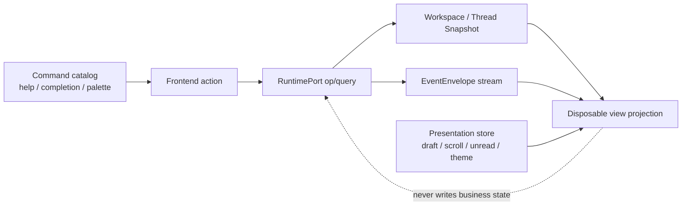

[← 返回地图](./README.md)

# 13 · CLI / TUI 产品体验契约

本文冻结 coda 从“功能可用的终端 Agent”演进为可发现、可诊断、适合长时间使用、易于审阅和恢复的
终端产品时的用户体验边界。它是六条核心旅程、命令发现、前端边界、presentation state、可访问性
和性能预算的 canonical 契约；Runtime、identity、mailbox、control、权限与恢复事实仍以
[12](./12-supervisor-runtime.md) 为上位契约，headless wire 的逐字段定义仍以
[09](./09-cli.md) 为准。

本文的“UX0 基线”只描述 2026-08-01 在阶段提交中实际观察到的行为，不把目标误写成现状。
UX1 的 command catalog、产品子命令、UI routing、onboarding 与 sanitizer 已经完成两轮 review；
当时存在的 classic 与 accessible/plain line REPL 已在后续收敛中退役。当前唯一长驻交互面是 TUI，
另保留 one-shot human renderer 与 headless。UX2 的信息层级、palette、composer、per-thread
presentation state 与 transcript 导航也已完成恰好两轮 review。UX3 的 Runtime-backed review/diff、
approval panel、session switch、manual compact 与 conversation fork/retry 已完成实现及恰好两轮完整
review；第二轮修复后只做了定向验证。UX4 的 TUI theme/PTY、one-shot ASCII、限帧、历史分段、automation
output 与真实 PTY 已完成实现及恰好两轮完整 review；第二轮修复后只做了定向验证，未发起第三轮。
下文只以简短退役说明保留历史背景；所有当前 surface 矩阵和门禁都以 TUI/one-shot/headless 为准。

## 1. 产品不变量与事实边界

1. 高频动作必须同时具备可见入口和稳定键盘路径。一个能力若只能靠记住隐藏键位触发，就不算可发现。
2. 用户随时能回答四个问题：当前在哪个 thread、哪个 run 正在做什么、最近改变了什么、为何正在等待。
3. resize、页面切换、thread 切换和进程恢复不得丢 draft、滚动锚点、未读位置或可重建上下文。秘密是
   唯一例外：秘密不持久化，也不因恢复而回显。
4. CLI 子命令、TUI slash command、help、completion 和错误建议由同一 command catalog 产生；
   one-shot/headless 只暴露各自真实支持的动作，不能各自发明业务语义。
5. UI 只能消费 `RuntimePort` query/snapshot 和 `EventEnvelope`。thread、run、approval、usage、权限、
   queue 和 model 的权威状态不得在 UI 中独立维护。
6. `draft/scroll/search/theme/palette/open-panel/unread-anchor` 是 presentation state，不是 Runtime 事实；
   它们可由独立前端存储保存，但不得被反向解释为 run、approval 或权限状态。
7. 默认 Agent、工具、Runtime、approval、Enter/steer/follow-up/abort 和 legacy headless wire 兼容。新增
   机器输出只能显式 opt in。
8. 所有来自模型、工具、diff、plan、provider、Git、配置和恢复数据的文本都按不可信终端输入处理。



UI 可以缓存由 snapshot/envelope fold 得到的 projection 以便绘制，但该缓存必须可丢弃并从
`snapshot.highWaterSeq + live events` 重建。UI 不得因缓存里的 `running`、pending approval 或 usage
值自行执行权限决策、取消另一个 thread，或跳过 Runtime validation。
冷启动状态栏中的 permission mode 也只读取 `RuntimePort.getWorkspaceSnapshot()`；CLI flag 只配置注入
Runtime 的 `PermissionPolicyPort`，不能直接传给 view 形成平行事实。

## 2. 六条核心用户旅程

### 2.1 首次安装到第一个成功 prompt

入口是 `coda` 或 `coda --help`。无配置交互启动必须保持零 thread、零 journal，并把下一步固定显示为：

```text
1. 登录 provider
2. 选择模型
3. 输入任务
```

用户可从 onboarding action、`/login` 或 `coda auth login` 进入同一认证规格。现有 OpenCode Go preset
必须保留；UX1 在它旁边新增 OpenAI、Anthropic 与 Custom API-key preset，不得用新入口替换或迁移掉
已保存的 OpenCode Go 配置。认证成功只保存 provider，不偷偷选择模型；CLI-edge
`coda models --select <provider/model>` 选择后仍保持零 thread/journal，交互 `/model` 则经 RuntimePort
按既有语义 create/attach 或更新当前 thread。首次 prompt accepted 后，
界面展示 thread、run phase、模型和权限模式。失败必须保留原 draft，错误包含失败步骤和可执行的重试
动作。

完成标准：用户不用阅读 README 也能在一个交互流程内发现登录、选模型和发送任务；OAuth 未实现时
显示 disabled / coming soon，不能伪装成可点击成功路径。

### 2.2 登录、发现并选择模型

OpenCode Go、OpenAI、Anthropic 与 Custom API-key preset 是一级入口；每项显示 provider、认证类型、
endpoint 来源和下一步。OpenCode Go 继续使用既有固定 endpoint 和按模型映射协议的 controller；
OpenAI/Anthropic 是带预填协议/endpoint 的新增 preset，Custom 再选择协议。秘密步骤始终显示字段名、
当前步骤、返回方式和非秘密上下文，只把秘密字符渲染为掩码。网络失败保留已安全落盘的配置并显示 endpoint、HTTP 状态和重试命令，不显示响应正文、
header、key 或底层可能含秘密的异常。

完成标准：`auth status`、`models`、TUI `/login`、`/model` 共享 provider preset/action/catalog 语义；
TUI 使用交互 controller，CLI 使用受保护的单次 secret prompt；用户能
区分“已保存认证”“模型目录刷新成功”“已选择模型”三个状态。

### 2.3 启动长任务、观察进度并中途 steer

发送 prompt 后，持久状态区至少展示：thread、run phase、模型、权限模式、context、Git branch/dirty、
steering/follow-up 队列数量。正文按 turn 展示 assistant 流、工具 activity 和等待原因；活跃 composer 的
prompt 正上方持续显示流光 Working，若 API 返回 reasoning summary 则原位显示该单行摘要。
运行中 Enter 保持 steering；Alt+Enter 或 `/followup` 保持 follow-up；Esc 只 abort 当前可见目标
`(threadId, expectedRunId)`。

切换页面/thread 只改变前端 attachment，不提交 abort/thread_close；后台 run 继续。返回时通过 snapshot
和 cursor 恢复 activity、队列、draft、滚动和未读锚点。

完成标准：任何等待超过一帧的状态都显示原因，例如 provider、tool、approval、retry backoff、
compaction、output drain 或 recovery，而不是只显示无上下文 spinner。

`EventEnvelope.op_completed(prompt|continue)` 是 root activity 的最终权威边界。若 legacy 投影因 abort /
provider 异常竞态缺失最终 `agent_end`，前端 facade 必须据此恢复 idle，并向 TUI 提供一次 terminal
completion；同一 `expectedRunId` 的迟到 abort 返回 `stale_run` 时视为幂等完成，不制造 warning 或第二事实源。

### 2.4 检查工具调用和代码 diff

工具摘要必须能回答名称、目标资源、耗时、状态和结果摘要；完整参数/输出按需展开。不同工具调用之间
保留恰好一行，用于扫描调用边界；同一调用的摘要、完成态和兼容 diff 必须紧贴，不能把 diff 的每一行
做成独立有间距的转录条目。连续的
`read` / `ls` / `glob` / `grep` 是转录紧凑例外：一个 `Exploring` / `Explored` 块只列行动和目标，
相邻 read 合并路径；逐调用耗时、状态、失败与完整结果仍以 Runtime 和 `/review` 为准，紧凑块不得
伪造成功或丢弃失败事实。并行探索在 presentation 边界封口后仍要等待全部真实 result；中止/恢复时
缺失 result 的组只能显示 incomplete/running，不得伪装成 `Explored`。replay 中 paired 与 unmatched
调用仍按 assistant content 的声明顺序投影，不能因 result 位于后续消息而颠倒。plan 是整表替换的单一
checklist，不积累旧快照：`Updated Plan` 标题携带
完成计数，首项以树状 connector 承接，completed 弱化/划线、in-progress 强调、pending 弱化；窄宽续行保持
状态文本列对齐，无色面改用显式 `[x]` / `[>]` / `[ ]`。`bash` 以单块呈现：运行时显示 `Running`，成功完成显示 `• Ran`，失败显示 `✗ Ran`（无色为 `[x] Ran`）；
可执行文件、flag、引号字符串和 shell 分隔符高亮，长命令以竖线续行。输出首两行和末两行可见，
中段折叠为指向 `/review` 的提示，且不重复展示工具尾部的 `exit code N`。reasoning 不写入 transcript：
Working 临时显示 API 返回的摘要，`/review` 才提供完整内容。diff viewer 只使用 Runtime/tool 事件和 `RuntimePort` 的只读 diff query，区分当前
turn 与工作区总 diff，并分组 staged、unstaged、untracked。Runtime 实现可在端口后注入 Git snapshot
service，但 UI/CLI 不直接访问 Git 或 repository，也不根据自由文本猜文件或权限资源；当前 query 与
composition port 已同步维护在 12 的 public RuntimePort 契约。

完成标准：用户能仅用键盘打开工具详情、切文件、滚动完整 diff、返回 transcript，并从相同 command
catalog 发现 `/diff`、`/review`、`/copy` 和 `/export`。

### 2.5 中止、失败、退出后恢复

abort、fatal、普通退出和进程崩溃必须有不同终态。正常退出先收束目标 run/control、drain 当前前端，
再恢复 terminal mode。崩溃后的 canonical recovery 不复活旧 RunId；恢复 UI 先 hot-subscribe，再 hydrate
snapshot，并只消费 `seq > highWaterSeq`。

presentation state 按 `(workspaceId, threadId)` 保存：draft、scroll anchor、unread high-water、search
query（可选）、展开状态和最后打开 panel。切换 thread 前先原子保存当前 presentation state，切回后恢复。
秘密输入、审批决议和未提交 provider key 永不进入该存储。进程异常时允许丢失正在输入的最后一个合并
窗口，但 UX2 后该窗口不得超过 250ms；显式 stash 必须同步 durable。

完成标准：1000 条历史恢复先得到可交互框架，再分段加载历史；用户 draft 与滚动位置不因 resize、切换
或 crash 后 resume 消失。产品不得声称 shell/file 副作用可“完全撤销”；retry/fork 与 checkpoint 的语义
必须分别标注。

### 2.6 在脚本和 CI 中使用 headless

默认 `--json` 保持 legacy NDJSON 逐字节兼容；`--event-format=envelope` 保持 canonical 多 thread transport。
UX4 只增量加入 `--output=text|json|stream-json`、`--final-only`、`--ephemeral`、`--timeout`。人类 progress
写 stderr，最终结果写 stdout；机器格式 stdout 只能含协议记录，并有稳定终态和失败退出码。

完成标准：help/version 不读取配置、不创建目录、不注册 signal、不加载 provider/OpenTUI、不联网；默认
legacy golden、一次性、pipe、continue/resume 全绿；CI 可用 timeout 和 non-zero exit code 区分失败。

## 3. 统一命令规格

UX1 已建立唯一 `CommandCatalog`。当前最小规格为：

```ts
interface CommandSpec {
  readonly id: string;
  readonly category: 'task' | 'session' | 'review' | 'provider' | 'settings' | 'help';
  readonly summary: string;
  readonly cli?: { readonly path: readonly string[]; readonly usage?: string;
    readonly optionIds?: readonly string[] };
  readonly slash?: { readonly name: string; readonly aliases?: readonly string[];
    readonly argumentHint?: string; readonly availableWhileRunning: boolean; readonly order: number };
  readonly shortcuts?: readonly ShortcutSpec[];
}
```

- parser、`-h/--help`、shell completion、unknown-option suggestion、slash 候选与 TUI `/help` 只读
  `COMMAND_SPECS`/`OPTION_SPECS`；不得维护平行字符串数组。UX2 palette 同样扩展这份规格，
  不另建目录。
- UX1 只需要 `availableWhileRunning` 保持既有 slash 门禁；UX2 把它扩展成统一 `availability(context)`，
  只消费 Runtime snapshot/event projection 与明确的 frontend capabilities，返回
  `enabled | disabled(reason) | hidden`。它不读取 Agent/Session private state。
- command handler 只把动作映射到 `RuntimePort` op/query、provider config port 或纯前端 action。基础 CLI
  catalog 用 `RuntimePort.listThreads()`，交互 picker 用 `listThreadDetails()`；不得让 CLI 直读 repository。
- headless canonical action 仍是 `RuntimeOp`；catalog 只生成说明/completion 或显式 edge adapter，不改变
  wire discriminator。
- 所有互斥和缺参错误包含稳定 error code、问题说明和一条可复制的修复命令。unknown flag 使用编辑距离
  给出至多一个最接近候选，但不自动执行。

### 3.1 当前 catalog inventory 与 Runtime-only 输入

精确的 command id、alias、参数、顺序与快捷键以 `src/cli/command-catalog.ts` 的唯一
`COMMAND_SPECS` 为事实源；本文冻结分组、surface 与语义所有者，不再复制一张容易漂移的逐命令
平行清单。当前 inventory 为：

| 分组 | 当前 `CommandSpec.id` | surface / 唯一语义所有者 |
|---|---|---|
| bootstrap/help | `help.show`、`version.show`、`doctor.run`、`completion.generate`、`palette.open`、`app.quit` | help/version 与纯 catalog 路径零副作用；quit 只负责前端收束 |
| provider | `auth.login`、`auth.logout`、`auth.status`、`models.list` | `models --select` 是 `models.list` 的 option，不是独立 id；provider controller 持有凭据与目录 |
| task | `task.exec`、`task.status`、`task.queue`、`task.follow-up`、`task.abort` | prompt/follow-up/abort 经 RuntimePort；status/queue 只读 projection |
| session/conversation | `sessions.list`（CLI）、`session.new`、`session.list`、`session.resume`、`session.switch`、`session.rename`、`session.archive`、`conversation.fork`、`conversation.retry`、`conversation.compact` | CLI catalog 与交互 picker 分开命名；业务动作只经 RuntimePort op/query |
| review/transcript | `transcript.scroll`、`transcript.search`、`transcript.next`、`transcript.previous`、`transcript.latest`、`review.diff`、`review.inspect`、`review.permissions`、`content.copy`、`content.export` | Runtime snapshot/query + frontend presentation；不直读 repository/Agent |
| composer/settings | `history.search`、`draft.edit`、`draft.files`、`draft.stash`、`draft.restore`、`draft.manage`、`settings.vim` | presentation store / editor / workspace completion；秘密不进入该状态 |

Enter 在 running 时提交 steering 是 composer 的状态化输入动作，headless steering 是 Runtime wire op；
当前没有 `/steer` 命令，也没有 `task.steer` CommandSpec。`/followup`、`/abort`、`/status` 与 `/queue`
则分别对应表中的独立 specs。`RuntimePort（新增 query/op）` 表示业务能力必须先扩展并维护 12 的
public port 契约，不能由 CLI 绕过 port 读取 repository、Git 或 Agent/Session private state。

`coda exec` 只在 argv 最前增加显式动作名：去掉 `exec` 后必须与当前一次性模式使用相同 flags、裸 prompt、
pipe、`--json`、continue/resume 解析、stdout/stderr 和退出码；不能另建执行状态机。`coda completion` 只接受
表中四个 shell。`doctor --json`、auth 三分支及所有 slash/text alias 都映射到本表对应的 action id；
命令名、usage、help、completion 与 slash 候选从 `CommandSpec` 生成，provider controller/runtime handler
实现动作本身。

统一全局 option 冻结为 `--ui=auto|tui`（默认 `auto`）、现有非交互 flags 及 UX4 的显式 output
options。两种 UI 取值都只选择 OpenTUI；非完整双 TTY、`TERM=dumb` 或初始化失败时明确退出，不切换前端。

### 3.2 Approval card authoritative fields

`RuntimeControlEvent.control_request.payload` 与 `ThreadSnapshot.pendingControls` 已携带下表定义的
可选 presentation；UI 不能读取内部 `PreparedInvocation`/`PolicyDecision`。public protocol 中的
identity-bound、JSON-safe、深冻结 `ApprovalPresentation` 由 Runtime 在提交
control request 时从同一个 PreparedInvocation/PolicyDecision 构造，并把同一值同时放进
`control_request` EventEnvelope 和 snapshot 的 pending control。这样恢复与 live UI 都只消费
snapshot/envelope；不得新增 CLI→Capability/PolicyEngine side channel。

当前 canonical 形状如下。它不包含 raw args、validator、executor、秘密或可由 UI 再解释的 shell 文本：

```ts
interface ApprovalPresentation {
  readonly requestId: string;
  readonly target: {
    readonly workspaceId: WorkspaceId;
    readonly threadId: ThreadId;
    readonly runId: RunId;
    readonly turnId: TurnId;
  };
  readonly capability: {
    readonly id: string;
    readonly version: string;
    readonly registrationDigest: string;
  };
  readonly normalizedResources: readonly Readonly<Record<string, JSONValue>>[];
  readonly risk: { readonly code: string; readonly reason: string; readonly description: string };
  readonly allowOnce: { readonly invocationId: string; readonly toolCallId: string };
  readonly allowAlways?: Readonly<PolicyGrantScope>;
  readonly revisions: {
    readonly catalog: number;
    readonly effectivePolicy: string;
    readonly policyBasis: string;
    readonly ceiling: string;
    readonly grants: string;
  };
}
```

UX3 的卡片只渲染这个 authoritative presentation。缺字段时显示 unavailable，现代 workspace-grant
card 禁用依赖精确 scope 的动作，不能由 UI 补猜；legacy-global adapter 仅为保持既有 approval 键位可
继续把 `a` 交给 Runtime 规范化，界面仍不得声称知道其 scope：

| 卡片字段 | 权威来源与含义 |
|---|---|
| target identity | presentation 的 workspace/thread/run/turn/request identity |
| capability | presentation 的 id/version/registrationDigest |
| normalized resource | presentation 中已冻结、JSON-safe 的 command 或 file resource；不重新解析 args/shell |
| risk | presentation 的 code/reason/description；UI 可排版但不改写原因 |
| allow once scope | presentation 的 `invocationId/toolCallId`；不写 durable grant、不跨 turn/run/thread |
| allow always scope | 只显示并提交 presentation 的 frozen `PolicyGrantScope`；缺失时 disabled，不能降级伪装 |
| catalog revision | presentation 的 catalog revision 与 registration digest |
| policy revisions | presentation 的 effective/policy-basis/ceiling/grant revisions |

allow-always 的 durable key 还由 Runtime/PolicyEngine 绑定 workspace、capability id/version、
registrationDigest、frozen scope 与 policyBasisRevision。Runtime 只投影 PolicyEngine 给出的 proposal；卡片不把
人类可读 command/file 摘要反向转换成授权 pattern。

## 4. Surface 边界

### 4.1 历史 surface 退役说明

UX0/UX1 曾同时维护 OpenTUI、classic raw/ANSI REPL 与 accessible/plain line REPL。后两条链路已经由
OpenTUI 完全取代，其输入、renderer 动态区、文本命令 parity 与 fallback 契约均不再支持。历史阶段号
仍用于解释旧提交来源，但不能作为当前行为或兼容承诺。

### 4.2 当前功能矩阵

| 动作 | OpenTUI（唯一长驻交互） | one-shot human renderer | legacy headless | envelope headless |
|---|---:|---:|---:|---:|
| prompt | ✓ composer | ✓ 单任务后退出 | ✓ `prompt` | ✓ `RuntimeOp.prompt` |
| steer / follow-up | ✓ Enter / Alt+Enter / slash | — | ✓ `steer` / `follow_up` | ✓ identity op |
| abort 当前 run | ✓ Esc | timeout/signal/close | ✓ `abort` | ✓ identity op |
| approval | ✓ 权威 card | — | ✓ `approval` | ✓ `control_response` |
| provider login/model/logout | ✓ candidate menu | CLI 子命令先配置 | CLI 子命令先配置 | caller supplies model refs |
| session/review/diff/presentation | ✓ Runtime-backed panels/actions | 启动 flags 或显式输出 | machine events | Runtime op/query |
| output ownership | alternate screen/raw TTY | append-only stdout，完成即退出 | NDJSON | envelope/receipt NDJSON |

所有列都只经 RuntimePort。one-shot renderer 不维护 composer、审批、draft、scroll 或 panel；headless 不
加载 OpenTUI，也不因终端能力改变 wire。

TUI 的 review/diff/session/approval/presentation 行为仍以第 2、3、6 节为准；legacy headless wire 不新增
UI 命令，canonical envelope 调用方直接提交 RuntimeOp 或使用 query。fork/retry 只复制 committed
conversation，不 rollback 文件、shell、网络或其他外部副作用。

## 5. TUI 键位

长驻交互键位只属于 TUI；one-shot human renderer 与两种 headless wire 都不维护 composer、panel 或键位
parity。`/help` 只展示当前 TUI 可执行的动作。

| 动作 | TUI |
|---|---|
| send / steer | Enter |
| newline | Shift+Enter |
| follow-up | Alt+Enter 或 `/followup` |
| history | Alt+↑ / Alt+↓；Ctrl+R query/repeat |
| palette | Ctrl+K；分类模糊搜索；↑/↓/Tab/Enter/Esc |
| editor | Ctrl+O 或 `/edit`；编辑器返回前保留原 draft |
| stash/draft | Meta+S；`/stash`、`/restore`、`/draft` |
| files | `@query` 候选 + Tab；`/files` |
| transcript | Ctrl+F；`/search`、`/next`、`/previous`、End 或 `/latest` |
| scroll | PageUp / PageDown；End 回到底部 |
| copy/export | `/copy [latest\|raw]`；`/export [text\|raw\|latest] [path]` |
| Vim | `/vim on\|off`，默认 off |
| diagnostics | `/doctor`；`/auth` / `/auth-status` |
| abort / quit | Esc 中止当前 run；双 Esc、双 Ctrl+C 或 idle Ctrl+D 退出 |
| provider candidate | ↑/↓/Enter，Esc 回退 |
| approval details | 临时替换 composer；↑/↓/Enter；`v` 展开；y/a/n/Esc |
| diff viewer | `/diff`；←/→ 文件、↑/↓ 滚动、Tab scope、Esc 返回 |
| session picker | `/sessions`；输入搜索、↑/↓、Enter、Esc |
| review/permissions | `/review`、`/permissions` |
| lifecycle | `/new`、`/rename`、`/archive`、`/compact`、`/retry`、`/fork` |

所有快捷键都是 ordinary draft 路径；provider secret prompt 和 approval freeze 会先截断这些入口。
Enter、Alt+Enter、Esc 的 prompt/steer/follow-up/abort 语义保持不变。

picker/diff panel 打开时普通 draft 仍由当前 thread 的 presentation store 持有；切换成功才 swap 到目标
state。审批 panel 属于 ephemeral input surface：它固定在页面底部、替换 ordinary composer、不得注册
transcript block；灰色 surface 只包审批内容、选项及末项下方一行留白，确认提示位于其下方的透明 footer；决议后销毁并恢复
原 draft/焦点。pending queue 只显示队首，审批键位优先于 diff/session 等背景 panel；决议后才展示下一张。
TUI 在安装输入 handler 前同步 seed 当前 thread 的 pending queue，再订阅
`RuntimeFrontendSession` 的 frontend-private level snapshot；snapshot 与 legacy event fanout 共用有序
队列，但不进入 headless wire。外部窗口的 allow/deny/abort、already-claimed/not-found 或 thread switch
必须原子替换本地 FIFO、撤下陈旧队首并解除输入冻结；同一队首的重复 snapshot 不能重置 TUI
selection/展开态。本地 response 入队后按 `(threadId, requestId, opId)` 临时隐藏卡片；non-silent
`op_rejected` 或 `control_response` 的 interrupted 终态恢复仍 pending 的卡，`control_resolved` 与两类
silent race 则撤下它，任何迟到旧 op 都不能清除新 response 的状态。每次 broadcast level 都在其
canonical 入队点冻结，不能越过中间 legacy event 被后续 level 合并；targeted initial replay 被更新
broadcast supersede 时才允许跳过。
多行详情或矮窗口放不下完整内容时，panel 围绕当前选项移动窗口，当前决议项必须始终可见。`↑`/`↓` 只改变 presentation selection，`Enter` 才提交
当前项；`v` 只影响展示，不提交 control。legacy request 没有 authoritative presentation 时显示 scope
unavailable；既有 allow-always 输入语义为兼容保留，但 UI 不伪造精确 scope。现代 panel 没有
`allowAlways` 时 TUI 隐藏 `a`，手工输入也只报告 unavailable 并保持 request pending；只有冻结
scope 实际存在才显示并接受该动作。

## 6. Presentation state 与恢复

允许持久化的最小结构如下；这是 frontend-private schema，不进入 Runtime journal：

```ts
interface ThreadPresentationState {
  readonly workspaceId: WorkspaceId;
  readonly threadId: ThreadId | typeof PENDING_PRESENTATION_THREAD_ID;
  readonly draft: string;
  readonly stashedDraft?: string;
  readonly scrollAnchor?: {
    readonly blockKey: string;
    readonly logicalOffset: number;
    readonly fallbackBlockKeys: readonly string[];
    readonly observedHighWaterSeq: number;
  };
  readonly unreadAfterSeq: number;
  readonly search?: { readonly query: string; readonly matchOrdinal: number };
  readonly expandedBlocks: readonly string[];
  readonly activePanel?: 'transcript' | 'tool' | 'diff' | 'sessions' | 'permissions';
  readonly vimEnabled: boolean;
  readonly updatedAt: number;
}
```

- 当前 schema v1 写入 `<runtimeRoot>/presentation-v1/<workspace hash>/<thread hash>.json`，身份不直接成为
  路径段；采用 0600 同目录临时文件 + file fsync + atomic rename + directory fsync，损坏/身份错配时
  quarantine 并回到安全空状态，不阻断 Runtime resume。ordinary draft 以 200ms 合并，显式
  stash/restore、Vim preference、flush/dispose 是同步 durability barrier。barrier 先写候选状态再替换内存；
  写盘失败必须抛出并保留原 draft/stash，surface 不清 composer、不打印成功，shutdown 返回非零。
- create 冷启动使用固定的 `PENDING_PRESENTATION_THREAD_ID` 作为 frontend-only key；它绝不提交给
  Runtime。store 在 attachment 前载入该 key，真实 thread attachment listener 先写目标 thread 文件，再
  durable 清空 pending 源，最后切换内存 owner；迁移 barrier 失败则仍由 pending 源持有可恢复 draft。
  显式 resume 从一开始使用目标 `ThreadId`，不得把无关 cold draft 搬进旧会话。
- Ctrl+O 与 palette/slash `/edit` 共用同一异步 ownership：暂停 raw mode 后、编辑器返回前 composer 和
  store 继续保存原 draft；只有成功返回才替换，失败或信号退出仍恢复原 draft。
- provider 表单从进入流程到根步骤退出都使用与任务 composer 隔离的 ephemeral buffer；普通 name/base URL
  也不能覆盖任务 draft、进入 prompt history 或传给 presentation API，流程结束后原样恢复任务 draft。
  secret buffer 在此基础上还不得进入 frame/transcript/log/error。
- transcript block key 来自 snapshot 可恢复的稳定 identity：message 用 `message:<AgentMessage.id>`，
  part/tool block 再附 content index 或 toolCallId；同一 provider 可跨 turn 复用 toolCallId，因此首个 occurrence
  保持 `tool:<toolCallId>`，后续 occurrence 按完整 canonical transcript 的时间顺序附确定 ordinal，live 与 replay
  必须得到同一个 key，不能使用当前 renderable 数量或装载 segment 顺序。不得只用 envelope seq，因为 v1
  snapshot-only 历史没有历史 envelope。`fallbackBlockKeys` 以距离从近到远保存一个有界邻居链。
- resize 只重算 visual rows，不改 scroll anchor 的 `(blockKey, logicalOffset)`。用户手动上滚后 live event 只
  增加 unread，不抢回 sticky bottom；jump-to-latest 才清 unread。
- wheel 输入按“一次事件、一帧”结算。只有 ScrollBox 布局后实际移动或在 segment 顶部实际装载更早历史，
  才进入 manual scroll；queued Markdown 尚无可滚动布局时的 no-op 不写 anchor、manual 或 unread。
  manual 期间暂停 native sticky，连续小幅上滚不得在 `maximum - 1` 回弹；明确下滚到精确 maximum、
  `End` 或 `/latest` 才恢复 sticky 并清 unread。只有真实 viewport 变化才重抓 stable anchor；live 输出
  复用已提交 anchor，且每个 unread interval 只持久化一次 boundary，不能按 provider delta 扫描全部 block，
  也不能选中尚未布局、坐标仍为默认值的新 block。首次 PageUp 装载 segment 后必须产生 page 级可见位移。
- transcript reset 建立新的 presentation generation；旧 thread 排队中的 anchor restore、segment load、wheel
  和 search frame callback 都不得写入新 thread 的 viewport 或 durable state。
- active panel 是 transcript/diff/sessions 可见性和输入路由的唯一 presentation 判据。diff 或 sessions 打开时，
  live event、status/composer refresh 与 resize 不得重新显示 transcript；键盘与鼠标只作用于当前可见 panel。
  panel payload 不属于 durable presentation state，恢复时必须同步回退 transcript；异步 diff/session 查询只有在
  发起它的 panel generation 仍 active 时才能提交可见结果。
- 恢复时先找 exact blockKey，再找首个仍存在的 fallback key。compaction 已删除全部候选时定位到新 summary/
  第一个 surviving block，并明确显示“锚点内容已压缩”；这是内容已被权威 compaction 删除后的诚实 fallback，
  不能把 envelope seq 伪装成仍可定位的 transcript identity。`observedHighWaterSeq`/`unreadAfterSeq` 只用于
  live event 未读计算，不参与 snapshot block 定位。
- 启动/恢复同一目标 thread 时先 replay canonical messages，再按 stable anchor 恢复 presentation；
  Ctrl+R 历史也从同一 canonical user transcript 重建。UX3 thread switch 先 durable 保存当前
  presentation state；这一步是 Runtime action 之前的严格 barrier，失败时 thread/画面/approval 全部留在
  源。workspace-wide hot subscription 已持续接收目标事件，随后读取目标 snapshot/cursor、splice buffered
  envelope，以目标 transcript 替换 Ctrl+R history，最后恢复目标 presentation 与 pending controls。切换不
  关闭源 thread、不影响后台 run；目标投影或 new/switch 失败时恢复并 hydrate 原 attachment/presentation，
  不能留下半迁移 state。attachment 的 canonical transcript 只 replay 一次，switch handler 不得重复注入
  同一 snapshot。
- UI cache 的 approval/activity/usage 永不写入该结构；这些字段只从新 snapshot/envelope 恢复。

## 7. 终端安全

所有 human-readable surface 必须在布局/宽度计算前调用同一个 sanitizer：

1. 删除 CSI、OSC（含 OSC 52）、DCS、APC、PM、SOS 及其 7-bit/8-bit terminator 形态；
2. 规范化 CRLF/CR 为 LF；正文仅保留 tab/LF，状态/title 再折成单行；
3. 删除其余 C0、DEL 与全部 C1；
4. sanitizer 必须覆盖 user/model/tool/diff/plan/provider/Git/config/recovery/error 文本；
5. coda 自己生成的 ANSI 只能在清洗后的结构化 token 上由 renderer 添加，绝不能清洗后再拼接不可信文本；
6. headless JSON 不做内容删改以保持 wire 兼容，但 JSON serializer 必须保证控制字符转义，日志仍不得回显
   秘密。

OpenTUI、one-shot human renderer、产品命令和 human stderr 统一经过 `terminal-sanitize.ts`。
legacy/canonical JSON payload 为 wire 兼容不改变内容，只依赖
JSON escaping；任何伴随的人类诊断仍先清洗。

## 8. 环境 characterization baseline

`src/cli/ux-characterization.test.ts` 与既有 `tui.test.ts`、`renderer.test.ts`、`headless.test.ts`、
`e2e/tui.test.ts` 共同冻结：

| 环境 | 当前行为 |
|---|---|
| 40×10 | 首次交互后隐藏紧凑 header；无 Logo/tips/model；保留双横线 user prompt、draft、workspace、context 和可见光标 |
| 80×24 | 首次交互后使用 3 行紧凑 header；保留 transcript、prompt、workspace、context/model |
| 120×40 | 与 80×24 同层级，更多 transcript 空间；不把短内容贴到底部 |
| CJK / emoji | TestRenderer 保留 CJK/ZWJ emoji，并精确断言 composer 光标显示列；one-shot renderer 的静态截断使用相同显示宽度规则 |
| `NO_COLOR` / `--no-color` | parser/main wiring 与 renderer 回归验证 `color:false`；one-shot 输出不生成 cursor 控制 |
| `TERM=dumb` + 双 TTY | `--ui=auto\|tui` 明确拒绝且不静默切换前端；调用方改用 one-shot 或 headless |
| tmux (`screen-256color`/`tmux-256color`) | 双 TTY 时仍可进入 OpenTUI |
| SSH (`xterm-256color`) | 双 TTY时仍可进入 OpenTUI；SSH 环境变量本身不改变语义 |
| stdin TTY、stdout 非 TTY | 长驻交互明确拒绝且不初始化 OpenTUI raw 模式；显式 one-shot/headless 仍可用 |
| stdin 非 TTY | 无 `--json` 时读为 one-shot prompt；`--json` 时 NDJSON |

UX2 characterization 在写入 ordinary draft/user message 后视为“首次交互已发生”：40×10、80×24 与
120×40 都不再显示 Logo/tips；40×10 进一步隐藏紧凑 header，为三行双横线 user prompt 与完整 footer
让出空间，40 列可裁掉完整 model 字符串，80/120 列保留紧凑 taskbar 与 model。首次交互前的 onboarding
frame 仍按 viewport 尺寸选择完整或精简层级，resize 不会让已收缩的装饰重新出现。

UX4 的真实 PTY 矩阵在此基础上实际覆盖正常退出、40×10 resize + 多行 bracketed paste、运行中 abort、
approval abort、fatal、悬挂 provider HTTP 请求中退出、OpenTUI 初始化失败并退出、`TERM=dumb`、
`NO_COLOR` 与显式 TUI 拒绝；凡进入全屏的路径都逐项验证 title、mouse、bracketed paste、cursor 与
alternate screen 的 enable/restore 顺序。所有 Expect 驱动路径还会在受测命令前后读取同一个 slave
PTY 的 `stty -g` 并要求完全相等，因此 raw mode 恢复由真实 termios 状态证明，而不是从 leave sequence
间接推测。

## 9. UX0 性能基线

测量日期 2026-08-01；MacBook Air `Mac16,12`、arm64、10 logical CPU、Bun 1.3.14。数值是本机一次
characterization run，用于发现数量级变化，不是跨机器 SLA：

| 场景 | UX0 观察值 | characterization ceiling | UX4 目标 |
|---|---:|---:|---:|
| 构建产物冷进程到参数错误退出（12 次） | median 69.6ms；max/p95 sample 136.0ms | 文档观察 | help/version 仍须零副作用 |
| 80×24 TestRenderer 创建到首帧 | 34.3ms | 2s | 1000 历史也先快速可交互 |
| 键盘输入 CJK 到 flush | 17.9ms | 1s | 正常负载 <100ms |
| 10,000 个单字符 delta 后一次 flush | 9,712.5ms | 30s | 按帧合并，最终内容无丢失/重排 |
| replay 1,000 条短消息 | 35.6ms | 5s | 分段/窗口化，不阻塞首个可交互帧 |

UX4 已消除“每个 delta 立刻重排 Markdown”的债务：同一 native frame 中相同 assistant/tool/status task
覆盖旧 task，终态同步 canonical 完整内容。测试以 0–9 patterned stream 精确比较全部 10,000 字符，
同时固定 visual frame callback `<=2`、wall-clock `<1s` 和输入反馈 `<100ms`。1,000 条单-message turn
历史的首帧只构造最后 120 条与 segment banner（121 个 child）；一般 transcript 为保留完整 turn 可把
单段向前扩至最多 240 条。八次 PageUp 后再精确检查首/中/末及全部 1,001 个 renderable 的顺序。时间
上限只用于发现数量级退化；内容、child 数与 frame 数才是 correctness 门禁。

## 10. 阶段边界

| 阶段 | 允许范围 | 明确完成条件 |
|---|---|---|
| UX0 | 本文、09/10/11/地图与 characterization tests | 生产行为零变化；环境/性能/旅程/surface 边界有证据 |
| UX1 | command catalog、help/version、CLI 子命令、`--ui`、onboarding、sanitizer、TUI/one-shot 边界与 README | 已完成恰好两轮 review；help/version 零副作用且 legacy headless wire 全绿 |
| UX2 | TUI 层级、palette、composer、presentation state、搜索/copy/export | 已完成恰好两轮 review；cold pending draft 可恢复并迁移，permission 只读 Runtime workspace snapshot；provider 全表单隔离；durability failure 可见且不清 draft |
| UX3 | reasoning/tool/diff/review、session workflow、approval panel、manual compact、retry/fork | 已完成恰好两轮 review；UI 只展示 Runtime/PreparedInvocation/PolicyEngine 权威范围 |
| UX4 | TUI theme/PTY 加固、one-shot ASCII、帧合并/分段加载、自动化输出、真实 PTY | 已完成恰好两轮 review；10k delta 限帧、输入 <100ms、broken-pipe 收束与真实 termios 恢复均有门禁 |

每阶段恰好两轮完整 Agent review。第一轮修复后复跑定向门禁；第二轮仍可修复并定向验证，但不得发起
第三轮完整 review。随后 `bun run check`、`git diff --check`、scope/public export 审计、单独 commit 和
push，成功后才进入下一阶段。

## 11. 非目标

本轮不实现多 Agent、子 Agent 页面、云任务、远程控制、插件市场、新 provider 协议、server/daemon
或虚假的文件“完全撤销”。Runtime 已有的多 thread 能力可以支撑 session switching，但产品 UI 不把它
扩张为新的 Agent 拓扑或远程执行协议。

## 相关文档

- [09 CLI / TUI](./09-cli.md) —— 具体启动分派、键位和 headless wire
- [10 测试策略](./10-testing.md) —— characterization、PTY 和性能门禁
- [11 路线图](./11-roadmap.md) —— UX0–UX4 串行交付与 review gate
- [12 Supervisor Runtime](./12-supervisor-runtime.md) —— RuntimePort、snapshot/envelope 与事实边界
