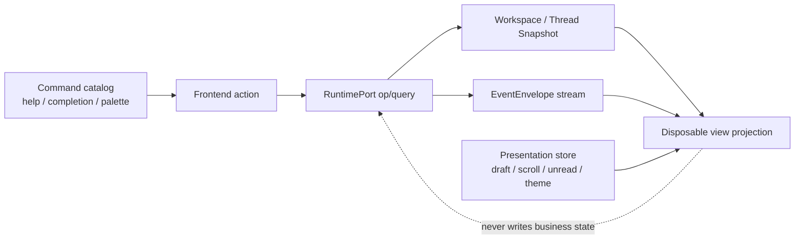

[← 返回地图](./README.md)

# 13 · CLI / TUI 产品体验契约

本文冻结 coda 从“功能可用的终端 Agent”演进为可发现、可诊断、适合长时间使用、易于审阅和恢复的
终端产品时的用户体验边界。它是六条核心旅程、命令发现、前端 parity、presentation state、可访问性
和性能预算的 canonical 契约；Runtime、identity、mailbox、control、权限与恢复事实仍以
[12](./12-supervisor-runtime.md) 为上位契约，headless wire 的逐字段定义仍以
[09](./09-cli.md) 为准。

本文的“UX0 基线”只描述 2026-08-01 在阶段提交中实际观察到的行为，不把目标误写成现状。
UX1 的 command catalog、产品子命令、UI routing、onboarding、sanitizer、classic 编辑修复与最低
accessible/plain 文本面已经完成两轮 review；UX2 的信息层级、palette、composer、per-thread
presentation state 与 transcript 导航也已完成恰好两轮 review。UX3 的 Runtime-backed review/diff、
approval card、session switch、manual compact 与 conversation fork/retry 已完成实现及恰好两轮完整
review；第二轮修复后只做了定向验证。UX4 仍是后续产品承诺。
UX0/UX1 历史矩阵继续保留，便于区分阶段观察值、已交付行为和最终目标。

## 1. 产品不变量与事实边界

1. 高频动作必须同时具备可见入口和稳定键盘路径。一个能力若只能靠记住隐藏键位触发，就不算可发现。
2. 用户随时能回答四个问题：当前在哪个 thread、哪个 run 正在做什么、最近改变了什么、为何正在等待。
3. resize、页面切换、thread 切换和进程恢复不得丢 draft、滚动锚点、未读位置或可重建上下文。秘密是
   唯一例外：秘密不持久化，也不因恢复而回显。
4. CLI 子命令、slash command、classic/accessibility 文本命令、help、completion 和错误建议由同一
   command catalog 产生。不同 surface 可以有不同呈现，但不能各自发明动作语义。
5. UI 只能消费 `RuntimePort` query/snapshot 和 `EventEnvelope`。thread、run、approval、usage、权限、
   queue 和 model 的权威状态不得在 UI 中独立维护。
6. `draft/scroll/search/theme/palette/open-panel/unread-anchor` 是 presentation state，不是 Runtime 事实；
   它们可由独立前端存储保存，但不得被反向解释为 run、approval 或权限状态。
7. 默认 Agent、工具、Runtime、approval、Enter/steer/follow-up/abort 和 legacy headless wire 兼容。新增
   机器输出只能显式 opt in。
8. 所有来自模型、工具、diff、plan、provider、Git、配置和恢复数据的文本都按不可信终端输入处理。



UI 可以缓存由 snapshot/envelope fold 得到的 projection 以便绘制，但该缓存必须可丢弃并从
`snapshot.highWaterSeq + live events` 重建。UI 不得因缓存里的 `running`、pending approval 或 usage
值自行执行权限决策、取消另一个 thread，或跳过 Runtime validation。
冷启动状态栏中的 permission mode 也只读取 `RuntimePort.getWorkspaceSnapshot()`；CLI flag 只配置注入
Runtime 的 `PermissionPolicyPort`，不能直接传给 view 形成平行事实。

## 2. 六条核心用户旅程

### 2.1 首次安装到第一个成功 prompt

入口是 `coda` 或 `coda --help`。无配置交互启动必须保持零 thread、零 journal，并把下一步固定显示为：

```text
1. 登录 provider
2. 选择模型
3. 输入任务
```

用户可从 onboarding action、`/login` 或 `coda auth login` 进入同一认证规格。现有 OpenCode Go preset
必须保留；UX1 在它旁边新增 OpenAI、Anthropic 与 Custom API-key preset，不得用新入口替换或迁移掉
已保存的 OpenCode Go 配置。认证成功只保存 provider，不偷偷选择模型；CLI-edge
`coda models --select <provider/model>` 选择后仍保持零 thread/journal，交互 `/model` 则经 RuntimePort
按既有语义 create/attach 或更新当前 thread。首次 prompt accepted 后，
界面展示 thread、run phase、模型和权限模式。失败必须保留原 draft，错误包含失败步骤和可执行的重试
动作。

完成标准：用户不用阅读 README 也能在一个交互流程内发现登录、选模型和发送任务；OAuth 未实现时
显示 disabled / coming soon，不能伪装成可点击成功路径。

### 2.2 登录、发现并选择模型

OpenCode Go、OpenAI、Anthropic 与 Custom API-key preset 是一级入口；每项显示 provider、认证类型、
endpoint 来源和下一步。OpenCode Go 继续使用既有固定 endpoint 和按模型映射协议的 controller；
OpenAI/Anthropic 是带预填协议/endpoint 的新增 preset，Custom 再选择协议。秘密步骤始终显示字段名、
当前步骤、返回方式和非秘密上下文，只把秘密字符渲染为掩码。网络失败保留已安全落盘的配置并显示 endpoint、HTTP 状态和重试命令，不显示响应正文、
header、key 或底层可能含秘密的异常。

完成标准：`auth status`、`models`、`/login`、`/model` 和 classic/accessibility 等价命令共享 provider
preset/action/catalog 语义；TUI/classic 共用交互 controller，CLI 使用受保护的 secret prompt；用户能
区分“已保存认证”“模型目录刷新成功”“已选择模型”三个状态。

### 2.3 启动长任务、观察进度并中途 steer

发送 prompt 后，持久状态区至少展示：thread、run phase、模型、权限模式、context、Git branch/dirty、
steering/follow-up 队列数量。正文按 turn 展示 assistant 流、reasoning 摘要、工具 activity 和等待原因。
运行中 Enter 保持 steering；Alt+Enter 或 `/followup` 保持 follow-up；Esc 只 abort 当前可见目标
`(threadId, expectedRunId)`。

切换页面/thread 只改变前端 attachment，不提交 abort/thread_close；后台 run 继续。返回时通过 snapshot
和 cursor 恢复 activity、队列、draft、滚动和未读锚点。

完成标准：任何等待超过一帧的状态都显示原因，例如 provider、tool、approval、retry backoff、
compaction、output drain 或 recovery，而不是只显示无上下文 spinner。

`EventEnvelope.op_completed(prompt|continue)` 是 root activity 的最终权威边界。若 legacy 投影因 abort /
provider 异常竞态缺失最终 `agent_end`，前端 facade 必须据此恢复 idle，并向兼容 surface 提供一次性 terminal
fallback；同一 `expectedRunId` 的迟到 abort 返回 `stale_run` 时视为幂等完成，不制造 warning 或第二事实源。

### 2.4 检查工具调用和代码 diff

工具摘要必须能回答名称、目标资源、耗时、状态和结果摘要；完整参数/输出按需展开。reasoning 默认折叠，
只显示状态和耗时。diff viewer 只使用 Runtime/tool 事件和 `RuntimePort` 的只读 diff query，区分当前
turn 与工作区总 diff，并分组 staged、unstaged、untracked。Runtime 实现可在端口后注入 Git snapshot
service，但 UI/CLI 不直接访问 Git 或 repository，也不根据自由文本猜文件或权限资源；当前 query 与
composition port 已同步维护在 12 的 public RuntimePort 契约。

完成标准：用户能仅用键盘打开工具详情、切文件、滚动完整 diff、返回 transcript，并从相同 command
catalog 发现 `/diff`、`/review`、`/copy` 和 `/export`。

### 2.5 中止、失败、退出后恢复

abort、fatal、普通退出和进程崩溃必须有不同终态。正常退出先收束目标 run/control、drain 当前前端，
再恢复 terminal mode。崩溃后的 canonical recovery 不复活旧 RunId；恢复 UI 先 hot-subscribe，再 hydrate
snapshot，并只消费 `seq > highWaterSeq`。

presentation state 按 `(workspaceId, threadId)` 保存：draft、scroll anchor、unread high-water、search
query（可选）、展开状态和最后打开 panel。切换 thread 前先原子保存当前 presentation state，切回后恢复。
秘密输入、审批决议和未提交 provider key 永不进入该存储。进程异常时允许丢失正在输入的最后一个合并
窗口，但 UX2 后该窗口不得超过 250ms；显式 stash 必须同步 durable。

完成标准：1000 条历史恢复先得到可交互框架，再分段加载历史；用户 draft 与滚动位置不因 resize、切换
或 crash 后 resume 消失。产品不得声称 shell/file 副作用可“完全撤销”；retry/fork 与 checkpoint 的语义
必须分别标注。

### 2.6 在脚本和 CI 中使用 headless

默认 `--json` 保持 legacy NDJSON 逐字节兼容；`--event-format=envelope` 保持 canonical 多 thread transport。
UX4 只增量加入 `--output=text|json|stream-json`、`--final-only`、`--ephemeral`、`--timeout`。人类 progress
写 stderr，最终结果写 stdout；机器格式 stdout 只能含协议记录，并有稳定终态和失败退出码。

完成标准：help/version 不读取配置、不创建目录、不注册 signal、不加载 provider/OpenTUI、不联网；默认
legacy golden、一次性、pipe、continue/resume 全绿；CI 可用 timeout 和 non-zero exit code 区分失败。

## 3. 统一命令规格

UX1 已建立唯一 `CommandCatalog`。当前最小规格为：

```ts
interface CommandSpec {
  readonly id: string;
  readonly category: 'task' | 'session' | 'review' | 'provider' | 'settings' | 'help';
  readonly summary: string;
  readonly cli?: { readonly path: readonly string[]; readonly usage?: string;
    readonly optionIds?: readonly string[] };
  readonly slash?: { readonly name: string; readonly aliases?: readonly string[];
    readonly argumentHint?: string; readonly availableWhileRunning: boolean; readonly order: number };
  readonly shortcuts?: readonly ShortcutSpec[];
}
```

- parser、`-h/--help`、shell completion、unknown-option suggestion、slash 候选与 TUI/classic/accessibility
  `/help` 只读 `COMMAND_SPECS`/`OPTION_SPECS`；不得维护平行字符串数组。UX2 palette 同样扩展这份规格，
  不另建目录。
- UX1 只需要 `availableWhileRunning` 保持既有 slash 门禁；UX2 把它扩展成统一 `availability(context)`，
  只消费 Runtime snapshot/event projection 与明确的 frontend capabilities，返回
  `enabled | disabled(reason) | hidden`。它不读取 Agent/Session private state。
- command handler 只把动作映射到 `RuntimePort` op/query、provider config port 或纯前端 action。基础 CLI
  catalog 用 `RuntimePort.listThreads()`，交互 picker 用 `listThreadDetails()`；不得让 CLI 直读 repository。
- headless canonical action 仍是 `RuntimeOp`；catalog 只生成说明/completion 或显式 edge adapter，不改变
  wire discriminator。
- 所有互斥和缺参错误包含稳定 error code、问题说明和一条可复制的修复命令。unknown flag 使用编辑距离
  给出至多一个最接近候选，但不自动执行。

### 3.1 Canonical action inventory

下表在 UX0 冻结名称与语义所有者；UX1–UX3 按阶段逐项落地。`RuntimePort（新增 query/op）` 表示该
业务能力必须先扩展并维护 12 的 public port 契约，不能由 CLI 绕过 port 读取 repository、Git 或
Agent/Session private state。

| action id | CLI 入口 | TUI / classic / accessible 入口 | 可用性与唯一语义所有者 |
|---|---|---|---|
| `help.show` | `coda -h`、`coda --help` | `/help`、palette | 总是；纯 `CommandCatalog`，零副作用 |
| `version.show` | `coda -V`、`coda --version` | help/about | 总是；package build metadata，零副作用 |
| `doctor.run` | `coda doctor [--json]` | `/doctor`、palette | 无 run 也可；CLI-edge 只读诊断，`--json` 只写机器 stdout |
| `completion.generate` | `coda completion <bash\|zsh\|fish\|powershell>` | help link | 总是；纯 catalog generator，未知 shell 退出 2 |
| `auth.login` | `coda auth login` | `/login` | idle/no-model；provider configuration controller |
| `auth.logout` | `coda auth logout` | `/logout` | 已配置 provider；provider configuration controller |
| `auth.status` | `coda auth status` | `/auth`（alias `/auth-status`）、palette | 总是；只返回无秘密 provider 状态 |
| `models.list` | `coda models` | `/model` 的目录步骤 | 已认证；只列 provider catalog，不创建 thread |
| `models.select` | `coda models --select <ref>` | `/model` 的确认步骤 | CLI 只保存已验证的默认选择且保持零 thread/journal；首次任务/resume 才由 composition root attach，已 attach `/model` 才经 RuntimePort 模型配置适配 |
| `task.exec` | `coda exec [现有 flags] [prompt]` | prompt composer | root 裸 prompt/`-p` 的增量别名；同一 RuntimePort prompt、退出码和 wire |
| `task.steer` | headless op | Enter / `/steer` | 当前目标 run 可 steer；RuntimePort identity op |
| `task.follow_up` | headless op | Alt+Enter / `/followup` | 已选模型；RuntimePort identity op |
| `task.abort` | signal/headless op | Esc / `/abort` | 仅当前 `(threadId, expectedRunId)`；RuntimePort op |
| `task.status_queue` | — | `/status`、`/queue` | attachment 存在；只读 RuntimePort snapshot |
| `sessions.list` | `coda sessions` | `/sessions` | 零 attached thread 也可；`RuntimePort.listThreadDetails()` |
| `sessions.new` | — | `/new` | idle 或显式后台切换；RuntimePort thread create |
| `sessions.resume` | 保留 `--resume` | `/resume [thread]` | catalog 中可恢复；RuntimePort resume |
| `sessions.switch` | — | `/switch [thread]` | 目标存在；只切 attachment/query，不 abort 源 run |
| `sessions.rename` | — | `/rename <name>` | 目标存在；`RuntimePort.thread_rename` |
| `sessions.archive` | — | `/archive [on\|off]` | archive-on 要求目标无 active control；`RuntimePort.thread_archive` |
| `review.diff` | 显式 command/output | `/diff [turn\|workspace]` | attachment 存在；`RuntimePort.getDiffSnapshot()` |
| `review.run` | 显式 command/output | `/review` | attachment 存在；`RuntimePort.getReviewSnapshot()`，不直调 Agent |
| `content.copy` | 显式 command/output | `/copy [latest\|raw]` | snapshot/envelope projection；纯前端 copy/export port |
| `content.export` | 显式 command/output | `/export [path]` | snapshot/envelope projection；安全导出 port |
| `context.compact` | headless op | `/compact` | attachment 可 compact；RuntimePort op |
| `permissions.show` | 显式 command/output | `/permissions` | attachment 存在；只读 policy/control snapshot/query |
| `conversation.retry` | — | `/retry [turn-id]` | 已终结 turn、源无 active/control；RuntimePort conversation op |
| `conversation.fork` | — | `/fork [turn-id]` | 有 committed transcript、源无 active/control；RuntimePort conversation op |
| `draft.stash_restore` | — | `/stash`、`/restore` | 非 secret composer；presentation store，不写 Runtime |

`coda exec` 只在 argv 最前增加显式动作名：去掉 `exec` 后必须与当前一次性模式使用相同 flags、裸 prompt、
pipe、`--json`、continue/resume 解析、stdout/stderr 和退出码；不能另建执行状态机。`coda completion` 只接受
表中四个 shell。`doctor --json`、auth 三分支及所有 slash/text alias 都映射到本表对应的 action id；
命令名、usage、help、completion 与 slash 候选从 `CommandSpec` 生成，provider controller/runtime handler
实现动作本身。

统一全局 option 至少冻结：`--ui=auto|tui|classic|accessible|plain`（默认 `auto`）、现有全部 flags，及
UX4 的显式 output options。UX1 的 `accessible` 最低语义是 append-only、无 alternate screen、无动画、
无鼠标依赖；UX4 再补 ASCII fallback、主题、性能与完整 PTY 加固。

### 3.2 Approval card authoritative fields

`RuntimeControlEvent.control_request.payload` 与 `ThreadSnapshot.pendingControls` 已携带下表定义的
可选 presentation；UI 不能读取内部 `PreparedInvocation`/`PolicyDecision`。public protocol 中的
identity-bound、JSON-safe、深冻结 `ApprovalPresentation` 由 Runtime 在提交
control request 时从同一个 PreparedInvocation/PolicyDecision 构造，并把同一值同时放进
`control_request` EventEnvelope 和 snapshot 的 pending control。这样恢复与 live UI 都只消费
snapshot/envelope；不得新增 CLI→Capability/PolicyEngine side channel。

当前 canonical 形状如下。它不包含 raw args、validator、executor、秘密或可由 UI 再解释的 shell 文本：

```ts
interface ApprovalPresentation {
  readonly requestId: string;
  readonly target: {
    readonly workspaceId: WorkspaceId;
    readonly threadId: ThreadId;
    readonly runId: RunId;
    readonly turnId: TurnId;
  };
  readonly capability: {
    readonly id: string;
    readonly version: string;
    readonly registrationDigest: string;
  };
  readonly normalizedResources: readonly Readonly<Record<string, JSONValue>>[];
  readonly risk: { readonly code: string; readonly reason: string; readonly description: string };
  readonly allowOnce: { readonly invocationId: string; readonly toolCallId: string };
  readonly allowAlways?: Readonly<PolicyGrantScope>;
  readonly revisions: {
    readonly catalog: number;
    readonly effectivePolicy: string;
    readonly policyBasis: string;
    readonly ceiling: string;
    readonly grants: string;
  };
}
```

UX3 的卡片只渲染这个 authoritative presentation。缺字段时显示 unavailable，现代 workspace-grant
card 禁用依赖精确 scope 的动作，不能由 UI 补猜；legacy-global adapter 仅为保持既有 approval 键位可
继续把 `a` 交给 Runtime 规范化，界面仍不得声称知道其 scope：

| 卡片字段 | 权威来源与含义 |
|---|---|
| target identity | presentation 的 workspace/thread/run/turn/request identity |
| capability | presentation 的 id/version/registrationDigest |
| normalized resource | presentation 中已冻结、JSON-safe 的 command 或 file resource；不重新解析 args/shell |
| risk | presentation 的 code/reason/description；UI 可排版但不改写原因 |
| allow once scope | presentation 的 `invocationId/toolCallId`；不写 durable grant、不跨 turn/run/thread |
| allow always scope | 只显示并提交 presentation 的 frozen `PolicyGrantScope`；缺失时 disabled，不能降级伪装 |
| catalog revision | presentation 的 catalog revision 与 registration digest |
| policy revisions | presentation 的 effective/policy-basis/ceiling/grant revisions |

allow-always 的 durable key 还由 Runtime/PolicyEngine 绑定 workspace、capability id/version、
registrationDigest、frozen scope 与 policyBasisRevision。Runtime 只投影 PolicyEngine 给出的 proposal；卡片不把
人类可读 command/file 摘要反向转换成授权 pattern。

## 4. Surface parity

图例：`✓` 当前已有；`△` 当前部分可用或仅视觉/命令形态不同；`—` UX0 尚无；`目标` 表示后续阶段
必须提供。

### 4.1 UX0 实际功能矩阵

| 动作 | OpenTUI | classic | plain one-shot | legacy headless | envelope headless |
|---|---:|---:|---:|---:|---:|
| prompt | ✓ | ✓ | ✓ | ✓ `prompt` | ✓ `RuntimeOp.prompt` |
| steer | ✓ Enter | ✓ Enter | — | ✓ `steer` | ✓ |
| follow-up | ✓ Alt+Enter / `/followup` | ✓ Alt+Enter / `/followup` | — | ✓ `follow_up` | ✓ |
| abort 当前 run | ✓ Esc | ✓ Esc | signal/close | ✓ `abort` | ✓ identity op |
| approval once/always/deny | ✓ card-like footer 之前的单行形态 | ✓ 动态提示 | — | ✓ `approval` | ✓ `control_response` |
| provider login/model/logout | ✓ candidate menu | ✓ 编号/名称 | — | — | caller supplies model refs |
| queue/status/help | ✓ slash | ✓ slash | — | wire 自描述有限 | protocol types |
| session list/switch/rename/archive | — | — | `--continue/--resume` 仅启动期 | — | lifecycle ops 中仅 create/resume/close |
| transcript search/copy/export | — | — | shell 重定向 | 下游自行处理 | 下游自行处理 |
| full diff/review | 截断摘要 | 截断摘要 | 截断摘要 | tool event details | tool event details |
| accessible append-only mode | — | `TERM=dumb` 是 classic，不是完整 accessible contract | ✓ 输出形态 | ✓ | ✓ |

当前 OpenTUI 与 classic 都使用 `RuntimeFrontendSession`；plain 复用 classic renderer；legacy/envelope
headless 都经 RuntimePort。classic/plain renderer 在 UX0 仍存在未统一 sanitizer 的已知债务，已由
`ux-characterization.test.ts` 安全地在内存字符串中冻结，UX1 必须有意翻转该断言。

### 4.2 UX1 历史功能矩阵

| 动作 | OpenTUI | classic | accessible | plain | headless / CLI |
|---|---:|---:|---:|---:|---:|
| prompt / steer / follow-up / abort | keys + slash | keys + slash | 行与文本命令 | one-shot | legacy/canonical op；`exec` 别名 |
| help / command discovery | catalog slash help | catalog slash help | catalog 文本 help | `--help` | `--help`/completion，薄 bootstrap |
| provider auth/model/logout | preset candidate | preset 编号/名称 | `/login` 引导安全 CLI；model/logout 文本命令 | CLI 子命令 | `auth`/`models`，零 thread |
| session inventory/resume | 启动期 continue/resume | 同左 | 同左 | `sessions`/resume | `sessions` 只经 RuntimePort |
| sanitizer | 共享 sanitizer | 共享 sanitizer | 共享 sanitizer | 共享 sanitizer | human stderr 清洗；JSON payload 不改 wire |
| terminal mode | alternate screen | raw + ANSI 动态区 | append-only、无 raw/alternate/mouse/animation | 同 accessible | stdout/stderr/NDJSON |

UX1 尚未实现 session switch/picker、transcript search/copy/export、完整 diff/review 或 persistent
presentation state；这些仍按 UX2/UX3 分阶段交付。

### 4.3 UX2 已交付功能矩阵

| 动作 | OpenTUI | classic | accessible / plain interactive | headless / CLI |
|---|---:|---:|---:|---:|
| persistent status | phase/thread/permissions/queue/unread + cwd/branch* + context/model 三行 | renderer status/事件行 | append-only status/queue | canonical events / stderr |
| command discovery | Ctrl+K categorized fuzzy palette，参数/快捷键/disabled 原因；`/doctor`、`/auth` | `/help` + Ctrl+K 文本入口；`/doctor`、`/auth` | catalog `/help` 与诊断文本命令 | CLI help/completion |
| prompt history | Alt+↑/↓；Ctrl+R；resume transcript seed | ↑/↓；Ctrl+R；resume transcript seed | `/history [query]` | — |
| long draft | Ctrl+O `$EDITOR`；stash/restore；per-thread draft；optional Vim | 同语义 raw-key 入口 | `/edit`、`/stash`、`/restore`、`/draft`、`/vim` | — |
| workspace completion | `@query` candidate + Tab | `@query` + Tab；`/files` | `/files [query]` | — |
| transcript navigation | `/search`、next/previous、End/latest、PageUp/Down、mouse wheel unread | 文本匹配；终端 scrollback | 文本匹配；终端 scrollback | downstream processing |
| copy/export | `/copy latest\|raw`，OSC52/system clipboard；exclusive 0600 export | system clipboard；exclusive export | 文本命令同语义 | shell redirection remains compatible |
| presentation recovery | draft/stash/search/Vim/stable anchor/unread 按 workspace/thread 恢复 | draft/stash/search/Vim | durable draft/stash/search/Vim | 不创建 presentation file |

UX2 提交当时没有实现 thread picker/switch、完整 diff viewer、reasoning/tool cards 或 approval card；
这些随后由 UX3 交付。UX2 当时一次只 attach 一个启动目标 thread；未选模型的 create 路径先使用稳定、frontend-only 的
workspace pending identity，仍保持零 Runtime thread/journal，attachment 成功后再把 state durable migrate
到真实 `ThreadId`。其余路径和 schema 按 `(workspaceId,threadId)` 隔离，因此 UX3 switch 不需要把
presentation state 混入 Runtime journal。

### 4.4 UX3 实现功能矩阵

| 动作 | OpenTUI | classic | accessible / plain interactive | canonical Runtime |
|---|---:|---:|---:|---:|
| reasoning/tool review | transcript 折叠摘要；`/review` 完整展开 | append-only 完整 section | append-only 完整 section | `getReviewSnapshot()`；args/output 不截断 |
| diff | viewer 文件左右切换、上下滚动、Tab scope | `/diff` 完整文本 | `/diff` 完整文本 | `getDiffSnapshot(turn\|workspace)`；staged/unstaged/untracked/turn |
| approval | 折叠 card；`v` 权威详情；y/a/n/Esc | 权威详情文本 + 兼容键位 | 权威详情文本 + decision command | pending control 的 `ApprovalPresentation` |
| sessions | searchable picker；new/resume/switch/rename/archive | 同名文本命令 | 同名文本命令 | thread details query + lifecycle/metadata op |
| background switch | per-thread draft/scroll/unread；源 run 继续 | 同语义 attachment switch | 同语义 attachment switch | workspace stream + per-thread cursor/snapshot splice |
| compact/retry/fork | palette/slash | 文本命令 | 文本命令 | manual activity；seeded checkpoint + stable retry op |
| permissions | `/permissions` | 同名文本命令 | 同名文本命令 | workspace permission snapshot |

classic/accessible 不要求 viewer 的视觉等价，但返回同一 Runtime snapshot 的完整内容，执行相同 target op。
legacy headless wire 不新增上述 UI 命令；canonical envelope 调用方可直接提交新增 RuntimeOp、使用 query。
fork/retry 只复制 committed conversation，不 rollback 文件、shell、网络或其他外部副作用。

### 4.5 UX4 目标语义矩阵

| 语义 | TUI | classic | accessible | plain | headless |
|---|---|---|---|---|---|
| task op（prompt/steer/follow-up/abort） | palette + keys | keys + text command | text command | one-shot flags | legacy/canonical op |
| provider auth/model | forms/palette | numbered/text flow | append-only prompts | CLI subcommand | CLI subcommand output |
| session list/resume/switch | searchable picker | numbered/search command | append-only list/filter | `sessions`/`--resume` | Runtime lifecycle/query |
| diff/review/tool details | interactive viewer | paged text command | append-only sections | explicit command output | structured events/output |
| copy/export/compact/permissions | palette/slash | text command | text command | CLI subcommand/flag | stable machine output/op |
| progress/status/wait reason | persistent status region | append-only status lines | append-only status lines | stderr | stderr or stream record |

“功能等价”指同一业务动作、目标 identity、错误和恢复结果，不要求视觉等价。plain 不承担长驻交互，
但相同动作必须能通过显式 CLI 子命令/flags 完成或清楚声明仅交互可用。

## 5. 键位与文本命令 parity

### 5.1 UX0 观察值

| 动作 | OpenTUI 实际 | classic 实际 | 已知差异 |
|---|---|---|---|
| send / steer | Enter | Enter | 一致 |
| newline | Shift+Enter | bracketed paste；普通 Enter 发送 | classic 尚无可靠多行编辑 |
| follow-up | Alt+Enter / `/f` | Alt+Enter / `/f` | 终端不报告 Meta 时均靠 `/f` |
| history | Meta+↑ / Meta+↓ | ↑ / ↓ | 文档与实现不一致，UX1 修复 |
| transcript scroll | PageUp / PageDown | 终端 scrollback | classic 无内部滚动模型 |
| abort | Esc | Esc | 一致；仅当前目标 run |
| quit | Esc Esc / Ctrl+C Ctrl+C / idle Ctrl+D | 同左 | 一致 |
| provider candidate | ↑/↓/Enter，Esc 回退 | 编号/名称，Esc 回退 | 语义一致 |
| approval | y/a/n/Esc | y/a/n/Esc | 一致 |

UX1 修复 classic 多行输入、光标、bracketed paste 与 help 文案；UX2 增加 Ctrl+R、`$EDITOR`、stash、
`@` completion 和可选 Vim。默认键位不得破坏上表已有 Enter/steer/follow-up/abort 语义。

### 5.2 UX1 历史值

| 动作 | OpenTUI | classic | accessible / plain |
|---|---|---|---|
| send / steer | Enter | Enter | 输入整行；running 时 steer |
| newline | Shift+Enter | Shift+Enter；多行 cursor-aware | 由完整行/管道承载，无 raw 修饰键声明 |
| follow-up | Alt+Enter / `/followup` | Alt+Enter / `/followup` | `/followup <text>` |
| history | Alt+↑ / Alt+↓ | ↑/↓ 在多行内移动、单行边界浏览历史 | 不声明交互 history |
| transcript scroll | PageUp / PageDown | 终端 scrollback | 终端 scrollback |
| abort / quit | Esc；双 Esc/Ctrl+C | 同左 | `/abort`；Ctrl+C 或 EOF 收束退出 |

`/help` 按当前 surface 从同一 shortcut spec 过滤；因此文本面不会显示 Shift+Enter/PageUp，classic 不会
显示 TUI 的 Alt+↑/Alt+↓ history。

### 5.3 UX2 当前值

| 动作 | OpenTUI | classic | accessible / plain |
|---|---|---|---|
| palette | Ctrl+K；分类模糊搜索；↑/↓/Tab/Enter/Esc | Ctrl+K 打开 slash 入口；`/help` 展示目录 | `/help` 与完整文本命令 |
| history | Alt+↑/↓；Ctrl+R query/repeat | ↑/↓；Ctrl+R query/repeat | `/history [query]` |
| editor | Ctrl+O / `/edit`；编辑器返回前保留原 draft | 同左 | `/edit` 编辑 durable draft |
| stash/draft | Meta+S；`/stash`、`/restore`、`/draft` | 同左 | `/stash <text>`、`/restore`、`/draft show\|send\|clear` |
| files | `@query` 候选 + Tab；`/files` | `@query` Tab；`/files` | `/files [query]` |
| transcript | Ctrl+F；`/search`、`/next`、`/previous`、End/`/latest` | Ctrl+F；同名文本命令 | 同名文本命令 |
| copy/export | `/copy [latest\|raw]`；`/export [text\|raw\|latest] [path]` | 同左 | 同左 |
| Vim | `/vim on\|off`，默认 off | 同左，默认 off | 持久化 preference，下一次 TUI/classic 生效 |
| diagnostics | `/doctor`；`/auth`/`/auth-status` | 同左 | 同名文本命令；无 provider port 时明确 unavailable |

所有快捷键都是 ordinary draft 路径；provider secret prompt 和 approval freeze 会先截断这些入口。
Enter、Alt+Enter、Esc 的 prompt/steer/follow-up/abort 语义保持 UX1 值。

### 5.4 UX3 当前值

| 动作 | OpenTUI | classic | accessible / plain |
|---|---|---|---|
| approval details | `v` 展开 card；y/a/n/Esc | 先打印权威详情；y/a/n/Esc | append-only 详情 + decision 文本输入 |
| diff viewer | `/diff`；←/→ 文件、↑/↓ 滚动、Tab scope、Esc 返回 | `/diff [turn\|workspace]` 完整输出 | 同名文本命令完整输出 |
| session picker | `/sessions`；输入搜索、↑/↓、Enter、Esc | `/sessions [query]` + `/switch`/`/resume` | 同名文本命令 |
| review/permissions | `/review`、`/permissions` | 同名文本命令 | 同名文本命令 |
| lifecycle | `/new`、`/rename`、`/archive`、`/compact`、`/retry`、`/fork` | 同名文本命令 | 同名文本命令 |

picker/diff panel 打开时普通 draft 仍由当前 thread 的 presentation store 持有；切换成功才 swap 到目标
state。审批的 `v` 只影响展示，不提交 control。legacy request 没有 authoritative presentation 时显示
scope unavailable；既有 allow-always 输入语义为兼容保留，但 UI 不伪造精确 scope。现代 card 没有
`allowAlways` 时三个交互面都隐藏 `a`，手工输入也只报告 unavailable 并保持 request pending；只有冻结
scope 实际存在才显示并接受该动作。

## 6. Presentation state 与恢复

允许持久化的最小结构如下；这是 frontend-private schema，不进入 Runtime journal：

```ts
interface ThreadPresentationState {
  readonly workspaceId: WorkspaceId;
  readonly threadId: ThreadId | typeof PENDING_PRESENTATION_THREAD_ID;
  readonly draft: string;
  readonly stashedDraft?: string;
  readonly scrollAnchor?: {
    readonly blockKey: string;
    readonly logicalOffset: number;
    readonly fallbackBlockKeys: readonly string[];
    readonly observedHighWaterSeq: number;
  };
  readonly unreadAfterSeq: number;
  readonly search?: { readonly query: string; readonly matchOrdinal: number };
  readonly expandedBlocks: readonly string[];
  readonly activePanel?: 'transcript' | 'tool' | 'diff' | 'sessions' | 'permissions';
  readonly vimEnabled: boolean;
  readonly updatedAt: number;
}
```

- 当前 schema v1 写入 `<runtimeRoot>/presentation-v1/<workspace hash>/<thread hash>.json`，身份不直接成为
  路径段；采用 0600 同目录临时文件 + file fsync + atomic rename + directory fsync，损坏/身份错配时
  quarantine 并回到安全空状态，不阻断 Runtime resume。ordinary draft 以 200ms 合并，显式
  stash/restore、Vim preference、flush/dispose 是同步 durability barrier。barrier 先写候选状态再替换内存；
  写盘失败必须抛出并保留原 draft/stash，surface 不清 composer、不打印成功，shutdown 返回非零。
- create 冷启动使用固定的 `PENDING_PRESENTATION_THREAD_ID` 作为 frontend-only key；它绝不提交给
  Runtime。store 在 attachment 前载入该 key，真实 thread attachment listener 先写目标 thread 文件，再
  durable 清空 pending 源，最后切换内存 owner；迁移 barrier 失败则仍由 pending 源持有可恢复 draft。
  显式 resume 从一开始使用目标 `ThreadId`，不得把无关 cold draft 搬进旧会话。
- Ctrl+O 与 palette/slash `/edit` 共用同一异步 ownership：暂停 raw mode 后、编辑器返回前 composer 和
  store 继续保存原 draft；只有成功返回才替换，失败或信号退出仍恢复原 draft。
- provider 表单从进入流程到根步骤退出都使用与任务 composer 隔离的 ephemeral buffer；普通 name/base URL
  也不能覆盖任务 draft、进入 prompt history 或传给 presentation API，流程结束后原样恢复任务 draft。
  secret buffer 在此基础上还不得进入 frame/transcript/log/error。
- transcript block key 来自 snapshot 可恢复的稳定 identity：message 用 `message:<AgentMessage.id>`，
  part/tool block 再附 content index 或 toolCallId；不得只用 envelope seq，因为 v1 snapshot-only 历史没有
  历史 envelope。`fallbackBlockKeys` 以距离从近到远保存一个有界邻居链。
- resize 只重算 visual rows，不改 scroll anchor 的 `(blockKey, logicalOffset)`。用户手动上滚后 live event 只
  增加 unread，不抢回 sticky bottom；jump-to-latest 才清 unread。
- 恢复时先找 exact blockKey，再找首个仍存在的 fallback key。compaction 已删除全部候选时定位到新 summary/
  第一个 surviving block，并明确显示“锚点内容已压缩”；这是内容已被权威 compaction 删除后的诚实 fallback，
  不能把 envelope seq 伪装成仍可定位的 transcript identity。`observedHighWaterSeq`/`unreadAfterSeq` 只用于
  live event 未读计算，不参与 snapshot block 定位。
- 启动/恢复同一目标 thread 时先 replay canonical messages，再按 stable anchor 恢复 presentation；
  Ctrl+R 历史也从同一 canonical user transcript 重建。UX3 thread switch 先 durable 保存当前
  presentation state；这一步是 Runtime action 之前的严格 barrier，失败时 thread/画面/approval 全部留在
  源。workspace-wide hot subscription 已持续接收目标事件，随后读取目标 snapshot/cursor、splice buffered
  envelope，以目标 transcript 替换 Ctrl+R history，最后恢复目标 presentation 与 pending controls。切换不
  关闭源 thread、不影响后台 run；目标投影或 new/switch 失败时恢复并 hydrate 原 attachment/presentation，
  不能留下半迁移 state。classic transcript 只由 attachment replay 一次，switch handler 不二次打印 raw。
- UI cache 的 approval/activity/usage 永不写入该结构；这些字段只从新 snapshot/envelope 恢复。

## 7. 终端安全

所有 human-readable surface 必须在布局/宽度计算前调用同一个 sanitizer：

1. 删除 CSI、OSC（含 OSC 52）、DCS、APC、PM、SOS 及其 7-bit/8-bit terminator 形态；
2. 规范化 CRLF/CR 为 LF；正文仅保留 tab/LF，状态/title 再折成单行；
3. 删除其余 C0、DEL 与全部 C1；
4. sanitizer 必须覆盖 user/model/tool/diff/plan/provider/Git/config/recovery/error 文本；
5. coda 自己生成的 ANSI 只能在清洗后的结构化 token 上由 renderer 添加，绝不能清洗后再拼接不可信文本；
6. headless JSON 不做内容删改以保持 wire 兼容，但 JSON serializer 必须保证控制字符转义，日志仍不得回显
   秘密。

UX0 观察到的 plain/classic 缺口已在 UX1 关闭：OpenTUI、classic、accessible、plain、产品命令和 human
stderr 统一经过 `terminal-sanitize.ts`。legacy/canonical JSON payload 为 wire 兼容不改变内容，只依赖
JSON escaping；任何伴随的人类诊断仍先清洗。

## 8. 环境 characterization baseline

`src/cli/ux-characterization.test.ts` 与既有 `tui.test.ts`、`renderer.test.ts`、`headless.test.ts`、
`e2e/tui.test.ts` 共同冻结：

| 环境 | UX0 实际行为 |
|---|---|
| 40×10 | 4 行紧凑 header；无 Logo/tips/model；保留 transcript 内容、draft、workspace、context 和可见光标 |
| 80×24 | 完整 9 行 header、Logo/tips、transcript、prompt、workspace、context/model |
| 120×40 | 与 80×24 同层级，更多 transcript 空间；不把短内容贴到底部 |
| CJK / emoji | TestRenderer 保留 CJK/ZWJ emoji，并精确断言 composer 光标显示列；classic 使用简化 wcwidth |
| `NO_COLOR` / `--no-color` | UX0 冻结等价 renderer；UX1 由实际 parser/main wiring 与 renderer 回归验证 `color:false`，append-only 面不生成 cursor 控制 |
| `TERM=dumb` + 双 TTY | UX0 进入 classic；UX1 `auto` 改为 append-only accessible，显式 `--ui=tui` 稳定拒绝且不静默换面 |
| tmux (`screen-256color`/`tmux-256color`) | 双 TTY 时仍可进入 OpenTUI |
| SSH (`xterm-256color`) | 双 TTY时仍可进入 OpenTUI；SSH 环境变量本身不改变语义 |
| stdin TTY、stdout 非 TTY | UX1 auto 使用 append-only accessible；不初始化 OpenTUI/classic raw 模式 |
| stdin 非 TTY | 无 `--json` 时读为 one-shot prompt；`--json` 时 NDJSON |

UX2 characterization 在写入 ordinary draft/user message 后视为“首次交互已发生”：40×10、80×24 与
120×40 都不再显示 Logo/tips；40 列可裁掉完整 model 字符串，80/120 列保留紧凑 taskbar 与 model。
首次交互前的 onboarding frame 仍按表中的 UX0 尺寸层级显示，resize 不会让已收缩的装饰重新出现。

UX4 的真实 PTY 矩阵在此基础上增加 resize、多行 paste、fatal、approval abort、provider 初始化失败、
terminal title/mouse/bracketed paste/alternate screen 全路径恢复。

## 9. UX0 性能基线

测量日期 2026-08-01；MacBook Air `Mac16,12`、arm64、10 logical CPU、Bun 1.3.14。数值是本机一次
characterization run，用于发现数量级变化，不是跨机器 SLA：

| 场景 | UX0 观察值 | characterization ceiling | UX4 目标 |
|---|---:|---:|---:|
| 构建产物冷进程到参数错误退出（12 次） | median 69.6ms；max/p95 sample 136.0ms | 文档观察 | help/version 仍须零副作用 |
| 80×24 TestRenderer 创建到首帧 | 34.3ms | 2s | 1000 历史也先快速可交互 |
| 键盘输入 CJK 到 flush | 17.9ms | 1s | 正常负载 <100ms |
| 10,000 个单字符 delta 后一次 flush | 9,712.5ms | 30s | 按帧合并，最终内容无丢失/重排 |
| replay 1,000 条短消息 | 35.6ms | 5s | 分段/窗口化，不阻塞首个可交互帧 |

当前 10k delta 路径每个 delta 都更新 Markdown content，是 UX4 必须消除的明确性能债务。测试使用宽
上限避免把机器速度当 correctness，同时以 0–9 patterned stream 精确比较全部 10,000 字符，并用独立
view 检查 1,000 条历史的 child count 与首/中/末顺序，内容丢失或重排不能靠耗时断言通过。UX4 应新增
“render invalidation/frame 次数有界”的确定性断言，并把输入反馈目标收紧到 100ms，而不是只降低本机
wall-clock。

## 10. 阶段边界

| 阶段 | 允许范围 | 明确完成条件 |
|---|---|---|
| UX0 | 本文、09/10/11/地图与 characterization tests | 生产行为零变化；环境/性能/旅程/parity 有证据 |
| UX1 | command catalog、help/version、CLI 子命令、`--ui`、onboarding、sanitizer、classic 修复、README；accessible 最低 append-only/no alternate-screen/no animation/no mouse | 已完成恰好两轮 review；help/version 零副作用且 legacy flags/wire 全绿 |
| UX2 | TUI 层级、palette、composer、presentation state、搜索/copy/export | 已完成恰好两轮 review；cold pending draft 可恢复并迁移，permission 只读 Runtime workspace snapshot；provider 全表单隔离；durability failure 可见且不清 draft |
| UX3 | reasoning/tool/diff/review、session workflow、approval cards、manual compact、retry/fork | 已完成恰好两轮 review；UI 只展示 Runtime/PreparedInvocation/PolicyEngine 权威范围 |
| UX4 | accessible ASCII/theme/PTY 加固、帧合并/窗口化、自动化输出、真实 PTY | 10k delta 限帧；输入 <100ms；终端模式全路径恢复 |

每阶段恰好两轮完整 Agent review。第一轮修复后复跑定向门禁；第二轮仍可修复并定向验证，但不得发起
第三轮完整 review。随后 `bun run check`、`git diff --check`、scope/public export 审计、单独 commit 和
push，成功后才进入下一阶段。

## 11. 非目标

本轮不实现多 Agent、子 Agent 页面、云任务、远程控制、插件市场、新 provider 协议、server/daemon
或虚假的文件“完全撤销”。Runtime 已有的多 thread 能力可以支撑 session switching，但产品 UI 不把它
扩张为新的 Agent 拓扑或远程执行协议。

## 相关文档

- [09 CLI / TUI](./09-cli.md) —— 具体启动分派、键位和 headless wire
- [10 测试策略](./10-testing.md) —— characterization、PTY 和性能门禁
- [11 路线图](./11-roadmap.md) —— UX0–UX4 串行交付与 review gate
- [12 Supervisor Runtime](./12-supervisor-runtime.md) —— RuntimePort、snapshot/envelope 与事实边界
