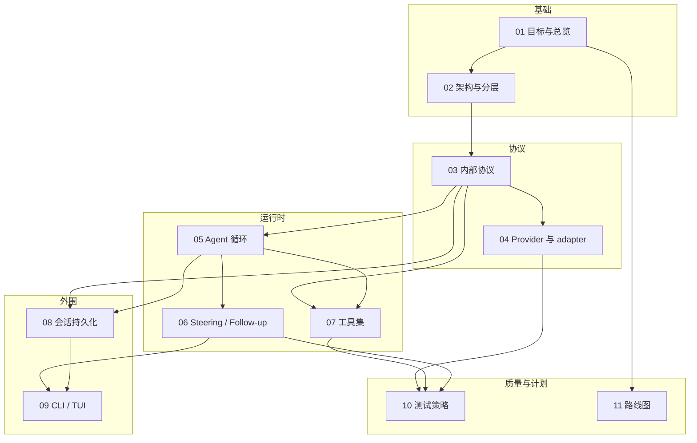

# coda 实施计划文档地图

**coda** 是一个从零实现的 TypeScript 终端 coding agent:核心只认自定义的内部协议,OpenAI Chat Completions、OpenAI Responses 与 Anthropic Messages 被严格隔离在各自 adapter 目录内;支持 steering / follow-up 双队列消息注入;内置 read、ls、grep、glob、bash、edit、write、plan 完整工具集。

本目录是该项目的完整实施计划,共 12 篇文档。它们不是事后补写的说明书,而是**先于代码的设计契约**:所有类型定义、命名、语义在这里敲定,实现阶段照此执行。

## 文档性质与约定

三条使用约定,适用于全部 12 篇:

1. **类型是 canonical 的。**文档中出现的 TS 类型定义(`AgentMessage`、`ProviderEvent`、`StreamFn`、`ToolDefinition` 等)在各篇之间逐字一致,以 [03 内部协议](./03-internal-protocol.md) 与各自宿主篇为准。实现时可以补充新字段、新类型,但不得改名、改语义。
2. **每篇独立可读,交叉引用用相对链接。**每篇开头一行面包屑回到本地图,结尾「相关文档」小节指向最相关的 2–4 篇。
3. **引用参考项目用短名。**正文写「pi-mono 的 agent-loop.ts」「codex 的 protocol.rs」这类短名,仓库全名统一列在本篇末尾的参考仓库表,不在正文里放长链接。

## 阅读顺序与依赖关系

推荐首次通读按编号顺序(01 → 11)。各篇之间的依赖关系如下,箭头由「先读」指向「后读」:

两点补充:11(路线图)只需读过 01 即可看懂,但要评审其排期合理性需要通读全部;10(测试)是横切篇,faux provider 与 fixture 的设计会反过来影响 adapter 与 loop 的代码形态,建议在动手写 M1 代码之前就扫一遍。

首次通读的编号顺序,供直接照做:

1. [01 目标与总览](./01-overview.md) —— 需求、决策、非目标
2. [02 架构与分层](./02-architecture.md) —— 目录与依赖规则
3. [03 内部协议](./03-internal-protocol.md) —— canonical 类型
4. [04 Provider 与 adapter](./04-provider-adapter.md) —— StreamFn、Chat Completions 与 Responses
5. [05 Agent 循环](./05-agent-loop.md) —— runLoop 与工具执行
6. [06 Steering / Follow-up](./06-steering-following.md) —— 双队列与 abort
7. [07 工具集](./07-tools.md) —— 八个工具的规格
8. [08 会话持久化](./08-session-persistence.md) —— JSONL 与 compaction
9. [09 CLI / TUI](./09-cli.md) —— 全屏交互、保底模式与 headless
10. [10 测试策略](./10-testing.md) —— faux provider 与 fixture
11. [11 路线图](./11-roadmap.md) —— M0–M7 与风险

## 文档摘要

### [01 目标与总览](./01-overview.md)

三条核心需求的工程化表述、二十条关键架构决策(每条附「为什么」与参考项目佐证)、四层类型体系一页图、技术选型、明确的非目标清单。评审整个计划从这里开始;后续任何一篇的设计都能回溯到本篇的某条决策。

### [02 架构与分层](./02-architecture.md)

canonical 目录结构(`protocol` / `providers` / `agent` / `tools` / `session` / `cli` / `shared`)与 ESLint 机械强制的依赖方向,以及一次 prompt 从键盘到 wire 协议再回到屏幕的端到端数据流。「SDK 只允许出现在所属 adapter，provider 互相隔离」这条铁律的执行细节在此定义。

### [03 内部协议](./03-internal-protocol.md)

全项目的类型基石:AgentMessage 消息模型(Part 化 content,错误与中止也是一等消息)、ProviderEvent 三段式流事件与 partial 快照、AgentEvent 事件面、Usage 统计口径、EventStream 载体类。其余所有文档引用的类型以本篇为准,是全套文档中唯一「不可协商」的一篇。

### [04 Provider 与 adapter](./04-provider-adapter.md)

StreamFn 接口契约(never-throw 铁律)、Chat Completions adapter 细节，以及 Responses 的 transcript replay、reasoning/function-call/terminal 事件转换契约。结尾附「新增一个 provider」的操作指南。

### [05 Agent 循环](./05-agent-loop.md)

Agent 类对外 API 与 runLoop 双层循环骨架:turn 生命周期、工具执行三阶段(prepare / execute / finalize)、parallel 与 sequential 调度规则、abort 传播路径,以及 `stopReason === 'length'` 时工具全批不执行等关键分支的完整决策树。

### [06 Steering / Follow-up](./06-steering-following.md)

双队列的精确语义:steering 在 turn 边界注入且会「续命」内层循环,follow-up 仅在任务将结束时被消费;one-at-a-time 与 all 两种 drain 模式;abort 与转录修复(transform 层过滤 aborted 消息、为孤儿 toolCall 补合成结果)的完整规则。需求 2 的唯一权威解释。

### [07 工具集](./07-tools.md)

ToolDefinition 框架(zod 参数、executionMode、promptSnippet)与统一截断落盘策略,然后逐一给出 read / ls / grep / glob / bash / edit / write / plan 八个工具的参数 schema、行为规格、边界情况与验收清单。edit(fuzzy 匹配层、read-before-edit 硬约束)与 bash(进程组、尾部截断)是篇幅最大的两节。

### [08 会话持久化](./08-session-persistence.md)

JSONL 追加式会话存储的行格式与恢复流程、上下文 compaction(LLM 摘要 + 保留尾部,M7)、token / 成本统计口径、auto-retry 策略。session 层与 agent 层的职责边界——谁决定 `continue()`、谁持有重试策略——在此划清。

### [09 CLI / TUI](./09-cli.md)

交互模式:Bun 1.3.14 + `@opentui/core` 全屏布局；stdin/stdout 均为 TTY 且 `TERM != dumb` 时启用。初始化失败先清理终端；已配置 key 时回退 classic,缺 key 的延迟校验会话关闭后退出 2。界面固定 header/prompt/footer,中间 Markdown 转录从顶部向下增长并在溢出后滚动；窄屏响应式收起 tips/Logo。classic readline/ANSI 与 plain 继续作为保底。键位保持 Enter=steer、Alt+Enter=followUp、Esc=abort；headless `--json` 的 stdin JSON / stdout NDJSON 协议不变,继续作为「内部协议对外暴露」的持续验证器。

### [10 测试策略](./10-testing.md)

分层测试:faux provider(脚本化 ProviderEventStream 回放)让 loop / steering 语义全离线可测;adapter 用录制的 SSE chunk fixture 回放(覆盖 tool_calls 分片、usage chunk、length 截断、in-band error、第三方方言);edit 用真实文件 fixture;OpenTUI 用内存 TestRenderer 做布局/键位回归;e2e 用 faux provider 驱动 CLI/headless。

### [11 路线图](./11-roadmap.md)

里程碑 M0–M7 各自的交付物、验收标准与依赖顺序,以及风险清单。M0 脚手架 → M1 协议 + EventStream + faux provider → M2 Chat Completions adapter → M3 loop + 七个工具 → M4 steering / abort / transform → M5 CLI + session → M6 plan 工具 + 权限 → M7 compaction + 第二 provider。

## 按角色的阅读路径

**我想尽快把代码跑起来(实现者)。**
01 → 02 → 11(知道先做哪块)→ 03 → 05 → 07,然后按里程碑回读对应篇:做 M2 精读 04,做 M4 精读 06,做 M5 精读 08、09。10(测试)在写第一行 protocol 代码前扫一遍——faux provider 与 fixture 的形态决定你怎么组织代码。

**我想搞懂协议设计(架构评审)。**
03 → 04 → 06 是核心三篇:内部协议长什么样、wire 协议如何被隔离、转录如何在打断后保持合法。再回看 01 的决策表,核对每条决策的出处与理由是否站得住。

**我负责工具实现。**
07 → 05(工具执行三阶段与调度语义)→ 03(ToolResultMessage / ImagePart / details 字段的确切含义)。edit 与 bash 是两块难啃的骨头,注意 07 中它们的边界情况清单。

**我负责测试与质量。**
10 → 03(EventStream 语义与迭代器契约)→ 04(SSE fixture 需要覆盖哪些方言分支)→ 06(steering 时序断言怎么写)。

**我只想知道做什么、不做什么(干系人)。**
01(目标、决策、非目标)→ 11(什么时候能看到什么)。共约 20 分钟。

## 术语表

### 运行时语义

**turn** —— 一次 assistant 响应 + 其全部工具执行。是 runLoop 内层循环的一次迭代,也是 steering 注入的边界单位。

**task(一次运行)** —— 从 `prompt()` / `continue()` 触发 `agent_start` 到 `agent_end` 的一次完整运行,含一个或多个 turn;follow-up 可在任务将结束时将其「续命」为更多 turn。

**steering** —— 运行期间注入的用户消息:不打断当前 turn(正在执行的工具跑完),在 turn 边界作为 `source: 'steering'` 的 UserMessage 追加进 context,并使内层循环继续。

**follow-up(following)** —— 排队等当前任务自然结束后才消费的用户消息:agent 无 toolCall、无 steering、即将 `agent_end` 时被 poll,有则开新 turn 续跑。

**注入点** —— 队列被 drain 的时机。steering 注入点 = 每个 turn 结束后(外加起跑前 poll 一次);follow-up 注入点 = 任务即将结束时。

**one-at-a-time / all** —— 队列 drain 模式:默认 one-at-a-time,每个注入点只取最老一条;all 一次取空整个队列。

**abort** —— 唯一的硬打断:AbortSignal 贯穿 provider 流与工具执行;被中断的 assistant 消息以 `stopReason: 'aborted'` 保留在转录中。

**synthetic** —— `source: 'synthetic'` 的 UserMessage:系统合成注入(如 plan 批准结果),复用 steering 的注入机制。

### 协议与类型

**AgentMessage / Part** —— 会话数据层:UserMessage / AssistantMessage / ToolResultMessage 三种消息,content 由 TextPart / ReasoningPart / ImagePart / ToolCallPart 等 Part 组成。

**Context** —— 一次 provider 请求的完整输入:systemPrompt + messages + tools(JSON Schema)。

**ProviderEvent** —— provider → agent 的流事件:start / text / reasoning / tool_call 各三段式(start / delta / end,带 contentIndex)+ done / error,每个事件携带逐步生长的 partial 快照。

**partial 快照** —— 每个 ProviderEvent 上附带的、到当前时刻为止的完整 AssistantMessage:消费端既可用 delta 增量渲染,也可只看快照,两种消费模式统一。

**AgentEvent** —— agent → session 的核心事件:agent / turn / message / tool_execution 各级生命周期 + queue_update / plan_update / approval_request 等。

**SessionEvent** —— session → UI/客户端的事件:透传并可注解 AgentEvent，再叠加 retry_scheduled / compaction_* / usage_update。headless 模式逐行序列化的正是这一联合。

**StreamFn** —— Agent 唯一认识的 provider 形态:`(model, context, options) => ProviderEventStream`。铁律:一旦被调用绝不 throw、绝不 reject,一切错误编码为流内 error 事件。

**EventStream** —— 自研的 AsyncIterable + `result()` Promise 载体;`ProviderEventStream` 即 `EventStream<ProviderEvent, AssistantMessage>` 的特化。

**ModelRef** —— `{ provider, api, model }` 三元组,AssistantMessage 自带,是跨模型迁移与 transform 层判断 `isSameModel` 的依据。

**StopReason** —— assistant 消息的终止原因:`stop | length | tool_calls | content_filter | error | aborted`;后两者也是合法消息,转录永远完整。

**Usage(inclusive 口径)** —— token 统计:`input` 含 cacheRead / cacheWrite,`output` 含 reasoning,消费方永不做减法;换算由各 adapter 完成。

### Provider 与 adapter

**adapter / provider** —— 把某家 API 的 wire 协议翻译为内部协议的模块,住在 `src/providers/<name>/`;两个 OpenAI adapter 允许 `import "openai"`，但彼此不得导入。

**wire 协议** —— 各家 API 的原始类型(如 `ChatCompletionMessageParam`、`ChatCompletionChunk`),只存在于 adapter 内部,严禁出现在其他层的签名中。

**transform 层** —— 每次出站请求前对转录做的清洗:过滤 aborted / error 的 assistant 消息、为孤儿 toolCall 补合成 isError 结果、跨模型 reasoning 降级、toolCallId 归一化——保证 wire 协议的配对约束永远合法。

**compat / CompatFlags** —— Chat Completions 方言差异的声明化开关(`maxTokensField`、`supportsDeveloperRole`、`supportsUsageInStreaming` 等),按 baseURL 自动推断 + 显式覆盖。

**faux provider** —— 脚本化回放 ProviderEventStream 的测试 provider,住在 `src/providers/faux/`,让 agent loop 与 steering 语义全离线可测。

### 工具与外围

**ToolDefinition** —— 工具的统一契约:name、description、zod `parameters`、可选 `executionMode` / `promptSnippet`、`execute(call, ctx)`。八个内置工具与未来的外部工具都实现它。

**executionMode: 'sequential'** —— 工具声明式的调度降级:批内任一工具声明它,整批 tool calls 退化为顺序执行(bash / edit / write 声明)。默认 parallel:preflight 顺序、执行并发、结果按源顺序回填。

**promptSnippet** —— 工具自带的使用指引片段,组装 system prompt 时拼入;plan 工具的行为规范(≥3 步才用、至多一个 in_progress(执行中应恰好一个))靠它下发。

**details** —— ToolResultMessage 上的结构化细节字段(如 edit 的 unified diff):UI 与持久化用,不发给模型。

**FileTracker / read-before-edit** —— 会话级 `{path → mtime}` 登记:edit / write 覆盖前校验该文件被读过且磁盘未变新,否则直接报错。

**截断落盘** —— 框架级 post-hook:工具输出超 2000 行 / 50KB 双上限时全文落盘临时目录,给模型的预览尾部附可执行续读提示(`Use offset=N to continue` 等)。

**compaction** —— 上下文接近上限时的压缩:LLM 摘要 + 保留尾部消息(M7)。

**headless 模式** —— CLI 的 `--json` 形态:stdin 收 JSON 命令({prompt | steer | follow_up | abort}),stdout 吐 NDJSON SessionEvent——内部协议对外暴露的验证器。

**approval / doom-loop** —— M6 权限层:`beforeToolCall` 钩子 + `approval_request` 事件 + Promise resolver 注册表;同工具同参数连续 3 次触发 doom-loop 强制审批。

**plan mode** —— 权限层的模式标志:写工具保留在工具列表但执行时报错(v2,依赖 M6 权限层)。与 plan 工具(todo 型,v1 / M6)是两回事。

## 参考仓库

| 仓库 | 我们从它学什么 |
|---|---|
| `badlogic/pi-mono` | 主要蓝本:agent loop 双层循环、steering 注入点语义、StreamFn never-throw 铁律、ProviderEvent 三段式、compat 声明化、edit fuzzy 归一化。 |
| `sst/opencode` | Part 化消息模型、权限系统(wildcard 规则 + Deferred 阻塞)、截断落盘常量、V1 依赖第三方 SDK 的返工教训。 |
| `openai/codex` | submit(Op) / next_event() 可序列化边界、pending_input 双语义队列、approval 决策语义(Denied vs Abort)、update_plan 工具形态、TurnAbortReason 分类。 |
| `vercel/ai` | LanguageModelV3 provider 接口范式、providerOptions 逃生舱、openai-compatible adapter 的既成流式状态机实现。 |
| `google-gemini/gemini-cli` | 工具调用显式状态机(pending → awaiting_approval → executing → …)、tree-sitter-bash 命令结构解析、grep 匹配少时自动附 context。 |
| `openai/openai-node` | Chat Completions 与 Responses wire 的事实细节:流式文本/reasoning/function-call 事件、tool call 累积与配对、terminal/usage/error 语义、SDK 错误体系。 |

## 里程碑与文档对照

按 [11 路线图](./11-roadmap.md) 施工时,每个里程碑动工前应精读的文档:

| 里程碑 | 主要交付 | 动工前精读 |
|---|---|---|
| M0 | 脚手架:Bun tsconfig / ESLint 边界 / `bun:test` / CI | 02 |
| M1 | protocol 类型 + EventStream + faux provider | 03、10 |
| M2 | Chat Completions adapter | 04、10 |
| M3 | agent loop + 工具框架 + 七个工具 | 05、07 |
| M4 | steering / follow-up + abort + transform 层 | 06 |
| M5 | CLI TUI/headless + session 持久化 | 09、08 |
| M6 | plan 工具 + 权限 / approval + 截断落盘完善 | 07、05 |
| M7 | compaction + auto-retry + 成本统计 + 第二 provider | 08、04 |

## canonical 类型的变更流程

实现过程中发现类型需要调整时(一定会发生),按以下流程走,避免文档间悄悄失配:

1. **加字段 / 加联合分支**:直接改类型的宿主篇(多数在 03,ToolDefinition 在 07,CompatFlags 在 04),同一次修改里 grep 全部文档,把引用了该类型的代码块同步;新增可选字段不算破坏性变更。
2. **改名 / 改语义**:视为设计变更,先回 [01 目标与总览](./01-overview.md) 检查是否推翻了某条决策,再改宿主篇,再同步引用处;涉及 wire 边界(需求 1)或注入点语义(需求 2)的改动必须同步更新 01 的验收清单。
3. **文档与代码冲突时**:以文档为准先行修订,代码跟随——反向「代码先改、文档后补」是 pi-mono AgentSession 失控路径的第一步,禁止。

## 相关文档

- [01 目标与总览](./01-overview.md) —— 从这里开始通读
- [02 架构与分层](./02-architecture.md) —— 目录结构与依赖规则
- [11 路线图](./11-roadmap.md) —— 里程碑与验收标准
