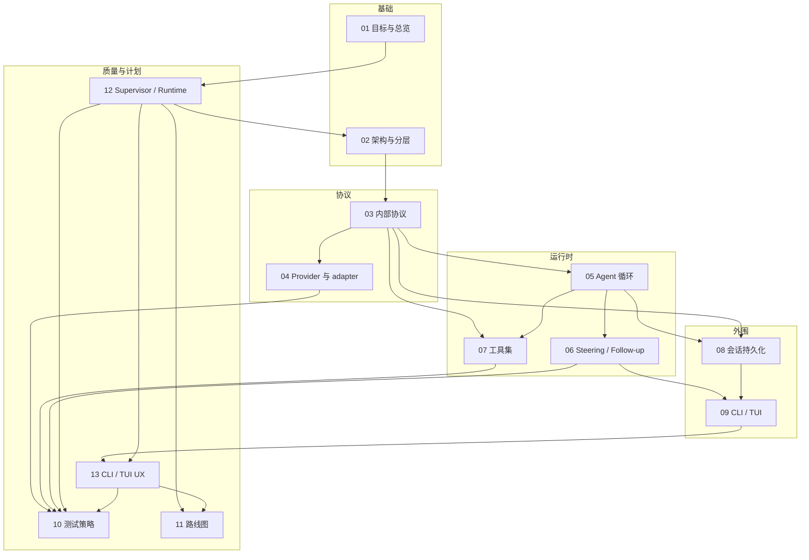

# coda 开发文档地图

**coda** 是一个从零实现的 TypeScript 终端 coding agent:核心只认自定义的内部协议,OpenAI Chat Completions、OpenAI Responses 与 Anthropic Messages 被严格隔离在各自 adapter 目录内;支持 steering / follow-up 双队列消息注入;内置 read、ls、grep、glob、bash、edit、write、plan 完整工具集。

本目录是该项目的开发文档入口，共 13 篇编号文档。它们同时承担**现行设计契约、实现参考与历史决策记录**：第 12 篇是多线程 Runtime 的总契约，第 13 篇是 CLI/TUI 的产品契约，第 11 篇记录已经完成的阶段和当前交付边界。带“阶段 0”“当时”等字样的段落用于解释迁移历史，不能覆盖同篇标明的当前实现基线。

## 当前实现基线

当前状态与 `main` 的 `b793a89`（2026-08-03）实现基线对齐；本次文档同步发生在其后的工作区中。

| 实现面 | 当前状态 | 主要入口 / 证据 |
|---|---|---|
| Runtime 阶段 0–3 | 全部完成 | `src/protocol/`、`src/session/`、`src/runtime/`、`src/capabilities/`；阶段提交见 [11](./11-roadmap.md) |
| CLI UX0–UX4 | 全部完成 | TUI、review/diff、session switch、fork/retry、PTY/性能与 automation output 已落地；classic/line REPL 已退役 |
| 交互 surface | 已收敛 | OpenTUI 是唯一长驻交互面；另保留 one-shot human output、legacy `--json` 与显式 envelope/output 模式 |
| capability composition | 双路径稳定 | `coda/runtime` + `coda/capabilities` 提供 opt-in registry mode；production CLI 与 direct `Agent`/`Session` 仍有意走 static compatibility path |
| 质量门禁 | 有已知加固项 | 本地 `bun run check` 可覆盖当前代码门禁；远端 workflow 的 Responses grep 仍有误拦，部分 internal-path 设计方向尚未形成完整 ESLint allowlist，见 [10 §8](./10-testing.md) / [02 §3.3](./02-architecture.md) |
| 后续路线 | 尚未立项 | 当前没有进行中的编号阶段；OAuth、MCP、server/client、持久 PTY shell、Windows 全矩阵等仍是明确边界，不应被写成已交付 |

阶段完成状态只在 [11 路线图](./11-roadmap.md) 和 [10 §9](./10-testing.md) 维护。其余专题文档中的空复选框是**相关改动时要重新执行的回归清单**，不是未完成 backlog；新增阶段时必须同时更新本节、11、10 §9 和受影响的设计契约。

## 文档性质与约定

四条使用约定,适用于全部 13 篇:

1. **类型是 canonical 的。**文档中出现的 TS 类型定义(`AgentMessage`、`ProviderEvent`、`StreamFn`、`ToolDefinition` 等)在各篇之间逐字一致,以 [03 内部协议](./03-internal-protocol.md) 与各自宿主篇为准。实现时可以补充新字段、新类型,但不得改名、改语义。
2. **每篇独立可读,交叉引用用相对链接。**每篇开头一行面包屑回到本地图,结尾「相关文档」小节指向最相关的 2–4 篇。
3. **引用参考项目用短名。**正文写「pi-mono 的 agent-loop.ts」「codex 的 protocol.rs」这类短名,仓库全名统一列在本篇末尾的参考仓库表,不在正文里放长链接。
4. **现状与历史显式分开。**“当前实现”“已完成”必须能由源码、测试或提交记录直接证明；迁移期的未来时态只保留在明确标为历史的段落中。专题验收清单默认是可重复执行的 review 模板，不能据其勾选状态推断项目进度。

## 阅读顺序与依赖关系

推荐首次先读总览与 Runtime 基线（01 → 12），再按 02 → 09 的专题顺序通读；进行终端产品工作时接着读 13，并以 10/11 的测试和阶段门禁收束。各篇之间的依赖关系如下,箭头由「先读」指向「后读」:

两点补充:11(路线图)读过 01/12 即可看懂,但要评审其排期合理性需要通读全部;10(测试)是横切篇,faux provider、并发 gate 与热更新剧本会反过来影响 runtime/agent 的代码形态，进入任何阶段实现前都应先读。

首次通读的编号顺序,供直接照做:

1. [01 目标与总览](./01-overview.md) —— 需求、决策、非目标
2. [12 Supervisor、多线程 Runtime 与能力快照](./12-supervisor-runtime.md) —— 新基线、身份、mailbox、取消、恢复、权限与兼容矩阵
3. [02 架构与分层](./02-architecture.md) —— 目录与依赖规则
4. [03 内部协议](./03-internal-protocol.md) —— canonical 类型
5. [04 Provider 与 adapter](./04-provider-adapter.md) —— StreamFn、Chat Completions、Responses 与 Anthropic Messages
6. [05 Agent 循环](./05-agent-loop.md) —— runLoop 与工具执行
7. [06 Steering / Follow-up](./06-steering-following.md) —— 双队列与 abort
8. [07 工具集](./07-tools.md) —— 八个工具的规格
9. [08 会话持久化](./08-session-persistence.md) —— JSONL 与 compaction
10. [09 CLI / TUI](./09-cli.md) —— 全屏交互、one-shot 与 headless
11. [13 CLI / TUI UX](./13-cli-ux.md) —— 用户旅程、surface 边界、恢复、安全与性能
12. [10 测试策略](./10-testing.md) —— faux provider、fixture 与 UX characterization
13. [11 路线图](./11-roadmap.md) —— Runtime 阶段 0–3、CLI UX0–UX4 与 review 门禁

## 文档摘要

### [01 目标与总览](./01-overview.md)

三条核心需求的工程化表述、二十条关键架构决策(每条附「为什么」与参考项目佐证)、四层类型体系一页图、技术选型、明确的非目标清单。评审整个计划从这里开始;后续任何一篇的设计都能回溯到本篇的某条决策。

### [02 架构与分层](./02-architecture.md)

canonical 目录结构（含 `protocol` / `capabilities` / `agent` / `session` / `runtime` / `cli`）、设计依赖方向、
当前 ESLint 机械覆盖与已知 gap，以及一次 op 从 RuntimePort 到 wire 再以 envelope 回到前端的端到端
数据流。「生产 SDK 只允许出现在所属 adapter，provider 互相隔离」这条铁律及手动 recorder 例外的
执行细节在此定义。

### [03 内部协议](./03-internal-protocol.md)

全项目的类型基石：五类 opaque identity、RuntimeOp/OpReceipt、per-thread seq EventEnvelope、AgentMessage、ProviderEvent、AgentEvent、Usage 与 EventStream。其余所有文档引用的协议类型以本篇和 12 为准。

### [04 Provider 与 adapter](./04-provider-adapter.md)

StreamFn 接口契约（never-throw 铁律）、Chat Completions、OpenAI Responses 与 Anthropic Messages
adapter 细节，以及 model directory / static compatibility dispatch / opt-in ProviderAdapterRegistry 的
双路径边界。Anthropic 作为已落地范例承载「新增 provider」操作指南。

### [05 Agent 循环](./05-agent-loop.md)

Agent 类对外 API 与 runLoop 双层循环骨架:turn 生命周期、工具执行三阶段(prepare / execute / finalize)、parallel 与 sequential 调度规则、abort 传播路径,以及 `stopReason === 'length'` 时工具全批不执行等关键分支的完整决策树。

### [06 Steering / Follow-up](./06-steering-following.md)

双队列的精确语义:steering 在 turn 边界注入且会「续命」内层循环,follow-up 仅在任务将结束时被消费;one-at-a-time 与 all 两种 drain 模式;abort 与转录修复(transform 层过滤 aborted 消息、为孤儿 toolCall 补合成结果)的完整规则。需求 2 的唯一权威解释。

### [07 工具集](./07-tools.md)

JSON-Schema-first CapabilityRegistry、不可变 snapshot、PreparedInvocation 与 PolicyEngine 的目标契约，以及 legacy ToolDefinition adapter 和八个内置工具的行为规格。edit/read-before-edit 与 bash/进程组仍是风险最高的实现边界。

### [08 会话持久化](./08-session-persistence.md)

ThreadRuntime、TranscriptRepository、RetryCoordinator、CompactionCoordinator、EventCommitter、EventHub 六个协作者，以及 thread journal、seq high-water、mailbox/control、恢复 lease、legacy JSONL 的兼容规则。

### [09 CLI / TUI](./09-cli.md)

CLI 作为 RuntimePort 的参数/configuration 与前端 adapter；OpenTUI 是唯一长驻交互面，one-shot human renderer 与默认 headless 分别保留人类脚本输出和裸 SessionEvent，显式 envelope 模式输出 identity/seq。stdout drain 只约束前端输出泵，不反向背压 Agent。

### [10 测试策略](./10-testing.md)

分层测试:faux provider(脚本化 ProviderEventStream 回放)让 loop / steering 语义全离线可测;adapter 用录制的 SSE chunk fixture 回放(覆盖 tool_calls 分片、usage chunk、length 截断、in-band error、第三方方言);edit 用真实文件 fixture;OpenTUI 用内存 TestRenderer 做布局/键位回归;e2e 用 faux provider 驱动 CLI/headless。

### [11 路线图](./11-roadmap.md)

已完成的阶段 0–3 路线：契约与 characterization → identity/envelope/RuntimePort → Session 六协作者与事件通道 → registry/snapshot/prompt/policy；随后完成 CLI UX0–UX4。当前没有 active 编号阶段，M0–M7 仅保留为历史实现索引。

### [12 Supervisor、多线程 Runtime 与能力快照](./12-supervisor-runtime.md)

阶段 0–3 的权威演进契约：从进程级单 Agent 改为每线程单 active run，由 Supervisor 管理可并发的独立线程；冻结五类身份、per-thread seq 信封、mailbox、取消/恢复、权威提交与异步观察者、权限降权、JSON-Schema-first registry/snapshot，以及旧 Session/headless 的兼容矩阵。

### [13 CLI / TUI UX](./13-cli-ux.md)

UX0–UX4 的权威产品契约：六条核心用户旅程，TUI、one-shot 与 headless 的边界，统一命令规格、每 thread presentation state、终端 sanitizer、极端终端环境和性能 characterization，以及恰好两轮 review 的阶段门禁。

## 按角色的阅读路径

**我想尽快把代码跑起来(实现者)。**
01 → 12 → 11（确认当前基线）→ 02 → 03 → 10；进行终端产品工作时再精读 09/13。新增阶段前先在 11 建立范围和门禁，不要继续沿用已完成的 UX0–UX4 名称。

**我想搞懂协议设计(架构评审)。**
12 → 03 → 04 → 06：先看 identity/envelope 总契约，再看内部协议、wire 隔离和 thread-local mailbox/取消。

**我负责工具实现。**
07 → 05(工具执行三阶段与调度语义)→ 03(ToolResultMessage / ImagePart / details 字段的确切含义)。edit 与 bash 是两块难啃的骨头,注意 07 中它们的边界情况清单。

**我负责测试与质量。**
10 → 13(终端环境、parity 与性能门禁)→ 03(EventStream 语义与迭代器契约)→ 04(SSE fixture 需要覆盖哪些方言分支)→ 06(steering 时序断言怎么写)。

**我只想知道做什么、不做什么(干系人)。**
01(目标、决策、非目标)→ 11(什么时候能看到什么)→ 13(终端产品会怎样工作)。共约 25 分钟。

## 术语表

### 运行时语义

**turn** —— 一次 assistant 响应 + 其全部工具执行。是 runLoop 内层循环的一次迭代,也是 steering 注入的边界单位。

**workspace** —— Supervisor 的资源、provider 配置与权限上限边界。

**thread** —— transcript、mailbox、取消、恢复、权限状态与 per-thread seq 的隔离边界；每个 thread 至多一个 active run。

**run** —— 从 `prompt()` / `continue()` 触发 `agent_start` 到 `agent_end` 的一次执行，具有唯一 RunId；retry/compaction 续跑创建 successor RunId。旧文档中的 task 通常指 run。

**op** —— 调用方提交给 RuntimePort 的身份化操作，具有幂等 OpId；thread op 只目标一个 thread，
workspace scope op 则在接收时冻结多个 thread/run 目标快照。

**steering** —— 运行期间注入的用户消息:不打断当前 turn(正在执行的工具跑完),在 turn 边界作为 `source: 'steering'` 的 UserMessage 追加进 context,并使内层循环继续。

**follow-up(following)** —— 排队等当前任务自然结束后才消费的用户消息:agent 无 toolCall、无 steering、即将 `agent_end` 时被 poll,有则开新 turn 续跑。

**注入点** —— 队列被 drain 的时机。steering 注入点 = 每个 turn 结束后(外加起跑前 poll 一次);follow-up 注入点 = 任务即将结束时。

**one-at-a-time / all** —— 队列 drain 模式:默认 one-at-a-time,每个注入点只取最老一条;all 一次取空整个队列。

**abort** —— 唯一的硬打断:AbortSignal 贯穿 provider 流与工具执行;被中断的 assistant 消息以 `stopReason: 'aborted'` 保留在转录中。

**synthetic** —— `source: 'synthetic'` 的 UserMessage:系统合成注入(如 plan 批准结果),复用 steering 的注入机制。

### 协议与类型

**AgentMessage / Part** —— 会话数据层:UserMessage / AssistantMessage / ToolResultMessage 三种消息,content 由 TextPart / ReasoningPart / ImagePart / ToolCallPart 等 Part 组成。

**Context** —— 一次 provider 请求的完整输入:systemPrompt + messages + tools(JSON Schema)。

**ProviderEvent** —— provider → agent 的流事件:start / text / reasoning / tool_call 各三段式(start / delta / end,带 contentIndex)+ done / error,每个事件携带逐步生长的 partial 快照。

**partial 快照** —— 每个 ProviderEvent 上附带的、到当前时刻为止的完整 AssistantMessage:消费端既可用 delta 增量渲染,也可只看快照,两种消费模式统一。

**AgentEvent** —— agent → session 的核心事件:agent / turn / message / tool_execution 各级生命周期 + queue_update / plan_update / approval_request 等。

**EventEnvelope** —— Runtime 的 canonical 外部事件：携带 WorkspaceId/ThreadId、可选 RunId/TurnId/OpId 与严格递增的 per-thread seq；SessionEvent 是其 legacy 投影。

**SessionEvent** —— session → UI/客户端的事件:透传并可注解 AgentEvent，再叠加 retry_scheduled / compaction_* / usage_update。headless 模式逐行序列化的正是这一联合。

**StreamFn** —— Agent 唯一认识的 provider 形态:`(model, context, options) => ProviderEventStream`。铁律:一旦被调用绝不 throw、绝不 reject,一切错误编码为流内 error 事件。

**EventStream** —— 自研的 AsyncIterable + `result()` Promise 载体;`ProviderEventStream` 即 `EventStream<ProviderEvent, AssistantMessage>` 的特化。

**ModelRef** —— `{ provider, api, model }` 三元组,AssistantMessage 自带,是跨模型迁移与 transform 层判断 `isSameModel` 的依据。

**StopReason** —— assistant 消息的终止原因:`stop | length | tool_calls | content_filter | error | aborted`;后两者也是合法消息,转录永远完整。

**Usage(inclusive 口径)** —— token 统计:`input` 含 cacheRead / cacheWrite,`output` 含 reasoning,消费方永不做减法;换算由各 adapter 完成。

### Provider 与 adapter

**adapter / provider** —— 把某家 API 的 wire 协议翻译为内部协议的模块,住在
`src/providers/<name>/`；两个 OpenAI adapter 只能各自在白名单内 import `openai`，Anthropic
Messages adapter 只能在自己的白名单内 import `@anthropic-ai/sdk`，三个真实 adapter 彼此不得导入。

**wire 协议** —— 各家 API 的原始类型(如 `ChatCompletionMessageParam`、`ChatCompletionChunk`)在
生产 `src/` 中只存在于 adapter 内部，严禁出现在其他层的签名中；手动 fixture recorder 可在
`scripts/` 内以局部 lint 说明直接读取 wire。

**transform 层** —— 每次出站请求前对转录做的清洗:过滤 aborted / error 的 assistant 消息、为孤儿 toolCall 补合成 isError 结果、跨模型 reasoning 降级、toolCallId 归一化——保证 wire 协议的配对约束永远合法。

**compat / CompatFlags** —— Chat Completions 方言差异的声明化开关(`maxTokensField`、`supportsDeveloperRole`、`supportsUsageInStreaming` 等),按 baseURL 自动推断 + 显式覆盖。

**faux provider** —— 脚本化回放 ProviderEventStream 的测试 provider,住在 `src/providers/faux/`,让 agent loop 与 steering 语义全离线可测。

### 工具与外围

**ToolDefinition** —— 八个既有工具的 legacy 契约；阶段 3 由 adapter 注册为 JSON-Schema-first
capability。新的 core 消费 ToolCatalogSnapshot/PreparedInvocation，不直接查 ToolDefinition。

**CapabilityRegistration / ToolCatalogSnapshot** —— schema、validator、executor、prompt metadata 的
原子版本与每 turn 不可变快照；registry 更新只影响后续 turn。

**executionMode: 'sequential'** —— 工具声明式的调度降级:批内任一工具声明它,整批 tool calls 退化为顺序执行(bash / edit / write 声明)。默认 parallel:preflight 顺序、执行并发、结果按源顺序回填。

**promptSnippet** —— 工具自带的使用指引片段,组装 system prompt 时拼入;plan 工具的行为规范(≥3 步才用、至多一个 in_progress(执行中应恰好一个))靠它下发。

**details** —— ToolResultMessage 上的结构化细节字段(如 edit 的 unified diff):UI 与持久化用,不发给模型。

**FileTracker / read-before-edit** —— 会话级 `{path → mtime}` 登记:edit / write 覆盖前校验该文件被读过且磁盘未变新,否则直接报错。

**截断落盘** —— 框架级 post-hook:工具输出超 2000 行 / 50KB 双上限时全文落盘临时目录,给模型的预览尾部附可执行续读提示(`Use offset=N to continue` 等)。

**compaction** —— 上下文接近上限时的压缩：LLM 摘要 + 保留尾部消息；successor run 使用新 RunId。

**headless 模式** —— RuntimePort 的 stdin/stdout adapter；默认格式保留裸 NDJSON SessionEvent，
显式 envelope 格式暴露 identity/per-thread seq。

**approval / doom-loop** —— 当前兼容层使用 beforeToolCall/broker；阶段 2 统一为 control op/event，
阶段 3 由 PolicyEngine 基于 PreparedInvocation 与身份上下文决策。

**plan mode** —— 后续产品模式；与现有 plan capability（todo 列表）是两回事，不属于阶段 0–3。

## 参考仓库

| 仓库 | 我们从它学什么 |
|---|---|
| `badlogic/pi-mono` | 主要蓝本:agent loop 双层循环、steering 注入点语义、StreamFn never-throw 铁律、ProviderEvent 三段式、compat 声明化、edit fuzzy 归一化。 |
| `sst/opencode` | Part 化消息模型、权限系统(wildcard 规则 + Deferred 阻塞)、截断落盘常量、V1 依赖第三方 SDK 的返工教训。 |
| `openai/codex` | submit(Op) / next_event() 可序列化边界、pending_input 双语义队列、approval 决策语义(Denied vs Abort)、update_plan 工具形态、TurnAbortReason 分类。 |
| `vercel/ai` | LanguageModelV3 provider 接口范式、providerOptions 逃生舱、openai-compatible adapter 的既成流式状态机实现。 |
| `google-gemini/gemini-cli` | 工具调用显式状态机(pending → awaiting_approval → executing → …)、tree-sitter-bash 命令结构解析、grep 匹配少时自动附 context。 |
| `openai/openai-node` | Chat Completions 与 Responses wire 的事实细节:流式文本/reasoning/function-call 事件、tool call 累积与配对、terminal/usage/error 语义、SDK 错误体系。 |

## 已完成阶段与文档对照

下表用于回溯既有实现为什么依赖这些契约，也可作为同一领域后续改动的阅读索引：

| 阶段 | 主要交付 | 动工前精读 |
|---|---|---|
| 0 | 设计契约 + characterization baseline | 01、10、11、12 |
| 1 | identity/envelope + RuntimePort/Supervisor + legacy projection | 02、03、09、12 |
| 2 | Session 六协作者 + commit/hub + control 统一 | 05、06、08、10、12 |
| 3 | capability/provider registry + prompt + policy | 04、07、10、12 |
| UX0 | 终端产品契约 + characterization baseline | 09、10、11、12、13 |
| UX1 | CLI/onboarding/sanitizer 与历史交互面收敛 | 09、10、13 |
| UX2 | TUI hierarchy/composer/transcript | 09、10、13 |
| UX3 | review/diff/session recovery | 08、09、10、12、13 |
| UX4 | TUI performance/automation/PTY | 09、10、13 |

旧 M0–M7 只用于解释现有测试/注释来源，历史对照见 [11 §6](./11-roadmap.md)。

## canonical 类型的变更流程

实现过程中发现类型需要调整时(一定会发生),按以下流程走,避免文档间悄悄失配:

1. **加字段 / 加联合分支**：先改宿主契约（identity/op/envelope/Supervisor 在 12 与 03，
   capability/policy 在 07，provider adapter 在 04），同一次修改里检索并同步全部引用。
2. **改名 / 改语义**:视为设计变更,先回 [01 目标与总览](./01-overview.md) 检查是否推翻了某条决策,再改宿主篇,再同步引用处;涉及 wire 边界(需求 1)或注入点语义(需求 2)的改动必须同步更新 01 的验收清单。
3. **文档与代码冲突时**：先用测试、提交记录与上位契约确认预期。若代码是有意的行为变更，同一工作项同步修订宿主文档和回归测试；若代码违反契约，则修代码。禁止在没有确认语义的情况下只改其中一边。

## 相关文档

- [01 目标与总览](./01-overview.md) —— 从这里开始通读
- [02 架构与分层](./02-architecture.md) —— 目录结构与依赖规则
- [11 路线图](./11-roadmap.md) —— 阶段门禁与验收标准
- [12 Supervisor Runtime](./12-supervisor-runtime.md) —— identity、线程、事件与兼容总契约
